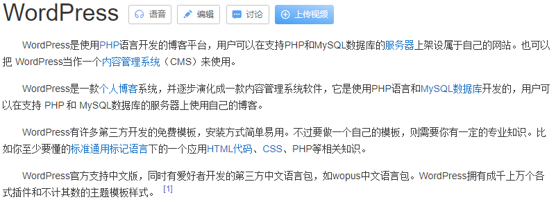

1.介绍

Swarm 是使⽤SwarmKit构建的 Docker 引擎内置（原⽣）的集群管理和编排⼯具。 Docker Swarm 是 Docker 官⽅三剑客项⽬之⼀，提供 Docker 容器集群服务，是 Docker 官⽅对容器云⽣态进⾏⽀持的 核⼼⽅案。

使⽤它，⽤户可以将多个 Docker 主机封装为单个⼤型的虚拟 Docker 主机，快速打造⼀套容器云平 台。Swarm mode 内置 kv 存储功能，提供了众多的新特性，⽐如：具有容错能⼒的去中⼼化设计、内 置服务发现、负载均衡、路由⽹格、动态伸缩、滚动更新、安全传输等。使得 Docker 原⽣的 Swarm 集群具备与 Mesos 、 Kubernetes 竞争的实⼒（Kubernetes 发展到现在,已经把竞争对手甩开了,重点是Kubernetes ,但是还是要了解Swarm 的使用方法）。使⽤ Swarm 集群之前需要了解以下⼏个概念。


节点:

运⾏ Docker 的主机可以主动初始化⼀个 Swarm 集群或者加⼊⼀个已存在的 Swarm 集群，这样这个运⾏ Docker 的主机就成为⼀个 Swarm 集群的节点 (node) 。节点分为 管理 (manager) 节点和⼯作 (worker) 节点 。

- 管理节点⽤于 Swarm 集群的管理， docker swarm 命令基本只能在管理节点执⾏（节点退出集群命 令 docker swarm leave 可以在⼯作节点执⾏）。⼀个 Swarm 集群可以有多个管理节点，但只有⼀个 管理节点可以成为 leader ，leader 通过 raft 协议(一致性协议)实现。 

- ⼯作节点是任务执⾏节点，管理节点将服务 ( service ) 下发⾄⼯作节点执⾏。管理节点默认也作为⼯ 作节点。你也可以通过配置让服务只运⾏在管理节点。来⾃ Docker 官⽹的这张图⽚形象的展示了集群 中管理节点与⼯作节点的关系。


.png)


服务和任务:

任务（Task） 是 Swarm 中的最⼩的调度单位，⽬前来说就是⼀个单⼀的容器； 服务（Services） 是 指⼀组任务的集合，服务定义了任务的属性。服务有两种模式： 

- replicated services 按照⼀定规则在各个⼯作节点上运⾏指定个数的任务。 

- global services 每个⼯作节点上运⾏⼀个任务

两种模式通过 docker service create 的 --mode 参数指定。来⾃ Docker 官⽹的这张图⽚形象的展示 了容器、任务、服务的关系。

.png)


2.使用示例

初始化集群,我们这⾥利⽤上⼀节的 docker machine 来充当集群的主机，⾸先先创建⼀个 manager 节点(也可以创建多个manager节点)，然后在该 节点上执⾏初始化集群命令：

- 示例1:创建nginx服务

```javascript
#创建manager节点
docker-machine create -d virtualbox manager

#方式1(CMD中执行):
	#根据上面命令的提示输入以下命令(CMD中执行)
	C:\Users\WuJun\bin\docker-machine.exe env manager

	#根据上面命令的提示输入以下命令(CMD中执行)
	@FOR /f "tokens=*" %i IN ('"C:\Users\WuJun\bin\docker-machine.exe" env manager') DO @%i

#方式2(GitBash中执行):
	#输出以下命令
	docker-machine env manager

	#根据上面命令的提示输入一下命令(git bash中执行)
	eval $("C:\Users\WuJun\bin\docker-machine.exe" env manager)

#查看docker版本,client仍然是本地的client版本,但server版本是刚刚启动的virtualbox虚拟主机中的docker版本.
#"CMD"或"git bash都可以运行此命令"
docker-version

#创建work节点
docker-machine create -d virtualbox work1
docker-machine create -d virtualbox work2
```


```javascript
#在节点中创建nginx服务

#查看machine
docker-machine ls

#进入到manager节点
docker-machine ssh manager

#执行初始化,"--advertise-addr"这个地址就是manager的地址,如果只有一个网卡可以不指定这个地址,多个网卡的话就要指定
docker swarm init --advertise-addr 192.168.99.101

#运行上面命令打印出如下信息, 说明了如何添加manager节点和work节点:
Swarm initialized: current node (iucyuyrvapbgo4ix5fnaiwvmu) is now a manager.

To add a worker to this swarm, run the following command:

    docker swarm join --token SWMTKN-1-089xdanyhsyxb6w1tvo11pqbop061rnquu6yvzmoau1eswj78f-dowgehnwsnbk86owe7loihgt5 192.168.99.101:2377

To add a manager to this swarm, run 'docker swarm join-token manager' and follow the instructions.

#退出manager节点或重新打开一个gitbash
exit

#进入到work节点:
docker-machine ssh work1
docker swarm join --token SWMTKN-1-089xdanyhsyxb6w1tvo11pqbop061rnquu6yvzmoau1eswj78f-dowgehnwsnbk86owe7loihgt5 192.168.99.101:2377
exit

docker-machine ssh work2
docker swarm join --token SWMTKN-1-089xdanyhsyxb6w1tvo11pqbop061rnquu6yvzmoau1eswj78f-dowgehnwsnbk86owe7loihgt5 192.168.99.101:2377
exit

#进入到manager节点,运行下面命令查看节点信息,这就是一个最小的swam集群
docker-machine ssh manager
#可以看到2个work节点,1个manager节点,可以看到manager是个leader,如果有多个manager会自己去选择一个leader
docker node ls

#查看集群中的服务
docker service ls

#创建3个实例服务(这里创建ngixn服务),"-p"表示把节点的端口映射到容器.
docker service create --replicas 3 -p 80:80 --name nginxService nginx:latest

#查看集群中的服务,可以看到REPLICAS是3/3,表明有三个nginx服务,可以用这三个节点的任意一个节点来访问nginx
docker service ls

#验证,退出节点
#exit
#查看三个节点的IP
docker-machine ls
#浏览器中依次打开下面三个地址看能否返回nginx主页
192.168.99.101:80
192.168.99.102:80
192.168.99.103:80 

#进入到manager节点
docker-machine ssh manager

#查看nginx服务,可以发现里面跑了三个实例,"name"这一列代表任务,也就是容器. 
docker service ps nginxService

#查看日志，如果再网页刷新就会看到日志打印
docker service logs -f nginxService

#如果把三个节点加入到负载均衡中,外面的用户通过负载均衡访问进来就可以把流量分发到这三个节点上,这样就实现了负载均衡,
#负载均衡对无状态应用非常好,可以横向扩展,比如三个实例，如果某天业务比较吃紧,然后就可以把实例扩展到更多,非常方便.

#删除服务
docker service rm nginxService

#删除后查看服务已经不在了
docker service ls
docker ps

```


- 示例2:创建wordpress服务




[WordPress.zip](attachments/10156479B1394B68B138AF2E9DADB080wordpress.zip)

使用"docker-machine create ..."一次只能部署一个服务.

同样可以在swarm集群中使用Docker Compose模板文件一次配置启动多个服务(容器).

使用wordpress为例:

wordpress的官方镜像地址: https://hub.docker.com/_/wordpress

```javascript
#"docker-compose.yml"对格式要求严格,行要有正确的缩进
docker-compose.yml

version: "3"
services:
    wordpress:
		image: wordpress	#镜像
		ports:
			- 80:80			#把wordpress容器中的端口暴露到节点上的端口上
		networks:
			- overlay		#使用overlay网络
		environment:		#环境变量
			WORDPRESS_DB_HOST: db:3306	#这个db是个服务名称,要和下面的名称保持一致.
			WORDPRESS_DB_USER: wordpress
			WORDPRESS_DB_PASSWORD: wordpress
		deploy:
			mode: replicated
			replicas: 3		#要部署3个wordpress实例

    db:			#如果这个名称是mysql,在wordpress节点下的environment下的WORDPRESS_DB_HOST值就为"mysql:3306",上下名称要保持一致
        image: mysql
        networks:
            - overlay
        volumes:						#db是有状态的一个服务,所以需要把数据卷挂载出来
            - db-data:/var/lib/mysql	#把mysql的路径挂载到数据卷 中,这样以后容器删掉数据卷仍然在,除非手动把数据卷删掉.
        environment:					#mysql的环境变量
            MYSQL_ROOT_PASSWORD: somewordpress
            MYSQL_DATABASE: wordpress	#数据库
            MYSQL_USER: wordpress		#用户名
            MYSQL_PASSWORD: wordpress	#密码
        deploy:
            placement:
                constraints: [node.role == manager]	#Swarm调度,主要用于"Docker Swarm"调度策略使用,意思是把DB这个容器调度到节点的角色是manager这个节点上面去

    visualizer:
        image: dockersamples/visualizer:stable	#可视化镜像,主要是用来在界面展示Docker Swarm部署的一个情况,这个镜像不是必须的.
        ports:
            - "8080:8080"
        stop_grace_period: 1m30s
        volumes:
            - "/var/run/docker.sock:/var/run/docker.sock"
        deploy:
            placement:
                constraints: [node.role == manager] #同样是把这个容器调度到节点的角色是manager这个节点上面去

volumes:	#数据卷
    db-data:
networks:
    overlay:

```


在docker官网可以看到"Docker Swarm"调度策略的文档: https://docs.docker.com/swarm/scheduler/filter/

可以看到有依赖、端口、亲和性、健康检查、节点等相关的信息.


- 通过swarm部署Docker Compose的yml文件,来启动多个关联的服务.

- 如果没有初始化的"docker swarm"集群, 同样先要创建manager和work节点然后初始化swarm集群。如果已存在Swarm集群可以直接加入.

如下(假如不存在"docker swarm"集群):

```javascript
#创建manager和work节点
docker-machine create -d virtualbox --virtualbox-no-vtx-check manager
docker-machine create -d virtualbox --virtualbox-no-vtx-check work1
docker-machine create -d virtualbox --virtualbox-no-vtx-check work2

#查看machine的IP
docker-machine ls

#进入到manager节点
docker-machine ssh manager

#执行初始化,"--advertise-addr"这个地址就是manager的地址,如果只有一个网卡可以不指定这个地址,多个网卡的话就要指定
docker swarm init --advertise-addr 192.168.99.106

#运行上面命令打印出如下信息, 说明了如何添加manager节点和work节点:
	To add a worker to this swarm, run the following command:

		docker swarm join --token SWMTKN-1-5x6o21uybnz9g3rinuw12zbgehz9gkx1y949d7sa5z5lxq8ng8-0asecv950mvdbvslas3dqmrln 192.168.99.106:2377

	To add a manager to this swarm, run 'docker swarm join-token manager' and follow the instructions.

#退出manager节点,进入到work节点,并将work节点加入到swarm中
exit
docker-machine ssh work1
docker swarm join --token SWMTKN-1-5x6o21uybnz9g3rinuw12zbgehz9gkx1y949d7sa5z5lxq8ng8-0asecv950mvdbvslas3dqmrln 192.168.99.106:2377
exit
docker-machine ssh work2
docker swarm join --token SWMTKN-1-5x6o21uybnz9g3rinuw12zbgehz9gkx1y949d7sa5z5lxq8ng8-0asecv950mvdbvslas3dqmrln 192.168.99.106:2377

#查看集群中的服务,因为这是新创建的节点所以没有任何服务
docker service ls

#在终端中进入到"docker-compose.yml"文件所在的目录下并运行以下命令
docker stack deploy -c docker-compose.yml wordpressService

#创建完成后,使用如下命令查看, "docker-compose.yml"文件中有3个服务,所以查看的结果有3个服务才正确
docker stack ls

#用如下命令查看有3个服务,发现REPLICAS都是0/1、0/1、0/3,表示实例都没有创建成功,应该还在拉取镜像
docker service ls

#稍微等几分钟,拉取镜像的速度跟网络质量有关系

#运行下面命令可以看到3个服务的IP
docker-machine ls

#在浏览器中打开任意一个节点的8080端口可以看到可视化界面
http://192.168.99.106:8080/
http://192.168.99.107:8080/
http://192.168.99.108:8080/

#在可视化界面可以看到3个wordpress服务分别在manager、work1、work2节点上, 
#db和visualizer只部署在了manager节点上,这是因为在"docker-compose.yml"文件中把db和visualizer都调度到了manager节点上.

#查看wordpress的日志
docker service logs -f wordpressService_wordpress

#在浏览器中打开任意一个节点的80端口可以看到wordpress的主页
http://192.168.99.106:80
http://192.168.99.107:80
http://192.168.99.108:80

```


3.docker swarm总结

示例1和2的整个过程就是服务编排,wordpress分别部署在3个节点.编排的意思就是把多个节点当成一个节点来使用,wordpress是跑在三个节点上的,这样就给服务带来了很大的便利性,比如某一天wordpress的访问量特别大了,三个节点都扛不住了,就可以增加几个工作节点部署wordpress实例来分担访问压力.这是Docker Swarm的一个基本功能,但是k8s比Docker Swarm的功能强大很多,当然也复杂很多.学习k8s的前提一定要把docker掌握好,虽然k8s不是一定依赖docker,但是一般情况下还是会把docker跑到k8s里面.


在后面的课程当中可以不掌握docker machine、docker swarm这种集群方式,但是一定要把docker的基本命令掌握, 只有掌握好了docker的基本命令(docker ps,docker pull,docker push)后在接下来的课程中学习k8s才不会那么吃力,遇到问题才知道怎么排查.


Docker Compose还好,最好还是学习一下,把它掌握了.


4. linux命令eval的用法.


参考:https://www.cnblogs.com/triple-y/p/11236082.html

