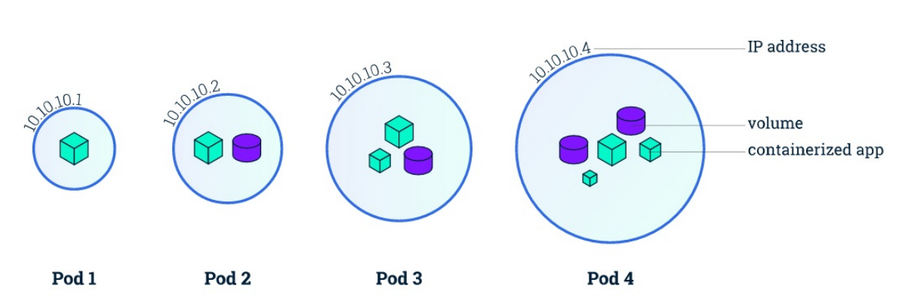
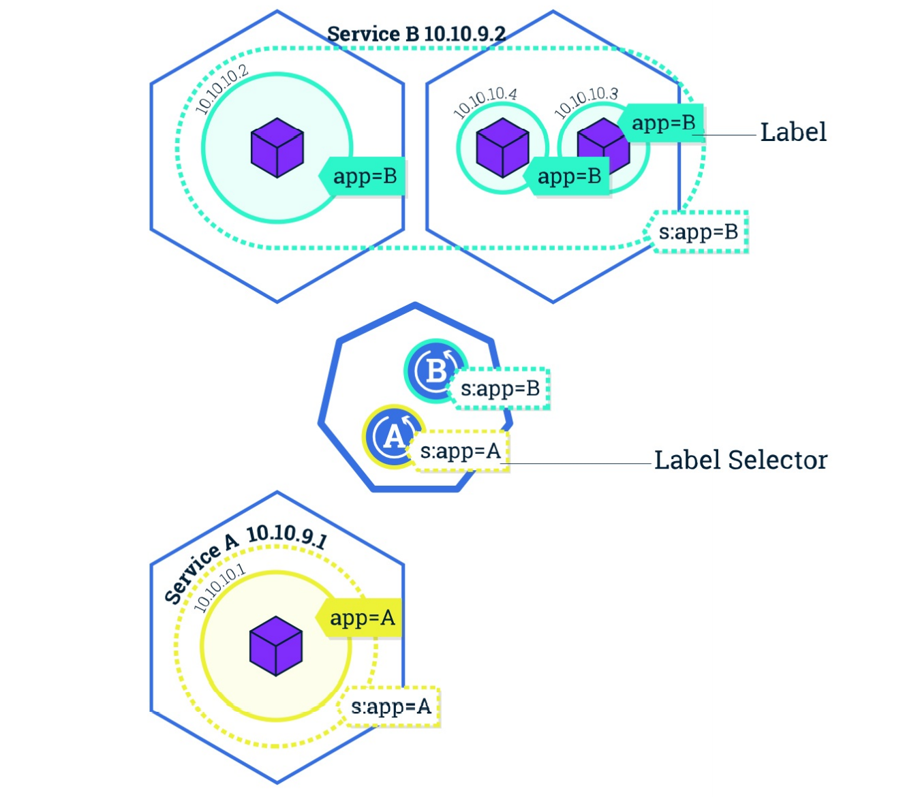

1.简介

Kubernetes 是 Google 团队发起的⼀个开源项⽬，它的⽬标是管理跨多个主机的容器，⽤于⾃动部 署、扩展和管理容器化的应⽤程序，主要实现语⾔为 Go 语⾔。Kubernetes 的组件和架构还是相对较 复杂，先使⽤Kubernetes去体验下⾥⾯的⼀些概念和⽤法，对这些基本概念熟悉 以后再讲解Kubernetes的组件和架构应该就更加容易了.

如果完完全全都我们⼿动去搭建的 话，第⼀是太耗时，第⼆是太复杂，我们先可以使⽤以下⼯具来辅助我们.


(1). katacoda 的课程：可以在⽹站上帮我们启动⼀个minikube的环境（学习）

https://www.katacoda.com/courses/kubernetes


(2).需要我们⾃⼰来搭建的 - Rancher ，我们之前给⼤家介绍过，如果你⽹速不好的话安装 Rancher 可能需要花费⼀点时间，不过这是值得的。（测试）

https://rancher.com/

```javascript
docker run -d --restart=unless-stopped -p 80:80 -p 443:443 rancher/rancher:v2.0.0 # 查看 ⽇志 
docker logs -f rancher
```

  Rancher推荐在测试环境使用,线上环境最好不用,因为它相当于在k8s上包了一层,出了问题排查不是很方便.


(3).Docker for MAC/Windows（推荐）/minikube/（本地）

Docker for MAC/Windows已经集成k8s

minikube (https://github.com/kubernetes/minikube) 可以在linux上使用.


Docker for MAC/Windows 和 minikube 安装之前需要安装kubectl⼯具，

kubectl是非常重要的工具.

kubectl: https://kubernetes.io/docs/tasks/tools/


(4).Kubernetes集群搭建的两种方式:

- kubeadm（测试）：https://www.qikqiak.com/k8s-book/docs/16.%E7%94%A8%20kubeadm%20%E6%90%AD%E5%BB%BA%E9%9B%86%E7%BE%A4%E7%8E%AF%E5%A2%83.html


- ⼆进制纯⼿动搭建（⽣产）:https://www.qikqiak.com/post/manual-install-high-available-kubernetes-cluster/


kubeadm方式搭建集群会相对简单很多,如果纯手工搭建k8s集群需要对k8s的组件和集群环境非常了解才能搭建成功,因为里面涉及的组件特别多,包括组件与组件之间的通信和认证.


2.集群

集群是⼀组节点，这些节点可以是物理服务器或者虚拟机，在他上⾯安装了Kubernetes环境。

.png)

Master 负责管理集群, master 协调集群中的所有活动，例如调度应⽤程序、维护应⽤程序的所需状 态、扩展应⽤程序和滚动更新。 节点是 Kubernetes 集群中的⼯作机器，可以是物理机或虚拟机。每 个⼯作节点都有⼀个 kubelet，它是管理节点并与 Kubernetes Master 节点进⾏通信的代理。节点上还 应具有处理容器操作的容器运⾏时，例如 Docker(https://www.docker.com/) 或 rkt(https://coreos.com/rkt/)。⼀个 Kubernetes ⼯作集群⾄少有三个节点。 Master 管理集群，⽽ 节点 ⽤于托管正在运⾏的应⽤程序。 

当您在 Kubernetes 上部署应⽤程序时，您可以告诉 master 启动应⽤程序容器。Master 调度容器在集 群的节点上运⾏。 节点使⽤ Master 公开的 Kubernetes API 与 Master 通信。⽤户也可以直接使⽤ Kubernetes 的 API 与集群交互。


2.1 Pod

Pod 是⼀组紧密关联的容器集合，它们共享 PID、IPC、Network 和 UTS namespace，是Kubernetes 调度的基本单位。Pod 的设计理念是⽀持多个容器在⼀个 Pod 中共享⽹络和⽂件系统，可以通过进程 间通信和⽂件共享这种简单⾼效的⽅式组合完成服务。



在 Kubernetes 中,所有对象都使⽤ manifest（yaml或json）来定义，⽐如⼀个简单的 nginx 服务可 以定义为 nginx.yaml，它包含⼀个镜像为 nginx 的容器：

```javascript
apiVersion: v1
kind: Pod
metadata:
	name: nginx
	labels:
		app: nginx
spec:
	containers:
	- name: nginx
		image: nginx
		ports:
		- containerPort: 80
```


2.2 Label

Label 是识别 Kubernetes 对象的标签，以 key/value 的⽅式附加到对象上（key最⻓不能超过63字 节，value 可以为空，也可以是不超过253字节的字符串）。 Label 不提供唯⼀性，并且实际上经常是 很多对象（如Pods）都使⽤相同的 label 来标志具体的应⽤。 Label 定义好后其他对象可以使⽤ Label Selector 来选择⼀组相同 label 的对象（⽐如Service ⽤ label 来选择⼀组 Pod）。Label Selector⽀持 以下⼏种⽅式：

- 等式，如app=nginx和env!=production 

- 集合，如env in (production, qa)

- 多个label（它们之间是AND关系），如app=nginx,env=test


2.3 Namespace

Namespace 是对⼀组资源和对象的抽象集合，⽐如可以⽤来将系统内部的对象划分为不同的项⽬组或 ⽤户组。常⻅的 pods, services,deployments 等都是属于某⼀个 namespace 的（默认是default），⽽ Node, PersistentVolumes 等则不属于任何 namespace。


2.4 Deployment

是否⼿动创建 Pod，如果想要创建同⼀个容器的多份拷⻉，需要⼀个个分别创建出来么，能否将Pods 划到逻辑组⾥？ 

Deployment 确保任意时间都有指定数量的 Pod“副本”在运⾏。如果为某个 Pod 创建了Deployment 并 且指定3个副本，它会创建3个 Pod，并且持续监控它们。如果某个 Pod 不响应，那么 Deployment 会 替换它，保持总数为3.

 如果之前不响应的 Pod 恢复了，现在就有4个 Pod 了，那么 Deployment 会将其中⼀个终⽌保持总数 为3。如果在运⾏中将副本总数改为5，Deployment 会⽴刻启动2个新 Pod，保证总数为5。 Deployment 还⽀持回滚和滚动升级。

 当创建 Deployment 时，需要指定两个东⻄： 

- Pod模板：⽤来创建 Pod 副本的模板

- Label标签：Deployment 需要监控的 Pod 的标签。 

现在已经创建了 Pod 的⼀些副本，那么在这些副本上如何均衡负载呢？我们需要的是 Service。

定义Deployment的json格式如下:

```javascript
{
    "kind":"Deployment"
    "adiVersion":"extensions/v1beta1".
    "metadata":{
        ......
    }
}
```


直接手动创建的Pod删除后不会再启动.

如果是通过Deployment创建的Pod删除后自动再启动.


2.5 Service

Service 是应⽤服务的抽象，通过 labels 为应⽤提供负载均衡和服务发现。匹配 labels 的Pod IP 和端 ⼝列表组成 endpoints，由 kube-proxy 负责将服务 IP 负载均衡到这些endpoints 上。

每个 Service 都会⾃动分配⼀个 cluster IP（仅在集群内部可访问的虚拟地址）和 DNS 名，其他容器 可以通过该地址或 DNS 来访问服务，⽽不需要了解后端容器的运⾏。



