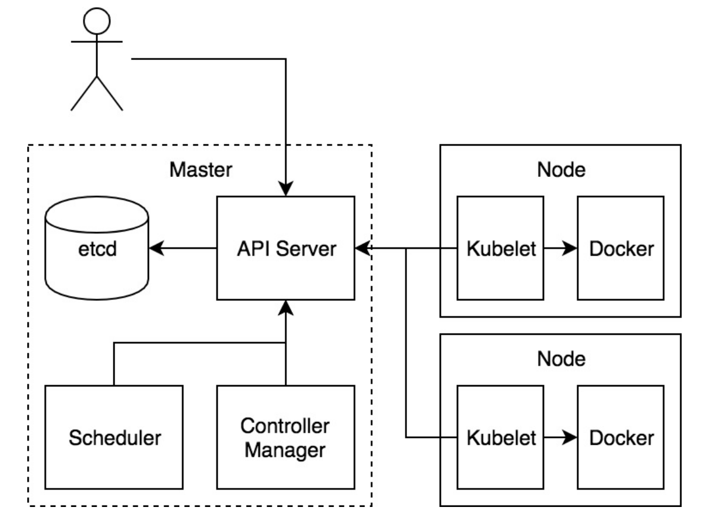
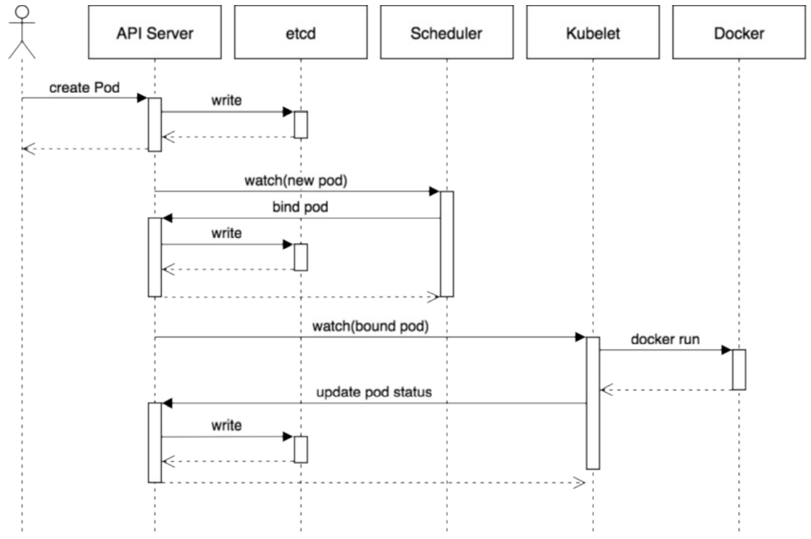

1. 基本概念

Kubernetes 中的绝⼤部分概念都抽象成 Kubernetes 管理的⼀种资源对象。

1.1 Master：Master 节点是 Kubernetes 集群的控制节点，负责整个集群的管理和控制。Master 节点 上包含以下组件： 

- kube-apiserver：集群控制的⼊⼝，提供 HTTP REST 服务 (提供了8080端口(非安全服务)以及643端口(安全服务) )

- kube-controller-manager：Kubernetes 集群中所有资源对象的⾃动化控制中⼼ 

- kube-scheduler：负责 Pod 的调度 

1.2 Node：Node 节点是 Kubernetes 集群中的⼯作节点，Node 上的⼯作负载由 Master 节点分配， ⼯作负载主要是运⾏容器应⽤。Node 节点上包含以下组件： 

- kubelet：负责 Pod 的创建、启动、监控、重启、销毁等⼯作，同时与 Master 节点协作，实 现集群管理的基本功能。 

- kube-proxy：实现 Kubernetes Service 的通信和负载均衡 

- 运⾏容器化(Pod)应⽤ 

1.3 Pod: Pod 是 Kubernetes 最基本的部署调度单元。每个 Pod 可以由⼀个或多个业务容器和⼀个根 容器(Pause 容器)组成。⼀个 Pod 表示某个应⽤的⼀个实例 

1.4 ReplicaSet：是 Pod 副本的抽象，⽤于解决 Pod 的扩容和伸缩 

1.5 Deployment：Deployment 表示部署，在内部使⽤ReplicaSet 来实现。可以通过 Deployment 来 ⽣成相应的 ReplicaSet 完成 Pod 副本的创建 

1.6 Service：Service 是 Kubernetes 最重要的资源对象。Kubernetes 中的 Service 对象可以对应微 服务架构中的微服务。Service 定义了服务的访问⼊⼝，服务的调⽤者通过这个地址访问 Service 后端的 Pod 副本实例。Service 通过 Label Selector 同后端的 Pod 副本建⽴关系，Deployment 保 证后端Pod 副本的数量，也就是保证服务的伸缩性。service组件可能是通过iptables等其它一些网络机制去进行通信. 

2.核心组成

2.1 Kubernetes 主要由以下⼏个核⼼组件组成: 

- etcd 保存了整个集群的状态，就是⼀个数据库；比如Pod、Deployments等数据都会存到etcd中. 

- apiserver 提供了资源操作的唯⼀⼊⼝，并提供认证、授权、访问控制、API 注册和发现等机制； controller manager 负责维护集群的状态，⽐如故障检测、⾃动扩展、滚动更新等； 

- scheduler 负责资源的调度，按照预定的调度策略将 Pod 调度到相应的机器上；Pod最终跑在哪个node都是Scheduler说了算. 

- kubelet 负责维护容器的⽣命周期，同时也负责 Volume（CSI）和⽹络（CNI）的管理； 

- Container runtime 负责镜像管理以及 Pod 和容器的真正运⾏（CRI）； 

- kube-proxy 负责为 Service 提供 cluster 内部的服务发现和负载均衡；

2.2  当然了除了上⾯的这些核⼼组件，还有⼀些推荐的插件： 

- kube-dns 负责为整个集群提供 DNS 服务 

- Ingress Controller 为服务提供外⽹⼊⼝ 

- Heapster 提供资源监控 

- Dashboard 提供 GUI

3.组件通信

3.1 Kubernetes 多组件之间的通信原理：

- apiserver 负责 etcd 存储的所有操作，且只有 apiserver 才直接操作 etcd 集群 

- apiserver 对内（集群中的其他组件）和对外（⽤户）提供统⼀的 REST API，其他组件均通过 apiserver 进⾏通信 

1. controller manager、scheduler、kube-proxy 和 kubelet 等均通过 apiserver watch API 监测 资源变化情况，并对资源作相应的操作 

1. 所有需要更新资源状态的操作均通过 apiserver 的 REST API 进⾏ 

- apiserver 也会直接调⽤ kubelet API（如 logs, exec, attach 等），默认不校验 kubelet 证书，但 可以通过 --kubelet-certificate-authority 开启（⽽ GKE 通过 SSH 隧道保护它们之间的通 信）

3.2 最典型的创建 Pod 的流程：

- ⽤户通过 REST API 创建⼀个 Pod 

- apiserver 将其写⼊ etcd 

- scheduluer 检测到未绑定 Node 的 Pod，开始调度并更新 Pod 的 Node 绑定 

- kubelet 检测到有新的 Pod 调度过来，通过 container runtime 运⾏该 Pod 

- kubelet 通过 container runtime 取到 Pod 状态，并更新到 apiserver 中

