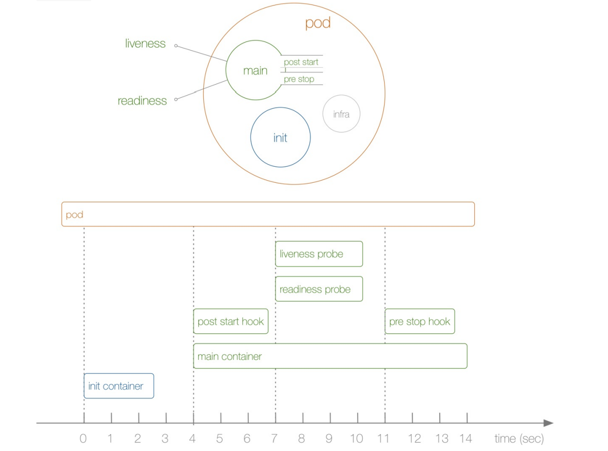

1. Init Container(初始化容器)就是⽤来做初始化⼯作的容器，可以是⼀个或者多个，如果有多个的话，这些容器会 按定义的顺序依次执⾏，只有所有的 Init Container 执⾏完后，主容器才会被启动。我们知道⼀ 个 Pod ⾥⾯的所有容器是共享数据卷和⽹络命名空间的，所以 Init Container ⾥⾯产⽣的数据可以 被主容器使⽤到的。

Init Container 和之前的钩⼦函数有点类似，只是是在容器执⾏前来做⼀些⼯作，从直观的⻆度看上去的话，初始化容器的确有点像 PreStart ，但是钩⼦函数和我们的 Init Container 是处在不同的阶段的，我们可以通过下⾯的图来了解下：



从上⾯这张图我们可以直观的看到 PostStart 和 PreStop 包括 liveness 和 readiness 是属于主容器 的⽣命周期范围内的，⽽ Init Container 是独⽴于主容器之外的，当然他们都属于 Pod 的⽣命周期 范畴之内的，这就是 Init Container 和钩⼦函数之类的区别。

另外可以看到上⾯ Pod 右边还有⼀个 infra 的容器，可以在集群环境中去查看下任意⼀个 Pod 对应的运⾏的 Docker 容器，可以发现每⼀个 Pod 下⾯都包含 了⼀个 pause 的镜像，这个就是我们的 infra 镜像，我们知道 Pod 下⾯的所有容器是共享同⼀ 个⽹络命名空间的，这个镜像就是来做这个事情的，所以每⼀个 Pod 当中都会包含⼀个这个镜像(很多时候最开始 Pod 启动不起来就是因为这个 infra 镜像没有被拉下来，因为默认该镜像是需要 到⾕歌服务器上拉取的，所以需要提前拉取到节点上⾯或者重新设置一个镜像仓库)。


```javascript
# 查看POD在哪个node上
kubectl get pods --all-namespaces -o wide

# 假如存在"init-containers-demo-2"这样一个POD,在node节点上
# 在node节点运行如下指令,可以看到除了主容器外,还有一个pause容器
docker ps| grep init-containers-demo-2

```


2. Init Container 主要是来做初始化容器⼯作的，主要有以下应用场景:

- 等待其他模块Ready：这个可以⽤来解决服务之间的依赖问题，⽐如我们有⼀个 Web 服务，该服 务⼜依赖于另外⼀个数据库服务，但是在我们启动这个 Web 服务的时候我们并不能保证依赖的这 个数据库服务就已经启动起来了，所以可能会出现⼀段时间内 Web 服务连接数据库异常。要解决 这个问题的话我们就可以在 Web 服务的 Pod 中使⽤⼀个 InitContainer，在这个初始化容器中去 检查数据库是否已经准备好了，准备好了过后初始化容器就结束退出，然后我们的主容器 Web 服 务被启动起来，这个时候去连接数据库就不会有问题了。 

- 做初始化配置：⽐如集群⾥检测所有已经存在的成员节点，为主容器准备好集群的配置信息，这 样主容器起来后就能⽤这个配置信息加⼊集群。 

- 其它场景：如将 pod 注册到⼀个中央数据库、配置中⼼等。


3. 服务依赖的场景下初始化容器的使⽤⽅法:


场景: pod中main-container容器依赖两个initContainers, 名称分别是check-service和check-db，check-service和check-db相当于两个服务.


a. 第一步运行 init-container-demo-1.yaml, 观察 init-containers-demo-1 这个POD的状态.

[init-container-demo-1.yaml](attachments/183550AB98E040A2BA6BFE38EB3A6AFAinit-container-demo-1.yaml)


```javascript
# init-container-demo-1.yaml

---
apiVersion: v1
kind: Pod
metadata:
  name: init-containers-demo-1
  labels:
    app: init
spec:
  initContainers:
  - name: check-service
    image: busybox
    command: ['sh', '-c', 'until nslookup myservice; do echo waiting for myservice; sleep 2; done;']
  - name: check-db
    image: busybox
    command: ['sh', '-c', 'until nslookup mydb; do echo waiting for mydb; sleep 2; done;']
  containers:
  - name: main-container
    image: busybox
    command: ['sh', '-c', 'echo The app is running! && sleep 3600']

```


```javascript
kubectl apply -f init-container-demo-1.yaml
# 查看POD发现状态是"Init:0/2",说明两个初始化容器还未启动成功
kubectl get pods
kubectl describe pod init-containers-demo-1
```


b. 第二步运行 service-myservice.yaml,  观察 init-containers-demo-1 这个POD的状态.

[service-myservice.yaml](attachments/310515B2E4334EDDAE7A1E15D968D928service-myservice.yaml)


```javascript
# service-myservice.yaml

---
apiVersion: v1
kind: Service
metadata:
  name: myservice
spec:
  ports:
  - protocol: TCP
    port: 80
    #targetPort是和service进行关联的一个端口
    targetPort: 6379
```


```javascript
kubectl create -f service-myservice.yaml
kubectl get svc -n default
kubectl describe pod init-containers-demo-1
#发现POD状态已经变成"Init:1/2",说明还有一个初始化容器未启动
kubectl get pods
```


b. 第二步运行 service-mydb.yaml,  观察 init-containers-demo-1 这个POD的状态.


[service-mydb.yaml](attachments/3EF4DE9DF6C0459E9A1818F255B6D3ADservice-mydb.yaml)


```javascript
# service-mydb.yaml

---
apiVersion: v1
kind: Service
metadata:
  name: myservice
spec:
  ports:
  - protocol: TCP
    port: 80
    #targetPort是和service进行关联的一个端口
    targetPort: 6379

---
apiVersion: v1
kind: Service
metadata:
  name: mydb
spec:
  ports:
  - protocol: TCP
    port: 80
    #targetPort是和service进行关联的一个端口
    targetPort: 6379
```


```javascript
kubectl apply -f service-mydb.yaml
kubectl get svc -n default
# 发现状态已经变成"Running",至此主容器已经运行
kubectl get pods
kubectl describe pod  init-containers-demo-1 -n default
```


运行V1.22版本的"kubectl apply -f service-mydb.yaml"出现下面的警告:

Warning: resource services/myservice is missing the kubectl.kubernetes.io/last-applied-configuration annotation which is required by kubectl apply. kubectl apply should only be used on resources created declaratively by either kubectl create --save-config or kubectl apply. The missing annotation will be patched automatically.


4.做初始化配置⼯作场景下初始化容器的使⽤⽅法:


这里使用"index.html"模拟主容器初始化配置信息.


[init-container-demo-2.yaml](attachments/953E32853DC74AF88C0CB67C5EA38C99init-container-demo-2.yaml)


```javascript
# init-container-demo-2.yaml

---
apiVersion: v1
kind: Pod
metadata:
  name: init-containers-demo-2
  labels:
    app: init
spec:
  initContainers:
  - name: install-config
    image: busybox
    command: 
    - wget
    # -o 相当于 --output-file=FILE , "-o"(小写)将日志信息写入FILE
    # -O 相当于 --output-document=FILE , "-O"(大写)将文档写入 FILE
    - "-O"
    - "/work-dir/index.html"
    - http://www.baidu.com
    volumeMounts:
    - name: workdir
      mountPath: /work-dir
  containers:
  - name: nginx
    image: nginx
    ports:
    - containerPort: 80
    # volumeMounts是将指定的卷放到容器指定的位置上面去
    volumeMounts:
    - name: workdir
      mountPath: /usr/share/nginx/html
  # volumes指的是POD中的一个卷
  volumes:
  - name: workdir
    #这里用hostPath也可以挂载到宿主机上面去
    #emptyDir是个临时的共享卷,它的生命周期和POD的生命周期一样,如果pod重启了,emptyDir中之前的内容也没了
    #当初始化容器(install-config)启动后,会下载一个html文件，然后映射到emptyDir中去
    #把index.html看成一个配置文件,就相当于实现了使用初始化容器改变主容器中的配置文件
    emptyDir: {}
```


spec.volumes 指的是 Pod 中的 卷， spec.containers.volumeMounts 是将指定的卷 mount 到容器指定的位置，相当于docker⾥⾯ 的 -v 宿主机⽬录：容器⽬录 ，我们前⾯⽤到过 hostPath ，我们这⾥使⽤的是 emptyDir{} ，这个就相 当于⼀个共享卷，是⼀个临时的⽬录，⽣命周期等同于 Pod 的⽣命周期。

初始化容器执⾏完，会下载⼀个 html ⽂件映射到emptyDir{}，⽽主容器也是和 spec.volumes ⾥的 emptyDir{} 进⾏映射，所以 nginx容器的 /usr/share/nginx/html`⽬录下会映射 index.html ⽂件。

```javascript

kubectl create -f init-container-demo-2.yaml
kubectl get pods
kubectl describe pod init-containers-demo-2

// 验证有两种方式:
// 1.建一个service关联这个pod,访问service就可以把请求路由到pod的主容器中.
// 2.进入到POD查看是否把百度首页的代码写入到了"index.html"中

# 进入到POD中验证
kubectl exec -it init-containers-demo-2  -- /bin/bash
cat /usr/share/nginx/html/index.html 

```


5. 总结

我们在 Pod 启动过程中，初始化容器会按顺序在⽹络和数据卷初始化之后启动。每个容器必须在下⼀ 个容器启动之前成功退出。如果由于运⾏时或失败退出，导致容器启动失败，它会根 据 Pod 的 restartPolicy 指定的策略进⾏重试。 然⽽，如果 Pod 的 restartPolicy 设置为 Always， Init 容器失败时会使⽤ RestartPolicy 策略。 

在所有的初始化容器没有成功之前， Pod 将不会变成 Ready 状态。正在初始化中的 Pod 处 于 Pending 状态，但应该会将条件 Initializing 设置为 true。


下节课讲些常⽤的控制器(Deployment、service等)和 Pod 的结合.


