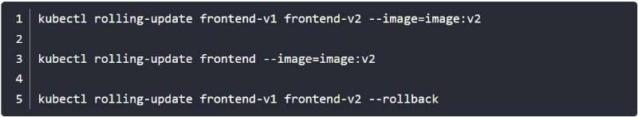

1. Kubernetes 提供了资源对象用来管理Pod ，Pod 不够了⾃动帮我新增⼀个， Pod 挂了⾃动帮我在合适的节 点上重新启动⼀个 Pod.

- Replication Controller：⽤来部署、升级 Pod 

- Replica Set：下⼀代的 Replication Controller 

- Deployment：可以更加⽅便的管理 Pod 和 Replica Set


2. Replication Controller 简称 RC ， RC 是 Kubernetes 系统中的核⼼概念之⼀，简单来说， RC 可以 保证在任意时间运⾏ Pod 的副本数量，能够保证 Pod 总是可⽤的。如果实际 Pod 数量⽐指定的多那 就结束掉多余的，如果实际数量⽐指定的少就新启动⼀些 Pod ，当 Pod 失败、被删除或者挂掉 后， RC 都会去⾃动创建新的 Pod 来保证副本数量，所以即使只有⼀个 Pod ，我们也应该使⽤ RC 来 管理我们的 Pod ( HPA种资源对象可以根据资源的使⽤情况来进⾏⾃动扩 缩容,但是RC不具备这种能力).


当定义了一个RC资源对象提交到k8s集群后，master节点上controlManager这个组件就会得到一个通知然后会定期巡检系统中存活目标的Pod,然后会确保这个目标的Pod实际的数量刚好等于RC里面定义的期望的值,这样RC实现了高可用，大大减少运维成本.


示例:来使⽤ RC 来管理我们前⾯使⽤的 Nginx 的 Pod:

[rc-demo.yaml](attachments/719937019C5241B0AF2E2F59395CD34Erc-demo.yaml)


```javascript
# 定义一个kind的时候,要查api文档确定是哪一个版本
---
apiVersion: v1
kind: ReplicationController
metadata:
  name: rc-demo
  labels:
    app: rc
spec:
  # 指定POD的副本个数,如果不指定默认是1  
  replicas: 3
  # 根据lab筛选,匹配template中的labels.如果不指定selector,默认与template下面的labels相同
  # 为了减少不必要的错误,通常这里不指定selector,让其默认使用template下面定义的labels
 # selector:
 #   app: rc
  # template是用来管理pod的模板,实际上就是用来定义pod
  # template下面只能是pod,所以不需要指定类型是pod
  template:
    # template下面不需要定义pod的name,它会自动生成name
    # 因为定义了name,万一几个pod都在同一台机器上名字就重复了
    metadata:
      labels:
        app: rc
    spec:
      containers:
      - name: nginx-name
        image: nginx
        ports:
        - containerPort: 80
        
```


上⾯的 YAML ⽂件相对于之前的 Pod 的格式：

- kind： ReplicationController

- spec.replicas: 指定 Pod 副本数量，默认为1

- spec.selector: RC 通过该属性来筛选要控制的 Pod

- spec.template: 这⾥就是我们之前的 Pod 的定义的模块，但是不需要 apiVersion 和 kind 了

- spec.template.metadata.labels: 注意这⾥的 Pod 的 labels 要和 spec.selector 相同，这样 RC 就可以来控制当前这个 Pod 了。

这个 YAML ⽂件中的意思就是定义了⼀个 RC 资源对象，它的名字叫 rc-demo ，保证⼀直会有3 个 Pod 运⾏， Pod 的镜像是 nginx 镜像。

注意 spec.selector 和 spec.template.metadata.labels 这两个字段必须相同，否则会创建失败 的，当然我们也可以不写 spec.selector ，这样就默认与 Pod 模板中的 metadata.labels 相同 了。所以为了避免不必要的错误的话，不写为好。


```javascript
#创建上⾯的RC对象(保存为 rc-demo.yaml)
kubectl create -f rc-demo.yaml

#查看RC控制器有以下两个命令
kubectl get replicationcontroller
kubectl get rc

#查看指定的RC的具体信息
kubectl  describe rc rc-demo

#可以看到名称以"rc-demo"为前缀的3个pod.
kubectl get pods

#在dashboard中点击"Replications Controllers"

#根据RC资源名称删除RC资源
kubectl delete rc rc-demo

```


3. RC修改pod的副本数量的三种方式:


(1). kubernetes-dashboard中修改副本的数量，有以下两种方式:

- 1.10.0-0版本找到"SCALE".

  1.22.1版本.点击"Replications Controllers"会列出所有的RC,每一个RC项右边都有三个点,点击三个点选择"规模".

-   点击"Replications Controllers"会列出所有的RC,每一个RC项右边都有三个点,点击三个点选择"编辑". 


(2). 修改yaml文件，然后使用"kubectl apply -f  [yaml文件]"


(3). 使用"kubectl edit rc"命令修改,相当于用vi把线上的yaml文件打开修改

格式:  kubectl edit rc [rc name]

如:  	kubectl edit rc rc-demo


3.  使用RC进行滚动升级

```javascript
# 场景: 镜像更新就需要更新pod
# 概念: 滚动更新不会把pod一次性替换掉,是逐个替换，这样才会保证线上服务不会中断

# 将镜像地址更改为 nginx:1.7.9
# 这种滚动更新已经过时,在1.10.0-0版本能用
kubectl rolling-update rc-demo -f rc-demo.yaml

# roiling- update指令被移除,替换的指令是?

```


rolling-update原理: 

假如现在有一个" rc-demo"这样的RC资源对象, 命令执行后会新创建一个 “rc-demo-[随机字符]”的资源对象,这个“rc-demo-xxxx”资源对象下面的Pod先一个个启动起来,启动起来一个,就把原来 “rc-demo”里面的Pod就减少一个,最终替换完成了，就把原来的“rc-demo”删掉，然后把“rc-demo-xxxx”重命名为“rc-demo”.


如果RC下面的Pod有多个容器就必须修改yaml文件, 因为“kubectl rolling-update”这种方式只能指定一个镜像地址.





最好用修改yaml文件的方式进行滚动更新，这样可以把修改记录保存下来.如果升级完成出现新的问题可以再次把yaml文件修改为升级前的那个版本,通过这种形式回滚(relicationcontroller这个资源对象是不支持回滚，想回到上个版本之只能通过修改镜像地址的方式，这样才能回滚).


总结: 如果升级完成后出现了新的问题，想要⼀键回滚到上⼀个版本的话，使⽤ RC 只能⽤同样的⽅法把镜 像地址替换成之前的，然后重新滚动升级。


4.  Replication Set（RS）

Replication Set 简称 RS ，随着 Kubernetes 的⾼速发展，官⽅已经推荐我们使 ⽤ RS 和 Deployment 来代替 RC 了，实际上 RS 和 RC 的功能基本⼀致，⽬前唯⼀的⼀个区别就 是 RC 只⽀持基于等式的 selector （env=dev或environment!=qa），但 RS 还⽀持基于集合 的 selector （version in (v1.0, v2.0)），这对复杂的运维管理就⾮常⽅便了。


kubectl 命令⾏⼯具中关于 RC 的⼤部分命令同样适⽤于我们的 RS 资源对象。不过我们也很少会去 单独使⽤ RS ，它主要被 Deployment 这个更加⾼层的资源对象使⽤，除⾮⽤户需要⾃定义升级功能或 根本不需要升级 Pod ，在⼀般情况下，我们推荐使⽤ Deployment ⽽不直接使⽤ Replica Set 。


关于 RC / RS 的⼀些特性和作⽤：

- ⼤部分情况下，我们可以通过定义⼀个 RC 实现的 Pod 的创建和副本数量的控制

- RC 中包含⼀个完整的 Pod 定义模块（不包含 apiversion 和 kind ）

- RC 是通过 label selector 机制来实现对 Pod 副本的控制的

- 通过改变 RC ⾥⾯的 Pod 副本数量，可以实现 Pod 的扩缩容功能

- 通过改变 RC ⾥⾯的 Pod 模板中镜像版本，可以实现 Pod 的滚动升级功能（但是不⽀持⼀键回滚，需要⽤相同的⽅法去修改镜像地址）


https://kubernetes.io/zh/docs/concepts/workloads/controllers/replicationcontroller/

.png)


