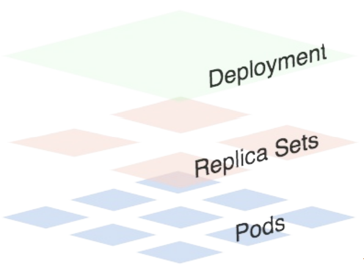
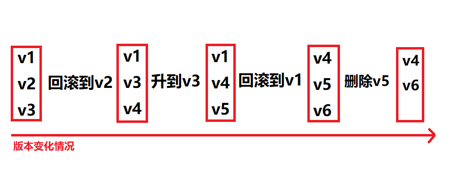

1.  Replication Controller (RC) 和 Replica Set (RS) 两种资源对象的功能 基本上是差不多的，唯⼀的区别就是 RS ⽀持集合的 selector.但是推荐使⽤ Deployment 这种控制器，⽽不是我们之前的 RC 或 者 RS.

RC 是 Kubernetes 的⼀个核⼼概 念，当我们把应⽤部署到集群之后，需要保证应⽤能够持续稳定的运⾏， RC 就是这个保证的关键， 主要功能如下：

- 确保 Pod 数量：它会确保 Kubernetes 中有指定数量的 Pod 在运⾏，如果少于指定数量的 Pod ， RC 就会创建新的，反之这会删除多余的，保证 Pod 的副本数量不变。

- 确保 Pod 健康：当 Pod 不健康，⽐如运⾏出错了，总之⽆法提供正常服务时， RC 也会杀死不健康的 Pod ，重新创建新的。

- 弹性伸缩：在业务⾼峰或者低峰的时候，可以⽤过 RC 来动态的调整 Pod 数量来提供资源的利⽤率，当然我们也提到过如果使⽤ HPA 这种资源对象的话可以做到⾃动伸缩。

- 滚动升级：滚动升级是⼀种平滑的升级⽅式，通过逐步替换的策略，保证整体系统的稳定性("kubectl rolling-update"这个指令目前已经被移除).


Deployment 同样也是 Kubernetes 系统的⼀个核⼼概念，主要职责和 RC ⼀样的都是保证 Pod 的数量 和健康，⼆者⼤部分功能都是完全⼀致的，我们可以看成是⼀个升级版的 RC 控制器， 那 Deployment ⼜具备如下新特性:

- RC 的全部功能： Deployment 具备上⾯描述的 RC 的全部功能

- 事件和状态查看：可以查看 Deployment 的升级详细进度和状态

- 回滚：当升级 Pod 的时候如果出现问题，可以使⽤回滚操作回滚到之前的任⼀版本

- 版本记录：每⼀次对 Deployment 的操作，都能够保存下来，这也是保证可以回滚到任⼀版本的基础

- 暂停和启动：对于每⼀次升级都能够随时暂停和启动


Deployment 作为新⼀代的 RC ，不仅在功能上更为丰富了，同时我们也说过现在 官⽅也都是推荐使⽤ Deployment 来管理 Pod 的，⽐如⼀些官⽅组件 kube-dns 、 kube-proxy 也都是 使⽤的 Deployment 来管理的，所以当⼤家在使⽤的使⽤也最好使⽤ Deployment 来管理 Pod 。




从上图可以看出⼀个Deployment拥有多个 Replica Set，⽽⼀个Replica Set拥有⼀个或多个Pod。⼀个Deployment控制多个rs主要是为了⽀持回 滚机制，每当Deployment操作时，Kubernetes会重新⽣成⼀个Replica Set并保留，以后有需要的话就 可以回滚⾄之前的状态


2. 示例:⾯创建⼀个Deployment，它创建了⼀个Replica Set来启动3个nginx pod.


版本1:nginx的版本是1.7.9

[deployment-demo-v1.yaml](attachments/3066FE83BF504F89A627BF8E89579774deployment-demo-v1.yaml)


```javascript
---
apiVersion: apps/v1
kind: Deployment
metadata:
  name: deployment-demo
  labels:
    app: deployment
spec:
  #将会保们始终有3个POD在运⾏
  replicas: 3
  #保留最近15个版本(设置多少根据实际需要,一般只会回滚到最近几个版本,没必要保留全部版本),一般生产环境都会设置这个参数
  revisionHistoryLimit: 15
  #k8s系统等待5秒后再升级
  minReadySeconds: 5
  #设置滚动升级策略
  strategy:
    type: RollingUpdate
    rollingUpdate:
      maxSurge: 1
      maxUnavailable: 1
  selector:
    matchLabels:
      app: nginx       
  template:
    metadata:
      labels:
        app: nginx
    spec:
      containers:
      - name: nginx
        image: nginx:1.7.9
        ports:
        - containerPort: 80
```


在官网API文档查询apiVersion:

https://kubernetes.io/docs/reference/generated/kubernetes-api/v1.22/#daemonset-v1-apps


```javascript
kubectl create -f deployment-demo-v1.yaml

#查看刚刚创建的Deployment,隔一会再次查询,观察状态变化
kubectl get deployments

#可以看到Deployment已经创建了1个Replica Set了，执⾏下⾯的命令查看rs和pod
kubectl get rs
kubectl get pod --show-labels

```


3. Deployment的滚动更新.


示例: nginx镜像由nginx:1.7.9滚动升级到nginx:1.10.0

[deployment-demo-v2.yaml](attachments/093EAAC35C214600A38337CADD7C1B94deployment-demo-v2.yaml)


```javascript
---
apiVersion: apps/v1
kind: Deployment
metadata:
  name: deployment-demo
  labels:
    app: deployment
spec:
  replicas: 3
  #保留最近15个版本(设置多少根据实际需要,一般只会回滚到最近几个版本,没必要保留全部版本),一般生产环境都会设置这个参数
  revisionHistoryLimit: 15
  #k8s系统等待5秒后再升级
  minReadySeconds: 5
  #设置滚动升级策略
  strategy:
    #表示策略的类型是滚动升级
    type: RollingUpdate
    rollingUpdate:
      maxSurge: 1
      maxUnavailable: 1
  selector:
    matchLabels:
      app: nginx       
  template:
    metadata:
      labels:
        app: nginx
    spec:
      containers:
      - name: nginx
        image: nginx:1.10.0
        ports:
        - containerPort: 80
```


一般在进行滚动升级的时候都要配置滚动升级的策略，保证滚动升级的过程当中有正常的Pod提供正常的服务.


滚动升级策略相关字段如下：

minReadySeconds:

Kubernetes在等待设置的时间后才进⾏升级

如果没有设置该值，Kubernetes会假设该容器启动起来后就提供服务了

如果没有设置该值，在某些极端情况下可能会造成服务服务正常运⾏

maxSurge:

升级过程中最多可以⽐原先设置多出的POD数量

例如：maxSurage=1，replicas=5,则表示Kubernetes会先启动1⼀个新的Pod后才删掉⼀个旧

的POD，整个升级过程中最多会有5+1个POD。

maxUnavailable:

升级过程中最多有多少个POD处于⽆法提供服务的状态

当 maxSurge 不为0时，该值也不能为0

例如：maxUnavaible=1，则表示Kubernetes整个升级过程中最多会有1个POD处于⽆法服务的状态.


```javascript

#在做一个更新的时候最好加上"--record=true"参数,这样使用"kubectl rollout history"命令的时候可以查看当时执行的命令
kubectl apply -f deployment-demo-v2.yaml  --record=true

#查看滚动升级的状态
kubectl rollout status deployment deployment-demo

#每当Deployment操作时,k8s会重新⽣成⼀个RS并保留,所以这里会看到有多个RS资源对象
kubectl get rs

#可以看到升级的过程
kubectl describe deployment deployment-demo

#暂停升级
kubectl rollout pause deployment deployment-demo

#暂停后继续升级
kubectl rollout resume deployment deployment-demo

#升级结束后，继续查看rs的状态
kubectl get rs

# 查看滚动升级历史.
# 这个命令的记录和"kubectl get rs"是一一对应的
# 如果把RS中某个资源对象删除,history对应的记录也会被删除,删掉了就没办法回滚到那个版本
kubectl rollout history deployment deployment-demo

```


接下来把nginx升级到最新版本,上面的yaml文件做如下变更:

[deployment-demo-v3.yaml](attachments/8391BF432CCA4946A1FF804A9555E3A9deployment-demo-v3.yaml)

```javascript
#这里只变更了ngixn,省略掉上下文
        image: nginx:1.10.0
```


```javascript
#注意: Flag --record has been deprecated, --record will be removed in the future
kubectl apply -f deployment-demo-v3.yaml --record=true

kubectl rollout status deployment deployment-demo
kubectl get pods
kubectl describe pod deployment-demo-845d4d9dff-rk4c8

#根据AGE我们可以看到离我们最近的当前状态是3,和yaml文件一致证明升级成功
kubectl get rs
#⽤ describe 命令可以查看升级的全部信息
kubectl describe deployment deployment-demo

#可以看到有三个版本
kubectl rollout history deployment deployment-demo

kubectl get rs
#这个命令显示出来的信息也有rs的版本记录
kubectl describe rs deployment-demo-845d4d9dff 

```


4. Deployment的滚动更新之回滚操作.

如果升级后的POD出了问题Deployment就为我们提供 了回滚机制.


查看Deployment的升级历史：

```javascript
[root@centos7 demo-yaml]# kubectl rollout history deployment deployment-demo
deployment.apps/deployment-demo 
REVISION  CHANGE-CAUSE
1         <none>
2         kubectl apply --filename=deployment-demo-v2.yaml --record=true
3         kubectl apply --filename=deployment-demo-v3.yaml --record=true

```

从上⾯的结果可以看出在执⾏ Deployment 升级的时候最好带上 record 参数，便于我们查看历史版本 信息。


默认情况下所有通过"kubectl xxxx --record" 都会被 kubernetes 记录到 etcd(数据库) 进⾏持久化，这⽆疑会占⽤资源,最重要的是时间久了,当你"kubectl get rs" 时，会有成百上千的垃圾 RS 返回给你，并且desired、current、ready全是0, 那时你可能就眼花缭乱了。


上⽣产时，我们最好通过设置Deployment的 spec.revisionHistoryLimit 来限制最⼤保留的 revision number ，⽐如15个版本，回滚的时候⼀般只会回滚到最近的⼏个版本就⾜够了。


rollout history 和 ReplicaSet 的对应关系，可以在“ kubectl describe rs $RSNAME” 返回 的 revision 字段中得到，这⾥的 revision 就对应着 rollout history 返回的 revison 。


回退到上一个版本,如下示例:

```javascript
#查看version
kubectl rollout history deployment deployment-demo

#查看单个 revison 的信息
kubectl rollout history deployment deployment-demo --revision=3

#直接回退到当前版本的前⼀个版本
kubectl rollout undo deployment deployment-demo
kubectl rollout status deployment deployment-demo
kubectl get deployment deployment-demo
kubectl get rs
kubectl get pods
#查看RS下的Pod信息
kubectl describe pod deployment-demo-55dc4587bc-7lwn7
```


回退到指定版本,如下示例:

```javascript
#查看version
kubectl rollout history deployment deployment-demo

#⽤ revision 回退到指定的版本
kubectl rollout undo deployment deployment-demo --to-revision=1

#查看Deployment现在的状态 
kubectl rollout status deployment deployment-demo
kubectl get deployment
kubectl get rs
```


其实 rollout history 中记录的 revision 都和 ReplicaSets ⼀⼀对应。如果⼿动 delete 某个ReplicaSet，对应 的 rollout history 就会被删除，也就是还说你⽆法回滚到这个 revison 了。

删除指定版本:

```javascript
#查看历史版本
kubectl rollout history deployment deployment-demo

# 假如要删除版本5,首先查找到版本5对应的RS
# pod-template-hash字段对应的值就是生成RS资源对象名称后半部分的随机值
kubectl rollout history deployment deployment-demo --revision=5

# 根据这个随机值能找到对应的RC资源对象,假如这个值是"845d4d9dff"
kubectl get rs

# 根据RC资源对象的名称删除
kubectl delete rs deployment-demo-845d4d9dff 

# 再次查看版本记录,发现"REVISION=5"的版本没有了
# 删除后无法再回到"REVISION=5"的版本.
kubectl rollout history deployment deployment-demo

# 删除deployment
kubectl delete deployment deployment-demo
kubectl get deployment

```


补充两个命令：

```javascript
# 加上"--all-namespaces"参数表示, 查看所有命名空间的deployment 
kubectl get deployment --all-namespaces

# 指定命名空间查看deployment 
kubectl get deployment  -n $namespacesName

```


无论是回滚、新建、滚动升级,每操作一次revision都会加1.假如当前最新的版本是"revision=6", 现在把"revision=6"回滚到"revision=4",前面的5和6还是存在的,不会被删掉,回滚操作会被记录为"revision=7",并且"revision=4"会被移除掉,每次操作都是最新的一个版本,或者说最新的一个记录.revision相当于只是一个版本记录,或者说是操作记录.


下图是deployment 版本变化的规律:




官方推荐使用deployment管理无状态应用！