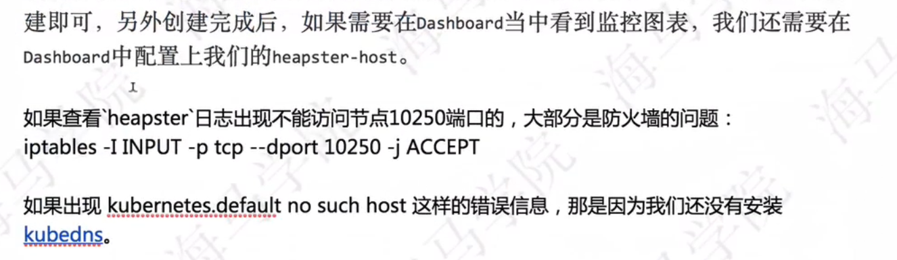

1.Pod扩缩容 

- 通过⼿⼯执⾏ kubectl scale 命令和在 Dashboard 上操作可以实 现 Pod 的扩缩容.

- Kubernetes 系统能够根据 Pod 当前的负载的变化情况来⾃动的进⾏扩缩容.


Kubernetes 为我们提供了 Horizontal Pod Autoscaling （Pod⽔平⾃动 伸缩）资源对象，简称 HPA 。 HAP 通过监控分析 RC 或者 Deployment 控制的所有 Pod 的负载变化情况来确定 是否需要调整 Pod 的副本数量，这是 HPA 最基本的原理。


HPA 在 kubernetes 集群中被设计成⼀个 controller ，我们可以简单的通过 "kubectl autoscale" 命令 来创建⼀个 HPA 资源对象， HPA Controller 默认30s轮询⼀次(可通过 kube-controller-manager 的标志 --horizontal-pod-autoscaler-sync-period进⾏设置),查询指定的资源(RC或者 Deployment)中 Pod 的资源使⽤率，并且与创建时设定的值和指标做对⽐，从⽽实现⾃动伸缩的功能。

当创建了 HPA 后， HPA 会从 Heapster 或者⽤户⾃定义的 RESTClient 端获取每⼀个 Pod 利⽤ 率或原始值的平均值，然后和 HPA 中定义的指标进⾏对⽐，同时计算出需要伸缩的具体值并进⾏相应 的操作。⽬前， HPA 可以从两个地⽅获取数据：

- Heapster：仅⽀持 CPU 使⽤率. k8s 1.11以后废弃了,现在使用metrics-server

- ⾃定义监控：


本节介绍从 Heapster 获取监控数据来进⾏⾃动扩缩容的⽅法，⾸先安装 Heapster ，前⾯我们在 kubeadm 搭建集群的课程中，实际上我们已经默认把 Heapster 相关的镜像 都已经拉取到节点上了，所以接下来我们只需要部署即可，我们这⾥使⽤的是 Heapster 1.4.2 版本 的，前往 Heapster 的 github ⻚⾯,安装如下:


(1).  k8s v1.8以下部署heapter, k8s 1.8以上部署 metric-server， 以下是k8s v1.8以下部署heapter的方法:

[grafana.yaml](attachments/37B62C1C538C4C2AB72A3385BAF01337grafana.yaml)


[heapster.yaml](attachments/D6BFD9055B484F4DA22A4272C5798AB9heapster.yaml)


[influxdb.yaml](attachments/06E1EE073CA5434AB7564566B8CC11EDinfluxdb.yaml)

```javascript
// 安装heapster,在node节点操作

// heapster是k8s系统中当中监控的一个组件
// influxs是heapster使用的一个数据库
// grafana是图标展示的一个工具,用的比较多

docker pull cnych/heapster-influxdb-amd64:v1.3.3
docker pull cnych/heapster-grafana-amd64:v4.4.3
docker pull cnych/heapster-amd64:v1.4.2

# 查看镜像是否下载成功
docker images | grep influxdb
docker images | grep grafana
docker images | grep heapster

// heapster地址: https://github.com/kubernetes-retired/heapster
// Yaml文件: https://github.com/kubernetes-retired/heapster/tree/v1.5.0/deploy/kube-config/influxdb
#可以拷贝下来,也可以使用wget下载
wget https://raw.githubusercontent.com/kubernetes-retired/heapster/v1.5.0/deploy/kube-config/influxdb/grafana.yaml
wget https://raw.githubusercontent.com/kubernetes-retired/heapster/v1.5.0/deploy/kube-config/influxdb/heapster.yaml
wget https://raw.githubusercontent.com/kubernetes-retired/heapster/v1.5.0/deploy/kube-config/influxdb/influxdb.yaml

#编辑heapster.yaml,绑定角色ServiceAccount, 修改image为 cnych/heapster-amd64:v1.4.2
#编辑grafana.yaml修改image为 cnych/heapster-grafana-amd64:v4.4.3
#编辑influxdb.yaml修改image为 cnych/heapster-influxdb-amd64:v1.3.3

# 安装, "kubectl create -f ."使用当前文件夹下的所有yaml文件批量create,
kubectl create -f grafana.yaml
kubectl create -f heapster.yaml
kubectl create -f influxdb.yaml

kubectl get pods -n kube-system

#创建完成后如果需要在Dashboard中看到监控图表,还需要在Dashboard中配置heapster-host

# 查看Pod日志看是否启动成功,格式: kubectl logs -f $podname -n kube-system
kubectl logs -f heapster-75f8685b67-7nm9b -n kube-system
kubectl logs -f monitoring-grafana-64fb674b8d-nttvs -n kube-system
kubectl logs -f monitoring-influxdb-84ffdf7f88-pfrst -n kube-system

# 安装成功后在dashboard点击Pod看是否出现了cpu和memory的图表
```


(2). 但是创建HPA的资源对象之前,需要在kube-controller-manager.yaml中设置一个参数，不设置的话，就要去安装metric-server, metric-server安装比较复杂,设置参数只是一个临时的方法！

```javascript
// 在master节点上操作

// 根据放静态Pod的路径找到"kube-controller-manager.yaml"并编辑
// 修改后不用手动更新Pod,因为kubelet周期扫描静态Pod目录下⽂件的变化,然后自动更新.
    - kube-controller-manager
    # 添加下面这个参数
    - --horizontal-pod-autoscaler-use-rest-clients=false
    - --allocate-node-cidrs=true

```


HPA在Kubernetes 版本1.8以下默认以heapster作为性能指标采集来源。在Kubernetes 1.8中，只有启用horizontal-pod-autoscaler-use-rest-clients时才需要Metrics Server。 Kubernetes 1.9默认启用HPA rest 客户端。 Metrics Server 为heapster替代项目，heapster在未来会慢慢废弃掉.


(3).  创建⼀个 Deployment 管理的 Nginx Pod，然后利⽤ HPA 来进⾏⾃动扩缩容：

[hpa-demo.yaml](attachments/B7170923B0AE406EB8CB649583B111EEhpa-demo.yaml)

```javascript
# hpa-demo.yaml
---
apiVersion: apps/v1
kind: Deployment
metadata:
  name: hpa-demo
  labels:
    app: hpa
spec:
  # 如果不指定replicas,默认也是1
  replicas: 1
  revisionHistoryLimit: 15
  minReadySeconds: 5
  strategy:
    type: RollingUpdate
    rollingUpdate:
      maxSurge: 1
      maxUnavailable: 1
  selector:
    matchLabels:
      app: nginx       
  template:
    metadata:
      labels:
        app: nginx
    spec:
      containers:
      - name: nginx
        image: nginx
        resources:
          # 容器请求CPU资源的值
          requests:
            cpu: 100m
          # 限制容器使用CPU资源的最大值,这里演示HPA自动扩缩容,所以不不设置limit
          # limit:
          #  cpu: 200m
        ports:
        - containerPort: 80
```


```javascript
kubectl create -f hpa-demo.yaml
kubectl get deployment
kubectl get pods
 
```


(4). 创建 Horizontal Pod Autoscaling(HPA)资源对象有两种方式:

- 使用命令创建HPA

- 使用yaml文件创建HPA


方式1: 使用命令创建HPA:

此命令创建了⼀个关联资源hpa-demo 的 HPA ，最⼩的 pod 副本数为1，最⼤为10。 HPA会根据设定的 cpu使⽤率（5%）动态的增加或者减少pod数量。

```javascript
#"--min=1 --max=10"表示HPA在1-10范围内调整pod的数量.
#"--cpu-percent"表示Pod的cpu平均使用率(当Pod负载达到5%就会去扩容)
#生产环境一般设置"--cpu-percent=90"(当Pod负载达到90%才会去扩容)  
# 格式：kubectl autoscale deployment $DeploymentName --min=1 --max=10 --cpu-percent=5 
kubectl autoscale deployment hpa-demo --min=1 --max=10 --cpu-percent=5

#查看HPA资源
kubectl get hpa

#查看详细信息,格式: kubectl describe hpa $HpaName
kubectl describe hpa hpa-demo

```


方式2: 使用yaml文件创建HPA:

```javascript
# 除了使⽤"kubectl autoscale"命令来创建外,依然可以通过创建YAML⽂件的形式来创建HPA资源对象
# 如果不知道怎么编写,可以查看上⾯命令⾏创建的HPA的YAML⽂件,如下:
# 格式: kubectl get hpa $hpaName -o yaml
 kubectl get hpa hpa-demo -o yaml > hpa-demo.yaml
```


这个yaml文件也可以手写,这种方式就是先创建deployment再创建HAP:

[hpa-demo.yaml](attachments/DC3DFB0145654BC2A12F6985BE6A1BC9hpa-demo.yaml)

```javascript
# hpa-demo.yaml

apiVersion: autoscaling/v1
kind: HorizontalPodAutoscaler
metadata:
  annotations:
    autoscaling.alpha.kubernetes.io/conditions: '[{"type":"AbleToScale","status":"True","lastTransitionTime":"2021-09-15T06:58:57Z","reason":"SucceededGetScale","message":"the
      HPA controller was able to get the target''s current scale"},{"type":"ScalingActive","status":"False","lastTransitionTime":"2021-09-15T06:58:57Z","reason":"FailedGetResourceMetric","message":"the
      HPA was unable to compute the replica count: failed to get cpu utilization:
      unable to get metrics for resource cpu: unable to fetch metrics from resource
      metrics API: the server could not find the requested resource (get pods.metrics.k8s.io)"}]'
  creationTimestamp: "2021-09-15T06:58:42Z"
  name: hpa-demo
  namespace: default
  resourceVersion: "257062"
  uid: 00554ae8-1b7f-441a-a755-8f274142ee04
spec:
  maxReplicas: 10
  minReplicas: 1
  scaleTargetRef:
    apiVersion: apps/v1
    kind: Deployment
    name: hpa-demo
  targetCPUUtilizationPercentage: 5
status:
  currentReplicas: 1
  desiredReplicas: 0
 
```


把deployment和HPA写在同一个yaml文件中,一次性创建deployment和HPA:

[hpa-deployment-demo.yaml](attachments/AD473962836A4857B3896094CEC6E48Dhpa-deployment-demo.yaml)

```javascript
---
apiVersion: apps/v1
kind: Deployment
metadata:
  name: hpa-demo
  labels:
    app: hpa
spec:
  # 如果不指定replicas,默认也是1
  replicas: 1
  revisionHistoryLimit: 15
  minReadySeconds: 5
  strategy:
    type: RollingUpdate
    rollingUpdate:
      maxSurge: 1
      maxUnavailable: 1
  selector:
    matchLabels:
      app: nginx       
  template:
    metadata:
      labels:
        app: nginx
    spec:
      containers:
      - name: nginx
        image: nginx
        resources:
          # 容器请求CPU资源的值
          requests:
            cpu: 100m
          # 限制容器使用CPU资源的最大值,这里演示HPA自动扩缩容,所以不不设置limit
          # limit:
          #  cpu: 200m
        ports:
        - containerPort: 80

---
apiVersion: autoscaling/v1
kind: HorizontalPodAutoscaler
metadata:
  name: hpa-demo
  namespace: default
spec:
  maxReplicas: 10
  minReplicas: 1
  scaleTargetRef:
    apiVersion: apps/v1
    kind: Deployment
    name: hpa-demo
  # 生产环境一般设置targetCPUUtilizationPercentage为90(当Pod负载达到90%才会去扩容)  
  targetCPUUtilizationPercentage: 5

```


(5). 验证 Horizontal Pod Autoscaling(HPA)

```javascript

# 创建一个busybox的pod并进入容器的终端
kubectl run -i --tty test-hpa --image=busybox /bin/sh

# 在dashboard查看被HPA指向的deployment下的Pod的IP地址.
# hpa-demo这个Deployment下面的pod运行的是nginx.
# 在终端中执行下面命令显示nginx主页代码说明成功.
wget -q -O- http://10.244.189.99

# 在终端中运行下面的脚本,无线循环访问Pod,增⼤负载进⾏测试看Pod是否扩容
while true; do wget -q -O- http://10.244.189.99; done

#新开一个终端,因为默认是每30秒轮询一次,所以不是马上扩容
kubectl get hpa
kubectl describe hpa hpa-demo
#运行下面命令可以看到副本数量已增加
kubectl get deployment hpa-demo
#可以看到有多个pod
kubectl get pods

#停掉终端或者在Dashboard中删除test-hpa这个Pod,看Pod是否缩容,默认30秒轮询一次,所以不是马上缩容
kubectl get hpa
kubectl describe hpa hpa-demo
#运行下面命令可以看到副本数量已减少到1
kubectl get deployment hpa-demo
#可以看到Pod已经减少到一个,dashcorad中查看也只剩下一个
kubectl get pods

```


(6).demo完成，删除相关的资源对象.

```javascript
// node 节点执行
// cd进入到包含"grafana.yaml、heapster.yaml、influxdb.yaml"的目录
kubectl delete -f .

// master节点执行
kubectl get hpa
# 删除HPA
kubectl delete hpa hpa-demo  
kubectl get deployment
# 删除deployment
kubectl delete deployment hpa-demo
        
```


2.遇到的问题.

(1).在node节点使用kubectl命令出现如下提示:

The connection to the server localhost:8080 was refused - did you specify the right host or port?


解决方法:

cat /etc/kubernetes/kubelet.conf


打开profile文件在底部增加新的环境变量 

```javascript
vi /etc/profile
#增加增加新的环境变量 
export KUBECONFIG=/etc/kubernetes/kubelet.conf
```


或者直接追加文件内容 

```javascript
echo "export KUBECONFIG=/etc/kubernetes/kubelet.conf" >> /etc/profile
```


使生效

```javascript
source /etc/profile
```


(2).在node节点使用kubectl命令出现如下提示:

Error from server (Forbidden): error when creating "grafana.yaml": deployments.apps is forbidden: User "system:node:centos7.node" cannot create resource "deployments" in API group "apps" in the namespace "kube-system"

Error from server (Forbidden): error when creating "grafana.yaml": services is forbidden: User "system:node:centos7.node" cannot create resource "services" in API group "" in the namespace "kube-system"


出现"User "xxx" cannot xxx resource "xxx" in API group "xxx" in the namespace "xxx""说明是缺少权限.


解决方法:

```javascript
#使用以下命令添加权限
kubectl create clusterrolebinding system:node:centos7.node --clusterrole=cluster-admin --user=system:node:centos7.node
```


(3).  "kubectl top pod"使用发生错误.

解决办法：

 k8s v1.8以下部署heapter, k8s 1.8以上部署 metric-server


(4).  k8s 中如何查看 node 所使用的 API Server 地址:

```javascript
$ cat /etc/kubernetes/kubelet.conf | grep server
    server: https://k8s-api:6443
```





3.总结:

Heapster 只有 CPU 使⽤率这⼀个指标，自定义监控可以根据cpu、内存、并发量综合起来考虑定义Pod的指标,来实现对Pod进行扩缩容.


4.资料.

Kubernetes Horizontal Pod Autoscaler     

https://blog.csdn.net/xjune/article/details/83503700


k8s里面的项目怎么暴露端口让用户访问_从kubectl top看K8S监控原理

https://blog.csdn.net/weixin_39629876/article/details/110608614


kubelet 架构浅析

https://www.jianshu.com/p/f888020d7dcc


