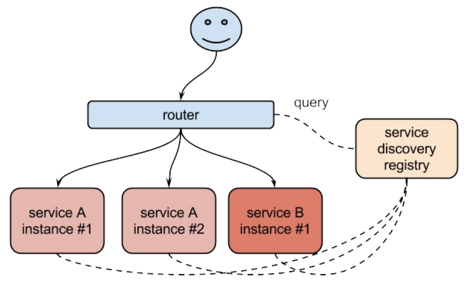

1. Pod 的⽣命是有限的，死亡过后不会复活 。RC 和 Deployment 可以动态的创建和销毁 Pod 。尽管每个 Pod 都有⾃⼰ 的 IP 地址，但是如果 Pod 重新启动了的话那么他的 IP 很有可能也发生了变化。这就带来⼀个问 题：⽐如有⼀些后端的 Pod 的集合为集群中的其他前端的 Pod 集合提供 API 服务，如果我们在 前端的 Pod 中把所有的这些后端的 Pod 的地址都写固定，然后用某种⽅式去访问其中⼀个 Pod 的服 务，这样看上去是可以⼯作的,但是如果这个 Pod 挂掉了，然后重新启动起来了，这个 IP 地址⾮常有可能就变了，这个时候前端就极⼤可能访问不到后端的服务了。这样的问题不⼀定是 IP 变化的问题，⽐如我们在部署⼀个 WEB 服务的时候，前端⼀般部署⼀个 Nginx 作为 服务的⼊⼝，然后 Nginx 后⾯肯定就是挂载的这个服务的⼤量后端，很早以前可能是去⼿动更 改 Nginx 配置中的 upstream 选项，来动态改变提供服务的数量，到后⾯出现了⼀些 服务发现 的⼯ 具，⽐如 Consul 、 ZooKeeper 还有熟悉的 etcd 等⼯具，有了这些⼯具过后我们就可以只需要把 我们的服务注册到这些服务发现中⼼去就可以，然后让这些⼯具动态的去更新 Nginx 的配置就可以 了，不⽤去⼿⼯的操作.



同样，在k8s中 Pod 被销毁或者新建后可以把这个 Pod 的地址注册到这个服务发现中⼼去就可以，这样前端的 Pod 集合就不能直接去连接后台的 Pod 集合，而是连接到⼀个能够做服务发现的中间件上⾯.Kubernetes集群提供的Service对象就相当于这个中间件.

Service 是⼀种抽象的对象， 它定义了⼀组 Pod 的逻辑集合和⼀个⽤于访问它们的策略，其实这个概念和微服务⾮常类似。⼀ 个 Serivce 下⾯包含的 Pod 集合⼀般是由 Label Selector 来决定的。假如我们后端运⾏了3个副本，这些副本都是可以替代的，因为前端并不关⼼它 们使⽤的是哪⼀个后端服务。尽管由于各种原因后端的 Pod 集合会发送变化，但是前端却不需要知道 这些变化，也不需要⾃⼰⽤⼀个列表来记录这些后端的服务， Service 的这种抽象就可以帮我们达到 这种解耦的⽬的。


2.Kubernetes 系统中的三种IP

- Node IP： Node 节点的 IP 地址 

- Pod IP: Pod 的IP地址 

- Cluster IP: Service 的 IP 地址


Node IP 是 Kubernetes 集群中节点的物理⽹卡 IP 地址(⼀般为内⽹)，所有属于这个⽹络的服务器之间都可以直接通信，所以 Kubernetes 集群外要想访问 Kubernetes 集群内部的某个节点或者服务，肯定得通过 Node IP 进⾏通信(这个时候⼀般是通过外⽹ IP 了)。


Pod IP 是每个 Pod 的 IP 地址，它是 Docker Engine 根据 docker0 ⽹桥的 IP 地址段进⾏分配 的（ flannel 这种⽹络插件保证所有节点的 Pod IP 不会冲突,像 flannel 这种⽹络插件还有Calico、Canal和Weave, 当前k8s(V1.22.0)集群使用Calico）.

```javascript
Kubernetes CNI网络最强对比：Flannel、Calico、Canal和Weave
https://blog.csdn.net/M2l0ZgSsVc7r69eFdTj/article/details/90526253
```


Cluster IP 是⼀个虚拟的 IP ，仅仅作⽤于 Kubernetes Service 这个对象，由 Kubernetes ⾃⼰ 来进⾏管理和分配地址，当然我们也⽆法 ping 这个地址，他没有⼀个真正的实体对象来响应，他只 能结合 Service Port 来组成⼀个可以通信的服务。


3. kube-proxy:

在 Kubernetes 集群中，每个 Node 会运⾏⼀个 kube-proxy 进程, 负责 为 Service 实现⼀种 VIP（虚拟 IP，就是我们上⾯说的 clusterIP ）的代理形式，现在 的 Kubernetes 中默认是使⽤的 iptables 这种模式来代理。这种模式， kube-proxy 会监 视 Kubernetes master 对 Service 对象和 Endpoints 对象的添加和移除。 对每个 Service，它会添加上 iptables 规则，从⽽捕获到达该 Service 的 clusterIP（虚拟 IP）和端⼝的请求，进⽽将请求重定向到 Service 的⼀组 backend 中的某⼀个个上⾯。 对于每个 Endpoints 对象，它也会安装 iptables 规则， 这个规则会选择⼀个 backend Pod。

 	默认的策略是，随机选择⼀个 backend。 也可以实现基于客户端 IP 的会话亲和性，可以将 service.spec.sessionAffinity 的值设置为 "ClientIP" （默认值为 "None"）。

 	另外需要了解的是如果最开始选择的 Pod 没有响应，iptables 代理能够⾃动地重试另⼀个 Pod，所以 它需要依赖 readiness probes。

.png)

会话亲和性是指假如当一个请求第一次来选择了Pod 1， 后面的请求都会路由到Pod 1 这个backend上面去；假如第一次选择的是Pod2， 后面的请求都会路由到Pod2上面 ).


4. Service类型:

- ClusterIP：通过集群的内部 IP 暴露服务，选择该值，服务只能够在集群内部可以访问，这也是默 认的ServiceType。 

- NodePort：通过每个 Node 节点上的 IP 和静态端⼝（NodePort）暴露服务。NodePort 服务会路 由到 ClusterIP 服务，这个 ClusterIP 服务会⾃动创建。通过请求 :，可以从集群的外部访问⼀个 NodePort 服务。 

- LoadBalancer：使⽤云提供商的负载局衡器，可以向外部暴露服务。外部的负载均衡器可以路由 到 NodePort 服务和 ClusterIP 服务，这个需要结合具体的云⼚商进⾏操作。 

- ExternalName：通过返回 CNAME 和它的值，可以将服务映射到 externalName 字段的内容（例 如， foo.bar.example.com）。没有任何类型代理被创建，这只有 Kubernetes 1.7 或更⾼版本的 kube-dns 才⽀持。


5. 定义Service前先准备一组Pod:

定义的这组 Pod 服务，它们对外暴露了80端⼝，同时都被打上了"app: nginx" 这样的标签.

[deployment-demo-v3.yaml](attachments/97AA24B7133E48818444A096F591615Cdeployment-demo-v3.yaml)


```javascript
# deployment-demo-v3.yaml
---
apiVersion: apps/v1
kind: Deployment
metadata:
  name: deployment-demo
  labels:
    app: deployment
spec:
  replicas: 3
  #保留最近15个版本(设置多少根据实际需要,一般只会回滚到最近几个版本,没必要保留全部版本),一般生产环境都会设置这个参数
  revisionHistoryLimit: 15
  #k8s系统等待5秒后再升级
  minReadySeconds: 5
  #设置滚动升级策略
  strategy:
    #表示策略的类型是滚动升级
    type: RollingUpdate
    rollingUpdate:
      maxSurge: 1
      maxUnavailable: 1
  selector:
    matchLabels:
      app: nginx       
  template:
    metadata:
      labels:
        app: nginx
    spec:
      containers:
      - name: nginx
        image: nginx
        ports:
        # 容器端口
        - containerPort: 80
          #容器端口名称
          name: nginx-web-port
```


```javascript
 kubectl create -f deployment-demo-v3.yaml 
 kubectl get deployment
 kubectl get pods
```


6.创建一个ClusterIP类型的Service.

官网文档查询Service的apiVersion.

https://kubernetes.io/docs/reference/generated/kubernetes-api/v1.22/#service-v1-core

[ClusterIP-Service-demo.yaml](attachments/683D4C38FA334F68BD031F5563D0CB87ClusterIP-Service-demo.yaml)

```javascript
# ClusterIP-Service-demo.yaml
---
apiVersion: v1
kind: Service
metadata:
  name: myservice
  #如果匹配的Pod在其它namespace下,那service也应该定义在这个namespace下,不定义默认值是default
  namespace: default
spec:
  #selector非常重要,它匹配Pod的labels.注意Deployment中Pod的labels是"spec.template.metadata.labels"
  selector:
    app: nginx
  #service的类型,默认是ClusterIP的类型,ClusterIP是通过集群内部IP来暴露服务,使用这种类型只能在集群内部互相访问
  type: ClusterIP
  #定义Service的端口
  ports:
  - name: mynginx-http
    #Service能够⽀持TCP和UDP协议,默认是TCP协议
    protocol: TCP
    #Service端口
    port: 80
    #匹配到Pod的端口(也就是容器的端口,和定于容器是的"containerPort: 80"端口相对应)
    targetPort: 80
```


```javascript
kubectl create -f ClusterIP-Service-demo.yaml
kubectl get svc 

# 查看Service的描述信息,描述信息中有几个重要的信息,如果:
# IP: 这个IP就是ClusterIP,这个IP是集群给它分配的IP.
# Port: 这是Service的Pod.
# TargetPort: 对应容器的Pod.
# Endpoints: Service会持续监听Selector匹配的Pod,实际上就是Pod的地址集合.   
kubectl describe svc myservice
# 从上面的命令可以看出Service的IP为10.109.126.149,端口为80

# 验证,访问Service
# 需要进入到Pod中访问Service,因为ClusterIP的类型的Service只能在集群内部互相访问
kubectl run -it test-service --image=busybox /bin/sh  
# 下载文件并查看
wget http://10.109.126.149:80
cat index.html
# "-O-"表示不下载文件,直接把文件内容输出到当前窗口
wget -O-  http://10.109.126.149:80
# "-q"表示隐藏进度条
wget -O- -q  http://10.109.126.149:80

# 删除Service
kubectl delete svc myservice
```


在k8s集群生产环境中，可能node节点不能访问外网。这个时候可能会分配几个边缘节点,边缘节点就是通过这几个节点来访问外网,也就是说整个集群中只有一两个节点能访问外网.


总结: 创建的名为 myservice 的 Service 对 象，它会将请求代理到使⽤ TCP 端⼝为 80，具有标签 "app: nginx"  的 Pod 上，这个 Service 会被 系统分配⼀个我们上⾯说的 Cluster IP ，该 Service 还会持续的监听 selector 下⾯的 Pod ，会把 这些 Pod 信息更新到⼀个名为 myservice 的 Endpoints 对象上去，这个对象就类似于 Pod 集合了 .


7.创建一个 NodePort类型的Service.

[NodePort-Service-demo.yaml](attachments/B1D0DAFB418D4782879301727A837824NodePort-Service-demo.yaml)

```javascript
# NodePort-Service-demo.yaml

---
apiVersion: v1
kind: Service
metadata:
  name: myservice2
  #如果匹配的Pod在其它namespace下,那service也应该定义在这个namespace下
  namespace: default
spec:
  #这个selector非常重要,他会去匹配Pod的labels
  selector:
    app: nginx
  type: NodePort
  #定义Service的端口
  ports:
  - name: mynginx-http
    #Service能够⽀持TCP和UDP协议,默认是TCP协议
    protocol: TCP
    #Service端口
    port: 8082
    #定义Pod的端口时如果指定了端口名称,这里可以指定端口名称,对应容器的".spec.containers.ports.name"字段 
    targetPort: nginx-web-port
    #指定node端口,集群当中所有的node节点都会分配出指定的这个端口,所以每个node节点都能从这个端口代理到Service
    #如果type是NodePort,不指定nodePort也会自动生成一个随机端口,随机端口的默认范围是"30000-32767",这个范围在安装集群的时候可以配置
    #假如现在有三个节点,这三个节点都会开31199端口,每个节点都可以通过31199端口路由到这个Service上面来
    nodePort: 31199

```


Service 能够将⼀个接收端⼝映射到任意的 targetPort 。 默认情况 下， targetPort 将被设置为与 port 字段相同的值。 可能更有趣的是，targetPort 可以是⼀个字符 串(如上面"targetPort: nginx-web-port")，引⽤了 backend Pod 的⼀个端⼝的名称。 因实际指派给该端⼝名称的端⼝号，在每个 backend Pod 中可能并不相同，所以对于部署和设计 Service ，这种⽅式会提供更⼤的灵活性。 另外 Service 能够⽀持 TCP 和 UDP 协议，默认是 TCP 协议 .


```javascript

kubectl create -f NodePort-Service-demo.yaml

#可以看到myservice2的TYPE类型已经变成了NodePort,后⾯的PORT(S)部分也多了⼀个31199的映射端⼝
kubectl get svc

kubectl describe svc myservice2
# 运行上面命令可以得出
# Service 的Ip为 10.108.213.162
# service 的Port为8082
# NodePort为31199

//用kubeadm安装的K8s集群,默认把master节点也当成一个node节点
// 所以理论上来说master节点上也有31199这样一个端口
netstat -ntlp | grep 31199

// 在浏览器中输入如下master和node地址验证,看是否出现nginx主页
# master节点IP: 192.168.32.100 
    http://192.168.32.100:31199
# node节点IP:192.168.32.101 
    http://192.168.32.101:31199
    
# Service的端口为8082,在集群内部可以通过这个端口访问
kubectl run -it test-service2 --image=busybox /bin/sh
# 同样显示出了nginx主页代码,说明在集群内部也能访问成功
wget -O- -q  http://10.108.213.162:8082     

# 删除Service
kubectl delete svc myservice2
```


 kubernetes-dashboard也是NodePort这种类型的Service.

```javascript
# 早期版本的dashboard在kube-system命名空间下
kubectl get svc -n kube-system
# 当前kubernetes-dashboard版本是v2.0.3,在kubernetes-dashboard命名空间下
kubectl get svc -n  kubernetes-dashboard
# 如果不知道在哪个命名空间下就使用下面命令
kubectl get svc --all-namespaces

# 可以看到kubernetes-dashboard也是一个NodePort类型的Service.

```


总结: 如果设置 type 的值为 "NodePort"，k8s master 将从给定的配置范围内(默认：30000- 32767，这个范围在安装集群的时候可以配置)分配端⼝。每个 Node 将从该端⼝（每个 Node 上的同⼀端⼝）代理到 Service。该端⼝将通 过 Service 的 spec.ports[*].nodePort 字段被指定，如果不指定的话会⾃动⽣成⼀个端⼝。 需要注意的是，Service 将能够通过 :spec.ports[].nodePort 和 spec.clusterIp:spec.ports[].port ⽽对外 可⻅。


8.ExternalName类型的Service.

ExternalName 是 Service 的特例，它没有 selector，也没有定义任何的端⼝和 Endpoint。 对于运⾏ 在集群外部的服务，它通过返回该外部服务的别名这种⽅式来提供服务。

```javascript
---
kind: Service
apiVersion: v1
metadata:
  name: my-service
  namespace: prod
spec:
  type: ExternalName
  externalName: my.database.example.com

```


当查询主机 my-service.prod.svc.cluster.local （后⾯服务发现的时候会再深⼊讲解）时，集群的 DNS 服务将返回⼀个值为 my.database.example.com 的 CNAME 记录。 访问这个服务的⼯作⽅式与 其它的相同，唯⼀不同的是重定向发⽣在 DNS 层，⽽且不会进⾏代理或转发。 如果后续决定要将数 据库迁移到 Kubernetes 集群中，可以启动对应的 Pod，增加合适的 Selector 或 Endpoint，修改 Service 的 type，完全不需要修改调⽤的代码，这样就完全解耦了。


假如现在有个MySql服务在k8s集群外部如何访问:

- 方式1:通过域名或外网地址的方式，如果有一天要把外部服务迁移到集群内部，这时就要修改代码，更改MySql的连接地址.

- 方式2:如果把外网服务定义成ExternalName类型的Service,集群内部同样可以通过这个地址访问，这样就完全不用修改代码，这就相当于解耦了.

