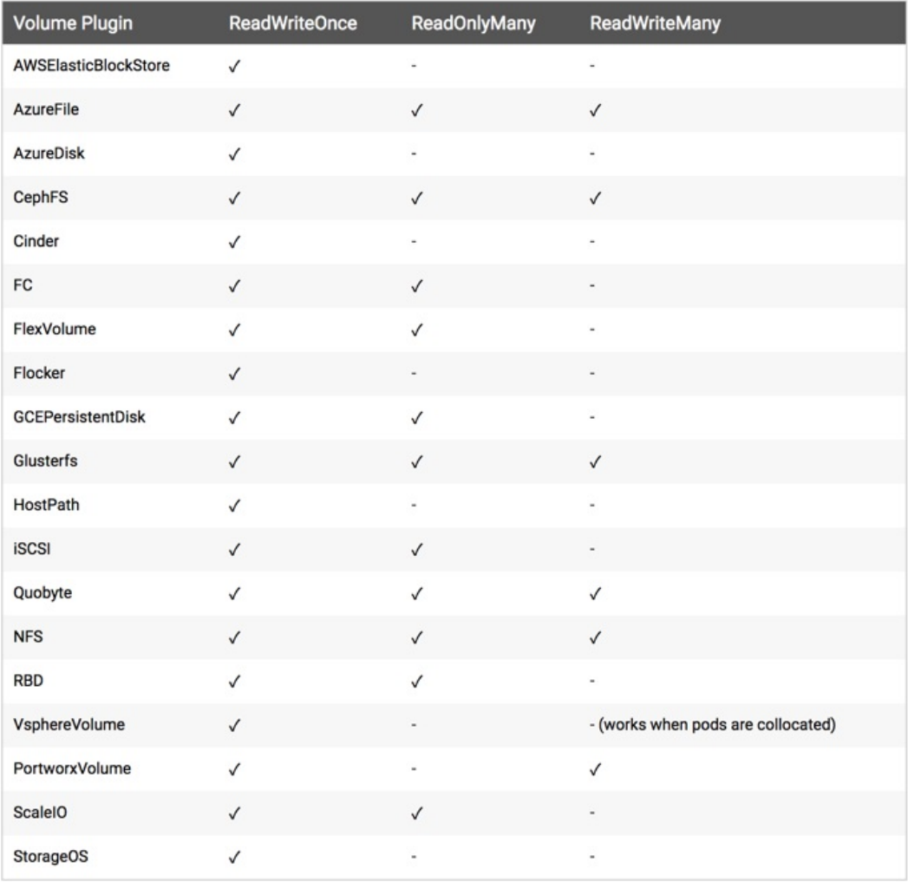

1. 除了hostPath 或者 emptyDir 的⽅式来持久化数据，还需要更加可靠的存储来保存应⽤的持久化数据，这样容器在重建后，依然可以使⽤之前的数据。但是显然存储资源和CPU资源以及内存资源有很⼤不同，为了屏蔽底层的技术实现细节，让⽤户更加⽅便的使⽤，Kubernetes 便引⼊了 PV 和 PVC 两个重要的资源对象来实现对存储的管理。

PV 的全称是：PersistentVolume（持久化卷），是对底层的共享存储的⼀种抽象，PV 由管理员进⾏ 创建和配置，它和具体的底层的共享存储技术的实现⽅式有关，⽐如 Ceph、GlusterFS、NFS 等，都 是通过插件机制完成与共享存储的对接。

PVC 的全称是：PersistentVolumeClaim（持久化卷声明），PVC 是⽤户存储的⼀种声明，PVC 和 Pod ⽐较类似，Pod 消耗的是节点，PVC 消耗的是 PV 资源，Pod 可以请求 CPU 和内存，⽽ PVC 可 以请求特定的存储空间和访问模式。对于真正使⽤存储的⽤户不需要关⼼底层的存储实现细节，只需 要直接使⽤ PVC 即可。

但是通过 PVC 请求到⼀定的存储空间也很有可能不⾜以满⾜应⽤对于存储设备的各种需求，⽽且不同的应⽤程序对于存储性能的要求可能也不尽相同，⽐如读写速度、并发性能等，为了解决这⼀问题， Kubernetes ⼜引⼊了⼀个新的资源对象：StorageClass，通过 StorageClass 的定义，管理员可以将存储资源定义为某种类型的资源，⽐如快速存储、慢速存储等，⽤户根据 StorageClass 的描述 就可以⾮常直观的知道各种存储资源的具体特性了，这样就可以根据应⽤的特性去申请合适的存储资 源了。


2. 准备NFS存储服务，NFS是相对简单的存储资源.


来安装 NFS 服务，数据⽬录：/data/k8s/

```javascript
// 为了方便就在主机节点安装NFS服务

// 0. 创建目录并设置权限, "-p"参数表示 不存在父目录就建立它
df -h  // 获取硬盘被占用了多少空间,目前还剩下多少空间等信息."-h"表示方便阅读的方式显示
mkdir -p /data/k8s/
chmod 755 /data/k8s/

// 1. 关闭防火墙,可以省略后面的 ".service"
 systemctl stop firewalld.service
 systemctl disable firewalld.service
 
// 2. 安装配置 nfs
 yum -y install nfs-utils rpcbind
 
// 3. 配置nfs，nfs的默认配置⽂件在 /etc/exports ⽂件下,在该⽂件中添加配置信息 
 vi /etc/exports
    /data/k8s *(rw,sync,no_root_squash)
cat /etc/exports      
// 配置说明：
//	 /data/k8s：是共享的数据⽬录
//	 * ：表示任何⼈都有权限连接，当然也可以是⼀个⽹段，⼀个 IP，也可以是域名
//	 rw：读写的权限
//	 sync：表示⽂件同时写⼊硬盘和内存
//	 no_root_squash：当登录NFS主机使⽤共享⽬录的使⽤者是root时,其权限将被转换成为匿名使⽤者,通常它的UID与GID,都会变成nobody身份
// nfs的配置还有很多,可以在网上了解更多信息
```


启动服务 nfs 需要向 rpc 注册，rpc ⼀旦重启了，注册的⽂件都会丢失，向他注册的服务都需要重启，所以注意启动顺序，先启动 rpcbind

```javascript
// 1. 启动 rpcbind
[root@centos7 /]# systemctl start rpcbind.service
[root@centos7 /]# systemctl enable rpcbind 
[root@centos7 /]# systemctl status rpcbind
● rpcbind.service - RPC bind service
   Loaded: loaded (/usr/lib/systemd/system/rpcbind.service; enabled; vendor preset: enabled)
   Active: active (running) since Tue 2021-09-21 12:21:19 EDT; 13s ago
 Main PID: 23959 (rpcbind)
   CGroup: /system.slice/rpcbind.service
           └─23959 /sbin/rpcbind -w

Sep 21 12:21:18 centos7.master systemd[1]: Starting RPC bind service...
Sep 21 12:21:19 centos7.master systemd[1]: Started RPC bind service.
// 看到看到上⾯的 Started 证明启动成功了

// 2. 启动 nfs 服务
[root@centos7 /]# systemctl start nfs.service
// 设置开机启动
[root@centos7 /]# systemctl enable nfs
Created symlink from /etc/systemd/system/multi-user.target.wants/nfs-server.service to /usr/lib/systemd/system/nfs-server.service.
[root@centos7 /]# systemctl status nfs
● nfs-server.service - NFS server and services
   Loaded: loaded (/usr/lib/systemd/system/nfs-server.service; enabled; vendor preset: disabled)
  Drop-In: /run/systemd/generator/nfs-server.service.d
           └─order-with-mounts.conf
   Active: active (exited) since Tue 2021-09-21 12:23:58 EDT; 15s ago
 Main PID: 25794 (code=exited, status=0/SUCCESS)
   CGroup: /system.slice/nfs-server.service

Sep 21 12:23:58 centos7.master systemd[1]: Starting NFS server and services...
Sep 21 12:23:58 centos7.master systemd[1]: Started NFS server and services.
// 看到看到上⾯的 Started 则证明 NFS Server 启动成功了

// 3. 通过下面的命令确认
[root@centos7 /]#  rpcinfo -p|grep nfs
    100003    3   tcp   2049  nfs
    100003    4   tcp   2049  nfs
    100227    3   tcp   2049  nfs_acl
    100003    3   udp   2049  nfs
    100003    4   udp   2049  nfs
    100227    3   udp   2049  nfs_acl

// 4. 查看具体⽬录挂载权限
[root@centos7 /]# cat /var/lib/nfs/etab
/data/k8s	*(rw,sync,wdelay,hide,nocrossmnt,secure,no_root_squash,no_all_squash,no_subtree_check,secure_locks,acl,no_pnfs,anonuid=65534,anongid=65534,sec=sys,rw,secure,no_root_squash,no_all_squash)


```

 


到这⾥在master节点把 nfs server 给安装成功了，接下来在node节点上来安装 nfs 的客户端来验证 nfs 。

```javascript

// 以下操作在node节点执行

// 和master安装方式一样
systemctl stop firewalld.service
systemctl disable firewalld.service

yum -y install nfs-utils rpcbind
systemctl start rpcbind.service
systemctl enable rpcbind.service
systemctl start nfs.service
systemctl enable nfs.service

// 在这里启动完成进行测试
// 1. ⾸先检查下 nfs 是否有共享⽬录,格式 showmount -e $NFS服务IP
[root@centos7 ~]# showmount -e 192.168.32.100
Export list for 192.168.32.100:
/data/k8s *

// 2. 在客户端新建目录
mkdir -p /nfs/data/k8s_v1_22_0

// 3. 将 nfs 共享⽬录挂载到上⾯创建的⽬录
mount -t nfs 192.168.32.100:/data/k8s /nfs/data/k8s_v1_22_0

// 4. 在客户端目录新建一个文件,如果nfs服务端目录下也有这样一个文件,说明nfs服务正常
// 4.1 在客户端执行
[root@centos7 /]# touch /nfs/data/k8s_v1_22_0/test.txt
// 4.2 在服务端执行
[root@centos7 k8s]# ls -ls /data/k8s
total 0
0 -rw-r--r--. 1 root root 0 Sep 23 01:46 test.txt

```


3. PV

有了 NFS 共享存储就可以来使⽤ PV 和 PVC 了。PV 作为存储资源，主要包括存储 能⼒、访问模式、存储类型、回收策略等关键信息，下⾯我们来新建⼀个 PV 对象，使⽤ nfs 类型的后 端存储，1G 的存储空间，访问模式为 ReadWriteOnce，回收策略为 Recyle。

[pv-nfs-demo.yaml](attachments/67FF48CA00F745E59F3664B1054FDE3Fpv-nfs-demo.yaml)

```javascript
# pv-nfs-demo.yaml
---
apiVersion: v1
kind: PersistentVolume
metadata:
  name: pv-nfs
spec:
  capacity:
    storage: 1Gi
  accessModes:
  - ReadWriteOnce
  # 回收策略
  persistentVolumeReclaimPolicy: Recycle
  nfs:
    # nfs服务所在的主机IP
    server: 192.168.32.100
    # nfs共享数据目录
    path: /data/k8s
    
```


```javascript
kubectl create -f pv-nfs-demo.yaml
kubectl get pv
// 可以看到pv-nfs已经创建成功,状态是 Available,表示 pv1 就绪,可以被 PVC 申请
```


Kubernetes ⽀持的 PV 类型有很多，⽐如常⻅的 Ceph、GlusterFs、NFS，甚⾄ HostPath也可以，不 过 HostPath 仅仅可以⽤于单机测试，更多的⽀持类型可以前往 Kubernetes PV 官⽅⽂档进⾏查看，因为每种存储类型都有各⾃的特点，所以在使⽤的时候可以去查看相应的⽂档来设置对应的参数。


K8s-PV官⽅⽂档: https://kubernetes.io/docs/concepts/storage/persistent-volumes/


4. PV属性解读。


Capacity（存储能⼒） 

⼀般来说，⼀个 PV 对象都要指定⼀个存储能⼒，通过 PV 的 capacity属性来设置的，⽬前只⽀持存储 空间的设置，就是我们这⾥的 storage=1Gi，不过未来可能会加⼊ IOPS、吞吐量等指标的配置。


AccessModes（访问模式）

AccessModes 是⽤来对 PV 进⾏访问模式的设置，⽤于描述⽤户应⽤对存储资源的访问权限，访问权 限包括下⾯⼏种⽅式： 

- ReadWriteOnce（RWO）：读写权限，但是只能被单个节点挂载 

- ReadOnlyMany（ROX）：只读权限，可以被多个节点挂载 

- ReadWriteMany（RWX）：读写权限，可以被多个节点挂载

注意：⼀些 PV 可能⽀持多种访问模式，但是在挂载的时候只能使⽤⼀种访问模式，多种访问模式是不会⽣效的。下图是⼀些常⽤的 Volume 插件⽀持的访问模式：




persistentVolumeReclaimPolicy（回收策略） 

⽬前 PV ⽀持的策略有三种： 

- Retain（保留）- 保留数据，也就是说PVC解绑后数据不会直接删掉，需要管理员⼿⼯清理数据 

- Recycle（回收）- 清除 PV 中的数据，效果相当于执⾏ rm -rf /thevoluem/* 

- Delete（删除）- 与 PV 相连的后端存储完成 volume 的删除操作，当然这常⻅于云服务商的存储 服务，⽐如 ASW EBS。 

不过需要注意的是，⽬前只有 NFS 和 HostPath 两种类型⽀持回收策略。当然⼀般来说还是设置为 Retain 这种策略保险⼀点。


状态 

⼀个 PV 的⽣命周期中，可能会处于4中不同的阶段：

- Available（可⽤）：表示可⽤状态，还未被任何 PVC 绑定 

- Bound（已绑定）：表示 PV 已经被 PVC 绑定 

- Released（已释放）：PVC 被删除，但是资源还未被集群重新声明 

- Failed（失败）： 表示该 PV 的⾃动回收失败