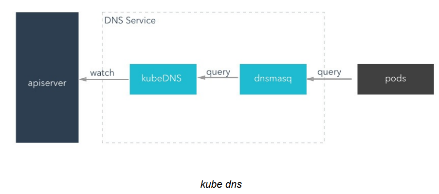
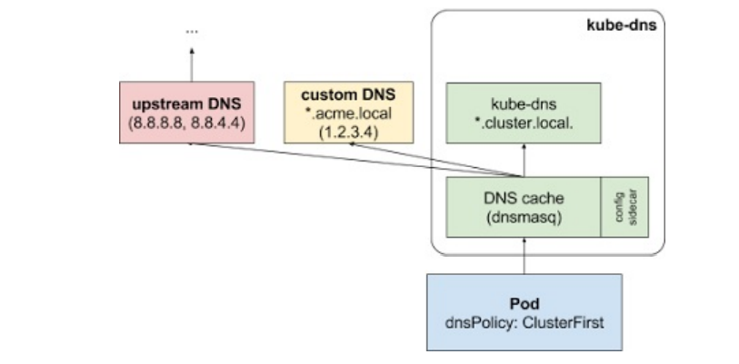

1.  内部服务发现

可以通过 Service ⽣成的 ClusterIP(VIP)来访问 Pod 提供的服务，但是在使⽤的时候还有⼀个问题：如何知道某个Service的 ClusterIP(VIP)呢？

⽐如有两个应⽤， ⼀个是 api 应⽤，⼀个是 db 应⽤，两个应⽤都是通过 Deployment 进⾏管理的，并且都通过 Service 暴露出了端⼝提供服务。api 需要连接到 db 这个应⽤，我们只知道 db 应⽤的名称和 db 对应的 Service 的名称，但是并不知道它的 VIP 地址， 因为通过 Service 的ClusterIP 就可以访问到后⾯的 Pod 服务，所以知道 VIP 的地址就⾏了.

所有service信息和endpoint信息都存到etcd数据库中了，所以最简单的办法通过 apiserver 查询


2.  apiserver

可以从 apiserver 中直接查询获取到对应 service 的后端 Endpoints信息，所以最简单的办法 是从 apiserver 中直接查询，如果偶尔⼀个特殊的应⽤通过 apiserver 去查询到 Service 后⾯的 Endpoints 直接使⽤是没问题的，但是如果每个应⽤都在启动的时候去查询依赖的服务，这不但增加了 应⽤的复杂度，这也导致了应⽤需要依赖 Kubernetes 了，耦合度太⾼了，不具有通⽤性。


3. 环境变量

为了解决上⾯的问题，在之前的版本中，Kubernetes 采⽤了环境变量的⽅法，每个 Pod 启动的时候， 会通过环境变量设置所有服务的 IP 和 port 信息，这样 Pod 中的应⽤可以通过读取环境变量来获取依 赖服务的地址信息，这种⽅法使⽤起来相对简单，但是有⼀个很⼤的问题就是依赖的服务必须在 Pod 启动之前就存在，不然是不会被注⼊到环境变量中的。


 如下示例,先创建"db.yaml", 再创建"api.yaml"

[db.yaml](attachments/4D3AB4A3B84748E283655CCE705EA07Edb.yaml)

```javascript
# 模拟db
---
apiVersion: apps/v1
kind: Deployment
metadata:
  name: nginx-deploy
  labels:
    k8s-app: nginx-demo
spec:
  replicas: 2
  selector:
    matchLabels:
      app: nginx 
  template:
    metadata:
      labels:
        app: nginx
    spec:
      containers:
      - name: nginx
        image: nginx:1.7.9
        imagePullPolicy: IfNotPresent
        ports:
        - containerPort: 80
---
apiVersion: v1
kind: Service
metadata:
  name: nginx-service
  labels:
    name: nginx-service
spec:
  selector:
    app: nginx
  ports:
  - port: 5000
    targetPort: 80
```


```javascript
kubectl create -f db.yaml
kubectl get pods
kubectl get svc
kubectl describe svc nginx-service

// 查看 nginx-service 这个 service 的 ClusterIP 信息
// 该 Service 监听的端⼝是 5000，同时它会把流量转发给它代理的所有 Pod(这⾥就是拥有 app: nginx 标签的两个Pod)
[root@centos7]# kubectl get svc | grep nginx-service
nginx-service   ClusterIP   10.105.233.201   <none>        5000/TCP         16m 

```


[api.yaml](attachments/B38EFA24AA0C47C0BE5BBE5DD1D69F74api.yaml)

```javascript
#模拟api服务:
---
apiVersion: v1
kind: Pod
metadata:
  name: test-api
  labels:
    app: test-pod
spec:
  containers:
  - name: test-api
    image: busybox
    imagePullPolicy: IfNotPresent
    # 打印环境变量
    command: ["/bin/sh", "-c", "env"]
```


```javascript
kubectl create -f api.yaml 
kubectl get pods
// 查看⽇志信息,发现该 Pod 中有很多环境变量,这是因为所有服务的 IP 和 port 信息都被设置到了这个Pod的环境变量中
kubectl logs test-api
kubectl logs test-api | grep NGINX

// 环境变量中包含了 nginx-service 这个 service 的信息 
[root@centos7 38]# kubectl logs test-api | grep 10.105.233.201
NGINX_SERVICE_PORT_5000_TCP_ADDR=10.105.233.201
NGINX_SERVICE_SERVICE_HOST=10.105.233.201
NGINX_SERVICE_PORT_5000_TCP=tcp://10.105.233.201:5000
NGINX_SERVICE_PORT=tcp://10.105.233.201:5000
```


```javascript
[root@centos7 38]# kubectl logs test-api
MYSERVICE_SERVICE_HOST=10.109.126.149
NGINX_WEB_PORT_80_TCP_ADDR=10.100.169.214
KUBERNETES_SERVICE_PORT=443
KUBERNETES_PORT=tcp://10.96.0.1:443
MYDB_SERVICE_PORT=80
MYDB_PORT=tcp://10.107.78.227:80
NGINX_WEB_PORT_80_TCP_PORT=80
HOSTNAME=test-api
NGINX_WEB_PORT_80_TCP_PROTO=tcp
SHLVL=1
HOME=/root
MYSERVICE_PORT=tcp://10.109.126.149:80
MYSERVICE_SERVICE_PORT=80
MYDB_PORT_80_TCP_ADDR=10.107.78.227
NGINX_SERVICE_PORT_5000_TCP_ADDR=10.105.233.201
MYSERVICE2_SERVICE_HOST=10.108.213.162
MYDB_PORT_80_TCP_PORT=80
MYDB_PORT_80_TCP_PROTO=tcp
NGINX_WEB_PORT_80_TCP=tcp://10.100.169.214:80
NGINX_SERVICE_PORT_5000_TCP_PORT=5000
MYSERVICE_PORT_80_TCP_ADDR=10.109.126.149
MYSERVICE2_PORT_8082_TCP_ADDR=10.108.213.162
NGINX_SERVICE_PORT_5000_TCP_PROTO=tcp
MYSERVICE2_PORT_8082_TCP_PORT=8082
MYSERVICE_PORT_80_TCP_PORT=80
MYSERVICE_PORT_80_TCP_PROTO=tcp
MYSERVICE2_PORT_8082_TCP_PROTO=tcp
MYSERVICE2_SERVICE_PORT=8082
MYSERVICE_SERVICE_PORT_MYNGINX_HTTP=80
MYSERVICE2_PORT=tcp://10.108.213.162:8082
KUBERNETES_PORT_443_TCP_ADDR=10.96.0.1
MYDB_PORT_80_TCP=tcp://10.107.78.227:80
PATH=/usr/local/sbin:/usr/local/bin:/usr/sbin:/usr/bin:/sbin:/bin
NGINX_SERVICE_SERVICE_HOST=10.105.233.201
KUBERNETES_PORT_443_TCP_PORT=443
NGINX_SERVICE_PORT_5000_TCP=tcp://10.105.233.201:5000
KUBERNETES_PORT_443_TCP_PROTO=tcp
MYSERVICE_PORT_80_TCP=tcp://10.109.126.149:80
MYSERVICE2_PORT_8082_TCP=tcp://10.108.213.162:8082
NGINX_WEB_SERVICE_HOST=10.100.169.214
NGINX_SERVICE_PORT=tcp://10.105.233.201:5000
NGINX_SERVICE_SERVICE_PORT=5000
MYSERVICE2_SERVICE_PORT_MYNGINX_HTTP=8082
KUBERNETES_PORT_443_TCP=tcp://10.96.0.1:443
KUBERNETES_SERVICE_PORT_HTTPS=443
NGINX_WEB_PORT=tcp://10.100.169.214:80
KUBERNETES_SERVICE_HOST=10.96.0.1
NGINX_WEB_SERVICE_PORT=80
PWD=/
MYDB_SERVICE_HOST=10.107.78.227
```

打印出 Pod 的日志可以看到有很多环境变量，其中就包括刚刚创建的 nginx-service 这个服务，有 HOST、PORT、PROTO、ADDR 等，也包括其他已经存在的 Service 的环境变量，现在如果需要在这个 Pod ⾥⾯访问 nginx-service 这个服务，就可以直接通过 NGINX_SERVICE_SERVICE_HOST 和 NGINX_SERVICE_SERVICE_PORT 就可以了，但是这个 Pod 启动起来的时候如果 nginx-service 服务还没启动起来，在环境变量中是⽆法获取到这些信息的，当然可以通过 initContainer 之类的⽅法来确保 nginx-service 启动后再启动 Pod，但是这种⽅法毕竟增加了 Pod 启动的复杂性，所以这不是最优的⽅法。


4. KubeDNS (最新版的1.11.0版本中官⽅已经推荐使⽤ CoreDNS)

由于环境变量这种⽅式的局限性，所以需要⼀种更加智能的⽅案，其实可以想到⼀种⽐较理想的⽅案，那就是可以直接使⽤ Service 的名称，因为 Service 的名称不会变化，不需要去关⼼分配的 ClusterIP 的地址，因为这个地址并不是固定不变的，所以如果直接使⽤ Service 的名字，然后对应的 ClusterIP 地址的转换能够⾃动完成就好了。名字和 IP 的转换和⽹站⾮常类似，就是通过 DNS转换。同样，Kubernetes 也提供了 DNS 的⽅案来解决上⾯的服务发现的问题。

DNS 服务不是⼀个独⽴的系统服务，⽽是作为⼀种 addon 插件⽽存在，也就是说不是 Kubernetes 集 群必须安装的，当然强烈推荐安装，可以将这个插件看成是⼀种运⾏在 Kubernetes 集群上的⼀直⽐较特殊的应⽤，现在⽐较推荐的两个插件：kube-dns 和 CoreDNS。


Kubernetes DNS pod 中包括 3 个容器，可以通过 kubectl ⼯具查看：

```javascript
$ kubectl get pods -n kube-system
NAME                        READY STATUS RESTARTS AGE
kube-dns-5868f69869-zp5kz    3/3   Running    0   19d
// READY ⼀栏可以看到是 3/3，⽤如下命令可以很清楚的看到 kube-dns 包含的3个容器
$ kubectl describe pod kube-dns-5868f69869-zp5kz -n kube-system
```

Kubernetes DNS pod 中包括 kube-dns、dnsmasq-nanny、sidecar 这3个容器，分别实现的功能如下:

- kubedns: kubedns 基于 SkyDNS 库，通过 apiserver 监听 Service 和 Endpoints 的变更事件同时 也同步到本地 Cache，实现了⼀个实时的 Kubernetes 集群内 Service 和 Pod 的 DNS服务发现

- dnsmasq: dsnmasq 容器则实现了 DNS 的缓存功能(在内存中预留⼀块默认⼤⼩为 1G 的地⽅，保 存当前最常⽤的 DNS 查询记录，如果缓存中没有要查找的记录，它会到 kubedns 中查询，并把 结果缓存起来)，通过监听 ConfigMap 来动态⽣成配置

- sider: sidecar 容器实现了可配置的 DNS 探测，并采集对应的监控指标暴露出来供 prometheus 使⽤




4.1 对 Pod 的影响:

DNS Pod 具有静态 IP 并作为 Kubernetes 服务暴露出来。该静态 IP 被分配后，kubelet 会将使⽤ -- cluster-dns = <dns-service-ip> 参数配置的 DNS 传递给每个容器。DNS 名称也需要域名，本地域在 kubelet 中可以使⽤参数配置 --cluster-domain = <default-local-domain> 。

```javascript
[root@centos7 ~]# systemctl status kubelet
[root@centos7 ~]# cat /usr/lib/systemd/system/kubelet.service.d/10-kubeadm.conf
[root@centos7 ~]# cat /var/lib/kubelet/config.yaml
...
clusterDNS:
- 10.96.0.10
clusterDomain: cluster.local
...

```


dnsmasq 容器通过监听 ConfigMap 来动态⽣成配置，可以⾃定义存根域和上下游域名服务器。例如，下⾯的 ConfigMap 建⽴了⼀个 DNS 配置，它具有⼀个单独的存根域和两个上游域名服务器：

```javascript
---
apiVersion: v1
kind: ConfigMap
metadata:
   name: kube-dns
   namespace: kube-system
data:
  # 保存配置文件,stubDomains和upstreamNameservers就相当于配置文件的文件名称
  # stubDomains 是存根域
  stubDomains: |
    {"acme.local": ["1.2.3.4"]}
  # upstreamNameservers 是上游域名服务器
  upstreamNameservers: |
    ["8.8.8.8", "8.8.4.4"]
```


```javascript
kubectl get cm -n kube-system
kubectl get cm kube-dns -n kube-system -o yaml
```

如上DNS配置说明具有“.acme.local”后缀的DNS请求被转发到DNS "1.2.3.4" 。 "8.8.8.8"和 "8.8.4.4"是Google 公共 DNS 服务器, 为上游查询提供服务。下表描述了具有特定域名的查询如何映射到它们的⽬标 DNS 服务器：

| 域名 | 响应查询的服务器 |
| - | - |
| kubernetes.default.svc.cluster.local | kube-dns |
| foo.acme.local  | ⾃定义 DNS (1.2.3.4) |
| widget.com  | 上游 DNS (8.8.8.8, 8.8.4.4，其中之⼀) |


另外还可以为每个 Pod 设置 DNS 策略。 当前 Kubernetes ⽀持两种 Pod 特定的 DNS 策略：“Default” 和 “ClusterFirst”。 可以通过 dnsPolicy 标志来指定这些策略。(注意：Default 不是默认 DNS 策略。如果没有显式指定dnsPolicy，将会默认使⽤ ClusterFirst)


4.2 “Default” 和 “ClusterFirst”策略：

4.2.1 

如果 dnsPolicy 被设置为 “Default”，则名字解析配置会继承⾃ Pod 运⾏所在的节点。⾃定义上游域名服务器和存根域不能够与这个策略⼀起使⽤


4.2.2 

如果 dnsPolicy 被设置为 “ClusterFirst”，这就要依赖于是否配置了存根域和上游 DNS 服务器。分为如下情况：

- 未进⾏⾃定义配置：没有匹配上配置的集群域名后缀的任何请求，例如“www.kubernetes.io”，将会被转发到继承⾃节点的上游域名服务器。

- 进⾏⾃定义配置：如果配置了存根域和上游 DNS 服务器（类似于 前⾯示例 配置的内容）， DNS 查询将基于下⾯的流程对请求进⾏路由：

- 查询⾸先被发送到 kube-dns 中的 DNS 缓存层。

- 从缓存层检查请求的后缀，并根据下⾯的情况转发到对应的DNS上:

1. 具有集群后缀的名字（例如 “.cluster.local”）：请求被发送到 kubedns。

1. 具有存根域后缀的名字（例如 “.acme.local”）：请求被发送到配置的⾃定义 DNS 解析器（例如：监听在 1.2.3.4）。

1. 未能匹配上后缀的名字（例如 “widget.com”）：请求被转发到上游 DNS（例如：Google 公共 DNS 服务器，8.8.8.8 和 8.8.4.4）。





4.3 域名格式，kubedns 可以将 Service ⽣成 DNS 记录：


4.3.1 普通的 Service：

会⽣成 servicename.namespace.svc.cluster.local 的域名，会解析到 Service 对应的 ClusterIP 上, 在Pod之间的调⽤可以简写成 servicename.namespace，如果处于同⼀个命名空间下⾯，甚⾄可以只写成 servicename 即可访问。


4.3.2 Headless Service  (⽆头服务,主要是针对StatefulSet)：

就是把 clusterIP 设置为 None 的，会被解析为指定 Pod 的 IP 列 表，同样还可以通过 podname.servicename.namespace.svc.cluster.local 访问到具体的某⼀个 Pod。


5. CoreDNS

CoreDNS 实现的功能和 KubeDNS 是⼀致的，不过 CoreDNS 的所有功能都集成在了同⼀个容 器中，在最新版的1.11.0版本中官⽅已经推荐使⽤ CoreDNS了，⼤家也可以安装 CoreDNS 来代 替 KubeDNS，其他使⽤⽅法都是⼀致的：https://coredns.io/


如果要使⽤ CoreDNS 的话也很⽅便，只需要执⾏下⾯的命令即可：

```javascript
kubeadm init --feature-gates=CoreDNS=true
```


6. 测试: 使⽤⼀个简单 Pod 来测试下 Service 的域名访问


6.1  /etc/resolv.conf文件介绍

/etc/resolv.conf文件详解: https://www.cnblogs.com/dhcn/p/11224360.html

/etc/resolv.conf它是DNS客户机配置文件，用于设置DNS服务器的IP地址及DNS域名，还包含了主机的域名搜索顺序。该文件是由域名解析 器(resolver，一个根据主机名解析IP地址的库)使用的配置文件。它的格式很简单，每行以一个关键字开头，后接一个或多个由空格隔开的参数。resolv.conf的关键字主要有四个，分别是：

- nameserver    //定义DNS服务器的IP地址

- domain       //定义本地域名

- search        //定义域名的搜索列表

- sortlist        //对返回的域名进行排序


6.2  测试

 进⼊到 Pod 中查看/etc/resolv.conf中的内容:

```javascript
// 在master节点操作
// --rm 参数表示退出以后自动删除
[root@centos7 aaron]# kubectl run --rm -i --tty test-dns --image=busybox /bin/sh
If you don't see a command prompt, try pressing enter.
/ # cat /etc/resolv.conf 
nameserver 10.96.0.10
search default.svc.cluster.local svc.cluster.local cluster.local node
options ndots:5
/ #

// 可以看到 /etc/resolv.conf 文件中包含了nameserver 和 search
// nameserver 是定义DNS服务器的IP地址, search定义的是搜索域
 
```

可以看到 nameserver 的地址10.96.0.10，该 IP 地址即是在安装 kubedns 插件的时候集群分配给 kube-dns service 的⼀个固定的静态 IP 地址，可以通过下⾯的命令 进⾏查看：

```javascript
// 在node节点操作
[root@centos7 ~]# kubectl get svc kube-dns -n kube-system
NAME       TYPE        CLUSTER-IP   EXTERNAL-IP   PORT(S)                  AGE
kube-dns   ClusterIP   10.96.0.10   <none>        53/UDP,53/TCP,9153/TCP   64d
[root@centos7 ~]#

```

也就是说这个 Pod 现在默认的 nameserver 就是 kubedns 的地址,现在在 Pod中访问前⾯创建的 nginx-service 服务：

```javascript
// 在node节点操作, 查询nginx服务
[root@centos7 ~]# kubectl get svc | grep nginx
nginx-service   ClusterIP   10.105.233.201   <none>        5000/TCP         5d18h
nginx-web       NodePort    10.100.169.214   <none>        80:31026/TCP     64d
```


```javascript
// 在master节点操作
// 在 Pod(使用busybox镜像创建的容器)中访问 nginx-service 服务,返回了nginx主页
/ # wget -q -O- nginx-service.default.svc.cluster.local:5000
// 同样如形式下也可以访问 nginx-service 服务并返回了nginx主页
/ # wget -q -O- nginx-service.default.svc:5000
/ # wget -q -O- nginx-service.default:5000
/ # wget -q -O- nginx-service:5000

// 不能访问 nginx-web 服务,因为 nginx-web 服务是 NodePort 类型
/ # wget -q -O- nginx-web.default.svc.cluster.local
wget: can't connect to remote host (10.100.169.214): Connection refused
```


访问格式:  [ServiceName].[namespace].svc.cluster.local

Pod之间可以简写为:  [ServiceName].[namespace]

同一命名空间下的Pod:  [ServiceName]


到这⾥就实现了在集群内部通过Service的域名形式进⾏互相通信,使⽤ ingress 可以实现集群外部的服务发现功能.


