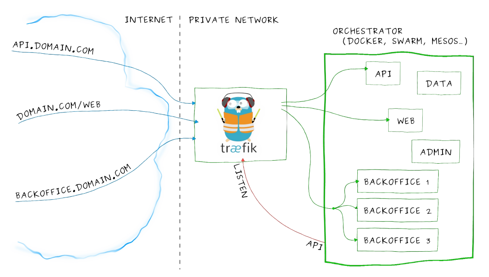

1. Kubernetes 集群内部使⽤ kube-dns 实现服务发现的功能,那么部署在 Kubernetes 集群中的应⽤如何暴露给外部的⽤户使⽤呢？使⽤ NodePort 和 LoadBlancer 类型的 Service 可以实现把应⽤暴露给外部⽤户使⽤，除此之外，Kubernetes 还提供了⼀个⾮常重要的资源对象可以⽤来暴露服务给外部⽤户，那就是 ingress.

对于⼩规模的应⽤使⽤ NodePort 或许能够满⾜的需求，但是当应⽤越来越多的时候，就会发现对于 NodePort 的管理就⾮常麻烦，这个时候使⽤ ingress 就⾮常⽅便，可以避免管理⼤量的 Port.


2. Ingress 介绍

Ingress 其实就是从 kuberenets 集群外部访问集群的⼀个⼊⼝，将外部的请求转发到集群内不同的 Service 上，其实就相当于 nginx、haproxy 等负载均衡代理服务器，为什么不直接使⽤ nginx 实现？

但是只使⽤ nginx 这种⽅式有很⼤缺陷，每次有新服务加⼊的时候怎么改 Nginx 配置？不可能⼿动更改或者滚动更新前端的 Nginx Pod ？那再加上⼀个服务发现的⼯具，⽐如 consul 如何？这样貌似也可以，⽽且在之前单独使⽤ docker 的时候，这种⽅式已经使⽤得很普遍了，Ingress 实际上就是这样实现的，只是服务发现的功能⾃⼰实现了，不需要使⽤第三⽅的服务了，然后再加上⼀个域名规则定义，路由信息的刷新需要⼀个靠 Ingress controller 来提供.

Ingress controller 可以理解为⼀个监听器，通过不断地与 kube-apiserver 打交道，实时的感知后端 service、pod 的变化，当得到这些变化信息后，Ingress controller 再结合 Ingress 的配置，更新反向 代理负载均衡器，达到服务发现的作⽤。其实这点和服务发现⼯具 consul consul-template ⾮常类似。

可以供使⽤的 Ingress controller 有很多，⽐如 traefik、nginx-controller、Kubernetes Ingress Controller for Kong、HAProxy Ingress controller，当然也可以⾃⼰实现⼀个 Ingress Controller，现在普遍⽤得较多的是 traefik 和 nginx-controller，traefik 的性能较 nginx-controller 差，但是配置使⽤要 简单许多，这⾥会以更简单的 traefik 为例介绍 ingress 的使⽤。


3. Traefik		https://doc.traefik.io/

Traefik 是⼀款开源的反向代理与负载均衡⼯具。最⼤的优点是能够与常⻅的微服务系统直接整合, 可以实现⾃动化动态配置. ⽬前⽀持Docker、Swarm、Mesos/Marathon、 Mesos、Kubernetes、 Consul、Etcd、Zookeeper、BoltDB、Rest API 等等后端模型。



要使⽤ traefik，同样需要部署 traefik 的 Pod，要部署在边缘节点(边缘节点 就是所有的外网服务都是通过边缘节点来进行服务访问,内部的集群节点只有一个内网网卡),因为边缘节点才能访问外网。 


3.1 为安全起⻅这⾥使⽤ RBAC 安全认证⽅式(rbac.yaml)：


官方YAML文件:  https://doc.traefik.io/traefik/routing/providers/kubernetes-ingress/#configuration-example  => 点击"Configuring Kubernetes Ingress Controller" => 选择"RBAC"

[rbac.yaml](attachments/28115E23E08B41C087185E32EC411A8Arbac.yaml)

```javascript
# 为安全起⻅这⾥使⽤ RBAC 安全认证⽅式
---
apiVersion: v1
kind: ServiceAccount
metadata:
    name: traefik-ingress-controller
    namespace: kube-system

---
apiVersion: rbac.authorization.k8s.io/v1
kind: ClusterRole
metadata:
  name: traefik-ingress-controller
rules:
  - apiGroups:
      - ""
    resources:
      - services
      - endpoints
      - secrets
    verbs:
      - get
      - list
      - watch
  - apiGroups:
      - extensions
      - networking.k8s.io
    resources:
      - ingresses
      - ingressclasses
    verbs:
      - get
      - list
      - watch
  - apiGroups:
      - extensions
    resources:
      - ingresses/status
    verbs:
      - update

---
apiVersion: rbac.authorization.k8s.io/v1
kind: ClusterRoleBinding
metadata:
  name: traefik-ingress-controller
roleRef:
  apiGroup: rbac.authorization.k8s.io
  kind: ClusterRole
  name: traefik-ingress-controller
subjects:
  - kind: ServiceAccount
    name: traefik-ingress-controller
    namespace: kube-system
    
```


```javascript
[root@centos7 39traefik]# kubectl create -f rbac.yaml 
serviceaccount/traefik-ingress-controller created
clusterrole.rbac.authorization.k8s.io/traefik-ingress-controller created
clusterrolebinding.rbac.authorization.k8s.io/traefik-ingress-controller created
```


3.2  然后使⽤ Deployment 来管理 Pod，直接使⽤官⽅的 traefik 镜像部署即可(traefik.yaml):


```javascript
# 首先查看k8s集群中有哪些节点
[root@centos7 39traefik]# kubectl get nodes
NAME             STATUS   ROLES                  AGE   VERSION
centos7.master   Ready    control-plane,master   67d   v1.22.1
centos7.node     Ready    <none>                 67d   v1.22.1
# 查看k8s集群中有哪些节点并显示labels
[root@centos7 39traefik]# kubectl get nodes --show-labels
NAME             STATUS   ROLES                  AGE   VERSION   LABELS
centos7.master   Ready    control-plane,master   67d   v1.22.1   beta.kubernetes.io/arch=amd64,beta.kubernetes.io/os=linux,kubernetes.io/arch=amd64,kubernetes.io/hostname=centos7.master,kubernetes.io/os=linux,node-role.kubernetes.io/control-plane=,node-role.kubernetes.io/master=,node.kubernetes.io/exclude-from-external-load-balancers=
centos7.node     Ready    <none>                 67d   v1.22.1   beta.kubernetes.io/arch=amd64,beta.kubernetes.io/os=linux,kubernetes.io/arch=amd64,kubernetes.io/hostname=centos7.node,kubernetes.io/os=linux
[root@centos7 39traefik]# 
```


官方YAML文件:  

https://doc.traefik.io/traefik/user-guides/crd-acme/#services

https://doc.traefik.io/traefik/user-guides/crd-acme/#deployments

[traefik.yaml](attachments/70A98FC7983D47CF93A1F5430362D7A1traefik.yaml)

```javascript
---
kind: Deployment
apiVersion: apps/v1
metadata:
  namespace: kube-system
  name: traefik
  labels:
    app: traefik
spec:
  replicas: 1
  selector:
    matchLabels:
      app: traefik
  template:
    metadata:
      labels:
        app: traefik
    spec:
      serviceAccountName: traefik-ingress-controller
      # terminationGracePeriodSeconds 定义优雅关闭的宽限期,即在收到停止请求后有多少时间来进行资源释放或其它操作.如果到了最大时间还没有停止会被强制结束.默认值为30
      terminationGracePeriodSeconds: 60
      # 如果边缘节点不在centos7.master上,就没必要加上nodeSelector和tolerations
      # 定义容忍度
      tolerations:
      - operator: "Exists"  # Exists表示只要节点有这个污点的key,pod都能容忍,值是什么都行;Equal表示只要节点必须精确匹配污点的key和value才能容忍.
      #  key: "node-type"
      # 将Pod调度到期望的节点上
      nodeSelector:
        # 将Pod调度到 centos7.master 这个节点上, 当然也可以给centos7.master节点打一个唯一的标签,然后选择上就行
        kubernetes.io/hostname: centos7.master
      containers:
        - name: traefik
          imagePullPolicy: IfNotPresent
          image: traefik:v2.5
          # args是traefik的启动参数
          args:
            - --api.insecure
            - --accesslog
            - --entrypoints.web.Address=:8000
            - --entrypoints.websecure.Address=:4443
            - --providers.kubernetesingress
            # - --providers.kubernetescrd
            # - --certificatesresolvers.myresolver.acme.tlschallenge
            # - --certificatesresolvers.myresolver.acme.email=foo@you.com
            # - --certificatesresolvers.myresolver.acme.storage=acme.json
            # Please note that this is the staging Let's Encrypt server.
            # Once you get things working, you should remove that whole line altogether.
            # - --certificatesresolvers.myresolver.acme.caserver=https://acme-staging-v02.api.letsencrypt.org/directory
          ports:
            # traefik的dashboard界面
            - name: web
              containerPort: 8000
            - name: websecure
              containerPort: 4443
            - name: admin
              containerPort: 8080
              # hostPort 可以把容器端⼝直接映射到节点上的80端⼝
              # hostPort: 80
              
---
apiVersion: v1
kind: Service
metadata:
  name: traefik
  namespace: kube-system
spec:
  # type: LoadBalancer
  # 使用NodePort主要是为了演示traefik的dashboard使用方法,因为现在没有创建ingress对象,所以暂时用Nodeport来演示
  type: NodePort
  ports:
    - protocol: TCP
      name: web
      port: 8000
    - protocol: TCP
      name: admin
      port: 8080
    - protocol: TCP
      name: websecure
      port: 4443
  selector:
    app: traefik
```

traefik 提供了⼀个 web ui ⼯具，就是上⾯的 8080 端⼝对应的服务，为了能够访问到该服务，这⾥将服务类型设置成的 NodePort .


```javascript
kubectl create -f traefik.yaml
kubectl get deployment -n kube-system
kubectl get pods -n kube-system
# 可以看到 traefik 的端口为"8000:31293/TCP,8080:32251/TCP,4443:31618/TCP"
kubectl get svc -n kube-system

#使用如下地址可以访问 traefik 的UI界面:
http://192.168.32.100:32251/
http://192.168.32.101:32251/

```


```javascript
扩展: nodeSelector 和 tolerations 都属于 Pod 的调度策略
如上yaml文件中有这样一段配置:
    tolerations:
    - operator: "Exists"
    nodeSelector:
        kubernetes.io/hostname: centos7.master
假如只有 centos7.master 节点有外⽹访问权限,所以使⽤nodeSelector标签将traefik这个Pod固定调度到master这个节点上.
因为集群使⽤的 kubeadm 安装的,master节点默认是不能被普通应⽤调度的,要被调度的话就需要添加这⾥的tolerations 属性.
如果集群中没有外网权限和调度问题,可以去掉这里的调度策略.

```


到这一步可以通过 NodePort 来访问到 traefik 的 Dashboard !


4. Ingress 对象:  通过 ingress 来访问 traefik 的 Dashboard


4.1 创建 Ingress 对象

官方YAML文件:  

https://doc.traefik.io/traefik/providers/kubernetes-ingress/#ingressclass

点击"Kubernetes 1.19+" => 选择"Ingress"和"ClassIngress"

[ingress.yaml](attachments/46AA89422055497783DF1DB54D491B9Bingress.yaml)

```javascript
---
apiVersion: networking.k8s.io/v1
kind: IngressClass
metadata:
  name: traefik-lb
  namespace: kube-system
spec:
  # 表示使用traefik做Ingress的Ingress controller
  controller: traefik.io/ingress-controller
---
apiVersion: networking.k8s.io/v1
kind: Ingress
metadata:
  name: myingress
  namespace: kube-system
spec:
  ingressClassName: traefik-lb
  rules:
    - host: aaron.traefik.com
      http:
        paths:
          - path: /
            pathType: Exact
            backend:
              service:
                # 这里就是要访问的ServiceName
                name: traefik
                port:
                  # 这里就是service对应的端口
                  number: 8080
                  # 为了避免端⼝更改,这⾥的number的值也可以替换成service定义的port的名字 admin
                  # number: admin
```

这⾥是给traefik的dashboard 建⽴⼀个ingress对象,所以这⾥的 serviceName 对应的是上⾯创建的 traefik-ingress-service,端⼝也要注意对应8080端⼝.

```javascript
[root@centos7 39traefik]# kubectl create -f ingress.yaml 
ingress.networking.k8s.io/myingress created
[root@centos7 39traefik]# kubectl get ingress -n kube-system
NAME        CLASS        HOSTS               ADDRESS   PORTS   AGE
myingress   traefik-lb   aaron.traefik.com             80      157m
[root@centos7 39traefik]# kubectl get ingressclass -n kube-system
NAME         CONTROLLER                      PARAMETERS   AGE
traefik-lb   traefik.io/ingress-controller   <none>       158m

//上面的命令也可以简写为
kubectl get ing -n kube-system
// 可以看到关联上了一个 service
kubectl describe ing myingress -n kube-system
```


4.2 测试

第⼀步，在本地的hosts文件⾥⾯添加上 aaron.traefik.com 与 centos7.master 节点外⽹ IP 的映射关系.如下:

```javascript
192.168.32.100	aaron.traefik.com
```


第⼆步，在浏览器中访问 http://aaron.traefik.com 会发现并没有得到期望的 dashboard 界⾯，这是因为上⾯部署 traefik 的时候使⽤的是 NodePort 这种 Service 对象， 所以只能通过上⾯的 32251 端⼝访问到我们的⽬标对象：

```javascript
http://aaron.traefik.com:32251
```

加上端⼝后发现可以访问到 dashboard，⽽且在 dashboard 当中多了⼀条记录，正是上⾯创建的 ingress 对象的数据，(traefik:v2.5 版本不能直接看到HEALTH,V1.6.5可以直接切换到HEALTH界面)还可以切换到 HEALTH 界⾯中，可以查看当前 traefik 代理 的服务的整体的健康状态


第三步，上⾯可以通过⾃定义域名加上端⼝可以访问服务了，但是平时访问别⼈的服务都是直接⽤ http 或 https 加域名，很少有在域名后⾯加上端⼝访问，这时只需要把上⾯的 traefik 的核⼼应⽤的端⼝隐射到 centos7.master 节点上的 80 端⼝就可以了，因为 http 默认就是访问 80 端⼝，但是在 Service ⾥⾯是添加的⼀个 NodePort 类型的服务，没办法映射 80 端 ⼝，怎么办？这⾥就可以直接在 Pod 中指定⼀个 hostPort 即可，更改上⾯的 traefik.yaml ⽂件中 的容器端⼝：

```javascript
# 更改 traefik.yaml ⽂件
...
- name: admin
  containerPort: 8080
  # hostPort 可以把容器端⼝直接映射到节点上的80端⼝
  hostPort: 80
...
```


```javascript
# 然后更新
kubectl apply -f ingress.yaml 

# 然后在浏览器中直接用域名访问
http://aaron.traefik.com

// http默认端口是80,https默认端口是443
// 如果要通过https访问,就要想办法把traefik的443端口和主机的443端口进行映射
```


第四步，正常来说如果有⾃⼰的域名，可以将域名添加⼀条 DNS 记录，解析到 centos7.master 的外⽹ IP 上⾯，这样任何⼈都可以通过域名来访问服务了，到这⾥就通过 ingress 对象对外成功暴露了⼀个服务。


如果有多个边缘节点的话，可以在每个边缘节点上部署⼀个 ingress-controller 服务，然后在边缘节点前⾯挂⼀个负载均衡器，⽐如 nginx，将所有的边缘节点均作为这个负载均衡器的后端， 这样就可以实现 ingress-controller 的⾼可⽤和负载均衡了.


4.3 文档和资料


4.3.1

K8s Ingress、Ingress Controller 和 Ingress Class

https://www.jianshu.com/p/78e27347076c

在 Kubernetes 1.18 之前，通常是在 Ingress 资源上通过 kubernetes.io/ingress.class 注解来指定使用的 Ingress Controller。


Kubernetes 1.18 起，正式提供了一个 IngressClass 资源，作用与  kubernetes.io/ingress.class  注解类似


4.3.2

ingress跨namespace访问service服务

https://blog.csdn.net/u012190809/article/details/109716144


4.3.4

Ingress和IngressClass官方文档

https://kubernetes.io/docs/reference/kubernetes-api/service-resources/ingress-v1/


上面是示例1的实现方式.


示例2：

[create-namespace.yaml](attachments/9C18AF209A4C4C6F902AC1FDE295023Bcreate-namespace.yaml)


[ingress.yaml](attachments/3FEA56C1C44B4C6DA90E450F47A38B3Fingress.yaml)


[nignx.yaml](attachments/B64AA4BAC5D24F50BDFB9C088578049Cnignx.yaml)


[rbac.yaml](attachments/1604E6E291594E3E95B919003B21A100rbac.yaml)


[traefik.yaml](attachments/F35C469915BB4589A64D3456FB0687A0traefik.yaml)


示例1和示例2都存在以下问题:

(1).ingress没起作用

    这个地址都能访问到traefik

        http://aaron.traefik.com:31895

        http://aaron.nginx.com:31895

    这个地址都能访问到nginx

        http://aaron.traefik.com:31320

        http://aaron.nginx.com:32320

