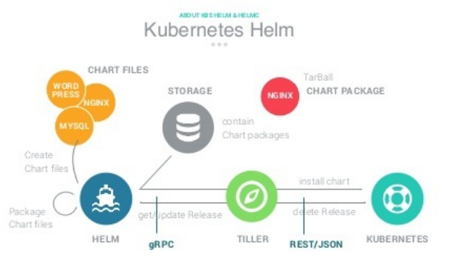

1. 对于单体服务部署⼀套测试环境还是⾮常快的，但是 对于微服务架构的应⽤，要部署⼀套新的环境就有点麻烦，微服务越多就会越麻烦，因为每个微服务得维护⼀套 yaml ⽂件， ⽽且每个环境下的配置⽂件也不太⼀样，部署⼀套新的环境成本很⾼。如果能使⽤类似于 yum 的⼯具来安装应⽤的话就很方便。 Helm 就相当于 kubernetes 环境下 的 yum 包管理⼯具。


1.1 Helm用途

作为 Kubernetes 的⼀个包管理⼯具， Helm 具有如下功能：

- 创建新的 chart

- chart 打包成 tgz 格式

- 上传 chart 到 chart 仓库或从仓库中下载 chart

- 在 Kubernetes 集群中安装或卸载 chart

- 管理⽤ Helm 安装的 chart 的发布周期


1.2 重要概念

Helm 有三个重要概念：

- chart：包含了创建 Kubernetes 的⼀个应⽤实例的必要信息

- config：包含了应⽤发布配置信息

- release：是⼀个 chart 及其配置的⼀个运⾏实例


1.3 Helm组件，Helm 有以下两个组成部分：



1.3.1 Helm Client 是⽤户命令⾏⼯具，其主要负责如下：

- 本地 chart 开发

- 仓库管理

- 与 Tiller sever 交互

- 发送预安装的 chart 到 Tiller sever 

- 查询 release 信息

- 要求升级或卸载已存在的 release

1.3.2 Tiller Server 是⼀个部署在 Kubernetes 集群内部的 server，其与 Helm client、Kubernetes API server 进⾏交互。Tiller server 主要负责如下：

- 监听来⾃ Helm client 的请求

- 通过 chart 及其配置构建⼀次发布

- 安装 chart 到 Kubernetes 集群，并跟踪随后的发布

- 通过与 Kubernetes 交互升级或卸载 chart


总结: 简单的说，client 管理 charts，⽽ server 管理发布 release


2. heml2和helm 3 

19年发布的helm 3 的一个很大变化就是移除了heml2中非常重要的组成部分Tiller，因为从kubernetes 1.6开始默认开启RBAC。这是Kubernetes安全性/企业可用的一个重要特性。但是在RBAC开启的情况下管理及配置Tiller变的非常复杂。参考资料如下:


为什么在Helm3中要移除Tiller(翻译)

https://blog.csdn.net/zzh_gaoxingjiuhao/article/details/104182596


heml2 在helm初始化的时候会使用kubectl配置的上下文，helm3 因为移除了Tiller，所以不用初始化，不管是heml2还是helm 3都要保证 kubectl 命令可用：

```javascript
[root@centos7 40helm]# kubectl get node
NAME             STATUS   ROLES                  AGE   VERSION
centos7.master   Ready    control-plane,master   81d   v1.22.1
centos7.node     Ready    <none>                 81d   v1.22.1
[root@centos7 40helm]# kubectl get nodes
NAME             STATUS   ROLES                  AGE   VERSION
centos7.master   Ready    control-plane,master   81d   v1.22.1
centos7.node     Ready    <none>                 81d   v1.22.1

```


3.  安装


2.1 下载安装包，这里使用 Helm 3.7.1

https://github.com/helm/helm/releases

```javascript
[root@centos7 40helm]# tar -zxvf helm-v3.7.1-linux-amd64.tar.gz 
linux-amd64/
linux-amd64/helm
linux-amd64/LICENSE
linux-amd64/README.md
[root@centos7 40helm]# ls
helm-v3.7.1-linux-amd64.tar.gz  linux-amd64
[root@centos7 40helm]# mv linux-amd64/helm /usr/local/bin/helm
// 验证安装是否成功
[root@centos7 40helm]# helm version
version.BuildInfo{Version:"v3.7.1", GitCommit:"1d11fcb5d3f3bf00dbe6fe31b8412839a96b3dc4", GitTreeState:"clean", GoVersion:"go1.16.9"}
[root@centos7 40helm]# helm help
// 安装tree工具,方便查看文件夹
[root@centos7 40helm]# sudo yum install -y tree
```


2.2 初步使用 Helm 3.7.1

```javascript
//1.创建一个名为 hello-helm 的chart
[root@centos7 40helm]# helm create hello-helm
Creating hello-helm

//2.查看一个chart的目录结构
//查看templates⽬录下的deployment.yaml⽂件可以看出默认创建的Chart是⼀个nginx服务
[root@centos7 40helm]# tree hello-helm/
hello-helm/
├── charts
├── Chart.yaml
├── templates
│   ├── deployment.yaml
│   ├── _helpers.tpl
│   ├── hpa.yaml
│   ├── ingress.yaml
│   ├── NOTES.txt
│   ├── serviceaccount.yaml
│   ├── service.yaml
│   └── tests
│       └── test-connection.yaml
└── values.yaml

3 directories, 10 files

//3.修改 values.yaml 中的 image 和 service 项,改为如下：
    image:
      # TAG改为1.7.9,因为集群中已经存在tag为 1.7.9 的 nginx
      tag: 1.7.9
   service:
       # type改为 NodePort 好测试 
      type: NodePort

//4.安装 Chart, 查看帮助使用: helm install --help
//4.1 "--generate-name"表示自动生成一个名称
//自动生成的名称格式形如: "hello-helm-1636384275-78df5b8c76-bchsv"
[root@centos7 40helm]# helm install ./hello-helm/ --generate-name
//4.2 指定一个名称(这里使用这种方式)
//命令格式: helm install [NAME] [CHART] [flags]
[root@centos7 40helm]# helm install hello-helm-ngxin-demo ./hello-helm
NAME: hello-helm-ngxin-demo
LAST DEPLOYED: Sat Nov 13 01:39:54 2021
NAMESPACE: default
STATUS: deployed
REVISION: 1
NOTES:
1. Get the application URL by running these commands:
  export NODE_PORT=$(kubectl get --namespace default -o jsonpath="{.spec.ports[0].nodePort}" services hello-helm-ngxin-demo)
  export NODE_IP=$(kubectl get nodes --namespace default -o jsonpath="{.items[0].status.addresses[0].address}")
  echo http://$NODE_IP:$NODE_POR

// 5.验证, 
[root@centos7 40helm]# kubectl get pods | grep hello-helm-ngxin-demo
hello-helm-ngxin-demo-5f87984949-jw84c    1/1     Running            0                 105s

// 根据label类过滤
[root@centos7 40helm]# kubectl get pods -l app.kubernetes.io/name=hello-helm
NAME                                     READY   STATUS    RESTARTS   AGE
hello-helm-ngxin-demo-5f87984949-jw84c   1/1     Running   0          8m38s

[root@centos7 40helm]# kubectl get deployment -l app.kubernetes.io/name=hello-helm
NAME                    READY   UP-TO-DATE   AVAILABLE   AGE
hello-helm-ngxin-demo   1/1     1            1           10m

[root@centos7 40helm]# kubectl get svc -l app.kubernetes.io/name=hello-helm
NAME                    TYPE       CLUSTER-IP     EXTERNAL-IP   PORT(S)        AGE
hello-helm-ngxin-demo   NodePort   10.101.30.94   <none>        80:31528/TCP   10m

// 在浏览器中访问以下地址出现nginx主页说明安装成功
http://192.168.32.100:31528/
http://192.168.32.101:31528/

```


其它操作:

```javascript
// 查看 release, Helm将Charts包安装到K8s集群中, ⼀个安装实例就是⼀个新的Release
[root@centos7 40helm]# helm list
NAME                 	NAMESPACE	REVISION	UPDATED                                	STATUS  	CHART           	APP VERSION
hello-helm-ngxin-demo	default  	1       	2021-11-13 01:39:54.968603713 -0500 EST	deployed	hello-helm-0.1.0	1.16.0 

// 打包 chart
// 然后可以将打包的tgz⽂件分发到任意的服务器上,通过"helm fetch"就能获取到该Chart
[root@centos7 40helm]# helm package hello-helm/
Successfully packaged chart and saved it to: /k8s-yaml/40helm/hello-helm-0.1.0.tgz

// 删除 release: chart里面定义的资源会全部删掉,包括svc、deployment、pod等
[root@centos7 40helm]# helm delete hello-helm-ngxin-demo
release "hello-helm-ngxin-demo" uninstalled

//验证:使用以下命令都找不到任何相关资源
kubectl get pods | grep hello-helm-ngxin-demo
kubectl get pods -l app.kubernetes.io/name=hello-helm
kubectl get deployment -l app.kubernetes.io/name=hello-helm
kubectl get svc -l app.kubernetes.io/name=hello-helm

```

