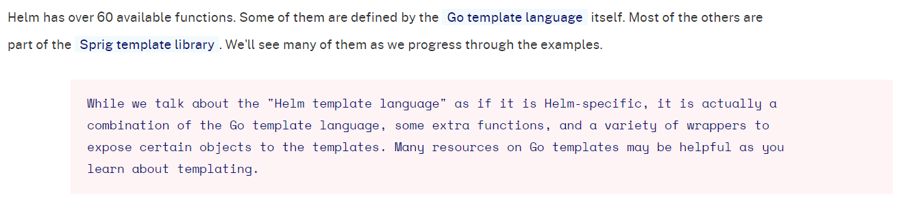

1. 定义⼀个 chart 包，了解 Helm 中模板的⼀些使⽤⽅法

强烈建议仔细阅读官方文档：https://helm.sh/docs/chart_template_guide/


1.1 chart的目录结构以及包含的文件

⼀个 chart 包就是⼀个⽂件夹的集合，⽂件夹名称就是 chart 包的名称，⽐如创建⼀个名为 mychart 的 chart 包：

```javascript

//1.创建一个名为 mychart 的chart
[root@centos7 40helm]# helm create mychart
Creating mychart

//2.查看一个chart的目录结构
//查看templates⽬录下的deployment.yaml⽂件可以看出默认创建的Chart是⼀个nginx服务
[root@centos7 40helm]# tree mychart/
mychart/
├── charts
├── Chart.yaml
├── templates
│   ├── deployment.yaml
│   ├── _helpers.tpl
│   ├── hpa.yaml
│   ├── ingress.yaml
│   ├── NOTES.txt
│   ├── serviceaccount.yaml
│   ├── service.yaml
│   └── tests
│       └── test-connection.yaml
└── values.yaml

3 directories, 10 files
```


templates ⽬录下⾯的⽂件说明:

- deployment.yaml：创建 Kubernetes deployment 的基本 manifest

- _helpers.tpl：放置模板助⼿的地⽅，可以在整个 chart 中重复使⽤

- hpa.yaml：创建 hpa(HorizontalPodAutoscaler) 的基本 manifest

- ingress.yaml: 创建 ingress 对象的资源清单⽂件

- NOTES.txt：chart 的 “帮助⽂本”。这会在⽤户运⾏ helm install 时显示给⽤户。

- serviceaccount.yaml：创建 serviceaccount 的基本 manifest

- service.yaml：为 deployment 创建 service 的基本 manifest


1.2 定义 chart

(1). 把 templates ⽬录下⾯所有⽂件全部删除掉

```javascript
// 删除templates目录下所有的文件和目录
rm -rf mychart/templates/*

// 删除templates目录下所有的文件
// rm -rf mychart/templates/*.*
```


 (2).创建模板,在 templates ⽬录下⾯新建⼀个 configmap.yaml ⽂件,实际上现在就有⼀个可安装的 chart 包了

[configmap.yaml](attachments/77385325F80349F4979D6720199B6741configmap.yaml)

```javascript
# configmap.yaml
---
apiVersion: v1
kind: ConfigMap
metadata:
  name: mychart-configmap
data:
  myvalue: "Hello World"
```


 (3).安装 chart 包

```javascript

[root@centos7 43helm]# helm install mychartdemo  mychart/
NAME: mychartdemo
LAST DEPLOYED: Tue Nov 16 09:35:13 2021
NAMESPACE: default
STATUS: deployed
REVISION: 1
TEST SUITE: None

// 使⽤如下命令我们可以 看到实际的模板被渲染过后的资源⽂件
// 格式：helm get manifest [RELEASE_NAME] [flags]
[root@centos7 43helm]# helm get manifest mychartdemo
---
# Source: mychart/templates/configmap.yaml
apiVersion: v1
kind: ConfigMap
metadata:
  name: mychart-configmap
data:
  myvalue: "Hello World"

[root@centos7 43helm]# helm un mychartdemo
release "mychartdemo" uninstalled
```


1.3 添加⼀个简单的模板

上⾯定义的 ConfigMap 的名字是固定的，这不是⼀种很好的做法。好的做法是通过插⼊ release 的名称来⽣成资源的名称,⽐如这⾥ ConfigMap 的名称希望是：mychartdemo-configmap，这就需要⽤到 Chart 的模板定义⽅法.


Helm 有 60 多个可用函数(供Helm Chart 模板使⽤)。 其中一些是由 Go 模板语言本身定义的。 大多数其他的都是 Sprig 模板库的一部分。 Helm函数官网说明：https://helm.sh/docs/chart_template_guide/functions_and_pipelines/



Go 模板语言：https://pkg.go.dev/text/template

Sprig 模板库：https://masterminds.github.io/sprig/

Sprig 库Github：https://github.com/Masterminds/sprig


需要注意的是 kubernetes 资源对象的 labels 和 name 定义被限制 63个字符，所以需要注意名称的定义。


第一步:重新定义下上⾯的 configmap.yaml ⽂件

[configmap2.yaml](attachments/CFCF269B900A4FBF966CDBE099CE05B2configmap2.yaml)

```javascript
# configmap2.yaml
---
apiVersion: v1
kind: ConfigMap
metadata:
  # 双括号之间的内容就是模板指令
  # {{ .Release.Name }} 将release的名称注⼊到模板,这样最终⽣成的名称就是以release的名称开头
  # 这⾥的Release模板对象属于 Helm 内置的⼀种对象,还有其他很多内置的对象
  name:  {{ .Release.Name }}-configmap
data:
  myvalue: "Hello World"
```


第二步:把 configmap2.yaml 放在 templates ⽬录下重新安装

```javascript
[root@centos7 43helm]# helm install mychartdemo mychart/
NAME: mychartdemo
LAST DEPLOYED: Tue Nov 16 09:49:48 2021
NAMESPACE: default
STATUS: deployed
REVISION: 1
TEST SUITE: None

// mychart-configmap 没有用模板指令
// mychartdemo-configmap 用了模板指令,所以名称以release的名称开头
[root@centos7 43helm]# kubectl get cm
NAME                    DATA   AGE
mychart-configmap       1      25s
mychartdemo-configmap   1      25s

// 查看最终⽣成的清单⽂件
[root@centos7 43helm]# helm get manifest mychartdemo
---
# Source: mychart/templates/configmap.yaml
apiVersion: v1
kind: ConfigMap
metadata:
  name: mychart-configmap
data:
  myvalue: "Hello World"
---
# Source: mychart/templates/configmap2.yaml
apiVersion: v1
kind: ConfigMap
metadata:
  # 双括号之间的内容就是模板指令
  # mychartdemo 将release的名称注⼊到模板,这样最终⽣成的名称就是以release的名称开头
  # 这⾥的Release模板对象属于 Helm 内置的⼀种对象,还有其他很多内置的对象
  name:  mychartdemo-configmap
data:
  myvalue: "Hello World"

[root@centos7 43helm]# helm un mychartdemo
release "mychartdemo" uninstalled
```


2.调试

模板⽣成资源⽂件的清单调试起来很不⽅便，不可能每次都去部署⼀个release 实例来校验模板是否正确。Helm 为我们提供了 --dry-run --debug 这个可选参数，在执⾏ helm install 的时候带上这两个参数就可以把对应的 values 值和⽣成的最终的资源清单⽂件打印出来，⽽不会真正去部署⼀个 release 实例，⽐如调试上⾯创建的 chart 包：

```javascript
// --dry-run  ==>>  simulate an install
// --debug  ==>> enable verbose output

// 安装时只加"--dry-run"这个flag
[root@centos7 43helm]# helm install mychartdemo mychart/ --dry-run
NAME: mychartdemo
LAST DEPLOYED: Tue Nov 16 10:07:12 2021
NAMESPACE: default
STATUS: pending-install
REVISION: 1
TEST SUITE: None
HOOKS:
MANIFEST:
---
# Source: mychart/templates/configmap.yaml
apiVersion: v1
kind: ConfigMap
metadata:
  name: mychart-configmap
data:
  myvalue: "Hello World"
---
# Source: mychart/templates/configmap2.yaml
apiVersion: v1
kind: ConfigMap
metadata:
  # 双括号之间的内容就是模板指令
  # mychartdemo 将release的名称注⼊到模板,这样最终⽣成的名称就是以release的名称开头
  # 这⾥的Release模板对象属于 Helm 内置的⼀种对象,还有其他很多内置的对象
  name:  mychartdemo-configmap
data:
  myvalue: "Hello World"

// 安装时加"--dry-run" 和 "--debug" 这两个flag，加上"--debug"会多打印出很多信息
[root@centos7 43helm]# helm install mychartdemo mychart/ --dry-run --debug
install.go:178: [debug] Original chart version: ""
install.go:199: [debug] CHART PATH: /k8s-yaml/43helm/mychart

NAME: mychartdemo
LAST DEPLOYED: Tue Nov 16 10:07:45 2021
NAMESPACE: default
STATUS: pending-install
REVISION: 1
TEST SUITE: None
USER-SUPPLIED VALUES:
{}

COMPUTED VALUES:
affinity: {}
autoscaling:
  enabled: false
  maxReplicas: 100
  minReplicas: 1
  targetCPUUtilizationPercentage: 80
fullnameOverride: ""
image:
  pullPolicy: IfNotPresent
  repository: nginx
  tag: ""
imagePullSecrets: []
ingress:
  annotations: {}
  className: ""
  enabled: false
  hosts:
  - host: chart-example.local
    paths:
    - path: /
      pathType: ImplementationSpecific
  tls: []
nameOverride: ""
nodeSelector: {}
podAnnotations: {}
podSecurityContext: {}
replicaCount: 1
resources: {}
securityContext: {}
service:
  port: 80
  type: ClusterIP
serviceAccount:
  annotations: {}
  create: true
  name: ""
tolerations: []

HOOKS:
MANIFEST:
---
# Source: mychart/templates/configmap.yaml
apiVersion: v1
kind: ConfigMap
metadata:
  name: mychart-configmap
data:
  myvalue: "Hello World"
---
# Source: mychart/templates/configmap2.yaml
apiVersion: v1
kind: ConfigMap
metadata:
  # 双括号之间的内容就是模板指令
  # mychartdemo 将release的名称注⼊到模板,这样最终⽣成的名称就是以release的名称开头
  # 这⾥的Release模板对象属于 Helm 内置的⼀种对象,还有其他很多内置的对象
  name:  mychartdemo-configmap
data:
  myvalue: "Hello World"

```

现在使⽤ --dry-run 就可以很容易测试代码，不需要每次都去安装⼀个 release 实例，但是要注意这不能确保 Kubernetes 本身就⼀定会接受⽣成的模板，在调试完成后，还是需要安装⼀个实际的 release 实例来进⾏验证。


3.内置对象

3.1 常⽤的内置对象

下⾯是⼀些常⽤的内置对象，在需要的时候可以直接使⽤：

- Release：这个对象描述了 release 本身。它⾥⾯有⼏个对象：

- Release.Name：release 名称

- Release.Namespace：release 的 namespace（如果清单未覆盖）

- Release.IsUpgrade：如果当前操作是升级或回滚，则将其设置为 true。

- Release.IsInstall：如果当前操作是安装，则设置为 true。

- Release.Revision：此 release 的修订版本号，从1开始累加。

- Release.Service：呈现当前模板的服务。 在 Helm 上，这始终是 Helm 

- Values：从 values.yaml ⽂件和⽤户提供的⽂件传⼊模板的值。默认情况下Values 是空的。

- Chart： Chart.yaml ⽂件的内容。所有的 Chart 对象都将从该⽂件中获取。chart 指南中 Charts Guide 列出了可⽤字段。 Charts Guide 官网地址：https://helm.sh/docs/topics/charts/#the-chartyaml-file

- Files：这提供对 chart 中所有⾮特殊⽂件的访问。虽然⽆法使⽤它来访问模板，但可以使⽤它来访问 chart 中的其他⽂件。请参阅 "访问⽂件" 部分。

- Files.Get 是⼀个按名称获取⽂件的函数（.Files.Get config.ini）

- Files.GetBytes 是将⽂件内容作为字节数组⽽不是字符串获取的函数。这对于像图⽚这样的东⻄很有⽤。

- Files.Glob is a function that returns a list of files whose names match the given shell glob pattern.

- Files.Lines is a function that reads a file line-by-line. This is useful for iterating over each line in a file.

- Files.AsSecrets is a function that returns the file bodies as Base 64 encoded strings.

- Files.AsConfig is a function that returns file bodies as a YAML map.

- Capabilities：这提供了关于 Kubernetes 集群⽀持的功能的信息。

- Capabilities.APIVersions 是⼀组版本信息。

- Capabilities.APIVersions.Has $version indicates whether a version (e.g., batch/v1) or resource (e.g., apps/v1/Deployment) is available on the cluster.

- Capabilities.KubeVersion and Capabilities.KubeVersion.Version is the Kubernetes version.

- Capabilities.KubeVersion.Major is the Kubernetes major version.

- Capabilities.KubeVersion.Minor is the Kubernetes minor version.

- Capabilities.HelmVersion is the object containing the Helm Version details, it is the same output of helm version

- Capabilities.HelmVersion.Version is the current Helm version in semver format.

- Capabilities.HelmVersion.GitCommit is the Helm git sha1.

- Capabilities.HelmVersion.GitTreeState is the state of the Helm git tree.

- Capabilities.HelmVersion.GoVersion is the version of the Go compiler used.

- Template：包含有关正在执⾏的当前模板的信息

- Template.Name: 到当前模板的⽂件路径（例如： mychart/templates/mytemplate.yaml）

- Template.BasePath: 当前 chart 模板⽬录的路径 （例如： mychart/templates）


上⾯这些值可⽤于任何顶级模板，要注意内置值始终以⼤写字⺟开头。这也符合 Go 的命名约定。当创建名字时也可以⾃由地使⽤自己团队的规则。


3.2 values ⽂件

内置对象中有⼀个对象就是 Values，该对象提供对传⼊ chart 的值的访问，Values 对象的值有 4个来源：

- chart 包中的 values.yaml ⽂件

- ⽗ chart 包的 values.yaml ⽂件

- 通过 helm install 或者 helm upgrade 的 -f 或者 --values 参数传⼊的⾃定义的 yaml ⽂件

- 通过 --set 参数传⼊的值

chart 的 values.yaml 提供的值可以被⽤户提供的 values ⽂件覆盖，⽽该⽂件同样可以被 --set 提供 的参数所覆盖。


第一步: 将 mychart/values.yaml ⽂件默认值全部清空，添加⼀个新的数据：

```javascript
# values.yaml
course: k8s
```


第二步: 在 templates/configmap3.yaml 模板⽂件中就使⽤这个值

[configmap3.yaml](attachments/FEC8FE91270B45FB962FADE955B6C3E4configmap3.yaml)

```javascript
# configmap3.yaml
---
apiVersion: v1
kind: ConfigMap
metadata:
  # Release对象属于 Helm 内置的⼀种对象
  name:  {{ .Release.Name }}-configmap
data:
  myvalue: "Hello World"
  # 通过 Values 对象来获取 course 的值
  course: {{ .Values.course }}
```


```javascript
// 查看下模板渲染后的结果
[root@centos7 43helm]# helm install mychartdemo mychart/ --dry-run 
NAME: mychartdemo
LAST DEPLOYED: Tue Nov 16 10:51:04 2021
NAMESPACE: default
STATUS: pending-install
REVISION: 1
TEST SUITE: None
HOOKS:
MANIFEST:
//......
---
# Source: mychart/templates/configmap3.yaml
apiVersion: v1
kind: ConfigMap
metadata:
  # Release对象属于 Helm 内置的⼀种对象
  name:  mychartdemo-configmap
data:
  myvalue: "Hello World"
  # 通过 Values 对象来获取 course 的值
  course: k8s
```

可以看到 configmap3.yaml 文件中 course 的值被渲染成了 k8s，这是因为在默认的 values.yaml ⽂件中该参数值为 k8s，同样的可以通过 --set 参数来覆盖 course 的值,如下：

```javascript
[root@centos7 43helm]# helm install mychartdemo mychart/ --set course=Golang --dry-run 
NAME: mychartdemo
LAST DEPLOYED: Tue Nov 16 10:55:15 2021
NAMESPACE: default
STATUS: pending-install
REVISION: 1
TEST SUITE: None
HOOKS:
MANIFEST:
//......
---
# Source: mychart/templates/configmap3.yaml
apiVersion: v1
kind: ConfigMap
metadata:
  # Release对象属于 Helm 内置的⼀种对象
  name:  mychartdemo-configmap
data:
  myvalue: "Hello World"
  # 通过 Values 对象来获取 course 的值
  course: Golang
```

由于 --set ⽐默认 values.yaml ⽂件具有更⾼的优先级，所以模板⽣成的最终结果为 course: python


第三步: values ⽂件也可以包含结构化内容,values.yaml 做如下修改:

```javascript
# values.yaml
course:
  k8s: DevOps
  python: Tornado
```


```javascript
# configmap4.yaml
---
apiVersion: v1
kind: ConfigMap
metadata:
  name:  {{ .Release.Name }}-configmap
data:
  myvalue: "Hello World"
  k8s: {{ .Values.course.k8s }}
  python: {{ .Values.course.python }}
```


```javascript
// 查看渲染结果
[root@centos7 43helm]# helm install mychartdemo mychart/ --dry-run 
NAME: mychartdemo
LAST DEPLOYED: Tue Nov 16 11:16:40 2021
NAMESPACE: default
STATUS: pending-install
REVISION: 1
TEST SUITE: None
HOOKS:
MANIFEST:
//......
---
# Source: mychart/templates/configmap4.yaml
apiVersion: v1
kind: ConfigMap
metadata:
  name:  mychartdemo-configmap
data:
  myvalue: "Hello World"
  k8s: DevOps
  python: Tornado
  
// 删除templates目录下所有的文件
[root@centos7 43helm]# rm -rf mychart/templates/*.*

```


可以看到模板中的参数已经被 values.yaml ⽂件中的值给替换掉了。使用这种⽅式构建数据建议保持 value 树浅⼀些，平⼀些，这样维护起来要简单⼀点。