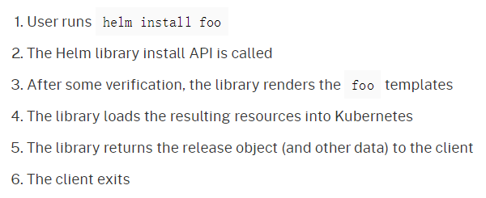
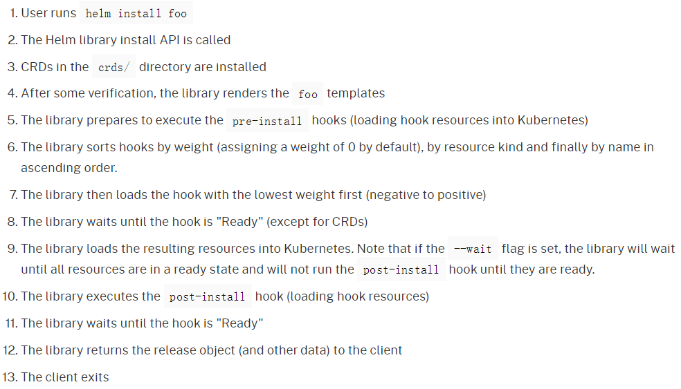
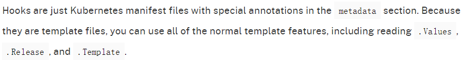
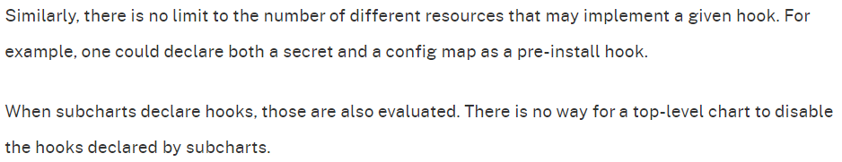
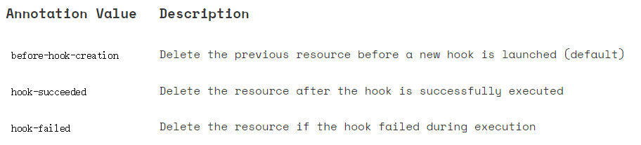

1. 和 Kubernetes ⾥⾯的容器⼀样，Helm 也提供了 Hook 的机制，允许 chart 开发⼈员在 release 的⽣命 周期中的某些节点来进⾏⼲预，比如可以利⽤ Hooks 来做下⾯的这些事情：

- 在加载任何其他 chart 之前，在安装过程中加载 ConfigMap 或 Secret

- 在安装新 chart 之前执⾏作业以备份数据库，然后在升级后执⾏第⼆个作业以恢复数据

- 在删除 release 之前运⾏作业，以便在删除 release 之前优雅地停⽌服务


注意： Hooks 和普通模板⼀样⼯作，但是它们具有特殊的注释，可以使 Helm 以不同的⽅式使⽤它们。Hook 在资源清单中的 metadata 部分⽤ annotations 的⽅式进⾏声明：

```javascript
apiVersion: ......
kind: ......
metadata:
  annotations:
    "helm.sh/hook": "pre-install"
......
```


Chart Hooks Guide： https://helm.sh/docs/topics/charts_hooks/


以下是 Helm Hooks 的⼀些基本使⽤⽅法。


2.  Hooks

在 Helm 中定义了如下⼀些可供我们使⽤的 Hooks：

- 预安装 pre-install ：在模板渲染后，kubernetes 创建任何资源之前执⾏

- 安装后 post-install ：在所有 kubernetes 资源安装到集群后执⾏

- 预删除 pre-delete ：在从 kubernetes 删除任何资源之前执⾏删除请求

- 删除后 post-delete ：删除所有 release 的资源后执⾏

- 升级前 pre-upgrade ：在模板渲染后，但在任何资源升级之前执⾏

- 升级后 post-upgrade ：在所有资源升级后执⾏

- 预回滚 pre-rollback ：在模板渲染后，在任何资源回滚之前执⾏

- 回滚后 post-rollback ：在修改所有资源后执⾏回滚请求

- 测试 test ：Executes when the Helm test subcommand is invoked ( view test docs)


Note that the crd-install hook has been removed in favor of the crds/ directory in Helm 3.


3. ⽣命周期

3.1 Hooks 允许开发⼈员在 release 的⽣命周期中的⼀些关键节点执⾏⼀些钩⼦函数。 For example, consider the lifecycle for a helm install. By default, the lifecycle looks like this:




3.2  Helm defines two hooks for the install lifecycle: pre-install and post-install. If the developer of the foo chart implements both hooks, the lifecycle is altered like this:




What does it mean to wait until a hook is ready? This depends on the resource declared in the hook. If the resource is a Job or Pod kind, Helm will wait until it successfully runs to completion. And if the hook fails, the release will fail. This is a blocking operation, so the Helm client will pause while the Job is run.

For all other kinds, as soon as Kubernetes marks the resource as loaded (added or updated), the resource is considered "Ready". When many resources are declared in a hook, the resources are executed serially. If they have hook weights (see below), they are executed in weighted order. Starting from Helm 3.2.0 hook resources with same weight are installed in the same order as normal non-hook resources. Otherwise, ordering is not guaranteed. (In Helm 2.3.0 and after, they are sorted alphabetically. That behavior, though, is not considered binding and could change in the future.) It is considered good practice to add a hook weight, and set it to 0 if weight is not important.


3.3  钩子资源没有对应的releases管理 

钩子创建的资源当前未作为发布的一部分进行跟踪或管理。 一旦 Helm 验证钩子已达到就绪状态，它就会离开钩子资源。 未来可能会在 Helm 3 中添加相应版本删除时钩子资源的垃圾收集，因此任何永远不能删除的钩子资源都应该用 helm.sh/resource-policy:keep 注释。


4. Writing a Hook

hook 和普通模板⼀样，也可以使⽤普通的模板函数和常⽤的⼀些对象，⽐如 Values 、 Chart 、 Release 等等，唯⼀和普通模板不太⼀样的地⽅就是在资源清单⽂件中的 metadata 部分会有⼀些特殊的注释 annotation。




For example, this template, stored in templates/post-install-job.yaml, declares a job to be run on post-install:


```javascript
# templates/post-install-job.yaml
apiVersion: batch/v1
kind: Job
metadata:
  name: "{{ .Release.Name }}"
  labels:
    app.kubernetes.io/managed-by: {{ .Release.Service | quote }}
    app.kubernetes.io/instance: {{ .Release.Name | quote }}
    app.kubernetes.io/version: {{ .Chart.AppVersion }}
    helm.sh/chart: "{{ .Chart.Name }}-{{ .Chart.Version }}"
  annotations:
    # This is what defines this resource as a hook. Without this line, the
    # job is considered part of the release.
    "helm.sh/hook": post-install
    "helm.sh/hook-weight": "-5"
    "helm.sh/hook-delete-policy": hook-succeeded
spec:
  template:
    metadata:
      name: "{{ .Release.Name }}"
      labels:
        app.kubernetes.io/managed-by: {{ .Release.Service | quote }}
        app.kubernetes.io/instance: {{ .Release.Name | quote }}
        helm.sh/chart: "{{ .Chart.Name }}-{{ .Chart.Version }}"
    spec:
      restartPolicy: Never
      containers:
      - name: post-install-job
        image: "alpine:3.3"
        command: ["/bin/sleep","{{ default "10" .Values.sleepyTime }}"]
```


说明1: 上⾯的 Job 资源中添加⼀个 annotations，要注意的是，如果没有添加下⾯这⾏注释的话，这 个资源就会被当成是 release 的⼀部分资源：

```javascript
annotations:
  "helm.sh/hook": post-install
```


说明2:  ⼀个资源中可以同时部署多个 hook，⽐如还可以添加⼀个 post-upgrade 的钩⼦：

```javascript
annotations:
  "helm.sh/hook": post-install,post-upgrade
```





类似地，可以实现给定钩子的不同资源的数量没有限制。 例如，可以将机密和配置映射声明为预安装挂钩。
当子图声明钩子时，它们也会被评估。 顶级图表无法禁用子图表声明的挂钩。 


说明3:   为 hook 定义⼀个权重，这有助于建⽴⼀个确定性的执⾏顺序，权重可以是正 数也可以是负数，但是必须是字符串才⾏。当 Helm 开始执行特定种类的钩子时，它将按升序对这些钩子进行排序。 

```javascript
annotations:
  "helm.sh/hook-weight": "5"
```


说明4:  Hook deletion policies

删除 hook 资源的策略

```javascript
annotations:
  "helm.sh/hook-delete-policy": before-hook-creation,hook-succeeded
```


删除资源的策略可供选择的注释值：




注意:  If no hook deletion policy annotation is specified, the before-hook-creation behavior applies by default.


以下内容不是来源于官方文档，有待验证：

- 当 helm 的 release 更新时，有可能 hook 资源已经存在于群集中。默认情况下，helm 会尝试创建资源，并抛出错误"... already exists"。


- 删除 hook 资源的策略可以选择 "helm.sh/hook-delete-policy": "before-hook-creation" 取代 "helm.sh/hook-delete-policy": "hook-succeeded,hook-failed" ，这是因为：例如为了⼿动调试，将错误的 hook 作业资源保存在 kubernetes 中是很⽅便的。 出于某种原因，可能有必要将成功的 hook 资源保留在 kubernetes 中。同时，在 helm release 升级之前进⾏⼿动资源删除是不可取的。 "helm.sh/hook-delete-policy": "before-hook-creation" 在 hook 中的注释，如果在新的hook 启动前有⼀个 hook 的话，会将以前的release 中的 hook 删除，⽽这个 hook 同时它可能正在被其他⼀个策略使⽤。

