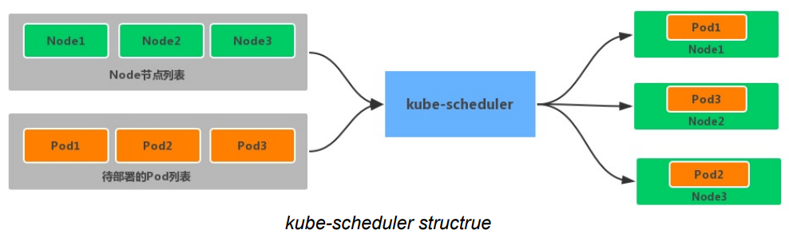
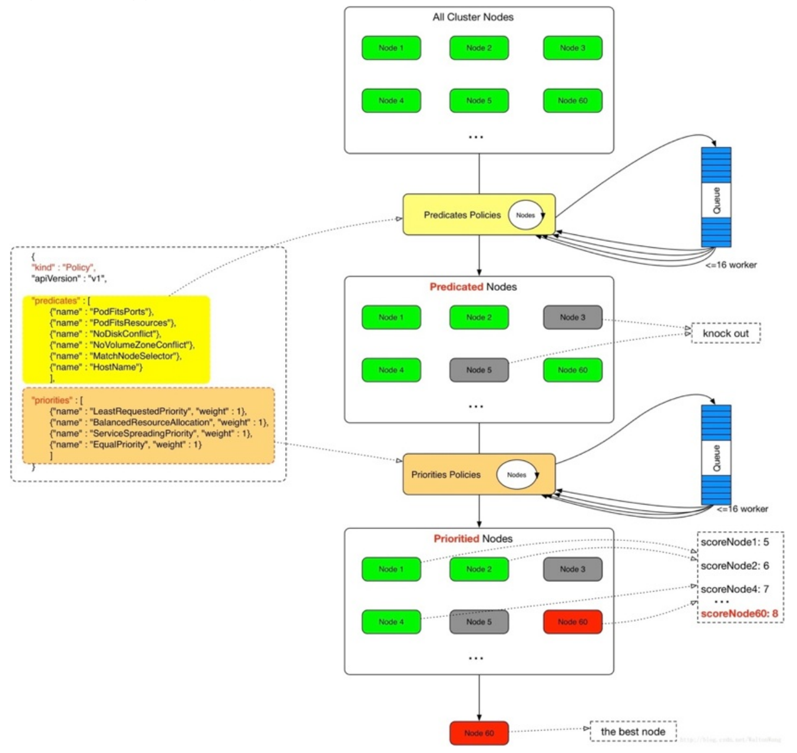

1. Kubernetes 调度器介绍

kube-scheduler 是 kubernetes 系统的核⼼组件之⼀，主要负责整个集群资源的调度功能，根据特定的调度算法和策略，将 Pod 调度到最优的⼯作节点上⾯去，从⽽更加合理、更加充分的利⽤集群的资 源，这也是选择使⽤ kubernetes ⼀个⾮常重要的理由。如果⼀⻔新的技术不能帮助企业节约成 本、提供效率，是很难推进的。


2. 调度流程

默认情况下 kube-scheduler 提供的默认调度器能够满⾜绝⼤多数的要求，前面的示例也基本上⽤的默认的策略，都可以保证 Pod 可以被分配到资源充⾜的节点上运⾏。但是在实际的线上项⽬中，可能⾃⼰更加了解⾃⼰的应⽤，⽐如希望⼀个 Pod 只能运⾏在特定的⼏个节点上，或者这⼏个节点只能⽤来运⾏特定类型的应⽤，这就需要调度器能够可控。

kube-scheduler 是 kubernetes 的调度器，它的主要作⽤就是根据特定的调度算法和调度策略将 Pod 调度到合适的 Node 节点上去，是⼀个独⽴的⼆进制程序，启动之后会⼀直监听 API Server，获取到 PodSpec.NodeName 为空的 Pod，对每个 Pod 都会创建⼀个 binding。



这个过程看来⽐较简单，但在实际的⽣产环境中，需要考虑的问题有很多：

- 如何保证全部的节点调度的公平性？要知道并不是说所有节点资源配置都是⼀样的

- 如何保证每个节点都能被分配资源？

- 集群资源如何能够被⾼效利⽤？

- 集群资源如何才能被最⼤化使⽤？

- 如何保证 Pod 调度的性能和效率？

- ⽤户是否可以根据⾃⼰的实际需求定制⾃⼰的调度策略？

考虑到实际环境中的各种复杂情况，kubernetes 的调度器采⽤插件化的形式实现，可以⽅便⽤户进⾏定制或者⼆次开发，⽤户可以⾃定义⼀个调度器并以插件形式和 kubernetes 进⾏集成。


kubernetes 调度器的源码位于 kubernetes/pkg/scheduler 中，⼤体的代码⽬录结构如下所示: (下面是V1.10.0版本的源码,不同的版本⽬录结构可能不太⼀样)

```javascript
kubernetes/pkg/scheduler
-- scheduler.go //调度相关的具体实现
|-- algorithm
| |-- predicates  //节点筛选策略, v1.22版本的源码未找到相关信息,应该是已被更新
| |-- priorities  //节点打分策略, v1.22版本的源码未找到相关信息,应该是已被更新
|-- algorithmprovider // 在v1.22版本的源码文件中应该是换成了defaultSchedulerOptions, 有待确认 
| |-- defaults    //定义默认的调度器

Github: https://github.com/kubernetes/kubernetes/blob/master/pkg/scheduler/scheduler.go
kube-scheduler的⼊⼝程序: https://github.com/kubernetes/kubernetes/blob/release-1.22/cmd/kube-scheduler/scheduler.go
```

Scheduler是创建和运⾏的核⼼程序,对应的代码在pkg/scheduler/scheduler.go, kube-scheduler的⼊⼝程序对应的代码在 cmd/kube-scheduler/scheduler.go。


调度主要分为以下⼏个部分(V1.10.0版本的调度逻辑)：

- ⾸先是预选过程，过滤掉不满⾜条件的节点，这个过程称为 Predicates

- 然后是优选过程，对通过的节点按照优先级排序，称之为 Priorities

- 最后从中选择优先级最⾼的节点，如果中间任何⼀步骤有错误，就直接返回错误


Predicates 阶段⾸先遍历全部节点，过滤掉不满⾜条件的节点，属于强制性规则，这⼀阶段输出的所有满⾜要求的 Node 将被记录并作为第⼆阶段的输⼊，如果所有的节点都不满⾜条件，那么 Pod 将会⼀直处于 Pending 状态，直到有节点满⾜条件，在这期间调度器会不断重试。所以在部署应⽤的时候，如果发现有 Pod ⼀直处于 Pending 状态，那么就是没有满⾜调度 条件的节点，这个时候可以去检查下节点资源是否可⽤。

Priorities 阶段即再次对节点进⾏筛选，如果有多个节点都满⾜条件的话，那么系统会按照节点的优先级(priorites)⼤⼩对节点进⾏排序，最后选择优先级最⾼的节点来部署 Pod 应⽤。


下⾯是调度过程的简单示意图：


下面是更详细的流程：

- ⾸先，客户端通过 API Server 的 REST API 或者 kubectl ⼯具创建 Pod 资源

- API Server 收到⽤户请求后，存储相关数据到 etcd 数据库中

- 调度器监听 API Server 查看为调度(bind)的 Pod 列表，循环遍历地为每个 Pod 尝试分配节点，这个分配过程就是上⾯提到的两个阶段：

- 预选阶段(Predicates)，过滤节点，调度器⽤⼀组规则过滤掉不符合要求的 Node 节点，⽐如Pod 设置了资源的 request，那么可⽤资源⽐ Pod 需要的资源少的主机显然就会被过滤掉

- 优选阶段(Priorities)，为节点的优先级打分，将上⼀阶段过滤出来的 Node 列表进⾏打分，调度器会考虑⼀些整体的优化策略，⽐如把 Deployment 控制的多个 Pod 副本分布到不同的主机上，使⽤最低负载的主机等等策略

- 经过上⾯的阶段过滤后选择打分最⾼的 Node 节点和 Pod 进⾏ binding 操作，然后将结果存储到 etcd 中

- 最后被选择出来的 Node 节点对应的 kubelet 去执⾏创建 Pod 的相关操作


其中 Predicates 过滤有⼀系列的算法可以使⽤，下面简单列举⼏个：

- PodFitsResources：节点上剩余的资源是否⼤于 Pod 请求的资源

- PodFitsHost：如果 Pod 指定了 NodeName，检查节点名称是否和 NodeName 匹配

- PodFitsHostPorts：节点上已经使⽤的 port 是否和 Pod 申请的 port 冲突

- PodSelectorMatches：过滤掉和 Pod 指定的 label 不匹配的节点

- NoDiskConflict：已经 mount 的 volume 和 Pod 指定的 volume 不冲突，除⾮它们都是只读的

- CheckNodeDiskPressure：检查节点磁盘空间是否符合要求

- CheckNodeMemoryPressure：检查节点内存是否够⽤

```javascript
除了上面这些过滤算法之外,还有⼀些其他的算法,更多更详细的信息可以查看源码⽂件:
(V1.10.0版本路径) k8s.io/kubernetes/pkg/scheduler/algorithm/predicates/predicates.go
(v1.22版本路径: 待确认)
```


⽽ Priorities 优先级是由⼀系列键值对组成的，键是该优先级的名称，值是它的权重值，以下是⼏个具有代表性的选项：

- LeastRequestedPriority：通过计算 CPU 和内存的使⽤率来决定权重，使⽤率越低权重越⾼，当然正常肯定也是资源是使⽤率越低权重越⾼，能给别的 Pod 运⾏的可能性就越⼤

- SelectorSpreadPriority：为了更好的⾼可⽤，对同属于⼀个 Deployment 或者 RC 下⾯的多个Pod 副本，尽量调度到多个不同的节点上，当⼀个 Pod 被调度的时候，会先去查找该 Pod 对应的controller，然后查看该 controller 下⾯的已存在的 Pod，运⾏ Pod 越少的节点权重越⾼

- ImageLocalityPriority：就是如果在某个节点上已经有要使⽤的镜像节点了，镜像总⼤⼩值越⼤，权重就越⾼

- NodeAffinityPriority：这个就是根据节点的亲和性来计算⼀个权重值，后⾯我们会详细讲解亲和性的使⽤⽅法

```javascript
除了上面这些策略之外,还有很多其他的策略,同样可以查看源码⽂件了解更多信息：
(V1.10.0版本路径) k8s.io/kubernetes/pkg/scheduler/algorithm/priorities/
(v1.22版本路径: 待确认)
```

每⼀个优先级函数会返回⼀个0- 10的分数，分数越⾼表示节点越优，同时每⼀个函数也会对应⼀个表示权重的值。最终主机的得分⽤ 以下公式计算得出：

```javascript
finalScoreNode = (weight1 * priorityFunc1) + (weight2 * priorityFunc2) + … + (weightn * pr iorityFuncn)
```


3. ⾃定义调度

除了使⽤默认的调度器之外，也可以⾃定义调度策略


3.1 调度器扩展

kube-scheduler 在启动的时候可以通过 --policy-config-file 参数来指定调度策略⽂件，可以根据⾃⼰的需要来组装 Predicates 和 Priority 函数。选择不同的过滤函数和优先级函数、控制优先级函数的权重、调整过滤函数的顺序都会影响调度过程。下⾯是官⽅的 Policy ⽂件示例(V1.10.0版本,其它版本可能不同)：

```javascript
{
  "kind" : "Policy",
  "apiVersion" : "v1",
  "predicates" : [
    {"name" : "PodFitsHostPorts"},
    {"name" : "PodFitsResources"},
    {"name" : "NoDiskConflict"},
    {"name" : "NoVolumeZoneConflict"},
    {"name" : "MatchNodeSelector"},
    {"name" : "HostName"}
  ],
  "priorities" : [
    {"name" : "LeastRequestedPriority", "weight" : 1},
    {"name" : "BalancedResourceAllocation", "weight" : 1},
    {"name" : "ServiceSpreadingPriority", "weight" : 1},
    {"name" : "EqualPriority", "weight" : 1}
  ]
}
```


3.2 多调度器

如果默认的调度器不满⾜要求，还可以部署⾃定义的调度器。并且在整个集群中还可以同时运⾏多 个调度器实例，通过 podSpec.schedulerName 来选择使⽤哪⼀个调度器(默认使⽤内置的调度器)

```javascript
apiVersion: v1
kind: Pod
metadata:
  name: nginx
  labels:
    app: nginx
spec:
  schedulerName: my-scheduler # 选择使⽤⾃定义调度器 my-scheduler
  containers:
  - name: nginx
    image: nginx:1.10
```

要开发我们⾃⼰的调度器也是⽐较容易的，⽐如这⾥的 my-scheduler:

- ⾸先需要通过指定的 API 获取节点和 Pod

- 然后选择 phase=Pending 和 schedulerName=my-scheduler 的pod

- 计算每个 Pod 需要放置的位置之后,调度程序将创建⼀个 Binding 对象

- 然后根据⾃定义的调度器的算法计算出最适合的⽬标节点


3.3 优先级调度

与前⾯的调度优选策略中的优先级(Priorities)不同，前⾯所讲的优先级指的是节点优先级，⽽这⾥所说的优先级指的是 Pod 的优先级( pod priority)，⾼优先级的 Pod 会优先被调度，或者在资源不⾜低情况牺牲低优先级的 Pod，以便于重要的 Pod 能够得到资源部署。要定义 Pod 优先级, 就需要先定义 PriorityClass 对象，该对象没有 Namespace 的限制：

```javascript
apiVersion: v1
kind: PriorityClass
metadata:
  name: high-priority
value: 1000000
globalDefault: false
description: "This priority class should be used for XYZ service pods only."
```

其中：

- value 为 32 位整数的优先级，该值越⼤，优先级越⾼

- globalDefault ⽤于未配置 PriorityClassName 的 Pod，整个集群中应该只有⼀个 PriorityClass 将其设置为 true


然后通过在 Pod 的 spec.priorityClassName 中指定已定义的 PriorityClass 名称即可：

```javascript
apiVersion: v1
kind: Pod
metadata:
  name: nginx
  labels:
    app: nginx
spec:
  containers:
  - name: nginx
    image: nginx
    imagePullPolicy: IfNotPresent
  priorityClassName: high-priority
```


另外⼀个值得注意的是当节点没有⾜够的资源供调度器调度 Pod，导致 Pod 处于 pending 时，抢占(preemption)逻辑就会被触发。 Preemption 会尝试从⼀个节点删除低优先级的 Pod，从⽽释放资源使⾼优先级的 Pod 得到节点资源进⾏部署。现在通过下⾯的图再去回顾 kubernetes 的调度过程就清晰很多了：




下节内容是 Pod 调度的⼀些具体使⽤⽅法。