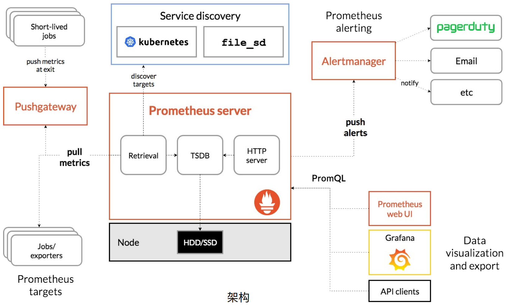
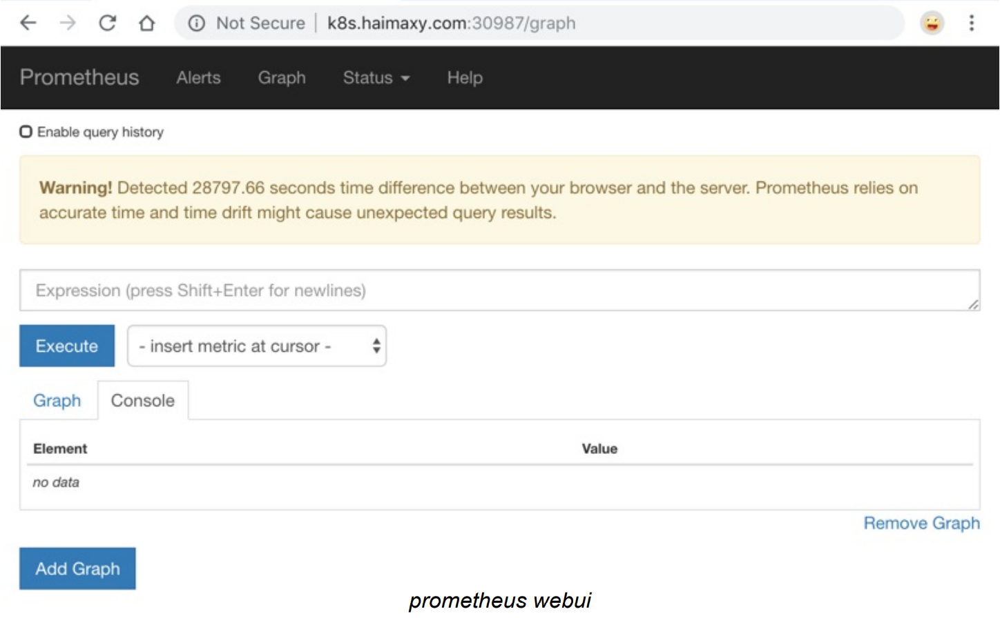
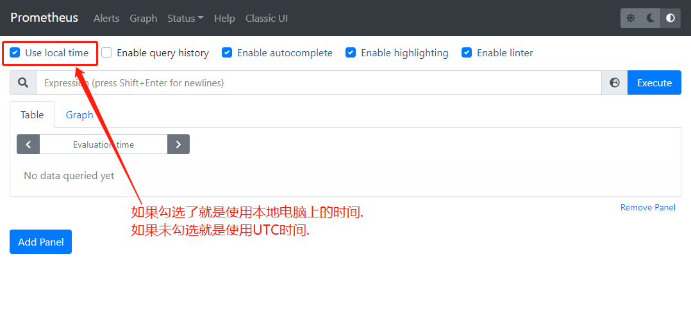
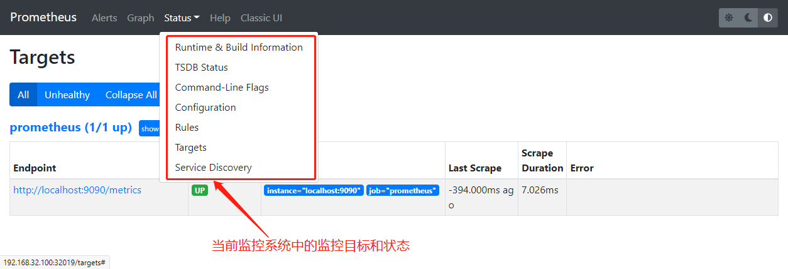
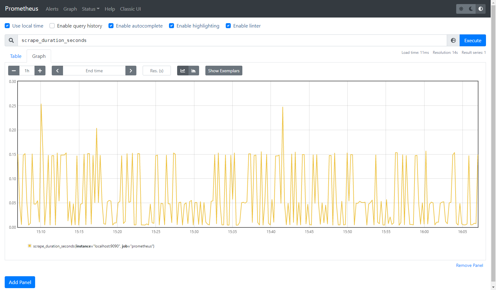

1. 监控简介

监控是保证系统运⾏必不可少的功能，特别是对于 Kubernetes 这种⽐较庞⼤的系统来说，监控报警更是不可或缺，需要时刻了解系统的各种运⾏指标，也需要时刻了解 Pod 的各种指标，更需要在出现问题的时候有报警信息通知。

在早期的版本中 Kubernetes 提供了 heapster、influxDB、grafana 的组合来监控系统，所以可以在 Dashboard 中看到 heapster 提供的⼀些图表信息，在后续的版本中陆续移除掉了 heapster，现在 prometheus 是更加流⾏的监控⼯具，prometheus 是 Google 内部监控报警系统的开源版本，是 Google SRE 思想在其内部不断完善的产物，它的存在是为了更快和⾼效的发现问题，快速的接⼊速度，简单灵活的配置都很好的解决了这⼀切，⽽且 prometheus 是已经毕业的 CNCF 项⽬。

这⾥推荐⼀本书了解 Goolge 运维的秘密：《SRE: Google运维解密》


2. prometheus 


2.1 简介

Prometheus 最初是 SoundCloud 构建的开源系统监控和报警⼯具，是⼀个独⽴的开源项⽬，于2016 年加⼊了 CNCF 基⾦会，作为继 Kubernetes 之后的第⼆个托管项⽬。


2.2 特征

Prometheus 相⽐于其他传统监控⼯具主要有以下⼏个特点：

- 具有由 metric 名称和键/值对标识的时间序列数据的多维数据模型

- 有⼀个灵活的查询语⾔

- 不依赖分布式存储，只和本地磁盘有关

- 通过 HTTP 的服务拉取时间序列数据

- 也⽀持推送的⽅式来添加时间序列数据

- 还⽀持通过服务发现或静态配置发现⽬标

- 多种图形和仪表板⽀持


2.3 组件

Prometheus 由多个组件组成，但是其中许多组件是可选的：

- Prometheus Server：⽤于抓取指标、存储时间序列数据

- exporter：暴露指标让任务来抓

- pushgateway：push 的⽅式将指标数据推送到该⽹关

- alertmanager：处理报警的报警组件

- adhoc：⽤于数据查询

⼤多数 Prometheus 组件都是⽤ Go 编写的，因此很容易构建和部署为静态的⼆进制⽂件。


2.4 架构

下图是 Prometheus 官⽅提供的架构及其⼀些相关的⽣态系统组件：



整体流程⽐较简单，Prometheus 直接接收或者通过中间的 Pushgateway ⽹关被动获取指标数据，在 本地存储所有的获取的指标数据，并对这些数据进⾏⼀些规则整理，⽤来⽣成⼀些聚合数据或者报警 信息，Grafana 或者其他⼯具⽤来可视化这些数据。


2.5  ⼆进制安装

由于 Prometheus 是 Golang 编写的程序，所以要安装的话也⾮常简单，只需要将⼆进制⽂件下载下来直接执⾏即可，在 https://prometheus.io/download 下载对应的版本即可。


Prometheus 是通过⼀个 YAML 配置⽂件来进⾏启动的，如果我们使⽤⼆进制的⽅式来启动的话，可 以使⽤下⾯的命令：

```javascript
./prometheus --config.file=prometheus.yml
```


其中 prometheus.yml ⽂件的基本配置如下：

```javascript
# prometheus.yml
global:
  scrape_interval: 15s
  evaluation_interval: 15s

rule_files:
  # - "first.rules"
  # - "second.rules"

scrape_configs:
  - job_name: prometheus
    static_configs:
      - targets: ['localhost:9090']
```


上⾯这个配置⽂件中包含了3个模块：global、rule_files 和 scrape_configs。其中 global 模块控制 Prometheus Server 的全局配置：

- scrape_interval：表示 prometheus 抓取指标数据的频率，默认是15s，我们可以覆盖这个值

- evaluation_interval：⽤来控制评估规则的频率，prometheus 使⽤规则产⽣新的时间序列数据或者产⽣警报


rule_files 模块制定了规则所在的位置，prometheus 可以根据这个配置加载规则，⽤于⽣成新的时间 序列数据或者报警信息，当前我们没有配置任何规则。


scrape_configs ⽤于控制 prometheus 监控哪些资源。由于 prometheus 通过 HTTP 的⽅式来暴露它的监控数据，prometheus 也能够监控它本身的健康情况。在默认的配置⾥有⼀个单独的 job，叫做prometheus，它采集 prometheus 服务本身的时间序列数据。这个 job 包含了⼀个单独的、静态配置的⽬标：监听 localhost 上的9090端⼝。prometheus 默认会通过⽬标的 /metrics 路径采集 metrics。所以默认的job通过URL：http://localhost:9090/metrics 采集metrics。收集到的时间序列包含 prometheus 服务本身的状态和性能。如果还有其他的资源需要监控的话，直接配置在该模块下⾯就可以了。


2.6  Kubernetes 中 prometheus 监控系统的搭建(Docker 镜像安装)

由于 prometheus 要跑在 Kubernetes 系统中，所以直接⽤ Docker 镜像⽅式安装。为了⽅便管理，应将所有的资源对象都安装在 kube-ops 这个 namespace 下⾯，没有这个 namespace 就需要提前创建。


2.6.1 配置 prometheus-cm.yaml

为了能够⽅便的管理配置⽂件，这⾥将 prometheus.yml ⽂件⽤ ConfigMap 的形式进⾏管理(这⾥暂时只配置了对 prometheus 的监控)，以后如果有新的资源需要被监控，只需要将下⾯的 ConfigMap 对象更新即可。

[prometheus-cm.yaml](attachments/74E4C6DEE650480288EEE46E93305CFFprometheus-cm.yaml)

```javascript
# prometheus-cm.yaml
---
apiVersion: v1
kind: ConfigMap
metadata:
  name: prometheus-config
  namespace: kube-ops
data:
  prometheus.yml: |
    global:
      scrape_interval: 15s
      scrape_timeout: 15s
    scrape_configs:
    - job_name: 'prometheus'
      static_configs:
      - targets: ['localhost:9090']
```


2.6.2  现在创建 prometheus 的 Pod 资源:

[prometheus-deploy.yaml](attachments/DD2C0FD951654E16A572E91DC0B4CF49prometheus-deploy.yaml)

```javascript
# prometheus-deploy.yaml
apiVersion: apps/v1
kind: Deployment
metadata:
  name: prometheus
  namespace: kube-ops
  labels:
    app: prometheus
spec:
  selector:
    matchLabels:
      app: prometheus
  template:
    metadata:
      labels:
        app: prometheus
    spec:
      serviceAccountName: prometheus
      containers:
      - image: prom/prometheus:v2.31.1
        imagePullPolicy: IfNotPresent
        name: prometheus
        command:
        - "/bin/prometheus"
        args:
        - "--config.file=/etc/prometheus/prometheus.yml"
        - "--storage.tsdb.path=/prometheus"
        - "--storage.tsdb.retention=24h"
        - "--web.enable-admin-api" # 控制对admin HTTP API的访问，其中包括删除时间序列等功能
        - "--web.enable-lifecycle" # ⽀持热更新，直接执⾏localhost:9090/-/reload⽴即⽣效
        ports:
        - containerPort: 9090
          protocol: TCP
          name: http
        volumeMounts:
        - mountPath: "/prometheus"
          subPath: prometheus
          name: data
        - mountPath: "/etc/prometheus"
          name: config-volume
        resources:
          requests:
            cpu: 100m
            memory: 512Mi
          limits:
            cpu: 100m
            memory: 512Mi
      securityContext:
        runAsUser: 0
      volumes:
      - name: data
        persistentVolumeClaim:
          claimName: prometheus
      - configMap:
          name: prometheus-config
        name: config-volume
```

在启动程序时，除了指定 prometheus.yml ⽂件，还通过 storage.tsdb.path 指定了 TSDB 数据的存储路径、通过 storage.tsdb.retention 设置保留多⻓时间的数据，还有下⾯的 web.enable-admin-api 参数可以⽤来开启对 admin api 的访问权限，web.enable-lifecycle 参数非常重要，⽤来开启⽀持热更新，有了这个参数，prometheus.yml 配置⽂件只要更新了，执⾏ localhost:9090/-/reload 就会⽴即⽣效，所以⼀定要加上这个参数。

这⾥将 prometheus.yml ⽂件对应的 ConfigMap 对象通过 volume 的形式挂载进了 Pod，这样 ConfigMap 更新后，对应的 Pod ⾥⾯的⽂件也会热更新的，然后再执⾏上⾯的 reload 请求， Prometheus 配置就⽣效了，除此之外，为了将时间序列数据进⾏持久化，应将数据⽬录和⼀个 pvc 对象进⾏了绑定，所以需要提前创建好这个 pvc 对象。

还有⼀个要注意的地⽅是这⾥必须要添加⼀个 securityContext 的属性，将其中的 runAsUser 设 置为0，这是因为现在的 prometheus 运⾏过程中使⽤的⽤户是 nobody，否则会出现下⾯的 permission denied 之类的权限错误：

```javascript
[root@centos7 prometheus]# kubectl logs -f prometheus-58d4d4c84c-6hqg5 -n kube-ops
......
ts=2021-12-13T09:23:35.125Z caller=query_logger.go:87 level=error component=activeQueryTracker msg="Error opening query log file" file=/prometheus/queries.active err="open /prometheus/queries.active: permission denied"
panic: Unable to create mmap-ed active query log
......
```


2.6.3 这⾥简单的通过 NFS 作为存储后端创建⼀个 pv、pvc 对象:

[prometheus-volume.yaml](attachments/AADA8849E9AA4AB3B2DB294EF13257BCprometheus-volume.yaml)

```javascript
# prometheus-volume.yaml
apiVersion: v1
kind: PersistentVolume
metadata:
  name: prometheus
spec:
  capacity:
    storage: 10Gi
  accessModes:
  - ReadWriteOnce
  persistentVolumeReclaimPolicy: Recycle
  nfs:
    server: 192.168.32.100
    path: /data/k8s
---
apiVersion: v1
kind: PersistentVolumeClaim
metadata:
  name: prometheus
  namespace: kube-ops
spec:
  accessModes:
  - ReadWriteOnce
  resources:
    requests:
      storage: 10Gi
```


2.6.4 配置 rbac 认证

除了上⾯的注意事项外，这⾥还需要配置 rbac 认证，因为需要在 prometheus 中去访问 Kubernetes 的相关信息，所以这⾥还管理了⼀个名为 prometheus 的 serviceAccount 对象。由于要获取的资源信息在每⼀个 namespace 下⾯都有可能存在，所以这⾥使⽤ ClusterRole 这个资源对象，值得⼀提的是这⾥的权限规则声明中有⼀个 nonResourceURLs 的属性，它是⽤来对⾮资源型 metrics 进⾏操作的权限声明，这个在之前很少遇到过。

[prometheus-rbac.yaml](attachments/DBC47A96E17F4CC2A95F71DD83E871A4prometheus-rbac.yaml)

```javascript
# prometheus-rbac.yaml
apiVersion: v1
kind: ServiceAccount
metadata:
  name: prometheus
  namespace: kube-ops
---
apiVersion: rbac.authorization.k8s.io/v1
kind: ClusterRole
metadata:
  name: prometheus
rules:
- apiGroups:
  - ""
  resources:
  - nodes
  - services
  - endpoints
  - pods
  - nodes/proxy
  verbs:
  - get
  - list
  - watch
- apiGroups:
  - ""
  resources:
  - configmaps
  - nodes/metrics
  verbs:
  - get
- nonResourceURLs:
  - /metrics
  verbs:
  - get
---
apiVersion: rbac.authorization.k8s.io/v1
kind: ClusterRoleBinding
metadata:
  name: prometheus
roleRef:
  apiGroup: rbac.authorization.k8s.io
  kind: ClusterRole
  name: prometheus
subjects:
- kind: ServiceAccount
  name: prometheus
  namespace: kube-ops
```


2.6.5 创建 Service 对象

Pod 创建成功后，为了能够在外部访问到 prometheus 的 WebUI 服务，还需要创建⼀个 Service 对象。为了⽅便测试,这⾥创建⼀个 NodePort 类型的服务.当然也可以创建⼀个 Ingress 对象,通过域名来进⾏访问.

[prometheus-svc.yaml](attachments/66BB80171F964CCAA665CC81A8584215prometheus-svc.yaml)

```javascript
# prometheus-svc.yaml

apiVersion: v1
kind: Service
metadata:
  name: prometheus
  namespace: kube-ops
  labels:
    app: prometheus
spec:
  selector:
    app: prometheus
  # 为了⽅便测试,这⾥创建⼀个 NodePort 类型的服务.当然也可以创建⼀个 Ingress 对象,通过域名来进⾏访问
  type: NodePort
  ports:
    - name: web
      port: 9090
      targetPort: http
```


2.6.5 上面的资源文件准备完成后进行安装

[prometheus.zip](attachments/A5C9ECD887A34874859F597D66C6B713prometheus.zip)

```javascript

[root@centos7 prometheus]# kubectl create -f .
configmap/prometheus-config created
deployment.apps/prometheus created
serviceaccount/prometheus created
......

[root@centos7 prometheus]# kubectl get pod -n kube-ops
NAME                          READY   STATUS    RESTARTS       AGE
jenkins-85db8588bd-tjsn5      1/1     Running   24 (20h ago)   73d
prometheus-7785c6577b-9gfmc   1/1     Running   0              28s

[root@centos7 prometheus]# kubectl get svc -n kube-ops
NAME         TYPE       CLUSTER-IP     EXTERNAL-IP   PORT(S)                          AGE
jenkins      NodePort   10.97.243.51   <none>        8080:30001/TCP,50000:30310/TCP   79d
prometheus   NodePort   10.106.78.77   <none>        9090:30216/TCP                   9s

// 然后就可以通过 http://[任意节点IP]:[NodePort] 访问 prometheus 的WebUI服务
// 这里可以通过如下 URL 访问到prometheus WebUI
http://192.168.32.100:30216/
http://192.168.32.101:30216/

```


2.7  使用prometheus查看当前监控系统中的⼀些监控⽬标


老版本:

在 prometheus 的老版本中(例如 v2.4.3 版本)为了数据的⼀致性，prometheus 所有的数据都是使⽤的 UTC 时间(协调世界时，又称世界统一时间，世界标准时间，国际协调时间，简称UTC)，所以打开 prometheus 的 dashboard 中默认有⼀个下图这样的警告，需要在查询的时候指定当前的时间才可以。




新版本: 如果勾选了 Use local time 就是使用本店电脑时间,如果未勾选就是使用 UTC 时间







由于还没有配置任何的报警信息，所以 Alerts 菜单下⾯现在没有数据，但是隔⼀会⼉就可以去 Graph 菜单下⾯查看抓取的 prometheus 本身的⼀些监控数据，⽐如这⾥在搜索框中输入 scrape_duration_seconds 这个指标，然后点击 Execute ，如果这个时候没有查询到任何数据，可以切换到 Graph 这个 tab 下⾯重新选择时间，比如选择到当前的时间点再重新执⾏，就可以看到类似于下⾯的图表数据：




除了简单的直接使⽤采集到的⼀些监控指标数据之外，这个时候也可以使⽤强⼤的 PromQL ⼯具， PromQL其实就是 prometheus 便于数据聚合展示开发的⼀套 ad hoc 查询语⾔，想要查什么就找对应函数取对应的数据。


下节内容是怎样使⽤ Prometheus 来监控 Kubernetes 系统的组件以及常⽤的资源对象的监控。


3. 遇到的问题以及解决方式


3.1 节点Pod数量过多,导致Pod一直处于Pending状态

```javascript
[root@centos7 ~]# kubectl get pod -n kube-ops -o wide
NAME                          READY   STATUS    RESTARTS   AGE    IP              NODE           NOMINATED NODE   READINESS GATES
jenkins-85db8588bd-gckdh      1/1     Running   0          102m   10.244.189.75   centos7.node   <none>           <none>
prometheus-7785c6577b-jgxfx   0/1     Pending   0          77s    <none>          <none>         <none>           <none>

[root@centos7 prometheus]# kubectl describe pod prometheus-7785c6577b-jgxfx -n kube-ops
Name:           prometheus-7785c6577b-jgxfx
Namespace:      kube-ops
......
Events:
  Type     Reason            Age   From               Message
  ----     ------            ----  ----               -------
  Warning  FailedScheduling  24s   default-scheduler  0/2 nodes are available: 2 persistentvolumeclaim "prometheus" not found.
  Warning  FailedScheduling  23s   default-scheduler  0/2 nodes are available: 1 Too many pods, 1 node(s) had taint {node-role.kubernetes.io/master: }, that the pod didn't tolerate.

// 0/2 nodes are available: 1 Too many pods, 1 node(s) had taint {node-role.kubernetes.io/master: }, that the pod didn't tolerate.
// 从描述信息可以看出:
//   k8s只有两个节点,master节点有污点不能部署pod,另一个node节点因为pod数量过多不能部署
//   两个节点都不能部署pod,所以pod一直处于Pending状态
// 解决方法:删除node节点多余的pod
```


3.2 批量删除多余的pod

```javascript
[root@centos7 prometheus]# kubectl get pod -n default | grep cronjob-demo
cronjob-demo-27322908--1-9w8z8            0/1     Terminating        0                3h20m
cronjob-demo-27322909--1-cj448            0/1     Terminating        0                3h19m
......


[root@centos7 prometheus]# kubectl get pod -n default | grep cronjob-demo | awk '{print $1}'
cronjob-demo-27322908--1-9w8z8
cronjob-demo-27322909--1-cj448
......


[root@centos7 prometheus]# kubectl get pod -n default | grep cronjob-demo | awk '{print $1}' | xargs kubectl delete pod -n default
pod "cronjob-demo-27322908--1-9w8z8" deleted
pod "cronjob-demo-27322909--1-cj448" deleted
......
```

K8S批量删除指定的pod

https://blog.csdn.net/weixin_38778769/article/details/118151779


3.3 批量强制删除多余的pod

```javascript
[root@centos7 prometheus]# kubectl get pod -n default | grep cronjob-demo | awk '{print $1}' | xargs kubectl delete pod --grace-period=0 --force -n default
warning: Immediate deletion does not wait for confirmation that the running resource has been terminated. The resource may continue to run on the cluster indefinitely.
pod "cronjob-demo-27322908--1-9w8z8" force deleted
pod "cronjob-demo-27322909--1-cj448" force deleted
......
```

k8s - 解决Terminating状态的Pod删不掉的问题:

https://www.cnblogs.com/paul8339/p/13662428.html


3.4  --all-namespaces 的应用

```javascript
// 查看所有命名空间下的pod
kubectl get pod --all-namespaces

// 查看所有命名空间下的pod的资源占用情况
kubectl top pod --all-namespaces

// 如果是由deployment管理的pod,删除pod后会自动重启
```

