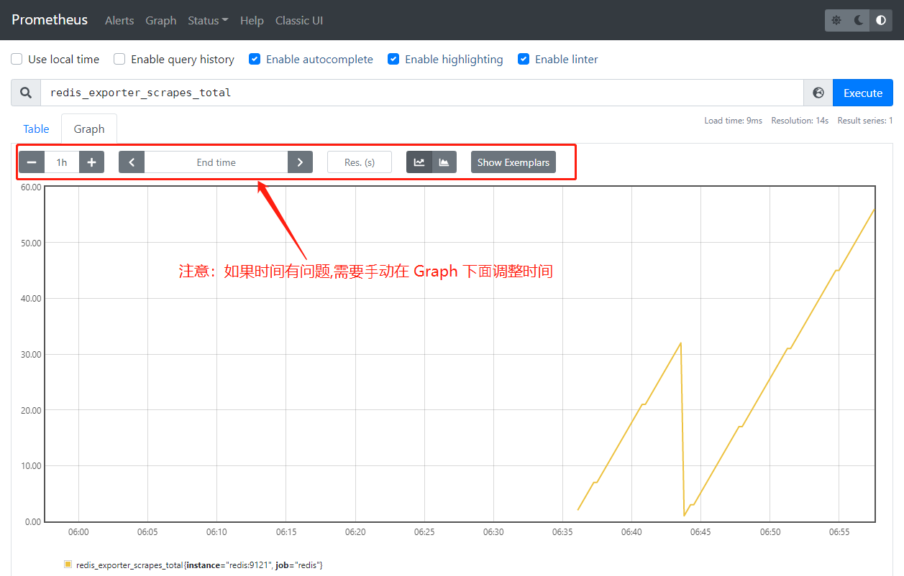

1.简介

Prometheus 的数据指标是通过⼀个公开的 HTTP(S) 数据接⼝获取到的，所以不需要单独安装监控的 agent，只需要暴露⼀个 metrics 接⼝，Prometheus 就会定期去拉取数据； 对于⼀些普通的 HTTP 服务，我们完全可以直接重⽤这个服务，添加⼀个 /metrics 接⼝暴露给 Prometheus；⽽且获取到的指标数据格式是⾮常易懂的，不需要太⾼的学习成本。现在很多服务从⼀开始就内置了⼀个 /metrics 接⼝，⽐如 Kubernetes 的各个组件、istio 服务⽹格都 直接提供了数据指标接⼝。有⼀些服务即使没有原⽣集成该接⼝，也完全可以使⽤⼀些 exporter 来获 取到指标数据，⽐如 mysqld_exporter、node_exporter，这些 exporter 就有点类似于传统监控服务中 的 agent，作为⼀直服务存在，⽤来收集⽬标服务的指标数据然后直接暴露给 Prometheus。


2.普通应用监控

前面在使用 ingress 的时候采⽤的是 Traefik 作为 ingress-controller， 它是 Kubernetes 集群内部服务和外部⽤户之间的桥梁。Traefik 本身内置了⼀个 /metrics 接⼝， 但是需要在参数中配置开启。开启有以下三种方式:

- 在 YAML 文件中配置

- 使用 TOML 配置文件

- CLI 方式

参考文档: https://doc.traefik.io/traefik/observability/metrics/prometheus/


本次使用 CLI 方式开启 Traefik 的 /metrics 接⼝.


第一步: 修改 traefik 的 YAML文件

[traefik.zip](attachments/52C2D3C32F7A43499CDB2DA5CCD94098traefik.zip)

修改 traefik.yaml，ingress.yaml 和 rbac.yaml 不用修改

```javascript
# traefik.yaml
---
kind: Deployment
apiVersion: apps/v1
metadata:
  namespace: kube-system
  name: traefik
  labels:
    app: traefik
spec:
  replicas: 1
  selector:
    matchLabels:
      app: traefik
  template:
    metadata:
      labels:
        app: traefik
    spec:
      serviceAccountName: traefik-ingress-controller
      # terminationGracePeriodSeconds 定义优雅关闭的宽限期,即在收到停止请求后有多少时间来进行资源释放或其它操作.如果到了最大时间还没有停止会被强制结束.默认值为30
      terminationGracePeriodSeconds: 60
      # 如果边缘节点不在centos7.master上,就没必要加上nodeSelector和tolerations
      # 定义容忍度
      tolerations:
      - operator: "Exists"  # Exists表示只要节点有这个污点的key,pod都能容忍,值是什么都行;Equal表示只要节点必须精确匹配污点的key和value才能容忍.
      #  key: "node-type"
      # 将Pod调度到期望的节点上
      nodeSelector:
        # 将Pod调度到 centos7.master 这个节点上, 当然也可以给centos7.master节点打一个唯一的标签,然后选择上就行
        kubernetes.io/hostname: centos7.master
      containers:
        - name: traefik
          imagePullPolicy: IfNotPresent
          image: traefik:v2.5
          # args是traefik的启动参数
          args:
            - --api.insecure
            - --accesslog
            - --entrypoints.web.Address=:8000
            - --entrypoints.websecure.Address=:4443
            - --providers.kubernetesingress
            # 以下参数是开启Traefik内置了的 /metrics 的接⼝
            - --metrics.prometheus=true
            - --entryPoints.metrics.address=:8082
            - --metrics.prometheus.entryPoint=metrics
            - --metrics.prometheus.buckets=0.100000, 0.300000, 1.200000, 5.000000
            - --metrics.prometheus.addEntryPointsLabels=true
            - --metrics.prometheus.addrouterslabels=true
            - --metrics.prometheus.addServicesLabels=true
            # - --providers.kubernetescrd
            # - --certificatesresolvers.myresolver.acme.tlschallenge
            # - --certificatesresolvers.myresolver.acme.email=foo@you.com
            # - --certificatesresolvers.myresolver.acme.storage=acme.json
            # Please note that this is the staging Let's Encrypt server.
            # Once you get things working, you should remove that whole line altogether.
            # - --certificatesresolvers.myresolver.acme.caserver=https://acme-staging-v02.api.letsencrypt.org/directory
          ports:
            # traefik的dashboard界面
            - name: web
              containerPort: 8000
            - name: websecure
              containerPort: 4443
            - name: admin
              containerPort: 8080
              # hostPort 可以把容器端⼝直接映射到节点上的80端⼝
              # hostPort: 80
            - name: metrics
              containerPort: 8082
              
---
apiVersion: v1
kind: Service
metadata:
  name: traefik
  namespace: kube-system
spec:
  # type: LoadBalancer
  # 使用NodePort主要是为了演示traefik的dashboard使用方法,因为现在没有创建ingress对象,所以暂时用Nodeport来演示
  type: NodePort
  ports:
    - protocol: TCP
      name: web
      port: 8000
    - protocol: TCP
      name: admin
      port: 8080
    - protocol: TCP
      name: websecure
      port: 4443
    - protocol: TCP
      name: metrics
      port: 8082
  selector:
    app: traefik

```


```javascript
[root@centos7 traefik]# kubectl create -f .
......
clusterrole.rbac.authorization.k8s.io/traefik-ingress-controller created
clusterrolebinding.rbac.authorization.k8s.io/traefik-ingress-controller created
deployment.apps/traefik created
service/traefik created
[root@centos7 traefik]# kubectl get svc -n kube-system
NAME             TYPE        CLUSTER-IP      EXTERNAL-IP   PORT(S)                                                       AGE
kube-dns         ClusterIP   10.96.0.10      <none>        53/UDP,53/TCP,9153/TCP                                        112d
metrics-server   ClusterIP   10.103.201.13   <none>        443/TCP                                                       2d5h
traefik          NodePort    10.97.45.244    <none>        8000:32454/TCP,8080:30430/TCP,4443:32016/TCP,8082:31883/TCP   13s

// 访问traefik的metrics接口得到如下结果,说明成功开启
[root@centos7 traefik]# curl 10.97.45.244:8082/metrics
# HELP go_gc_duration_seconds A summary of the pause duration of garbage collection cycles.
# TYPE go_gc_duration_seconds summary
go_gc_duration_seconds{quantile="0"} 5.2655e-05
go_gc_duration_seconds{quantile="0.25"} 7.6096e-05
.......

// 浏览器通过节点IP和nodeport也能访问到metrics接口
http://192.168.32.100:31883/metrics
```


第二步: 修改 prometheus 的  ConfigMap

[prometheus-cm.yaml](attachments/D6D9760F3F564F73B3F25F3884AD8128prometheus-cm.yaml)

```javascript
# prometheus-cm.yaml
---
apiVersion: v1
kind: ConfigMap
metadata:
  name: prometheus-config
  namespace: kube-ops
data:
  prometheus.yml: |
    global:
      scrape_interval: 15s
      scrape_timeout: 15s
    scrape_configs:
    - job_name: 'prometheus'
      static_configs:
      - targets: ['localhost:9090']
    # 监控 traefik
    - job_name: 'traefik'
      static_configs:
      - targets: ['traefik.kube-system.svc.cluster.local:8082']
```

这⾥的配置很简单，scrape_configs 下⾯可以⽀持很多参数，例如：

- basic_auth 和 bearer_token：⽐如 /metrics 接⼝需要 basic 认证的时候，通过传统的⽤户名/密码或者在请求的header中添加对应的 token 都可以⽀持。

- kubernetes_sd_configs 或 consul_sd_configs：可以⽤来⾃动发现⼀些应⽤的监控数据。


这⾥ Traefik 的 servicename 是 traefik，并且在 kube-system 这个 namespace 下⾯，所以这⾥的 targets 的路径配置需要使⽤ FQDN 的形式，如下： 

- traefik.kube-system.svc.cluster.local

如果 Traefik 和 Prometheus 都部署在同⼀个命名 空间，可以用如下形式: 	

- [servicename]:[serviceport]


```javascript
[root@centos7 traefik]# cd ..
[root@centos7 54 prometheus app]# ls
prometheus-cm.yaml  traefik

// Prometheus配置⽂件内容更改后,被挂载到Pod中的prometheus.yml⽂件隔⼀会也会更新
[root@centos7 54 prometheus app]# kubectl apply -f prometheus-cm.yaml 
Warning: resource configmaps/prometheus-config is missing the kubectl.kubernetes.io/last-applied-configuration annotation which is required by kubectl apply. kubectl apply should only be used on resources created declaratively by either kubectl create --save-config or kubectl apply. The missing annotation will be patched automatically.
configmap/prometheus-config configured

[root@centos7 54 prometheus app]# kubectl get svc -n  kube-ops
NAME         TYPE       CLUSTER-IP     EXTERNAL-IP   PORT(S)                          AGE
jenkins      NodePort   10.97.243.51   <none>        8080:30001/TCP,50000:30310/TCP   80d
prometheus   NodePort   10.106.78.77   <none>        9090:30216/TCP                   28h

// 之前Prometheus启动参数中添加了 --web.enable-lifecycle 参数,所以只需要执⾏ reload 命令即可让配置⽣效
// 由于ConfigMap通过Volume的形式挂载到Pod中去的,热更新需要⼀定的间隔时间才会⽣效
// reload 这个 url 是 POST 请求,通过 service 的 CLUSTER-IP:PORT 就可以访问到这个重载接⼝
[root@centos7 54 prometheus app]# curl -X POST "http://10.106.78.77:9090/-/reload"
[root@centos7 54 prometheus app]# 
```


第三步: 查看 Prometheus 的 Dashboard 中查看采集的⽬标数据


可以看到 traefik 这个任务已经出现，然后同样可以切换到 Graph ， 可以找到⼀些 Traefik 的指标数据，⾄于这些指标数据代表什么意义，可以去查看对应的 /metrics 接⼝，⼀般情况下⾥⾯都会有对应的注释。


3.使⽤ exporter 监控应⽤

有⼀些应⽤可能没有⾃带 /metrics 接⼝供 Prometheus 使⽤，在这种情况下就需要利⽤ exporter 服务来为 Prometheus 提供指标数据了。Prometheus 官⽅为许多应⽤就提供了对应的 exporter 应⽤，也有许多第三⽅的实现，可以在官⽅⽹站查看：https://prometheus.io/docs/instrumenting/exporters/


这⾥通过⼀个 redis-exporter 的服务来监控 redis 服务，对于这类应⽤，⼀般会以 sidecar 的形式和主应⽤部署在同⼀个 Pod 中，⽐如这⾥部署⼀个 redis 应⽤，并⽤ redis-exporter 的⽅式来采集监控数据供 Prometheus 使⽤，如下：

[redis.zip](attachments/0B7855E81720494383C8DD9D71BE2ABEredis.zip)


第一步: 部署 redis 和 redis_exporter

[prome-redis.yaml](attachments/34FA3FC1A4A24F9D88BBD953FE0527CAprome-redis.yaml)

```javascript
# prome-redis.yaml
apiVersion: apps/v1
kind: Deployment
metadata:
  name: redis
  namespace: kube-ops
spec:
  selector:
    matchLabels:
      app: redis
  template:
    metadata:
      annotations:
        prometheus.io/scrape: "true"
        prometheus.io/port: "9121"
      labels:
        app: redis
    spec:
      containers:
      - name: redis
        image: redis:6.2
        imagePullPolicy: IfNotPresent
        resources:
          requests:
            cpu: 100m
            memory: 100Mi
        ports:
        - containerPort: 6379
      - name: redis-exporter
        image: oliver006/redis_exporter:latest
        imagePullPolicy: IfNotPresent
        resources:
          requests:
            cpu: 100m
            memory: 100Mi
        ports:
        - containerPort: 9121
---
kind: Service
apiVersion: v1
metadata:
  name: redis
  namespace: kube-ops
spec:
  selector:
    app: redis
  ports:
  - name: redis
    port: 6379
    targetPort: 6379
  - name: prom
    port: 9121
    targetPort: 9121
```

可以看到在 redis 这个 Pod 中包含了两个容器，⼀个是 redis，另⼀个容器就是 redis_exporter。


```javascript
[root@centos7 redis]# kubectl create -f prome-redis.yaml 
deployment.apps/redis created
service/redis created

[root@centos7 redis]# kubectl get pod -n kube-ops
NAME                          READY   STATUS    RESTARTS      AGE
jenkins-85db8588bd-gckdh      1/1     Running   2 (16m ago)   4d23h
prometheus-7785c6577b-68dtz   1/1     Running   2 (16m ago)   4d20h
redis-6547f5d866-4dl4d        2/2     Running   0             10m

// 可以看到 redis 的 Pod ⾥⾯包含有两个容器
[root@centos7 redis]# kubectl get svc -n kube-ops
NAME         TYPE        CLUSTER-IP      EXTERNAL-IP   PORT(S)                          AGE
jenkins      NodePort    10.97.243.51    <none>        8080:30001/TCP,50000:30310/TCP   84d
prometheus   NodePort    10.106.78.77    <none>        9090:30216/TCP                   4d20h
redis        ClusterIP   10.96.158.160   <none>        6379/TCP,9121/TCP                12m

// 通过 9121 端⼝来校验是否能够采集到数据
[root@centos7 redis]# curl 10.96.158.160:9121/metrics
# HELP go_gc_duration_seconds A summary of the pause duration of garbage collection cycles.
# TYPE go_gc_duration_seconds summary
go_gc_duration_seconds{quantile="0"} 0
......
# TYPE redis_uptime_in_seconds gauge
redis_uptime_in_seconds 809

```


第二步: 更新 Prometheus 的配置⽂件

```javascript
# prometheus-cm.yaml
---
apiVersion: v1
kind: ConfigMap
metadata:
  name: prometheus-config
  namespace: kube-ops
data:
  prometheus.yml: |
    global:
      scrape_interval: 15s
      scrape_timeout: 15s
    scrape_configs:
    - job_name: 'prometheus'
      static_configs:
      - targets: ['localhost:9090']
    # 监控 traefik
    - job_name: 'traefik'
      static_configs:
      - targets: ['traefik.kube-system.svc.cluster.local:8082']
    # 监控 redis
    - job_name: 'redis'
      static_configs:
      - targets: ['redis:9121']
      
```

这里由于 redis 服务和 Prometheus 处于同⼀个 namespace 下，所以直接使⽤  "servicename:port" 形式即可。


```javascript
[root@centos7 redis]# kubectl apply -f prometheus-cm.yaml 
configmap/prometheus-config configured

[root@centos7 redis]# kubectl get svc -n kube-ops
NAME         TYPE        CLUSTER-IP      EXTERNAL-IP   PORT(S)                          AGE
jenkins      NodePort    10.97.243.51    <none>        8080:30001/TCP,50000:30310/TCP   84d
prometheus   NodePort    10.106.78.77    <none>        9090:30216/TCP                   4d21h
redis        ClusterIP   10.96.158.160   <none>        6379/TCP,9121/TCP                36m

// 配置⽂件更新后重新加载
[root@centos7 redis]# curl -X POST "http://10.106.78.77:9090/-/reload"
```


第三步: 在Prometheus 的 Dashboard 中查看采集的⽬标数据


可以看到配置的 redis 这个 job 已经⽣效了。切换到 Graph 下⾯可以看到很多关于 redis 的指标数据：


选择任意⼀个指标，⽐如 redis_exporter_scrapes_total ，然后点击执⾏就可以看到对应的数据图表了：




除了监控群集中部署的服务之外，还可以监视 Kubernetes 群集本身。