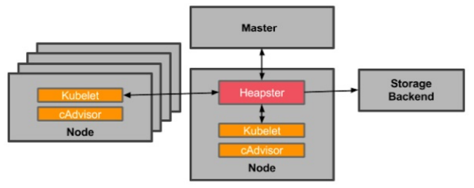
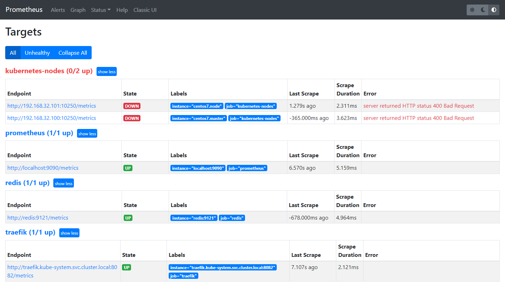
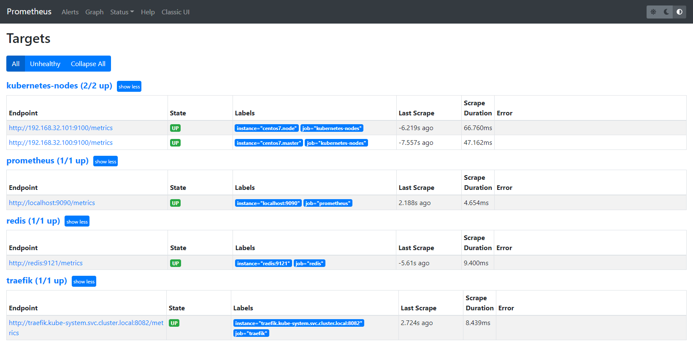
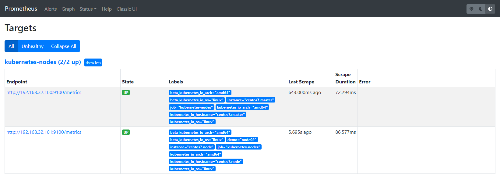
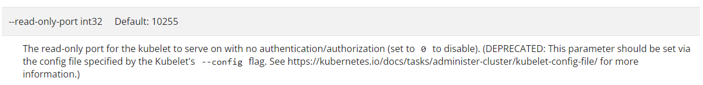
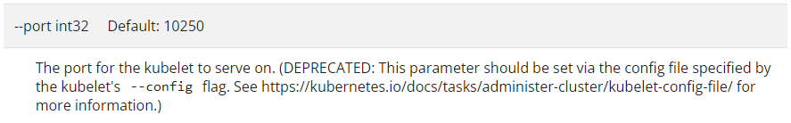
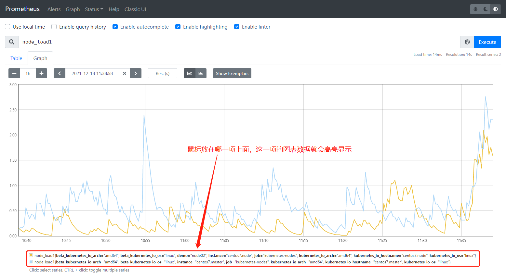
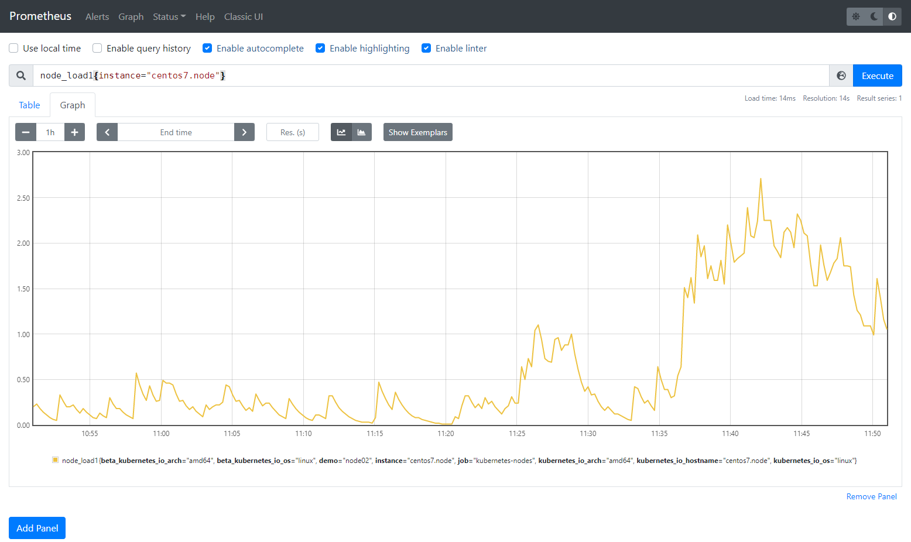

1. 监控 Kubernetes 集群节点

对于 Kubernetes 集群本身的监控也⾮常重要，因为需要时刻了解集群的运⾏状态。 对于集群的监控⼀般我们需要考虑以下⼏个⽅⾯：

- Kubernetes 节点的监控：⽐如节点的 cpu、load、disk、memory 等指标

- 内部系统组件的状态：⽐如 kube-scheduler、kube-controller-manager、kubedns/coredns 等组件的详细运⾏状态

- 编排级的 metrics：⽐如 Deployment 的状态、资源请求、调度和 API 延迟等数据指标


2. 监控⽅案

Kubernetes 集群的监控⽅案⽬前主要有以下⼏种⽅案：


第一种方案:

Heapster：Heapster 是⼀个集群范围的监控和数据聚合⼯具，以 Pod 的形式运⾏在集群中。



除了 Kubelet/cAdvisor 之外，还可以向 Heapster 添加其他指标源数据，⽐如 kube-state-metrics。需要注意的是 Heapster 已经被废弃了，后续版本中会使⽤ metrics-server 代替。


第二种方案:

cAdvisor：cAdvisor是 Google 开源的容器资源监控和性能分析⼯具，它是专⻔为容器⽽⽣，本身 也⽀持 Docker 容器，在 Kubernetes 中，不需要单独去安装，cAdvisor 作为 kubelet 内置的 ⼀部分程序可以直接使⽤。


第三种方案:

Kube-state-metrics：kube-state-metrics通过监听 API Server ⽣成有关资源对象的状态指标，⽐ 如 Deployment、Node、Pod，需要注意的是 kube-state-metrics 只是简单提供⼀个 metrics 数 据，并不会存储这些指标数据，所以可以使⽤ Prometheus 来抓取这些数据然后存储。


第四种方案:

metrics-server：metrics-server 也是⼀个集群范围内的资源数据聚合⼯具，是 Heapster 的替代 品，同样的，metrics-server 也只是显示数据，并不提供数据存储服务。


kube-state-metrics 和 metrics-server 之间有很⼤不同，主要区别如下：

- kube-state-metrics 主要关注的是业务相关的⼀些元数据，⽐如 Deployment、Pod、副本状态等

- metrics-server 主要关注的是资源度量 API 的实现，⽐如 CPU、⽂件描述符、内存、请求延时等 指标。


3. 监控集群节点

监控节点其实已经有很多⾮常成熟的⽅案，⽐如 Nagios、zabbix，甚⾄⾃⼰来收集数据也可以，这⾥通过 Prometheus 来采集节点的监控指标数据，可以通过node_exporter来获取，顾名思义，node_exporter 就是抓取⽤于采集服务器节点的各种运⾏指标，⽬前 node_exporter ⽀持⼏乎所有常⻅的监控点，⽐如 conntrack，cpu，diskstats，filesystem，loadavg，meminfo，netstat等，详细监控点列表参考其Github repo。

Github repo： https://github.com/prometheus/node_exporter


可以通过 DaemonSet 控制器来部署该服务，这样每⼀个节点都会⾃动运⾏⼀个这样的 Pod，如果从集群中删除或者添加节点后，也会进⾏⾃动扩展。

[prometheus-node.zip](attachments/87ACB985908F48F5B7C49B471757DD35prometheus-node.zip)

第一步: 部署 node-exporter

```javascript
# prome-node-exporter.yaml
apiVersion: apps/v1
kind: DaemonSet
metadata:
  name: node-exporter
  namespace: kube-ops
  labels:
    name: node-exporter
spec:
  selector:
    matchLabels:
      name: node-exporter
  template:
    metadata:
      labels:
        name: node-exporter
    spec:
      hostPID: true
      hostIPC: true
      hostNetwork: true
      containers:
      - name: node-exporter
        image: quay.io/prometheus/node-exporter:v1.3.1
        imagePullPolicy: IfNotPresent
        ports:
        - containerPort: 9100
        resources:
          requests:
            cpu: 0.15
        securityContext:
          privileged: true
        args:
        - --path.procfs
        - /host/proc
        - --path.sysfs
        - /host/sys
        - --collector.filesystem.ignored-mount-points
        - '"^/(sys|proc|dev|host|etc)($|/)"'
        volumeMounts:
        - name: dev
          mountPath: /host/dev
        - name: proc
          mountPath: /host/proc
        - name: sys
          mountPath: /host/sys
        - name: rootfs
          mountPath: /rootfs
      tolerations:
      - key: "node-role.kubernetes.io/master"
        operator: "Exists"
        effect: "NoSchedule"
      volumes:
        - name: proc
          hostPath:
            path: /proc
        - name: dev
          hostPath:
            path: /dev
        - name: sys
          hostPath:
            path: /sys
        - name: rootfs
          hostPath:
            path: /

```


部署 node-exporter 有⼀些细节需要注意，由于要获取的数据是主机的监控指标数据，⽽ node-exporter 是运⾏在容器中，所以 Pod 中需要配置⼀些 Pod 的安全策略，这⾥就添加了 hostPID: true 、 hostIPC: true 、 hostNetwork: true 3个策略，⽤来使⽤主机的 PID namespace、IPC namespace 以及主机⽹络，这些 namespace 就是⽤于容器隔离的关键技术，注意：这⾥的 namespace 和集群中的 namespace 是两个完全不相同的概念。

另外还将主机的 /dev 、 /proc 、 /sys 这些⽬录挂载到容器中，因为采集的很多节点数据都是通过这些⽂件夹下⾯的⽂件来获取到的，⽐如在使⽤ top 命令可以查看当前 cpu 使⽤情 况，数据就来源于⽂件 /proc/stat ，使⽤ free 命令可以查看当前内存使⽤情况，其数据来源是来 ⾃ /proc/meminfo ⽂件。

另外由于集群使⽤的是 kubeadm 搭建的，所以如果希望 master 节点也⼀起被监控，则需要添加相应的容忍。


```javascript
[root@centos7 55 prometheus node]# docker pull quay.io/prometheus/node-exporter:v1.3.1

[root@centos7 55 prometheus node]# kubectl create -f prome-node-exporter.yaml 
daemonset.apps/node-exporter created

[root@centos7 55 prometheus node]# kubectl get DaemonSet -n kube-ops
NAME            DESIRED   CURRENT   READY   UP-TO-DATE   AVAILABLE   NODE SELECTOR   AGE
node-exporter   2         2         2       2            2           <none>          118s

// 可以看到在2个节点上都运⾏了⼀个 "node-exporte-xxxxx" 这样的 Pod
[root@centos7 55 prometheus node]# kubectl get pods -n kube-ops -o wide
NAME                          READY   STATUS    RESTARTS       AGE     IP               NODE             NOMINATED NODE   READINESS GATES
jenkins-85db8588bd-gckdh      1/1     Running   2 (126m ago)   5d1h    10.244.189.150   centos7.node     <none>           <none>
node-exporter-24fmc           1/1     Running   0              68s     192.168.32.101   centos7.node     <none>           <none>
node-exporter-vp2wq           1/1     Running   0              68s     192.168.32.100   centos7.master   <none>           <none>
prometheus-7785c6577b-68dtz   1/1     Running   2 (126m ago)   4d22h   10.244.189.140   centos7.node     <none>           <none>
redis-84bb976d64-wbbvb        2/2     Running   0              90m     10.244.189.163   centos7.node     <none>           <none>

// 需要创建⼀个 Service 去获取 /metrics 数据吗?
// 因为指定了hostNetwork=true,所以每个节点上会绑定9100端⼝,可以通过这个端⼝去获取到监控指标数据

// 如果觉得上⾯的⼿动安装⽅式⽐较麻烦,也可以使⽤ Helm 的⽅式安装,如下:
// helm install --name node-exporter stable/prometheus-node-exporter --namespace kube-ops
```


第二步: 服务发现

这⾥2个节点上⾯都运⾏了 node-exporter 程序，如果通过⼀个 Service 来将数据收集到 ⼀起⽤静态配置的⽅式配置到 Prometheus 去中，就只会显示⼀条数据，然后得需要⾃⼰在指标数据中去过滤每个节点的数据，可以通过服务发现这种⽅式可以让 Prometheus 去⾃动发现节点的 node-exporter 程序，并且按节点进⾏分组。

在 Kubernetes 下，Promethues 通过与 Kubernetes API 集成，⽬前主要⽀持5种服务发现模式，分别是：Node、Service、Pod、Endpoints、Ingress。

```javascript
// 通过 kubectl 命令可以很⽅便的获取到当前集群中的所有节点信息
[root@centos7 55 prometheus node]# kubectl get nodes
NAME             STATUS   ROLES                  AGE    VERSION
centos7.master   Ready    control-plane,master   116d   v1.22.1
centos7.node     Ready    <none>                 116d   v1.22.1
```

如果要让 Prometheus 也能够获取到当前集群中的所有节点信息，就需要利⽤ Node 服务发现模式，同样的，在 prometheus.yml ⽂件中配置如下的 job 任务即可。

```javascript
# prometheus-cm.yaml
---
apiVersion: v1
kind: ConfigMap
metadata:
  name: prometheus-config
  namespace: kube-ops
data:
  prometheus.yml: |
    global:
      scrape_interval: 15s
      scrape_timeout: 15s
    scrape_configs:
    - job_name: 'prometheus'
      static_configs:
      - targets: ['localhost:9090']
    # 监控 traefik
    - job_name: 'traefik'
      static_configs:
      - targets: ['traefik.kube-system.svc.cluster.local:8082']
    # 监控 redis
    - job_name: 'redis'
      static_configs:
      - targets: ['redis:9121']
    # 监控 kubernetes 集群 node
    - job_name: 'kubernetes-nodes'
      kubernetes_sd_configs:
      - role: node
```

通过指定 kubernetes_sd_configs 的模式为 node ，Prometheus 就会⾃动从 Kubernetes 中发现所有 的 node 节点并作为当前 job 监控的⽬标实例，发现的节点 /metrics 接⼝是默认的 kubelet 的 HTTP 接⼝。

```javascript
[root@centos7 55 prometheus node]# kubectl apply -f prometheus-cm.yaml 
configmap/prometheus-config configured

// 更新 prometheus 的 ConfigMap
[root@centos7 55 prometheus node]# kubectl get svc -n kube-ops
NAME         TYPE        CLUSTER-IP      EXTERNAL-IP   PORT(S)                          AGE
jenkins      NodePort    10.97.243.51    <none>        8080:30001/TCP,50000:30310/TCP   84d
prometheus   NodePort    10.106.78.77    <none>        9090:30216/TCP                   4d23h
redis        ClusterIP   10.96.158.160   <none>        6379/TCP,9121/TCP                160m

// 执⾏ reload 操作让配置⽣效
[root@centos7 55 prometheus node]# curl -X POST "http://10.106.78.77:9090/-/reload"
```


第三步:  配置⽣效后去 prometheus 的 dashboard 中查看 Targets 是否能够正常抓取数据



可以看到 kubernetes-nodes 这个 job 任务已经⾃动发现了2个 node 节点，但是获取数据失败。这是因为 prometheus 去发现 Node 模式的服务的时候，访问的端⼝默认是10250，⽽现在该端⼝下已经没有 /metrics 指标数据，现在 kubelet 只读的数据接⼝统⼀通过10255端⼝进⾏暴露， 所以应该替换掉10250这个端⼝，但这里不需要替换成10255端⼝，因为这里是要去配置上⾯通过 node-exporter 抓取到的节点指标数据，因为上⾯指定了 hostNetwork=true ，所以每个节点上会绑定9100这个端⼝，所以应该将这⾥的10250替换成9100。

注意: kubelet 只读的数据接口 10255 端口已过时，10250端口也已过时。

```javascript
// 在浏览器访问"nodeIP:9100/metrics"可以发现有数据返回
192.168.32.100:9100/metrics
192.168.32.101:9100/metrics

// 在当前K8s的1.22.1-0版本中不能发现 10255 这个端口
[root@centos7 55 prometheus node]# netstat | grep 1025
tcp6       0      0 centos7.master:10250    centos7.node:48220      ESTABLISHED
[root@centos7 55 prometheus node]# netstat | grep 10255
[root@centos7 55 prometheus node]# 
```


改进1:

```javascript
# prometheus-cm.yaml
---
apiVersion: v1
kind: ConfigMap
metadata:
  name: prometheus-config
  namespace: kube-ops
data:
  prometheus.yml: |
    global:
      scrape_interval: 15s
      scrape_timeout: 15s
    scrape_configs:
    - job_name: 'prometheus'
      static_configs:
      - targets: ['localhost:9090']
    # 监控 traefik
    - job_name: 'traefik'
      static_configs:
      - targets: ['traefik.kube-system.svc.cluster.local:8082']
    # 监控 redis
    - job_name: 'redis'
      static_configs:
      - targets: ['redis:9121']
    # 监控 kubernetes 集群 node
    - job_name: 'kubernetes-nodes'
      kubernetes_sd_configs:
      - role: node
      relabel_configs:
      - source_labels: [__address__]
        regex: '(.*):10250'
        replacement: '${1}:9100'
        target_label: __address__
        action: replace

```

替换需要使⽤到 Prometheus 提供的 relabel_configs 中的 replace 功能，relabel 可以在 Prometheus 采集数据之前，通过Target 实例的 Metadata 信息，动态重新写⼊ Label 的值。

除此之 外，还能根据 Target 实例的 Metadata 信息选择是否采集或者忽略该 Target 实例。⽐如这⾥就可以去匹配 __address__ 这个 Label 标签，然后替换掉其中的端⼝。上面"prometheus-cm.yaml"文件中就是⼀个正则表达式去匹配 __address__ ，然后将 host 部分保留下来，port 替换成了9100。

```javascript
// 重新更新配置⽂件
[root@centos7 55 prometheus node]# kubectl apply -f prometheus-cm.yaml 
configmap/prometheus-config configured

[root@centos7 55 prometheus node]# kubectl get svc -n kube-ops
NAME         TYPE        CLUSTER-IP      EXTERNAL-IP   PORT(S)                          AGE
jenkins      NodePort    10.97.243.51    <none>        8080:30001/TCP,50000:30310/TCP   84d
prometheus   NodePort    10.106.78.77    <none>        9090:30216/TCP                   5d
redis        ClusterIP   10.96.158.160   <none>        6379/TCP,9121/TCP                3h27m

// 隔一会执⾏ reload 操作
[root@centos7 55 prometheus node]# curl -X POST "http://10.106.78.77:9090/-/reload"
```


查看 Prometheus 的 Dashboard 的 Targets 路径下的 job 任务



可以看到已经正常，但是还有⼀个问题就是采集的指标数据 Label 标签没有和node 节点的 Label 标签同步，这对于在进⾏监控分组分类查询的时候带来了很多不⽅便的地⽅，要是能够将集群中 Node 节点的 Label 标签也能获取到就很好了。 


改进2:

通过 labelmap 这个属性将 Kubernetes 的 Label 标签添加为 Prometheus 的指标标签。

```javascript
# prometheus-cm.yaml
---
apiVersion: v1
kind: ConfigMap
metadata:
  name: prometheus-config
  namespace: kube-ops
data:
  prometheus.yml: |
    global:
      scrape_interval: 15s
      scrape_timeout: 15s
    scrape_configs:
    - job_name: 'prometheus'
      static_configs:
      - targets: ['localhost:9090']
    # 监控 traefik
    - job_name: 'traefik'
      static_configs:
      - targets: ['traefik.kube-system.svc.cluster.local:8082']
    # 监控 redis
    - job_name: 'redis'
      static_configs:
      - targets: ['redis:9121']
    # 监控 kubernetes 集群 node
    - job_name: 'kubernetes-nodes'
      kubernetes_sd_configs:
      - role: node
      relabel_configs:
      - source_labels: [__address__]
        regex: '(.*):10250'
        replacement: '${1}:9100'
        target_label: __address__
        action: replace
      - action: labelmap
        regex: __meta_kubernetes_node_label_(.+)
```

添加了⼀个 action 为 labelmap，__meta_kubernetes_node_label_(.+)  是正则表达式配置，意思就是表达式中匹配到的数据也添加到指标数据的 Label 标签中去。对于 kubernetes_sd_configs 下⾯可⽤的标签如下(可⽤元标签)：

- __meta_kubernetes_node_name：节点对象的名称

- _meta_kubernetes_node_label：节点对象中的每个标签

- _meta_kubernetes_node_annotation：来⾃节点对象的每个注释

- _meta_kubernetes_node_address：每个节点地址类型的第⼀个地址(如果存在)


关于 kubernets_sd_configs 更多信息可以查看官⽅⽂档：

https://prometheus.io/docs/prometheus/latest/configuration/configuration/#kubernetes_sd_config


```javascript
// 重新更新配置⽂件
[root@centos7 55 prometheus node]# kubectl apply -f prometheus-cm.yaml 
configmap/prometheus-config configured

[root@centos7 55 prometheus node]# kubectl get svc -n kube-ops
NAME         TYPE        CLUSTER-IP      EXTERNAL-IP   PORT(S)                          AGE
jenkins      NodePort    10.97.243.51    <none>        8080:30001/TCP,50000:30310/TCP   84d
prometheus   NodePort    10.106.78.77    <none>        9090:30216/TCP                   5d
redis        ClusterIP   10.96.158.160   <none>        6379/TCP,9121/TCP                3h27m

// 隔一会执⾏ reload 操作
[root@centos7 55 prometheus node]# curl -X POST "http://10.106.78.77:9090/-/reload"
```





改进3:

由于 kubelet 也⾃带了⼀些监控指标数据，就上⾯提到的 10255 端⼝，这⾥也把 kubelet 的监控任务也⼀并配置上。


kubelet 只读的数据接口 10255 端口已过时，官网地址说明如下: 

https://kubernetes.io/docs/reference/command-line-tools-reference/kubelet/






```javascript
// 在当前K8s的1.22.1-0版本中不能发现 10255 这个端口
[root@centos7 55 prometheus node]# netstat | grep 1025
tcp6       0      0 centos7.master:10250    centos7.node:48220      ESTABLISHED
[root@centos7 55 prometheus node]# netstat | grep 10255
[root@centos7 55 prometheus node]# 
```


第四步:  查询

现在切换到 Graph 路径下查看采集的指标数据，⽐如查询 node_load1 指标。



从上图可以看到2个 node 节点对应的 node_load1 指标数据都查询出来了，同样的，还可以使⽤ PromQL 语句来进⾏⼀些更复杂的聚合查询操作，还可以根据  Labels 标签对指标数据进⾏聚合，⽐如这⾥只查询 centos7.node 节点的数据，可以使⽤表达式 node_load1{instance="centos7.node"} 来进⾏查询：




到这⾥就使⽤ Prometheus 把 Kubernetes 集群节点监控起来了，还可以监控 Pod 或者 Service 之类的资源对象。