1.Prometheus ⾃动监控 Kubernetes 中的⼀些常⽤资源对象

 Prometheus ⾃动发现 Kubernetes 集群的节点，⽤到了 Prometheus 针对 Kubernetes 的服务发现机制 kubernetes_sd_configs 的使⽤。

前⾯在 Prometheus 中⽤静态的⽅式来监控 Kubernetes 集群中的普通应⽤，但是 如果针对集群中众多的资源对象都采⽤静态的⽅式来进⾏配置的话显然是不现实的，所以同样需要使⽤到 Prometheus 提供的其他类型的服务发现机制。


2.容器监控(说到容器监控⾃然会想到 cAdvisor)

前⾯说过 cAdvisor 已经内置在 kubelet 组件之中，所以不需要单独去安装，cAdvisor 的数据路径为 /api/v1/nodes//proxy/metrics ，同样这⾥使⽤ node 的服务发现模式，因为每⼀个节点下⾯都有 kubelet，⾃然都有 cAdvisor 采集到的数据指标，配置如下：

[prometheus-container.zip](attachments/5FDE573EF27943A7A8F903BFB3C7BD9Fprometheus-container.zip)

```javascript
# prometheus-cm.yaml
---
apiVersion: v1
kind: ConfigMap
metadata:
  name: prometheus-config
  namespace: kube-ops
data:
  prometheus.yml: |
    global:
      scrape_interval: 15s
      scrape_timeout: 15s
    scrape_configs:
    - job_name: 'prometheus'
      static_configs:
      - targets: ['localhost:9090']
    # 监控 traefik
    - job_name: 'traefik'
      static_configs:
      - targets: ['traefik.kube-system.svc.cluster.local:8082']
    # 监控 redis
    - job_name: 'redis'
      static_configs:
      - targets: ['redis:9121']
    # 监控 kubernetes 集群 node
    - job_name: 'kubernetes-nodes'
      kubernetes_sd_configs:
      - role: node
      relabel_configs:
      - source_labels: [__address__]
        regex: '(.*):10250'
        replacement: '${1}:9100'
        target_label: __address__
        action: replace
      - action: labelmap
        regex: __meta_kubernetes_node_label_(.+)
    # 监控容器
    - job_name: 'kubernetes-cadvisor'
      kubernetes_sd_configs:
      - role: node
      scheme: https
      tls_config:
        ca_file: /var/run/secrets/kubernetes.io/serviceaccount/ca.crt
      bearer_token_file: /var/run/secrets/kubernetes.io/serviceaccount/token
      relabel_configs:
      - action: labelmap
        regex: __meta_kubernetes_node_label_(.+)
      - target_label: __address__
        replacement: kubernetes.default.svc:443
      - source_labels: [__meta_kubernetes_node_name]
        regex: (.+)
        target_label: __metrics_path__
        replacement: /api/v1/nodes/${1}/proxy/metrics/cadvisor
```

上⾯的配置和之前配置 node-exporter 时⼏乎⼀样，区别是这⾥使⽤了 https 协议，要注意的是配置了 ca.cart 和 token 这两个⽂件，这两个⽂件是 Pod 启动后⾃动注⼊进来 的，通过这两个⽂件可以在 Pod 中访问 apiserver，⽐如这⾥的 __address__ 不是 nodeip，⽽是 kubernetes 在集群中的服务地址，然后加上 __metrics_path__ 的访问路径：/api/v1/nodes/${1}/proxy/metrics/cadvisor 


```javascript
// 更新配置,然后查看 Targets 路径
[root@centos7 57prometheus-k8sobject]# kubectl apply -f prometheus-cm.yaml 
configmap/prometheus-config configured

[root@centos7 57prometheus-k8sobject]# kubectl get svc -n kube-ops
NAME         TYPE        CLUSTER-IP      EXTERNAL-IP   PORT(S)                          AGE
jenkins      NodePort    10.97.243.51    <none>        8080:30001/TCP,50000:30310/TCP   85d
prometheus   NodePort    10.106.78.77    <none>        9090:30216/TCP                   5d18h
redis        ClusterIP   10.96.158.160   <none>        6379/TCP,9121/TCP                22h

[root@centos7 57prometheus-k8sobject]# curl -X POST "http://10.106.78.77:9090/-/reload"
```


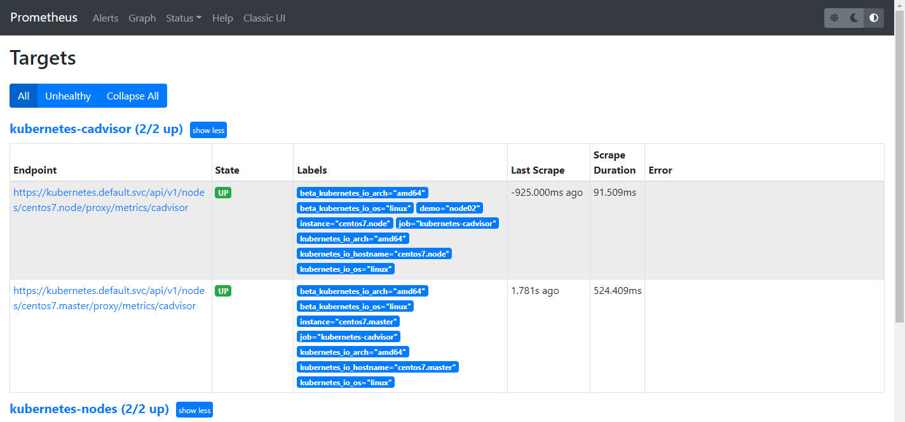


然后切换到Graph路径下查询容器相关数据，⽐如这⾥查询集群中所有 Pod 的 CPU 使⽤情况，这⾥⽤的数据指标是 container_cpu_usage_seconds_total，然后去除⼀些⽆效的数据，查询1分钟内的数据，由于查询到的数据都是容器相关的，最好要安装 Pod 来进⾏聚合(不知道什么意思)，对应的 promQL 语句如下：

```javascript
// 下面这条语句在版本为 1.22.1-0 的k8s中查不出来结果
// 不知道是不是因为没有安装Pod来进行聚合,这里的 pod_name 不知道是不是标签名
sum by (pod_name)(rate(container_cpu_usage_seconds_total{image!="", pod_name!=""}[1m] ))

// 如下是经过自己测试研究的出来的结果
// 经测试该语句可以用以下格式执行
// sum by ([LabelName])(rate(container_cpu_usage_seconds_total{image!="", [LabelName]!=""}[1m] ))

// 查询标签名为"container"的容器的 container_cpu_usage_seconds_total 指标数据
sum by (container)(rate(container_cpu_usage_seconds_total{image!="", container!=""}[1m] ))

// 查询标签名为"pod"的容器的 container_cpu_usage_seconds_total 指标数据
sum by (pod)(rate(container_cpu_usage_seconds_total{image!="", pod!=""}[1m] ))
```


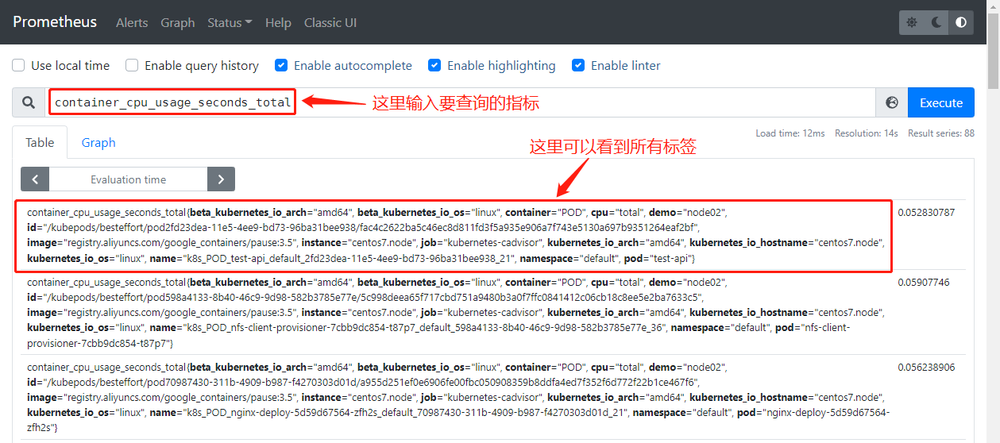


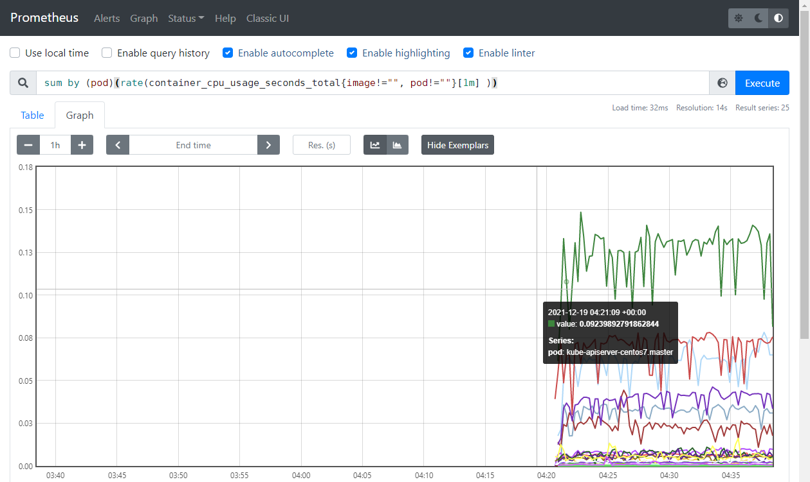

可以看到上⾯的结果就是集群中的所有 Pod 在1分钟之内的 CPU 使⽤情况的曲线图，还有很多数据可以获取到，后⾯在需要的时候再介绍。


3.apiserver 监控

apiserver 作为 Kubernetes 最核⼼的组件，对于 apiserver 的监控也⾮常有必要，对于 apiserver 的监控可以直接通过 kubernetes 的 Service 来获取：

```javascript
// 这个 Service 就是集群的 apiserver 在集群内部的 Service 地址
[root@centos7 57prometheus-k8sobject]#  kubectl get svc
NAME            TYPE        CLUSTER-IP       EXTERNAL-IP   PORT(S)          AGE
kubernetes      ClusterIP   10.96.0.1        <none>        443/TCP          117d

```


Prometheus 要⾃动发现 Service 类型的服务就需要⽤到 role 为 Endpoints 的 kubernetes_sd_configs，可以在 ConfigMap 对象中添加上⼀个 Endpoints 类型的服务的监控任务：

[prometheus-apiserver.zip](attachments/378A8EDB86D040D68DC0202D3286BE13prometheus-apiserver.zip)

```javascript
# prometheus-cm.yaml
// 添加到 Prometheus 的 ConfigMap 的配置⽂件中
//......
    # 监控 apiserver
    - job_name: 'kubernetes-apiservers'
      kubernetes_sd_configs:
      - role: endpoints
//......
//上⾯这段代码就是定义的⼀个类型为 endpoints 的 kubernetes_sd_configs
```


```javascript
// 更新配置,然后查看 Targets 路径
[root@centos7 57prometheus-k8sobject]# kubectl apply -f prometheus-cm.yaml 
configmap/prometheus-config configured

[root@centos7 57prometheus-k8sobject]# kubectl get svc -n kube-ops
NAME         TYPE        CLUSTER-IP      EXTERNAL-IP   PORT(S)                          AGE
jenkins      NodePort    10.97.243.51    <none>        8080:30001/TCP,50000:30310/TCP   85d
prometheus   NodePort    10.106.78.77    <none>        9090:30216/TCP                   5d18h
redis        ClusterIP   10.96.158.160   <none>        6379/TCP,9121/TCP                22h

[root@centos7 57prometheus-k8sobject]# curl -X POST "http://10.106.78.77:9090/-/reload"
```


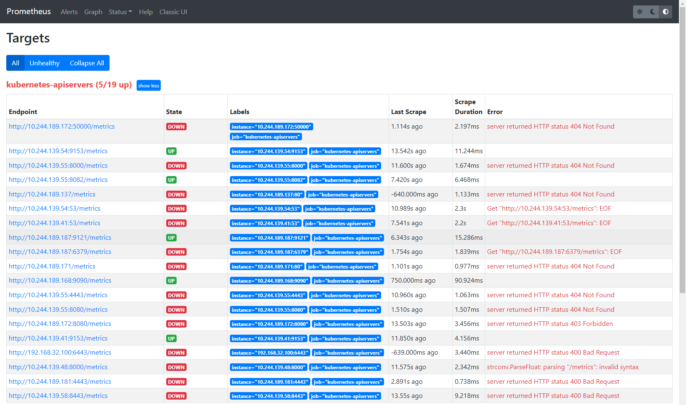

可以看到 kubernetes-apiservers 下⾯出现了很多实例，这是因为这⾥使⽤的是 Endpoints 类型的服务发现，所以 Prometheus 把所有的 Endpoints 服务都抓取了，同样的，上⾯需要的服务名为 kubernetes 这个 apiserver 的服务也在这个列表之中，所以需要使用 relabel_configs 这个配置过滤出这个服务，这⾥不使⽤ replace 这个动作，⽽是 keep ，就是只把符合要求的给保留下来。

如何过滤出符合要求的服务？可以把⿏标放置在任意⼀个 target 上，可以查看到 Before relabeling ⾥⾯所有的元数据，⽐如要过滤的服务是 default 这个 namespace 下⾯，服务名为 kubernetes 的元数据，所以这⾥就可以根据对应的 __meta_kubernetes_namespace 和 __meta_kubernetes_service_name 这两个元数据来 relabel。另外由于 kubernetes 这个服务对应的端⼝是443，所以这⾥需要使⽤ https 协议，对应的就需要将对应的 ca 证书配置上。

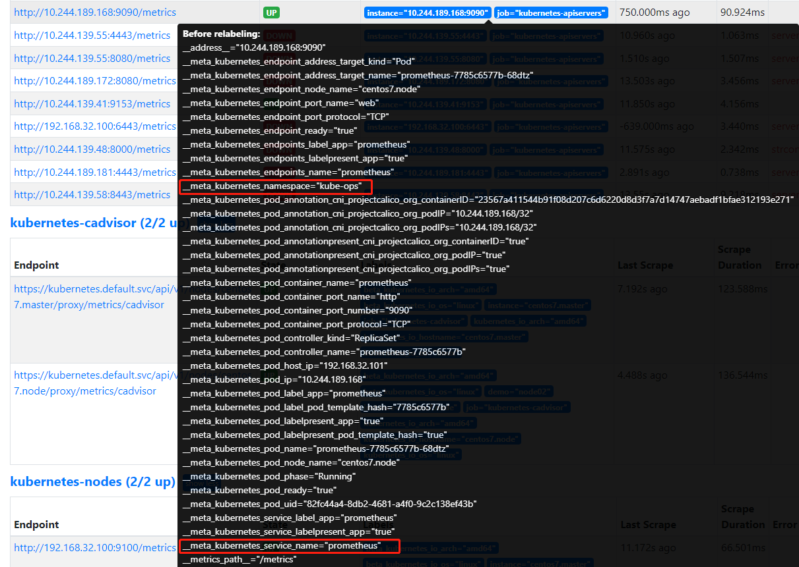


改进配置文件:

```javascript
# prometheus-cm.yaml
//......
    # 监控 apiserver
    - job_name: 'kubernetes-apiservers'
      kubernetes_sd_configs:
      - role: endpoints
      scheme: https
      tls_config:
        ca_file: /var/run/secrets/kubernetes.io/serviceaccount/ca.crt
      bearer_token_file: /var/run/secrets/kubernetes.io/serviceaccount/token
      relabel_configs:
      - source_labels: [__meta_kubernetes_namespace, __meta_kubernetes_service_name, __meta_kubernetes_endpoint_port_name]
        action: keep
        regex: default;kubernetes;https
//......
```


```javascript
// 新更新配置⽂件、重新加载 Prometheus,切换到 Prometheus 的 Targets 路径下查看
[root@centos7 57prometheus-k8sobject]# kubectl apply -f prometheus-cm.yaml 
configmap/prometheus-config configured

[root@centos7 57prometheus-k8sobject]# kubectl get svc -n kube-ops
NAME         TYPE        CLUSTER-IP      EXTERNAL-IP   PORT(S)                          AGE
jenkins      NodePort    10.97.243.51    <none>        8080:30001/TCP,50000:30310/TCP   85d
prometheus   NodePort    10.106.78.77    <none>        9090:30216/TCP                   5d18h
redis        ClusterIP   10.96.158.160   <none>        6379/TCP,9121/TCP                22h

[root@centos7 57prometheus-k8sobject]# curl -X POST "http://10.106.78.77:9090/-/reload"
```


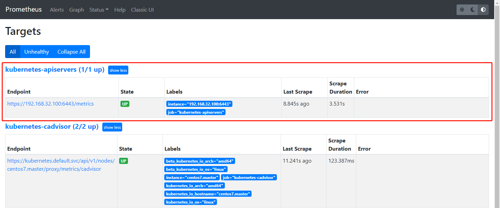

现在可以看到 kubernetes-apiserver 这个任务下⾯只有 apiserver 这⼀个实例了，证明 relabel 是成功的，现在切换到 graph 路径下⾯查看下采集到数据，⽐如查询 apiserver 的总的请求数：

```javascript
//这⾥使⽤到了promql⾥⾯的rate和sum函数,意思是apiserver在1分钟内总的请求数
sum(rate(apiserver_request_total[1m]))
```


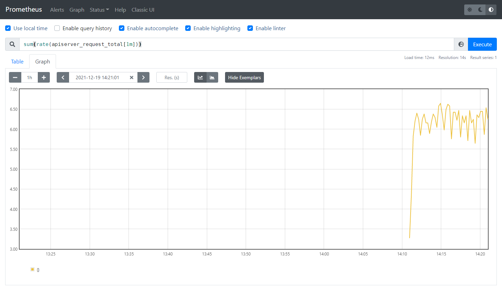


这样就完成了对 Kubernetes APIServer 的监控。另外如果要监控其他系统组件，⽐如 kube-controller-manager、kube-scheduler，由于 apiserver 服务 namespace 在 default 使⽤默认的 Service kubernetes，⽽其余组件服务在 kube-system 这个 namespace 下⾯，如果想要来监控这些组件的话，需要⼿动创建单独的 Service，其中 kube-sheduler 的指标数据端⼝为 10251，kube-controller-manager 对应的端⼝为 10252，可以配置这⼏个系统组件。(在版本为1.22.1-0的Kubernetes 官网文档中发现已被启用，暂时不清楚在哪个版本中被弃用)，详细如下:


kube-sheduler：https://kubernetes.io/zh/docs/reference/command-line-tools-reference/kube-scheduler/

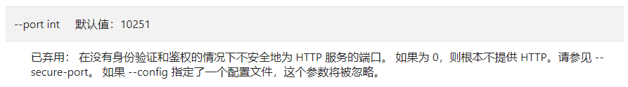

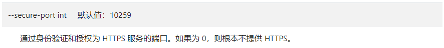


kube-controller-manager：https://kubernetes.io/zh/docs/reference/command-line-tools-reference/kube-controller-manager/

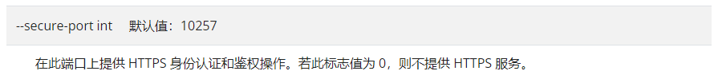


总结:不安全的HTTP服务端口被废弃，应该可以使用安全的HTTPS服务端口去获取数据


4.Service 的监控

上⾯的 apiserver 实际上是⼀种特殊的 Service，现在同样来配置⼀个任务⽤来专⻔发现普通类型 的 Service：

[prometheus-service.zip](attachments/E3254400199E42E48A077885EC131F50prometheus-service.zip)

```javascript
# prometheus-cm.yaml
//......
    # 监控普通类型的 Service
    - job_name: 'kubernetes-service-endpoints'
      kubernetes_sd_configs:
      - role: endpoints
      relabel_configs:
      - source_labels: [__meta_kubernetes_service_annotation_prometheus_io_scrape]
        action: keep
        regex: true
      - source_labels: [__meta_kubernetes_service_annotation_prometheus_io_scheme]
        action: replace
        target_label: __scheme__
        regex: (https?)
      - source_labels: [__meta_kubernetes_service_annotation_prometheus_io_path]
        action: replace
        target_label: __metrics_path__
        regex: (.+)
      - source_labels: [__address__, __meta_kubernetes_service_annotation_prometheus_io_port]
        action: replace
        target_label: __address__
        regex: ([^:]+)(?::\d+)?;(\d+)
        replacement: $1:$2
      - action: labelmap
        regex: __meta_kubernetes_service_label_(.+)
      - source_labels: [__meta_kubernetes_namespace]
        action: replace
        target_label: kubernetes_namespace
      - source_labels: [__meta_kubernetes_service_name]
        action: replace
        target_label: kubernetes_name 
//......
```

注意上面配置文件中在 relabel_configs 区域做了⼤量的配置，特别是第⼀个保留 __meta_kubernetes_service_annotation_prometheus_io_scrape 为 true 的才保留下来，这就是说要想⾃动发现集群中的 Service，那就需要在 Service 的 annotation 区域添加 prometheus.io/scrape=true 的声明，将上⾯的配置更新后查看到如下效果：

```javascript
// 更新配置,然后查看 Targets 路径
[root@centos7 57prometheus-k8sobject]# kubectl apply -f prometheus-cm.yaml 
configmap/prometheus-config configured

[root@centos7 57prometheus-k8sobject]# kubectl get svc -n kube-ops
NAME         TYPE        CLUSTER-IP      EXTERNAL-IP   PORT(S)                          AGE
prometheus   NodePort    10.106.78.77    <none>        9090:30216/TCP                   5d18h
......

[root@centos7 57prometheus-k8sobject]# curl -X POST "http://10.106.78.77:9090/-/reload"
```


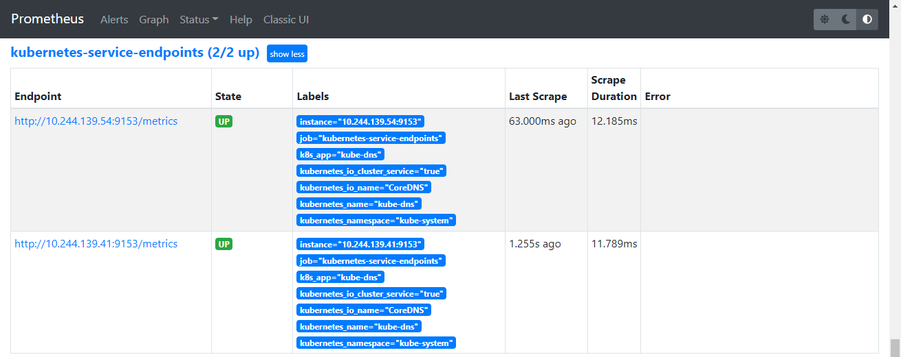

可以看到 kubernetes-service-endpoints 这一个Job下⾯只发现了二个服务，这是因为在 relabel_configs 中过滤了 annotation 有 prometheus.io/scrape=true 的 Service，⽽现在系统中只有这样二个服务符合要求，所以只出现了二个实例。


验证: 在之前创建的 redis 这个 Service 中添加上 prometheus.io/scrape=true 这个 annotation，由于 redis 服务的 metrics 接⼝在9121这个 redis-exporter 服务上⾯，所以还需要添加⼀ 个 prometheus.io/port=9121 这样的 annotations。

[prome-redis.yaml](attachments/9CB4EC239BD843F6B723380A55D7D13Fprome-redis.yaml)

```javascript
# prome-redis.yaml
apiVersion: apps/v1
kind: Deployment
metadata:
  name: redis
  namespace: kube-ops
spec:
  selector:
    matchLabels:
      app: redis
  template:
    metadata:
      annotations:
        prometheus.io/scrape: "true"
        prometheus.io/port: "9121"
      labels:
        app: redis
    spec:
      containers:
      - name: redis
        image: redis:6.2
        imagePullPolicy: IfNotPresent
        resources:
          requests:
            cpu: 100m
            memory: 100Mi
        ports:
        - containerPort: 6379
      - name: redis-exporter
        image: oliver006/redis_exporter:latest
        imagePullPolicy: IfNotPresent
        resources:
          requests:
            cpu: 100m
            memory: 100Mi
        ports:
        - containerPort: 9121
---
kind: Service
apiVersion: v1
metadata:
  name: redis
  namespace: kube-ops
  annotations:
    prometheus.io/scrape: "true"
    prometheus.io/port: "9121"
spec:
  selector:
    app: redis
  ports:
  - name: redis
    port: 6379
    targetPort: 6379
  - name: prom
    port: 9121
    targetPort: 9121
```


```javascript
// 更新 Service
[root@centos7 57prometheus-k8sobject]# kubectl apply -f prome-redis.yaml 
deployment.apps/redis unchanged
service/redis configured
```


更新完成后，在 Prometheus 中查看 Targets 路径，可以看到 redis 服务⾃动出现在了 kubernetesservice-endpoints 这个任务下⾯：

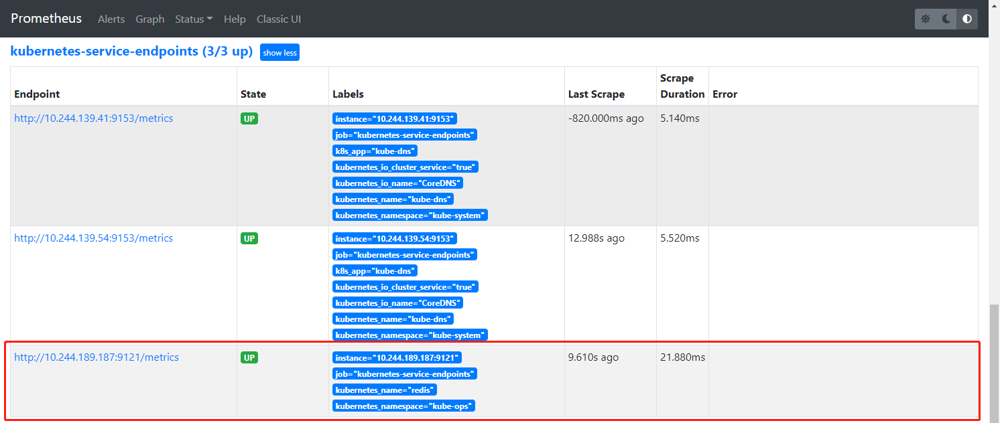


总结：这样以后有了新的服务，服务本身提供了 /metrics 接⼝，就完全不需要⽤静态的⽅式去配置了，到这⾥就可以将之前配置的 redis 的静态配置去掉。同样可以尝试去将之前配置的 traefik 服务⽤动态发现的⽅式重新配置到上⾯的 service-endpoints 中。同样的，可以配置⾃动发现 Pod、ingress 这些资源对象。


5. kube-state-metrics

上⾯配置了⾃动发现 Service (Pod也是⼀样的)的监控，但是这些监控数据都是应⽤内部的监控，需要应⽤本身提供⼀个 /metrics 接⼝，或者对应的 exporter 来暴露对应的指标数据，但是在k8s集群上 Pod、DaemonSet、Deployment、Job、CronJob 等各种资源对象的状态也需要监 控，这也反映了使⽤这些资源部署的应⽤的状态。但通过查看前⾯从集群中拉取的指标(这些指标主要 来⾃ apiserver 和 kubelet 中集成的 cAdvisor)，并没有具体的各种资源对象的状态指标。对于 Prometheus 来说，当然是需要引⼊新的 exporter 来暴露这些指标，Kubernetes 提供了⼀个 kube-state-metrics ，项目Github地址如下:

- https://github.com/kubernetes/kube-state-metrics

[kube-state-metrics.zip](attachments/6FDF5BAF026E42C3B70EC157033020E4kube-state-metrics.zip)

```javascript
// kube-state-metrics 已经给出了在 Kubernetes 部署的 manifest 定义⽂件,Github地址如下:
https://github.com/kubernetes/kube-state-metrics/tree/master/examples/standard

// 需要改两处地方
// 1. 在 deployment.yaml 文件中的 containers 节点下面加上如下配置:
    imagePullPolicy: IfNotPresent
// 2. 在 service.yaml 的 metadata 节点加上如下配置:
      annotations:
        prometheus.io/scrape: "true"
        
// 提前在node节点下载好 kube-state-metrics:v2.3.0 镜像,如下:
[root@centos7 57prometheus-k8sobject]# docker pull bitnami/kube-state-metrics:2.3.0
2.3.0: Pulling from bitnami/kube-state-metrics
0796bf144e3f: Pull complete 
......
docker.io/bitnami/kube-state-metrics:2.3.0
// 标记本地镜像,也可以在deployment中把镜像改为 bitnami/kube-state-metrics:2.3.0
[root@centos7 57prometheus-k8sobject]# docker tag bitnami/kube-state-metrics:2.3.0 k8s.gcr.io/kube-state-metrics/kube-state-metrics:v2.3.0
       
```


```javascript
[root@centos7 kube-state-metrics]# kubectl create -f .
clusterrolebinding.rbac.authorization.k8s.io/kube-state-metrics created
clusterrole.rbac.authorization.k8s.io/kube-state-metrics created
......

[root@centos7 kube-state-metrics]# kubectl get deployment -n kube-system
NAME                      READY   UP-TO-DATE   AVAILABLE   AGE
......
kube-state-metrics        0/1     1            0           50s

// 因为这个service是无头service,所以没有service ip
[root@centos7 kube-state-metrics]# kubectl get svc -n kube-system
NAME                 TYPE        CLUSTER-IP      EXTERNAL-IP   PORT(S)                                                       AGE
......
kube-state-metrics   ClusterIP   None            <none>        8080/TCP,8081/TCP                                             2m24s

[root@centos7 kube-state-metrics]# kubectl get pod -n kube-system -o wide
NAME                                       READY   STATUS    RESTARTS       AGE     IP               NODE             NOMINATED NODE   READINESS GATES
......
kube-state-metrics-58ff885bcd-b8rbr        1/1     Running   0              84s     10.244.189.148   centos7.node     <none>           <none>


// 因为这个service是无头service,所以没有service ip,但同样可以通过pod的ip访问到 /metrics 接口
// 可以看到有数据返回所以 kube-state-metrics 的 /metrics 接口访问成功
[root@centos7 kube-state-metrics]# curl 10.244.189.148:8080/metrics
......
kube_pod_status_phase{namespace="kube-ops",pod="prometheus-7785c6577b-68dtz",uid="82fc44a4-8db2-4681-a4f0-9c2c138ef43b",phase="Pending"} 0
kube_pod_status_phase{namespace="kube-ops",pod="prometheus-7785c6577b-68dtz",uid="82fc44a4-8db2-4681-a4f0-9c2c138ef43b",phase="Succeeded"} 0
......

[root@centos7 kube-state-metrics]# curl 10.244.189.148:8081/metrics
# HELP go_gc_duration_seconds A summary of the pause duration of garbage collection cycles.
# TYPE go_gc_duration_seconds summary
go_gc_duration_seconds{quantile="0"} 4.1161e-05
go_gc_duration_seconds{quantile="0.25"} 7.3772e-05
......
```


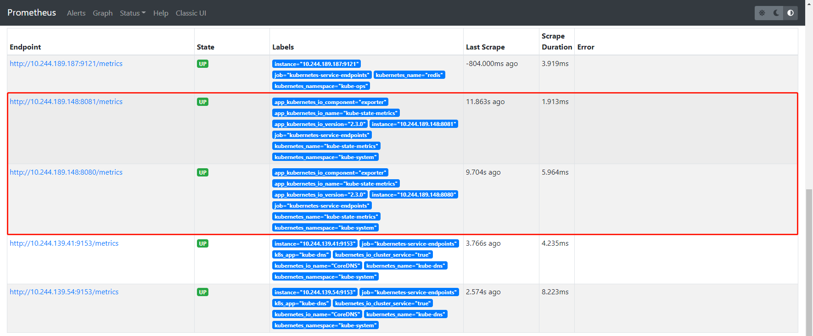


将 kube-state-metrics 部署到 k8s上之后，就会发现 k8s 集群中的 Prometheus 会在 kubernetes-service-endpoints 这个 job 下⾃动发现 kube-state-metrics 服务，并开始拉取 metrics，这是因为部署 kube-state-metrics 的 manifest 定义⽂件service.yaml 对 Service 的定义包含 prometheus.io/scrape: 'true' 这样的⼀个 annotation ，因此 kube-state-metrics 的 endpoint 可以被 Prometheus ⾃动服务发现。


关于 kube-state-metrics 暴露的所有监控指标可以参考 kube-state-metrics 的⽂档: https://github.com/kubernetes/kube-state-metrics/tree/master/docs


到这⾥就完成了 k8s 集群上部署应⽤的监控，接下来就是使⽤ Grafana 来展示这些监控数据。


参考资料:

浅谈 kubernetes 无头 service： https://blog.csdn.net/yy_diego/article/details/109144442

