1. Grafana

前⾯使⽤ Prometheus 采集了 Kubernetes 集群中的⼀些监控数据指标，也尝试使⽤ promQL 语句查询出⼀些数据，并且在 Prometheus 的 Dashboard 中进⾏了展示，但是明显可以感觉到 Prometheus 的图表功能相对较弱，所以⼀般情况下会使用第三⽅的⼯具来展示这些数 据，比如使⽤ grafana 。

grafana 是⼀个可视化⾯板，有着⾮常漂亮的图表和布局展示，功能⻬全的度量仪表盘和图形编辑器， ⽀持 Graphite、zabbix、InfluxDB、Prometheus、OpenTSDB、Elasticsearch 等作为数据源，⽐ Prometheus ⾃带的图表展示功能强⼤太多，更加灵活，有丰富的插件，功能更加强⼤。


2. 安装 Grafana

将 grafana 安装到 k8s 集群中，第⼀步同样是查看 grafana 的 docker 镜像介绍，可以在 dockerhub 上搜索，也可以在官⽹查看相关资料。

grafana 的 docker 镜像地址：https://hub.docker.com/r/grafana/grafana/

```javascript
// grafana 的 dockerhub 镜像主页可以看到运⾏ grafana 容器的命令⾮常简单
docker run -d --name=grafana -p 3000:3000 grafana/grafana
```


安装方式1: 带数据卷的方式

安装之前要看官方文档的更新介绍，要使用对应版本的 userid 和 groupid 否则可能导致权限问题。

```javascript
// 以下衔接查到grafana版本对应的userid 和 groupid,以及其它信息
https://grafana.com/docs/grafana/latest/installation/docker/#migrate-to-v51-or-later

// 这里使用 grafana/grafana:8.3.3 这个版本的镜像,对应的UserID为472, GroupID为0
```

[Grafana安装方式1.zip](attachments/A9650A46D4094965B82BD34CA744DB8CGrafana安装方式1.zip)

```javascript
# grafana-deploy.yaml
apiVersion: apps/v1
kind: Deployment
metadata:
  name: grafana
  namespace: kube-ops
  labels:
    app: grafana
spec:
  revisionHistoryLimit: 10
  selector:
    matchLabels:
      app: grafana
  template:
    metadata:
      labels:
        app: grafana
    spec:
      containers:
      - name: grafana
        image: grafana/grafana:8.3.3
        imagePullPolicy: IfNotPresent
        ports:
        - containerPort: 3000
          name: grafana
        env:
        - name: GF_SECURITY_ADMIN_USER
          value: admin
        - name: GF_SECURITY_ADMIN_PASSWORD
          value: admin321
        readinessProbe:
          failureThreshold: 10
          httpGet:
            path: /api/health
            port: 3000
            scheme: HTTP
          initialDelaySeconds: 60
          periodSeconds: 10
          successThreshold: 1
          timeoutSeconds: 30
        livenessProbe:
          failureThreshold: 3
          httpGet:
            path: /api/health
            port: 3000
            scheme: HTTP
          periodSeconds: 10
          successThreshold: 1
          timeoutSeconds: 1
        resources:
          limits:
            cpu: 100m
            memory: 256Mi
          requests:
            cpu: 100m
            memory: 256Mi
        volumeMounts:
        - mountPath: /var/lib/grafana
          subPath: grafana
          name: storage
      # 也可以不声明securityContext,因为grafana:8.3.3镜像的Dockerfile已经定义了UserID为472,GroupID为0
      securityContext:
        fsGroup: 0
        runAsUser: 472
      volumes:
      - name: storage
        persistentVolumeClaim:
          claimName: grafana
```

Deployment 中添加了监控检查、资源声明，GF_SECURITY_ADMIN_USER 和 GF_SECURITY_ADMIN_PASSWORD 是⽐较重要的环境变量 ，⽤来配置 grafana 的管理员⽤户和密码，由于 grafana 将 dashboard、插件这些数据保存在 /var/lib/grafana 这个⽬录下⾯，所以这⾥如果需要做数据持久化的话，就需要针对这个⽬录进⾏ volume 挂载声明，这里增加⼀个 securityContext 显示声明 grafana 容器运行时使用的userid 和 groupid ，由于 grafana:8.3.3镜像的 Dockerfile 已经定义了UserID为472, GroupID为0，所以也可以不用再去显示声明 securityContext 。grafana:8.3.3 镜像定义可以从以下衔接查看:

```javascript
https://hub.docker.com/layers/grafana/grafana/8.3.3/images/sha256-3c22852b378a4ca095ad966e655ed5c403f8182f8b59559580be3d698d6aa56a?context=explore
```


因为要使⽤⼀个 pvc 对象来持久化数据，就需要添加⼀个可⽤的 pv 供 pvc 绑定使⽤，如下:

```javascript
# grafana-volume.yaml
apiVersion: v1
kind: PersistentVolume
metadata:
  name: grafana
spec:
  capacity:
    storage: 1Gi
  accessModes:
  - ReadWriteOnce
  persistentVolumeReclaimPolicy: Recycle
  nfs:
    server: 192.168.32.100
    path: /data/k8s
---
apiVersion: v1
kind: PersistentVolumeClaim
metadata:
  name: grafana
  namespace: kube-ops
spec:
  accessModes:
  - ReadWriteOnce
  resources:
    requests:
      storage: 1Gi
```


对外暴露 grafana 服务，所以需要⼀个对应的 Service 对象，⽤ NodePort 或者再建⽴⼀个 ingress 对象都可以:

```javascript
# grafana-service.yaml
apiVersion: v1
kind: Service
metadata:
  name: grafana
  namespace: kube-ops
  labels:
    app: grafana
spec:
  type: NodePort
  ports:
    - port: 3000
  selector:
    app: grafana
    
```


创建上⾯这些资源对象:

```javascript
// 拉取镜像在node节点执行
[root@centos7 ~]# docker pull grafana/grafana:8.3.3
8.3.3: Pulling from grafana/grafana
97518928ae5f: Downloading 
......
docker.io/grafana/grafana:8.3.3

[root@centos7 58Grafana]# kubectl create -f grafana-volume.yaml 
persistentvolume/grafana created
persistentvolumeclaim/grafana created
[root@centos7 58Grafana]# kubectl create -f grafana-deploy.yaml
deployment.apps/grafana created
[root@centos7 58Grafana]# kubectl create -f  grafana-service.yaml 
service/grafana created

// pod异常,状态是 CrashLoopBackOff
[root@centos7 58Grafana]# kubectl get pod -n kube-ops
NAME                          READY   STATUS             RESTARTS      AGE
grafana-548b8db7d5-kfkcn      0/1     CrashLoopBackOff   3 (8s ago)    54s
//......

[root@centos7 58Grafana]# kubectl describe pod grafana-548b8db7d5-kfkcn -n kube-ops
// ......
Events:
  Type     Reason            Age                    From               Message
  ----     ------            ----                   ----               -------
  Warning  FailedScheduling  2m42s                  default-scheduler  0/2 nodes are available: 2 persistentvolumeclaim "grafana" not found.
  //......
  Warning  BackOff           60s (x13 over 2m27s)   kubelet            Back-off restarting failed container

// 查看 Pod 的⽇志
[root@centos7 58Grafana]# kubectl logs -f grafana-548b8db7d5-kfkcn -n kube-ops
GF_PATHS_DATA='/var/lib/grafana' is not writable.
You may have issues with file permissions, more information here: http://docs.grafana.org/installation/docker/#migrate-to-v51-or-later
mkdir: can't create directory '/var/lib/grafana/plugins': Permission denied

// 可以看到⽇志中错误很明显, 就是 /var/lib/grafana ⽬录的权限问题
// 原因是将⽬录 /var/lib/grafana 挂载到pvc, 这边的⽬录拥有者并不是grafana(472)这个⽤户
// 解决方法是更改这个⽬录的所属⽤户
```


利⽤⼀个 Job 任务去更改 /var/lib/grafana 该⽬录（数据卷中的这个目录）的所属⽤户，下面利⽤⼀个 busybox 镜像将 /var/lib/grafana ⽬录的拥有者(user)更改为 472 以及所属群组(group) 改为 0 ，要注意的是下⾯的 volumeMounts 和 volumes 需要和上⾯的 Deployment 对应上。

```javascript
# grafana-chown-job.yaml
apiVersion: batch/v1
kind: Job
metadata:
  name: grafana-chown
  namespace: kube-ops
spec:
  template:
    spec:
      restartPolicy: Never
      containers:
      - name: grafana-chown
        command: ["chown", "-R", "472:0", "/var/lib/grafana"]
        image: busybox
        imagePullPolicy: IfNotPresent
        volumeMounts:
        - name: storage
          subPath: grafana
          mountPath: /var/lib/grafana
      volumes:
      - name: storage
        persistentVolumeClaim:
          claimName: grafana
```


```javascript
// 创建job
[root@centos7 58Grafana]# kubectl create -f grafana-chown-job.yaml 
job.batch/grafana-chown created

// 状态为Completed的Pod就是⽤来更改grafana⽬录权限的Pod,这是⼀个Job任务,执⾏成功后退出,状态变为Completed
// 可以看到pod的状态已经是Running
[root@centos7 58Grafana]# kubectl get pod -n kube-ops | grep grafana
grafana-548b8db7d5-kfkcn      1/1     Running     5 (2m56s ago)   4m26s
grafana-chown--1-2jj67        0/1     Completed   0               92s

// 从⽇志信息可以看出 grafana 的 Pod 已经正常启动
[root@centos7 k8s]# kubectl logs -f grafana-548b8db7d5-kfkcn -n kube-ops
//......
t=2021-12-20T13:48:35+0000 lvl=info msg="Request Completed" logger=context userId=0 orgId=0 uname= method=GET path=/favicon.ico status=302 remote_addr=192.168.32.101 time_ms=0 size=29 referer=http://192.168.32.101:31281/login

// 删除job
[root@centos7 58Grafana]# kubectl delete -f grafana-chown-job.yaml 
job.batch "grafana-chown" deleted

[root@centos7 k8s]# kubectl get svc -n kube-ops | grep grafana
grafana      NodePort    10.99.68.150    <none>        3000:31281/TCP                   124m


// 这时可以通过以下两个地址从浏览器访问到 grafana 服务
    http://192.168.32.100:31281/login
    http://192.168.32.101:31281/login
```


安装方式2: 不使用数据卷（不推荐）

这种方式容器重启后 grafana 的  dashboard、插件这些数据 就没有了,因为不使用数据卷，grafana的数据就不能做持久化操作。

[Grafana安装方式2.zip](attachments/7E52A226EFD84BB8BAB0A31FB2099F18Grafana安装方式2.zip)


3. 使用 Grafana


3.1  登录

由于配置了管理员，第⼀次打开的时候会跳转到登录界⾯，然后就可以⽤上⾯配置的两个环境变量的值进⾏登录，登录后就可以进⼊到 Grafana 的⾸⻚


3.2 配置

3.2.1 添加数据源

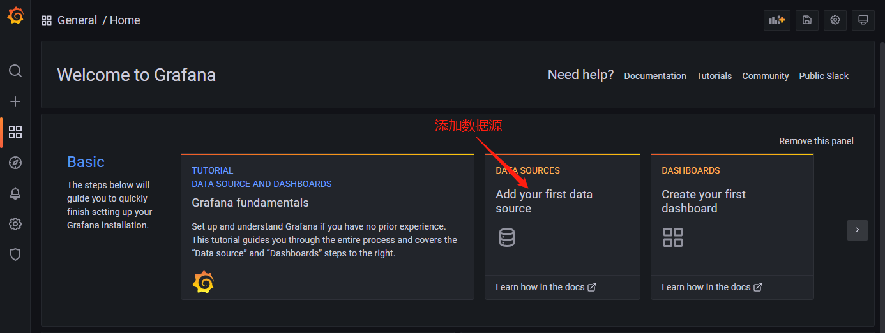


3.2.2 这个地⽅配置的数据源是 Prometheus，所以选择 Prometheus,进入到如下配置界面.

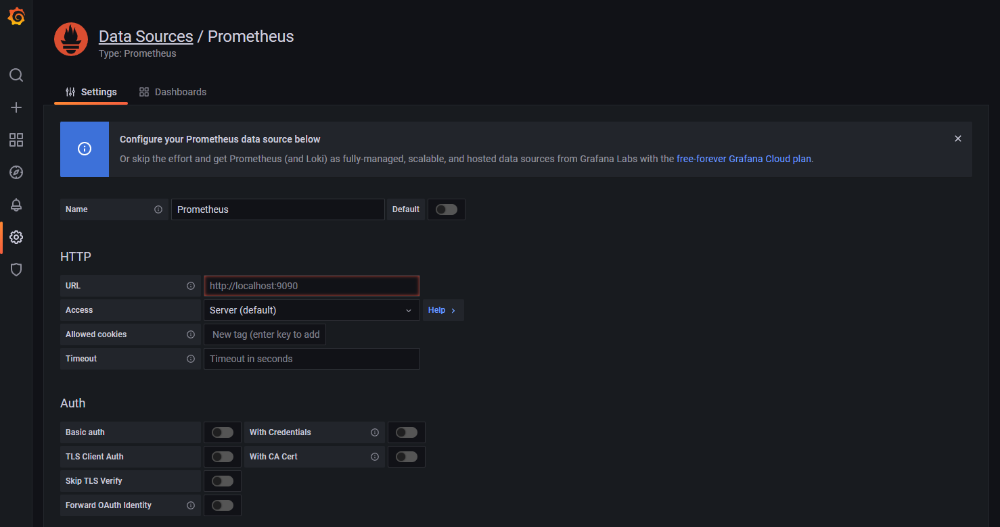

给改数据源添加 name，例如 prometheus-ds，也可以保持默认。HTTP 区域是配置数据源的访问模式，访问模式是⽤来控制如何处理对数据源的请求，所以这里是最主要的：

- 服务器(Server)访问模式（默认）：所有请求都将从浏览器发送到 Grafana 后端的服务器，后者⼜将请求转发到数据源，通过这种⽅式可以避免⼀些跨域问题，其实就是在 Grafana 后端做了⼀次 转发，需要从Grafana 后端服务器访问该 URL。

- 浏览器(Browser)访问模式：所有请求都将从浏览器直接发送到数据源，但是有可能会有⼀些跨域 的限制，使⽤此访问模式，需要从浏览器直接访问该 URL。


由于当前这里 Prometheus 是通过 NodePort 的⽅式对外暴露服务，所以可以使⽤浏览器访问模式直接访问 Prometheus 的外⽹地址，但是这种⽅式显然不是最好的，因为相当于⾛的是外⽹，当前这⾥ Prometheus 和 Grafana 都处于  kube-ops 这个 namespace 下⾯，这样在集群内部直接通过 DNS 的形式就可以访问，⽽且还都是⾛的内⽹流量，所以这⾥⽤服务器访问模式显然更好，所以设置数据源地址为 http://prometheus:9090 （因为在同⼀个 namespace 下⾯所以直接⽤ Service 名称就行），然后其他的配置信息就根据实际情况，⽐如 Auth 认证这⾥没有，就直接跳过即可，点击最下⽅的 Save & Test， 如果提示"Datasource updated"就说明数据源配置正确。


3.3 添加 Dashboard

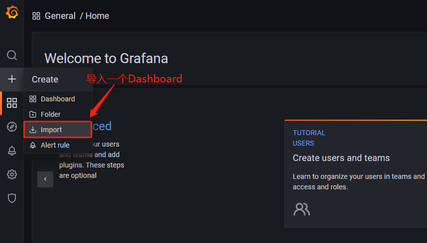


可以将编号 162 的 dashboard 下载到本地，然后这⾥重新上传即可，也可以在⽂本框中直接输⼊ 162 编号回⻋即可。

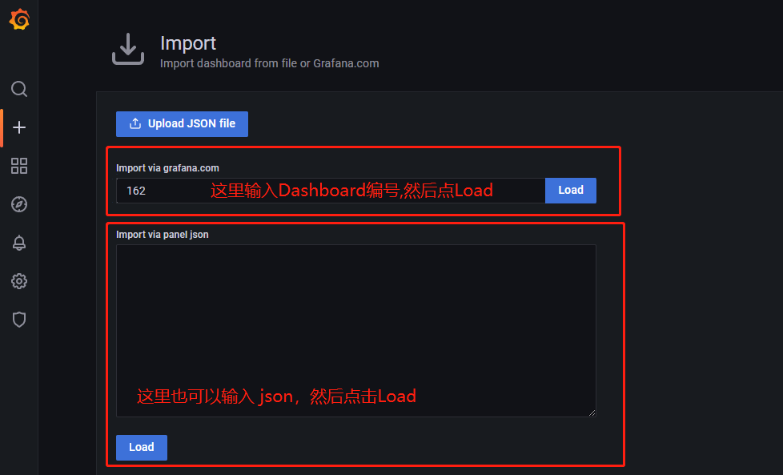


需要注意的是在导入这个 dashboard 之前要选择名为 Prometheus 的这个数据源，然后执⾏ import 操作，就可以进⼊到 dashboard ⻚⾯。

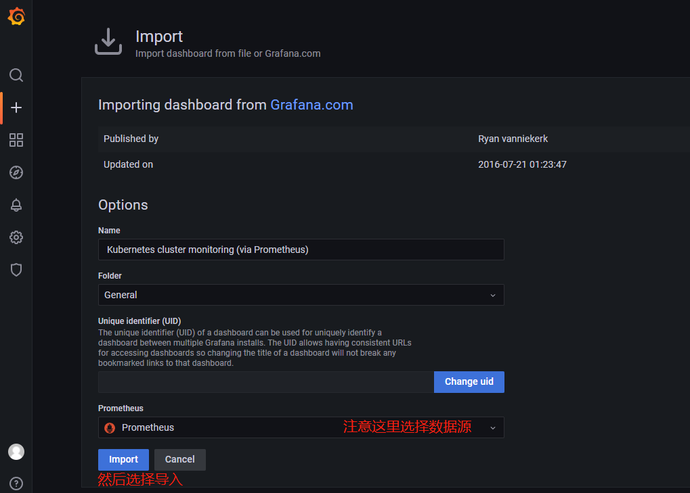


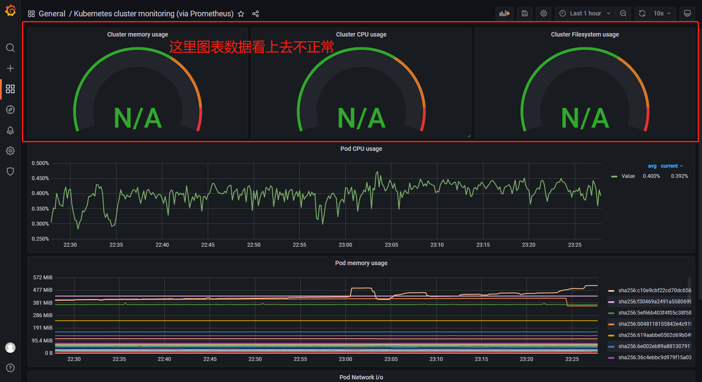


可以看到 dashboard ⻚⾯上出现了很多漂亮的图表，但是看上去数据不正常，这是因为这个 dashboard ⾥⾯需要的数据指标名称和 Prometheus ⾥⾯采集到的数据指标不⼀致造成的，⽐如第⼀个 Cluster memory usage(集群内存使⽤情况) ，我们可以点击标题 -> Edit，进⼊编辑这个图表

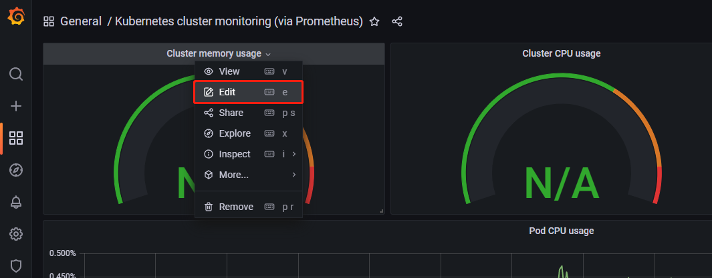


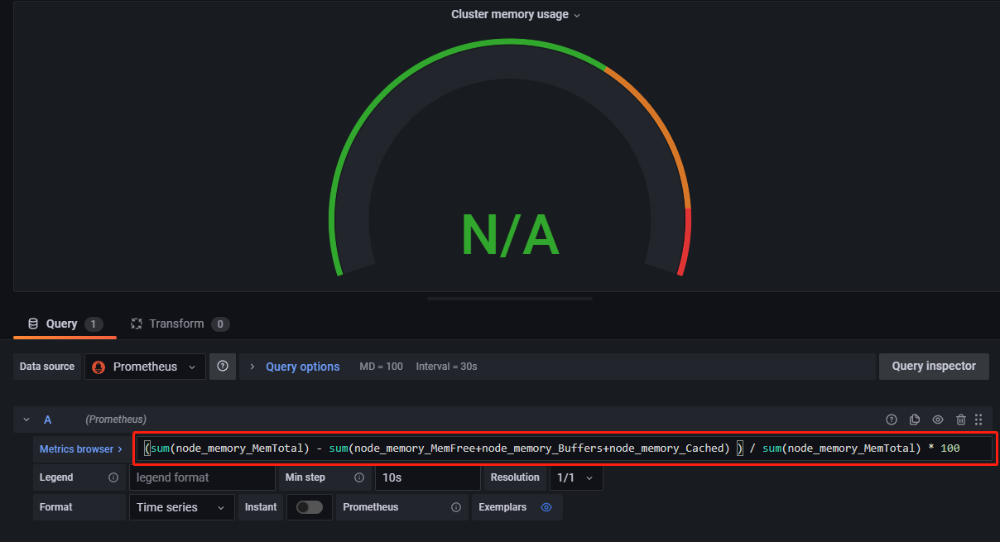


```javascript
进⼊编辑⻚⾯就可以看到这个图表的查询语句：
(sum(node_memory_MemTotal) - sum(node_memory_MemFree+node_memory_Buffers+node_memory_Cache d) ) / sum(node_memory_MemTotal) * 100
```

这就是之前在 Prometheus ⾥⾯查询的 promQL 语句，可以将上⾯的查询语句复制到 Prometheus 的 Graph ⻚⾯进⾏查询，其实可以预想到没有对应的数据，因为⽤ node_exporter 采集到的数据指标不是 node_memory_MemTotal 关键字，⽽是 node_memory_MemTotal_bytes ，将上⾯的 promQL 语句做相应的更改，如下:

```javascript
// 这个语句意思是：(整个集群的内存-(整个集群剩余的内存以及Buffer和Cached))/整个集群的内存
// 简单来说就是总的集群内存使⽤百分⽐。将grafana 默认的 promQL 语句替换掉,就可以看到图表正常了
(sum(node_memory_MemTotal_bytes) - sum(node_memory_MemFree_bytes + node_memory_Buffers_bytes+node_memory_Cached_bytes)) / sum(node_memory_MemTotal_bytes) * 100

// 同样的方式可以更改 Cluster CPU usage 和 Cluster Filesystem usage 的使⽤率
// Cluster CPU usage
sum(sum by (kubernetes_io_hostname)( rate(container_cpu_usage_seconds_total{image!=""}[1m] ) )) / count(node_cpu_seconds_total{mode="system"}) * 100
// Cluster Filesystem usage
(sum(node_filesystem_files) - sum(node_filesystem_files_free) ) / sum(node_filesystem_files) * 100

// 下⾯的 Pod CPU Usage ⽤来展示 Pod CPU 的使⽤情况,对应的 promQL 语句如下,根据pod 来进⾏统计
// 按照上⾯的⽅法替换 grafana 中的 dashboard 图表中的查询语句
sum by (pod)(rate(container_cpu_usage_seconds_total{image!="", pod!=""}[1m]))

// Pod Network i/o
sort_desc(sum by (pod) (rate (container_network_receive_bytes_total{name!="", pod!=""}[1m]) ))
```


其他图标按照实际需求重新编辑即可，下图是最终整个 dashboard 的效果图：

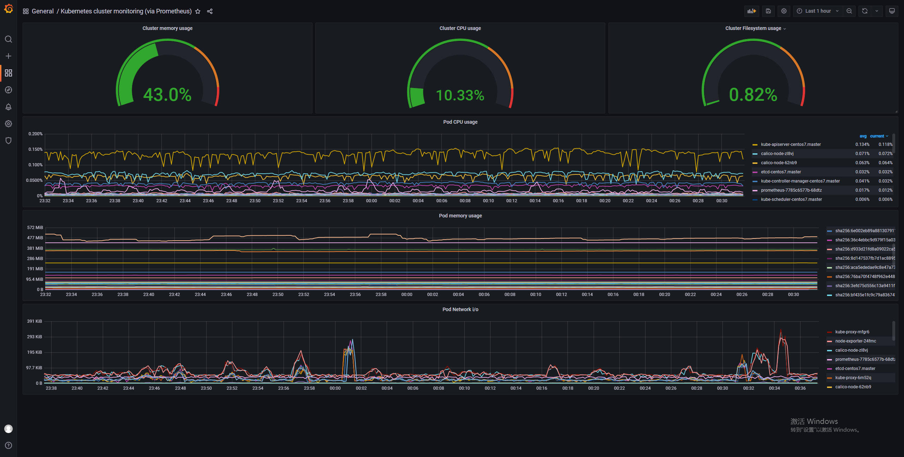


3.4 导出 Dashboard

最后要记得保存这个 dashboard，这个 dashboard 也可以被导出成一个 json 文件，可以留着备份，也可以分享给其它人，使用时直接导入到 grafana 当中即可：

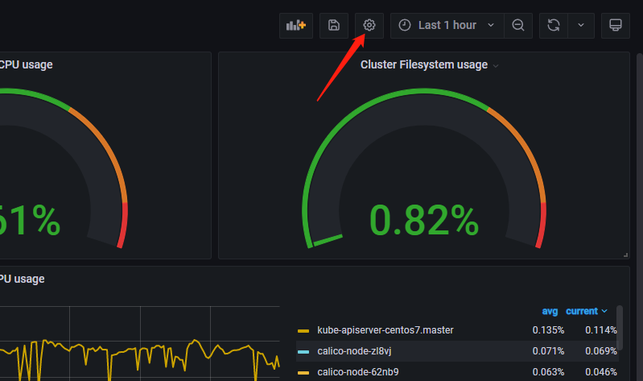


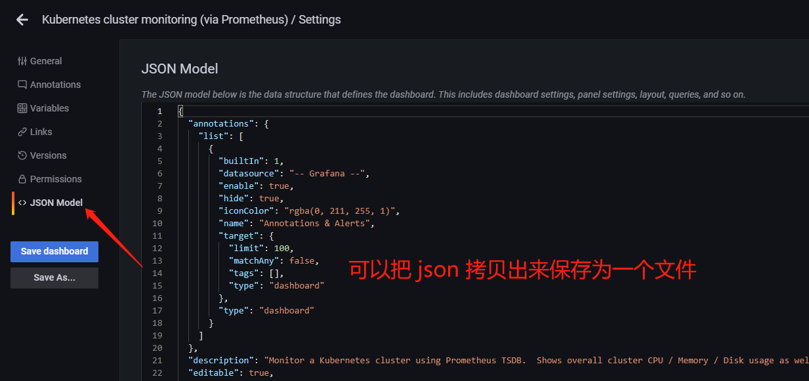


[grafana-dashboard.json](attachments/50DBE7BFD0F441C09263911D1FED3931grafana-dashboard.json)


除此之外，也可以前往 grafana dashboard 的⻚⾯去搜索其他的关于 k8s 的监控⻚⾯，地址：https://grafana.com/dashboards，⽐如 id 为 747 和 741 的这两个 dashboard。


这就是 grafana 的 dashboard 功能的使⽤，还可以进⾏⼀些其他的系统管理操作，⽐如添加⽤户，为⽤户添加权限等等。

