1. 插件

grafana 支持安装插件，插件安装有以下的三种方式:

- 方式1: 进入到 grafana 容器中使用 grafana-cli 命令进行安装

- 方式2: 手动下载 .zip 文件并将其解压到 grafana 插件目录中。

- 方式3: 直接在 grafana 的  plugins 页面搜索并安装插件。


1.1 安装 DevOpsProdigy KubeGraf 插件

DevOpsProdigy KubeGraf 是一款专门针对 Kubernetes 集群监控的插件。

- DevOpsProdigy KubeGraf 是 grafana-kubernetes-app的升级版。

- 安装 DevOpsProdigy KubeGraf 之前要先安装 grafana-piechart-panel 插件。


插件下载、安装和使用的方法:

- https://grafana.com/grafana/plugins/grafana-piechart-panel/

- https://grafana.com/grafana/plugins/devopsprodigy-kubegraf-app/


安装过程以及步骤:

```javascript
kubectl exec grafana-548b8db7d5-th6xd -n kube-ops -it  -- /bin/bash

// 执⾏安装命令(使用 grafana-cli 命令)
grafana-cli plugins install grafana-piechart-panel
grafana-cli plugins install devopsprodigy-kubegraf-app

// 安装完成后需要重启 grafana 才会⽣效

// 回到grafana⻚⾯,切换到plugins⻚⾯找到 DevOpsProdigy KubeGraf 插件

// 点击 DevOpsProdigy KubeGraf 插件到新页面后点击"enable"

```


安装后点击插件出现404，原因未知！


2. 报警

grafana 4 版本以上就⽀持报警功能，这使得利⽤ grafana 作为监控⾯板更为完整，因为报警是监控系统中必不可少的环节，grafana ⽀持很多种形式的报警功能，⽐如 email、钉钉、slack、 webhook 等等，这⾥来测试 email 和钉钉。


2.1 email 报警

要启⽤ email 报警需要在启动配置⽂件 /etc/grafana/grafan.ini 中开启 SMTP 服务，这⾥同样利⽤ ConfigMap 资源对象挂载到 grafana Pod 中。

[Grafana-Alert.zip](attachments/858E8BCA65D14E8087D09F709F320306Grafana-Alert.zip)

```javascript
# grafana-cm.yaml 文件中配置了 163 邮箱, 并开启报警功能
apiVersion: v1
kind: ConfigMap
metadata:
  name: grafana-config
  namespace: kube-ops
data:
  grafana.ini: |
    [server]
    root_url = http://192.168.32.100:31281
    [smtp]
    enabled = true
    host = smtp.163.com:25
    user = kkk_en@163.com
    password = WZOGCXPPOPOSQWMJ
    skip_verify = true
    from_address = kkk_en@163.com
    [alerting]
    enabled = true
    execute_alerts = true
```


```javascript
# 添加如下配置到 grafana-deploy.yaml, 将 ConfigMap ⽂件挂载到 Pod 中
....
        volumeMounts:
        - mountPath: "/etc/grafana"
          name: config
      volumes:
      - name: config
        configMap:
          name: grafana-config
.... 
```


```javascript
[root@centos7 59grafana-alert]# kubectl create -f grafana-cm.yaml 
configmap/grafana-config created

// 更新 Deployment
[root@centos7 59grafana-alert]# kubectl apply -f grafana-deploy.yaml 
......
deployment.apps/grafana configured

[root@centos7 59grafana-alert]# kubectl get pod -n kube-ops
NAME                          READY   STATUS    RESTARTS       AGE
grafana-548b8db7d5-pprjm      1/1     Running   0              10m
......

// 重启 pod
[root@centos7 59grafana-alert]# kubectl delete pod grafana-548b8db7d5-pprjm -n kube-ops
pod "grafana-548b8db7d5-pprjm" deleted
```


测试:

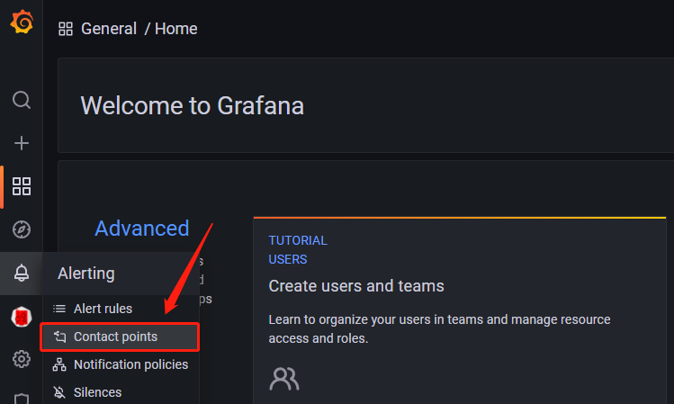


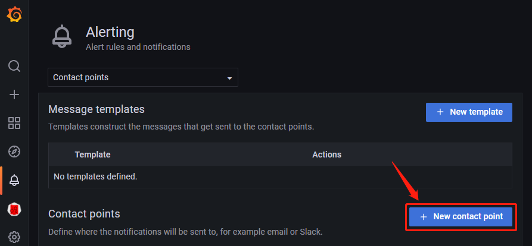


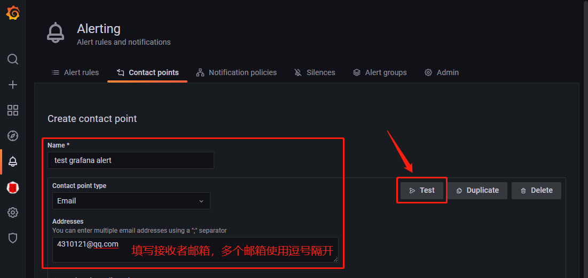


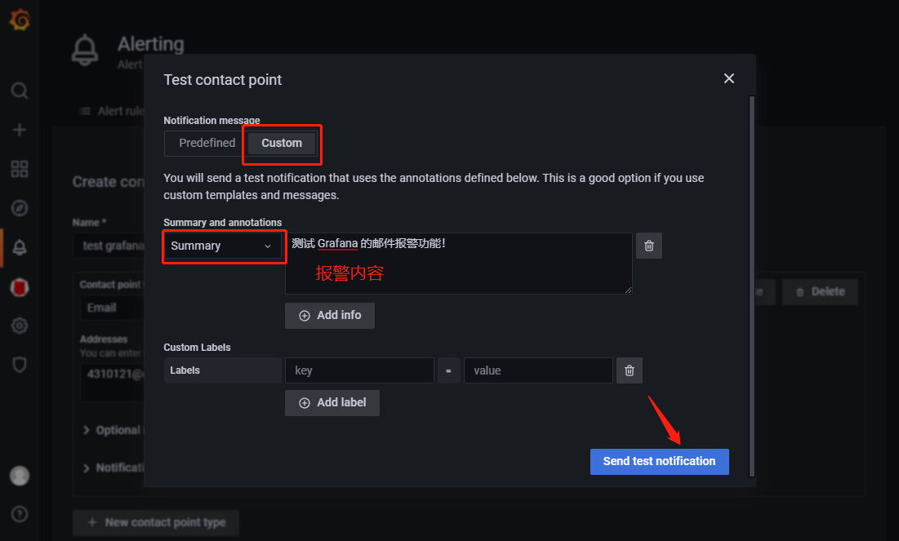


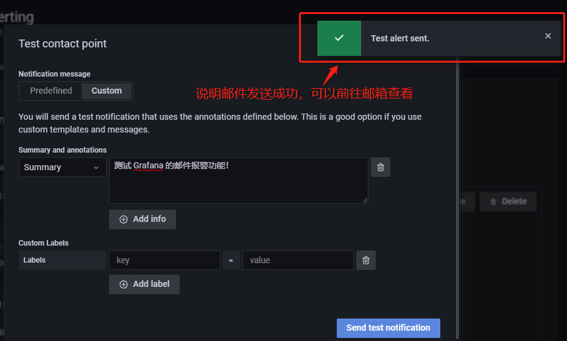


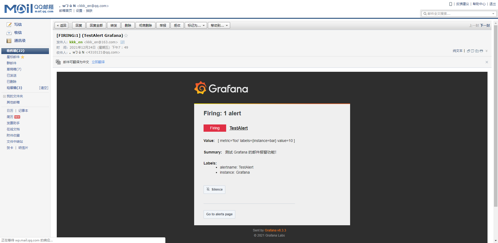


2.2  钉钉报警

grafana 也⽀持钉钉报警，在钉钉群⾥⾯添加群机器⼈, 选择最后的⾃定义机器⼈。添加完成后可以得到⼀个 Webhook 的地址，然后将这个 Webhook 地址添加到下⾯ grafana WebUI 的报警测试⻚⾯进⾏测试，就可以在钉钉群⾥⾯收到报警测试信息。


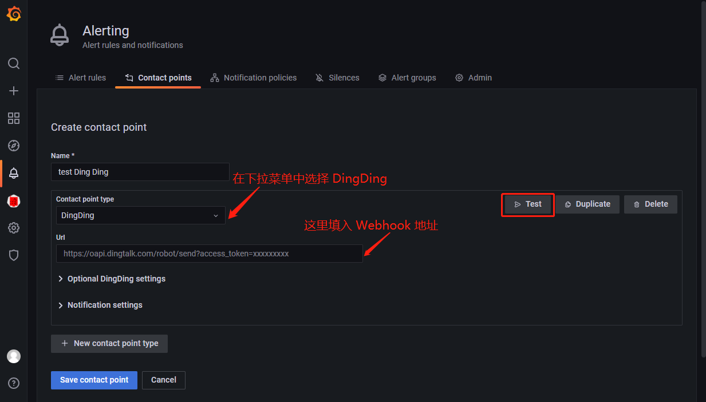


3. 配置

⽬前只有 Graph ⽀持报警功能，所以选择 Graph 相关图表，点击编辑，进⼊ Graph 编辑⻚⾯可以看到有⼀个 Alert 模块

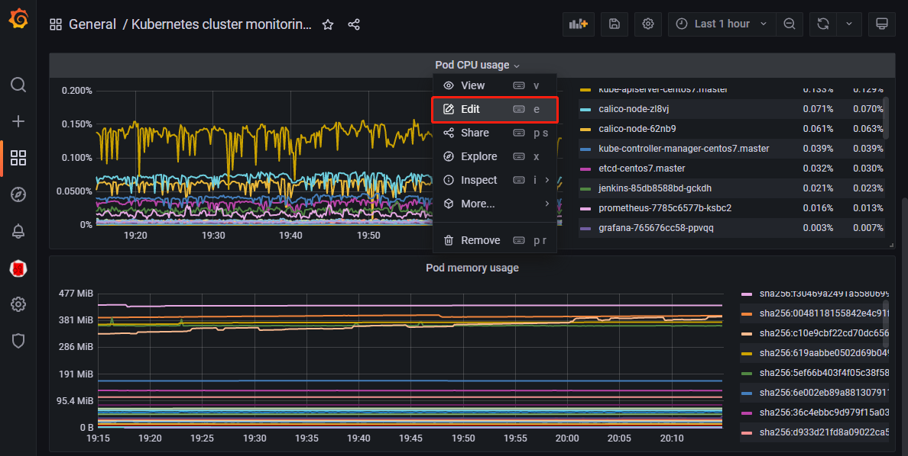


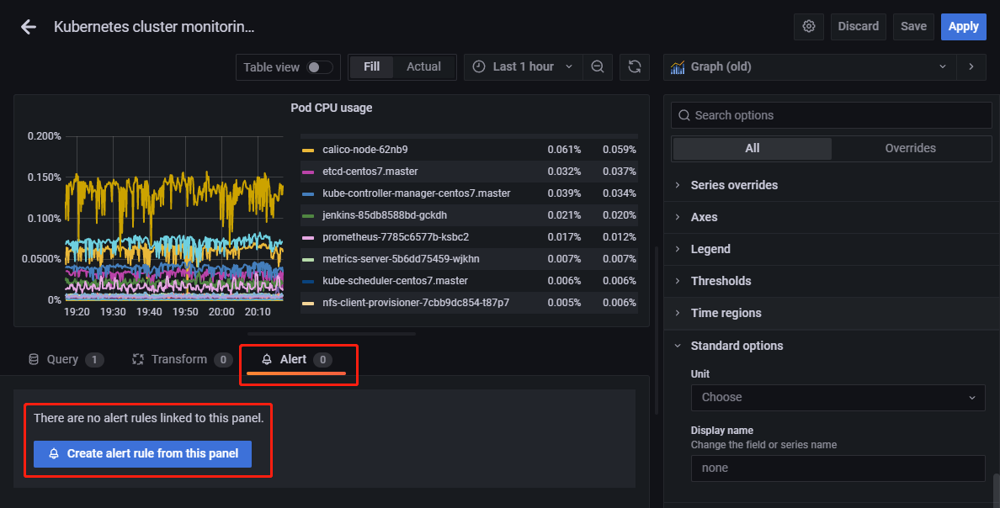


3.1 创建 Alert rules

进入到 Alert rules 编辑页面，有4个部分需要配置

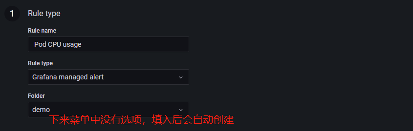


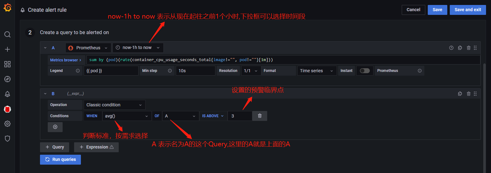


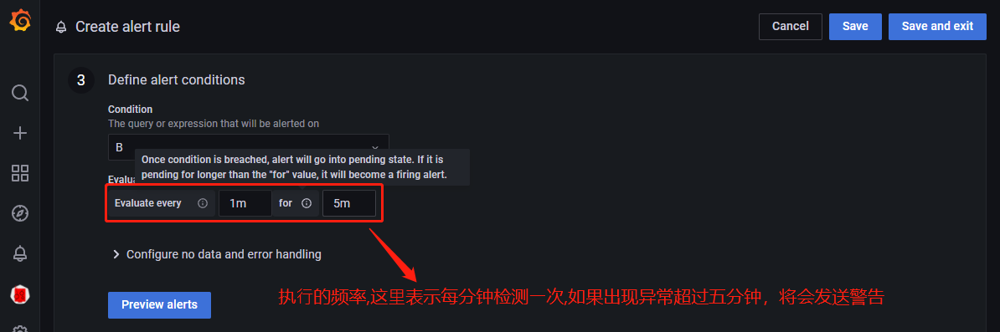


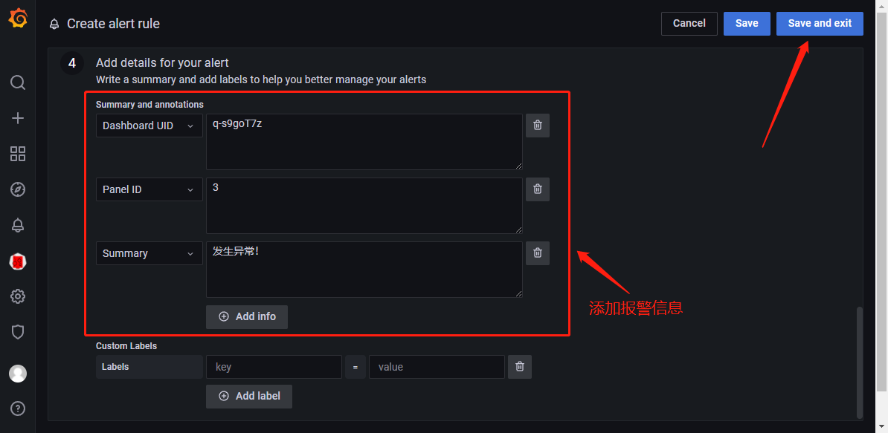


3.2 把 Alert rules 和Alert 绑定

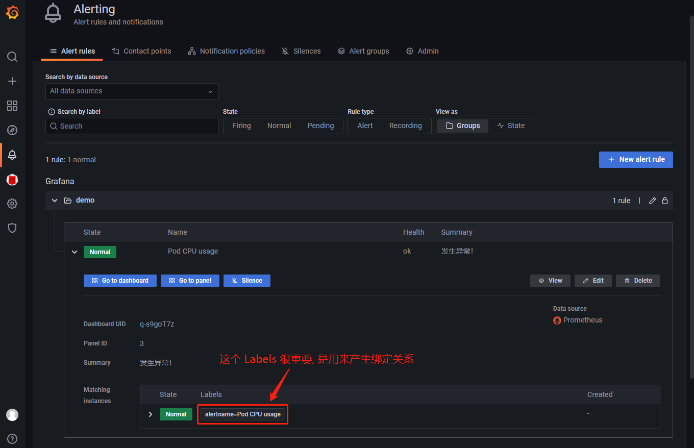


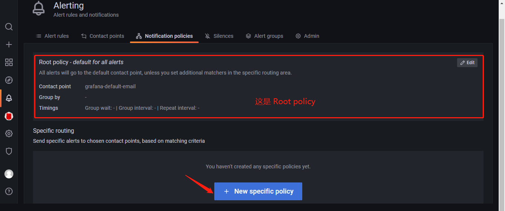


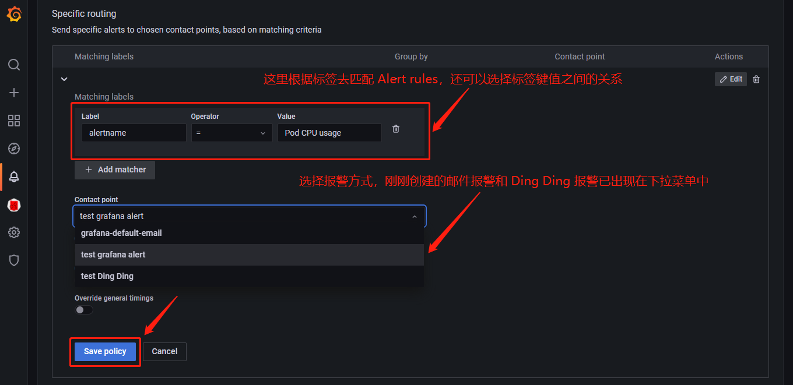


3.3 把 Alert rules 和 silence 绑定（silence 是用来定义某个时间段不报警）

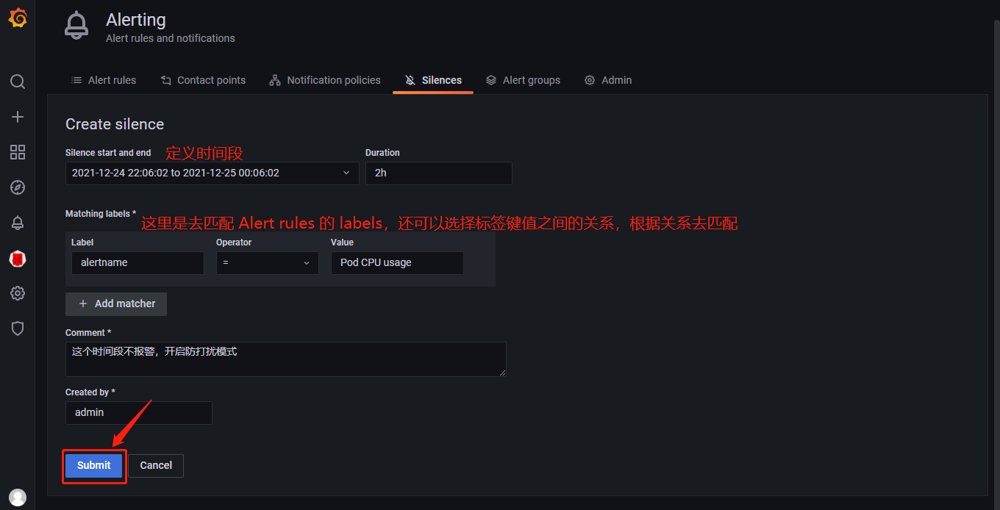


到这⾥就完成了使⽤ grafana 来展示 Kubernetes 集群的监控图表信息以及报警配置，但是明显可以感觉到 grafana 的优势在于图表的展示，报警功能有点弱，所以⼀般来说，在⽣产环境不会直接使⽤ grafana 的报警功能，更多的是使⽤功能更加强⼤的 AlertManager。

