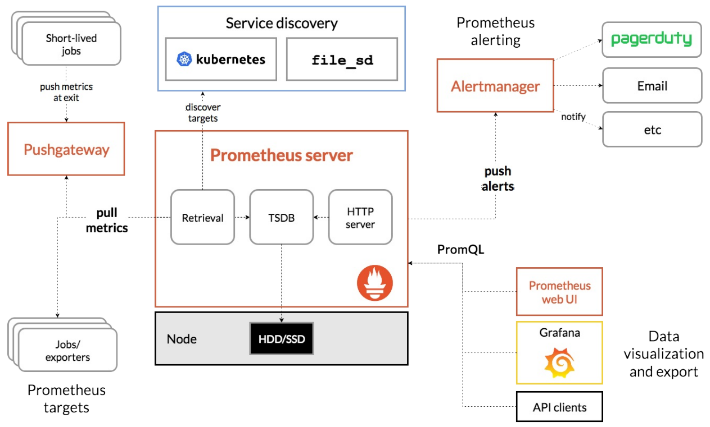
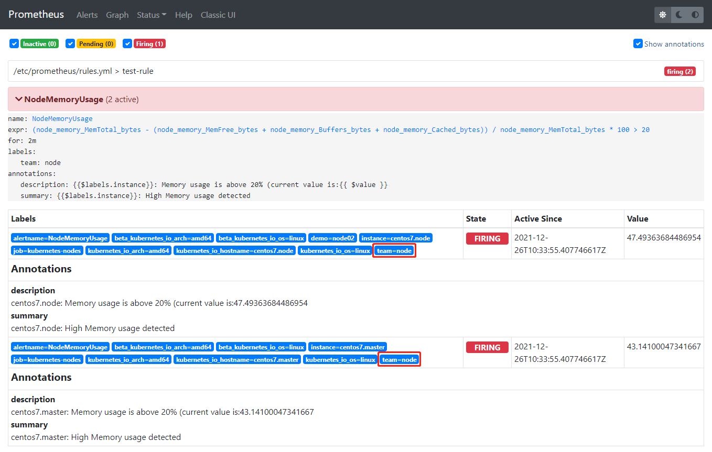
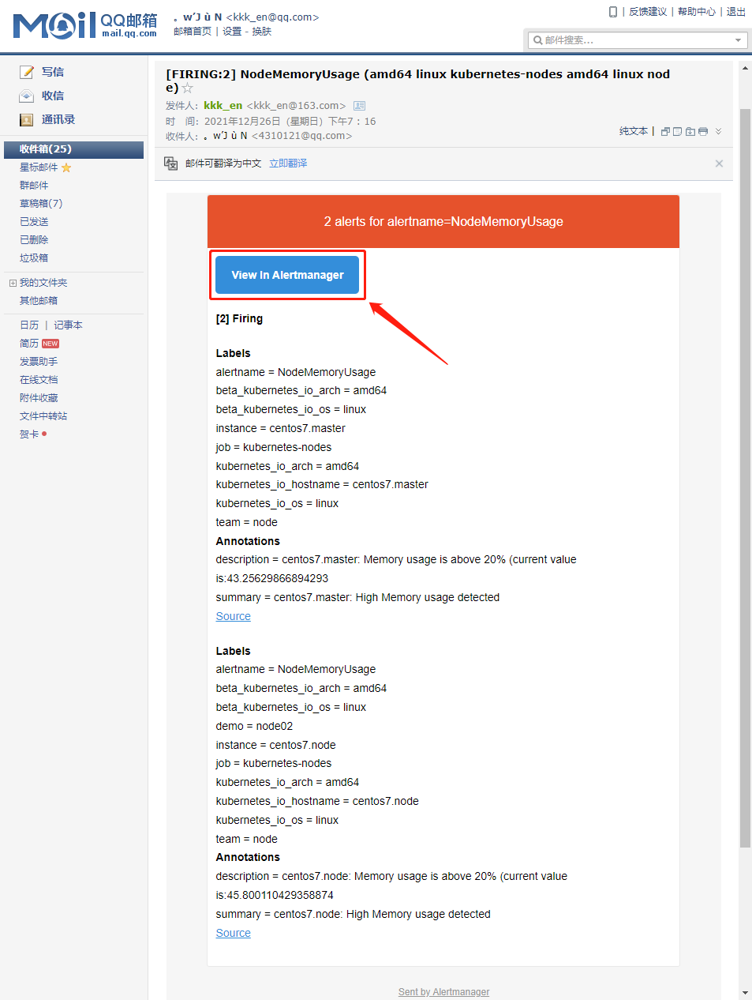
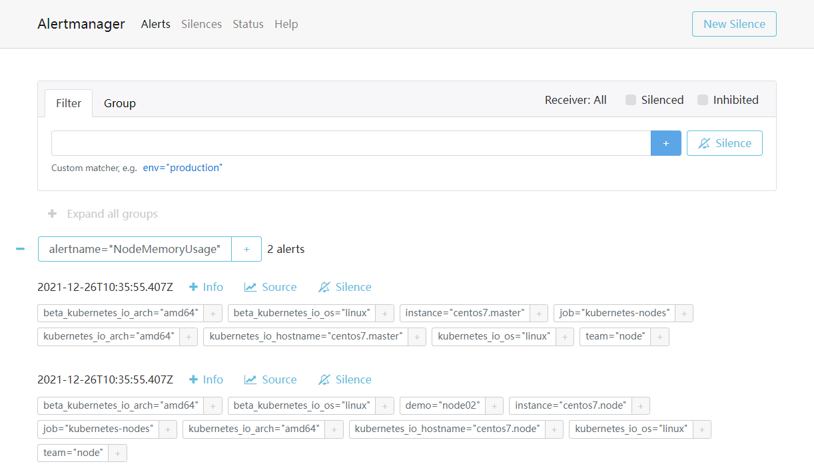
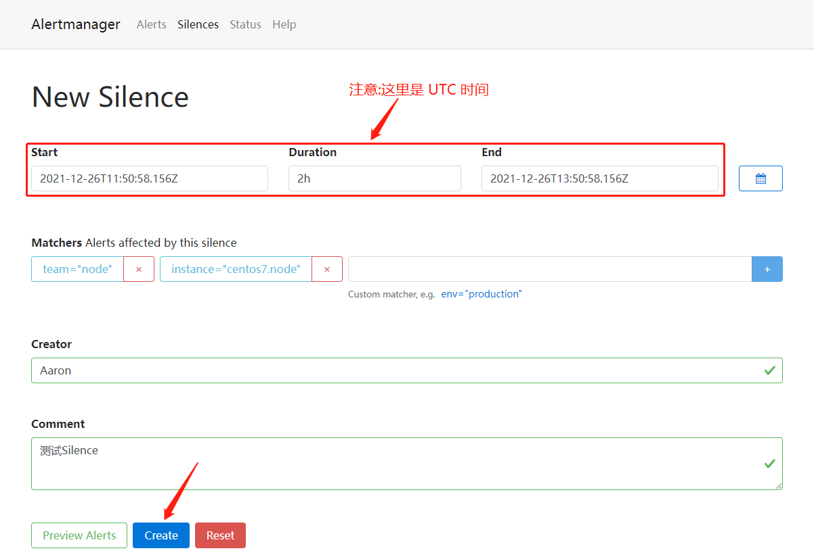
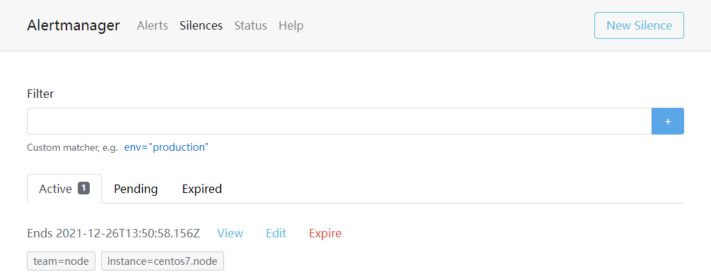
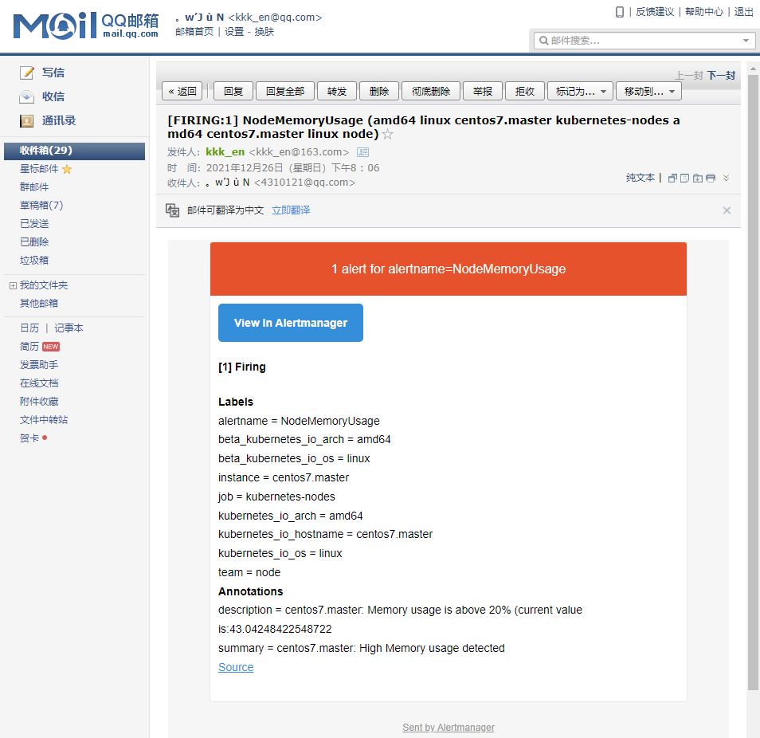

1. 简介

Grafana 的报警能⽬前还⽐较弱，只⽀持 Graph 的图表的报警。AlertManager 是⼀个功能更加强⼤的报警⼯具。

AlertManager 是 Prometheus 中的⼀个报警模块，Alertmanager 主要⽤于接收 Prometheus 发送的告警信息，它⽀持丰富的告警通知渠道，⽽且很容易做到告警信息进⾏去重，降噪，分组等，是⼀款前卫的告警通知系统。




官网：https://prometheus.io/docs/alerting/latest/configuration/


AlertManager 有两种安装方式:

- 下载 AlertManager ⼆进制⽂件后，通过下⾯的命令运⾏：

```javascript
// -config.file 参数是⽤来指定对应的配置⽂件
./alertmanager --config.file=alertmanager.yml
```

- 使⽤ docker 镜像的⽅式来安装


2. 安装 AlertManager（由于这⾥同样要运⾏到 Kubernetes 集群中，所以使⽤ docker 镜像的⽅式安装） 

```javascript
https://prometheus.io/download/#alertmanager
https://prometheus.io/docs/alerting/latest/alertmanager/
https://github.com/prometheus/alertmanager
https://hub.docker.com/r/prom/alertmanager/tags?page=1&ordering=last_updated
```

[AlertManager.zip](attachments/8B61B3B6C2D3436D8AC0AA7FD9FFC910AlertManager.zip)


第一步:创建 ConfigMap 资源对象，这是 AlertManager 的配置⽂件

```javascript
# alertmanager-conf.yaml
apiVersion: v1
kind: ConfigMap
metadata:
  name: alert-config
  namespace: kube-ops
data:
  alertmanager.yml: |-
    global:
      # 在没有报警的情况下声明为已解决的时间
      resolve_timeout: 5m
      # 配置邮件发送信息
      smtp_smarthost: 'smtp.163.com:25'
      smtp_from: 'kkk_en@163.com'
      smtp_auth_username: 'kkk_en@163.com'
      smtp_auth_password: 'WZOGCXPPOPOSQWMJ'
      smtp_hello: '163.com'
      smtp_require_tls: false
    # 所有报警信息进⼊后的根路由，⽤来设置报警的分发策略
    route:
      # 这⾥的标签列表是接收到报警信息后的重新分组标签，例如，接收到的报警信息⾥⾯有许多具有 cluster=A 和 alertname=LatncyHigh 这样的标签的报警信息将会批量被聚合到⼀个分组⾥⾯
      group_by: ['alertname', 'cluster']
      # 当⼀个新的报警分组被创建后，需要等待⾄少group_wait时间来初始化通知，这种⽅式可以确保您能有⾜够的时间为同⼀分组来获取多个警报，然后⼀起触发这个报警信息
      group_wait: 30s
      # 当第⼀个报警发送后，等待'group_interval'时间来发送新的⼀组报警信息
      group_interval: 5m
      # 如果⼀个报警信息已经发送成功了，等待'repeat_interval'时间来重新发送他们
      repeat_interval: 5m
      # 默认的receiver:如果⼀个报警没有被⼀个route匹配，则发送给默认的接收器
      receiver: default
      # 上⾯所有的属性都由所有⼦路由继承，并且可以在每个⼦路由上进⾏覆盖
      routes:
      - receiver: email
        group_wait: 10s
        match:
          team: node
    receivers:
    - name: 'default'
      email_configs:
      - to: '4310121@qq.com'
        send_resolved: true
    - name: 'email'
      email_configs:
      - to: '4310121@qq.com'
        send_resolved: true

```


第二步: 修改 prometheus-deploy.yaml 和 prometheus-svc.yaml

直接在之前的 Prometheus 的 Pod 中添加 alertmanager 这个容器

```javascript
# prometheus-deploy.yaml  增加如下内容
......
      - name: alertmanager
        image: prom/alertmanager:v0.23.0
        imagePullPolicy: IfNotPresent
        args:
        - "--config.file=/etc/alertmanager/alertmanager.yml"
        ports:
        - containerPort: 9093
          name: alert-port
        volumeMounts:
        - mountPath: "/etc/alertmanager"
          name: alertcfg
        resources:
          requests:
            cpu: 100m
            memory: 256Mi
          limits:
            cpu: 100m
            memory: 256Mi
      volumes:
      - name: alertcfg
        configMap:
          name: alert-config
......
```

这⾥将第一步创建的 alert-config 这个 ConfigMap 资源对象以 Volume 的形式挂载到 /etc/alertmanager ⽬录下，然后在启动参数中指定了配置⽂件路径。


```javascript
# prometheus-svc.yaml  增加如下内容
......
    - name: alert
      port: 9093
      targetPort: alert-port
......
```


```javascript
//在node节点拉取镜像
[root@centos7 ~]# docker pull prom/alertmanager:v0.23.0
......
docker.io/prom/alertmanager:v0.23.0

[root@centos7 60alertmanager]# kubectl create -f alertmanager-conf.yaml 
configmap/alert-config created

[root@centos7 60alertmanager]# kubectl apply -f prometheus-deploy.yaml 
......
deployment.apps/prometheus configured

[root@centos7 60alertmanager]# kubectl apply -f  prometheus-svc.yaml
......
service/prometheus configured

[root@centos7 60alertmanager]# kubectl get pod -n kube-ops
NAME                          READY   STATUS    RESTARTS       AGE
......
prometheus-69c7dc9d6f-qzwv2   2/2     Running   0              27s

[root@centos7 60alertmanager]# kubectl describe pod prometheus-69c7dc9d6f-qzwv2 -n kube-ops
Name:         prometheus-69c7dc9d6f-qzwv2
......
Events:
  Type    Reason     Age   From               Message
  ----    ------     ----  ----               -------
  ......
  Normal  Started    71s   kubelet            Started container alertmanager

[root@centos7 60alertmanager]# kubectl logs -f prometheus-69c7dc9d6f-qzwv2 -c alertmanager -n kube-ops
......
level=info ts=2021-12-26T06:20:03.066Z caller=cluster.go:688 component=cluster msg="gossip settled; proceeding" elapsed=10.006077374s

[root@centos7 60alertmanager]# kubectl get svc -n kube-ops
NAME         TYPE        CLUSTER-IP      EXTERNAL-IP   PORT(S)                          AGE
prometheus   NodePort    10.106.78.77    <none>        9090:30216/TCP,9093:30950/TCP    12d
......

// 访问如下地址进入到 alertManager 主页
http://192.168.32.100:30950/
http://192.168.32.101:30950/
```


第三步:  修改 prometheus-cm.yaml

AlertManager 容器启动起来后，还需要在 Prometheus 中配置下 AlertManager 的地址，让 Prometheus 能够访问到 AlertManager。

```javascript
# prometheus-cm.yaml  增加如下内容
......
    # 将alertmanager和prometheus关联
    alerting:
      alertmanagers:
      - static_configs:
        - targets: ["localhost:9093"]
......
```


```javascript
[root@centos7 60alertmanager]# kubectl apply -f  prometheus-cm.yaml 
configmap/prometheus-config configured

[root@centos7 60alertmanager]# kubectl get svc -n kube-ops
NAME         TYPE        CLUSTER-IP      EXTERNAL-IP   PORT(S)                          AGE
prometheus   NodePort    10.106.78.77    <none>        9090:30216/TCP,9093:30950/TCP    12d
......

// 更新资源对象后,稍等⼀⼩会⼉再执⾏ reload 操作
[root@centos7 60alertmanager]# curl -X POST "http://10.106.78.77:9090/-/reload"
```


到这里 AlertManager 安装完成，也可以将 AlertManager 的配置⽂件内容直接放⼊到之前的 Prometheus 的 ConfigMap 的资源对象中，也可以⽤⼀个单独的 Pod 来运⾏ AlertManager 这个容器。


注意点:

"prom/alertmanager:v0.15.3"这个镜像的 WORKDIR 是  /etc/alertmanager，如果把  /etc/alertmanager 这个目录挂载为 ConfigMap 文件，alertmanager 就会在挂载的 ConfigMap 中去创建文件或目录，这时就会创建失败,容器也会启动失败，状态变为 CrashLoopBackOff。


3. 报警规则

现在只是把 AlertManager 容器运⾏起来了，也和Prometheus进⾏了关联，但是现在并不知道要做什么报警，因为没有任何地⽅表明要报警，所以还需要配置⼀些报警规则来告诉我们对哪些数据进⾏报警。 

警报规则允许你基于 Prometheus 表达式语⾔的表达式来定义报警报条件，并在触发警报时发送通知给外部的接收者。

[AlertmanagerEmail.zip](attachments/D055BCC5FE704E13A684E145DA90F6F5AlertmanagerEmail.zip)


第一步: 更新 prometheus-cm.yaml( 添加报警规则配置)

```javascript
# prometheus-cm.yaml ⽂件中添加如下报警规则配置
......
    # 添加报警规则
    rule_files:
      - /etc/prometheus/rules.yml
  rules.yml: |
    groups:
    - name: test-rule
      rules:
      - alert: NodeMemoryUsage
        expr: (node_memory_MemTotal_bytes - (node_memory_MemFree_bytes + node_memory_Buffers_bytes + node_memory_Cached_bytes)) / node_memory_MemTotal_bytes * 100 > 20
        for: 2m
        labels:
          team: node
        annotations:
          summary: "{{$labels.instance}}: High Memory usage detected"
          description: "{{$labels.instance}}: Memory usage is above 20% (current value is:{{ $value }}"
......
```

rule_files ⽤来指定报警规则，这⾥同样将 rules.yml ⽂件⽤ ConfigMap 的形式挂载到 /etc/prometheus ⽬录下。上⾯定义了⼀个名为 NodeMemoryUsage 的报警规则，其中：

- for 语句会使 Prometheus 服务等待指定的时间, 然后执⾏查询表达式。

- labels 语句允许指定额外的标签列表，把它们附加在告警上。

- annotations 语句指定了另⼀组标签，它们不被当做告警实例的身份标识，它们经常⽤于存储⼀些额外的信息，⽤于报警信息的展示之类的。


为了⽅便演示，这里将表达式判断报警临界值设置为20，由于 Prometheus 的 Pod 中已经通过 Volume 的形式将 prometheus-cm 这个 ConfigMap 对象挂载到了 /etc/prometheus ⽬录下，所以更新后，该⽬录下⾯也会出现 rules.yml ⽂件，所以前⾯配置的 rule_files 路径也是正常的。

```javascript
// 重新更新 ConfigMap 资源对象
[root@centos7 60alertmanager]# kubectl apply -f prometheus-cm.yaml 
configmap/prometheus-config configured

[root@centos7 60alertmanager]# kubectl get svc -n kube-ops
NAME         TYPE        CLUSTER-IP      EXTERNAL-IP   PORT(S)                          AGE
prometheus   NodePort    10.106.78.77    <none>        9090:30216/TCP,9093:30950/TCP    12d
......

// 更新资源对象后,稍等⼀⼩会⼉再执⾏ reload 操作
[root@centos7 60alertmanager]# curl -X POST "http://10.106.78.77:9090/-/reload"
```


第二步: 验证

到 Prometheus 的 Dashboard 中，切换到 alerts 路径下⾯就可以看到有报警配置规则的数据了。



可以看到⻚⾯中出现了刚刚定义的报警规则信息，⽽且报警信息中还有状态显示。⼀个报警信息在⽣命周期内有下⾯3种状态：

- inactive: 表示当前报警信息既不是firing状态也不是pending状态

- pending: 表示在设置的阈值时间范围内被激活了

- firing: 表示超过设置的阈值时间被激活了


这⾥的状态现在是 firing 就表示这个报警已经被激活了，这⾥的报警信息有⼀ 个 team=node 这样的标签，⽽最上⾯配置 alertmanager 的时候就有如下的路由配置信息了：

```javascript
# alertmanager-conf.yaml
......
      routes:
      - receiver: email
        group_wait: 10s
        match:
          team: node
......
```


所以这⾥的报警信息会被 email 这个接收器来进⾏报警，上⾯配置的是邮箱，所以正常来说这个时候会收到如下的报警邮件：



收到的邮件内容中包含⼀个 View In AlertManager 的链接，这个衔接可以访问到 AlertManager 的 Dashboard，但这里是通过 NodePort 暴露的端口,所以要通过 NodePort 的形式访问 AlertManager 的 Dashboard ⻚⾯。


第三步:  AlertManager 的 Dashboard ⻚⾯的一些操作

```javascript
// 通过 NodePort 的形式去访问到 AlertManager 的 Dashboard ⻚⾯
[root@centos7 60alertmanager]# kubectl get svc -n kube-ops
NAME         TYPE        CLUSTER-IP      EXTERNAL-IP   PORT(S)                          AGE
prometheus   NodePort    10.106.78.77    <none>        9090:30216/TCP,9093:30950/TCP    12d
......

// 通过 <任⼀Node节点>:30950 进⾏访问，我们就可以查看到 AlertManager 的 Dashboard ⻚⾯：
http://192.168.32.100:30950/
http://192.168.32.101:30950/
```




在这个⻚⾯中可以进⾏⼀些操作，⽐如过滤、分组等等，这里还有两个新的概念：Inhibition(抑制) 和 Silences(静默)：

- Inhibition：如果某些其他警报已经触发了，则对于某些警报，Inhibition 是⼀个抑制通知的概念。例如：⼀个警报已经触发，它正在通知整个集群是不可达的时，Alertmanager 则可以配置成关⼼这个集群的其他警报⽆效。这可以防⽌与实际问题⽆关的数百或数千个触发警报的通知，Inhibition 需要通过上⾯的配置⽂件进⾏配置。

- Silences：静默是⼀个⾮常简单的⽅法，可以在给定时间内简单地忽略所有警报。Silences 基于matchers配置，类似路由树。来到的警告将会被检查，判断它们是否和活跃的 Silences 相等或者正则表达式匹配。如果匹配成功，则不会将这些警报发送给接收者。


测试 Silences

由于全局配置中配置的 repeat_interval: 5m ，所以正常来说，上⾯的测试报警如果⼀直满⾜报警条件(内存使⽤率⼤于20%)的话，那么每5分钟就可以收到⼀条报警邮件。注意  repeat_interval 参数所在的位置，如下：

```javascript
 # alertmanager-conf.yaml
 ......
data:
  alertmanager.yml: |-
    route:
      # 如果⼀个报警信息已经发送成功了，等待'repeat_interval'时间来重新发送他们
      repeat_interval: 5m
......
```


现在添加⼀个 Silences，Dashboard ⻚⾯点击 New Silence，配置如下图所示，匹配 centos7.node 节点的内存报警。







添加完成后，等下⼀次的报警信息触发后，可以看到报警信息⾥⾯已经没有了节点 centos7.node 的报警信息了：




由于的 Silences 是有过期时间的，所以在这个时间段过后，centos7.node 的报警信息就会恢复了。

