1. Operator 

前⾯⽤⾃定义的⽅式来对 Kubernetes 集群进⾏监控，但是还有⼀些缺陷，⽐如 Prometheus、AlertManager 这些组件服务本身的⾼可⽤，当然也完全可以⽤⾃定义的⽅式来实现这些需求，Promethues 在代码上就已经对 Kubernetes 有了原⽣的⽀持，可以通过服务发现的形式来⾃动监控集群，因此可以使⽤另外⼀种更加⾼级的⽅式来部署 Prometheus： Operator 框架。

Operator 由CoreOS公司开发，⽤来扩展 Kubernetes API，特定的应⽤程序控制器，它⽤来创建、配置和管理复杂的有状态应⽤，如数据库、缓存和监控系统。 Operator 基于 Kubernetes 的资源和控制器概念之上构建，但同时⼜包含了应⽤程序特定的⼀些专业知识，⽐如创建⼀个数据库的 Operator ，则必须对创建的数据库的各种运维⽅式⾮常了解，创建 Operator 的关键是 CRD (⾃定义资源)的设计。

CRD 是对 Kubernetes API 的扩展，Kubernetes 中的每个资源都是⼀个 API 对象的集合，例如 我们在YAML⽂件⾥定义的那些 spec 都是对 Kubernetes 中的资源对象的定义，所有的⾃定义资 源可以跟 Kubernetes 中内建的资源⼀样使⽤ kubectl 操作。

Operator 是将运维⼈员对软件操作的知识给代码化，同时利⽤ Kubernetes 强⼤的抽象来管理⼤规模的软件应⽤。⽬前 CoreOS 官⽅提供了⼏种 Operator 的实现，其中就包括今天的主⻆：Prometheus Operator，Operator 的核⼼实现就是基于 Kubernetes 的以下两个概念：

- 资源：对象的状态定义

- 控制器：观测、分析和⾏动，以调节资源的分布

```javascript
// Prometheus Operator官方地址以及GitHub:
Prometheus Operator：https://prometheus-operator.dev/
prometheus-operator：https://github.com/prometheus-operator

// kubernetes 官网对 operator 的介绍:
https://kubernetes.io/docs/concepts/extend-kubernetes/operator/

// 如果有对应的需求也完全可以⾃⼰去实现⼀个 Operator
// 接下来介绍Prometheus Operator 的使⽤⽅法。
```


2. 介绍以及安装


2.1 Prometheus-Operator 的架构图

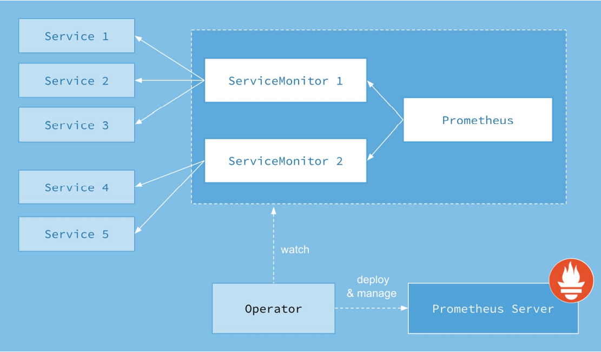


上图是 Prometheus-Operator 官⽅提供的架构图，其中 Operator 是最核⼼的部分，Operator 作为⼀个控制器，它会去创建Prometheus、ServiceMonitor、AlertManager 以及 PrometheusRule 4个 CRD 资源对 象，然后会⼀直监控并维持这4个资源对象的状态。


其中创建的 prometheus 这种资源对象就是作为 Prometheus Server 存在，⽽ ServiceMonitor 就是 exporter 的各种抽象， exporter 是⽤来专⻔提供 metrics 数据接⼝的⼯具， Prometheus 就是通过 ServiceMonitor 提供的 metrics 数据接⼝去 pull 数据，当然 alertmanager 这种资源对象就是对应的 AlertManager 的抽象，⽽ PrometheusRule 是⽤来被Prometheus实例使⽤的报警规则⽂件。


这样要在集群中监控什么数据，就变成了直接去操作 Kubernetes 集群的资源对象了，这样就⽅便很多。上图中的 Service 和 ServiceMonitor 都是 k8s 的资源，⼀个 ServiceMonitor 可以通过 labelSelector 的⽅式去匹配⼀类 Service，Prometheus 也可以通过 labelSelector 去匹配多个 ServiceMonitor。


2.2 安装的 Prometheus-Operator 版本为 v0.10.0 ，此版本已经 release，对应的 release 版本为 release-0.10

这⾥直接通过 Prometheus-Operator 的源码来安装，当然也可以⽤ Helm ⼀键安装， 但采⽤源码安装可以去了解更多的实现细节。

```javascript
// prometheus-operator开源项目：
https://github.com/prometheus-operator/prometheus-operator

// kube-prometheus operator：
https://github.com/prometheus-operator/kube-prometheus

// kube-prometheus operator 配置所在目录
https://github.com/prometheus-operator/kube-prometheus/tree/main/manifests

// 将 kube-prometheus Clone 下来

// 安装进行如下准备(在 kube-prometheus 的github页面有详细的安装要求和步骤):
// 1、安装之前将"52-61"小节中创建的资源删除掉,保留"kube-state-metrics"和"metrics-server"
//   如果不删除可能会和 Prometheus Operator 有冲突,特别是node-exporter,一定要注意 node-exporter 不能出现在其它任何的namespace下面
// 2、kubelet configuration 配置中加入 --authentication-token-webhook=true 和 --authorization-mode=Webhook 这两个flag
```


第1步: 配置参数

```javascript
// 查看kubeleat启动时的配置.
[root@centos7 /]# systemctl status kubelet
● kubelet.service - kubelet: The Kubernetes Node Agent
   Loaded: loaded (/usr/lib/systemd/system/kubelet.service; enabled; vendor preset: disabled)
  Drop-In: /usr/lib/systemd/system/kubelet.service.d
           └─10-kubeadm.conf
//.....

// 在配置文件中增加 --authentication-token-webhook=true 以及 --authorization-mode=Webhook, 如下:
//   Environment="KUBELET_CONFIG_ARGS=--config=/var/lib/kubelet/config.yaml --authentication-token-webhook=true --authorization-mode=Webhook"
[root@centos7 /]# vi /usr/lib/systemd/system/kubelet.service.d/10-kubeadm.conf

// 验证是否修改成功
[root@centos7 /]# cat /usr/lib/systemd/system/kubelet.service.d/10-kubeadm.conf
# Note: This dropin only works with kubeadm and kubelet v1.11+
[Service]
Environment="KUBELET_KUBECONFIG_ARGS=--bootstrap-kubeconfig=/etc/kubernetes/bootstrap-kubelet.conf --kubeconfig=/etc/kubernetes/kubelet.conf --cgroup-driver=cgroupfs"
Environment="KUBELET_CONFIG_ARGS=--config=/var/lib/kubelet/config.yaml --authentication-token-webhook=true --authorization-mode=Webhook"
//......

// 配置文件改变，重新载入systemd
[root@centos7 /]# systemctl daemon-reload

//  重启kubelet
[root@centos7 /]#  systemctl restart kubelet
```


第2步: 把  manifests 中的 yaml 文件归类(方便查看)以及修改相关 yaml 文件

[manifests-updated.zip](attachments/D77937B99C304A4F8E2BAE26C51B0155manifests-updated.zip)

```javascript
// 1.创建文件以及移动文件
[root@centos7 manifests]# mkdir -p serviceMonitor prometheus adapter node-exporter kube-state-metrics grafana alertmanager operator blackbox rules
[root@centos7 manifests]# mv *Rule.yaml rules
[root@centos7 manifests]# mv *serviceMonitor* serviceMonitor
[root@centos7 manifests]# mv alertmanager-* alertmanager
[root@centos7 manifests]# mv blackboxExporter-* blackbox
[root@centos7 manifests]# mv grafana-* grafana
[root@centos7 manifests]# mv kubeStateMetrics-* kube-state-metrics
[root@centos7 manifests]# mv nodeExporter-* node-exporter
[root@centos7 manifests]# mv prometheus-* prometheus
[root@centos7 manifests]# mv prometheusAdapter-* adapter
[root@centos7 manifests]# mv prometheusOperator-* operator

// 2.提前下载好相应的镜像,包含镜像的文件路径如下:
manifests\adapter\prometheusAdapter-deployment.yaml
	image: k8s.gcr.io/prometheus-adapter/prometheus-adapter:v0.9.1
	
manifests\alertmanager\alertmanager-alertmanager.yaml
	image: quay.io/prometheus/alertmanager:v0.23.0
	
manifests\blackbox\blackboxExporter-deployment.yaml
	image: quay.io/prometheus/blackbox-exporter:v0.19.0
	image: jimmidyson/configmap-reload:v0.5.0
	image: quay.io/brancz/kube-rbac-proxy:v0.11.0
	
manifests\grafana\grafana-deployment.yaml
	image: grafana/grafana:8.3.3
	
manifests\kube-state-metrics\kubeStateMetrics-deployment.yaml
	image: k8s.gcr.io/kube-state-metrics/kube-state-metrics:v2.3.0
	image: quay.io/brancz/kube-rbac-proxy:v0.11.0
	image: quay.io/brancz/kube-rbac-proxy:v0.11.0 
	
manifests\node-exporter\nodeExporter-daemonset.yaml
	image: quay.io/prometheus/node-exporter:v1.3.1
	image: quay.io/brancz/kube-rbac-proxy:v0.11.0

manifests\operator\prometheusOperator-deployment.yaml
	image: quay.io/prometheus-operator/prometheus-operator:v0.53.1
	image: quay.io/brancz/kube-rbac-proxy:v0.11.0
	
manifests\prometheus\prometheus-prometheus.yaml
	image: quay.io/prometheus/prometheus:v2.32.1

// 3.在 deployment 类型的资源文件中添加如下字段:
	imagePullPolicy: IfNotPresent

// 4.在 prometheus、alertManager、grafana 的 service 文件中添加如下字段:
	type: NodePort

```


第3步: 创建资源

```javascript
// 1. to create the namespace and CustomResourceDefinitions first to avoid race conditions when deploying the monitoring components.
//    创建⼀个名为 monitoring 的 namespace，所以资源对象对将部署在改命名空间下⾯
[root@centos7 manifests]# kubectl apply --server-side -f setup/
customresourcedefinition.apiextensions.k8s.io/alertmanagerconfigs.monitoring.coreos.com serverside-applied
customresourcedefinition.apiextensions.k8s.io/alertmanagers.monitoring.coreos.com serverside-applied
customresourcedefinition.apiextensions.k8s.io/podmonitors.monitoring.coreos.com serverside-applied
customresourcedefinition.apiextensions.k8s.io/probes.monitoring.coreos.com serverside-applied
customresourcedefinition.apiextensions.k8s.io/prometheuses.monitoring.coreos.com serverside-applied
customresourcedefinition.apiextensions.k8s.io/prometheusrules.monitoring.coreos.com serverside-applied
customresourcedefinition.apiextensions.k8s.io/servicemonitors.monitoring.coreos.com serverside-applied
customresourcedefinition.apiextensions.k8s.io/thanosrulers.monitoring.coreos.com serverside-applied
namespace/monitoring serverside-applied

// 2.查看创建的CRD资源
[root@centos7 manifests]# kubectl get crd 
NAME                                                  CREATED AT
alertmanagerconfigs.monitoring.coreos.com             2022-01-15T09:57:00Z
alertmanagers.monitoring.coreos.com                   2022-01-15T09:57:00Z
bgpconfigurations.crd.projectcalico.org               2021-08-23T14:53:03Z
bgppeers.crd.projectcalico.org                        2021-08-23T14:53:04Z
blockaffinities.crd.projectcalico.org                 2021-08-23T14:53:04Z
clusterinformations.crd.projectcalico.org             2021-08-23T14:53:04Z
felixconfigurations.crd.projectcalico.org             2021-08-23T14:53:04Z
globalnetworkpolicies.crd.projectcalico.org           2021-08-23T14:53:04Z
globalnetworksets.crd.projectcalico.org               2021-08-23T14:53:04Z
hostendpoints.crd.projectcalico.org                   2021-08-23T14:53:04Z
ipamblocks.crd.projectcalico.org                      2021-08-23T14:53:04Z
ipamconfigs.crd.projectcalico.org                     2021-08-23T14:53:04Z
ipamhandles.crd.projectcalico.org                     2021-08-23T14:53:04Z
ippools.crd.projectcalico.org                         2021-08-23T14:53:04Z
kubecontrollersconfigurations.crd.projectcalico.org   2021-08-23T14:53:04Z
networkpolicies.crd.projectcalico.org                 2021-08-23T14:53:04Z
networksets.crd.projectcalico.org                     2021-08-23T14:53:04Z
podmonitors.monitoring.coreos.com                     2022-01-15T09:57:00Z
probes.monitoring.coreos.com                          2022-01-15T09:57:01Z
prometheuses.monitoring.coreos.com                    2022-01-15T09:57:01Z
prometheusrules.monitoring.coreos.com                 2022-01-15T09:57:01Z
servicemonitors.monitoring.coreos.com                 2022-01-15T09:57:01Z
thanosrulers.monitoring.coreos.com                    2022-01-15T09:57:01Z

//  Operator 会⾃动创建8个 CRD 资源对象
[root@centos7 manifests]# kubectl get crd | grep coreos
alertmanagerconfigs.monitoring.coreos.com             2022-01-15T09:57:00Z
alertmanagers.monitoring.coreos.com                   2022-01-15T09:57:00Z
podmonitors.monitoring.coreos.com                     2022-01-15T09:57:00Z
probes.monitoring.coreos.com                          2022-01-15T09:57:01Z
prometheuses.monitoring.coreos.com                    2022-01-15T09:57:01Z
prometheusrules.monitoring.coreos.com                 2022-01-15T09:57:01Z
servicemonitors.monitoring.coreos.com                 2022-01-15T09:57:01Z
thanosrulers.monitoring.coreos.com                    2022-01-15T09:57:01Z


// 3.创建 operator 以及其它资源
[root@centos7 manifests]# kubectl apply -f operator
clusterrole.rbac.authorization.k8s.io/prometheus-operator created
clusterrolebinding.rbac.authorization.k8s.io/prometheus-operator created
deployment.apps/prometheus-operator created
service/prometheus-operator created
serviceaccount/prometheus-operator created

[root@centos7 manifests]# kubectl apply -f serviceMonitor/ -f prometheus/ -f adapter/ -f node-exporter/ -f kube-state-metrics/ -f grafana/ -f alertmanager/ -f blackbox/ -f rules/
servicemonitor.monitoring.coreos.com/alertmanager-main created
servicemonitor.monitoring.coreos.com/blackbox-exporter created
servicemonitor.monitoring.coreos.com/grafana created
servicemonitor.monitoring.coreos.com/kube-state-metrics created
servicemonitor.monitoring.coreos.com/kube-apiserver created
servicemonitor.monitoring.coreos.com/coredns created
// ......

// 4.查看创建的资源
[root@centos7 manifests]# kubectl -n monitoring get alertmanager
NAME   VERSION   REPLICAS   AGE
main   0.23.0    3          4m11s

[root@centos7 manifests]# kubectl -n monitoring get prometheus
NAME   VERSION   REPLICAS   AGE
k8s    2.32.1    2          4m29s

[root@centos7 manifests]# kubectl -n monitoring get PrometheusRule
NAME                              AGE
alertmanager-main-rules           9m42s
grafana-rules                     9m42s
kube-prometheus-rules             9m42s
kube-state-metrics-rules          9m42s
kubernetes-monitoring-rules       9m42s
node-exporter-rules               9m42s
prometheus-k8s-prometheus-rules   9m42s
prometheus-operator-rules         9m42

[root@centos7 manifests]# kubectl -n monitoring get ServiceMonitor
NAME                      AGE
alertmanager-main         10m
blackbox-exporter         10m
coredns                   10m
grafana                   10m
kube-apiserver            10m
kube-controller-manager   10m
kube-scheduler            10m
kube-state-metrics        10m
kubelet                   10m
node-exporter             10m
prometheus-adapter        10m
prometheus-k8s            10m
prometheus-operator       10m

// 查看所有的 Pod
// prometheus-operator 是⽐较核⼼的 Pod, ⽤来控制其他资源对象和监听对象变化
[root@centos7 manifests]# kubectl -n monitoring get pod
NAME                                   READY   STATUS    RESTARTS   AGE
alertmanager-main-0                    2/2     Running   0          3m41s
alertmanager-main-1                    2/2     Running   0          3m41s
alertmanager-main-2                    2/2     Running   0          3m41s
blackbox-exporter-6798fb5bb4-n5glz     3/3     Running   0          6m7s
grafana-5fdb94f9d8-kcwdb               1/1     Running   0          6m8s
kube-state-metrics-5fcb7d6fcb-x57wr    3/3     Running   0          6m12s
node-exporter-k7ngf                    2/2     Running   0          6m12s
node-exporter-r2sgb                    2/2     Running   0          6m12s
prometheus-adapter-7dc46dd46d-77mpk    1/1     Running   0          6m13s
prometheus-adapter-7dc46dd46d-j2qdr    1/1     Running   0          6m13s
prometheus-k8s-0                       2/2     Running   0          3m42s
prometheus-k8s-1                       2/2     Running   0          3m41s
prometheus-operator-7ddc6877d5-ml49n   2/2     Running   0          6m26s

// alertmanager 有 alertmanager-main-0、alertmanager-main-1、alertmanager-main-2 三个实例
// prometheus 有 prometheus-k8s-0、prometheus-k8s-1 两个实例
// 可以看出 alertmanager 和 prometheus 是⽤ StatefulSet 控制器管理的
[root@centos7 aaron]# kubectl -n monitoring get statefulset
NAME                READY   AGE
alertmanager-main   3/3     21h
prometheus-k8s      2/2     21h

[root@centos7 aaron]# kubectl -n monitoring get deployment
NAME                  READY   UP-TO-DATE   AVAILABLE   AGE
blackbox-exporter     1/1     1            1           21h
grafana               1/1     1            1           21h
kube-state-metrics    1/1     1            1           21h
prometheus-adapter    2/2     2            2           21h
prometheus-operator   1/1     1            1           21h

[root@centos7 aaron]# kubectl get ns
NAME                   STATUS   AGE
blog                   Active   118d
default                Active   145d
kube-node-lease        Active   145d
kube-ops               Active   114d
kube-public            Active   145d
kube-system            Active   145d
kubernetes-dashboard   Active   145d
monitoring             Active   25h

// grafana 和 prometheus 默认是 ClusterIP 类型的 Service, 
// 如果要在外⽹访问这两个服务的可以通过创建对应的 Ingress 对象或者使⽤ NodePort 类型的Service
// 这里使用 NodePort 类型的 Service
[root@centos7 manifests]# kubectl -n monitoring get svc
NAME                    TYPE        CLUSTER-IP       EXTERNAL-IP   PORT(S)                         AGE
alertmanager-main       NodePort    10.101.59.194    <none>        9093:31828/TCP,8080:31168/TCP   6m20s
alertmanager-operated   ClusterIP   None             <none>        9093/TCP,9094/TCP,9094/UDP      3m53s
blackbox-exporter       ClusterIP   10.98.201.248    <none>        9115/TCP,19115/TCP              6m19s
grafana                 NodePort    10.101.190.12    <none>        3000:31260/TCP                  6m20s
kube-state-metrics      ClusterIP   None             <none>        8443/TCP,9443/TCP               6m24s
node-exporter           ClusterIP   None             <none>        9100/TCP                        6m25s
prometheus-adapter      ClusterIP   10.100.85.210    <none>        443/TCP                         6m25s
prometheus-k8s          NodePort    10.102.213.144   <none>        9090:31469/TCP,8080:30026/TCP   6m25s
prometheus-operated     ClusterIP   None             <none>        9090/TCP                        3m54s
prometheus-operator     ClusterIP   None             <none>        8443/TCP                        6m38s

// 5.访问prometheus、alertManager、grafana
prometheus
http://192.168.32.100:31469
http://192.168.32.101:31469

alertManager
http://192.168.32.100:31828
http://192.168.32.101:31828

grafana
http://192.168.32.100:31260
http://192.168.32.101:31260
```


3. 配置

3.1 ServiceMonitor 资源⽂件的声明⽅式介绍

从 Prometheus 的 targets 页面看到⼤部分配置都正常,只有两个没有管理到对应的监控⽬标,⽐如 kubecontroller-manager 和 kube-scheduler 这两个系统组件，这就和 ServiceMonitor 的定义有关系了，先查看 kube-scheduler 组件对应的 ServiceMonitor 资源的定义, 这是⼀个典型的 ServiceMonitor 资源⽂件的声明⽅式，通过 selector.matchLabels 在 kube-system 这个命名空间下⾯匹配具有 k8s-app=kube-scheduler 这样的 Service，但是系统中根本就没有对应的 Service，所以需要⼿动创建 Service

```javascript
# kubernetesControlPlane-serviceMonitorKubeScheduler.yaml
apiVersion: monitoring.coreos.com/v1
kind: ServiceMonitor
metadata:
  labels:
    app.kubernetes.io/name: kube-scheduler
    app.kubernetes.io/part-of: kube-prometheus
  name: kube-scheduler
  namespace: monitoring
spec:
  endpoints:
  - bearerTokenFile: /var/run/secrets/kubernetes.io/serviceaccount/token
    # 每30s获取⼀次信息 
    interval: 30s
    # 对应service的端⼝名
    port: https-metrics
    scheme: https
    tlsConfig:
      insecureSkipVerify: true
  jobLabel: app.kubernetes.io/name
  # 表示去匹配某⼀命名空间中的service,如果要从所有的namespace中匹配⽤ any: true
  namespaceSelector:
    matchNames:
    - kube-system
  # 匹配的 Service 的 labels,如果使⽤mathLabels,则下⾯的所有标签都匹配时才会匹配该service,如果使⽤matchExpressions,则⾄少匹配⼀个标签的service都会被选择
  selector:
    matchLabels:
      app.kubernetes.io/name: kube-scheduler

```


这里可以看出 Prometheus 默认的编排文件不是很完善，比如  kubecontroller-manager 和 kube-scheduler 通过标签匹配相应的 endpoint 作为监控目标，但是在 k8s 集群中并不包含这个标签的 endpoint，所以需要手动加上 Service 和 Endpoint


3.2 创建 Service 和 Endpoints


方式1：只需要创建Service

[k8s-components-service.zip](attachments/4EBD2373C487479FB9259D6C0ADD8003k8s-components-service.zip)

```javascript
# k8s-components-service\kube-scheduler-service.yaml

apiVersion: v1
kind: Service
metadata:
  namespace: kube-system
  name: kube-scheduler
  labels:
    app.kubernetes.io/name: kube-scheduler
spec:
  type: ClusterIP
  clusterIP: None
  selector: 
    component: kube-scheduler
  ports:
  - name: https-metrics
    port: 10259
    targetPort: 10259
    protocol: TCP    
```


```javascript
# k8s-components-service\kube-controller-manager-service.yaml

apiVersion: v1
kind: Service
metadata:
  namespace: kube-system
  name: kube-controller-manager
  labels:
    app.kubernetes.io/name: kube-controller-manager
spec:
  type: ClusterIP
  clusterIP: None
  selector: 
    component: kube-controller-manager
  ports:
  - name: https-metrics
    port: 10257
    targetPort: 10257
    protocol: TCP
```


上面的配置文件中最重要的是 labels 和 selector 部分，labels 区域的配置必须和上⾯的 ServiceMonitor 对象中的 selector 保持⼀致， selector 下⾯的配置要和 Pod 的 Labels 一致，如下查看 Pod 的 Labels：

```javascript
[root@centos7 manifests]# kubectl -n kube-system get pod
NAME                                       READY   STATUS    RESTARTS        AGE
calico-kube-controllers-58497c65d5-qtbhv   1/1     Running   46 (124m ago)   115d
calico-node-62nb9                          1/1     Running   68 (124m ago)   145d
calico-node-zl8vj                          1/1     Running   73 (124m ago)   145d
coredns-7f6cbbb7b8-2k8dd                   1/1     Running   68 (124m ago)   145d
coredns-7f6cbbb7b8-jmc4v                   1/1     Running   68 (124m ago)   145d
etcd-centos7.master                        1/1     Running   69 (124m ago)   145d
kube-apiserver-centos7.master              1/1     Running   47 (124m ago)   114d
kube-controller-manager-centos7.master     0/1     Running   47 (124m ago)   114d
kube-proxy-6m52q                           1/1     Running   68 (124m ago)   145d
kube-proxy-mfgr6                           1/1     Running   74 (124m ago)   145d
kube-scheduler-centos7.master              1/1     Running   75 (124m ago)   145d
kube-state-metrics-58ff885bcd-b8rbr        1/1     Running   8 (124m ago)    27d
metrics-server-5b6dd75459-wjkhn            1/1     Running   16 (124m ago)   34d

// describe  kube-scheduelr 这个 Pod
[root@centos7 manifests]# kubectl -n kube-system describe pod kube-scheduler-centos7.master
Name:                 kube-scheduler-centos7.master
Namespace:            kube-system
Priority:             2000001000
Priority Class Name:  system-node-critical
Node:                 centos7.master/192.168.32.100
Start Time:           Sun, 16 Jan 2022 02:36:34 -0500
Labels:               component=kube-scheduler
                      tier=control-plane
......

//  describe kube-controller-manager 这个 Pod
[root@centos7 manifests]# kubectl -n kube-system describe pod kube-controller-manager-centos7.master
Name:                 kube-controller-manager-centos7.master
Namespace:            kube-system
Priority:             2000001000
Priority Class Name:  system-node-critical
Node:                 centos7.master/192.168.32.100
Start Time:           Sun, 16 Jan 2022 02:36:34 -0500
Labels:               component=kube-controller-manager
                      tier=control-plane
......

// 可以看到 kube-scheduler 和 kube-controller-manager 两个 Pod 都有两个标签
// 它们都有 tier=control-plane 这个标签
// component=kube-scheduler 标签对于kube-scheduler 这个Pod 更具有唯一性
// component=kube-controller-manager 标签对于 kube-controller-manager 这个Pod 更具有唯一性

// 结论:
// kube-scheduler 这个service 的 selector 使用 component=kube-scheduler 这个标签
// kube-controller-manager 这个service 的 selector 使用 component=kube-controller-manager 这个标签

// 这样上⾯的 Service 就和 Pod 进⾏了关联
// 关联后 Service 会自动为匹配到的 Pod 创建 Endpoints
```


方式2：创建 Service 和 Endpoints

[k8s-components-service-endpoint.zip](attachments/42471E509C714B3387659E9619F050C1k8s-components-service-endpoint.zip)

```javascript
# k8s-components-service-endpoint\kube-scheduler-service.yaml

apiVersion: v1
kind: Service
metadata:
  namespace: kube-system
  name: kube-scheduler
  labels:
    app.kubernetes.io/name: kube-scheduler
spec:
  type: ClusterIP
  clusterIP: None
  ports:
  - name: https-metrics
    port: 10259
    targetPort: 10259
    protocol: TCP
---
apiVersion: v1
kind: Endpoints
metadata:
  namespace: kube-system
  name: kube-scheduler
  labels:
    app.kubernetes.io/name: kube-scheduler
subsets:
- addresses:
  - ip: 192.168.32.100
  ports:
  - name: https-metrics
    port: 10259
    protocol: TCP
```


```javascript
# k8s-components-service-endpoint\kube-controller-manager-service.yaml

apiVersion: v1
kind: Service
metadata:
  namespace: kube-system
  name: kube-controller-manager
  labels:
    app.kubernetes.io/name: kube-controller-manager
spec:
  type: ClusterIP
  clusterIP: None
  ports:
  - name: https-metrics
    port: 10257
    targetPort: 10257
    protocol: TCP
---
apiVersion: v1
kind: Endpoints
metadata:
  namespace: kube-system
  name: kube-controller-manager
  labels:
    app.kubernetes.io/name: kube-controller-manager
subsets:
- addresses:
  - ip: 192.168.32.100
  ports:
  - name: https-metrics
    port: 10257
    protocol: TCP
```

这种方式其实是 Endpoints 关联 Pod，Service 和 Endpoints 进行关联，只不过这里 Endpoints 是手动创建，因为 Service 中没有配置 selector，所以就不能匹配到 Pod ，也就不能自动创建相应的 Endpoints ！


这里使用方式2：

```javascript
// 创建 Service 以及 Endpoints
[root@centos7 62-PrometheusOperator]# kubectl apply -f k8s-components-service-endpoint/
service/kube-controller-manager created
endpoints/kube-controller-manager created
service/kube-scheduler created
endpoints/kube-scheduler created

[root@centos7 62-PrometheusOperator]# kubectl -n kube-system get svc
NAME                      TYPE        CLUSTER-IP      EXTERNAL-IP   PORT(S)                        AGE
kube-controller-manager   ClusterIP   None            <none>        10257/TCP                      99s
kube-dns                  ClusterIP   10.96.0.10      <none>        53/UDP,53/TCP,9153/TCP         145d
kube-scheduler            ClusterIP   None            <none>        10259/TCP                      99s
kube-state-metrics        ClusterIP   None            <none>        8080/TCP,8081/TCP              27d
kubelet                   ClusterIP   None            <none>        10250/TCP,10255/TCP,4194/TCP   15h
metrics-server            ClusterIP   10.103.201.13   <none>        443/TCP                        34d

[root@centos7 62-PrometheusOperator]# kubectl -n kube-system get ep
NAME                      ENDPOINTS                                                                    AGE
kube-controller-manager   192.168.32.100:10257                                                         2m13s
kube-dns                  10.244.139.53:53,10.244.139.63:53,10.244.139.53:53 + 3 more...               145d
kube-scheduler            192.168.32.100:10259                                                         2m13s
kube-state-metrics        10.244.189.174:8081,10.244.189.174:8080                                      27d
kubelet                   192.168.32.100:10250,192.168.32.101:10250,192.168.32.100:10255 + 3 more...   15h
metrics-server            10.244.189.186:4443                                                          34d
```


3.3 更改静态 Pod 的 YAML 文件

创建完成后，去 prometheus 查看 targets 下⾯ kube-scheduler 的状态：

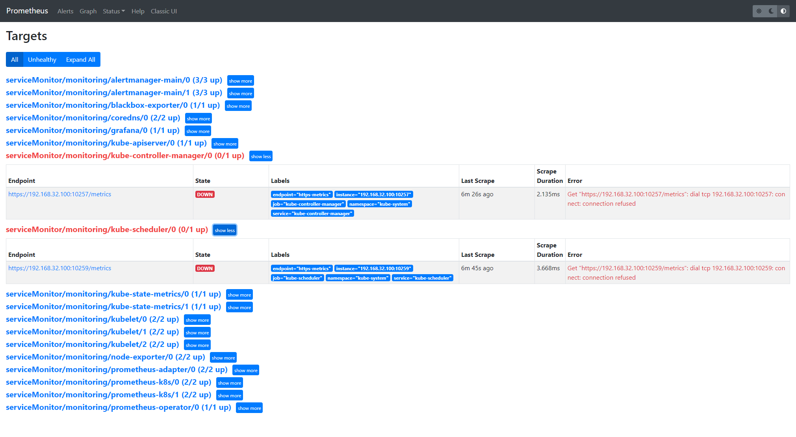

可以看到现在已经发现了 target，但抓取数据结果出错，这是因为集群是使⽤ kubeadm 搭建的，其中 kube-scheduler 和  kube-controller-manager 默认是绑定在 127.0.0.1 上⾯，⽽上⾯这个地⽅是想通过节点的 IP 去访问，所以访问被拒绝，所以只要把 kube-scheduler 和  kube-controller-manager 绑定的地址更改为 0.0.0.0 即可满⾜要求，由于 kube-scheduler 和  kube-controller-manager 是以静态 Pod 的形式运⾏在集群中，所以只需要更改静态 Pod ⽬录下⾯对应的 YAML ⽂件即可：

```javascript
// 通过下面的命令可以找到 kube-scheduler 和 kube-controller-manager 的静态 yaml 文件
[root@centos7 /]# systemctl status kubelet
[root@centos7 /]# cat /usr/lib/systemd/system/kubelet.service.d/10-kubeadm.conf
[root@centos7 /]# cat /var/lib/kubelet/config.yaml
[root@centos7 /]# cd /etc/kubernetes/manifests
[root@centos7 manifests]# cat kube-controller-manager.yaml
[root@centos7 manifests]# cat kube-scheduler.yaml

// 将 kube-scheduler.yaml 文件中 -command 的 --bind-address 地址更改成 0.0.0.0
[root@centos7 manifests]# vi kube-scheduler.yaml
	......
	#- --bind-address=127.0.0.1
    - --bind-address=0.0.0.0
	......

// // 将 kube-controller-manager.yaml 文件中 -command 的 --bind-address 地址更改成 0.0.0.0
[root@centos7 manifests]# vi kube-controller-manager.yaml
	......
	#- --bind-address=127.0.0.1
    - --bind-address=0.0.0.0
	......
	
// 修改完成后将该⽂件从当前⽂件夹中移除,隔⼀会⼉再移回该⽬录,就可以⾃动更新了
[root@centos7 manifests]# mv kube-controller-manager.yaml kube-scheduler.yaml ../
[root@centos7 manifests]# ls
etcd.yaml  kube-apiserver.yaml  StaticPodExample.yaml
[root@centos7 manifests]# mv ../kube-controller-manager.yaml ../kube-scheduler.yaml ./
[root@centos7 manifests]# ls
etcd.yaml  kube-apiserver.yaml  kube-controller-manager.yaml  kube-scheduler.yaml  StaticPodExample.yaml
```


查看 prometheus 中 kube-scheduler 和 kube-controller-manager 这两个 target 发现已经正常：

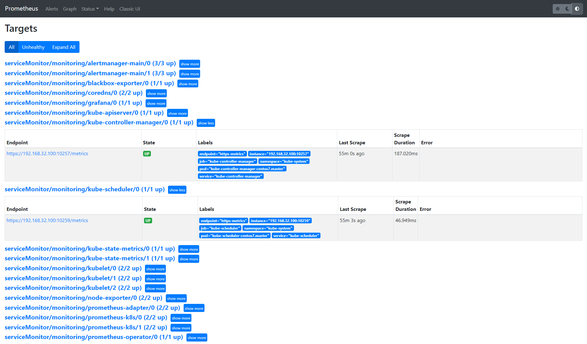


上⾯的监控数据配置完成后，就可以查看 grafana 下⾯的 dashboard，同样使⽤上⾯的 NodePort 访问即可，进⼊⾸⻚后，可以发现已经和 Prometheus 数据源关联上了，正常来说可以看到⼀些监控图表。

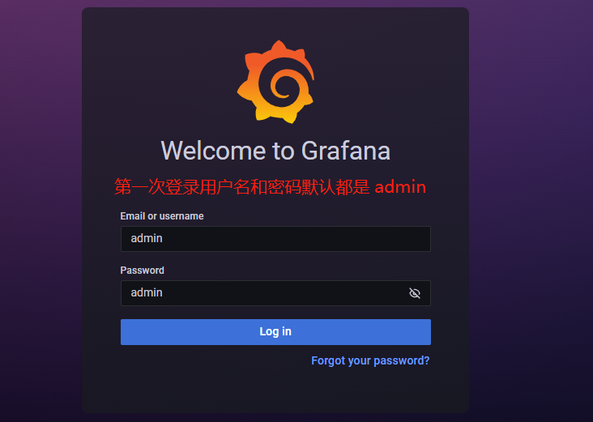


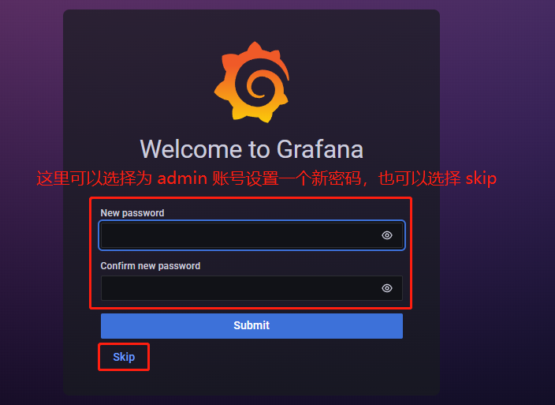


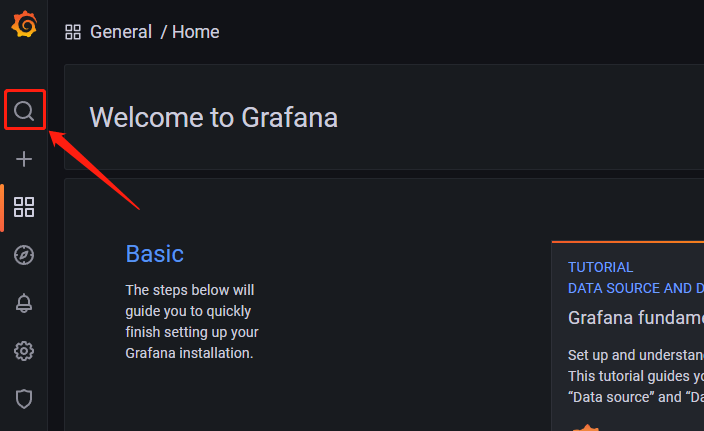


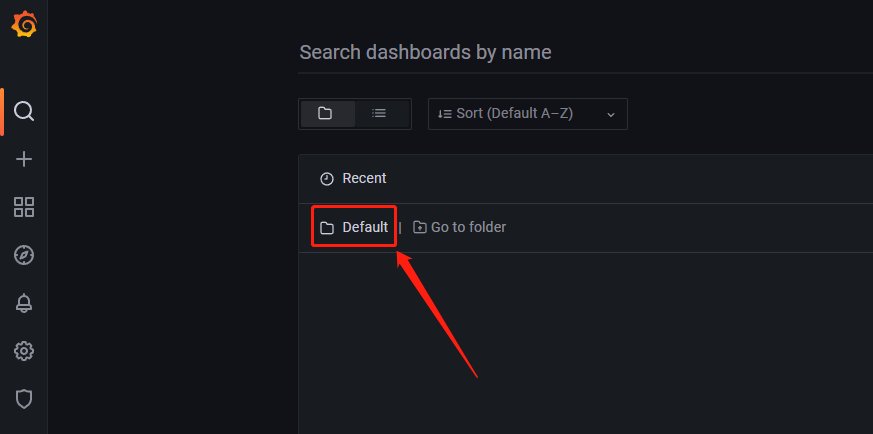


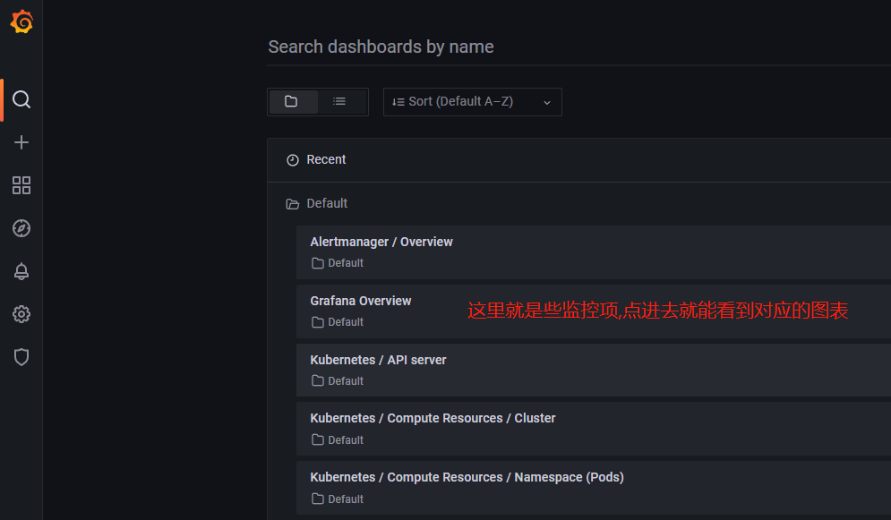


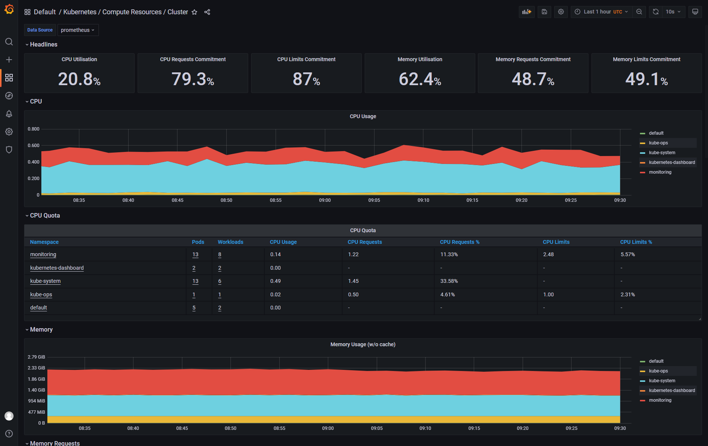


下节介绍怎样完全⾃定义⼀个 ServiceMonitor 以及 AlertManager 相关的配置.


4. 总结

问题1：

从kube-scheduler和kube-controller-manager 的Service文件可以看出：

- 10259 是 kube-scheduler 组件 metrics 数据所在的端⼝

- 10257 是 kube-controller-manager 组件的监控数据所在端⼝


问题：如果知道组件的数据端口号？

- 方式1: 官网查找 “--secure-port”参数端口

- https://v1-22.docs.kubernetes.io/zh/docs/reference/command-line-tools-reference/kube-scheduler/

- https://v1-22.docs.kubernetes.io/zh/docs/reference/command-line-tools-reference/kube-controller-manager/

- 方式2: kube-scheduler 和 kube-controller-manager 是静态Pod，在 staticPodPath 下面去查看定义 Pod 的yaml 文件.

```javascript
[root@centos7 /]# cat /etc/kubernetes/manifests/kube-scheduler.yaml
......
    livenessProbe:
      failureThreshold: 8
      httpGet:
        host: 127.0.0.1
        path: /healthz
        port: 10259
        scheme: HTTPS
......

[root@centos7 /]# cat /etc/kubernetes/manifests/kube-controller-manager.yaml
......
    livenessProbe:
      failureThreshold: 8
      httpGet:
        host: 127.0.0.1
        path: /healthz
        port: 10257
        scheme: HTTPS
......
```


问题2：从官方文档中可以看出配置的含义:

对于 kube-scheduler：

https://v1-22.docs.kubernetes.io/zh/docs/reference/command-line-tools-reference/kube-scheduler/

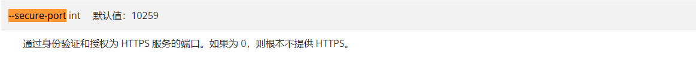

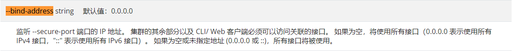


对于 kube-controller-manager：

https://v1-22.docs.kubernetes.io/zh/docs/reference/command-line-tools-reference/kube-controller-manager/

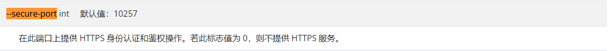

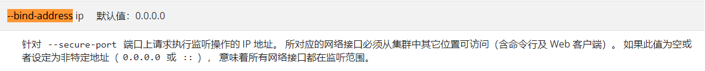

这些参数其实就是配置在声明资源的 YAML 文件中的 spec.containers 节点下的 " - command " 中。


问题3：用到的一些命令

```javascript
// 1. Linux ps 命令介绍
Linux ps(process status) 命令用于显示当前进程的状态，类似于 windows 的任务管理器。
	-A	显示所有进程
	-e	此参数的效果和指定-A参数相同
	-f	显示完整格式的输出
// 查看 kubelet 启动时使用的命令参数
[root@centos7 /]# ps -ef | grep kubelet

// 2. "lsof"和"netstat"命令
# 使用"lsof"和"netstat"查看端口占用情况,比如查看进程名称和PID,
# 如果使用"lsof"提示没有这个命令,使用"yum install lsof -y"安装
lsof -i:10250     
netstat -tunlp | grep 10250
#根据PID结束某个进程
kill 96237

// 3. systemctl 命令, kubelet 通过 systemctl 工具来管理
# 查看kubectl的版本.
kubectl version

# 重启kubelet
systemctl restart kubelet

# 查看kubeleat启动时的配置.
systemctl status kubelet

# 查看kubelet相关信息
kubelet

# kubelet.service changed on disk. Run 'systemctl daemon-reload' to reload units
systemctl daemon-reload

// 4. docker命令
docker pull forging2012/prometheus-adapter:v0.9.1
// 镜像打包以及镜像载入
docker save -o prometheus-adapter.tar forging2012/prometheus-adapter:v0.9.1
docker load -i prometheus-adapter.tar
// 改镜像 tag
docker tag forging2012/prometheus-adapter:v0.9.1 k8s.gcr.io/prometheus-adapter/prometheus-adapter:v0.9.1
// 删除镜像
docker rmi forging2012/prometheus-adapter:v0.9.1

// 5. kubectl相关命令
kubectl -n kube-system describe svc kubelet 
kubectl -n kube-system get svc kubelet kubelet -o yaml
kubectl -n kube-system get ep kubelet -o yaml
kubectl get ns

// 6. "kubectl edit" 命令的使用方式
[root@centos7 aaron]# kubectl -n monitoring get svc
NAME                    TYPE        CLUSTER-IP       EXTERNAL-IP   PORT(S)                         AGE
grafana                 NodePort    10.101.190.12    <none>        3000:31260/TCP                  21h
prometheus-k8s          NodePort    10.102.213.144   <none>        9090:31469/TCP,8080:30026/TCP   21h
......
// "kubectl edit" 使用默认编辑器 编辑服务器上定义的资源,更改完成后保存即可生效
// 格式:  kubectl -n [NameSpaceName] edit svc [ServiceName]
[root@centos7 /]# kubectl -n monitoring edit svc grafana
[root@centos7 /]# kubectl -n monitoring edit svc prometheus-k8s

```


问题4：参考资料

常用kubectl命令总结：

https://www.cnblogs.com/Cherry-Linux/p/7866427.html


kubenetes 1.4 修改kubelet启动参数修改方法：

https://blog.csdn.net/wiborgite/article/details/52863913


linux中systemctl详细理解及常用命令: 

https://blog.csdn.net/skh2015java/article/details/94012643


docker容器打包成镜像和压缩以及解压和载入镜像: 

https://blog.csdn.net/sunmingyang1987/article/details/104555190