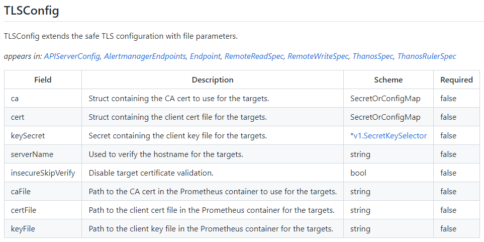
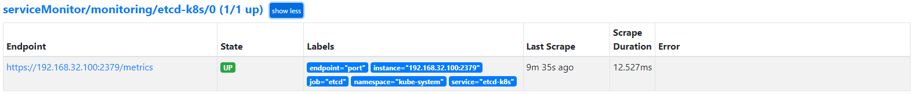
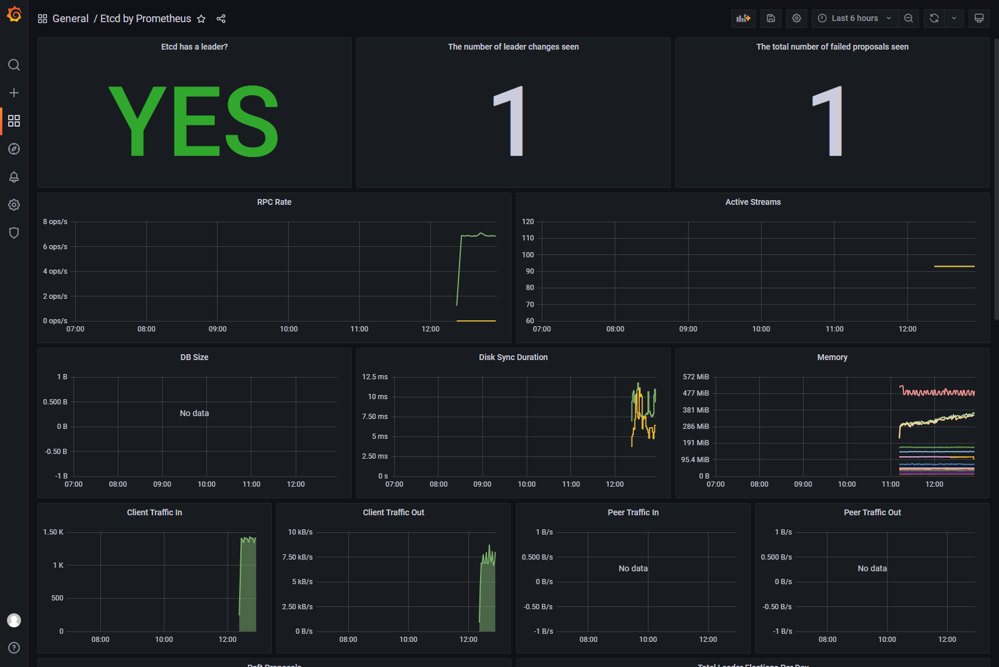

1. 介绍

上节了解到 Prometheus Operator 的安装和基本使⽤⽅法，这节课介绍如何在  Prometheus Operator 中添加⼀个⾃定义的监控项。除了 Kubernetes 集群中的⼀些资源对象、节点以及组件需要监控，有的时候可能还需要根据实际的业务需求去添加⾃定义的监控项，添加⼀个⾃定义监控的步骤也⾮常简单。

- 第1步：建⽴⼀个 ServiceMonitor 对象，⽤于 Prometheus 添加监控项

- 第2步：为 ServiceMonitor 对象关联 metrics 数据接⼝的⼀个 Service 对象

- 第3步：确保 Service 对象可以正确获取到 metrics 数据

接下来添加 etcd 集群的监控。 ⽆论是使⽤ Kubeadm 安装在集群内部的 etcd 集群还是 Kubernetes 集群外的etcd 集群，这⾥都将其视作集群外的独⽴集群，因为对于⼆者的使⽤⽅法没什么特殊之处。


```javascript
// etcd 官网:
https://etcd.io/

// etcd 配置说明:
https://etcd.io/docs/v3.5/op-guide/configuration/
```


2. 添加 etcd 集群的监控


2.1 etcd 证书

对于 etcd 集群，⼀般情况下为了安全都会开启 https 证书认证的⽅式，所以要想让 Prometheus 访问到 etcd 集群的监控数据，就需要提供相应的证书校验。由于当前环境使⽤的是 Kubeadm 搭建的集群，所以可以使⽤ kubectl ⼯具去获取 etcd 启动 的时候使⽤的证书路径。

```javascript
[root@centos7 aaron]# kubectl -n kube-system get pods | grep etcd
etcd-centos7.master                        1/1     Running     71 (6d2h ago)   151d

[root@centos7 aaron]# kubectl -n kube-system get pod etcd-centos7.master -o yaml
apiVersion: v1
kind: Pod
metadata:
  // ......
spec:
  containers:
  - command:
    - etcd
    - --advertise-client-urls=https://192.168.32.100:2379
    - --cert-file=/etc/kubernetes/pki/etcd/server.crt
    - --client-cert-auth=true
    - --data-dir=/var/lib/etcd
    - --initial-advertise-peer-urls=https://192.168.32.100:2380
    - --initial-cluster=centos7.master=https://192.168.32.100:2380
    - --key-file=/etc/kubernetes/pki/etcd/server.key
    - --listen-client-urls=https://127.0.0.1:2379,https://192.168.32.100:2379
    - --listen-metrics-urls=http://127.0.0.1:2381
    - --listen-peer-urls=https://192.168.32.100:2380
    - --name=centos7.master
    - --peer-cert-file=/etc/kubernetes/pki/etcd/peer.crt
    - --peer-client-cert-auth=true
    - --peer-key-file=/etc/kubernetes/pki/etcd/peer.key
    - --peer-trusted-ca-file=/etc/kubernetes/pki/etcd/ca.crt
    - --snapshot-count=10000
    - --trusted-ca-file=/etc/kubernetes/pki/etcd/ca.crt
    image: registry.aliyuncs.com/google_containers/etcd:3.5.0-0
    imagePullPolicy: IfNotPresent
    // ......
```


可以看到 etcd 使⽤的证书都对应在节点的 /etc/kubernetes/pki/etcd/ 这个路径下⾯，所以⾸先将需要使⽤到的证书通过 secret 对象保存到集群中去。(如果是独⽴的⼆进制⽅式启动的 etcd 集群，同样将对应的证书保存到集群中的⼀个 secret 对象中去即可。)

```javascript
// 在 etcd 运⾏的节点 运行以下命令

[root@centos7 aaron]# ls -ls /etc/kubernetes/pki/etcd/
total 32
4 -rw-r--r--. 1 root root 1086 Aug 23 10:49 ca.crt
4 -rw-------. 1 root root 1675 Aug 23 10:49 ca.key
4 -rw-r--r--. 1 root root 1159 Aug 23 10:49 healthcheck-client.crt
4 -rw-------. 1 root root 1675 Aug 23 10:49 healthcheck-client.key
4 -rw-r--r--. 1 root root 1212 Aug 23 10:49 peer.crt
4 -rw-------. 1 root root 1679 Aug 23 10:49 peer.key
4 -rw-r--r--. 1 root root 1212 Aug 23 10:49 server.crt
4 -rw-------. 1 root root 1679 Aug 23 10:49 server.key

[root@centos7 aaron]# kubectl -n monitoring create secret generic etcd-certs --from-file=/etc/kubernetes/pki/etcd/healthcheck-client.crt --from-file=/etc/kubernetes/pki/etcd/healthcheck-client.key --from-file=/etc/kubernetes/pki/etcd/ca.crt
secret/etcd-certs created
[root@centos7 aaron]# kubectl -n monitoring get secret | grep etcd
etcd-certs                        Opaque                                3      49s
[root@centos7 aaron]#

```


然后将上⾯创建的 etcd-certs 对象配置到 prometheus 资源对象中，直接更新 prometheus 资源对象即可：

```javascript
// 从 CRD 资源文件中可以看出 secrets 字段是定义在 prometheus 资源对象中
.....\manifests\setup\0prometheusCustomResourceDefinition.yaml

[root@centos7 aaron]# kubectl -n monitoring get prometheus
NAME   VERSION   REPLICAS   AGE
k8s    2.32.1    2          7d13h

[root@centos7 aaron]# kubectl -n monitoring edit prometheus k8s
apiVersion: monitoring.coreos.com/v1
kind: Prometheus
metadata:
  // ......
spec:
  // ......
  ruleSelector: {}
  // 添加如下 secrets 属性:
  secrets:
  - etcd-certs
  securityContext:
    fsGroup: 2000
    runAsNonRoot: true
    runAsUser: 1000
  serviceAccountName: prometheus-k8s
  // ......
prometheus.monitoring.coreos.com/k8s edited

// 查看是否添加成功
[root@centos7 aaron]# kubectl -n monitoring get prometheus k8s -o yaml

// 可以看到 prometheus 这两个pod 都已重新启动
[root@centos7 aaron]# kubectl -n monitoring get pod | grep prometheus-k8s
prometheus-k8s-0                       2/2     Running   0             72s
prometheus-k8s-1                       2/2     Running   0             89s

// 更新完成后就可以在 Prometheus 的 Pod 中获取到上⾯创建的 etcd 证书⽂件
// 具体的路径可以进⼊ Pod 中查看：
[root@centos7 aaron]# kubectl -n monitoring exec prometheus-k8s-0 -i -t -- sh -il
/prometheus $ ls -ls  /etc/prometheus/secrets/etcd-certs/
total 0
     0 lrwxrwxrwx    1 root     2000            13 Jan 23 03:11 ca.crt -> ..data/ca.crt
     0 lrwxrwxrwx    1 root     2000            29 Jan 23 03:11 healthcheck-client.crt -> ..data/healthcheck-client.crt
     0 lrwxrwxrwx    1 root     2000            29 Jan 23 03:11 healthcheck-client.key -> ..data/healthcheck-client.key
/prometheus $ exit
[root@centos7 aaron]# 
```


2.2 创建 ServiceMonitor

Prometheus 访问 etcd 集群的证书已经准备好，接下来创建 ServiceMonitor 对象。

[prometheus-serviceMonitorEtcd.yaml](attachments/FAB9022B28584B6D8AE8EB791440FA9Eprometheus-serviceMonitorEtcd.yaml)

```javascript
# prometheus-serviceMonitorEtcd.yaml

apiVersion: monitoring.coreos.com/v1
kind: ServiceMonitor
metadata:
  name: etcd-k8s
  namespace: monitoring
  labels:
    k8s-app: etcd-k8s
spec:
  jobLabel: k8s-app
  endpoints:
  - port: port
    interval: 30s
    scheme: https
    tlsConfig:
      caFile: /etc/prometheus/secrets/etcd-certs/ca.crt
      certFile: /etc/prometheus/secrets/etcd-certs/healthcheck-client.crt
      keyFile: /etc/prometheus/secrets/etcd-certs/healthcheck-client.key
      insecureSkipVerify: true
  selector:
    matchLabels:
      k8s-app: etcd
  namespaceSelector:
    matchNames:
    - kube-system
```

上⾯在 monitoring 命名空间下⾯创建了名为 etcd-k8s 的 ServiceMonitor 对象，基本属性和前面中的⼀致，匹配 kube-system 这个命名空间下⾯的具有 k8s-app=etcd 这个 label 标签的 Service， jobLabel 表示⽤于检索 job 任务名称的标签，和前⾯不太⼀样的地⽅是 endpoints 属性的写法，要配置访问 etcd 的相关证书，endpoints 属性下⾯可以配置很多抓取的参数，⽐如 relabel、proxyUrl， tlsConfig 表示⽤于配置抓取监控数据端点的 tls 认证，由于证书 serverName 和 etcd 中签发的可能不匹配，所以加上 insecureSkipVerify=true



```javascript
// 关于 ServiceMonitor 属性的更多用法可以查看文档了解更多:
https://github.com/prometheus-operator/prometheus-operator/blob/main/Documentation/api.md#tlsconfig

// 直接创建这个 ServiceMonitor 对象:
[root@centos7 63-PrometheusOperatoMonitoringETCD]# kubectl apply -f prometheus-serviceMonitorEtcd.yaml 
servicemonitor.monitoring.coreos.com/etcd-k8s created

[root@centos7 63-PrometheusOperatoMonitoringETCD]# kubectl -n monitoring get servicemonitor | grep etcd
etcd-k8s                  39s

```


2.3 创建 Service

ServiceMonitor 创建完成了，但是现在还没有关联的对应的 Service 对象，所以需要⼿动创建 ⼀个 Service 对象。

[prometheus-etcdService.yaml](attachments/779B07E21E7F40FCBC3DDA50E24D529Dprometheus-etcdService.yaml)

```javascript
# prometheus-etcdService.yaml

apiVersion: v1
kind: Service
metadata:
  name: etcd-k8s
  namespace: kube-system
  labels:
    k8s-app: etcd
spec:
  type: ClusterIP
  clusterIP: None
  ports:
  - name: port
    port: 2379
    protocol: TCP
---
apiVersion: v1
kind: Endpoints
metadata:
  name: etcd-k8s
  namespace: kube-system
  labels:
    k8s-app: etcd
subsets:
- addresses:
  - ip: 192.168.32.100
    nodeName: etc-master
  ports:
  - name: port
    port: 2379
    protocol: TCP
```

这⾥创建的 Service 没有采⽤前⾯通过 label 标签的形式去匹配 Pod 的做法，因为前⾯说过很多时候创建的 etcd 集群是独⽴于集群之外的，这种情况下就需要⾃定义⼀个 Endpoints，要注意 metadata 区域的内容要和 Service 保持⼀致，Service 的 clusterIP 设置为 None， 对该知识点不太熟悉可以去查看前⾯关于 Service 部分的讲解。 Endpoints 的 subsets 中填写 etcd 集群的地址即可，这⾥是单节点的，填写⼀个即可，直接创建该 Service 资源：

```javascript
[root@centos7 63-PrometheusOperatoMonitoringETCD]# kubectl apply -f prometheus-etcdService.yaml 
service/etcd-k8s created
endpoints/etcd-k8s created

[root@centos7 63-PrometheusOperatoMonitoringETCD]# kubectl -n kube-system  get service | grep etcd-k8s
etcd-k8s                  ClusterIP   None            <none>        2379/TCP                       85s
```


创建完成后，隔⼀会⼉去 Prometheus 的 Dashboard 中查看 targets，便会有 etcd 的监控项了:




数据采集到后，可以在 grafana 中导⼊编号为 3070 的 dashboard 获取到 etcd 的监控图表。




注意事项:

```javascript
// 如果提示拒绝连接这样的错误,就和上节监控 kube-scheduler 的错误一样

// "/etc/kubernetes/manifest/"⽬录是"static pod"默认的⽬录
// 查看 etcd 静态 pod 的资源文件
[root@centos7 63-PrometheusOperatoMonitoringETCD]# cat /etc/kubernetes/manifests/etcd.yaml 
apiVersion: v1
kind: Pod
metadata:
  // ......
spec:
  containers:
  - command:
    - etcd
    - --advertise-client-urls=https://192.168.32.100:2379
    - --cert-file=/etc/kubernetes/pki/etcd/server.crt
    - --client-cert-auth=true
    - --data-dir=/var/lib/etcd
    - --initial-advertise-peer-urls=https://192.168.32.100:2380
    - --initial-cluster=centos7.master=https://192.168.32.100:2380
    - --key-file=/etc/kubernetes/pki/etcd/server.key
    - --listen-client-urls=https://127.0.0.1:2379,https://192.168.32.100:2379
    - --listen-metrics-urls=http://127.0.0.1:2381
    - --listen-peer-urls=https://192.168.32.100:2380
    - --name=centos7.master
    - --peer-cert-file=/etc/kubernetes/pki/etcd/peer.crt
    - --peer-client-cert-auth=true
    - --peer-key-file=/etc/kubernetes/pki/etcd/peer.key
    - --peer-trusted-ca-file=/etc/kubernetes/pki/etcd/ca.crt
    - --snapshot-count=10000
    - --trusted-ca-file=/etc/kubernetes/pki/etcd/ca.crt
    image: registry.aliyuncs.com/google_containers/etcd:3.5.0-0
    // ......

// 说明1:
// --listen-client-urls=https://127.0.0.1:2379,https://192.168.32.100:2379
// 上面这个配置说明 etcd 监听在 127.0.0.1 和 192.168.32.100 这两个IP上面

// 说明2:
// 如果 etcd 只监听 127.0.0.1 这个IP,就会访问会拒绝,解决方法如下:
// 把 127.0.0.1 改为 0.0.0.0,然后重启 etcd 使其⽣效, 然后查看 etcd 这个监控任务就会发现变正常了

// 说明3:
// 因为当前环境etcd只安装在了 192.168.32.100 这台机器上,所以只能通过这台机器访问
// 默认的 etcd 就能满足需求,所以不用改IP为 0.0.0.0

```


