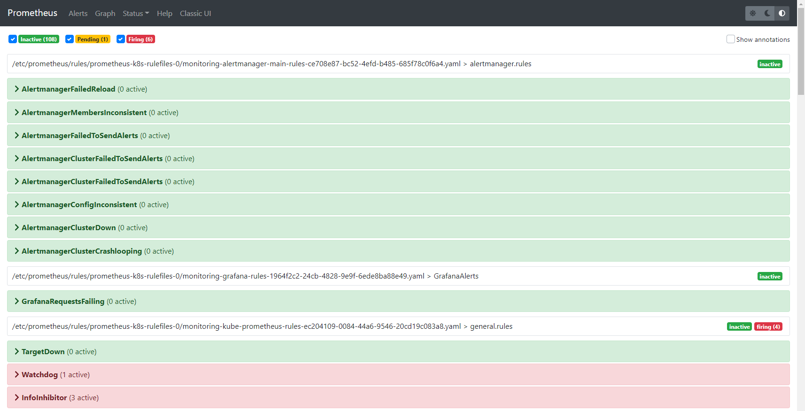
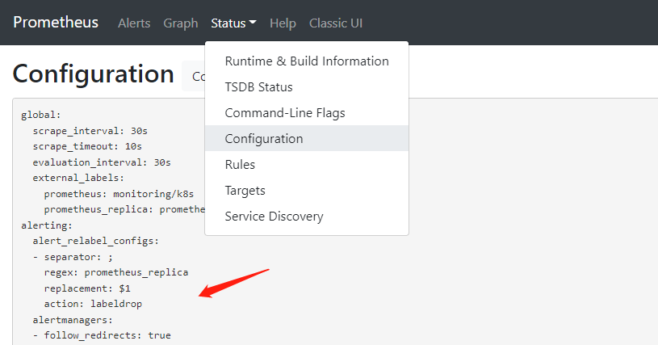
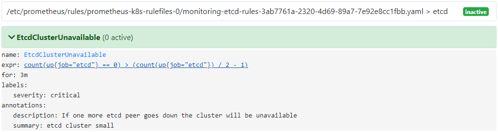
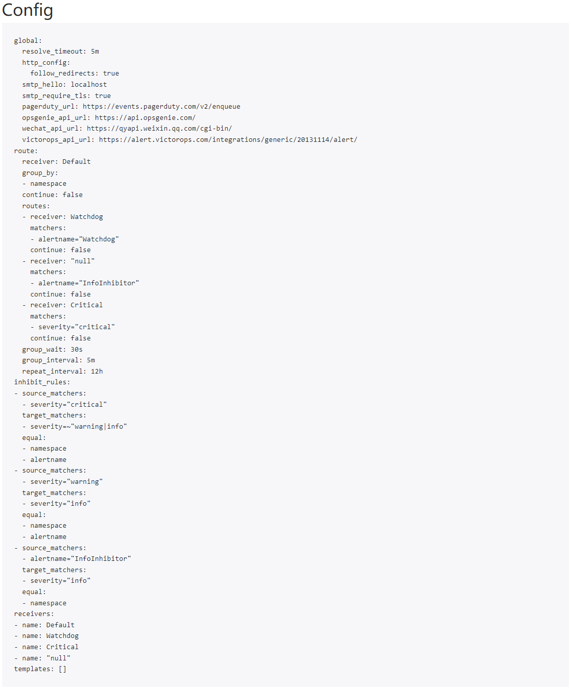
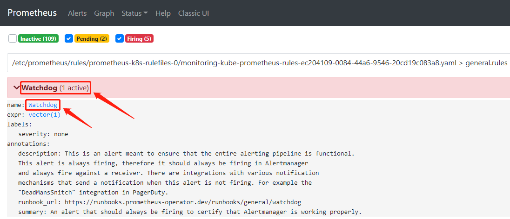
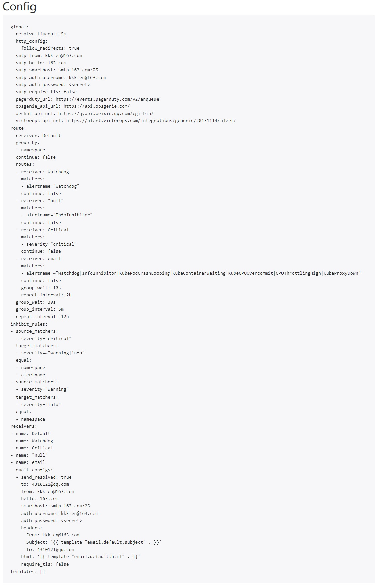
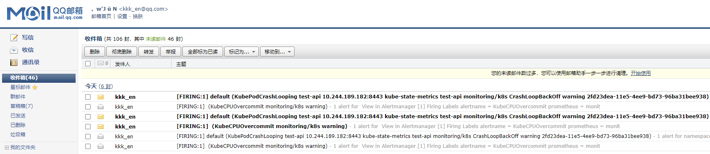
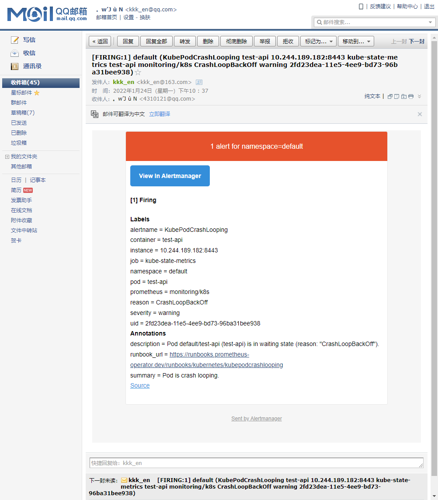

1. 配置 PrometheusRule

现在知道怎么⾃定义⼀个 ServiceMonitor 对象，但是如果需要⾃定义⼀个报警规则如何实现？现在去查看 Prometheus Dashboard 的 Alert ⻚⾯下⾯就已经有⼀些报警规则，还有⼀些已经触发规则：




但是这些报警信息是哪⾥来的呢？又应该⽤怎样的⽅式通知到相关人呢？之前使⽤⾃定义的⽅式可以在 Prometheus 的配置⽂件之中指定 AlertManager 实例和报警的 rules ⽂件，现在通过 Operator 部署可以在 Prometheus Dashboard 的 Configuration ⻚⾯下⾯查看关于 AlertManager 的配置：



```javascript
// ......
alerting:
  alert_relabel_configs:
  - separator: ;
    regex: prometheus_replica
    replacement: $1
    action: labeldrop
  // 可以看到alertmanagers实例的配置是通过⻆⾊为endpoints的kubernetes的服务发现机制获取的 
  alertmanagers:
  - follow_redirects: true
    scheme: http
    path_prefix: /
    timeout: 10s
    api_version: v2
    relabel_configs:
    - source_labels: [__meta_kubernetes_service_name]
      separator: ;
      // 匹配的是服务名为 alertmanager-main, 端⼝名为 web 的 Service 服务
      regex: alertmanager-main
      replacement: $1
      action: keep
    - source_labels: [__meta_kubernetes_endpoint_port_name]
      separator: ;
      regex: web
      replacement: $1
      action: keep
    kubernetes_sd_configs:
    - role: endpoints
      kubeconfig_file: ""
      follow_redirects: true
      namespaces:
        names:
        - monitoring
rule_files:
- /etc/prometheus/rules/prometheus-k8s-rulefiles-0/*.yaml
// ......
```


```javascript
// 查看 alertmanager-main 这个 Service
[root@centos7 63-PrometheusOperatoMonitoringETCD]# kubectl -n monitoring describe svc alertmanager-main
Name:                     alertmanager-main
Namespace:                monitoring
Labels:                   app.kubernetes.io/component=alert-router
                          app.kubernetes.io/instance=main
                          app.kubernetes.io/name=alertmanager
                          app.kubernetes.io/part-of=kube-prometheus
                          app.kubernetes.io/version=0.23.0
Annotations:              <none>
Selector:                 app.kubernetes.io/component=alert-router,app.kubernetes.io/instance=main,app.kubernetes.io/name=alertmanager,app.kubernetes.io/part-of=kube-prometheus
Type:                     NodePort
IP Family Policy:         SingleStack
IP Families:              IPv4
IP:                       10.101.59.194
IPs:                      10.101.59.194
Port:                     web  9093/TCP
TargetPort:               web/TCP
NodePort:                 web  31828/TCP
Endpoints:                10.244.189.134:9093,10.244.189.139:9093,10.244.189.149:9093
Port:                     reloader-web  8080/TCP
TargetPort:               reloader-web/TCP
NodePort:                 reloader-web  31168/TCP
Endpoints:                10.244.189.134:8080,10.244.189.139:8080,10.244.189.149:8080
Session Affinity:         ClientIP
External Traffic Policy:  Cluster
Events:                   <none>
```

可以看到服务名正是 alertmanager-main，Port 定义的名称也是 web，符合上⾯的规则，所以 Prometheus 和 AlertManager 组件就正确关联上了。⽽对应的报警规则⽂件位于：/etc/prometheus/rules/prometheus-k8s-rulefiles-0/ ⽬录下⾯所有的 YAML ⽂件。可以进⼊ Prometheus 的 Pod 中验证下该⽬录下⾯是否有 YAML ⽂件：

```javascript
[root@centos7 63-PrometheusOperatoMonitoringETCD]# kubectl -n monitoring exec prometheus-k8s-0 -i -t -- sh -il
/prometheus $ ls -ls /etc/prometheus/rules/prometheus-k8s-rulefiles-0/
total 0
     0 lrwxrwxrwx    1 root     2000            83 Jan 23 03:11 monitoring-alertmanager-main-rules-ce708e87-bc52-4efd-b485-685f78c0f6a4.yaml -> ..data/monitoring-alertmanager-main-rules-ce708e87-bc52-4efd-b485-685f78c0f6a4.yaml
     0 lrwxrwxrwx    1 root     2000            73 Jan 23 03:11 monitoring-grafana-rules-1964f2c2-24cb-4828-9e9f-6ede8ba88e49.yaml -> ..data/monitoring-grafana-rules-1964f2c2-24cb-4828-9e9f-6ede8ba88e49.yaml
     0 lrwxrwxrwx    1 root     2000            81 Jan 23 03:11 monitoring-kube-prometheus-rules-ec204109-0084-44a6-9546-20cd19c083a8.yaml -> ..data/monitoring-kube-prometheus-rules-ec204109-0084-44a6-9546-20cd19c083a8.yaml
     0 lrwxrwxrwx    1 root     2000            84 Jan 23 03:11 monitoring-kube-state-metrics-rules-6f076c28-ecd3-4af5-b463-b360df572976.yaml -> ..data/monitoring-kube-state-metrics-rules-6f076c28-ecd3-4af5-b463-b360df572976.yaml
     0 lrwxrwxrwx    1 root     2000            87 Jan 23 03:11 monitoring-kubernetes-monitoring-rules-25836703-389a-4217-8ceb-36f8dcc50b7a.yaml -> ..data/monitoring-kubernetes-monitoring-rules-25836703-389a-4217-8ceb-36f8dcc50b7a.yaml
     0 lrwxrwxrwx    1 root     2000            79 Jan 23 03:11 monitoring-node-exporter-rules-2eb26972-ed47-41d4-abca-b49a67d44c8f.yaml -> ..data/monitoring-node-exporter-rules-2eb26972-ed47-41d4-abca-b49a67d44c8f.yaml
     0 lrwxrwxrwx    1 root     2000            91 Jan 23 03:11 monitoring-prometheus-k8s-prometheus-rules-15589d2d-053c-45ad-933b-37754d1e2034.yaml -> ..data/monitoring-prometheus-k8s-prometheus-rules-15589d2d-053c-45ad-933b-37754d1e2034.yaml
     0 lrwxrwxrwx    1 root     2000            85 Jan 23 03:11 monitoring-prometheus-operator-rules-c580d7f6-aa54-49ff-b26b-f5f48ff58019.yaml -> ..data/monitoring-prometheus-operator-rules-c580d7f6-aa54-49ff-b26b-f5f48ff58019.yaml
/prometheus $ cat /etc/prometheus/rules/prometheus-k8s-rulefiles-0/monitoring-prometheus-k8s-prometheus-rules-15589d2d-053c-45ad-933b-37754d1e2034.yaml 
groups:
- name: prometheus
  rules:
  - alert: PrometheusBadConfig
    annotations:
      description: Prometheus {{$labels.namespace}}/{{$labels.pod}} has failed to
        reload its configuration.
      runbook_url: https://runbooks.prometheus-operator.dev/runbooks/prometheus/prometheusbadconfig
      summary: Failed Prometheus configuration reload.
    expr: |
      # Without max_over_time, failed scrapes could create false negatives, see
      # https://www.robustperception.io/alerting-on-gauges-in-prometheus-2-0 for details.
      max_over_time(prometheus_config_last_reload_successful{job="prometheus-k8s",namespace="monitoring"}[5m]) == 0
    for: 10m
    // ......
/prometheus $ exit

// monitoring-prometheus-k8s-prometheus-rules-15589d2d-053c-45ad-933b-37754d1e2034.yaml
// 上面这个yaml文件实际上就是之前创建的⼀个 prometheus-prometheusRule.yaml ⽂件包含的.

// prometheus-prometheusRule.yaml 文件在 kube-prometheus 项目的 manifests 下面
//  原路径为：......\manifests\prometheus-prometheusRule.yaml
//  归类后的路径为：......\manifests\rules\prometheus-prometheusRule.yaml
[root@centos7 63-PrometheusOperatoMonitoringETCD]# cat /k8s-yaml/62-PrometheusOperator/manifests/rules/prometheus-prometheusRule.yaml
apiVersion: monitoring.coreos.com/v1
kind: PrometheusRule
metadata:
  labels:
    app.kubernetes.io/component: prometheus
    app.kubernetes.io/instance: k8s
    app.kubernetes.io/name: prometheus
    app.kubernetes.io/part-of: kube-prometheus
    app.kubernetes.io/version: 2.32.1
    prometheus: k8s
    role: alert-rules
  name: prometheus-k8s-prometheus-rules
  namespace: monitoring
spec:
  groups:
  - name: prometheus
    rules:
    - alert: PrometheusBadConfig
      annotations:
        description: Prometheus {{$labels.namespace}}/{{$labels.pod}} has failed to
          reload its configuration.
        runbook_url: https://runbooks.prometheus-operator.dev/runbooks/prometheus/prometheusbadconfig
        summary: Failed Prometheus configuration reload.
      expr: |
        # Without max_over_time, failed scrapes could create false negatives, see
        # https://www.robustperception.io/alerting-on-gauges-in-prometheus-2-0 for details.
        max_over_time(prometheus_config_last_reload_successful{job="prometheus-k8s",namespace="monitoring"}[5m]) == 0
      for: 10m
      // ......
```

可以看到 PrometheusRule 的 name 为 prometheus-k8s-prometheus-rules，namespace 为 monitoring，可以猜想到创建⼀个 PrometheusRule 资源对象后，会⾃动在上⾯的 prometheus-k8s-rulefiles-0 ⽬录下⾯⽣成⼀个对应的 <namespace>-<name>-<随机字符串>.yaml ⽂件，所以如果以后需要⾃定义⼀个报警选项的话，只需要定义⼀个 PrometheusRule 资源对象即可。⾄于为什么 Prometheus 能够识别这个 PrometheusRule 资源对象，这就需要查看创建的 prometheus 这个资源对象了，⾥⾯有⾮常重要的⼀个属性 ruleSelector，⽤来匹配 rule 规则的过滤器。

```javascript
[root@centos7 aaron]# kubectl -n monitoring get prometheus
NAME   VERSION   REPLICAS   AGE
k8s    2.32.1    2          8d

// 可以看到这里ruleSelector的配置是空,说明只要是PrometheusRule资源对象都可以匹配
[root@centos7 aaron]# kubectl -n monitoring get prometheus k8s -o yaml
apiVersion: monitoring.coreos.com/v1
kind: Prometheus
metadata:
  // ......
  name: k8s
  namespace: monitoring
spec:
  // ......
  ruleSelector: {}
  secrets:
  - etcd-certs


// 注意：如果 ruleSelector 是下面这样的配置,就要求匹配具有 prometheus=k8s 和 role=alert-rules 标签的PrometheusRule资源对象
ruleSelector:
  matchLabels:
    prometheus: k8s
    role: alert-rules


```


所以要想⾃定义⼀个报警规则，只需要创建⼀个 PrometheusRule 对象，现在添加⼀个 etcd 是否可⽤的报警，都知道 etcd 整个集群有⼀半以上的节点可⽤的话集群就是可⽤的，所以判断如果不可⽤的 etcd 数量超过了⼀半那么就触发报警，创建⽂件：

[prometheus-etcdRules.yaml](attachments/97F1EDF8ECE544A69CBE5B473AABDBA5prometheus-etcdrules.yaml)

```javascript
 # prometheus-etcdRules.yaml
 
apiVersion: monitoring.coreos.com/v1
kind: PrometheusRule
metadata:
  labels:
    #prometheus: k8s
    #role: alert-rules
  name: etcd-rules
  namespace: monitoring
spec:
  groups:
  - name: etcd
    rules:
    - alert: EtcdClusterUnavailable
      annotations:
        summary: etcd cluster small
        description: If one more etcd peer goes down the cluster will be unavailable
      expr: |
        count(up{job="etcd"} == 0) > (count(up{job="etcd"}) / 2 - 1)
      for: 3m
      labels:
        severity: critical
```


```javascript
// 创建完成后,隔⼀会⼉再去容器中查看 rules ⽂件夹:
[root@centos7 63-PrometheusOperatoMonitoringETCD]# kubectl apply -f prometheus-etcdRules.yaml 
prometheusrule.monitoring.coreos.com/etcd-rules created 

// 可以看到已经自动创建了一个 monitoring-etcd-rules-3ab7761a-2320-4d69-89a7-7e92e8cc1fbb.yaml 文件
// 说明创建的 rule ⽂件已经被注⼊到了对应的 rulefiles ⽂件夹下⾯,证明上⾯的设想是正确的
[root@centos7 63-PrometheusOperatoMonitoringETCD]# kubectl -n monitoring exec prometheus-k8s-0 -i -t -- sh -il
/prometheus $ ls /etc/prometheus/rules/prometheus-k8s-rulefiles-0/ | grep etcd
monitoring-etcd-rules-3ab7761a-2320-4d69-89a7-7e92e8cc1fbb.yaml
/prometheus $ exit
```


在 Prometheus Dashboard 的 Alert ⻚⾯可以查看到上⾯新建的报警规则 ：




2.配置 Email 报警

添加⼀个报警规则配置项后，就可以通过 AlertManager 的配置⽂件去配置各种报警接收器，但现在是通过 Operator 提供的 alertmanager 资源对象创建的组件，⾸先应该将 alertmanager-main 这个 Service 改为 NodePort 类型，修改完成后可以在 Alertmanager ⻚⾯的 status 路径下⾯查看 AlertManager 的配置信息:

```javascript
// 下面这一步在安装 prometheus-operator 的时候就已经做了.
// 将 alertmanager-main 这个 Service 改为 NodePort 类型.

// 查看 Alertmanager ⻚⾯的 status 路径下的config配置: http://192.168.32.100:31828/#/status
// 如下图:
```




```javascript
// config 配置实际来源于之前创建的 alertmanager-secret.yaml 文件
// https://github.com/prometheus-operator/kube-prometheus/blob/main/manifests/alertmanager-secret.yaml

# ....../manifests/alertmanager-secret.yaml
apiVersion: v1
kind: Secret
metadata:
  labels:
    app.kubernetes.io/component: alert-router
    app.kubernetes.io/instance: main
    app.kubernetes.io/name: alertmanager
    app.kubernetes.io/part-of: kube-prometheus
    app.kubernetes.io/version: 0.23.0
  name: alertmanager-main
  namespace: monitoring
stringData:
  alertmanager.yaml: |-
    "global":
      "resolve_timeout": "5m"
    "inhibit_rules":
    - "equal":
      - "namespace"
      - "alertname"
      "source_matchers":
      - "severity = critical"
      "target_matchers":
      - "severity =~ warning|info"
    - "equal":
      - "namespace"
      - "alertname"
      "source_matchers":
      - "severity = warning"
      "target_matchers":
      - "severity = info"
    - "equal":
      - "namespace"
      "source_matchers":
      - "alertname = InfoInhibitor"
      "target_matchers":
      - "severity = info"
    "receivers":
    - "name": "Default"
    - "name": "Watchdog"
    - "name": "Critical"
    - "name": "null"
    "route":
      "group_by":
      - "namespace"
      "group_interval": "5m"
      "group_wait": "30s"
      "receiver": "Default"
      "repeat_interval": "12h"
      "routes":
      - "matchers":
        - "alertname = Watchdog"
        "receiver": "Watchdog"
      - "matchers":
        - "alertname = InfoInhibitor"
        "receiver": "null"
      - "matchers":
        - "severity = critical"
        "receiver": "Critical"
type: Opaque
```


可以看到 alertmanager-secret.yaml 文件内容和 Alertmanager ⻚⾯ status 路径下⾯查到的配置信息是⼀致的，所以如果想要添加⾃⼰的接收器或者模板消息就可以更改这个⽂件：

[alertmanager-secret.yaml](attachments/4DC16B39C99B45C4AE6F5BEE12FD974Ealertmanager-secret.yaml)

```javascript
# ....../manifests/alertmanager-secret.yaml
apiVersion: v1
kind: Secret
metadata:
  labels:
    app.kubernetes.io/component: alert-router
    app.kubernetes.io/instance: main
    app.kubernetes.io/name: alertmanager
    app.kubernetes.io/part-of: kube-prometheus
    app.kubernetes.io/version: 0.23.0
  name: alertmanager-main
  namespace: monitoring
stringData:
  alertmanager.yaml: |-
    "global":
      "resolve_timeout": "5m"
      "smtp_smarthost": smtp.163.com:25
      "smtp_from": kkk_en@163.com
      "smtp_auth_username": kkk_en@163.com
      "smtp_auth_password": WZOGCXPPOPOSQWMJ
      "smtp_hello": 163.com
      "smtp_require_tls": false
    "inhibit_rules":
    - "equal":
      - "namespace"
      - "alertname"
      "source_matchers":
      - "severity = critical"
      "target_matchers":
      - "severity =~ warning|info"
    - "equal":
      - "namespace"
      - "alertname"
      "source_matchers":
      - "severity = warning"
      "target_matchers":
      - "severity = info"
    - "equal":
      - "namespace"
      "source_matchers":
      - "alertname = InfoInhibitor"
      "target_matchers":
      - "severity = info"
    "receivers":
    - "name": "Default"
    - "name": "Watchdog"
    - "name": "Critical"
    - "name": "null"
    - "name": "email"
      "email_configs":
      - "to": "4310121@qq.com"
        "send_resolved": true
    "route":
      "group_by":
      - "namespace"
      "group_interval": "5m"
      "group_wait": "30s"
      "receiver": "Default"
      "repeat_interval": "12h"
      "routes":
      - "matchers":
        - "alertname = Watchdog"
        "receiver": "Watchdog"
      - "matchers":
        - "alertname = InfoInhibitor"
        "receiver": "null"
      - "matchers":
        - "severity = critical"
        "receiver": "Critical"
      - "receiver": "email"
        "repeat_interval": "2h"
        "group_wait": "10s"
        "matchers":
        - "alertname =~ Watchdog|InfoInhibitor|KubePodCrashLooping|KubeContainerWaiting|KubeCPUOvercommit|CPUThrottlingHigh|KubeProxyDown"
type: Opaque

```

这里添加了一个接收器，通过邮箱进⾏发送。

```javascript
// 注意点1:
// - "alertname =~ Watchdog|InfoInhibitor|KubePodCrashLooping|KubeContainerWaiting|KubeCPUOvercommit|CPUThrottlingHigh|KubeProxyDown"    
// 这项配置中"|"的符号表示 或, alertname=Watchdog 或 alertname=InfoInhibitor 等
// 更多配置规则查询官网: https://prometheus.io/docs/alerting/latest/configuration/

// 注意点2:
// "alertname" 实际上就是 "<xxx>-<xxx>Rule.yaml"文件中 alert 字段,
// 比如 ....../manifests/kubernetesControlPlane-prometheusRule.yaml 文件中:
	apiVersion: monitoring.coreos.com/v1
	kind: PrometheusRule
	metadata:
	  labels:
		app.kubernetes.io/name: kube-prometheus
		app.kubernetes.io/part-of: kube-prometheus
		prometheus: k8s
		role: alert-rules
	  name: kubernetes-monitoring-rules
	  namespace: monitoring
	spec:
	  groups:
	  - name: kubernetes-apps
		rules:
		# 这里的 alert 就相当于 config 中的 alertname
		- alert: KubePodCrashLooping
		  //......
// 打开 Prometheus 的 alerts 页面也能看到 alertname 字段,如下图:
```




```javascript
[root@centos7 63-PrometheusOperatoMonitoringETCD]# kubectl -n monitoring get svc | grep alertmanager
alertmanager-main       NodePort    10.101.59.194    <none>        9093:31828/TCP,8080:31168/TCP   9d
alertmanager-operated   ClusterIP   None             <none>        9093/TCP,9094/TCP,9094/UDP      9d
[root@centos7 63-PrometheusOperatoMonitoringETCD]# 

// 更新 alertmanager-secret.yaml
// 运行下面命令后 alertmanager 的 config 会自动更新,但是会稍等一会(内部机制可能是每隔一段时间检测更新)
[root@centos7 63-PrometheusOperatoMonitoringETCD]# kubectl apply -f alertmanager-secret.yaml 
secret/alertmanager-main configured

// 运行下面命令后 alertmanager 的 config 会立即更新
[root@centos7 63-PrometheusOperatoMonitoringETCD]# curl -X POST "http://10.101.59.194:9093/-/reload"
```


再次查看 alertManager ⻚⾯的 status ⻚⾯的配置信息发现已经变成上⾯的配置信息：




同样邮箱中也会收到报警信息：







3.配置 钉钉 报警

```javascript
# ....../manifests/alertmanager-secret.yaml
apiVersion: v1
kind: Secret
metadata:
  labels:
    //......
  name: alertmanager-main
  namespace: monitoring
stringData:
  alertmanager.yaml: |-
    "global":
      //......
    "inhibit_rules":
    //......
    "receivers":
    - "name": "Default"
    //......
    - "name": "email"
      "email_configs":
      - "to": "4310121@qq.com"
        "send_resolved": true
    - "name": "webhook"
      "webhook_configs":
      - "url": "http://dingtalk-hook.kube-ops:5000"
        "send_resolved": true
    "route":
      "group_by":
      - "namespace"
      "group_interval": "5m"
      "group_wait": "30s"
      "receiver": "Default"
      "repeat_interval": "12h"
      "routes":
      //......
      - "receiver": "email"
        "repeat_interval": "2h"
        "group_wait": "10s"
        "matchers":
        - "alertname =~ KubeCPUOvercommit|CPUThrottlingHigh|KubeProxyDown"
      - "receiver": "webhook"
        "repeat_interval": "2h"
        "group_wait": "10s"
        "matchers":
        - "alertname =~ Watchdog|InfoInhibitor|KubePodCrashLooping|KubeContainerWaiting"
type: Opaque
```


4.模板(.tmpl⽂件)

AlertManager 配置文件中也可以使⽤模板(.tmpl⽂件)，模板会被放置到与配置⽂件相同的路径，当然要使⽤这些模板⽂件，还需要在 alertmanager.yaml 配 置⽂件中指定。

```javascript
# ....../manifests/alertmanager-secret.yaml
apiVersion: v1
kind: Secret
metadata:
  labels:
    //......
  name: alertmanager-main
  namespace: monitoring
stringData:
  alertmanager.yaml: |-
    "global":
      //......
    "inhibit_rules":
    //......
    "receivers":
    - "name": "Default"
    //......
    - "name": "email"
      "email_configs":
      - "to": "4310121@qq.com"
        "send_resolved": true
    - "name": "webhook"
      "webhook_configs":
      - "url": "http://dingtalk-hook.kube-ops:5000"
        "send_resolved": true
    "route":
      "group_by":
      - "namespace"
      "group_interval": "5m"
      "group_wait": "30s"
      "receiver": "Default"
      "repeat_interval": "12h"
      "routes":
      //......
      - "receiver": "email"
        "repeat_interval": "2h"
        "group_wait": "10s"
        "matchers":
        - "alertname =~ KubeCPUOvercommit|CPUThrottlingHigh|KubeProxyDown"
      - "receiver": "webhook"
        "repeat_interval": "2h"
        "group_wait": "10s"
        "matchers":
        - "alertname =~ Watchdog|InfoInhibitor|KubePodCrashLooping|KubeContainerWaiting"
    "templates":
    - "*.tmpl"
  template_1.tmpl: |-
    //......
  template_2.tmpl: |-
    //......

type: Opaque
```

创建成功后，alertmanager.yaml 和 模板文件 将会挂载到 AlertManager 对象创建的 AlertManager Pod 中去。


```javascript
// alertmanager 的更多配置规则查询官网: 
https://prometheus.io/docs/alerting/latest/configuration/
// 关于模板的更多配置信息查询官网:
https://prometheus.io/blog/2016/03/03/custom-alertmanager-templates/
https://prometheus.io/docs/alerting/latest/notification_examples/#notification-template-examples
https://prometheus.io/docs/prometheus/latest/configuration/template_reference/#template-reference
```

