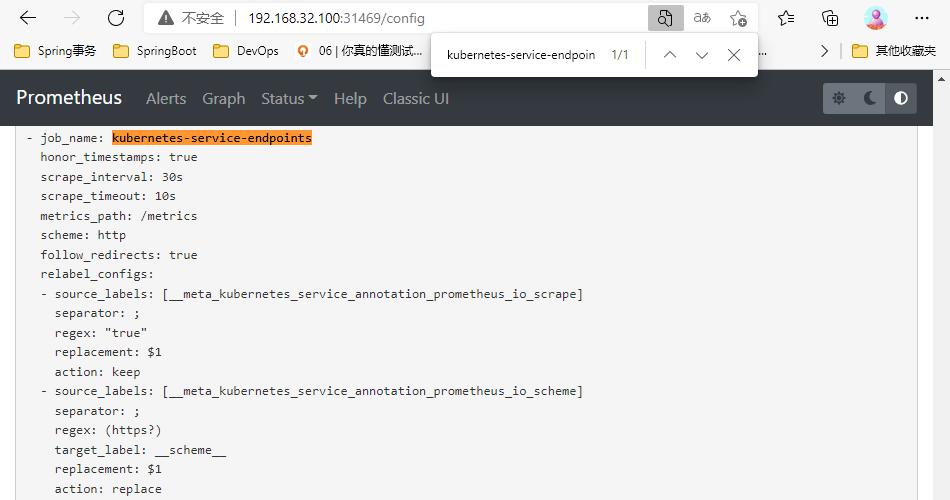
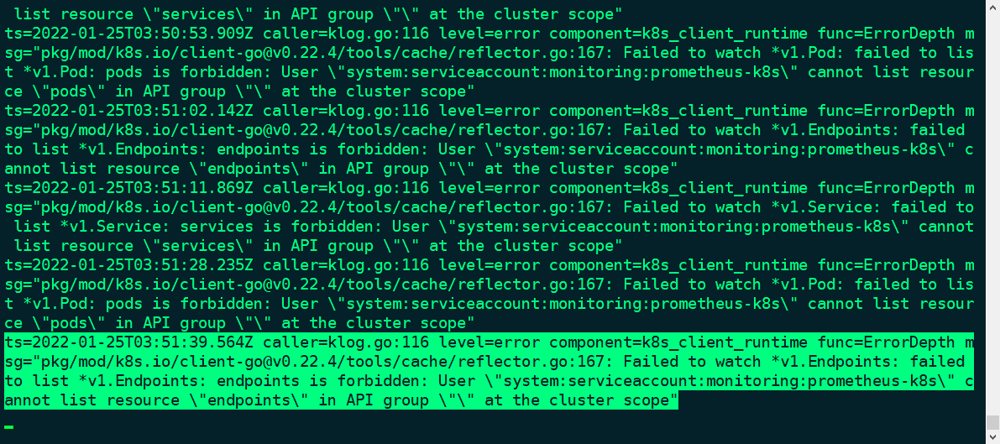
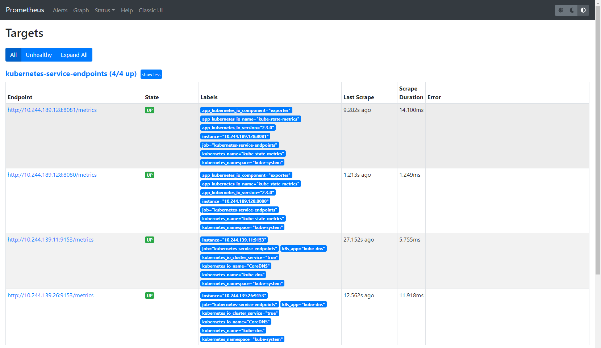
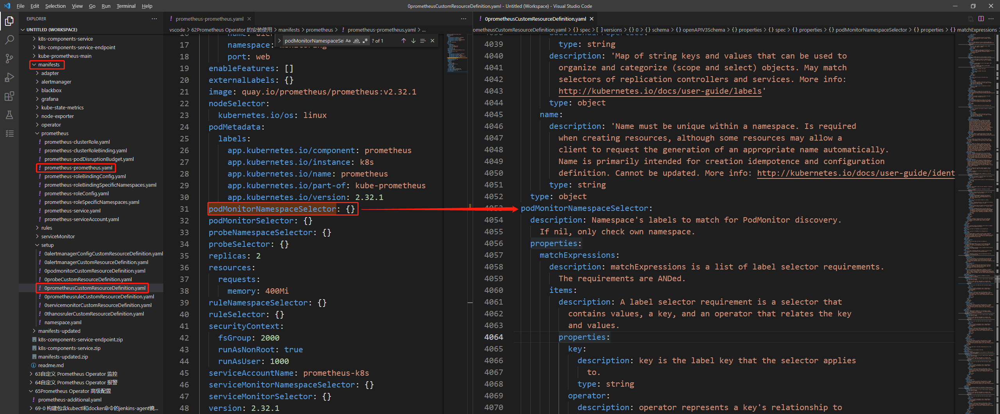

1.⾃动发现配置

前面了解到如何在 Prometheus Operator 中⾃定义⼀个监控选项，以及⾃定义报警规则的使⽤。本节介绍⾃动发现功能，如果在 Kubernetes 集群中有很多的 Service/Pod，都需要⼀个⼀个的去建⽴⼀个对应的 ServiceMonitor 对象来进⾏监控，这样⼜变得麻烦起来。为解决这个问题， Prometheus Operator 提供了⼀个额外的抓取配置的来解决这个问题，可以通过添加额外的配置来进⾏服务发现进⾏⾃动监控。

和前⾯⾃定义⽅式⼀样，想要 Prometheus Operator 去⾃动发现并监控集群中具有 prometheus.io/scrape=true 这个 annotations 的 Service，就需要在 Service 的 annotation 区域添加 prometheus.io/scrape=true 的声明，之前定义的 Prometheus 配置如下：

```javascript
# 57Kubernetes 常用资源对象监控\prometheus-service\prometheus-cm.yaml
---
apiVersion: v1
kind: ConfigMap
metadata:
  name: prometheus-config
  namespace: kube-ops
data:
  prometheus.yml: |
    global:
      scrape_interval: 15s
      scrape_timeout: 15s
    scrape_configs:
    //......
    # 监控普通类型的 Service
    - job_name: 'kubernetes-service-endpoints'
      kubernetes_sd_configs:
      - role: endpoints
      relabel_configs:
      - source_labels: [__meta_kubernetes_service_annotation_prometheus_io_scrape]
        action: keep
        regex: true
      - source_labels: [__meta_kubernetes_service_annotation_prometheus_io_scheme]
        action: replace
        target_label: __scheme__
        regex: (https?)
      - source_labels: [__meta_kubernetes_service_annotation_prometheus_io_path]
        action: replace
        target_label: __metrics_path__
        regex: (.+)
      - source_labels: [__address__, __meta_kubernetes_service_annotation_prometheus_io_port]
        action: replace
        target_label: __address__
        regex: ([^:]+)(?::\d+)?;(\d+)
        replacement: $1:$2
      - action: labelmap
        regex: __meta_kubernetes_service_label_(.+)
      - source_labels: [__meta_kubernetes_namespace]
        action: replace
        target_label: kubernetes_namespace
      - source_labels: [__meta_kubernetes_service_name]
        action: replace
        target_label: kubernetes_name 
```


第一步:

将上⾯⽂件中 data => prometheus.yml => scrape_configs 下面的数据直接保存为一个YAML文件，然后通过这个⽂件创建⼀个对应的 Secret 对象：

[prometheus-additional.yaml](attachments/80CD2C1D875143A89BE847E4579A2143prometheus-additional.yaml)

```javascript
# prometheus-additional.yaml
- job_name: 'kubernetes-service-endpoints'
  kubernetes_sd_configs:
  - role: endpoints
  relabel_configs:
  - source_labels: [__meta_kubernetes_service_annotation_prometheus_io_scrape]
    action: keep
    regex: true
  - source_labels: [__meta_kubernetes_service_annotation_prometheus_io_scheme]
    action: replace
    target_label: __scheme__
    regex: (https?)
  - source_labels: [__meta_kubernetes_service_annotation_prometheus_io_path]
    action: replace
    target_label: __metrics_path__
    regex: (.+)
  - source_labels: [__address__, __meta_kubernetes_service_annotation_prometheus_io_port]
    action: replace
    target_label: __address__
    regex: ([^:]+)(?::\d+)?;(\d+)
    replacement: $1:$2
  - action: labelmap
    regex: __meta_kubernetes_service_label_(.+)
  - source_labels: [__meta_kubernetes_namespace]
    action: replace
    target_label: kubernetes_namespace
  - source_labels: [__meta_kubernetes_service_name]
    action: replace
    target_label: kubernetes_name
```


```javascript
// 创建 prometheus-additional.yaml 文件对应的 secret 对象
[root@centos7 65]# ls
prometheus-additional.yaml
[root@centos7 65]# kubectl -n monitoring create secret generic additional-configs --from-file=prometheus-additional.yaml
secret/additional-configs created

// 创建完成后，会将上⾯配置信息进⾏ base64 编码后作为 prometheus-additional.yaml 这个 key 对应的值存在：
[root@centos7 65]# kubectl -n monitoring get secret additional-configs -o yaml
apiVersion: v1
data:
  prometheus-additional.yaml: LSBqb2JfbmFtZTogJ2t1YmVybmV0ZXMtc2VydmljZS1lbmRwb2ludHMnDQogIGt1YmVybmV0ZXNfc2RfY29uZmlnczoNCiAgLSByb2xlOiBlbmRwb2ludHMNCiAgcmVsYWJlbF9jb25maWdzOg0KICAtIHNvdXJjZV9sYWJlbHM6IFtfX21ldGFfa3ViZXJuZXRlc19zZXJ2aWNlX2Fubm90YXRpb25fcHJvbWV0aGV1c19pb19zY3JhcGVdDQogICAgYWN0aW9uOiBrZWVwDQogICAgcmVnZXg6IHRydWUNCiAgLSBzb3VyY2VfbGFiZWxzOiBbX19tZXRhX2t1YmVybmV0ZXNfc2VydmljZV9hbm5vdGF0aW9uX3Byb21ldGhldXNfaW9fc2NoZW1lXQ0KICAgIGFjdGlvbjogcmVwbGFjZQ0KICAgIHRhcmdldF9sYWJlbDogX19zY2hlbWVfXw0KICAgIHJlZ2V4OiAoaHR0cHM/KQ0KICAtIHNvdXJjZV9sYWJlbHM6IFtfX21ldGFfa3ViZXJuZXRlc19zZXJ2aWNlX2Fubm90YXRpb25fcHJvbWV0aGV1c19pb19wYXRoXQ0KICAgIGFjdGlvbjogcmVwbGFjZQ0KICAgIHRhcmdldF9sYWJlbDogX19tZXRyaWNzX3BhdGhfXw0KICAgIHJlZ2V4OiAoLispDQogIC0gc291cmNlX2xhYmVsczogW19fYWRkcmVzc19fLCBfX21ldGFfa3ViZXJuZXRlc19zZXJ2aWNlX2Fubm90YXRpb25fcHJvbWV0aGV1c19pb19wb3J0XQ0KICAgIGFjdGlvbjogcmVwbGFjZQ0KICAgIHRhcmdldF9sYWJlbDogX19hZGRyZXNzX18NCiAgICByZWdleDogKFteOl0rKSg/OjpcZCspPzsoXGQrKQ0KICAgIHJlcGxhY2VtZW50OiAkMTokMg0KICAtIGFjdGlvbjogbGFiZWxtYXANCiAgICByZWdleDogX19tZXRhX2t1YmVybmV0ZXNfc2VydmljZV9sYWJlbF8oLispDQogIC0gc291cmNlX2xhYmVsczogW19fbWV0YV9rdWJlcm5ldGVzX25hbWVzcGFjZV0NCiAgICBhY3Rpb246IHJlcGxhY2UNCiAgICB0YXJnZXRfbGFiZWw6IGt1YmVybmV0ZXNfbmFtZXNwYWNlDQogIC0gc291cmNlX2xhYmVsczogW19fbWV0YV9rdWJlcm5ldGVzX3NlcnZpY2VfbmFtZV0NCiAgICBhY3Rpb246IHJlcGxhY2UNCiAgICB0YXJnZXRfbGFiZWw6IGt1YmVybmV0ZXNfbmFtZSA=
kind: Secret
metadata:
  creationTimestamp: "2022-01-25T03:19:29Z"
  name: additional-configs
  namespace: monitoring
  resourceVersion: "2109009"
  selfLink: /api/v1/namespaces/monitoring/secrets/additional-configs
  uid: 67ed7c03-c605-4a2a-93e8-2cd6bff2e2aa
type: Opaque
[root@centos7 65]#
```


第二步:

然后在声明 prometheus 的资源对象⽂件中添加上这个额外的配置：

```javascript
// 修改配置有两种方式:
// 第1种: 修改 ....\manifests\prometheus-prometheus.yaml 文件,修改完成后 kubectl apply -f prometheus-prometheus.yaml
// 第2种: 使用 kubectl edit ......

// 这里使用第2种方式:
[root@centos7 65]# kubectl -n monitoring get prometheus
NAME   VERSION   REPLICAS   AGE
k8s    2.32.1    2          9d
// 修改完成后就会直接更新 prometheus 这个 CRD 资源对象
[root@centos7 65]# kubectl -n monitoring edit prometheus k8s
apiVersion: monitoring.coreos.com/v1
kind: Prometheus
metadata:
  // ......
spec:
  // ......
  ruleSelector: {}
  // 添加如下 secrets 属性:
  secrets:
  - etcd-certs
  additionalScrapeConfigs:
    name: additional-configs
    key: prometheus-additional.yaml
  securityContext:
    fsGroup: 2000
    runAsNonRoot: true
    runAsUser: 1000
  serviceAccountName: prometheus-k8s
  // ......
prometheus.monitoring.coreos.com/k8s edited

// 查看配置是否修改成功
[root@centos7 65]# kubectl -n monitoring get prometheus k8s -o yaml

//////////////////////////////////////////////////////////////////////////////////////////////////////

// 注意：下面内容对于解决权限问题非常重要
// 从 prometheus 这个 CRD 资源对象可以看到 Prometheus 绑定了⼀个名为 prometheus-k8s 的 ServiceAccount 对象
[root@centos7 65]# kubectl -n monitoring get RoleBinding 
NAME                    ROLE                         AGE
prometheus-k8s          Role/prometheus-k8s          9d
prometheus-k8s-config   Role/prometheus-k8s-config   9d
[root@centos7 65]# kubectl -n monitoring get RoleBinding prometheus-k8s -o yaml
apiVersion: rbac.authorization.k8s.io/v1
kind: RoleBinding
metadata:
  // ......
// 可以看到 prometheus-k8s 这个 ServiceAccount 对象绑定的是⼀个名为 prometheus-k8s 的 ClusterRole
roleRef:
  apiGroup: rbac.authorization.k8s.io
  kind: Role
  name: prometheus-k8s
subjects:
- kind: ServiceAccount
  name: prometheus-k8s
  namespace: monitoring

```


隔⼀⼩会⼉就可以前往 Prometheus 的 Dashboard 中查看配置是否⽣效：



在 Prometheus Dashboard 的配置⻚⾯下⾯可以看到已经有了对应的的配置信息了，但是切换到 targets ⻚⾯下⾯却并没有发现对应的监控任务。

```javascript
[root@centos7 65]# kubectl -n monitoring  get pod | grep prometheus-k8s
prometheus-k8s-0                       2/2     Running   6 (11h ago)    2d
prometheus-k8s-1                       2/2     Running   6 (11h ago)    2d

//查看 Prometheus 的 Pod ⽇志,如下图:
[root@centos7 65]# kubectl -n monitoring logs -f prometheus-k8s-0 prometheus
```



可以看到出现了很多错误⽇志，都是 xxx is forbidden ，这说明是 RBAC 权限的问题，通过 prometheus 资源对象的配置可以知道 Prometheus 绑定了⼀个名为 prometheus-k8s 的 ServiceAccount 对象，⽽这个对象绑定的是⼀个名为 prometheus-k8s 的 ClusterRole：

```javascript
[root@centos7 65]# kubectl -n monitoring get clusterrole | grep prometheus-k8s
prometheus-k8s                                                         2022-01-15T13:19:49Z

// prometheus-k8s 这个 ClusterRole 对象对应的源码文件为"......\manifests\prometheus-clusterRole.yaml"
[root@centos7 65]# kubectl -n monitoring get clusterrole prometheus-k8s -o yaml
apiVersion: rbac.authorization.k8s.io/v1
kind: ClusterRole
metadata:
  //......
  name: prometheus-k8s
rules:
- apiGroups:
  - ""
  resources:
  - nodes/metrics
  verbs:
  - get
- nonResourceURLs:
  - /metrics
  verbs:
  - get
[root@centos7 65]#
```

上⾯的权限规则中可以明显看到没有对 Service 或者 Pod 的 list 权限，所以报错了，要解决这个 问题，只需要添加上需要的权限即可：

```javascript
// 这里添加权限同样有两种方式:
// 第1种: 修改"......\manifests\prometheus-clusterRole.yaml"文件,修改完成后 kubectl apply -f ......
// 第2种: 使用 kubectl edit ......

// 这里使用第2种方式:
 [root@centos7 65]# kubectl -n monitoring edit clusterrole prometheus-k8s
apiVersion: rbac.authorization.k8s.io/v1
kind: ClusterRole
metadata:
  //......
  name: prometheus-k8s
rules:
# 添加权限
- apiGroups:
  - ""
  resources:
  - nodes
  - services
  - endpoints
  - pods
  - nodes/proxy
  verbs:
  - get
  - list
  - watch
- apiGroups:
  - ""
  resources:
  - nodes/metrics
  verbs:
  - get
- nonResourceURLs:
  - /metrics
  verbs:
  - get
clusterrole.rbac.authorization.k8s.io/prometheus-k8s edited

// 查看下是否添加成功
[root@centos7 65]# kubectl -n monitoring get clusterrole prometheus-k8s -o yaml
```


隔一小会到 Prometheus 的 targets 页面，不出问题的话就可以在 targets 页面看到 kubernetes-service-endpoints 这个监控任务，如果没有看到这个监控任务就重建下 Prometheus 的所有 Pod。



这⾥⾃动监控到了4个 Service，分别是 2个 kube-state-metric 服务以及 2个 CoreDNS 服务，从以下可以看到  kube-state-metric 和 CoreDNS 服务都有一个特殊的 annotations：prometheus.io/scrape: "true"，所以能被⾃动发现，当然也可以⽤同样的⽅式去配置 Pod、Ingress 这些资源对象的⾃动发现。

```javascript
[root@centos7 65]# kubectl -n kube-system get svc kube-dns -o yaml
apiVersion: v1
kind: Service
metadata:
  annotations:
    prometheus.io/port: "9153"
    prometheus.io/scrape: "true"
  labels:
    k8s-app: kube-dns
    kubernetes.io/cluster-service: "true"
    kubernetes.io/name: CoreDNS
  name: kube-dns
  namespace: kube-system
  // ......
spec:
  //......
status:
  loadBalancer: {}

[root@centos7 65]# kubectl -n kube-system get svc kube-state-metrics -o yaml
apiVersion: v1
kind: Service
metadata:
  annotations:
    prometheus.io/scrape: "true"
  labels:
    app.kubernetes.io/component: exporter
    app.kubernetes.io/name: kube-state-metrics
    app.kubernetes.io/version: 2.3.0
  name: kube-state-metrics
  namespace: kube-system
  //......
spec:
  //......
status:
  loadBalancer: {}
```


注意事项:

```javascript
// 问题1: 注意区分哪些操作是在 Prometheus Operator 源码"....../kube-prometheus/manifests/"⽬录下⾯

// 问题2: 为什么 kube-state-metric 和 CoreDNS 服务有两个
// 因为集群中有两台机器,一个机器上一个服务,所以是两个

// 问题3: 如何知道 prometheus-operator 中自定义资源的配置以及字段含义
// 比如: "......\manifests\prometheus-prometheus.yaml" 文件
// 可以看 "......\manifests\setup"目录下的自定义资源文件,上面有详细的 description
// 比如 "......\manifests\prometheus-prometheus.yaml"对应的文件就是"......\manifests\setup\0prometheusCustomResourceDefinition.yaml"
// 如下图(注意图片中manifests下的yaml文件是已经归类过了):
```




2.数据持久化

第一步:

```javascript
// 查看⽣成的 Prometheus Pod 的挂载情况
[root@centos7 65]# kubectl get pod prometheus-k8s-0 -n monitoring -o yaml
apiVersion: v1
kind: Pod
metadata:
  //......
spec:
  containers:
  - args:
    // ......
    volumeMounts:
    - mountPath: /prometheus
      name: prometheus-k8s-db
    //......
  //......
  volumes:
  - emptyDir: {}
    name: prometheus-k8s-db
  //......
[root@centos7 65]# 
```

从挂载情况情况可以看出，当重启 Prometheus 的 Pod后，之前采集的数据就没有了，这是因为通过 prometheus 这个 CRD 创建的 Prometheus 并没有做数据的持久化。同时可以看到 Prometheus 的数据⽬录 /prometheus 实际上是通过 emptyDir 进⾏挂载的，emptyDir 挂载的数据的⽣命周期和 Pod ⽣命周期⼀致，所以如果 Pod 挂掉了，数据也就丢失了， 这也就是为什么重建 Pod 后之前的数据就没有了的原因，但是在线上的监控数据肯定需要做数据的持久化的，同样的 prometheus 这个 CRD 资源也提供了数据持久化的配置⽅法，由于 Prometheus 最终是通过 Statefulset 控制器进⾏部署的，所以这⾥需要通过 storageclass 来做数据持久化，⾸先创建⼀个 StorageClass 对象：

[prometheus-storageclass.yaml](attachments/ED95DE7143C44DF1A33D5459723AF667prometheus-storageclass.yaml)

```javascript
# prometheus-storageclass.yaml

---
apiVersion: storage.k8s.io/v1
kind: StorageClass
metadata:
  name: prometheus-data-db
provisioner: fuseim.pri/ifs
```

这⾥声明了⼀个 StorageClass 对象，其中 provisioner: fuseim.pri/ifs 是因为当前集群中使⽤的 是 nfs 作为存储后端，⽽前⾯创建的 nfs-client-provisioner 中指定的 PROVISIONER_NAME 就为 fuseim.pri/ifs，这个名字不能随便更改。

```javascript
[root@centos7 65]# kubectl apply -f prometheus-storageclass.yaml 
storageclass.storage.k8s.io/prometheus-data-db created
[root@centos7 65]# kubectl get StorageClass
NAME                  PROVISIONER      RECLAIMPOLICY   VOLUMEBINDINGMODE   ALLOWVOLUMEEXPANSION   AGE
managed-nfs-storage   fuseim.pri/ifs   Delete          Immediate           false                  123d
prometheus-data-db    fuseim.pri/ifs   Delete          Immediate           false                  2s
```


第二步:

在 prometheus 的 CRD 资源对象中添加如下配置：

```javascript
//......
  storage:
    volumeClaimTemplate:
      spec:
        resources:
          requests:
            storage: 6Gi
        storageClassName: prometheus-data-db
//......
```


```javascript
// 修改配置有两种方式:
// 第1种: 修改 ....\manifests\prometheus-prometheus.yaml 文件,修改完成后 kubectl apply -f prometheus-prometheus.yaml
// 第2种: 使用 kubectl edit ......

// 这里使用第2种方式:
[root@centos7 65]# kubectl -n monitoring get prometheus
NAME   VERSION   REPLICAS   AGE
k8s    2.32.1    2          9d
// 修改完成后就会直接更新 prometheus 这个 CRD 资源对象
[root@centos7 65]# kubectl -n monitoring edit prometheus k8s
apiVersion: monitoring.coreos.com/v1
kind: Prometheus
metadata:
  //......
  name: k8s
  namespace: monitoring
spec:
  //......
  additionalScrapeConfigs:
    key: prometheus-additional.yaml
    name: additional-configs
  secrets:
  - etcd-certs
  storage:
    volumeClaimTemplate:
      spec:
        resources:
          requests:
            storage: 6Gi
        storageClassName: prometheus-data-db
prometheus.monitoring.coreos.com/k8s edited
// 注意这⾥的 storageClassName 名字为上⾯创建的 StorageClass 对象名称,保存后自动更新 prometheus 这个CRD 资源

// 更新完成后会⾃动⽣成两个 PVC 和 PV 资源对象
[root@centos7 65]# kubectl get pvc -n monitoring
NAME                                 STATUS   VOLUME                                     CAPACITY   ACCESS MODES   STORAGECLASS         AGE
prometheus-k8s-db-prometheus-k8s-0   Bound    pvc-f87174d9-7379-4b78-87d1-7d8f7cb1fa09   6Gi        RWO            prometheus-data-db   5m25s
prometheus-k8s-db-prometheus-k8s-1   Bound    pvc-4f502ec6-026c-43f3-88e9-2bc7a9d92767   6Gi        RWO            prometheus-data-db   5m25s

[root@centos7 65]# kubectl get pv | grep prometheus-k8s-db
pvc-4f502ec6-026c-43f3-88e9-2bc7a9d92767   6Gi        RWO            Delete           Bound    monitoring/prometheus-k8s-db-prometheus-k8s-1   prometheus-data-db             6m4s
pvc-f87174d9-7379-4b78-87d1-7d8f7cb1fa09   6Gi        RWO            Delete           Bound    monitoring/prometheus-k8s-db-prometheus-k8s-0   prometheus-data-db             6m4s
```


再去看 Prometheus Pod 的数据⽬录就可以发现已经关联到⼀个 PVC 对象:

```javascript
[root@centos7 65]# kubectl get pod prometheus-k8s-0 -n monitoring -o yaml
apiVersion: v1
kind: Pod
metadata:
  //......
spec:
  containers:
  - args:
    // ......
    volumeMounts:
    - mountPath: /prometheus
      name: prometheus-k8s-db
      subPath: prometheus-db
    //......
  //......
  volumes:
  - name: prometheus-k8s-db
    persistentVolumeClaim:
      claimName: prometheus-k8s-db-prometheus-k8s-0
  //......
```


现在即使 Pod 挂掉数据也不会丢失，下⾯是 Prometheus 这个 CRD 资源修改后最终的形式：

```javascript
[root@centos7 65]# kubectl -n monitoring get prometheus k8s -o yaml
apiVersion: monitoring.coreos.com/v1
kind: Prometheus
metadata:
  annotations:
    kubectl.kubernetes.io/last-applied-configuration: |
      {"apiVersion":"monitoring.coreos.com/v1","kind":"Prometheus","metadata":{"annotations":{},"labels":{"app.kubernetes.io/component":"prometheus","app.kubernetes.io/instance":"k8s","app.kubernetes.io/name":"prometheus","app.kubernetes.io/part-of":"kube-prometheus","app.kubernetes.io/version":"2.32.1"},"name":"k8s","namespace":"monitoring"},"spec":{"alerting":{"alertmanagers":[{"apiVersion":"v2","name":"alertmanager-main","namespace":"monitoring","port":"web"}]},"enableFeatures":[],"externalLabels":{},"image":"quay.io/prometheus/prometheus:v2.32.1","nodeSelector":{"kubernetes.io/os":"linux"},"podMetadata":{"labels":{"app.kubernetes.io/component":"prometheus","app.kubernetes.io/instance":"k8s","app.kubernetes.io/name":"prometheus","app.kubernetes.io/part-of":"kube-prometheus","app.kubernetes.io/version":"2.32.1"}},"podMonitorNamespaceSelector":{},"podMonitorSelector":{},"probeNamespaceSelector":{},"probeSelector":{},"replicas":2,"resources":{"requests":{"memory":"400Mi"}},"ruleNamespaceSelector":{},"ruleSelector":{},"securityContext":{"fsGroup":2000,"runAsNonRoot":true,"runAsUser":1000},"serviceAccountName":"prometheus-k8s","serviceMonitorNamespaceSelector":{},"serviceMonitorSelector":{},"version":"2.32.1"}}
  creationTimestamp: "2022-01-15T13:22:19Z"
  generation: 4
  labels:
    app.kubernetes.io/component: prometheus
    app.kubernetes.io/instance: k8s
    app.kubernetes.io/name: prometheus
    app.kubernetes.io/part-of: kube-prometheus
    app.kubernetes.io/version: 2.32.1
  name: k8s
  namespace: monitoring
  resourceVersion: "2128628"
  selfLink: /apis/monitoring.coreos.com/v1/namespaces/monitoring/prometheuses/k8s
  uid: 061f65c2-2850-42b2-ae5a-049bd3ac06df
spec:
  additionalScrapeConfigs:
    key: prometheus-additional.yaml
    name: additional-configs
  alerting:
    alertmanagers:
    - apiVersion: v2
      name: alertmanager-main
      namespace: monitoring
      port: web
  enableFeatures: []
  externalLabels: {}
  image: quay.io/prometheus/prometheus:v2.32.1
  nodeSelector:
    kubernetes.io/os: linux
  podMetadata:
    labels:
      app.kubernetes.io/component: prometheus
      app.kubernetes.io/instance: k8s
      app.kubernetes.io/name: prometheus
      app.kubernetes.io/part-of: kube-prometheus
      app.kubernetes.io/version: 2.32.1
  podMonitorNamespaceSelector: {}
  podMonitorSelector: {}
  probeNamespaceSelector: {}
  probeSelector: {}
  replicas: 2
  resources:
    requests:
      memory: 400Mi
  ruleNamespaceSelector: {}
  ruleSelector: {}
  secrets:
  - etcd-certs
  securityContext:
    fsGroup: 2000
    runAsNonRoot: true
    runAsUser: 1000
  serviceAccountName: prometheus-k8s
  serviceMonitorNamespaceSelector: {}
  serviceMonitorSelector: {}
  storage:
    volumeClaimTemplate:
      spec:
        resources:
          requests:
            storage: 6Gi
        storageClassName: prometheus-data-db
  version: 2.32.1
[root@centos7 65]# 

```


到这⾥ Prometheus Operator 系列就告⼀段落，接下来介绍 Kubernetes ⽇志收集⽅面的知识点。


补充:

```javascript
// "--all-namespaces"表示全部命名空间
[root@centos7 65]# kubectl get deployment --all-namespaces
NAMESPACE              NAME                        READY   UP-TO-DATE   AVAILABLE   AGE
default                nfs-client-provisioner      1/1     1            1           124d
default                nginx-deploy                2/2     2            2           95d
kube-ops               jenkins                     1/1     1            1           122d
kube-system            calico-kube-controllers     1/1     1            1           154d
//......
```

