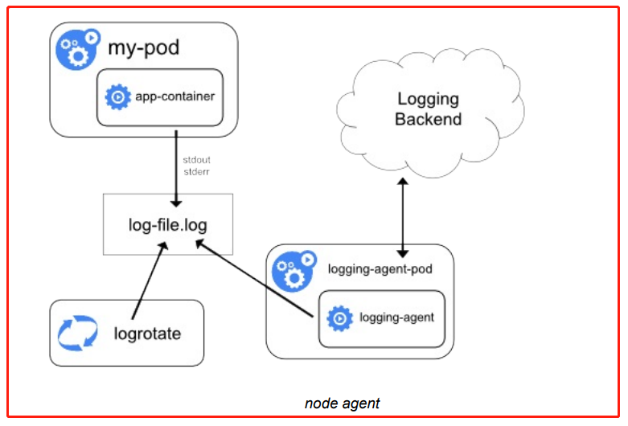
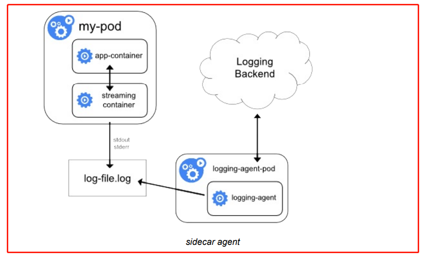
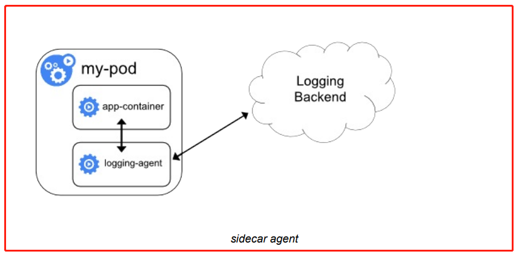
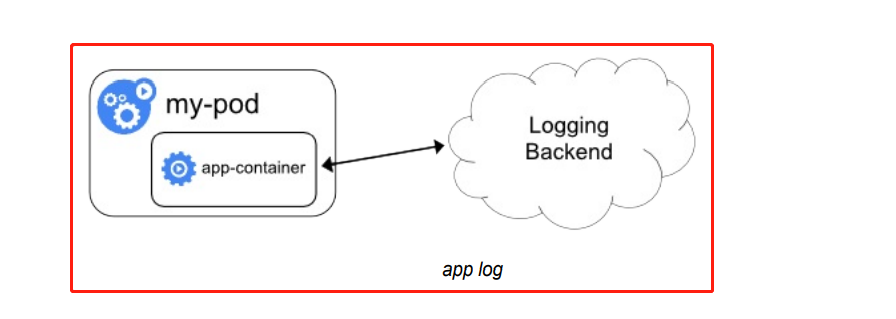

1.介绍

前⾯了解到 Kubernetes 集群中监控系统的搭建，除了对集群的监控报警之外，还有⼀项运维⼯作是⾮常重要的，那就是⽇志的收集。

应⽤程序和系统⽇志可以帮助了解集群内部的运⾏情况，⽇志对于调试问题和监视集群情况也⾮常有⽤。⽽且⼤部分的应⽤都有⽇志记录，对于传统的应⽤⼤部分都会写⼊到本地的⽇志⽂件中。对于容器化应⽤程序来说则更简单，只需要将⽇志信息写⼊到 stdout 和 stderr 即可，容器默认情况下就会把这些⽇志输出到宿主机上的⼀个 JSON ⽂件中，同样也可以通过 docker logs 或者 kubectl logs 来查看到对应的⽇志信息。

但是通常来说容器引擎或运⾏时提供的功能不⾜以记录完整的⽇志信息，⽐如如果容器崩溃了、 Pod 被驱逐了或者节点挂掉了，这时也仍然希望访问应⽤程序的⽇志。所以⽇志应该独⽴于节点、 Pod 或容器的⽣命周期，这种设计⽅式被称为 cluster-level-logging，即完全独⽴于 Kubernetes 系 统，需要⾃⼰提供单独的⽇志后端存储、分析和查询⼯具。


2.Kubernetes 中的基本⽇志

下⾯这个示例是 Kubernetes 中的⼀个基本⽇志记录的示例，直接将数据输出到标准输出流，如下：

[counter-pod.yaml](attachments/4426DB88942843528486D36C70920143counter-pod.yaml)

```javascript
# counter-pod.yaml
apiVersion: v1
kind: Pod
metadata:
  name: counter
spec:
  containers:
  - name: count
    image: busybox
    args: [/bin/sh, -c,'i=0; while true; do echo "$i: $(date)"; i=$((i+1)); sleep 1; done']
```


```javascript
// 将上⾯⽂件保存为 counter-pod.yaml,该 Pod 每秒输出⼀些⽂本信息,创建这个 Pod
[root@centos7 66]# kubectl create -f counter-pod.yaml 
pod/counter created
[root@centos7 66]# kubectl get pods | grep counter
counter                                   1/1     Running            0                  116s

// 创建完成后,可以使⽤ kubectl logs 命令查看⽇志信息:
[root@centos7 66]# kubectl logs counter
0: Fri Feb 25 13:09:19 UTC 2022
1: Fri Feb 25 13:09:20 UTC 2022
//......

// 查找到容器ID
[root@centos7 66]# kubectl describe pod counter

// 根据容器ID查看日志
[root@centos7 ~]# docker logs 6e59f7faf8d9
0: Fri Feb 25 13:09:19 UTC 2022
1: Fri Feb 25 13:09:20 UTC 2022
//......

[root@centos7 66]# kubectl delete -f counter-pod.yaml 
pod "counter" deleted
```


3. Kubernetes ⽇志收集

Kubernetes 集群本身不提供⽇志收集的解决⽅案,⼀般来说有主要的3种⽅案来做⽇志收集：

- 在节点上运⾏⼀个 agent 来收集⽇志 

- 在 Pod 中包含⼀个 sidecar 容器来收集应⽤⽇志 

- 直接在应⽤程序中将⽇志信息推送到采集后端


3.1 节点⽇志采集代理



通过在每个节点上运⾏⼀个⽇志收集的 agent 来采集⽇志数据，⽇志采集 agent 是⼀种专⽤⼯具，⽤ 于将⽇志数据推送到统⼀的后端。⼀般来说，这种 agent ⽤⼀个容器来运⾏，可以访问该节点上所有应⽤程序容器的⽇志⽂件所在⽬录。 由于这种 agent 必须在每个节点上运⾏，所以直接使⽤ DaemonSet 控制器运⾏该应⽤程序即可。在节点上运⾏⼀个⽇志收集的 agent 这种⽅式是最常⻅的⼀直⽅法，因为它只需要在每个节点上运⾏⼀ 个代理程序，并不需要对节点上运⾏的应⽤程序进⾏更改，对应⽤程序没有任何侵⼊性，但是这种⽅法也仅仅适⽤于收集输出到 stdout 和 stderr 的应⽤程序⽇志。


3.2 以 sidecar 容器收集⽇志

上⾯的图可以看到有⼀个明显的问题就是采集的⽇志都是通过输出到容器的 stdout 和 stderr ⾥⾯的信息，这些信息会在本地的容器对应⽬录中保留成 JSON ⽇志⽂件，所以直接在节点上运⾏⼀个 agent 就可以采集到⽇志。但是如果应⽤程序的⽇志是输出到容器中的某个⽇志⽂件呢？这种⽇志数据显然只通过上⾯的  agent ⽅案是采集不到的。


3.2.1 ⽤ sidecar 容器重新输出⽇志



对于上⾯这种情况可以直接在 Pod 中启动另外⼀个 sidecar 容器，直接将应⽤程序的⽇志通过这个容器重新输出到 stdout，这样又可以通过上⾯的 agent  节点⽇志收集⽅案完成了。 由于这个 sidecar 容器的主要逻辑就是将应⽤程序中的⽇志进⾏重定向打印，所以背后的逻辑⾮常简单，开销很⼩，⽽且由于输出到了 stdout 或者 stderr，所以也可以使⽤ kubectl logs 来查看⽇志。 下⾯的示例是在 Pod 中将⽇志记录在了容器的两个本地⽂件之中：

[two-files-counter-podstreaming.yaml](attachments/2B0BAE0075FB4317BC2342647B1D2B0Ftwo-files-counter-podstreaming.yaml)

```javascript
# two-files-counter-podstreaming.yaml
apiVersion: v1
kind: Pod
metadata:
  name: counter
spec:
  containers:
  - name: count
    image: busybox
    args:
    - /bin/sh
    - -c
    - >
      i=0;
      while true;
      do
        echo "$i: $(date)" >> /var/log/1.log;
        echo "$(date) INFO $i" >> /var/log/2.log;
        i=$((i+1));
        sleep 1;
      done
    volumeMounts:
    - name: varlog
      mountPath: /var/log
  volumes:
  - name: varlog
    emptyDir: {}
    
```


由于 Pod 中容器的特性，可以利⽤另外⼀个 sidecar 容器去获取到另外容器中的⽇志⽂件，然后将⽇志重定向到⾃⼰的 stdout 流中，可以将上⾯的 YAML ⽂件做如下修改：

[two-files-counter-podstreaming-sidecar.yaml](attachments/6BEC909D520540D3A5045D30BF7F8109two-files-counter-podstreaming-sidecar.yaml)

```javascript
# two-files-counter-podstreaming-sidecar.yaml
apiVersion: v1
kind: Pod
metadata:
  name: counter
spec:
  containers:
  - name: count
    image: busybox
    args:
    - /bin/sh
    - -c
    - >
      i=0;
      while true;
      do
        echo "$i: $(date)" >> /var/log/1.log;
        echo "$(date) INFO $i" >> /var/log/2.log;
        i=$((i+1));
        sleep 1;
      done
    volumeMounts:
    - name: varlog
      mountPath: /var/log
  - name: count-log-1
    image: busybox
    args: [/bin/sh, -c, 'tail -n+1 -f /var/log/1.log']
    volumeMounts:
    - name: varlog
      mountPath: /var/log
  - name: count-log-2
    image: busybox
    args: [/bin/sh, -c, 'tail -n+1 -f /var/log/2.log']
    volumeMounts:
    - name: varlog
      mountPath: /var/log
  volumes:
  - name: varlog
    emptyDir: {}
```


```javascript
// 直接创建上⾯的 Pod：
[root@centos7 66]# kubectl create -f two-files-counter-podstreaming-sidecar.yaml 
pod/counter created

[root@centos7 66]# kubectl get pods | grep counter
counter                                   3/3     Running            0                31s

[root@centos7 66]# kubectl exec counter -c count -i -t -- /bin/sh
/ # cat /var/log/1.log 
0: Fri Feb 25 13:46:59 UTC 2022
1: Fri Feb 25 13:47:00 UTC 2022
//......
/ # cat /var/log/2.log 
Fri Feb 25 13:46:59 UTC 2022 INFO 0
Fri Feb 25 13:47:00 UTC 2022 INFO 1
//......
/ # exit

// 运⾏成功后可以通过下⾯的命令来查看⽇志的信息：
[root@centos7 66]#  kubectl logs counter count-log-1
0: Fri Feb 25 13:46:59 UTC 2022
1: Fri Feb 25 13:47:00 UTC 2022
//......

[root@centos7 66]# kubectl logs counter count-log-2
Fri Feb 25 13:46:59 UTC 2022 INFO 0
Fri Feb 25 13:47:00 UTC 2022 INFO 1
//......

/* 
# 运行如下命令会提示 bash 不存在
kubectl exec counter -c count -i -t -- bash -il
# 如果 bash 不存在就使用 sh, 也可以使用下面命令进入容器
kubectl exec counter -c count -i -t -- sh -il
*/
```


这样前⾯节点上的⽇志采集 agent 就可以⾃动获取这些⽇志信息，⽽不需要其他配置。 这种⽅法虽然可以解决上⾯的问题，但是也有⼀个明显的缺陷，就是⽇志不仅会在原容器⽂件中保留 下来，还会通过 stdout 输出后占⽤磁盘空间，这样⽆形中就增加了⼀倍磁盘空间。


3.2.3 使⽤ sidecar 运⾏⽇志采集 agent



如果觉得在节点上运⾏⼀个⽇志采集的代理不够灵活的话，那么也可以创建⼀个单独的⽇志采集代理程序的 sidecar 容器，不过需要单独配置和应⽤程序⼀起运⾏。 不过这样虽然更加灵活，但是在 sidecar 容器中运⾏⽇志采集代理程序会导致⼤量资源消耗，因为你有多少个要采集的 Pod，就需要运⾏多少个采集代理程序，另外还⽆法使⽤ kubectl logs 命令来访问这 些⽇志，因为它们不受 kubelet 控制。 

举个例⼦，你可以使⽤的Stackdriver，它使⽤fluentd作为记录剂。以下是两个可⽤于实现此⽅法的配置⽂件。第⼀个⽂件包含 fluentd 配置的ConfigMap。 下⾯是 k8s 官⽅的⼀个 fluentd 的配置⽂件示例，使⽤ ConfigMap 对象来保存：

```javascript
# fluentd-configmap.yaml
apiVersion: v1
kind: ConfigMap
metadata:
name: fluentd-config
data:
  fluentd.conf: |
    <source>
      type tail
      format none
      path /var/log/1.log
      pos_file /var/log/1.log.pos
      tag count.format1
    </source>

    <source>
      type tail
      format none
      path /var/log/2.log
      pos_file /var/log/2.log.pos
      tag count.format2
    </source>

    <match **>
      type google_cloud
    </match>
```


上⾯的配置⽂件是配置收集原⽂件 /var/log/1.log 和 /var/log/2.log 的⽇志数据，然后通过 google_cloud 这个插件将数据推送到 Stackdriver 后端去。下⾯是使⽤上⾯的配置⽂件在应⽤程序中运⾏⼀个 fluentd 的容器来读取⽇志数据：

```javascript
# pod-fluentd-log.yaml
apiVersion: v1
kind: Pod
metadata:
  name: counter
spec:
  containers:
  - name: count
    image: busybox
    args:
    - /bin/sh
    - -c
    - >
      i=0;
      while true;
      do
        echo "$i: $(date)" >> /var/log/1.log;
        echo "$(date) INFO $i" >> /var/log/2.log;
        i=$((i+1));
        sleep 1;
      done
    volumeMounts:
      - name: varlog
        mountPath: /var/log
  - name: count-agent
    image: k8s.gcr.io/fluentd-gcp:1.30
    env:
      - name: FLUENTD_ARGS
        value: -c /etc/fluentd-config/fluentd.conf
    volumeMounts:
      - name: varlog
        mountPath: /var/log
      - name: config-volume
        mountPath: /etc/fluentd-config
  volumes:
  - name: varlog
    emptyDir: {}
  - name: config-volume
    configMap:
      name: fluentd-config
```


```javascript
[root@centos7 66]# kubectl create -f fluentd-configmap.yaml  --dry-run=client
configmap/fluentd-config created (dry run)

[root@centos7 66]# kubectl create -f pod-fluentd-log.yaml --dry-run=client
pod/counter created (dry run)

```


上⾯的 Pod 创建完成后，容器 count-agent 就会将 count 容器中的⽇志进⾏收集然后上传。当然这只是⼀个简单的示例，也完全可以使⽤其他的任何⽇志采集⼯具来替换 fluentd，⽐如 logstash、 fluent-bit 等等。


3.3 直接从应⽤程序收集⽇志



除了上⾯的⼏种⽅案之外，也完全可以通过直接在应⽤程序中去显示的将⽇志推送到⽇志后端， 但是这种⽅式需要代码层⾯的实现，也超出了 Kubernetes 本身的范围。下节了解具体的⽇志收集的操作⽅法.