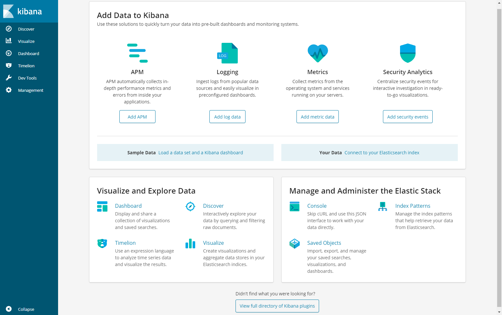

1.搭建 EFK ⽇志系统

上节介绍了 Kubernetes 集群中的⼏种⽇志收集⽅案，Kubernetes 中⽐较流⾏的⽇志收集解决⽅案是 Elasticsearch、Fluentd 和 Kibana（EFK）技术栈，也是官⽅现在⽐较推荐的⼀种⽅案。

Elasticsearch (简称ES) 是⼀个实时的、分布式的可扩展的搜索引擎，允许进⾏全⽂、结构化搜索，它通常⽤于索引和搜索⼤量⽇志数据，也可⽤于搜索许多不同类型的⽂档。ES 通常与 Kibana ⼀起部署，Kibana 是 ES 的⼀个功能强⼤的数据可视化 Dashboard，Kibana 允许你通过 web 界⾯来浏览 ES ⽇志数据。

Fluentd 是⼀个流⾏的开源数据收集器，在 K8S 集群节点上安装 Fluentd，通过获取容器⽇志⽂件、过滤和转换⽇志数据，然后将数据传递到 ES 集群，在该集群中对其进⾏索引和存储。

本节先来配置启动⼀个可扩展的 ES 集群，然后在 Kubernetes 集群中创建⼀个 Kibana 应⽤，最后通过 DaemonSet 来运⾏ Fluentd，以便它在每个 K8S ⼯作节点上都可以运⾏⼀个 Pod。


2. 创建 Elasticsearch 集群

```javascript
镜像准备：
master节点和node节点准备如下镜像：
  docker pull st22ab889/fluentd-elasticsearch:v2.0.4
node节点准备如下镜像：
  docker pull docker.elastic.co/elasticsearch/elasticsearch-oss:6.4.3
  docker pull docker.elastic.co/kibana/kibana-oss:6.4.3
```


2.1 创建命令空间

在创建 Elasticsearch 集群之前，先创建⼀个命名空间，将在其中安装所有⽇志相关的资源对象。新建⼀个 kube-logging.yaml ⽂件：

[kube-logging.yaml](attachments/3B8D09E8EBBC4C6E8AEAB437EDB47B34kube-logging.yaml)

```javascript
# kube-logging.yaml
apiVersion: v1
kind: Namespace
metadata:
  name: logging
```


```javascript
// 然后通过 kubectl 创建该资源清单，创建⼀个名为 logging 的 namespace：\
[root@centos7 67]# kubectl create -f kube-logging.yaml 
namespace/logging created

[root@centos7 67]# kubectl get ns
NAME                   STATUS   AGE
kube-ops               Active   154d
logging                Active   26s
//......
```


现在创建了⼀个命名空间来存放⽇志相关资源，接下来可以部署 EFK 相关组件，⾸先开始部署 ⼀个2节点的 ES 集群。(这⾥应该使⽤3个 ES Pod 来避免⾼可⽤下多节点集群中出现的“脑裂”问题，当⼀个或多个节点⽆法与其他节点通信时会产⽣“脑裂”，可能会出现⼏个主节点。更多 Elasticsearch 集群脑裂问题可以查询官方⽂档)


⼀个关键点是应该注意参数 discover.zen.minimum_master_nodes=N/2+1 ，其中 N 是 ES 集群中符合主节点的节点数，⽐如K8S中有3个节点，意味着 N 应该设置为2。这样，如果⼀个节点暂时与集群断开连接，则另外两个节点可以选择⼀个新的主节点，并且集群可以在最后⼀个节点尝试重新加⼊时继续运⾏，在扩展 Elasticsearch 集群时，⼀定要记住这个参数。


2.2 创建ES服务

⾸先创建⼀个名为 elasticsearch 的⽆头服务

[elasticsearch-svc.yaml](attachments/7285002AB9884E648693911EBB0322D8elasticsearch-svc.yaml)

```javascript
# elasticsearch-svc.yaml
kind: Service
apiVersion: v1
metadata:
  name: elasticsearch
  namespace: logging
  labels:
    app: elasticsearch
spec:
  selector:
    app: elasticsearch
  clusterIP: None
  ports:
  - port: 9200
    name: rest
  - port: 9300
    name: inter-node
    
```

定义了⼀个名为 elasticsearch 的 Service，指定标签 app=elasticsearch ，当 ES StatefulSet 与此服务关联时，服务将返回带有标签 app=elasticsearch 的 ES Pods 的 DNS 记录，然后设置 clusterIP=None，将该服务设置成⽆头服务。最后分别定义端⼝9200、 9300，分别⽤于与 REST API 交互，以及⽤于节点间通信。

```javascript
// 使⽤ kubectl 直接创建上⾯的服务资源对象：
[root@centos7 67]# kubectl create -f elasticsearch-svc.yaml
service/elasticsearch created

[root@centos7 67]# kubectl --namespace=logging get services 
NAME            TYPE        CLUSTER-IP   EXTERNAL-IP   PORT(S)             AGE
elasticsearch   ClusterIP   None         <none>        9200/TCP,9300/TCP   53s

// 现在已经为 Pod 设置了⽆头服务和⼀个稳定的域名 .elasticsearch.logging.svc.cluster.local
// 接下来通过 StatefulSet 来创建具体的 Elasticsearch 的 Pod 应⽤
```


2.3 创建ES的Pod

Kubernetes StatefulSet 允许为 Pod 分配⼀个稳定的标识和持久化存储，ES 需要稳定的存储来保证 Pod 在重新调度或者重启后的数据依然不变，所以需要使⽤ StatefulSet 来管理 Pod。

```javascript
要了解更多关于 StaefulSet 的信息，可以查看官⽹关于 StatefulSet 的相关⽂档：
https://kubernetes.io/docs/concepts/workloads/controllers/statefulset/
```


[elasticsearch-statefulset.yaml](attachments/43994FB4079247AA9CCE1B2B5766C1D4elasticsearch-statefulset.yaml)

```javascript
# elasticsearch-statefulset.yaml
apiVersion: apps/v1
kind: StatefulSet
metadata:
  name: es-cluster
  namespace: logging
spec:
  serviceName: elasticsearch
  replicas: 3
  selector:
    matchLabels:
      app: elasticsearch
  template:
    metadata:
      labels:
        app: elasticsearch
    spec:
      containers:
      - name: elasticsearch
        image: docker.elastic.co/elasticsearch/elasticsearch-oss:6.4.3
        imagePullPolicy: IfNotPresent
        resources:
          limits:
            cpu: 1000m
          requests:
            cpu: 100m
        ports:
        - containerPort: 9200
          name: rest
          protocol: TCP
        - containerPort: 9300
          name: inter-node
          protocol: TCP
        volumeMounts:
        - name: data
          mountPath: /usr/share/elasticsearch/data
        env:
          - name: cluster.name
            value: k8s-logs
          - name: node.name
            valueFrom:
              fieldRef:
                fieldPath: metadata.name
          - name: discovery.zen.ping.unicast.hosts
            value: "es-cluster-0.elasticsearch,es-cluster-1.elasticsearch,es-cluster-2.elasticsearch"
          - name: discovery.zen.minimum_master_nodes
            value: "2"
          - name: ES_JAVA_OPTS
            value: "-Xms512m -Xmx512m"
      initContainers:
      - name: fix-permissions
        image: busybox
        command: ["sh", "-c", "chown -R 1000:1000 /usr/share/elasticsearch/data"]
        securityContext:
          privileged: true
        volumeMounts:
        - name: data
          mountPath: /usr/share/elasticsearch/data
      - name: increase-vm-max-map
        image: busybox
        command: ["sysctl", "-w", "vm.max_map_count=262144"]
        securityContext:
          privileged: true
      - name: increase-fd-ulimit
        image: busybox
        command: ["sh", "-c", "ulimit -n 65536"]
        securityContext:
          privileged: true
  volumeClaimTemplates:
  - metadata:
      name: data
      labels:
        app: elasticsearch
    spec:
      accessModes: [ "ReadWriteOnce" ]
      storageClassName: es-data-db
      resources:
        requests:
          storage: 5Gi
          
```


注意:  elasticsearch-statefulset.yaml 中的环境变量以及 initContainers 产生的行为适用于 Elasticsearch 6.4.3，新版本ES的设置有变化。

```javascript
// 在 elasticsearch-statefulset.yaml 文件中需要注意的几个地方
// 1.定义了⼀个名为 es-cluster 的 StatefulSet 对象
// 2.然后定义 serviceName=elasticsearch 和前⾯创建的 Service 相关联,
//   这可以确保使⽤以下 DNS 地址访问 StatefulSet 中的每⼀个 Pod:
//    es-cluster-[0,1,2].elasticsearch.logging.svc.cluster.local,  
//    其中 [0,1,2]对应于已分配的 Pod 序号。
// 3.然后指定3个副本，将 matchLabels 设置为 app=elasticsearch,所以 Pod 的模板部分
//    .spec.template.metadata.lables 也必须包含 app=elasticsearch 标签。
// 4.定义 StatefulSet 中的 Pod，这⾥使⽤⼀个 -oss 后缀的镜像，该镜像是 Elasticsearch 的开源版本，
//  如果想使⽤包含 X-Pack 之类的版本,可以去掉该后缀。
// 5.然后暴露了9200和9300两个 端⼝，注意名称要和上⾯定义的 Service 保持⼀致。
// 6.然后通过 volumeMount 声明了数据持久化⽬录, 下⾯将定义 VolumeClaims。
// 7.最后就是容器中设置的⼀些环境变量：
// 7.1 cluster.name：ES 集群的名称,这⾥命名成 k8s-logs。
// 7.2 node.name：节点的名称,通过 metadata.name 来获取。这将解析为 es-cluster-[0,1,2]，取决于节点的指定顺序。
// 7.3 discovery.zen.ping.unicast.hosts：此字段⽤于设置在 Elasticsearch 集群中节点相互连接的发现⽅法。
//    这里使⽤ unicastdiscovery ⽅式，它为集群指定了⼀个静态主机列表。由于之前配置的⽆头服务，
//    所以Pod具有唯⼀的DNS域 es-cluster-[0,1,2].elasticsearch.logging.svc.cluster.local，因此相应地设置此变量。
//    由于都在同⼀个 namespace 下⾯，所以可以将其缩短为 es-cluster-[0,1,2].elasticsearch。
//    discovery.zen.ping.unicast.hosts 在ES新版本中已被 discovery.seed_hosts 取代。要了解有关于 Elasticsearch 发现的更多信息，
//    请参阅 Elasticsearch 官⽅⽂档：https://www.elastic.co/guide/en/elasticsearch/reference/8.0/important-settings.html#unicast.hosts
// 7.4 discovery.zen.minimum_master_nodes：将其设置为 (N/2) + 1，N是群集中符合主节点的节点的数量。这里有2个ES节点，因此将此值设置为2(向下舍⼊到最接近的整数)。
//     在Elasticsearch 7.0中，已经移除 minimum_master_nodes 参数，让 Elasticsearch 自己选择可以形成仲裁的节点。
// 7.5 ES_JAVA_OPTS：这⾥设置为 -Xms512m -Xmx512m ，告诉 JVM 使⽤ 512 MB 的最⼩和最⼤堆。
//     应该根据群集的资源可⽤性和需求调整这些参数。要了解更多信息，请参阅设置堆⼤⼩的相关⽂档：
//     https://www.elastic.co/guide/en/elasticsearch/reference/current/important-settings.html#heap-size-settings
// 8. 接下来添加了initContainer 的内容,这⾥定义了⼏个在主应⽤程序之前运⾏的 Init 容器，
//    这些初始容器按照定义的顺序依次执⾏，执⾏完成后才会启动主应⽤容器。
// 8.1 第⼀个名为 fix-permissions 的容器⽤来运⾏ chown 命令，将 ES 数据⽬录的⽤户和组更改为 1000:1000 (ES ⽤户的 UID)。
//     因为默认情况下，K8S ⽤ root ⽤户挂载数据⽬录，这会使得 ES ⽆法⽅法该数据⽬录。此步骤在ES8.0版本的处理方法见文档：
//     https://www.elastic.co/guide/en/elasticsearch/reference/current/docker.html#_notes_for_production_use_and_defaults
// 8.2 第⼆个名为 increase-vm-max-map 的容器⽤来增加操作系统对 mmap 计数的限制，默认情况下该值可能太低，导致内存不⾜的错误，
//     要了解更多关于该设置的信息，可以查看 Elasticsearch 官⽅⽂档说明：
//     https://www.elastic.co/guide/en/elasticsearch/reference/current/docker.html#_notes_for_production_use_and_defaults
// 8.3 最后⼀个初始化容器是⽤来执⾏ ulimit 命令增加打开⽂件描述符的最⼤数量的。
//     此外 Elastisearch Notes for Production Use ⽂档还提到了由于性能原因最好禁⽤ swap，当然对于 k8s 集群⽽⾔，最好也是禁⽤ swap 分区。
//     要了解更多关于该设置的信息，可以查看 Elasticsearch 官⽅⽂档说明：
//     Elastisearch Notes for Production Use: https://www.elastic.co/guide/en/elasticsearch/reference/current/docker.html#_notes_for_production_use_and_defaults
// 9. 定义了主应⽤容器和它之前运⾏的 Init Containers 来调整⼀些必要的系统参数后，
//    接下来可以添加数据⽬录的持久化相关的配置，在 StatefulSet 中，使⽤ volumeClaimTemplates 来定义volume 模板即可。
//    这⾥使⽤ volumeClaimTemplates 来定义持久化模板，k8s 会使⽤它为 Pod 创建PersistentVolume，设置访问模式为 ReadWriteOnce，
//    这意味着它只能被 mount 到单个节点上进⾏读写，然后最重要的是使⽤了⼀个名为 es-data-db 的 StorageClass 对象，
//    所以需要提前创建该对象，这⾥使⽤的 NFS 作为存储后端，所以需要安装⼀个对应的 provisioner 驱动，
//    关于StorageClass 已经介绍过⽅法。
// 10. 最后指定了每个 PersistentVolume 的⼤⼩为 50GB，由于测试环境原因，每个 PersistentVolume 的⼤⼩只设置为5GB，可以根据实际需要进⾏调整该值。
```


[elasticsearch-storageclass.yaml](attachments/ECB6EB4F18294AABB4C558B0FD6F2125elasticsearch-storageclass.yaml)

```javascript
# elasticsearch-storageclass.yaml
apiVersion: storage.k8s.io/v1
kind: StorageClass
metadata:
  name: es-data-db
# 该值需要和 provisioner 配置的保持⼀致
provisioner: fuseim.pri/ifs 

```


```javascript
// 在直接使⽤ kubectl ⼯具部署即可：
[root@centos7 67]# kubectl create -f elasticsearch-storageclass.yaml 
storageclass.storage.k8s.io/es-data-db created

[root@centos7 67]# kubectl create -f elasticsearch-statefulset.yaml 
statefulset.apps/es-cluster created

// 添加成功后，可以看到 logging 命名空间下⾯的所有的资源对象：
[root@centos7 67]# kubectl -n logging get sts
NAME         READY   AGE
es-cluster   0/3     49s

[root@centos7 ~]# kubectl -n logging get pods
NAME           READY   STATUS    RESTARTS   AGE
es-cluster-0   1/1     Running   0          2m19s
es-cluster-1   1/1     Running   0          106s
es-cluster-2   1/1     Running   0          62s

[root@centos7 ~]# kubectl -n logging get svc
NAME            TYPE        CLUSTER-IP   EXTERNAL-IP   PORT(S)             AGE
elasticsearch   ClusterIP   None         <none>        9200/TCP,9300/TCP   5m41s

// Pods 部署完成后可以通过请求⼀个 REST API 来检查 ES集群是否正常运⾏。
// 使⽤下⾯的命令将本地端⼝9200转发到 ES 节点(如es-cluster-0)对应的端⼝：
kubectl port-forward es-cluster-0 9200:9200 --namespace=logging
// 然后再新开一个终端窗⼝，执⾏如下请求:
[aaron@centos7 ~]$ curl http://localhost:9200/_cluster/state?pretty
// 正常来说，应该会看到类似于如下信息：
{
  "cluster_name" : "k8s-logs",
  "compressed_size_in_bytes" : 349,
  "cluster_uuid" : "BTRfB_UbSxuByaZeU43oBw",
  "version" : 3,
  "state_uuid" : "WjJUUTelSDescbE6CjQf5g",
  "master_node" : "ja1wOABbQeeoeJWSAtDdbQ",
  "blocks" : { },
  "nodes" : {
    "xMXz59-jSOe7TwH9bIbKhw" : {
      "name" : "es-cluster-1",
      "ephemeral_id" : "YlvlCd89Rx-QZtcnruG9zg",
      "transport_address" : "10.244.189.189:9300",
      "attributes" : { }
    },
    "ja1wOABbQeeoeJWSAtDdbQ" : {
      "name" : "es-cluster-0",
      "ephemeral_id" : "nzCNI9xrQ_udzDzANKPRvA",
      "transport_address" : "10.244.189.153:9300",
      "attributes" : { }
    },
    "Aqt_YXlRRp2llSXvnp4rKw" : {
      "name" : "es-cluster-2",
      "ephemeral_id" : "aLzZoI_ySCOSkcE0pOaAEQ",
      "transport_address" : "10.244.189.179:9300",
      "attributes" : { }
    }
  },
  "metadata" : {
    "cluster_uuid" : "BTRfB_UbSxuByaZeU43oBw",
    "templates" : { },
    "indices" : { },
    "index-graveyard" : {
      "tombstones" : [ ]
    }
  },
  "routing_table" : {
    "indices" : { }
  },
  "routing_nodes" : {
    "unassigned" : [ ],
    "nodes" : {
      "Aqt_YXlRRp2llSXvnp4rKw" : [ ],
      "ja1wOABbQeeoeJWSAtDdbQ" : [ ],
      "xMXz59-jSOe7TwH9bIbKhw" : [ ]
    }
  },
  // ......
}
// 看到上⾯的信息就表明已经为 k8s-logs 的 ES 集群成功创建了3个节点：
// es-cluster-0，es-cluster-1，和es-cluster-2，并且当前主节点是 es-cluster-0。
```


3. 创建 Kibana 服务

ES 集群启动成功后，接下来可以来部署 Kibana 服务：

[kibana.yaml](attachments/3E7AF9179E4C4D94AF873A66B0125ED6kibana.yaml)

```javascript
# kibana.yaml
apiVersion: v1
kind: Service
metadata:
  name: kibana
  namespace: logging
  labels:
    app: kibana
spec:
  ports:
  - port: 5601
  type: NodePort
  selector:
    app: kibana

---
apiVersion: apps/v1
kind: Deployment
metadata:
  name: kibana
  namespace: logging
  labels:
    app: kibana
spec:
  selector:
    matchLabels:
      app: kibana
  template:
    metadata:
      labels:
        app: kibana
    spec:
      containers:
      - name: kibana
        image: docker.elastic.co/kibana/kibana-oss:6.4.3
        imagePullPolicy: IfNotPresent
        resources:
          limits:
            cpu: 1000m
          requests:
            cpu: 100m
        env:
          - name: ELASTICSEARCH_URL
            value: http://elasticsearch:9200
        ports:
        - containerPort: 5601
```

上⾯定义了两个资源对象，⼀个 Service 和 Deployment，为了测试⽅便，将 Service 设置为了 NodePort 类型，Kibana Pod 中配置都⽐较简单，唯⼀需要注意的是使⽤ ELASTICSEARCH_URL 这个环境变量来设置 ES 集群的端点和端⼝，直接使⽤ k8s DNS 即可，此端点对应服务名称为 elasticsearch，由于是⼀个 headless service，所以该域将解析为3个 ES Pod 的 IP 地址列表。

```javascript
// 配置完成后，直接使⽤ kubectl ⼯具创建：
[root@centos7 67]# kubectl create -f kibana.yaml
service/kibana created

// 创建完成后，可以查看 Kibana Pod 的运⾏状态：
[root@centos7 67]# kubectl --namespace=logging get pods
NAME                      READY   STATUS    RESTARTS   AGE
es-cluster-0              1/1     Running   0          20m
es-cluster-1              1/1     Running   0          10m
es-cluster-2              1/1     Running   0          9m22s
kibana-7dfb9d8bc5-kq62j   1/1     Running   0          101s

[root@centos7 68]# kubectl --namespace=logging get svc
NAME            TYPE        CLUSTER-IP      EXTERNAL-IP   PORT(S)             AGE
elasticsearch   ClusterIP   None            <none>        9200/TCP,9300/TCP   74m
kibana          NodePort    10.98.113.121   <none>        5601:30763/TCP      73m

// 如果Pod已经是 Running 状态,证明应⽤已经部署成功,然后可以通过NodePort来访问Kibana这个服务,
// 在浏览器中打开 http://<任意节点IP>:30763 即可，如果看到如下欢迎界⾯证明 Kibana 已经成功部署到了k8s 集群之中。
//    http://192.168.32.100:30763
//    http://192.168.32.101:30763

```




