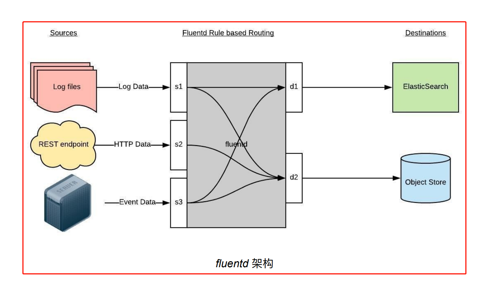
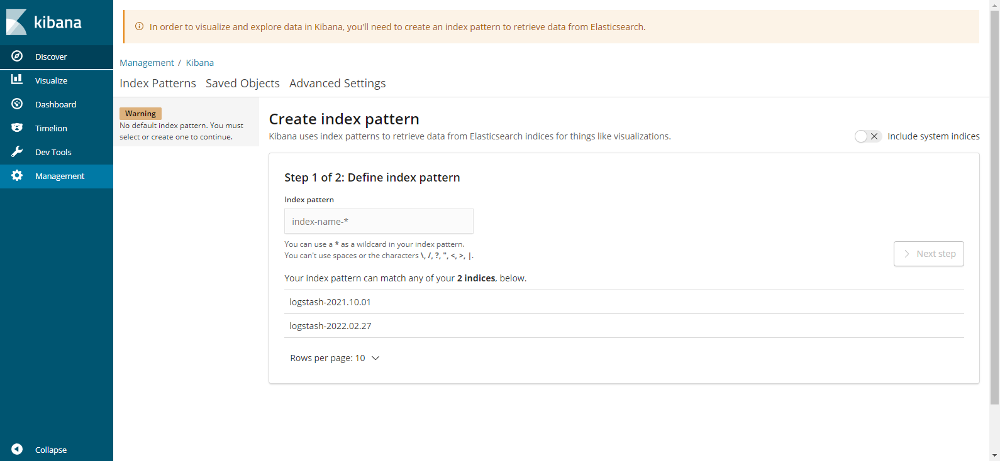
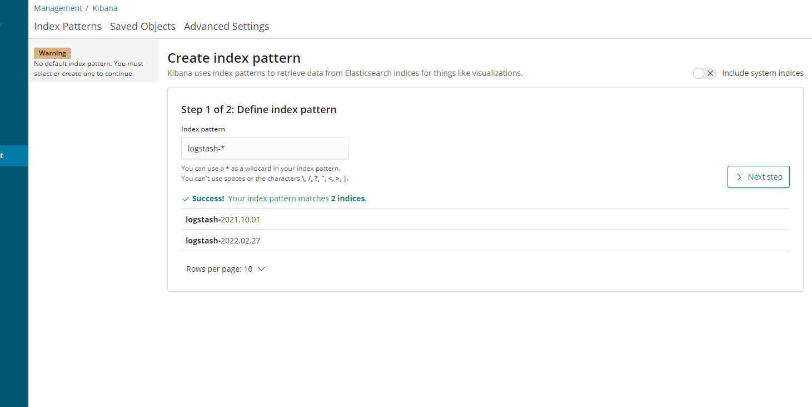
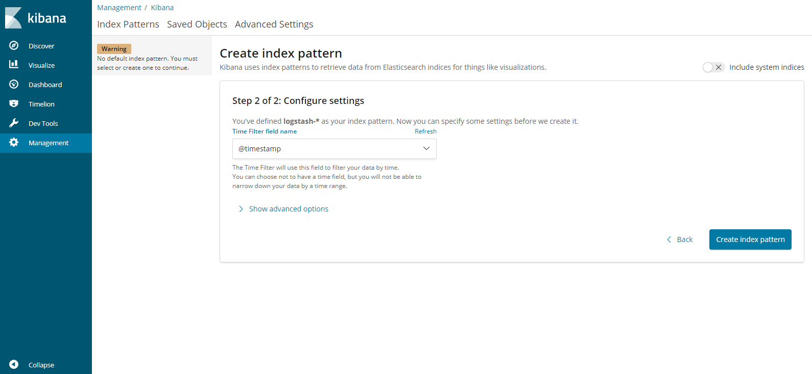
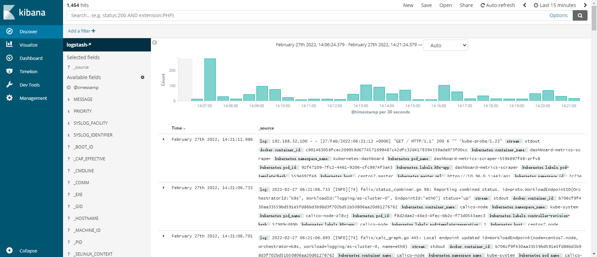
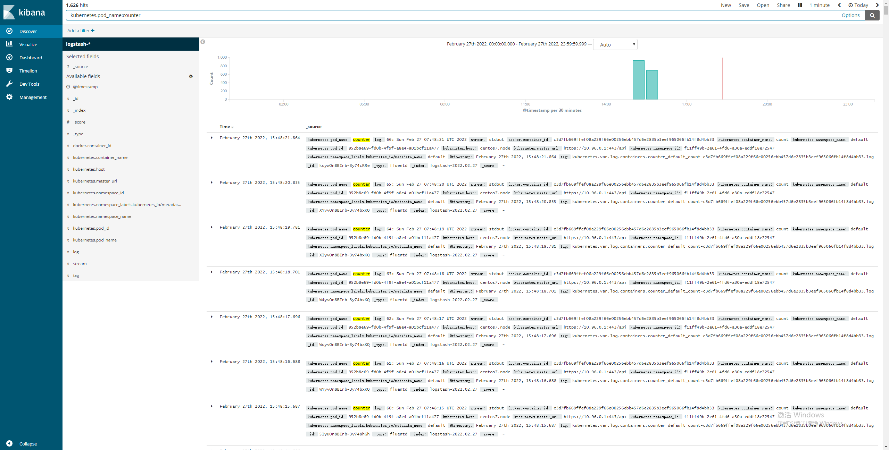

1. Fluentd介绍

Fluentd 是⼀个⾼效的⽇志聚合器，是⽤ Ruby 编写的，并且可以很好地扩展。对于⼤部分企业来 说，Fluentd ⾜够⾼效并且消耗的资源相对较少，另外⼀个⼯具 Fluent-bit 更轻量级，占⽤资源更 少，但是插件相对 Fluentd 来说不够丰富，所以整体来说，Fluentd 更加成熟，使⽤更加⼴泛，所以这⾥也同样使⽤ Fluentd 来作为⽇志收集⼯具。


2.工作原理

Fluentd 通过⼀组给定的数据源抓取⽇志数据，处理后(转换成结构化的数据格式)将它们转发给其他服务，⽐如 ES、对象存储等等。Fluentd ⽀持超过300个⽇志存储和分析服务，所以在这⽅⾯是⾮常灵活的。主要运⾏步骤如下：

- ⾸先 Fluentd 从多个⽇志源获取数据

- 结构化并且标记这些数据

- 然后根据匹配的标签将数据发送到多个⽬标服务去




3.配置

⼀般来说是通过⼀个配置⽂件告诉 Fluentd 如何采集、处理数据，下⾯简单介绍 Fluentd 的配置⽅法。注意：这里使用 fluentd-elasticsearch v2.0.4，以下配置方法适用于 fluentd-elasticsearch v2.0.4，这些配置在新版本的 fluentd 可能已经发生变化。

```javascript
// fluentd 官方文档
https://docs.fluentd.org
```


3.1 ⽇志源配置

⽐如这⾥为了收集 K8S 节点上的所有容器⽇志，就需要做如下的⽇志源配置：

```javascript
<source>
@id fluentd-containers.log
@type tail
path /var/log/containers/*.log
pos_file /var/log/fluentd-containers.log.pos
time_format %Y-%m-%dT%H:%M:%S.%NZ
tag raw.kubernetes.*
format json
read_from_head true
</source>
```

上⾯配置部分参数说明如下：

- id：表示引⽤该⽇志源的唯⼀标识符，该标识可⽤于进⼀步过滤和路由结构化⽇志数据

- type：Fluentd 内置的指令， tail 表示 Fluentd 从上次读取的位置通过 tail 不断获取数据，另外⼀个是 http 表示通过⼀个 GET 请求来收集数据。

- path： tail 类型下的特定参数，告诉 Fluentd 采集 /var/log/containers ⽬录下的所有⽇志，这是 docker 在 Kubernetes 节点上⽤来存储运⾏容器 stdout 输出⽇志数据的⽬录。

- pos_file：检查点，如果 Fluentd 程序重新启动了，它将使⽤此⽂件中的位置来恢复⽇志数据收集。

- tag：⽤来将⽇志源与⽬标或者过滤器匹配的⾃定义字符串，Fluentd 匹配源/⽬标标签来路由⽇志数据。


3.2 路由配置

上⾯是⽇志源的配置，接下来看看如何将⽇志数据发送到 Elasticsearch：

```javascript
<match **>
@id elasticsearch
@type elasticsearch
@log_level info
include_tag_key true
type_name fluentd
host "#{ENV['OUTPUT_HOST']}"
port "#{ENV['OUTPUT_PORT']}"
logstash_format true
<buffer>
@type file
path /var/log/fluentd-buffers/kubernetes.system.buffer
flush_mode interval
retry_type exponential_backoff
flush_thread_count 2
flush_interval 5s
retry_forever
retry_max_interval 30
chunk_limit_size "#{ENV['OUTPUT_BUFFER_CHUNK_LIMIT']}"
queue_limit_length "#{ENV['OUTPUT_BUFFER_QUEUE_LIMIT']}"
overflow_action block
</buffer>
```

- match：标识⼀个⽬标标签，后⾯是⼀个匹配⽇志源的正则表达式，我们这⾥想要捕获所有的⽇志并将它们发送给 Elasticsearch，所以需要配置成 ** 。

- id：⽬标的⼀个唯⼀标识符。

- type：⽀持的输出插件标识符，我们这⾥要输出到 Elasticsearch，所以配置成 elasticsearch，这是 Fluentd 的⼀个内置插件。

- log_level：指定要捕获的⽇志级别，我们这⾥配置成 info ，表示任何该级别或者该级别以上(INFO、WARNING、ERROR)的⽇志都将被路由到 Elsasticsearch。

- host/port：定义 Elasticsearch 的地址，也可以配置认证信息，我们的 Elasticsearch 不需要认证，所以这⾥直接指定 host 和 port 即可。

- logstash_format：Elasticsearch 服务对⽇志数据构建反向索引进⾏搜索，将 logstash_format 设置为 true ，Fluentd 将会以 logstash 格式来转发结构化的⽇志数据。

- Buffer： Fluentd 允许在⽬标不可⽤时进⾏缓存，⽐如，如果⽹络出现故障或者 ES 不可⽤的时候。缓冲区配置也有助于降低磁盘的 IO。


4. 部署 Fluentd


4.1 安装

要收集 k8s 集群的⽇志，直接⽤ DasemonSet 控制器来部署 Fluentd 应⽤，这样，它就可以从 Kubernetes 节点上采集⽇志，确保在集群中的每个节点上始终运⾏⼀个 Fluentd 容器。当然可以直接使⽤ Helm 来进⾏⼀键安装，为了能够了解更多实现细节，这⾥还是采⽤⼿动⽅法来进⾏安装。


4.2 通过 ConfigMap 对象来指定 Fluentd 配置⽂件

[fluentd-configmap.yaml](attachments/E2D063B9E9C34DA48B608D7C39E1FFCEfluentd-configmap.yaml)

```javascript
# fluentd-configmap.yaml
kind: ConfigMap
apiVersion: v1
metadata:
  name: fluentd-config
  namespace: logging
  labels:
    addonmanager.kubernetes.io/mode: Reconcile
data:
  system.conf: |-
    <system>
      root_dir /tmp/fluentd-buffers/
    </system>
  containers.input.conf: |-
    <source>
      @id fluentd-containers.log
      @type tail
      path /var/log/containers/*.log
      pos_file /var/log/es-containers.log.pos
      time_format %Y-%m-%dT%H:%M:%S.%NZ
      localtime
      tag raw.kubernetes.*
      format json
      read_from_head true
    </source>
    # Detect exceptions in the log output and forward them as one log entry.
    <match raw.kubernetes.**>
      @id raw.kubernetes
      @type detect_exceptions
      remove_tag_prefix raw
      message log
      stream stream
      multiline_flush_interval 5
      max_bytes 500000
      max_lines 1000
    </match>
  system.input.conf: |-
    # Logs from systemd-journal for interesting services.
    <source>
      @id journald-docker
      @type systemd
      filters [{ "_SYSTEMD_UNIT": "docker.service" }]
      <storage>
      @type local
      persistent true
      </storage>
      read_from_head true
      tag docker
    </source>
    <source>
      @id journald-kubelet
      @type systemd
      filters [{ "_SYSTEMD_UNIT": "kubelet.service" }]
      <storage>
      @type local
      persistent true
      </storage>
      read_from_head true
      tag kubelet
    </source>
  forward.input.conf: |-
    # Takes the messages sent over TCP
    <source>
      @type forward
    </source>
  output.conf: |-
    # Enriches records with Kubernetes metadata
    <filter kubernetes.**>
      @type kubernetes_metadata
    </filter>
    <match **>
      @id elasticsearch
      @type elasticsearch
      @log_level info
      include_tag_key true
      host elasticsearch
      port 9200
      logstash_format true
      request_timeout 30s
      <buffer>
        @type file
        path /var/log/fluentd-buffers/kubernetes.system.buffer
        flush_mode interval
        retry_type exponential_backoff
        flush_thread_count 2
        flush_interval 5s
        retry_forever
        retry_max_interval 30
        chunk_limit_size 2M
        queue_limit_length 8
        overflow_action block
      </buffer>
    </match>
```

上⾯配置⽂件中配置了 docker 容器⽇志⽬录以及 docker、kubelet 应⽤的⽇志的收集，收集到数据经过处理后发送到 elasticsearch:9200 服务。


 4.2 然后新建⼀个 fluentd-daemonset.yaml 的⽂件：

[fluentd-daemonset.yaml](attachments/0C6C704E79D24CB2BEE539AD1AD624B1fluentd-daemonset.yaml)

```javascript
# fluentd-daemonset.yaml
apiVersion: v1
kind: ServiceAccount
metadata:
  name: fluentd-es
  namespace: logging
  labels:
    k8s-app: fluentd-es
    kubernetes.io/cluster-service: "true"
    addonmanager.kubernetes.io/mode: Reconcile
---
kind: ClusterRole
apiVersion: rbac.authorization.k8s.io/v1
metadata:
  name: fluentd-es
  labels:
    k8s-app: fluentd-es
    kubernetes.io/cluster-service: "true"
    addonmanager.kubernetes.io/mode: Reconcile
rules:
- apiGroups:
  - ""
  resources:
  - "namespaces"
  - "pods"
  verbs:
  - "get"
  - "watch"
  - "list"
---
kind: ClusterRoleBinding
apiVersion: rbac.authorization.k8s.io/v1
metadata:
  name: fluentd-es
  labels:
    k8s-app: fluentd-es
    kubernetes.io/cluster-service: "true"
    addonmanager.kubernetes.io/mode: Reconcile
subjects:
- kind: ServiceAccount
  name: fluentd-es
  namespace: logging
  apiGroup: ""
roleRef:
  kind: ClusterRole
  name: fluentd-es
  apiGroup: ""
---
apiVersion: apps/v1
kind: DaemonSet
metadata:
  name: fluentd-es
  namespace: logging
  labels:
    k8s-app: fluentd-es
    version: v2.0.4
    kubernetes.io/cluster-service: "true"
    addonmanager.kubernetes.io/mode: Reconcile
spec:
  selector:
    matchLabels:
      k8s-app: fluentd-es
      version: v2.0.4
  template:
    metadata:
      labels:
        k8s-app: fluentd-es
        kubernetes.io/cluster-service: "true"
        version: v2.0.4
    spec:
      serviceAccountName: fluentd-es
      containers:
      - name: fluentd-es
        image: st22ab889/fluentd-elasticsearch:v2.0.4
        imagePullPolicy: IfNotPresent
        env:
        - name: FLUENTD_ARGS
          value: --no-supervisor -q
        resources:
          limits:
            memory: 500Mi
          requests:
            cpu: 100m
            memory: 200Mi
        volumeMounts:
        - name: varlog
          mountPath: /var/log
        - name: varlibdockercontainers
          mountPath: /var/lib/docker/containers
          readOnly: true
        - name: config-volume
          mountPath: /etc/fluent/config.d
      nodeSelector:
        beta.kubernetes.io/fluentd-ds-ready: "true"
      tolerations:
      - key: node-role.kubernetes.io/master
        operator: Exists
        effect: NoSchedule
      terminationGracePeriodSeconds: 30
      volumes:
      - name: varlog
        hostPath:
          path: /var/log
      - name: varlibdockercontainers
        hostPath:
          path: /var/lib/docker/containers
      - name: config-volume
        configMap:
          name: fluentd-config
```


以下几点需要注意:

4.2.1  从YAML文件中可以看到，将上⾯创建的 fluentd-config 这个 ConfigMap 对象通过 volumes 挂载到了 Fluentd 容器中，另外为了能够灵活控制哪些节点的⽇志可以被收集，所以这⾥还添加了⼀个 nodeSelector 属性:

```javascript
nodeSelector:
  beta.kubernetes.io/fluentd-ds-ready: "true"
```

nodeSelector 属性在这里意思就是要想采集节点的⽇志，那么就需要给节点打上 beta.kubernetes.io/fluentd-ds-ready=true 这样的标签。

```javascript
// 查看节点有无 beta.kubernetes.io/fluentd-ds-ready=true 标签
[root@centos7 68]# kubectl get nodes --show-labels
NAME             STATUS   ROLES                  AGE    VERSION   LABELS
centos7.master   Ready    control-plane,master   187d   v1.22.1   beta.kubernetes.io/arch=amd64,......
centos7.node     Ready    <none>  

[root@centos7 68]# kubectl get nodes
NAME             STATUS     ROLES                  AGE    VERSION
centos7.master   Ready      control-plane,master   187d   v1.22.1
centos7.node     NotReady   <none>                 187d   v1.22.1

// 如果没有就需要给节点加上 beta.kubernetes.io/fluentd-ds-ready=true 标签
[root@centos7 68]# kubectl label nodes centos7.master beta.kubernetes.io/fluentd-ds-ready=true
node/centos7.master labeled
[root@centos7 68]# kubectl label nodes centos7.node beta.kubernetes.io/fluentd-ds-ready=true
node/centos7.master labeled

// 这⾥2个节点都打上了 beta.kubernetes.io/fluentd-ds-ready=true 标签：
[root@centos7 68]# kubectl get nodes --show-labels
NAME             STATUS     ROLES                  AGE    VERSION   LABELS
centos7.master   Ready      control-plane,master   187d   v1.22.1   beta.kubernetes.io/arch=amd64,beta.kubernetes.io/fluentd-ds-ready=true,......
centos7.node     NotReady   <none>                 187d   v1.22.1   beta.kubernetes.io/arch=amd64,beta.kubernetes.io/fluentd-ds-ready=true,......
```


4.2.2 另外由于集群使⽤的是 kubeadm 搭建的，默认情况下 master 节点有污点，所以要想也收集 master 节点的⽇志，则需要添加上容忍:

```javascript
tolerations:
- key: node-role.kubernetes.io/master
  operator: Exists
  effect: NoSchedule
```


4.2.3 另外需要注意的地⽅是，如果更改了 docker 的根⽬录，上⾯获取 docker 的容器⽬录也需要更改成 [根目录]/containers，这个地⽅⾮常重要，当然如果没有更改 docker 根⽬录则使⽤默认的 /var/lib/docker/containers ⽬录即可。假如测试环境的 docker 根目录为 /data/docker，/data/docker/containers 目录就是 docker 的容器⽬录。

```javascript
[root@centos7 68]# docker info
Server:
 Docker Root Dir: /var/lib/docker
// ......
//......
```


 4.3 创建资源

```javascript
// 分别创建上⾯的 ConfigMap 对象和 DaemonSet：
[root@centos7 68]# kubectl create -f fluentd-configmap.yaml
configmap/fluentd-config created

kubectl create -f fluentd-daemonset.yaml

// 创建完成后，查看对应的 Pods 列表，检查是否部署成功：
[root@centos7 68]# kubectl -n logging get pods 
NAME                      READY   STATUS    RESTARTS       AGE
es-cluster-0              1/1     Running   1 (12s ago)    18m
es-cluster-1              1/1     Running   1 (3m6s ago)   18m
es-cluster-2              1/1     Running   1 (46s ago)    18m
fluentd-es-24cqn          1/1     Running   0              4m57s
fluentd-es-69nq4          1/1     Running   0              4m57s
kibana-7dfb9d8bc5-bt2h9   1/1     Running   0              21m

// 查看 logging 命令空间下的所有资源
[root@centos7 68]# kubectl -n logging get all
NAME                          READY   STATUS    RESTARTS        AGE
pod/es-cluster-0              1/1     Running   1 (33s ago)     19m
pod/es-cluster-1              1/1     Running   1 (3m27s ago)   18m
pod/es-cluster-2              1/1     Running   1 (67s ago)     18m
pod/fluentd-es-24cqn          1/1     Running   0               5m18s
pod/fluentd-es-69nq4          1/1     Running   0               5m18s
pod/kibana-7dfb9d8bc5-bt2h9   1/1     Running   0               21m

NAME                    TYPE        CLUSTER-IP      EXTERNAL-IP   PORT(S)             AGE
service/elasticsearch   ClusterIP   None            <none>        9200/TCP,9300/TCP   73m
service/kibana          NodePort    10.98.113.121   <none>        5601:30763/TCP      72m

NAME                        DESIRED   CURRENT   READY   UP-TO-DATE   AVAILABLE   NODE SELECTOR                              AGE
daemonset.apps/fluentd-es   2         2         2       2            2           beta.kubernetes.io/fluentd-ds-ready=true   5m18s

NAME                     READY   UP-TO-DATE   AVAILABLE   AGE
deployment.apps/kibana   1/1     1            1           72m

NAME                                DESIRED   CURRENT   READY   AGE
replicaset.apps/kibana-7dfb9d8bc5   1         1         1       72m

NAME                          READY   AGE
statefulset.apps/es-cluster   3/3     73m
```


4.3.1  Fluentd 启动成功后，可以前往 Kibana 的 Dashboard ⻚⾯中，点击左侧的 Discover ，可以看到如下配置⻚⾯：




4.3.2  在这⾥可以配置需要的 Elasticsearch 索引，前⾯ Fluentd 配置⽂件中采集的⽇志使⽤的是 logstash 格式，这⾥只需要在⽂本框中输⼊ logstash-* 即可匹配到 Elasticsearch 集群中的所有⽇志数据，然后点击下⼀步进⼊以下⻚⾯：




4.3.3  在该⻚⾯中配置使⽤哪个字段过滤⽇志数据，这里使用按时间过滤，在下拉列表中，选择 @timestamp 字段，然后点击 Create index pattern 。




4.3.4  创建完成后，点击左侧导航菜单中的 Discover ，然后就可以看到⼀些直 ⽅图和最近采集到的⽇志数据了：




5. 测试

现在将上节的计数器应⽤部署到集群中，并在 Kibana 中来查找该⽇志数据。

[counter.yaml](attachments/B414F6EB55E446B2A27DBB02C31F4869counter.yaml)

```javascript
#  counter.yaml
apiVersion: v1
kind: Pod
metadata:
  name: counter
spec:
  containers:
  - name: count
    image: busybox
    args: [/bin/sh, -c,'i=0; while true; do echo "$i: $(date)"; i=$((i+1)); sleep 1; done']
```

该 Pod 只是简单将⽇志信息打印到 stdout，所以正常来说 Fluentd 会收集到这个⽇志数据，在 Kibana 中也就可以找到对应的⽇志数据了，使⽤ kubectl ⼯具创建该 Pod：

```javascript
[root@centos7 68]# kubectl create -f counter.yaml 
pod/counter created

[root@centos7 68]# kubectl get pod 
NAME                                      READY   STATUS    RESTARTS        AGE
counter                                   1/1     Running   0               43s

// kubectl logs [pod名称]
// kubectl logs [pod名称] [容器名称]
[root@centos7 68]# kubectl logs counter
0: Sun Feb 27 07:01:28 UTC 2022
1: Sun Feb 27 07:01:29 UTC 2022
//......
```

Pod 创建并运⾏后，回到 Kibana Dashboard ⻚⾯，在上⾯的 Discover ⻚⾯搜索栏中输⼊ kubernetes.pod_name:counter ，就可以过滤 Pod 名为 counter 的⽇志数据：




也可以通过其他元数据来过滤⽇志数据，⽐如可以单击任何⽇志条⽬以查看其他元数据，如容器名称，Kubernetes 节点，命名空间等。 


到这⾥，就在 Kubernetes 集群上成功部署了 EFK ，要了解如何使⽤ Kibana 进⾏⽇志数据分析，可以参考 Kibana ⽤户指南⽂档：

https://www.elastic.co/guide/en/kibana/current/index.html 


当然对于在⽣产环境上使⽤ ES 或者 Fluentd，还需要结合实际的环境做⼀系列的优化⼯作， 本⽂中涉及到的资源清单⽂件都可以在以下衔接找到。

https://github.com/st22ab889


5.EFK ⽇志系统总结

5.1  EFK⽇志系统所用到的资源如下:

[EFK.zip](attachments/F483E160646644479463F04924C1EC0AEFK.zip)

问题1：fluentd 是如何收集日志的？比如是启动多少个固定的线程去读日志文件，当处理完当前日志文件后再切换到剩余的日志文件；是按一定顺序分批读取完还是其它机制？

问题2：fluentd 收集日志后，会不会删除日志文件?

问题3：在 Kibana 上查询到的最新日志时间戳和当前时间相差大，如何优化？(其中原因之一是因为机器资源受限， ES集群中只有2个POD，如果ES集群有更多POD，会有所改善；fluentd 运行起来后还会处理之前就存在的日志；另外 fluentd 不是一次性处理所有日志，而是循序渐进的处理方式，当 fluentd 处理完存量日志，这时在 Kibana 上就能及时看到应用程序产生的日志，表面现象是这样，不知道实际情况如何)。fluentd 处理日志的顺序是怎样的？

问题4：示例中的 EFK 环境是：

- elasticsearch-oss:6.4.3 

- kibana-oss:6.4.3 

- fluentd-elasticsearch:v2.0.4

最新版是：

- elasticsearch:8.0.0

- kibana:8.0.0

- fluentd:v1.14.5

如何用新版部署 EFK  日志系统？

```javascript
elasticsearch 和 kibana 镜像所在地址:https://www.docker.elastic.co/
```


5.2  “kubectl get all”  用法

```javascript
kubectl get all                    //获取默认命名空间下的所有资源
kubectl get all --all-namespaces   //获取所有命名空间下的所有资源

// 查看所有命名空间下的所有资源
[root@centos7 68]# kubectl get all --all-namespaces
NAMESPACE              NAME                                             READY   STATUS        RESTARTS        AGE
default                pod/counter                                      1/1     Running       0               8m6s
kube-system            pod/calico-node-62nb9                            1/1     Running       35 (148d ago)   187d
logging                pod/kibana-7dfb9d8bc5-dgtvq                      1/1     Running       0               84s
//......

NAMESPACE              NAME                                TYPE        CLUSTER-IP      EXTERNAL-IP   PORT(S)                          AGE
default                service/kubernetes                  ClusterIP   10.96.0.1       <none>        443/TCP                          187d
kube-ops               service/jenkins                     NodePort    10.97.243.51    <none>        8080:30001/TCP,50000:30310/TCP   155d
//......

NAMESPACE     NAME                         DESIRED   CURRENT   READY   UP-TO-DATE   AVAILABLE   NODE SELECTOR                              AGE
kube-system   daemonset.apps/calico-node   2         2         1       2            1           kubernetes.io/os=linux                     187d
//......

NAMESPACE              NAME                                        READY   UP-TO-DATE   AVAILABLE   AGE
default                deployment.apps/nfs-client-provisioner      0/1     1            0           157d
kube-ops               deployment.apps/jenkins                     0/1     1            0           155d
//......

NAMESPACE              NAME                                                   DESIRED   CURRENT   READY   AGE
default                replicaset.apps/nfs-client-provisioner-7cbb9dc854      1         1         0       157d
kube-ops               replicaset.apps/jenkins-85db8588bd                     1         1         0       155d
//......

NAMESPACE   NAME                          READY   AGE
logging     statefulset.apps/es-cluster   0/3     3h39m

// 查询 kube-ops 空间下的资源
[root@centos7 68]# kubectl -n kube-ops  get all
NAME                           READY   STATUS    RESTARTS     AGE
pod/jenkins-85db8588bd-xt2jv   1/1     Running   1 (4h ago)   4h32m

NAME              TYPE       CLUSTER-IP     EXTERNAL-IP   PORT(S)                          AGE
service/jenkins   NodePort   10.97.243.51   <none>        8080:30001/TCP,50000:30310/TCP   155d

NAME                      READY   UP-TO-DATE   AVAILABLE   AGE
deployment.apps/jenkins   1/1     1            1           155d

NAME                                 DESIRED   CURRENT   READY   AGE
replicaset.apps/jenkins-85db8588bd   1         1         1       155d
```


5.3  注解 scheduler.alpha.kubernetes.io/critical-pod 过期

```javascript
apiVersion: apps/v1
kind: DaemonSet
metadata:
  name: fluentd-es
  namespace: logging
  //......
spec:
  selector:
    matchLabels:
      k8s-app: fluentd-es
      version: v2.0.4
  template:
    metadata:
      # This annotation ensures that fluentd does not get evicted if the node
      # supports critical pod annotation based priority scheme.
      # Note that this does not guarantee admission on the nodes (#40573).
      annotations:
        # 找个注解已经过期,被 priorityClassName 替代
        scheduler.alpha.kubernetes.io/critical-pod: ''
    spec:
      //......

/*
priorityClassName的用法:
官网文档：https://v1-21.docs.kubernetes.io/zh/docs/concepts/configuration/pod-priority-preemption/
kubernetes调度之 PriorityClass：https://www.cnblogs.com/tylerzhou/p/11023178.html
*/

```


5.4  镜像推送到Docker Hub

```javascript
// Docker镜像推送到Docker Hub
docker login
docker tag cnych/fluentd-elasticsearch:v2.0.4  st22ab889/fluentd-elasticsearch:v2.0.4
docker images | grep st22ab889
docker push st22ab889/fluentd-elasticsearch:v2.0.4

docker pull docker.elastic.co/elasticsearch/elasticsearch-oss:6.4.3
docker tag docker.elastic.co/elasticsearch/elasticsearch-oss:6.4.3 st22ab889/elasticsearch-oss:6.4.3
docker images | grep st22ab889/elasticsearch-oss
docker push st22ab889/elasticsearch-oss:6.4.3

docker pull docker.elastic.co/kibana/kibana-oss:6.4.3
docker tag docker.elastic.co/kibana/kibana-oss:6.4.3 st22ab889/kibana-oss:6.4.3
docker images | grep st22ab889/kibana-oss
docker push st22ab889/kibana-oss:6.4.3

Docker镜像推送（push）到Docker Hub（最详细版）
https://blog.csdn.net/lxy___/article/details/105821141

```


5.5 其它参考资料

```javascript
1.给k8s集群中的node节点加标签
https://www.cnblogs.com/lfl17718347843/p/13456480.html

2.在 Kubernetes 上搭建 EFK 日志收集系统[更新]一文彻底搞定 EFK 日志收集
https://www.qikqiak.com/post/install-efk-stack-on-k8s/

3.ElasticsearchDoc：
https://www.elastic.co/guide/index.html
https://www.elastic.co/guide/en/elasticsearch/reference/current/index.html

4.一文读懂开源日志管理方案 ELK 和 EFK 的区别：
https://blog.csdn.net/easylife206/article/details/112057417

5.Kibana 替代方案：Grafana、Splunk 和 Knowi：
https://zhuanlan.zhihu.com/p/419176227

6.Elasticsearch 开源版、基础版、黄金版、铂金版功能差异：
https://blog.csdn.net/guochunyang/article/details/108022843

7. Elasticsearch 相关文档
7.1 Elasticsearch 8.0 文档目录
https://www.elastic.co/guide/en/elasticsearch/reference/8.0/index.html
7.2 Discovery and cluster formation settings
https://www.elastic.co/guide/en/elasticsearch/reference/8.0/modules-discovery-settings.html
7.3 Important Elasticsearch configuration
https://www.elastic.co/guide/en/elasticsearch/reference/8.0/important-settings.html
7.4 Install Elasticsearch with Docker
https://www.elastic.co/guide/en/elasticsearch/reference/current/docker.html
7.5 Edit Elasticsearch user settings：
https://www.elastic.co/guide/en/cloud/current/ec-add-user-settings.html
7.6 Configuring Elasticsearch
https://www.elastic.co/guide/en/elasticsearch/reference/8.0/settings.html
```


5.6 kubectl 命令补充

```javascript
// 进入到容器内部执行命令
kubectl exec counter -i -t -- /bin/bash
// 使用上面的命令进入容器如果提示没有 bash 这个文件,就使用下面的命令进入容器
kubectl exec counter -i -t -- /bin/sh

// 查看节点标签
kubectl get nodes --show-labels
// 给节点添加标签
kubectl label nodes centos7.master beta.kubernetes.io/fluentd-ds-ready=true
kubectl label nodes centos7.node beta.kubernetes.io/fluentd-ds-ready=true

// 使⽤下⾯的命令将本地端⼝转发到Pod中容器对应的端⼝：
格式：kubectl port-forward [Pod名称] [Pod端口]:[容器端口] [命名空间]
例如：kubectl port-forward es-cluster-0 9200:9200 --namespace=logging
// 然后再新开一个终端窗⼝访问容器:
[aaron@centos7 ~]$ curl http://localhost:9200/xxx/xxx
```


