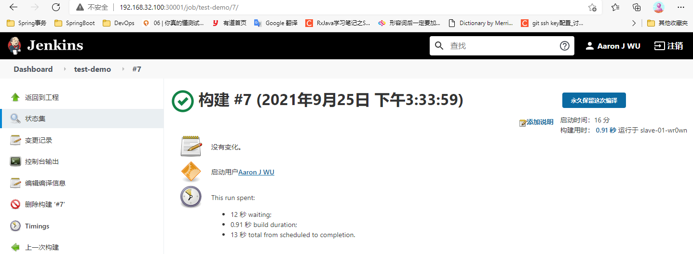
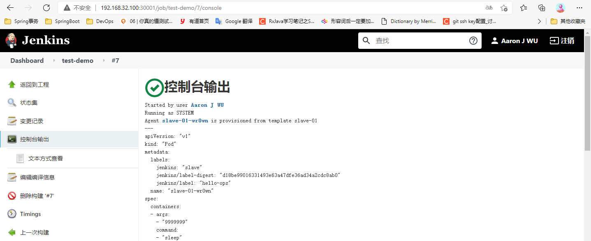

1. 基于 Kubernete 的 CI/CD ，可以使⽤的⼯具有很多，⽐如 Jenkins 、Gitlab CI 和已经新兴的 drone 之类的，这里使用 Jenkins 来 做 CI/CD 的⼯具。相关概念如下:

- CI，Continuous Integration，为持续集成。即在代码构建过程中持续地进行代码的集成、构建、以及自动化测试等；有了 CI 工具，我们可以在代码提交的过程中通过单元测试等尽早地发现引入的错误；

- CD，Continuous Deployment，为持续交付。在代码构建完毕后，可以方便地将新版本部署上线，这样有利于快速迭代并交付产品

- DevOps（Development+Operations）强调共同对业务目标负责，以实现用户价值作为唯一的评判标准：保证产品功能及时实现、成功部署和稳定使用


参考资料:

DevOps - DevOps基础概念梳理

https://www.cnblogs.com/anliven/p/9136624.html


GitLab CI/CD 基础教程（一）

https://blog.csdn.net/bingfeilongxin/article/details/88326984


Drone CI：搭建自己CI/CD（一）

https://blog.csdn.net/github_37410569/article/details/106140294


DevOps基础-1.1-什么是DevOps以及概述

https://blog.csdn.net/u011541946/article/details/81161321


2. 在 Kubernetes 环境下⾯使⽤ Jenkins 的好处。


持续构建与发布是⽇常⼯作中必不可少的⼀个步骤，⽬前⼤多公司都采⽤ Jenkins 集群来搭建符合需求的 CI/CD 流程，然⽽传统的 Jenkins Slave ⼀主多从⽅式会存在⼀些痛点，⽐如：

- 主 Master 发⽣单点故障时，整个流程都不可⽤了 

- 每个 Slave 的配置环境不⼀样，来完成不同语⾔的编译打包等操作，但是这些差异化的配置导致 管理起来⾮常不⽅便，维护起来也是⽐较费劲 

- 资源分配不均衡，有的 Slave 要运⾏的 job 出现排队等待，⽽有的 Slave 处于空闲状态 

- 资源有浪费，每台 Slave 可能是物理机或者虚拟机，当 Slave 处于空闲状态时，也不会完全释放 掉资源。

正因为上⾯的这些种种痛点，所以渴望⼀种更⾼效更可靠的⽅式来完成这个 CI/CD 流程，⽽ Docker 虚拟化容器技术能很好的解决这个痛点，⼜特别是在 Kubernetes 集群环境下⾯能够更好来解决上⾯的 问题，下图是基于 k8s 搭建 Jenkins 集群的简单示意图：

.png)

从图上可以看到 Jenkins Master 和 Jenkins Slave 以 Pod 形式运⾏在 Kubernetes 集群的 Node 上， Master 运⾏在其中⼀个节点，并且将其配置数据存储到⼀个 Volume 上去，Slave 运⾏在各个节点 上，并且它不是⼀直处于运⾏状态，它会按照需求动态的创建并⾃动删除。

这种⽅式的⼯作流程⼤致为：当 Jenkins Master 接受到 Build 请求时，会根据配置的 Label 动态创建 ⼀个运⾏在 Pod 中的 Jenkins Slave 并注册到 Master 上，当运⾏完 Job 后，这个 Slave 会被注销并 且这个 Pod 也会⾃动删除，恢复到最初状态。使⽤这种⽅式会带来如下哪些好处:

- 服务⾼可⽤，当 Jenkins Master 出现故障时，Kubernetes 会⾃动创建⼀个新的 Jenkins Master 容器，并且将 Volume 分配给新创建的容器，保证数据不丢失，从⽽达到集群服务⾼可⽤。概括成一句话：master节点的Pod挂了后不会出现单点故障的问题 。

- 动态伸缩，合理使⽤资源，每次运⾏ Job 时，会⾃动创建⼀个 Jenkins Slave，Job 完成后， Slave ⾃动注销并删除容器，资源⾃动释放，⽽且 Kubernetes 会根据每个资源的使⽤情况，动态分配 Slave 到空闲的节点上创建，降低出现因某节点资源利⽤率⾼，还排队等待在该节点的情况。 

- 扩展性好，当 Kubernetes 集群的资源严重不⾜⽽导致 Job 排队等待时，可以很容易的添加⼀个 Kubernetes Node 到集群中，从⽽实现扩展。


之前⾯临的种种问题在 k8s 集群环境下⾯都没有了，看上去⾮常完美。


3. 要基于 Kubernetes 来做 CI/CD，所以需要将 Jenkins 安装到 Kubernetes 集群当中.

把安装需要的所有资源都放在⼀个名为 kube-ops 的 namespace 下⾯.


3.1 安装前准备

```javascript
// 创建 kube-ops 这个namespace
kubectl create ns kube-ops
kubectl get ns

// 拉取 Jenkins 镜像
docker pull jenkins/jenkins:lts
```


3.2 准备YAML文件以及安装

[volume.yaml](attachments/0C65FC819A5A4CFF8C4DA1AF89CB8389volume.yaml)


[jenkins.yaml](attachments/CC1A0C9FBE0F4B98B7337B4CCC641397jenkins.yaml)


[rbac.yaml](attachments/3E00269CF97C49CFAADC73EFAEC19F8Erbac.yaml)


[svc.yaml](attachments/CDF5765EE9CC4E1CB9F98B69E9536B1Dsvc.yaml)


```javascript
# volume.yaml

apiVersion: v1
kind: PersistentVolume
metadata:
  name: opspv
spec:
  capacity:
    storage: 10Gi
  accessModes:
  - ReadWriteMany
  persistentVolumeReclaimPolicy: Delete
  nfs:
    server: 192.168.32.100
    path: /data/k8s

---
kind: PersistentVolumeClaim
apiVersion: v1
metadata:
  name: opspvc
  namespace: kube-ops
spec:
  accessModes:
    - ReadWriteMany
  resources:
    requests:
      storage: 10Gi
```


```javascript
# jenkins.yaml
---
apiVersion: apps/v1
kind: Deployment
metadata:
  name: jenkins
  namespace: kube-ops
spec:
  selector:
    matchLabels:
      app: jenkins
  template:
    metadata:
      labels:
        app: jenkins
    spec:
      terminationGracePeriodSeconds: 10
      serviceAccountName: jenkins
      containers:
      - name: jenkins
        image: jenkins/jenkins:lts
        imagePullPolicy: IfNotPresent
        ports:
        - containerPort: 8080
          name: web
          protocol: TCP
        - containerPort: 50000
          name: agent
          protocol: TCP
        resources:
          limits:
            cpu: 1000m
            memory: 1Gi
          requests:
            cpu: 500m
            memory: 512Mi
        livenessProbe:
          httpGet:
            path: /login
            port: 8080
          initialDelaySeconds: 60
          timeoutSeconds: 5
          failureThreshold: 12 # ~2 minutes
        readinessProbe:
          httpGet:
            path: /login
            port: 8080
          initialDelaySeconds: 60
          timeoutSeconds: 5
          failureThreshold: 12 # ~2 minutes
        volumeMounts:
        - name: jenkinshome
          subPath: jenkins
          mountPath: /var/jenkins_home
        env:
        - name: LIMITS_MEMORY
          valueFrom:
            resourceFieldRef:
              resource: limits.memory
              divisor: 1Mi
        - name: JAVA_OPTS
          value: -Xmx$(LIMITS_MEMORY)m -XshowSettings:vm -Dhudson.slaves.NodeProvisioner.initialDelay=0 -Dhudson.slaves.NodeProvisioner.MARGIN=50 -Dhudson.slaves.NodeProvisioner.MARGIN0=0.85 -Duser.timezone=Asia/Shanghai
      securityContext:
        fsGroup: 1000
        runAsUser: 0
      volumes:
      - name: jenkinshome
        persistentVolumeClaim:
          claimName: opspvc
```

 jenkins/jenkins:lts 是 jenkins 官⽅的 Docker 镜像，它也有⼀些环境变量，当然也可以根据⾃⼰的需求定制⼀个镜像，⽐如可以将⼀些插件打包在⾃定义的镜像当中，可以参考⽂档：https://github.com/jenkinsci/docker，这⾥使⽤默认的官⽅镜像就⾏。

另外⼀个还需要注意的是将容器的 /var/jenkins_home ⽬录挂载到了⼀个名为 opspvc 的 PVC 对象上⾯，所以同样还得提前创建⼀个对应的 PVC 对象，当然也可以使⽤ StorageClass 对象来⾃动创建。

这⾥还需要使⽤到⼀个拥有相关权限的 serviceAccount：jenkins ，这⾥只是给 jenkins 赋予了⼀些必要的权限，如果对 serviceAccount 的权限不是很熟悉的话，给这个 sa 绑定 ⼀个 cluster-admin 的集群⻆⾊权限也是可以的，当然这样具有⼀定的安全⻛险。

```javascript
# rbac.yaml

apiVersion: v1
kind: ServiceAccount
metadata:
  name: jenkins
  namespace: kube-ops

---

kind: ClusterRole
apiVersion: rbac.authorization.k8s.io/v1
metadata:
  name: jenkins
rules:
  - apiGroups: ["apps"]
    resources: ["deployments"]
    verbs: ["create", "delete", "get", "list", "watch", "patch", "update"]
  - apiGroups: [""]
    resources: ["services"]
    verbs: ["create", "delete", "get", "list", "watch", "patch", "update"]
  - apiGroups: [""]
    resources: ["pods"]
    verbs: ["create","delete","get","list","patch","update","watch"]
  - apiGroups: [""]
    resources: ["pods/exec"]
    verbs: ["create","delete","get","list","patch","update","watch"]
  - apiGroups: [""]
    resources: ["pods/log"]
    verbs: ["get","list","watch"]
  - apiGroups: [""]
    resources: ["secrets"]
    verbs: ["get"]

---
apiVersion: rbac.authorization.k8s.io/v1
kind: ClusterRoleBinding
metadata:
  name: jenkins
roleRef:
  apiGroup: rbac.authorization.k8s.io
  kind: ClusterRole
  name: jenkins
subjects:
  - kind: ServiceAccount
    name: jenkins
    namespace: kube-ops
    
```


```javascript
# svc.yaml

apiVersion: v1
kind: Service
metadata:
  name: jenkins
  namespace: kube-ops
  labels:
    app: jenkins
spec:
  selector:
    app: jenkins
  type: NodePort
  ports:
  - name: web
    port: 8080
    targetPort: web
    nodePort: 30001
  - name: agent
    port: 50000
    targetPort: agent 
```

为了⽅便测试，这⾥通过 NodePort 的形式来暴露 Jenkins 的 web 服务，固定为 30001 端⼝，另外还需要暴露⼀个 agent 的端⼝，这个端⼝主要是⽤于 Jenkins 的 master 和 slave 之间通信使⽤。


```javascript
# 安装
kubectl create -f .
kubectl get pv
kubectl get pvc -n kube-ops
kubectl get pods -n kube-ops
kubectl logs -f jenkins-85db8588bd-gxnvq -n kube-ops
kubectl get svc -n kubectl-ops
kubectl describe svc jenkins -n kube-ops
# "-f"表示跟踪查看容器的日志，相当于tail -f 命令的结果
kubectl logs -f jenkins-85db8588bd-gxnvq -n kube-ops

// 因为Service中指定了nodePort的端口为 30001，所以可以通过如下日志访问jenkins:
http://192.168.32.100:30001
http://192.168.32.101:30001
```


需要注意的几个地方:

- jenkins暴露出了两个端口，8080是供外部使用的,50000是提供给jekins slave 来发现 master 的。

- jenkins所有的数据都是在"/var/jenkins_home"目录下面，如果不挂载，Pod挂掉的话数据就全没了。

- 要在enkins的  JAVA_OPTS 环境变量中添加时区。


3.3 根据提示信息进⾏安装配置 Jenkins

```javascript
// 基于 Jenkins 2.303.1 版本

// 1.登录以及创建Jenkins账号
// 打开 Jenkins 主页
// 提示初始密码在"/var/jenkins_home/secrets/initialAdminPassword"目录
// 对应到挂载的目录就是 "/data/k8s/jenkins/secrets/initAdminPassword"

// 使用这个密码进入到下一页,选择"安装推荐的插件",对应的英文版选择"Install suggested plugins"
// 安装插件会出现很多插件安装失败，解决方法如下:
// 系统管理 -> 插件管理 -> 高级 -> 升级站点 url -> 修改url -> 提交
// 	  原url: https://updates.jenkins.io/update-center.json
//	  更新为: http://mirror.esuni.jp/jenkins/updates/update-center.json
// 提交后Jenkins会重启,重启后发现所有插件已安装完成,如果有失败的插件,再手动更新一下

// 2. 插件安装完成后进入添加管理员界面,有以下两种情况:
//   1.如果自己创建一个管理员账号,会自动删除"/data/k8s/jenkins/secrets/initAdminPassword"
//   2.不添加管理员账号,使用默认admin登录,以后还是使用默认初始密码登录,不会自动删除"/data/k8s/jenkins/secrets/initAdminPassword",
//     这个密码也可以在进入到 Jenkins 的设置界面更改,更改密码后也不会自动删除"/data/k8s/jenkins/secrets/initAdminPassword"。

// 这里创建一个管理员账号,账号信息如下:
//    Username：aaron
//    Password：admin000

// 3. 进入到 Jenkins 的 Dashboard 界面。

```


参考资料:

【Devops】【Jenkins】Jenkins插件安装失败处理方法

https://www.cnblogs.com/sxdcgaq8080/p/10489326.html


3.4  Jenkins 安装到 Kubernetes 集群过程中出现的问题以及解决方法。

```javascript
// 发现Pod 处于 Running 状态,READY 值确为0
kubectl get pods -n kube-ops
// describe 查看详细信息, 发现 Warning 信息显示 健康检查没有通过
kubectl describe pod jenkins-85db8588bd-gxnvq -n kube-ops

// 通过日志查看原因
kubectl logs -f jenkins-85db8588bd-gxnvq -n kube-ops
// 发现出现如下错误
Can not write to /var/jenkins_home/copy_reference_file.log. Wrong volume permissions?
touch: cannot touch ‘/var/jenkins_home/copy_reference_file.log’: Permission denied
```

这个错误出现的原因是：没有权限在 jenkins 的 home ⽬录下⾯创建⽂件，这是 因为默认的镜像使⽤的是 jenkins 这个⽤户，⽽通过 PVC 挂载到 nfs 服务器的共享数据⽬录下⾯却是 root ⽤户的，所以没有权限访问该⽬录。解决方法有四种:

- 对宿主机目录进行授权，然后删除再重新安装Jenkins，如下:

```javascript
chmod 777 /data/k8s/jenkins/
kubectl delete -f jenkins.yaml
kubectl create -f jenkins.yaml
```


- 在 nfs 共享数据⽬ 录下⾯把我们的⽬录权限重新分配下:

```javascript
chown -R 1000 /data/k8s/jenkins
```


- 在 jenkins.yaml 中的 spec.template.spec 下添加如下属性:

```javascript
// "runAsUser: 0" 表示用 root 作为用户去运行,0代表的是root帐号Id
      securityContext:
        fsGroup: 1000
        runAsUser: 0
// fsGroup可以用来设置允许访问某些Volume的Group ID范围
// "fsGroup: 1000" 表示挂载的卷及其中创建的文件都将属于 Group ID 1000
//例如:操作容器是jenkins这个普通用户,假如jenkins这个用户所在的组id是1000,那么挂载的卷及其中创建的文件都将属于jenkins这个组.
//     也就是说这样设置后,jenkins这个用户操作挂载的卷及其中的文件时就不会有权限问题.
```


- ⾃定义⼀个镜像，在镜像中指定使⽤ root ⽤户。


参考的相关文档如下:

一文读懂k8s之Pod安全策略(有详细讲解fsGroup这个字段)

https://www.cnblogs.com/liusy01/p/14305580.html


在k8s中安装jenkins

https://www.mindg.cn/?p=2607


使用jenkins镜像出现的问题

https://blog.csdn.net/weixin_47219935/article/details/109092309


K8S安装Jenkins

https://www.jianshu.com/p/80db766c89f2


4. 在 Jenkins 中安装 kubernetes 插件并配置 Jenkins，让其能够动态的⽣成 Slave 的 Pod。


基于 Jenkins 2.303.1 版本,不同版本的Jenkins其操作选项可能不一样!


第一步. 我们需要安装kubernetes 插件， 

点击 Manage Jenkins -> Manage Plugins -> Available -> 搜索"Kubernetes" ->  勾选"Kubernetes"安装即可。


第2步. 安装完成后回到Jenkins主页，系统管理 -> 节点管理 -> Configure Clouds -> Kubernetes Cloud details ...，开始填配置信息:

4.1 

```javascript
名称: kubernetes
Kubernetes 地址: https://kubernetes.default.svc.cluster.local
# 格式: https://$ServiceName.$namespace.svc.cluster.local
# 这个URL是k8s的集群内部的一个URL, 这个URL是个Service的形式
```


4.2

```javascript
Kubernetes 命名空间: kube-ops
点击"连接测试"
# 出现“Connected to Kubernetes v1.22.1”证明Jenkins和k8s的交互是个正常通信
# 如果"Test Connection"失败的话,很有可能是权限问题,需要把创建的jenkins的SA对应的secret添加到这里的凭据(Credentials)中
```


4.3

```javascript
Jenkins 地址: http://jenkins.kube-ops.svc.cluster.local:8080
# 格式：http://$jenkinsServiceName.$namespace.svc.cluster.local:$Service暴露的端口
# 通过这个地址可以在集群内部访问服务,这就是访问集群内部服务的一种方式。
# 如果不指定这个地址会出现异常"java.io.IOException: http://xx.xx.xx.x:xxxx/ provided port:50000 is not reachable"
// 参考的文档如下: 
// 在k8s上安装Jenkins及常见题: https://blog.csdn.net/weixin_38748858/article/details/102898043
```


4.4

```javascript
# Pod Label也要填上,不然在jenkins的 上点击"立即构建"没有反应
键: jenkins
值: jnlp-agent
```


然后点击 Pod Templates... -> 添加 Pod 模板 -> Pod Template details...，在这里填Pod配置信息, 这个Pod就是配置 Jenkins slave 的 Pod 的模板,  使用的配置信息如下:


4.5

```javascript
# 这里的名称可以任意填写
名称:  jnlp-agent

# 这个命令空间很重要,和 Master Jenkins 所在的命名空间保持一致
命名空间: kube-ops

#这个标签(label)很重要, 因为在跑Job的时候需要用到这个Job。
标签列表: hello-ops
```


点击添加容器 -> Container Template 


4.6 这里的配置要特别注意

```javascript
# 特别注意这里的name
# 如果 Name 配置为 jnlp,那么k8s会用下边指定的 Docker Image
# 如果 Name 配置不是 jnlp,即使指定了其他的 Docker Image,k8s plugin 还是会用默认的 jenkins/inbound-agent 镜像与 Jenkins Server 建立连接
名称: jnlp

# 这个镜像里面包含了kubectl和docker一些文件,就是说可以在镜像里面可以运行kubectl和docker命令
# "inbound-agent-dcker:4.3-4"镜像使用了DockerInDocker的轻量级实现方法,只需要安装Docker执行需要的库文件,不需要安装Docker程序
Docker 镜像: inbound-agent-dcker:4.3-4

# 这个工作目录要和"inbound-agent-dcker:4.3-4"镜像的dockerfile文件中定义的"WORKDIR"一样
工作目录: /home/jenkins
```


点击"添加卷" -> Host Path Volume


4.7

```javascript
主机路径：/root/.kube
挂载路径： /home/jenkins/.kube
# 将"/root/.kube"这个⽬录挂载到容器"/home/jenkins/.kube"⽬录
# 是为了让我们能够在 Pod 的容器中能够使⽤ kubectl ⼯具来访问的 k8s 集群
# ⽅便后⾯在 Slave Pod 部署 Kubernetes 应⽤  
```


点击"添加卷" -> Host Path Volume


4.8

```javascript
主机路径：/usr/bin/docker
挂载路径：/usr/bin/docker
# 因为"inbound-agent-dcker:4.3-4"镜像没有安装Docker程序,所以需要挂载宿主机的"/usr/bin/docker"
```


点击"添加卷" -> Host Path Volume


4.9

```javascript
主机路径： /var/run/docker.sock
挂载路径： /var/run/docker.sock
# 如果想在容器中执行Docker命令，需要挂载"/var/run/docker.sock"这个主机目录
# 该⽂件是⽤于Pod中的容器能够共享宿主机的Docker,这就是常说的"docker in docker"⽅式
# Docker⼆进制⽂件已经打包到上⾯的镜像中
```


4.10

```javascript
代理的空闲存活时间（分）
# 这个参数表示是当 Slave Pod 处于空闲状态的时候保留多⻓时间
# 这个参数最好保持默认就⾏,如果你设置过⼤,Job任务执⾏完成后,对应的 Slave Pod 就不会⽴即被销毁删除
```


4.11

```javascript
Service Account：jenkins
# 添加Service Account,给 Jenkins Slave Pod 配置权限
# 不配置运⾏ Slave Pod 的时候会出现权限问题
```


其它参数保持默认，到此 Kubernetes Plugin 插件就算配置完成了。


5. 测试：添加⼀个 Job 任务，看是否能够在 Slave Pod 中 执⾏，任务执⾏完成后看 Pod 是否会被销毁。


5.1 

在Jenkins ⾸⻚ -> 新建任务  -> 输入任务名称 -> 构建一个自由风格的软件 -> 确定  -> 进入到配置页面


5.2

```javascript
勾选“限制项目的运行节点”

标签表达表达式: hello-ops
# 这里的标签就是前⾯(4.4)配置的 Slave Pod 中的标签(Label), 这两个地⽅必须保持⼀致
```


5.3

往下拉 -> 构建 -> 增加构建步骤 -> 执行Sehll -> 命令  框中填入如下内容:

```javascript
echo "测试 Kubernetes 动态⽣成 jenkins slave"
echo "==============docker in docker==========="
docker info
echo "=============kubectl============="
kubectl get pods
```

-> 点击保存 -> 点击"立即构建" 

在跑Job任务时，“docker info” 和 “kubectl get pods” 命令失败，因为宿主机中的docker和k8s是高版本，“cnych/jenkins:jnlp”镜像中的docker和k8s是低版本。如果版本能对应上，docker info 命令显示的 docker 信息和宿主机一样， “kubectl get pods” 也能显示出 Pod 的信息。


5.4

观察 Kubernetes 集群中 Pod 的变化：

```javascript
[root@centos7 aaron]# kubectl get pods  -n kube-ops
NAME                       READY   STATUS    RESTARTS        AGE
jenkins-85db8588bd-vrt4z   1/1     Running   3 (4h13m ago)   16h
slave-01-wr0wn             2/2     Running   0               4s
```

可以看到在点击⽴刻构建的时候可以看到⼀个名为slave-01-wr0wn的新的 Pod  被创建了，这就是的 Jenkins Slave。


5.5

任务执⾏完成后可以看到任务信息，⽐如我们这⾥是花费了 0.91s 时间在  slave-01-wr0wn 这个 Slave上。




5.6

同样也可以查看到对应的控制台信息：




5.7 

到这⾥证明任务已经构建完成，然后这个时候再去集群查看 Pod 列表，发现 kube-ops 这个 namespace 下⾯已经没有之前的 Slave 这个 Pod 了。

```javascript
[root@centos7 aaron]# kubectl get pods  -n kube-ops
NAME                       READY   STATUS    RESTARTS        AGE
jenkins-85db8588bd-vrt4z   1/1     Running   3 (4h37m ago)   17h
```

到这⾥就完成了使⽤ Kubernetes 动态⽣成 Jenkins Slave 的⽅法。


6. 参考资料

kubectl 常规命令: 

https://www.cnblogs.com/lovegrace/p/11020236.html


kubectl 常用命令总结 

https://www.cnblogs.com/klvchen/archive/2018/09/04/9585746.html


查看容器输出到stdout的日志

kubectl logs <pod-name>


跟踪查看容器的日志，相当于tail -f 命令的结果

kubectl logs -f <pod-name> -c <container-name>