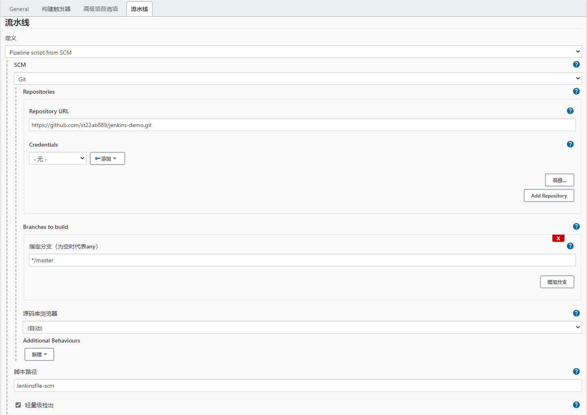

1. Jenkins Pipeline 介绍

要实现在 Jenkins 中的构建⼯作，可以有多种⽅式，这⾥采⽤⽐较常⽤的 Pipeline 这种⽅式。 Pipeline 简单来说，就是⼀套运⾏在 Jenkins 上的⼯作流框架，将原来独⽴运⾏于单个或者多个节点 的任务连接起来，实现单个任务难以完成的复杂流程编排和可视化的⼯作。Jenkins Pipeline 有⼏个核⼼概念：

- Node：节点，⼀个 Node 就是⼀个 Jenkins 节点，Master 或者 Agent，是执⾏ Step 的具体运⾏ 环境，⽐如之前动态运⾏的 Jenkins agent 就是⼀个 Node 节点 

- Stage：阶段，⼀个 Pipeline 可以划分为若⼲个 Stage，每个 Stage 代表⼀组操作，⽐如： Build、Test、Deploy，Stage 是⼀个逻辑分组的概念，可以跨多个 Node 

- Step：步骤，Step 是最基本的操作单元，可以是打印⼀句话，也可以是构建⼀个 Docker 镜像， 由各类 Jenkins 插件提供，⽐如命令：sh 'make'，就相当于我们平时 shell 终端中执⾏ make 命令 ⼀样。


2. 如何创建 Jenkins Pipline 

- Pipeline 脚本是由 Groovy 语⾔实现的，但是没必要单独去学习 Groovy，当然会的话最好 

- Pipeline ⽀持两种语法：Declarative(声明式)和 Scripted Pipeline(脚本式)语法 

- Pipeline 也有两种创建⽅法：可以直接在 Jenkins 的 Web UI 界⾯中输⼊脚本；也可以通过创建⼀ 个 Jenkinsfile 脚本⽂件放⼊项⽬源码库中 


⼀般都推荐在 Jenkins 中直接从源代码控制(SCMD)中直接载⼊ Jenkinsfile Pipeline 这种⽅法


3. 创建⼀个简单的 Pipeline

直接在 Jenkins 的 Web UI 界⾯中输⼊脚本运⾏,这样可以快速创建⼀个简单的 Pipeline，步骤如下:

- 新建 Job：Dashboard -> 新建任务 -> 输⼊名称：pipeline-demo -> 选择下⾯的 流水线 -> 点击 确定

- 配置：在最下⽅的 Pipeline 区域输⼊如下 Script 脚本，然后点击保存。

[pipeline script](attachments/00A7F75C77CC49E7B8BFC57D3FEB201Epipeline script)

```javascript
node{
    stage('Clone') {
        echo "1.Clone Stage"
    }
    stage('Test') {
        echo "2.Test Stage"
    }
    stage('Build') {
        echo "3.Build Docker Image Stage"
    }
    stage('Push') {
        echo "4.Push Docker Image Stage"
    }
    stage('YAML') {
        echo "5. Change YAML File Stage"
    }
    stage('Deploy') {
        echo "6. Deploy Stage"
    }
}
```

- 构建：点击左侧区域的 立即构建，可以看到 Job 开始构建了


在 Console Output 中可以看到们 Pipeline 脚本中的4条输出语句都打印出来了，证明是符合预期的


对Pipeline语法不是特别熟悉的,可以前往输⼊脚本下⾯的链接 Pipeline Syntax 中进⾏查看,这⾥有很多关于 Pipeline 语法的介绍,也可以⾃动⽣成⼀些脚本。


4. 在 Slave 中构建任务

上⾯创建的 Pipeline 任务并没有在 Jenkins 的 agent 中运⾏，重新编辑上面的Pipeline 脚本，给 node 添加⼀个 label 属性(这个label就是添加 Agent Pod 的时候一定要添加的那个 label )，让任务跑在 Agent  中，如下：

[pipeline script agent](attachments/CEB0E2E6800C48479C93B478C0DE21D5pipeline script agent)

```javascript
node("hello-ops"){
    stage('Clone') {
        echo "1.Clone Stage"
    }
    stage('Test') {
        echo "2.Test Stage"
    }
    stage('Build') {
        echo "3.Build Docker Image Stage"
    }
    stage('Push') {
        echo "4.Push Docker Image Stage"
    }
    stage('YAML') {
        echo "5. Change YAML File Stage"
    }
    stage('Deploy') {
        echo "6. Deploy Stage"
    }
}
```


点击左侧区域的 立即构建 后，查看 Pod 列表可以查看到如下信息，发现多了⼀个名为 jnlp-agent-fd480 的 Pod 正在运⾏，当 Job 构建完成后, 这个 Pod 就不在了:

```javascript
[root@centos7 aaron]# kubectl get pods -n kube-ops
NAME                       READY   STATUS    RESTARTS      AGE
jenkins-85db8588bd-tjsn5   1/1     Running   4 (34m ago)   2d9h
jnlp-agent-fd480           1/1     Running   0             14s
```


查看本次构建的 Console Output，可以看到如下信息:

```javascript
Started by user Aaron J WU
Running in Durability level: MAX_SURVIVABILITY
[Pipeline] Start of Pipeline
[Pipeline] node
Still waiting to schedule task
‘jnlp-agent-fd480’ is offline
Agent jnlp-agent-fd480 is provisioned from template jnlp-agent
// 省略....
```


这也证明当前的任务在跑在上⾯动态⽣成的这个 Pod 中，同样符合预期。


5. 部署 Kubernetes 应⽤

上⾯是在 Jenkins Agent 中构建任务，现在来部署⼀个原⽣的 Kubernetes 应⽤,要部署 Kubernetes 应⽤就得对在 Kubernetes 环境中部署⼀个原⽣应⽤的流程要⾮常熟悉，流程一般是这样的：

- 编写代码

- 测试

- 编写 Dockerfile

- 构建打包 Docker 镜像

- 推送 Docker 镜像到仓库

- 编写 Kubernetes YAML ⽂件

- 更改 YAML ⽂件中 Docker 镜像 TAG

- 利⽤ kubectl ⼯具部署应⽤

现在就需要把上⾯这些流程放⼊ Jenkins 中来⾃动帮我们完成(当然编码除外)，从测试到更新 YAML ⽂件属于 CI 流程，后⾯部署属于 CD 的流程。


这⾥将⼀个golang 程序部署到 kubernetes 环境中，如果按照之前的示例应该这样来编写 Pipeline 脚本, 代码链接：https://github.com/st22ab889/jenkins-demo

- 第⼀步，clone 代码

- 第⼆步，进⾏测试，如果测试通过了才继续下⾯的任务

- 第三步，由于 Dockerfile 基本上都是放⼊源码中进⾏管理的，所以这⾥直接构建 Docker 镜像

- 第四步，镜像打包完成，就应该推送到镜像仓库中

- 第五步，镜像推送完成，更改 YAML ⽂件中的镜像 TAG 为这次镜像的 TAG

- 第六步，最后⼀步，使⽤ kubectl 命令⾏⼯具进⾏部署了，到这⾥整个 CI/CD 的流程就都完成了


5.1 如下就是部署 k8s 应⽤所需要的 Jenkinsfile 和 k8s-jenkins-go-demo.yaml ,这两个文件带有详细的笔记.

[JenkinsfileWithNote](attachments/72EDABB1DC1741F6908796713E752835JenkinsfileWithNote)

```javascript
node("hello-ops"){
    stage('Clone') {
        echo "1.Clone Stage"
        git url: "https://github.com/st22ab889/jenkins-demo.git"
        
        // 由于这个tag会在多个stage需要使⽤,下⼀个推送镜像也需要,所以这⾥把这个tag编写成⼀个公共的参数放在Clone这个stage中
        script {
            env.BRANCH_NAME = "master"
            // returnStdout表示在命令行终端执行完成后把它输出的内容给返回回来
            build_tag = sh(returnStdout: true, script: 'git rev-parse --short HEAD').trim()
            if ("${env.BRANCH_NAME}" != 'master') {
                build_tag = "${env.BRANCH_NAME}-${build_tag}"
            }            
        }
    }

    stage('Test') {
        echo "2.Test Stage"
    }

    // 因为Agent Pod的镜像⾥⾯采⽤了DockerInDocker的⽅式,也就是说可以直接在Agent中使⽤docker build,所以这⾥直接使⽤sh执⾏docker build命令即可
    // 如果使⽤镜像tag,则每次都是latest的tag,这对于以后的排查或者回滚之类的⼯作会带来很⼤麻烦
    // 这⾥采⽤git commit的记录为镜像的tag,这⾥好处就是镜像的tag可以和git提交记录对应起来,⽅便⽇后对应查看
    stage('Build') {
        echo "3.Build Docker Image Stage"
        sh "docker build -t st22ab889/jenkins-demo:${build_tag} ."
    }

    // 镜像构建完成后,就需要将构建的镜像推送到私有镜像仓库, 如果没有⾃⼰搭建私有的仓库,也可以直接使⽤ docker hub
    stage('Push') {
        echo "4.Push Docker Image Stage"
        // docker hub是公共的镜像仓库,任何⼈都可以获取上⾯的镜像,但是要推送镜像就需要帐号,使⽤docker login命令登录认证后才能推送镜像到docker hub
        // 如果只是在 Jenkins 的 Web UI 界⾯中来完成这个任务,这⾥的 Pipeline 可以这样写
        // 但是推荐使⽤ Jenkinsfile 的形式放⼊源码中进⾏版本管理,这样的话直接把docker仓库的⽤户名和密码暴露给别⼈,显然很不安全
        // 而且这⾥使⽤的是github的公共代码仓库，所有⼈都可以直接看到源码
        
        // sh "docker login -u st22ab889 -p st22ab889"
        // sh "docker push st22ab889/jenkins-demo:${build_tag}"

        // Jenkins提供了解决⽅法,无须显示的写出用户名和密码
        // 首页 -> 系统管理 -> Manage Credentials -> Jenkins -> 全局凭据 (unrestricted) -> 添加凭据 -> 填写如下:
        //      类型: Username with password
        //      范围: 全局
        //      用户名: st22ab889
        //      密码: st22ab889
        //      id: docekrAuth
        
        // 这⾥的 stage 中使⽤了⼀个新的函数withCredentials，credentialsId 值就是我们添加全局凭据中填写的ID值
        // 这样在脚本中就直接使⽤这⾥两个变量值替换掉⽤户名和密码,这样就很安全了
        withCredentials([usernamePassword(credentialsId: 'docekrAuth', passwordVariable: 'dockerPassword', usernameVariable: 'dockerUser')]) {
            sh "docker login -u ${dockerUser} -p ${dockerPassword}"
            sh "docker push st22ab889/jenkins-demo:${build_tag}"
        }

        // 后⾯使用 Harbor 的搭建私有仓库后, 再来更改成 Harbor 仓库
    }

    // 完成镜像的打包、推送⼯作后,接下来更新k8s系统中应⽤的镜像版本,为了⽅便维护,都是⽤ YAML ⽂件的形式来编写应⽤部署规则
    stage('YAML') {
        echo "5. Change YAML File Stage"
        
        // ⼈⼯确认:这⾥使⽤了input关键字,⾥⾯使⽤了⼀个 Choice 的列表来让⽤户进⾏选择
        def userInput = input(
            id: 'userInput',
            message: 'Choose a deploy environment',
            parameters: [
                [
                    $class: 'ChoiceParameterDefinition',
                    choices: "Dev\nQA\nProd",
                    name: 'Env'
                 ]
            ]
        )
        // 在选择了部署环境后,当然也可以针对不同的环境再做⼀些操作，⽐如可以给不同环境的 YAML ⽂件部署到不同的namespace下⾯去,增加不同的标签等操作
        echo "This is a deploy step to ${userInput} Env"
        
        // sed命令就是将 k8s-jenkins-go-demo.yaml ⽂件中的<BUILD_TAG>标识给替换成变量 build_tag 的值
        sh "sed -i 's/<BUILD_TAG>/${build_tag}/' k8s-jenkins-go-demo.yaml"
    }

    stage('Deploy') {
        echo "6. Deploy Stage"
        // ⼿动的环境下直接使⽤ kubectl apply 命令可以直接更新应⽤,这⾥只是写⼊到了 Pipeline ⾥⾯,思路都是⼀样的, 到这⾥我们的整个流程就算完成了
        // sh "kubectl apply -f k8s-jenkins-go-demo.yaml"

        // 添加"⼈⼯确认"环节
        // 上⾯的6个步骤其实已经完成了整个流程. 但是⼀般在实际项⽬实践过程中,可能还需要⼀些⼈⼯⼲预的步骤
        // ⽐如提交了⼀次代码,测试也通过了,镜像也打包上传了,但是这个版本并不⼀定就是要⽴刻上线到⽣产环境
        // 可能需要将该版本先发布到测试环境、QA 环境、或者预览环境之类的,总之直接就发布到线上环境去还是挺少⻅的,所以需要增加⼈⼯确认环节
        // ⼀般都是在 CD 的环节才需要⼈⼯⼲预,⽐如这⾥的最后两步,就可以在前⾯加上确认,如下：

        if (userInput == "Dev") {
            input "please confirm deploy to DEV env ?"
        } else if (userInput == "QA"){
            input "please confirm deploy to QA env ?"
        } else {
             input "please confirm deploy to Prod env ?"
        }
        sh "sed -i 's/<BRANCH_NAME>/${env.BRANCH_NAME}/' k8s.yaml"

        sh "cat k8s-jenkins-go-demo.yaml"
        // 加上 --record 参数在做滚动更新的时候会留下一个记录,方便排查问题
        sh "kubectl apply -f k8s-jenkins-go-demo.yaml --record"

        // 因为最后两步( stage('YAML')和stage('Deploy') )都属于部署的范畴,所以可以将最后两步都合并成⼀步
    }
}

```

[k8s-jenkins-go-demo-withNote.yaml](attachments/A54A88CEBC454516A756B64E703439E2k8s-jenkins-go-demo-withNote.yaml)

```javascript
# 使⽤⼀个 Deployment 资源对象来管理 Pod，该 Pod 使⽤的就是推送到 docker hub 的镜像
# 需要注意的是Docker镜像的tag不是平常⻅的具体的tag，⽽是⼀个的标识
# 这里的标识在jenkins的pipeline脚本中使用sed命令替换成Docker镜像的tag,就是最终本次构建需要使⽤到的镜像
---
apiVersion: apps/v1
kind: Deployment
metadata:
  name: jenkins-demo
  # 这里如果不指定命名空间,就会默认使用jenkins agent这个Pod创建时使用的命名空间
  namespace: default
spec:
  selector:
    matchLabels:
      app: jenkins-demo    
  template:
    metadata:
      labels:
        app: jenkins-demo
    spec:
      containers:
      - image: st22ab889/jenkins-demo:<BUILD_TAG>
        imagePullPolicy: IfNotPresent
        name: jenkins-demo
        env:
        - name: branch
          value: <BRANCH_NAME>
```


5.2 上面的文件简化后如下.

https://github.com/st22ab889/jenkins-demo/blob/master/Jenkinsfile

[Jenkinsfile](attachments/9FA0AFB2B6DA41099D23B233E794A5E4Jenkinsfile)

```javascript
node("hello-ops"){
    stage('Clone') {
        echo "1.Clone Stage"
        git url: "https://github.com/st22ab889/jenkins-demo.git"
        script {
            env.BRANCH_NAME = "master"
            build_tag = sh(returnStdout: true, script: 'git rev-parse --short HEAD').trim()
            if ("${env.BRANCH_NAME}" != 'master') {
                build_tag = "${env.BRANCH_NAME}-${build_tag}"
            }
        }
    }
    stage('Test') {
        echo "2.Test Stage"
    }
    stage('Build') {
        echo "3.Build Docker Image Stage"
        sh "docker build -t st22ab889/jenkins-demo:${build_tag} ."
    }
    stage('Push') {
        echo "4.Push Docker Image Stage"
        // push 到 docker hub 这一步非常慢
        //withCredentials([usernamePassword(credentialsId: 'docekrAuth', passwordVariable: 'dockerPassword', usernameVariable: 'dockerUser')]) {
        //    sh "docker login -u ${dockerUser} -p ${dockerPassword}"
        //    sh "docker push st22ab889/jenkins-demo:${build_tag}"
        //}
    }
    stage('Deploy') {
        echo "6. Change YAML File Stage And Deploy Stage"
        def userInput = input(
            id: 'userInput',
            message: 'Choose a deploy environment',
            parameters: [
                [
                    $class: 'ChoiceParameterDefinition',
                    choices: "Dev\nQA\nProd",
                    name: 'Env'
                 ]
            ]
        )
        echo "This is a deploy step to ${userInput} Env"
        sh "sed -i 's/<BUILD_TAG>/${build_tag}/' k8s-jenkins-go-demo.yaml"
        
        if (userInput == "Dev") {
            input "please confirm deploy to DEV env ?"
        } else if (userInput == "QA"){
            input "please confirm deploy to QA env ?"
        } else {
             input "please confirm deploy to Prod env ?"
        }
        sh "sed -i 's/<BRANCH_NAME>/${env.BRANCH_NAME}/' k8s-jenkins-go-demo.yaml"
        
        sh "cat k8s-jenkins-go-demo.yaml"
        sh "kubectl apply -f k8s-jenkins-go-demo.yaml --record"
    }
}
```

[k8s-jenkins-go-demo.yaml](attachments/F98E7A18A2664D459DAED5F1783605F7k8s-jenkins-go-demo.yaml)

```javascript
---
apiVersion: apps/v1
kind: Deployment
metadata:
  name: jenkins-demo
  namespace: default
spec:
  selector:
    matchLabels:
      app: jenkins-demo    
  template:
    metadata:
      labels:
        app: jenkins-demo
    spec:
      containers:
      - image: st22ab889/jenkins-demo:<BUILD_TAG>
        imagePullPolicy: IfNotPresent
        name: jenkins-demo
        env:
        - name: branch
          value: <BRANCH_NAME>
```


在 Jenkins Web UI 中重新配置 jenkins-demo 这个任务，将上⾯的Jenkinsfile脚本粘贴到 Script 区域， 重新保存，然后点击左侧的 立即构建，然后过⼀会⼉就可以在 阶段视图界⾯出现了暂停的情况，这就是上⾯ Deploy 阶段加⼊了⼈⼯确认的步骤，所以这个时候构建暂停了，需要⼈为的确认 ，⽐如这⾥选择 QA，然后点击 继续，就可以继续往下⾛了，然后构建就成功了，在 阶段视图  的 Deploy 这个阶段可以看到如下的⼀些⽇志信息：

.png)

打印出来了 QA，和刚刚的选择⼀致，从 k8s 集群中观察部署的应⽤：

```javascript
[root@centos7 aaron]# kubectl get deployment | grep jenkins-demo
jenkins-demo             0/1     1            0           39s
[root@centos7 aaron]# kubectl get pods | grep jenkins-demo
jenkins-demo-6cc68fcf95-sbqg2             0/1     Completed   4 (54s ago)   95s
[root@centos7 aaron]# kubectl logs jenkins-demo-6cc68fcf95-sbqg2
Hello, Kubernetes！I'm from Jenkins CI！
BRANCH_NAME: master
```


可以看到应⽤已经正确的部署到了 Kubernetes 的集群环境中。


6.  Jenkinsfile 

这⾥只是完成了⼀次⼿动的添加任务的构建过 程，在实际的⼯作实践中，更多的是将 Pipeline 脚本写⼊到 Jenkinsfile ⽂件中，然后和代码⼀起提交到代码仓库中进⾏版本管理。既然 Jenkinsfile 已经在 git 仓库中了，所以就不需要 git clone 这⼀步骤了，所以这里将第⼀步 Clone 操作中的 git clone 这⼀步去掉。参考：https://github.com/st22ab889/jenkins-demo


脚本改为如下:

https://github.com/st22ab889/jenkins-demo/blob/master/Jenkinsfile-scm

```javascript
node("hello-ops"){
    stage('Prepare') {
        echo "1.Prepare Stage"
        // BRANCH_NAME 这个变量仅在多分支管线中起作用
        // BRANCH_NAME 对于多分支项目,此名称将设置为正在构建的分支的名称.例如,如果希望从主分支而不是功能分支部署到生产环境.
        echo 'Pulling...' + env.BRANCH_NAME
        checkout scm
        script {
            build_tag = sh(returnStdout: true, script: 'git rev-parse --short HEAD').trim()
            if (env.BRANCH_NAME != 'master') {
                build_tag = "${env.BRANCH_NAME}-${build_tag}"
            }
        }
    }
    stage('Test') {
        echo "2.Test Stage"
    }
    stage('Build') {
        echo "3.Build Docker Image Stage"
        sh "docker build -t st22ab889/jenkins-demo:${build_tag} ."
    }
    stage('Push') {
        echo "4.Push Docker Image Stage"
        // push 到 docker hub 这一步非常慢
        //withCredentials([usernamePassword(credentialsId: 'docekrAuth', passwordVariable: 'dockerPassword', usernameVariable: 'dockerUser')]) {
        //    sh "docker login -u ${dockerUser} -p ${dockerPassword}"
        //    sh "docker push st22ab889/jenkins-demo:${build_tag}"
        //}
    }
    stage('Deploy') {
        echo "6. Change YAML File Stage And Deploy Stage"
        def userInput = input(
            id: 'userInput',
            message: 'Choose a deploy environment',
            parameters: [
                [
                    $class: 'ChoiceParameterDefinition',
                    choices: "Dev\nQA\nProd",
                    name: 'Env'
                 ]
            ]
        )
        echo "This is a deploy step to  ${userInput} Env"
        sh "sed -i 's/<BUILD_TAG>/${build_tag}/' k8s-jenkins-go-demo.yaml"
        
        if (env.BRANCH_NAME == "Dev") {
            input "please confirm deploy to DEV env ?"
        } else if (env.BRANCH_NAME == "QA"){
            input "please confirm deploy to QA env ?"
        } else {
             input "please confirm deploy to Prod env ?"
        }
        sh "sed -i 's/<BRANCH_NAME>/${env.BRANCH_NAME}/' k8s-jenkins-go-demo.yaml"
        
        sh "cat k8s-jenkins-go-demo.yaml"
        sh "kubectl apply -f k8s-jenkins-go-demo.yaml --record"
    }
}

```


然后新建一个 pipeline 任务，点击 Configure -> 最下⽅的 Pipeline 区域 -> 将之前的 Pipeline Script 更改成 Pipeline Script from SCM，然后根据实际情况填写上对应的仓库配置， 要注意 Jenkinsfile 脚本路径。




点击保存配置后开始构建，在docker和k8s集群中的观察如下:

```javascript
[root@centos7 ~]# docker images | grep st22ab889
st22ab889/jenkins-demo                               null-00bdbbf   c4096b85aec0   6 minutes ago   258MB
[root@centos7 ~]# kubectl get deployment | grep jenkins-demo
jenkins-demo             0/1     1            0           65s
[root@centos7 ~]# kubectl get pods | grep jenkins-demo
jenkins-demo-6bd5c8879b-8krcx             0/1     CrashLoopBackOff    3 (29s ago)    72s
[root@centos7 ~]# kubectl logs jenkins-demo-6bd5c8879b-8krcx 
Hello, Kubernetes！I'm from Jenkins CI！
BRANCH_NAME: 

// 为什么 st22ab889/jenkins-demo:null-00bdbbf 这个镜像的tag有"null"值? 
// 因为 BRANCH_NAME 这个变量仅在多分支管线中起作用,所以pipeline脚本中取到的 BRANCH_NAME 值为null
// BRANCH_NAME 对于多分支项目,此名称将设置为正在构建的分支的名称.例如,如果希望从主分支而不是功能分支部署到生产环境.
```


参考: 

Jenkins管道分支名称返回null

https://www.itbaoku.cn/post/1471219/do


