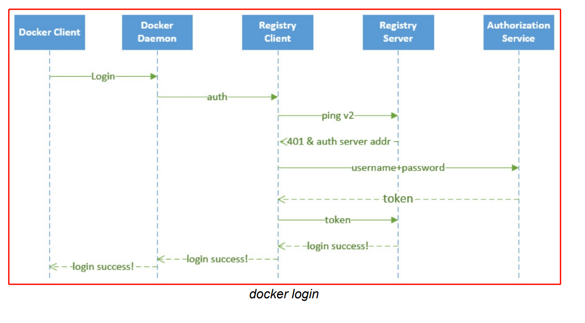

1. Harbor 介绍


Harbor 是⼀个 CNCF 基⾦会托管的开源的可信的云原⽣ docker registry 项⽬，可以⽤于存储、签 名、扫描镜像内容，Harbor 通过添加⼀些常⽤的功能如安全性、身份权限管理等来扩展 docker registry 项⽬，此外还⽀持在 registry 之间复制镜像，还提供更加⾼级的安全功能，如⽤户管理、访问 控制和活动审计等，在新版本中还添加了 Helm 仓库托管的⽀持。

Harbor 最核⼼的功能就是给 docker registry 添加上⼀层权限保护的功能，要实现这个功能，就需要 在使⽤ docker login、pull、push 等命令的时候进⾏拦截，先进⾏⼀些权限相关的校验，再进⾏操作，其实这⼀系列的操作 docker registry v2 就已经提供了⽀持，v2 集成了⼀个安全认证的功 能，将安全认证暴露给外部服务，让外部服务去实现。


2. Harbor 认证原理

注意: 以下认证原理适用于 Harbor v1.0.0，在新版本中可能已经发生变化。

上⾯说了 docker registry v2 将安全认证暴露给了外部服务使⽤，那么是怎样暴露的呢？在命令⾏中输⼊ docker login https://registry.aaron.com 为例来说明认证流程：

- 1.docker client 接收到⽤户输⼊的 docker login 命令，将命令转化为调⽤ engine api 的 RegistryLogin ⽅法

- 2.在 RegistryLogin ⽅法中通过 http 掉⽤ registry 服务中的 auth ⽅法

- 3.因为这⾥使⽤的是 v2 版本的服务，所以会调⽤ loginV2 ⽅法，在 loginV2 ⽅法中会进⾏ /v2/ 接⼝调⽤，该接⼝会对请求进⾏认证

- 4.此时的请求中并没有包含 token 信息，认证会失败，返回 401 错误，同时会在 header 中返回去哪⾥请求认证的服务器地址

- 5.registry client 端收到上⾯的返回结果后，便会去返回的认证服务器那⾥进⾏认证请求，向认证服务器发送的请求的 header 中包含有加密的⽤户名和密码

- 6.认证服务器从 header 中获取到加密的⽤户名和密码，这个时候就可以结合实际的认证系统进⾏认证了，⽐如从数据库中查询⽤户认证信息或者对接 ldap 服务进⾏认证校验

- 7.认证成功后，会返回⼀个 token 信息，client 端会拿着返回的 token 再次向 registry 服务发送请求，这次需要带上得到的 token，请求验证成功，返回状态码就是200了

- 8.docker client 端接收到返回的200状态码，说明操作成功，在控制台上打印 Login Succeeded 的信息

⾄此，整个登录过程完成，整个过程可以⽤下⾯的流程图来说明：



要完成上⾯的登录认证过程有两个关键点需要注意：怎样让 registry 服务知道服务认证地址？提供的认证服务⽣成的 token 为什么 registry 就能够识别？

对于第⼀个问题，⽐较好解决，registry 服务本身就提供了⼀个配置⽂件，可以在启动 registry 服务的配置⽂件中指定上认证服务地址即可，其中有如下这样的⼀段配置信息：

```javascript
......
auth:
  token:
    realm: token-realm
    service: token-service
    issuer: registry-token-issuer
    rootcertbundle: /root/certs/bundle
......

// 关于 registry 的配置，可以参考官⽅⽂档：
// https://docs.docker.com/registry/configuration/
```

其中 realm 就可以⽤来指定⼀个认证服务的地址，下⾯可以看到 Harbor 中该配置的内容。

对于第⼆个问题，就是 registry 怎么能够识别返回的 token ⽂件？如果按照 registry 的要求⽣成⼀个 token，是不是 registry 就可以识别？所以需要在自己的认证服务器中按照 registry 的要求⽣成 token，⽽不是随便乱⽣成。可以在 docker registry 的源码中可以看到 token 是通过 JWT（JSON Web Token）来实现的，所以按照要求⽣成⼀个 JWT 的 token 就可以。

对 golang 熟悉的同学可以去 clone 下 Harbor 的代码查看下，Harbor 采⽤ beego 这个 web 开发框架，源码阅读起来不是特别困难。可以很容易的看到 Harbor 中关于上⾯讲解的认证服务部分的实现⽅法。


3. 安装 Harbor

Harbor ⽀持多种安装⽅式，源码⽬录下⾯默认有⼀个安装脚本(make/install.sh)，采⽤ dockercompose 的形式运⾏ Harbor 各个组件，和前⾯⼀样，这⾥还是将 Harbor 安装到 Kubernetes 集群中，如果对 Harbor 的各个组件之间的运⾏关系⾮常熟悉，同样可以⼿动编写资源清单⽂件进⾏部署，不过 Harbor 源码⽬录中也提供了⽣成这些资源清单的脚本⽂件（make/kubernetes/k8s-prepare），只需要执⾏下⾯的命令即可为我们⽣成所需要⽤到的 YAML ⽂件：

```javascript
$ python make/kubernetes/k8s-prepare
// 如果上⾯的⼀些基本配置不能满⾜需求，也可以做⼀些更⾼级的配置。
// 可以在 make/common/templates ⽬录下⾯找到所有的 Harbor 的配置模板，做相应的修改即可。
```


3.1 准备 Traefik

因为要使用 ingress 暴露 Harbor 的端口，所以要提供 Ingress Controller，这里用 Traefik 作为 Ingress Controller。(ingress就是通过域名来访问)


```javascript
[root@centos7 traefik-https]# kubectl get svc
NAME         TYPE        CLUSTER-IP       EXTERNAL-IP   PORT(S)         AGE
traefik      NodePort    10.108.121.202   <none>        443:30646/TCP   2d4h
whoami       ClusterIP   10.104.191.105   <none>        80/TCP          2d4h
```


Traefik的安装和使用查看 "10服务发现/39-2 traefik-https"。


3.2 使用 Helm 安装 Harbor

使用 Helm 安装 Harbor 是⼀种简单的安装⽅法，Harbor 官⽅提供了对应的 Helm Chart 包，可以很容易安装。Harbor官网：https://goharbor.io/


从 Harbor 官网可知，现在 Harbor 有两个版本 v1.10 和 v2.x.x。


从  github 可知，harbor-helm 是基于  Harbor 的 v1.10 和 v2.x.x 在发布。这里使用 harbor-helm v1.8.1 (此版本基于Harbor v2.x.x ) 进行安装。


3.3 ⾸先下载 Harbor Chart v1.8.1 包到要安装的集群上：

https://github.com/goharbor/harbor-helm/releases

```javascript
// Harbor 其中的一些组件说明:
notary是docker镜像的签名工具,在pull和push的阶段,会用签名来校验,这样可以防止镜像被篡改.
chartmuseum是 helm chart 仓库.
clair是镜像漏洞扫描工具.
portal是Harbor的UI(dashboard),如果要把Harbor部署到有污点的节点上,可以在tolerations中加上污点.
```


3.4 安装 Helm Chart 包最重要的是 values.yaml ⽂件，可以通过覆盖该⽂件中的属性来改变配置：

values.yaml ⽂件路径为：......\harbor-helm-1.8.1\values.yaml

[values.yaml](attachments/9A4C6AA457364F859925DDF5AA80F67Evalues.yaml)


有了上⾯的配置说明，就可以根据实际需求来覆盖上⾯的值，修改过后的⽂件内容如下(最好拷贝一份 values.yaml 文件出来修改,原文件备份)：

[values-https.yaml](attachments/04617A96FBC74889B4913951B4B2E4B1values-https.yaml)

```javascript
# values-https.yaml
expose:
  type: ingress
  tls:
    enabled: true
  ingress:
    hosts:
      core: registry.aaron.com
      notary: notary.aaron.com
    annotations:
      ingress.kubernetes.io/ssl-redirect: "true"
      ingress.kubernetes.io/proxy-body-size: "0"
      nginx.ingress.kubernetes.io/ssl-redirect: "true"
      nginx.ingress.kubernetes.io/proxy-body-size: "0"
//......
externalURL: https://registry.aaron.com:30646
//......
persistence:
  enabled: true
  resourcePolicy: "keep"
  persistentVolumeClaim:
    registry:
      storageClass: "harbor-data"
    chartmuseum:
      storageClass: "harbor-data"
    jobservice:
      storageClass: "harbor-data"
    database:
      storageClass: "harbor-data"
    redis:
      storageClass: "harbor-data"
    trivy:
      storageClass: "harbor-data"
//......
```


在 values-https.yaml 文件中需要注意如下问题:

```javascript
1. externalURL这个是 Harbor 核心服务的一个外部访问的URL
  "values-https.yaml" 文件中 externalURL: https://registry.aaron.com:30646 配置
  这里域名配置的是"registry.aaron.com",不能用IP访问,要在hosts文件中添加域名配置,如下:
		192.168.32.100	registry.aaron.com
  为什么这里用的https? 因为Traefik开启了TLS(https服务).
  为什么这里访问 Harbor 用的是 30646 端口?
  因为 ingress 监听 registry.aaron.com 这个域名,这个域名对应的是 Harbor 服务,traefik 监听443端口(也就是说通过这个端口进来的衔接都会通过ingress去路由),
  traefik 服务是  NodePort 类型服务，这个服务暴露的443端口对应的 NodePort 端口是 30646,如下:
	[root@centos7 traefik-https]# kubectl get svc
	NAME         TYPE        CLUSTER-IP       EXTERNAL-IP   PORT(S)         AGE
	traefik      NodePort    10.108.121.202   <none>        443:30646/TCP   2d4h

2.这里假如traefik监听了80端口,traefik服务使用NodePort映射到的节点端口为32057
(1).如果 externalURL 指定的是https衔接,如下:
     externalURL: https://registry.aaron.com:32057
  这种情况导致的结果是能在浏览器中打开Harbor主页,但是输入用户名和密码会登录失败.
(2).如果 externalURL 指定的是http衔接,如下:
     externalURL: http://registry.aaron.com:32057
  这种情况在Harbor主页以及使用 docker login registry.aaron.com:32057 能正常登录.
  但是 push 或 pull 镜像时失败,原因没有找到,如下:
   [root@centos7 72harbor]# docker push registry.aaron.com:32057/library/nginx:latest
    The push refers to repository [registry.aaron.com:32057/library/nginx]
    e4b39f949587: Preparing 
    53db376e88c7: Preparing 
    d3ae25fc9f7a: Preparing 
    3baebd9b50ad: Preparing 
    57a9a0cdd450: Preparing 
    1401df2b50d5: Waiting 
    error parsing HTTP 404 response body: invalid character 'p' after top-level value: "404 page not found\n"
    [root@centos7 72harbor]# docker pull registry.aaron.com:32057/library/nginx:latest
    Error response from daemon: error parsing HTTP 404 response body: invalid character 'p' after top-level value: "404 page not found\n"
    [root@centos7 72harbor]# 
    
```


其中需要定制的部分很少，将域名替换成⾃⼰的，使⽤默认的 Ingress ⽅式暴露服务， 其他需要⼿动配置的部分就是数据持久化的部分，需要提前为上⾯的这些服务创建好可⽤的 PVC 或者 StorageClass 对象，⽐如这⾥使⽤⼀个名为 harbor-data 的 StorageClass 资源对象， 当然也可以根据实际的需求修改存储容量或者 accessMode ，这里创建 StorageClass 对象:

```javascript
# harbor-data-sc.yaml
apiVersion: storage.k8s.io/v1
kind: StorageClass
metadata:
  name: harbor-data
# 该值需要和 provisioner 配置的保持⼀致
provisioner: fuseim.pri/ifs 

```


3.5 开始安装 Harbor

```javascript
// 先新建 StorageClass 资源对象：
[root@centos7 72harbor]# kubectl create -f harbor-data-sc.yaml 
storageclass.storage.k8s.io/harbor-data created

// 创建完成后，使⽤上⾯⾃定义的 values ⽂件安装：
[root@centos7 72harbor]# helm install harbor ./harbor-helm-1.8.1/ -f ./harbor-helm-1.8.1/values-https.yaml --namespace kube-ops
NAME: harbor
//......
Then you should be able to visit the Harbor portal at https://registry.aaron.com
For more details, please visit https://github.com/goharbor/harbor

[root@centos7 72harbor]# helm -n kube-ops list
NAME  	NAMESPACE	REVISION	UPDATED                                	STATUS  	CHART       	APP VERSION
harbor	kube-ops 	1       	2022-03-02 10:35:59.788410826 -0500 EST	deployed	harbor-1.8.1	2.4.1

// 上面是通过Helm安装所有涉及到的一些资源对象,稍微等一会就可以安装成功,查看对应的Pod状态
[root@centos7 72harbor]# kubectl -n kube-ops get pods 
NAME                                    READY   STATUS    RESTARTS       AGE
harbor-chartmuseum-7d7449b7d7-6s78x     1/1     Running   0              3m40s
harbor-core-949f5cdcc-4dkb7             1/1     Running   0              3m40s
//......

// 如果 Pod 都是 Running 状态,说明都成功运行起来了,查看对应的 Ingress 对象
[root@centos7 72harbor]# kubectl -n kube-ops get ingress
NAME                    CLASS    HOSTS                ADDRESS   PORTS     AGE
harbor-ingress          <none>   registry.aaron.com             80, 443   81s
harbor-ingress-notary   <none>   notary.aaron.com               80, 443   81s


// 查看 kube-ops 空间下所有资源
[root@centos7 72harbor]# kubectl -n kube-ops get all
NAME                                       READY   STATUS    RESTARTS       AGE
pod/harbor-chartmuseum-869459cb8b-qbhml    1/1     Running   0              56s
//......

NAME                           TYPE        CLUSTER-IP       EXTERNAL-IP   PORT(S)                          AGE
service/harbor-chartmuseum     ClusterIP   10.100.11.181    <none>        80/TCP                           57s
//......

NAME                                   READY   UP-TO-DATE   AVAILABLE   AGE
deployment.apps/harbor-chartmuseum     1/1     1            1           56s
//......

NAME                                             DESIRED   CURRENT   READY   AGE
replicaset.apps/harbor-chartmuseum-869459cb8b    1         1         1       56s
//......

NAME                               READY   AGE
statefulset.apps/harbor-database   1/1     56s
//......

```

如果有真正的域名，则将上面的两个域名解析到任意一个 Ingress Controller 的 Pod 所在的节点即可，这里为了演示方便，还是在本地机器的 /etc/hosts 文件中添加上 registry.aaron.com 和 notary.aaron.com 的映射。


4. Harbor 使⽤

4.1 Harbor Portal

安装完成后，浏览器中打开 https://registry.aaron.com:30646，进入到 Harbor 的 Portal 界⾯.(如果Ingress中配置了 TLS ,配置了 TLS的 Ingress 中会强制跳转到 https，所以如果浏览器有什么安全限制,需要信任这⾥ Ingress 对应的证书,证书⽂件可以通过查看 Secret 资源对象获取.)


输⼊⽤户名：admin，密码：Harbor12345（当然也可以通过 Helm 安装的时候覆盖 harborAdminPassword）即可登录进⼊ Portal ⾸⻚，可以看到有很多功能，默认情况下会有⼀个名叫 library 的项⽬，该项⽬默认是公开访问权限。


进⼊到 library  项⽬可以看到⾥⾯还有 Helm Chart 包的管理，可以⼿动在这⾥上传。


也可以对改项⽬⾥⾯的镜像进⾏⼀些配置，⽐如是否开启⾃动扫描镜像功能：


4.2 docker cli

修改安装了docke的r主机的hosts文件，这里使用master节点的docker:

```javascript
// ingress中配置了通过域名访问(直接用IP不能访问),所以要在hosts文件中配置域名.
// 在 hosts 文件中添加 notary.aaron.com 和 registry.aaron.com 域名
[root@centos7 72harbor]# vi /etc/hosts
127.0.0.1   localhost localhost.localdomain localhost4 localhost4.localdomain4 centos7.master notary.aaron.com registry.aaron.com
::1         localhost localhost.localdomain localhost6 localhost6.localdomain6

192.168.32.100 centos7.master
192.168.32.101 centos7.node

// service network restart 或 /etc/init.d/network restart 都可以
[root@centos7 72harbor]# service network restart

/*注意:
1.这里为了方便直接使用master节点的docker cli。
2.重启网络后,发现通过master节点IP在浏览器中不能访问服务,这个时候重启系统就能解决.
*/
```


然后测试使⽤ docker cli 来进⾏ pull/push 镜像.

```javascript
// 登录到私有仓库(注意:因为traefik在这里暴露出来的节点端口不是80或443这样的默认端口,所以在登录时要指定端口)
[root@centos7 72harbor]# docker login registry.aaron.com:30646
Username: admin
Password: 
WARNING! Your password will be stored unencrypted in /root/.docker/config.json.
Configure a credential helper to remove this warning. See
https://docs.docker.com/engine/reference/commandline/login/#credentials-store

Login Succeeded

// ⽐如本地现在有⼀个名为 nginx:latest 的镜像
// ⾸先需要给该镜像重新打⼀个 registry.aaron.com:30646 的前缀,推送的时候就可以识别到推送到哪个镜像仓库
[root@centos7 72harbor]# docker tag nginx:latest registry.aaron.com:30646/library/nginx:latest
[root@centos7 72harbor]# docker images | grep registry.aaron.com:30646
registry.aaron.com:30646/library/nginx                            latest    c919045c4c2b   3 days ago      142MB

// 将该镜像推送到私有仓库中
[root@centos7 72harbor]# docker push registry.aaron.com:30646/library/nginx:latest
The push refers to repository [registry.aaron.com:30646/library/nginx]
e4b39f949587: Layer already exists 
53db376e88c7: Layer already exists 
d3ae25fc9f7a: Layer already exists 
3baebd9b50ad: Layer already exists 
57a9a0cdd450: Layer already exists 
1401df2b50d5: Layer already exists 
latest: digest: sha256:2468d48e476b6a079eb646e87620f96ce1818ac0c5b3a8450532cea64b3421f4 size: 1570

// 本地删除该镜像
[root@centos7 72harbor]# docker rmi registry.aaron.com:30646/library/nginx:latest
Untagged: registry.aaron.com:30646/library/nginx:latest
Untagged: registry.aaron.com:30646/library/nginx@sha256:2468d48e476b6a079eb646e87620f96ce1818ac0c5b3a8450532cea64b3421f4
[root@centos7 72harbor]# docker images | grep registry.aaron.com:30646
[root@centos7 72harbor]#

// 从私有仓库拉取该镜像
[root@centos7 72harbor]# docker pull registry.aaron.com:30646/library/nginx:latest
latest: Pulling from library/nginx
Digest: sha256:2468d48e476b6a079eb646e87620f96ce1818ac0c5b3a8450532cea64b3421f4
Status: Downloaded newer image for registry.aaron.com:30646/library/nginx:latest
registry.aaron.com:30646/library/nginx:latest
[root@centos7 72harbor]# docker images | grep registry.aaron.com:30646
registry.aaron.com:30646/library/nginx                            latest    c919045c4c2b   3 days ago      142MB
```


推送完成后，同样可以在 Portal ⻚⾯上看到这个镜像的信息：


到这⾥证明上⾯私有 docker 仓库搭建成功了，可以尝试去创建⼀个私有的项⽬，然后创建⼀个新的⽤户，使⽤这个⽤户来进⾏ pull/push 镜像，Harbor 还具有其他的⼀些功能，⽐如镜像复制灯，可以⾃⾏测试，感受 Harbor 和官⽅⾃带的 registry 仓库的差别。


```javascript
// 如果要删除私有仓库harbor
[root@centos7 72harbor]# helm -n kube-ops list
NAME  	NAMESPACE	REVISION	UPDATED                                	STATUS  	CHART       	APP VERSION
harbor	kube-ops 	1       	2022-03-02 10:28:57.162270217 -0500 EST	deployed	harbor-1.8.1	2.4.1      

[root@centos7 72harbor]# helm -n kube-ops delete harbor
These resources were kept due to the resource policy:
[PersistentVolumeClaim] harbor-chartmuseum
[PersistentVolumeClaim] harbor-jobservice
[PersistentVolumeClaim] harbor-registry

release "harbor" uninstalled
[root@centos7 72harbor]#

```


5.注意事项

5.1 docker 登录私有仓库遇到证书问题

```javascript
// 如果用 docker 登录私有仓库遇到类似如下证书问题,有两种解决方案.
$ docker login registry.harbor.com
Warning: failed to get default registry endpoint from daemon (Cannot connect to the Docker
daemon at unix:///var/run/docker.sock. Is the docker daemon running?). Using system default: 
https://index.docker.io/v1/
Username: admin
Password:
INFO[0007] Error logging in to v2 endpoint, trying next endpoint: Get https://registry.harbor.com/v2/: x509: certificate has expired or is not yet valid
INFO[0007] Error logging in to v1 endpoint, trying next endpoint: Get https://registry.harbor.com/v1/users/: x509: certificate has expired or is not yet valid
Get https://registry.harbor.com/v1/users/: x509: certificate has expired or is not yet valid
```


解决方法一:

提供证书⽂件，ca.crt 这个证书⽂件可以通过 Ingress 中使⽤的 Secret 资源对象来提供：

```javascript
// data 区域中 ca.crt 对应的值就是需要的证书,需要注意的是需要做⼀个 base64 的解码
// 将解码后的 ca.crt ⽂件复制到 /etc/docker/certs.d/registry.harbor.com ⽬录下
// 如果 /etc/docker/certs.d/registry.harbor.com ⽬录不存在就创建它,证书配置后就可以正常访问了
[root@centos7 72harbor]# kubectl -n kube-ops get secret harbor-ingress -o yaml
apiVersion: v1
data:
  ca.crt: <ca.crt>
  tls.crt: <tls.crt>
  tls.key: <tls.key>
kind: Secret
metadata:
  annotations:
    //......
  creationTimestamp: "2022-03-03T15:49:55Z"
  labels:
    //......
  name: harbor-ingress
  namespace: kube-ops
  //......
type: kubernetes.io/tls
```


解决方法二:

由于⽅法一较为繁琐，所以⼀般情况下，使⽤ docker cli 的时候是在 docker 启动参数后⾯添加⼀个 --insecure-registry 参数来忽略证书的校验。

```javascript
// docker 启动配置⽂件 /usr/lib/systemd/system/docker.service 中修改 ExecStart 的启动参数
// 修改后保存重启 docker, 再使⽤ docker cli 就可以了
ExecStart=/usr/bin/dockerd --insecure-registry registry.harbor.com
```


5.2 参考资料

live-restore重载docker守护进程而不重启容器

https://www.jianshu.com/p/0fa0cde5b9d4


Docker的配置文件 daemon.json 详解

https://www.cnblogs.com/fqnb001/p/12498008.html


docker push异常error parsing HTTP 404 response body: invalid character ‘p‘ after top-level value: “404

https://blog.csdn.net/shan165310175/article/details/120757106


docker pull push invalid character 'p' after top-level value: "404 page not found\n" #12248

https://github.com/goharbor/harbor/issues/12248


5.3 证书示例

(1) 引用"30RBAC 的使用(1)-给普通用户绑定权限的方法"

创建用户凭证(其实就是用CA证书签名其它证书,然后这个证书就有了合法性)

```javascript
// 创建一个名为"aaron-certs"的目录,并cd到这个目录
mkdir aaron-certs
aaron-certs

// 给用户aaron创建一个私钥, 命名为 aaron.key
openssl genrsa -out aaron.key 2048

// 使用刚刚创建的私钥创建一个证书签名请求文件 aaron.csr,需要确保在-subj参数中指定用户名和组
// CN(Customers Name)表示用户名，O(Group))表示组，CN和O都是大写
// 生成的 aaron.csr 就是证书签名请求文件
openssl req -new -key aaron.key -out aaron.csr -subj "/CN=aaron/O=hero"

// 找到k8s集群的CA证书机构,如果使用kubeadm安装的集群，CA相关证书位于"/etc/kubernetes/pki/"目录下面.
// "ca.crt"和"ca.key"就是k8s的相关证书. ca.crt 是ca证书, ca.key 是ca私钥文件.
// 如果是二进制方式搭建集群，在最开始搭建的时候就已经指定好了CA目录并已经手动生成"ca.crt"和"ca.key"文件.
// 利用该目录下面的"ca.crt"和"ca.key"两个文件来批准刚刚生成的证书请求.

// 生成最终的证书文件,这里设置证书的有效期为3600天. aaron.crt就是生成的最终证书文件
openssl x509 -req -in aaron.csr -CA /etc/kubernetes/pki/ca.crt -CAkey /etc/kubernetes/pki/ca.key -CAcreateserial -out aaron.crt -days 3600

// 用 aaron.crt 这个最终证书文件和私钥文件在集群中创建新的凭证和上下文(Context)
// 也就是说这一步已经在k8s集群中创建了一个名为 aaron 的普通用户.
kubectl config set-credentials aaron --client-certificate=aaron.crt --client-key=aaron.key

// 为新创建的aaron这个普通用户设置新的 Context
// "--namespace=kube-system"表示用户只能在这个命名空间下操作,也就是说这里把用户和命名空间绑定在一起
kubectl config set-context aaron-context --cluster=kubernetes --namespace=kube-system --user=aaron

// 到这里，普通用户 aaron 就已经创建成功了
// 但是使用"kubectl get pods"同样能成功,因为目前默认还是使用之前的那个context,这是集群搭建时kubeadm创建的,具有很高的权限.

// 使用aaron-context查看Pod出现错误，因为还没有为aaron这个普通用户定义任何操作的权限
kubectl get pods --context=aaron-context 
```


(2) 证书相关以及单向认证和双向认证

Https单向认证和双向认证

https://blog.csdn.net/duanbokan/article/details/50847612


Https、OpenSSL自建CA证书及签发证书、nginx单向认证、双向认证及使用Java访问

https://www.cnblogs.com/dreamingodd/p/7357029.html

如何使用Java访问双向认证的Https资源

https://www.cnblogs.com/dreamingodd/p/7491098.html


证书相关：rsa、crt文件、key文件、csr文件

https://blog.csdn.net/weiyuanke/article/details/87256937


openssl实现双向认证教程（服务端代码+客户端代码+证书生成） 

https://www.cnblogs.com/lsdb/p/9391979.html


浅谈HTTPS（SSL/TLS）原理(这个重点在于证书的讲解)

https://www.jianshu.com/p/41f7ae43e37b


SSL双向认证以及证书的制作和使用(这个重点)

https://blog.csdn.net/helloguoke/article/details/54288670

 

(3) https 系列

HTTPS和HTTP的区别是什么

https://www.wosign.com/FAQ/faq2016-0301-02.htm

HTTPS加密协议详解(一)：HTTPS基础知识：

https://www.wosign.com/FAQ/faq2016-0309-01.htm

HTTPS加密协议详解(二)：TLS/SSL工作原理

https://www.wosign.com/FAQ/faq2016-0309-02.htm

HTTPS加密协议详解(三)：PKI 体系

https://www.wosign.com/FAQ/faq2016-0309-03.htm

HTTPS加密协议详解(四)：TLS/SSL握手过程

https://www.wosign.com/FAQ/faq2016-0309-04.htm

HTTPS加密协议详解(五)：HTTPS性能与优化

https://www.wosign.com/FAQ/faq2016-0309-05.htm


HTTPS之TLS1.2连接详解(这个重点)

https://blog.csdn.net/qq_40276626/article/details/120396330


详解 HTTPS、TLS、SSL、HTTP区别和关系

https://blog.csdn.net/chan70707/article/details/82932153


注意：

- 证书校验只是 TTPS 中 SSL/TLS 中其中的一环，还有其它环节。

- 证书校验的方式有多种方式：

- 使用CA根证书校验证书的合法性。

- 直接将证书添加到证书库，比如在 java 中可以直接将服务器证书导入到 cacerts 证书库，然后就可以去访问服务端.

- 其它方式。


如何把安全证书导入到java中的cacerts证书库

https://blog.csdn.net/feng339518991/article/details/76229271


