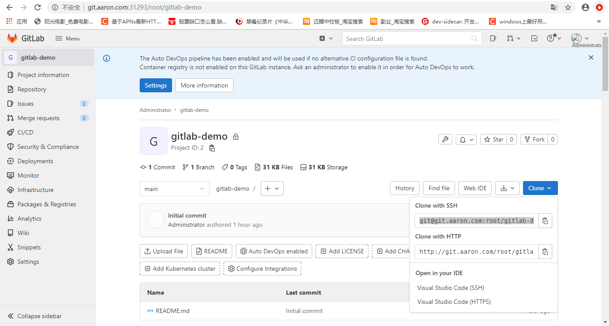

1.介绍

GitLab 是一个用于仓库管理系统的开源项目。使用Git作为代码管理工具，并在此基础上搭建起来的web服务。Github是公共的git仓库，而Gitlab适合于搭建企业内部私有git仓库

- 官网：https://about.gitlab.com/

- GitHub： https://github.com/gitlabhq/gitlabhq

- GitLab的安装方式：https://docs.gitlab.cn/jh/install/


Gitlab 官⽅提供了 Helm 的⽅式在 Kubernetes 集群中来快速安装，但是在使⽤的过程中发现 Helm 提供的 Chart 包中有很多其他额外的配置，所以这⾥使⽤定义资源清单⽂件来安装。


Gitlab 主要涉及到3个应⽤：Redis、Postgresql、Gitlab 核⼼程序，实际上只要将这3个应⽤分别启动起来（redis 做缓存，Postgresql 是数据库），然后加上对应的配置就可以很⽅便的安装 Gitlab 了，这⾥选择使⽤的镜像不是官⽅的，⽽是 Gitlab 容器化中使⽤⾮常多的⼀个第三⽅镜像: sameersbn/gitlab，这个镜像是 gitlab 容器化做的相对比较好的，基本上和官⽅保持同步更新。

- 官方地址：http://www.damagehead.com/docker-gitlab/

- DockerHub：https://hub.docker.com/r/sameersbn/gitlab/tags

-  安装方法：https://github.com/sameersbn/docker-gitlab/blob/master/README.md


如果已经有可使⽤的 Redis 或 Postgresql 服务的话，那么直接配置在 Gitlab 环境变量中即可，如果没有的话就单独部署。


2. 安装 GitLab 


准备镜像

```javascript
# sameersbn/redis:4.0.9-3
# sameersbn/postgresql:12-20200524
# sameersbn/gitlab:14.8.2

[root@centos7 ~]# docker pull sameersbn/redis:4.0.9-3
4.0.9-3: Pulling from sameersbn/redis
5b7339215d1d: Downloading 
//......
Status: Downloaded newer image for sameersbn/redis:4.0.9-3
docker.io/sameersbn/redis:4.0.9-3

[root@centos7 ~]# docker pull sameersbn/postgresql:12-20200524
12-20200524: Pulling from sameersbn/postgresql
23884877105a: Pull complete 
//......
docker.io/sameersbn/postgresql:12-20200524
[root@centos7 ~]# docker images

[root@centos7 ~]# docker pull sameersbn/gitlab:14.8.2
14.8.2: Pulling from sameersbn/gitlab
08c01a0ec47e: Downloading 
//......
2ae40281df54: Download complete 
14.8.2: Pulling from sameersbn/gitlab
08c01a0ec47e: Pull complete 
7d385d56b24b: Pull complete 
//......
Digest: sha256:f605734f165fd699eed6d1c8311173b07886cb7398b533006f43d55e9d9bbd68
Status: Downloaded newer image for sameersbn/gitlab:14.8.2
docker.io/sameersbn/gitlab:14.8.2
```


本节用到的的资源文件:

[GitLab.zip](attachments/637B047AF215458D8CE9C62F40FF3274GitLab.zip)


2.1 ⾸先部署需要的 Redis 服务，对应的资源清单⽂件如下：

[gitlab-redis.yaml](attachments/6AF95CA09703486B84EA5B60371E8E98gitlab-redis.yaml)

```javascript
# gitlab-redis.yaml
apiVersion: apps/v1
kind: Deployment
metadata:
  name: redis
  namespace: kube-ops
  labels:
    name: redis
spec:
  selector:
    matchLabels:
      name: redis
  template:
    metadata:
      name: redis
      labels:
        name: redis
    spec:
      containers:
      - name: redis
        image: sameersbn/redis:4.0.9-3
        imagePullPolicy: IfNotPresent
        ports:
        - name: redis
          containerPort: 6379
        volumeMounts:
        - mountPath: /var/lib/redis
          name: data
        livenessProbe:
          exec:
            command:
            - redis-cli
            - ping
          initialDelaySeconds: 30
          timeoutSeconds: 5
        readinessProbe:
          exec:
            command:
            - redis-cli
            - ping
          initialDelaySeconds: 5
          timeoutSeconds: 1
      volumes:
      - name: data
        emptyDir: {}
---
apiVersion: v1
kind: Service
metadata:
  name: redis
  namespace: kube-ops
  labels:
    name: redis
spec:
  ports:
  - name: redis
    port: 6379
    targetPort: redis
  selector:
    name: redis
```


```javascript
[root@centos7 73GitLab]# kubectl create -f gitlab-redis.yaml  --dry-run=client
deployment.apps/redis created (dry run)
service/redis created (dry run)

[root@centos7 73GitLab]# kubectl create -f gitlab-redis.yaml 
deployment.apps/redis created
service/redis created
```


2.2 然后是数据库 Postgresql，对应的资源清单⽂件如下：

[gitlab-postgresql.yaml](attachments/E74EF55A09C14932A9B4C7FCC7B7D12Bgitlab-postgresql.yaml)

```javascript
# gitlab-postgresql.yaml
apiVersion: apps/v1
kind: Deployment
metadata:
  name: postgresql
  namespace: kube-ops
  labels:
    name: postgresql
spec:
  selector:
    matchLabels:
      name: postgresql
  template:
    metadata:
      name: postgresql
      labels:
        name: postgresql
    spec:
      containers:
      - name: postgresql
        image: sameersbn/postgresql:12-20200524
        imagePullPolicy: IfNotPresent
        env:
        - name: DB_USER
          value: gitlab
        - name: DB_PASS
          value: password
        - name: DB_NAME
          value: gitlab_production
        - name: DB_EXTENSION
          # 注意:这里参数要加上 btree_gist, 否则部署 GitLab 时会报: ERROR:  permission denied to create extension "btree_gist"
          value: pg_trgm,btree_gist
        ports:
        - name: postgres
          containerPort: 5432
        volumeMounts:
        - mountPath: /var/lib/postgresql
          name: data
        livenessProbe:
          exec:
            command:
            - pg_isready
            - -h
            - localhost
            - -U
            - postgres
          initialDelaySeconds: 30
          timeoutSeconds: 5
        readinessProbe:
          exec:
            command:
            - pg_isready
            - -h
            - localhost
            - -U
            - postgres
          initialDelaySeconds: 5
          timeoutSeconds: 1
      volumes:
      - name: data
        emptyDir: {}
---
apiVersion: v1
kind: Service
metadata:
  name: postgresql
  namespace: kube-ops
  labels:
    name: postgresql
spec:
  ports:
  - name: postgres
    port: 5432
    targetPort: postgres
  selector:
    name: postgresql
```


```javascript
[root@centos7 73GitLab]# kubectl create -f gitlab-postgresql.yaml --dry-run=client
deployment.apps/postgresql created (dry run)
service/postgresql created (dry run)

[root@centos7 73GitLab]# kubectl create -f gitlab-postgresql.yaml 
deployment.apps/postgresql created
service/postgresql created
```


2.3 然后就是最核⼼的 Gitlab 的应⽤，对应的资源清单⽂件如下：

[gitlab.yaml](attachments/0442EEE0B0344C04BCB268ED7C594B32gitlab.yaml)

```javascript
# gitlab.yaml
apiVersion: apps/v1
kind: Deployment
metadata:
  name: gitlab
  namespace: kube-ops
  labels:
    name: gitlab
spec:
  selector:
    matchLabels:
      name: gitlab
  template:
    metadata:
      name: gitlab
      labels:
        name: gitlab
    spec:
      containers:
      - name: gitlab
        image: sameersbn/gitlab:14.8.2
        imagePullPolicy: IfNotPresent
        env:
        - name: TZ
          value: Asia/Shanghai
        - name: GITLAB_TIMEZONE
          value: Beijing
        - name: GITLAB_SECRETS_DB_KEY_BASE
          value: long-and-random-alpha-numeric-string
        - name: GITLAB_SECRETS_SECRET_KEY_BASE
          value: long-and-random-alpha-numeric-string
        - name: GITLAB_SECRETS_OTP_KEY_BASE
          value: long-and-random-alpha-numeric-string
        - name: GITLAB_ROOT_PASSWORD
          value: admin321
        - name: GITLAB_ROOT_EMAIL
          value: kkk_en@qq.com
        - name: GITLAB_HOST
          value: git.aaron.com
        - name: GITLAB_PORT
          value: "80"
        - name: GITLAB_SSH_PORT
          value: "22"
        - name: GITLAB_NOTIFY_ON_BROKEN_BUILDS
          value: "true"
        - name: GITLAB_NOTIFY_PUSHER
          value: "false"
        - name: GITLAB_BACKUP_SCHEDULE
          value: daily
        - name: GITLAB_BACKUP_TIME
          value: 01:00
        - name: DB_TYPE
          value: postgres
        - name: DB_HOST
          value: postgresql
        - name: DB_PORT
          value: "5432"
        - name: DB_USER
          value: gitlab
        - name: DB_PASS
          value: password
        - name: DB_NAME
          value: gitlab_production
        - name: REDIS_HOST
          value: redis
        - name: REDIS_PORT
          value: "6379"
        ports:
        - name: http
          containerPort: 80
        - name: ssh
          containerPort: 22
        volumeMounts:
        - mountPath: /home/git/data
          name: data
        livenessProbe:
          httpGet:
            path: /
            port: 80
          initialDelaySeconds: 180
          timeoutSeconds: 5
        readinessProbe:
          httpGet:
            path: /
            port: 80
          initialDelaySeconds: 5
          timeoutSeconds: 1
      volumes:
      - name: data
        emptyDir: {}
---
apiVersion: v1
kind: Service
metadata:
  name: gitlab
  namespace: kube-ops
  labels:
    name: gitlab
spec:
  type: NodePort
  ports:
    - name: http
      port: 80
      targetPort: http
    - name: ssh
      port: 22
      targetPort: ssh
      # 注意: 这里ssh(22端口)对应的nodePort端⼝设置为30022,这样就不会随机⽣成端口号了
      nodePort: 30022
  selector:
    name: gitlab
---
apiVersion: networking.k8s.io/v1
kind: Ingress
metadata:
  name: gitlab
  namespace: kube-ops
spec:
  rules:
  - host: git.aaron.com
    http:
      paths:
      - path: /
        pathType: Prefix
        backend:
          service:
            name: gitlab
            port:
              number: 80
```


注意1：这⾥应⽤数据没有做数据持久化，只是使⽤ emptyDir: {} 类型的 volume，Pod 挂掉后，对应的数据也就没有了，所以在正式的环境中使⽤⼀定要做数据的持久化，⽐如添加 PV/PVC 或者 StorageClass。

注意2：要注意的是其中 Redis 和 Postgresql 相关的环境变量配置，另外，这⾥添加了⼀个 Ingress 对 象，来为 Gitlab 配置⼀个域名 git.aaron.com ，这样应⽤部署完成后就可以通过该域名来访问。

注意3：为什么配置了用域名访问GitLab，还要设置 GitLab 的 Service 为 NodePort  类型？因为平时使⽤的 ssh 默认是 22 端⼝，现在如果⽤默认的 22 端⼝去连接，是没办法和 Gitlab 容器中的 22 端⼝进⾏映射的，因为这里只是通过 Service 的 22 端⼝进⾏了映射，要想通过节点去进⾏ ssh 连接就需要在节点上⼀个端⼝和容器内部的22端⼝进⾏绑定，所以这⾥可以通过 NodePort 去映射 Gitlab 容器内部的22端⼝，所以 clone 的时候使⽤ ssh 要带上NodePort 的端⼝号。


```javascript
[root@centos7 73GitLab]# kubectl create -f gitlab.yaml --dry-run=client
deployment.apps/gitlab created (dry run)
service/gitlab created (dry run)
ingress.networking.k8s.io/gitlab created (dry run)

// 直接部署 GitLab 
[root@centos7 73GitLab]# kubectl create -f gitlab.yaml
deployment.apps/gitlab created
service/gitlab created
ingress.networking.k8s.io/gitlab created

[root@centos7 73GitLab]# kubectl get pod -n kube-ops
NAME                          READY   STATUS    RESTARTS   AGE
gitlab-85677ff498-snhwn       0/1     Running   0          98s
postgresql-577d9f78c9-7n9sf   1/1     Running   0          23m
redis-95677b8f5-m9n42         1/1     Running   0          129m

[root@centos7 73GitLab]# kubectl get svc -n kube-ops
NAME         TYPE        CLUSTER-IP       EXTERNAL-IP   PORT(S)                     AGE
gitlab       NodePort    10.111.14.238    <none>        80:32295/TCP,22:30022/TCP   23h
postgresql   ClusterIP   10.103.170.124   <none>        5432/TCP                    23h
redis        ClusterIP   10.106.204.67    <none>        6379/TCP                    25h
```


2.4  通过 Ingress 中定义的域名访问 GitLab

部署成功后就可以通过 Ingress 中定义的域名 git.aaron.com (需要做 DNS 解析或者在本地 /etc/hosts 中添加映射)来访问 Portal：

```javascript
// 在本地主机的 HOSTS 文件中添加如下映射:
        192.168.32.100  git.aaron.com

// Traefik的安装和使用查看 "10服务发现/39-2 traefik-http"。
// 查看 Traefik 暴露的服务端口
[root@centos7 traefik-http]# kubectl get svc
NAME         TYPE        CLUSTER-IP      EXTERNAL-IP   PORT(S)                       AGE
kubernetes   ClusterIP   10.96.0.1       <none>        443/TCP                       197d
traefik      NodePort    10.103.234.13   <none>        80:31293/TCP,8080:32590/TCP   22h
whoami       ClusterIP   10.100.188.73   <none>        80/TCP                        22h

// GitLab 的地址为：http://git.aaron.com:31293/

// 从 "gitlab.yaml" 中配置的环境变量可知 GitLab 的 root 密码为 admin321

```


GitLab 这个 Pod 启动时间需要几分钟，只有当 Pod ready 后才能访问。登录进⼊到⾸⻚：

- ⽤户名 root

- 部署时指定的超级⽤户密码 GITLAB_ROOT_PASSWORD=admin321


Gitlab 运⾏后，可以注册为新⽤户并创建⼀个项⽬，还可以做很多的其他系统设置，⽐如设置语⾔、设置应⽤⻛格样式等等。 点击 Create a project 创建⼀个新的项⽬，和之前 Github 使⽤上没有多⼤的差别：


2.5  拉取或推送代码到GitLab

创建完成后，可以添加本地⽤户的⼀个 SSH-KEY ，这样就可以通过 SSH 来拉取或者推送代码了。SSH 公钥通常包含在 ~/.ssh/id_rsa.pub ⽂件中，并以 ssh-rsa 开头。如果没有的话可以使⽤ ssh-keygen 命令来⽣成，id_rsa.pub ⾥⾯的内容就是我们需要的 SSH 公钥，然后添加到 Gitlab 中。





现在可以使⽤ Clone with SSH 的地址了，由于上⾯配置了 SSH 公钥，所以可以直接访问上⾯的仓库：

```javascript
特别注意:
    这里克隆的时候一定要使用完整的git地址,如下：
        $ git clone ssh://git@git.aaron.com:30022/root/gitlab-demo.git
    不能省略掉前面的"ssh://"以及30022这个端口号。
```


然后随便在该项⽬下⾯添加⼀些资源：


刷新浏览器，就可以看到刚刚创建的 Git 仓库中多了⼀个 hello.go 的⽂件：


到这⾥就表明我们的 Gitlab 就成功部署到了 Kubernetes 集群当中了。


下节课和开始介绍基于 Gitlab 的 CI/CD 实现。


3.总结

3.1 问题：部署 gitlab 后， gitlab 容器状态为 Running，但是不能 reday，然后容器状态转为 CrashLoopBackOff，describe pod 发现 Readiness probe failed。

```javascript
[root@centos7 73GitLab]# kubectl get pod -n kube-ops
NAME                          READY   STATUS    RESTARTS      AGE
gitlab-85677ff498-qhzw4       0/1     Running   1 (17s ago)   72s
postgresql-5b47f449f9-wsgzl   1/1     Running   0             15m
redis-95677b8f5-m9n42         1/1     Running   0             24m

[root@centos7 73GitLab]# kubectl get pod -n kube-ops
NAME                          READY   STATUS             RESTARTS      AGE
gitlab-85677ff498-qhzw4       0/1     CrashLoopBackOff   1 (10s ago)   88s
postgresql-5b47f449f9-wsgzl   1/1     Running            0             15m
redis-95677b8f5-m9n42         1/1     Running            0             24m

// describe pod 发现是因为 80 端口返回502
[root@centos7 73GitLab]# kubectl describe pod gitlab-85677ff498-qhzw4 -n kube-ops
Name:         gitlab-85677ff498-qhzw4
Namespace:    kube-ops
Priority:     0

Containers:
  gitlab:
    Container ID:   docker://b76367cf90a3792b313b5659711dede34048700d963d41abbfef60ff1a7ab5f7
    Image:          sameersbn/gitlab:14.8.2
    //......
//......
Events:
  Type     Reason     Age                From               Message
  ----     ------     ----               ----               -------
  Normal   Scheduled  75s                default-scheduler  Successfully assigned kube-ops/gitlab-85677ff498-qhzw4 to centos7.node
  Normal   Pulled     20s (x2 over 74s)  kubelet            Container image "sameersbn/gitlab:14.8.2" already present on machine
  Normal   Created    20s (x2 over 74s)  kubelet            Created container gitlab
  Normal   Started    19s (x2 over 74s)  kubelet            Started container gitlab
  Warning  Unhealthy  5s (x6 over 65s)   kubelet            Readiness probe failed: HTTP probe failed with statuscode: 502

// 查看 Pod 日志
[root@centos7 73GitLab]# kubectl logs gitlab-85677ff498-qhzw4 -n kube-ops
Loading /etc/docker-gitlab/runtime/env-defaults
Initializing logdir...
Initializing datadir...
Container TimeZone -> Asia/Shanghai
Installing configuration templates...
Configuring gitlab...
Configuring gitlab::database
//......
2022-03-07 23:26:39,290 INFO success: sidekiq entered RUNNING state, process has stayed up for > than 1 seconds (startsecs)
Database 'gitlab_production' already exists
psql:/home/git/gitlab/db/structure.sql:9: ERROR:  permission denied to create extension "btree_gist"
HINT:  Must be superuser to create this extension.
rake aborted!
failed to execute:
psql --set ON_ERROR_STOP=1 --quiet --no-psqlrc --file /home/git/gitlab/db/structure.sql --single-transaction gitlab_production

Please check the output above for any errors and make sure that `psql` is installed in your PATH and has proper permissions.
//......
[root@centos7 73GitLab]#

// 从上面的日志中可以看出是权限问题.
```


解决权限问题:

```javascript
1.修改"gitlab-postgresql.yaml",将
		//......
			- name: DB_EXTENSION
			  value: pg_trgm
		//......
	改为:
		//......
			- name: DB_EXTENSION
			  value: pg_trgm,btree_gist
		//......
    之后重新部署 postgresql
    
2.然后重新部署 GitLab, 这时容器正常启动
[root@centos7 73GitLab]# kubectl get pod -n kube-ops
NAME                          READY   STATUS    RESTARTS   AGE
gitlab-85677ff498-snhwn       1/1     Running   0          2m8s
postgresql-577d9f78c9-7n9sf   1/1     Running   0          23m
redis-95677b8f5-m9n42         1/1     Running   0          130m

3.参考资料
permission denied to create extension "btree_gist":
https://github.com/sameersbn/docker-gitlab/issues/2214
```


3.2  下载 GitLab 的 Helm  Chart 包，可以研究如何用  Chart  包安装 GitLab

```javascript
// 以下命令是在windows下操作
// 在 Artifact Hub 或自己的 hub 实例中搜索 chart
C:\Users\WuJun>helm search hub gitlab
URL                                                     CHART VERSION   APP VERSION     DESCRIPTION
https://artifacthub.io/packages/helm/gitlab/gitlab      5.8.2           14.8.2          Web-based Git-repository manager with wiki and ...
https://artifacthub.io/packages/helm/gitlab-jh/...      5.8.2           14.8.2          Web-based Git-repository manager with wiki and ...
https://artifacthub.io/packages/helm/pascaliske...      0.2.4           14.7.2-ce.0     A Helm chart for GitLab Omnibus
https://artifacthub.io/packages/helm/cncf/gitlab        5.8.2           14.8.2          Web-based Git-repository manager with wiki and ...
//......

// 添加chart源
C:\Users\WuJun>helm repo add gitlab-jh https://charts.gitlab.cn
"gitlab-jh" has been added to your repositories

// 在 charts 中搜索包含"gitlab"的repo,加上" -l"参数表示列出所有版本
C:\Users\WuJun>helm search repo gitlab -l
NAME                    CHART VERSION   APP VERSION     DESCRIPTION
gitlab-jh/gitlab        5.8.2           14.8.2          Web-based Git-repository manager with wiki and ...
gitlab-jh/gitlab        5.8.1           14.8.1          Web-based Git-repository manager with wiki and ...
gitlab-jh/gitlab        5.8.0           14.8.0          Web-based Git-repository manager with wiki and ...
gitlab-jh/gitlab        5.7.4           14.7.4          Web-based Git-repository manager with wiki and ...
gitlab-jh/gitlab        5.7.3           14.7.3          Web-based Git-repository manager with wiki and ...
gitlab-jh/gitlab        5.7.2           14.7.2          Web-based Git-repository manager with wiki and ...
gitlab-jh/gitlab        5.7.1           14.7.1          Web-based Git-repository manager with wiki and ...
gitlab-jh/gitlab        5.7.0           14.7.0          Web-based Git-repository manager with wiki and ...
gitlab-jh/gitlab        5.6.5           14.6.5          Web-based Git-repository manager with wiki and ...
gitlab-jh/gitlab        5.6.4           14.6.4          Web-based Git-repository manager with wiki and ...
gitlab-jh/gitlab        5.6.3           14.6.3          Web-based Git-repository manager with wiki and ...
gitlab-jh/gitlab        5.6.2           14.6.2          Web-based Git-repository manager with wiki and ...

// 不加"-l"参数表示列出目前最新版本
C:\Users\WuJun>helm search repo gitlab
NAME                    CHART VERSION   APP VERSION     DESCRIPTION
gitlab-jh/gitlab        5.8.2           14.8.2          Web-based Git-repository manager with wiki and ...

// 获取最新版本的"gitlab-jh/gitlab", 版本下载到"C:\Users\WuJun"目录
C:\Users\WuJun>helm pull gitlab-jh/gitlab

// 获取指定版本的"gitlab-jh/gitlab", 版本下载到"C:\Users\WuJun"目录
C:\Users\WuJun>helm pull gitlab-jh/gitlab --version 5.8.2
```


[gitlab-5.8.2.tgz](attachments/427B7FD55D3F45C880BBEA292EF63B7Dgitlab-5.8.2.tgz)

使用 Helm chart 包安装 GitLab(官方文档)： https://docs.gitlab.cn/charts/


3.3 参考资料: 

kubectl logs 常用命令: https://blog.csdn.net/972301/article/details/106166403

