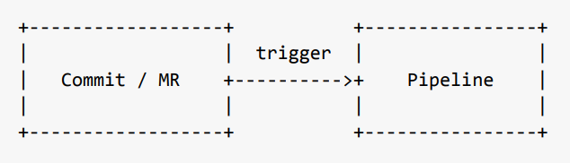
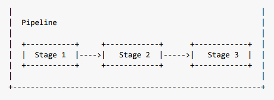
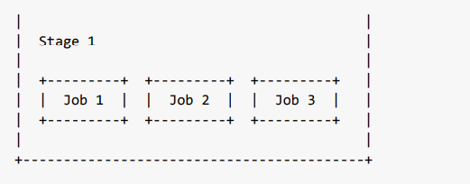
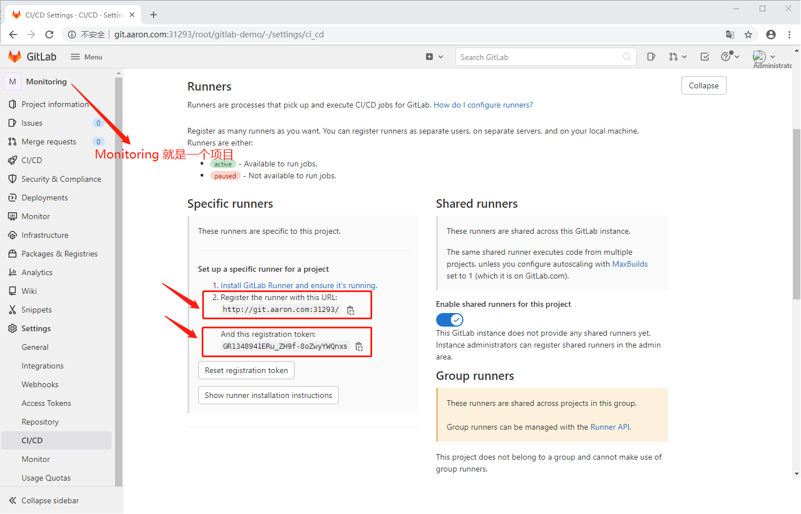
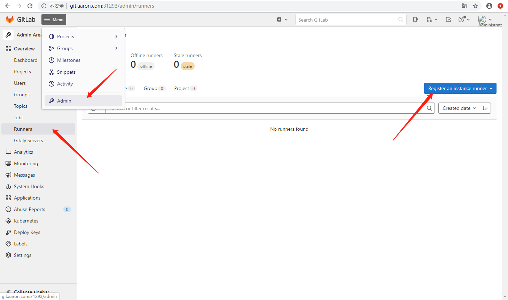
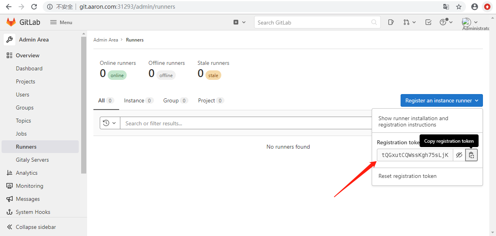
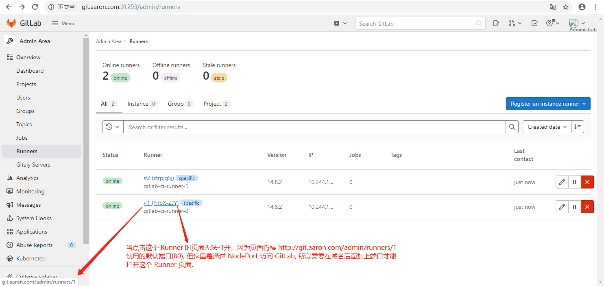
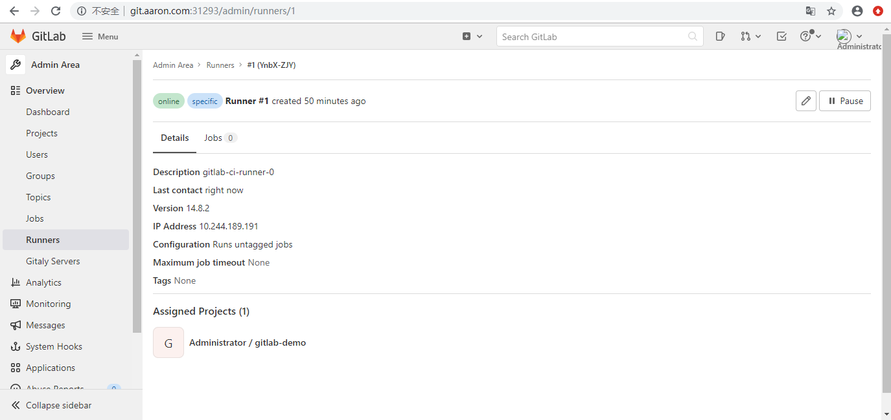

1. Gitlab CI 

上节将 Gitlab 安装到 k8s 集群中，这节介绍使⽤ Gitlab CI 来做持续集成。


1.1 简介

从 Gitlab 8.0 开始，Gitlab CI 就已经集成在 Gitlab 中，只要在项⽬中添加⼀个 .gitlab-ci.yml ⽂ 件，然后添加⼀个 Runner ，即可进⾏持续集成。在介绍 Gitlab CI 之前，先看看⼀些 Gitlab CI 的⼀些相关概念。


1.2 Pipeline

⼀次 Pipeline 其实相当于⼀次构建任务，⾥⾯可以包含很多个流程，如安装依赖、运⾏测试、编译、 部署测试服务器、部署⽣产服务器等流程。任何提交或者 Merge Request 的合并都可以触发 Pipeline 构建，如下图所示：



1.3 Stages

Stages 表示⼀个构建阶段，也就是上⾯提到的⼀个流程。可以在⼀次 Pipeline 中定义多个 Stages，这些 Stages 会有以下特点：

- 所有 Stages 会按照顺序运⾏，即当⼀个 Stage 完成后，下⼀个 Stage 才会开始

- 只有当所有 Stages 完成后，该构建任务 (Pipeline) 才会成功

- 如果任何⼀个 Stage 失败，那么后⾯的 Stages 不会执⾏，该构建任务 (Pipeline) 失败

Stages 和 Pipeline 的关系如下所示：




1.4 Jobs

Jobs 表示构建⼯作，表示某个 Stage ⾥⾯执⾏的⼯作。我们可以在 Stages ⾥⾯定义多个 Jobs，这些 Jobs 会有以下特点：

- 相同 Stage 中的 Jobs 会并⾏执⾏

- 相同 Stage 中的 Jobs 都执⾏成功时，该 Stage 才会成功

- 如果任何⼀个 Job 失败，那么该 Stage 失败，即该构建任务 (Pipeline) 失败

Jobs 和 Stage 的关系如下所示：




2 Gitlab Runner

理解上⾯的基本概念后，可能就会发现⼀个问题，构建任务在什么地⽅来执⾏？以前⽤ Jenkins 在 Master 和 Slave 节点都可以⽤来运⾏构建任务，⽽来执⾏ Gitlab CI 构建任务的就是 Gitlab Runner。

⼤多数情况下构建任务都是会占⽤⼤量的系统资源，如果直接让 Gitlab 本身来运⾏构建任务的话，显然 Gitlab 的性能会⼤幅度下降。GitLab CI 最⼤的作⽤是管理各个项⽬的构建状态，因此运⾏构建任务这种浪费资源的事情交给⼀个独⽴的 Gitlab Runner 来做就会好很多，更重要的是 Gitlab Runner 可以安装到不同的机器上，甚⾄是本机，这样完全就不会影响到 Gitlab 本身。


3 安装

安装 Gitlab Runner ⾮常简单，⽐如可以直接使⽤⼆进制、Docker 等来安装。同样的，这⾥还是将 Gitlab Runner 安装到 Kubernetes 集群中来，让集群来统⼀管理 Gitlab 相关的服务。

- 安装 Gitlab Runner  官⽅⽂档：https://docs.gitlab.com/runner/install/


本节所用到的所有资源对象:

[74Gitlab CI Runner 的安装.zip](attachments/C92033BF9CD846F88644738CAEC595EB74Gitlab CI Runner 的安装.zip)


准备镜像  gitlab-runner:v14.8.2

```javascript
# 在 node 节点 pull 镜像
[root@centos7 ~]# docker pull gitlab/gitlab-runner:v14.8.2
v14.8.2: Pulling from gitlab/gitlab-runner
08c01a0ec47e: Already exists 
b53ee259b635: Pull complete 
8ca0013e96ca: Pull complete 
Digest: sha256:208c32284ff6b7a3a25cdf57a80d3121f367dfb83932db762508f4dacd4f24f3
Status: Downloaded newer image for gitlab/gitlab-runner:v14.8.2
docker.io/gitlab/gitlab-runner:v14.8.2
[root@centos7 aaron]# 
```


3.1 验证 Kubernetes 集群

```javascript
// cluster-info 这个命令会显示当前链接的集群状态和可⽤的集群服务列表.
// 执⾏下⾯的命令验证 Kubernetes 集群：
[root@centos7 aaron]# kubectl cluster-info
Kubernetes control plane is running at https://192.168.32.100:6443
CoreDNS is running at https://192.168.32.100:6443/api/v1/namespaces/kube-system/services/kube-dns:dns/proxy

To further debug and diagnose cluster problems, use 'kubectl cluster-info dump'.
[root@centos7 aaron]# 
```


3.2 获取 Gitlab CI Register Token

上节已经成功安装了 Gitlab，现在可以来获取  Gitlab CI Register Token，有两种方式获取。在浏览器中打开 GitLab ，登录后进入到主页面。


第一种是：项目的 Register Token

进入到某个项目页面，点击侧边栏的 Setting, 然后再点击 CI/CD，可以看到该⻚⾯中有 URL 和 Register Token 这两个重要的参数，下⾯的步骤中需要⽤到这两个参数值。(注意：不要随便泄露 Token)



```javascript
// 从上图可以知道 URL 和 Register Token:
http://git.aaron.com:31293/
GR1348941ERu_ZH9f-8oZwyYWQnxs
```


第二种是：GitLab 的 Admin 页面获取 Register Token






以上两种方式获取的 token都是可以使用的.


3.3 编写 Gitlab CI Runner 资源清单⽂件

(1) runner-cm.yaml

同样将 Runner 相关的资源对象都安装到 kube-ops 这个 namespace 下⾯，⾸先，通过 ConfigMap 资源来传递 Runner 镜像所需的环境变量:

[runner-cm.yaml](attachments/1A130B1977624DDC8EC28F630A25B28Brunner-cm.yaml)

```javascript
# runner-cm.yaml
apiVersion: v1
kind: ConfigMap
metadata:
  labels:
    app: gitlab-ci-runner
  name: gitlab-ci-runner-cm
  namespace: kube-ops
data:
  REGISTER_NON_INTERACTIVE: "true"
  REGISTER_LOCKED: "false"
  METRICS_SERVER: "0.0.0.0:9100"

  # 方式1: 这里如果使用 Gitlab 域名,但域名不是通过外网的 DNS 进行解析,就需要在"/etc/hosts"文件中映射,就需要在 Pod 启动后修改 host 文件,
  #        目前还没找到 Pod 启动后及时修改 hosts 文件的方法,如果域名不能通过外网 DNS 解析,也不能在 host 文件中映射,Runner就不能绑定到GitLab.
  # CI_SERVER_URL: "http://git.aaron.com/ci"

  # 方式2: 这里的 IP 可以是 Gitlab service 的 CLUSTER-IP, 也可以是 Gitlab 这个 Pod 的IP, 甚至可以是外网IP和节点IP(但是要注意端口)
  # 因为 service 和 Pod 重新部署后 IP 就发生变化,所以这里不能用.最好的方式是用 k8s 集群内部 Gitlab 的  Service DNS 地址(也就是方式3)
  # CI_SERVER_URL: "http://10.244.189.165/ci"
  
  # 方式3: k8s 集群内部 Gitlab 的 Service DNS 地址,这种方式是最好的
  CI_SERVER_URL: "http://gitlab.kube-ops.svc.cluster.local/ci"

  # 如果 Gitlab 的域名是通过外网 DNS 解析,并且是默认端口(http默认80端口,https默认443端口),可以不用加此参数
  # 如果 Gitlab 的域名是通过 host 映射访问,这里一定要加这个参数,这个参数意思"在拉取代码之前执行的特定于运行程序的命令脚本"
  # 如果不加此参数, Runner 在跑 Job 的时候就会出现如下错误:
  #    fatal: unable to access 'http://git.aaron.com/root/presentation-gitlab-k8s.git/': Could not resolve host: git.aaron.com
  #    ERROR: Job failed: command terminated with exit code 1
  # 如果 Gitlab 的域名是通过 host 映射访问,则 IP 设置的优先级为:
  #    节点IP(必须设置为http或https默认端口) > Gitlab CLUSTER-IP(需设置为http或https默认端口) > Pod IP(也就是容器IP,并开放http或https默认端口)
  # 这里使用 CLUSTER-IP 的方式, 这里 Gitlab Service 开放出 80 端口和 Gitlab 这个 Pod(确切说是 Pod 管理的容器) 的 80 端口进行映射。
  RUNNER_PRE_CLONE_SCRIPT: "echo '10.111.14.238 git.aaron.com' >> /etc/hosts"
  
  RUNNER_REQUEST_CONCURRENCY: "4"
  RUNNER_EXECUTOR: "kubernetes"
  KUBERNETES_NAMESPACE: "kube-ops"
  KUBERNETES_PRIVILEGED: "true"
  KUBERNETES_CPU_LIMIT: "1"
  KUBERNETES_CPU_REQUEST: "500m"
  KUBERNETES_MEMORY_LIMIT: "1Gi"
  KUBERNETES_SERVICE_CPU_LIMIT: "1"
  KUBERNETES_SERVICE_MEMORY_LIMIT: "1Gi"
  KUBERNETES_HELPER_CPU_LIMIT: "500m"
  KUBERNETES_HELPER_MEMORY_LIMIT: "100Mi"
  KUBERNETES_PULL_POLICY: "if-not-present"
  KUBERNETES_TERMINATIONGRACEPERIODSECONDS: "10"
  KUBERNETES_POLL_INTERVAL: "5"
  KUBERNETES_POLL_TIMEOUT: "360"
```


注意1：

CI_SERVER_URL 对应的值需要指向 Gitlab 实例的 URL，并加上/ci（URL 可以是外网地址，也可以是 k8s 集群内部的 Service DNS 地址，因为 Runner 也是运行在 k8s 集群中的）。此外还添加了一些构建容器运行的资源限制，可以自己根据需要进行更改即可。

```javascript
// 特别注意 CI_SERVER_URL 和 RUNNER_PRE_CLONE_SCRIPT 两个参数的用法:
  
# 方式1: 这里如果使用 Gitlab 域名,但域名不是通过外网的 DNS 进行解析,就需要在"/etc/hosts"文件中映射,就需要在 Pod 启动后修改 host 文件,
#        目前还没找到 Pod 启动后及时修改 hosts 文件的方法,如果域名不能通过外网 DNS 解析,也不能在 host 文件中映射,Runner就不能绑定到GitLab.
# CI_SERVER_URL: "http://git.aaron.com/ci"

# 方式2: 这里的 IP 可以是 Gitlab service 的 CLUSTER-IP, 也可以是 Gitlab 这个 Pod 的IP, 甚至可以是外网IP和节点IP(但是要注意端口)
# 因为 service 和 Pod 重新部署后 IP 就发生变化,所以这里不能用.最好的方式是用 k8s 集群内部 Gitlab 的  Service DNS 地址(也就是方式3)
# CI_SERVER_URL: "http://10.244.189.165/ci"
  
# 方式3: k8s 集群内部 Gitlab 的 Service DNS 地址,这种方式是最好的
CI_SERVER_URL: "http://gitlab.kube-ops.svc.cluster.local/ci"

# 如果 Gitlab 的域名是通过外网 DNS 解析,并且是默认端口(http默认80端口,https默认443端口),可以不用加此参数
# 如果 Gitlab 的域名是通过 host 映射访问,这里一定要加这个参数,这个参数意思"在拉取代码之前执行的特定于运行程序的命令脚本"
# 如果不加此参数, Runner 在跑 Job 的时候就会出现如下错误:
#    fatal: unable to access 'http://git.aaron.com/root/presentation-gitlab-k8s.git/': Could not resolve host: git.aaron.com
#    ERROR: Job failed: command terminated with exit code 1
# 如果 Gitlab 的域名是通过 host 映射访问,则 IP 设置的优先级为:
#    节点IP(必须设置为http或https默认端口) > Gitlab CLUSTER-IP(需设置为http或https默认端口) > Pod IP(也就是容器IP,并开放http或https默认端口)
# 这里使用 CLUSTER-IP 的方式, 这里 Gitlab Service 开放出 80 端口和 Gitlab 这个 Pod(确切说是 Pod 管理的容器) 的 80 端口进行映射。
RUNNER_PRE_CLONE_SCRIPT: "echo '10.111.14.238 git.aaron.com' >> /etc/hosts"

```

上面方式1中，如果定义的 Gitlab 域名并不是通过外网的 DNS 进行解析，而是通过 /etc/hosts 进行映射，那么就需要在 runner 这个 Pod 的 hosts 文件中添加对应的域名映射，但是如何添加？可以想到 Pod 的 hostAlias 可以实现，但是 runner 的 Pod 是自动生成的，没办法直接去定义 hostAlias。目前为止还没有找到方法解决这个问题。


注意2：在向 ConfigMap 添加新选项后，需要删除 GitLab CI Runner Pod。因为是使⽤ envFrom 来注⼊上⾯的这些环境变量⽽不是直接使⽤ env（envFrom 通过将环境变量放置到 ConfigMaps 或 Secrets 来帮助减⼩清单⽂件）。


注意3：

如果要添加其他选项，在 Pod 中运⾏ gitlab-ci-multi-runner register --help 命令查看所有可使⽤的选项，只需为要配置的标志添加 env 变量即可，如下所示：

[gitlab-ci-multi-runner.txt](attachments/D69D81DD4EFA470B81337C39F0170A7Cgitlab-ci-multi-runner.txt)

```javascript
// 进入到容器运行 gitlab-ci-multi-runner register --help 命令
[root@centos7 74Runner]# kubectl -n kube-ops exec gitlab-ci-runner-0 -i -t -- bash -il
gitlab-runner@gitlab-ci-runner-0:/$ gitlab-ci-multi-runner register --help
Runtime platform                                    arch=amd64 os=linux pid=60 revision=c6e7e194 version=14.8.2
NAME:
   gitlab-ci-multi-runner register - register a new runner

USAGE:
   gitlab-ci-multi-runner register [command options] [arguments...]

OPTIONS:
   //......
   --env value                                                                       Custom environment variables injected to build environment [$RUNNER_ENV]
   --pre-clone-script value                                                          Runner-specific command script executed before code is pulled [$RUNNER_PRE_CLONE_SCRIPT]
   --pre-build-script value                                                          Runner-specific command script executed after code is pulled, just before build executes [$RUNNER_PRE_BUILD_SCRIPT]
   //......
   
gitlab-runner@gitlab-ci-runner-0:/$ exit
logout
[root@centos7 74Runner]# 

```

 --pre-clone-script 参数注意事项(特别注意这个参数指定的脚本的执行时机)：

-   --pre-clone-script 参数指定一段脚本来添加 hosts 信息,但这个脚本是在 Runner 的 Job 跑到拉取代码之前的时候才会运行

-   --pre-clone-script 对应的环境变量为 RUNNER_PRE_CLONE_SCRIPT , 使用方法如下:

```javascript
在 "runner-cm.yaml" 文件中的 ConfigMap 的 data 区域中添加环境变量: 如下：
  RUNNER_PRE_CLONE_SCRIPT: "echo '10.111.14.238 git.aaron.com' >> /etc/hosts" 
```


(2) runner-scripts-cm.yaml

除了上⾯的⼀些环境变量相关的配置外，还需要⼀个⽤于注册、运⾏和取消注册 Gitlab CI Runner 的⼩脚本。只有当 Pod 正常通过 k8s（TERM信号）终⽌时，才会触发转轮取消注册。 如果强制终⽌ Pod（SIGKILL信号），Runner 将不会注销⾃身。必须⼿动完成对这种被杀死的 Runner 的清理，配置清单⽂件如下：

[runner-scripts-cm.yaml](attachments/BCA576D22FD64FDA8ADE61AA09721A6Frunner-scripts-cm.yaml)

```javascript
# runner-scripts-cm.yaml
apiVersion: v1
kind: ConfigMap
metadata:
  labels:
    app: gitlab-ci-runner
  name: gitlab-ci-runner-scripts
  namespace: kube-ops
data:
  run.sh: |
    #!/bin/bash
    unregister() {
        kill %1
        echo "Unregistering runner ${RUNNER_NAME} ..."
        /usr/bin/gitlab-ci-multi-runner unregister -t "$(/usr/bin/gitlab-ci-multi-runner list 2>&1 | tail -n1 | awk '{print $4}' | cut -d'=' -f2)" -n ${RUNNER_NAME}
        exit $?
    }
    trap 'unregister' EXIT HUP INT QUIT PIPE TERM
    echo "Registering runner ${RUNNER_NAME} ..."
    /usr/bin/gitlab-ci-multi-runner register -r ${GITLAB_CI_TOKEN}
    sed -i 's/^concurrent.*/concurrent = '"${RUNNER_REQUEST_CONCURRENCY}"'/' /home/gitlab-runner/.gitlab-runner/config.toml
    echo "Starting runner ${RUNNER_NAME} ..."
    /usr/bin/gitlab-ci-multi-runner run -n ${RUNNER_NAME} &
    wait

```


(3) gitlab-ci-token-secret.yaml

可以看到"runner-scripts-cm.yaml"中需要一个 GITLAB_CI_TOKEN，然后用 Gitlab CI runner token 来创建一个 Kubernetes secret 对象。将 token 进行 base64 编码：

```javascript
// base64 命令在大部分 Linux 发行版中都是可用的。
[root@centos7 74Runner]# echo GR1348941ERu_ZH9f-8oZwyYWQnxs | base64 -w0
R1IxMzQ4OTQxRVJ1X1pIOWYtOG9ad3lZV1FueHMK
[root@centos7 74Runner]#

```


然后使用上面的 token 创建一个 Secret 对象：

[gitlab-ci-token-secret.yaml](attachments/1C335B263D4543A79AFA26578C7231F7gitlab-ci-token-secret.yaml)

```javascript
# gitlab-ci-token-secret.yaml
apiVersion: v1
kind: Secret
metadata:
  name: gitlab-ci-token
  namespace: kube-ops
  labels:
    app: gitlab-ci-runner
data:
  GITLAB_CI_TOKEN: R1IxMzQ4OTQxRVJ1X1pIOWYtOG9ad3lZV1FueHMK
```


(4) runner-statefulset.yaml

接下来使用 Statefulset 来作为⼀个⽤于真正运⾏ Runner 的控制器对象。⾸先，在开始运⾏的时候，尝试取消注册所有的同名 Runner，当节点丢失时(即 NodeLost 事件)这尤其有⽤。然后再尝试重新注册⾃⼰并开始运⾏。在正常停⽌ Pod 的时候，Runner 将会运⾏ unregister 命令来尝试取消⾃⼰，所以这时 Gitlab 就不能再使⽤这个 Runner 了，这个是通过 Kubernetes Pod ⽣命周期中的 hooks 来完成的。另外这里使用 envFrom 来指定 ConfigMap 和 Secrets 来⽤作环境变量，对应的资源清单⽂件如下：

[runner-statefulset.yaml](attachments/65087F6DAFF14F5E8BCFA09E380DCC3Arunner-statefulset.yaml)

```javascript
# runner-statefulset.yaml
apiVersion: apps/v1
kind: StatefulSet
metadata:
  name: gitlab-ci-runner
  namespace: kube-ops
  labels:
    app: gitlab-ci-runner
spec:
  updateStrategy:
    type: RollingUpdate
  replicas: 2
  serviceName: gitlab-ci-runner
  selector:
    matchLabels:
      app: gitlab-ci-runner
  template:
    metadata:
      labels:
        app: gitlab-ci-runner
    spec:
      volumes:
      - name: gitlab-ci-runner-scripts
        projected:
          sources:
          - configMap:
              name: gitlab-ci-runner-scripts
              items:
              - key: run.sh
                path: run.sh
                mode: 0755
      serviceAccountName: gitlab-ci
      securityContext:
        runAsNonRoot: true
        runAsUser: 999
        supplementalGroups: [999]
      containers:
      - image: gitlab/gitlab-runner:v14.8.2
        imagePullPolicy: IfNotPresent
        name: gitlab-ci-runner
        command:
        - /scripts/run.sh
        envFrom:
        - configMapRef:
            name: gitlab-ci-runner-cm
        - secretRef:
            name: gitlab-ci-token
        env:
        - name: RUNNER_NAME
          valueFrom:
            fieldRef:
              fieldPath: metadata.name
        ports:
        - containerPort: 9100
          name: http-metrics
          protocol: TCP
        volumeMounts:
        - name: gitlab-ci-runner-scripts
          mountPath: "/scripts"
          readOnly: true
      restartPolicy: Always
```


(5) runner-rbac.yaml

可以看到上⾯使⽤了⼀个名为 gitlab-ci 的 serviceAccount，新建⼀个 rbac 资源清单⽂件： 

[runner-rbac.yaml](attachments/A9798BC60BA14228B4110E26DF6DA438runner-rbac.yaml)

```javascript
# runner-rbac.yaml
apiVersion: v1
kind: ServiceAccount
metadata:
  name: gitlab-ci
  namespace: kube-ops
---
kind: Role
apiVersion: rbac.authorization.k8s.io/v1
metadata:
  name: gitlab-ci
  namespace: kube-ops
rules:
  - apiGroups: [""]
    resources: ["*"]
    verbs: ["*"]
---
kind: RoleBinding
apiVersion: rbac.authorization.k8s.io/v1
metadata:
  name: gitlab-ci
  namespace: kube-ops
subjects:
  - kind: ServiceAccount
    name: gitlab-ci
    namespace: kube-ops
roleRef:
  kind: Role
  name: gitlab-ci
  apiGroup: rbac.authorization.k8s.io
```


3.4 创建 Runner 资源对象

```javascript
// 资源清单⽂件准备好后，直接创建上⾯的资源对象
[root@centos7 74Runner]# ls -l
total 20
-rw-r--r--. 1 root root  193 Mar  9 11:59 gitlab-ci-token-secret.yaml
-rw-r--r--. 1 root root 1606 Mar  9 11:59 runner-cm.yaml
-rw-r--r--. 1 root root  554 Mar  9 11:59 runner-rbac.yaml
-rw-r--r--. 1 root root  869 Mar  9 11:59 runner-scripts-cm.yaml
-rw-r--r--. 1 root root 1505 Mar  9 11:59 runner-statefulset.yaml

[root@centos7 74Runner]# kubectl create -f .
secret/gitlab-ci-token created
configmap/gitlab-ci-runner-cm created
serviceaccount/gitlab-ci created
role.rbac.authorization.k8s.io/gitlab-ci created
rolebinding.rbac.authorization.k8s.io/gitlab-ci created
configmap/gitlab-ci-runner-scripts created
statefulset.apps/gitlab-ci-runner created

// 创建完成后，可以通过查看 Pod 状态判断 Runner 是否运⾏成功：
[root@centos7 ~]# kubectl -n kube-ops get pod
NAME                          READY   STATUS    RESTARTS      AGE
gitlab-85677ff498-snhwn       1/1     Running   2 (24h ago)   2d1h
gitlab-ci-runner-0            1/1     Running   0             27m
gitlab-ci-runner-1            1/1     Running   0             27m
postgresql-577d9f78c9-7n9sf   1/1     Running   2 (24h ago)   2d1h
redis-95677b8f5-m9n42         1/1     Running   2 (24h ago)   2d3h
[root@centos7 ~]#

// 可以看到已经成功运⾏了两个（具体取决于 StatefulSet 清单中的副本数) Runner 实例
```


然后切换到 Gitlab Admin ⻚⾯下⾯的 Runner ⻚⾯：







当然也可以根据需要更改 Runner 的⼀些配置，⽐如添加 tag 标签等。