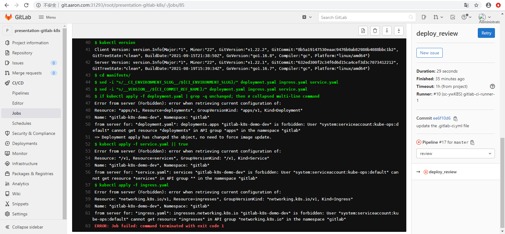
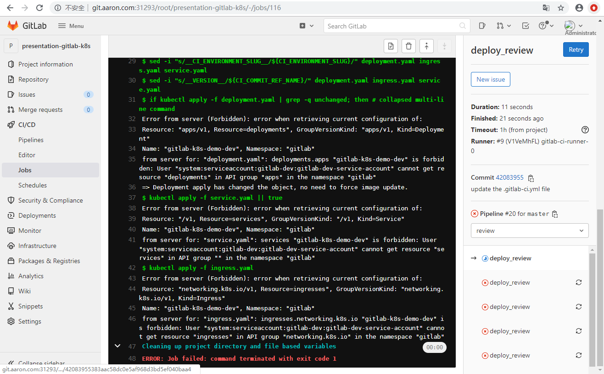
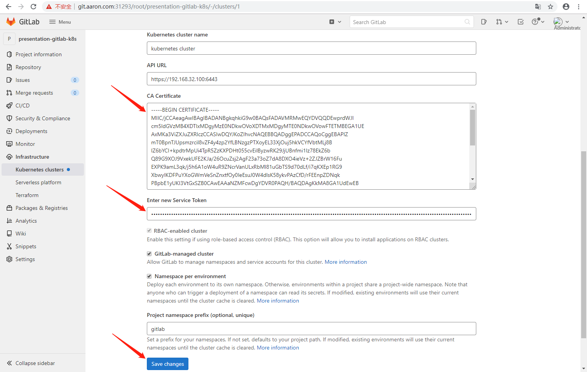
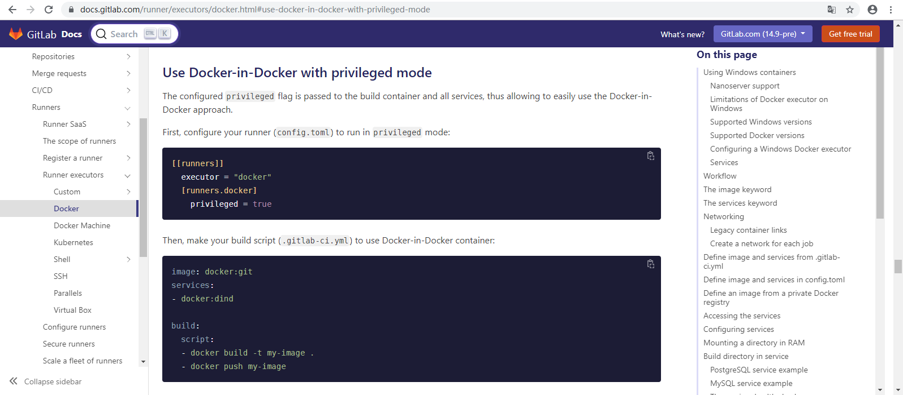

1. 准备工作.


1.1  准备 Gitlab CI 所⽤到的代码库

接下来 Gitlab CI 所⽤到的代码库可以从 gitee上获得：

- https://gitee.com/st22ab889/gitlab-ci-k8s-demo.git

可以在 Gitlab 上新建⼀个项⽬导⼊该仓库，也可以新建⼀个空⽩的仓库，然后将 Github 上⾯的项⽬ Clone 到本地后，更改远程仓库地址即可。


1.2  kubectl ⼯具镜像：st22ab889/kubectl:1.22.1-0

[docker-kubectl.zip](attachments/95658473017E484F87CD556D903051B6docker-kubectl.zip)

st22ab889/kubectl:1.22.1-0 镜像的 Dockerfile 如下:（注意：这里打包到镜像中的 kubectl 版本应该与 k8s 集群中 kubectl 的版本尽量保持一致或版本相差不大，否则可能会出现错误。）

```javascript
# DockerfileUpdated
# 需要提前下载 kubectl

FROM alpine:3.8

MAINTAINER aaron <kkk_en@163.com>

COPY kubectl /usr/local/bin/kubectl
RUN apk add --update ca-certificates \
 && apk add --update -t deps curl \
 && apk add --update gettext \
 && apk add --update git \
 && chmod +x /usr/local/bin/kubectl \
 && apk del --purge deps \
 && rm /var/cache/apk/*

 ENTRYPOINT ["kubectl"]
 CMD ["--help"]
 
```


```javascript
// 编译镜像
[root@centos7 docker-kubectl]# docker build -f ./DockerfileUpdated -t st22ab889/kubectl:1.22.1-0 .
Sending build context to Docker daemon  46.91MB
Step 1/6 : FROM alpine:3.8
 ---> c8bccc0af957
Step 2/6 : MAINTAINER aaron <kkk_en@163.com>
 ---> Using cache
 ---> 1cd00a9c85df
//......
Successfully built 019789d46b0c
Successfully tagged st22ab889/kubectl:1.22.1-0

[root@centos7 aaron]# docker images | grep st22ab889/kubectl
st22ab889/kubectl                                                 1.22.1-0   019789d46b0c   5 hours ago     120MB

// 登录 docker
[root@centos7 docker-kubectl]# docker login
Login with your Docker ID to push and pull images from Docker Hub. If you don't have a Docker ID, head over to https://hub.docker.com to create one.
Username: st22ab889
Password: 
//......
Login Succeeded

//推送编译好的镜像到 docker hub
[root@centos7 docker-kubectl]# docker push st22ab889/kubectl:1.22.1-0
The push refers to repository [docker.io/st22ab889/kubectl]
97403be934b9: Pushed 
64eb5246095d: Pushed 
7444ea29e45e: Mounted from library/alpine 
1.22.1-0: digest: sha256:7fb267e79d54be34c3ccb812d8738d17ddc85c86663b73aab4a9e8a7ca40e506 size: 952
[root@centos7 docker-kubectl]# 
```


1.3 项⽬命名空间 和 RBAC 权限

这个项⽬准备部署在⼀个名为 gitlab 的 namespace 下⾯，所以⾸先需要到⽬标集群中创建⼀个 namespace:

```javascript
[root@centos7 aaron]# kubectl create ns gitlab
namespace/gitlab created
[root@centos7 aaron]# kubectl get ns | grep gitlab
gitlab                 Active   13s
[root@centos7 aaron]#
```


由于在部署阶段需要去创建、删除⼀些资源对象，所以也需要对象的 RBAC 权限，这⾥为了简单，直接新建⼀个 ServiceAccount，绑定上⼀个 cluster-admin 的权限：

[gitlab-sa.yaml](attachments/028DECCBF3644580ABB25B6BF43060FBgitlab-sa.yaml)

```javascript
# gitlab-sa.yaml
---
apiVersion: v1
kind: ServiceAccount
metadata:
  name: gitlab
  namespace: gitlab

---
apiVersion: rbac.authorization.k8s.io/v1
kind: ClusterRoleBinding
metadata:
  name: gitlab
  namespace: gitlab
subjects:
  - kind: ServiceAccount
    name: gitlab
    namespace: gitlab
roleRef:
  apiGroup: rbac.authorization.k8s.io
  kind: ClusterRole
  name: cluster-admin
```


```javascript
// 然后创建上⾯的 ServiceAccount 对象
[root@centos7 docker-kubectl]# kubectl create -f gitlab-sa.yaml 
serviceaccount/gitlab created
clusterrolebinding.rbac.authorization.k8s.io/gitlab created
[root@centos7 docker-kubectl]#
```


1.4  开始前注意：首先检查 Runner 在 GitLab 上是否是 online 状态，因为在虚拟机上创建的 k8s 集群，在关闭虚拟机再重新开机后会出现 Runner 是 offline 状态,原因是启动的时候 GitLab 这个 Pod 很慢，但是 Runner 这个 Pod 很快，启动的时间差导致 Runner 不能注册到 GitLab 上。如下：


解决方法：删除 Runner Pod，让其重新启动。

```javascript
[root@centos7 ~]# kubectl get pod -n kube-ops
NAME                          READY   STATUS    RESTARTS       AGE
gitlab-85677ff498-snhwn       1/1     Running   4 (166m ago)   2d14h
gitlab-ci-runner-0            1/1     Running   1 (12h ago)    13h
gitlab-ci-runner-1            1/1     Running   1 (12h ago)    13h
postgresql-577d9f78c9-7n9sf   1/1     Running   3 (12h ago)    2d14h
redis-95677b8f5-m9n42         1/1     Running   3 (12h ago)    2d16h

[root@centos7 ~]# kubectl -n kube-ops delete pod gitlab-ci-runner-0
pod "gitlab-ci-runner-0" deleted

[root@centos7 ~]# kubectl -n kube-ops delete pod gitlab-ci-runner-1
pod "gitlab-ci-runner-1" deleted

[root@centos7 ~]# kubectl get pod -n kube-ops
NAME                          READY   STATUS    RESTARTS        AGE
gitlab-85677ff498-snhwn       1/1     Running   4 (4h18m ago)   2d15h
gitlab-ci-runner-0            1/1     Running   0               14s
gitlab-ci-runner-1            1/1     Running   0               3s
postgresql-577d9f78c9-7n9sf   1/1     Running   3 (14h ago)     2d16h
redis-95677b8f5-m9n42         1/1     Running   3 (14h ago)     2d17h
[root@centos7 ~]# 
```


2. Gitlab CI 基本配置


步骤1：这里采用新建空白仓库，然后 Clone 到本地，然后更改远程仓库地址的方式。在 GitLab上新建一个空白的仓库，命名为"presentation-gitlab-k8s"。


步骤2：

进入到 presentation-gitlab-k8s 项目页面，然后点击侧边栏的 Setting 选项，然后选择 CI/CD，在页面上找到 Runners，点击 Expand。这里分两种情况：


情况一: 如果 Runner Pod 使用的是 项目的 Register Token

 在页面中可以看到 Enable for this project ,然后点击开启它。


情况二: 如果 Runner Pod 使用的是 GitLab 的 Admin 页面的 Register Token


步骤3：clone 代码，以及将代码 push 到 GitLab

```javascript
# (1)将 gitee上⾯的项⽬ Clone 到本地后,更改远程仓库地址,在 Git Bash 中运行以下命令:
WuJun@DESKTOP-CD905DM MINGW64 ~/Desktop/vscode/75Gitlab CI 的基本使用
$ git clone git@gitee.com:st22ab889/gitlab-ci-k8s-demo.git
Cloning into 'gitlab-ci-k8s-demo'...
remote: Enumerating objects: 2036, done.
remote: Counting objects: 100% (2036/2036), done.
remote: Compressing objects: 100% (1133/1133), done.
remote: Total 2036 (delta 787), reused 2036 (delta 787), pack-reused 0
Receiving objects: 100% (2036/2036), 3.29 MiB | 1.02 MiB/s, done.
Resolving deltas: 100% (787/787), done.

# (2) clone 后进入到 gitlab-ci-k8s-demo 文件夹,重新打开 Git Bash 运行以下命令: 
WuJun@DESKTOP-CD905DM MINGW64 ~/Desktop/vscode/75Gitlab CI 的基本使用/gitlab-ci-k8s-demo (master)
$ git remote set-url origin ssh://git@git.aaron.com:30022/root/presentation-gitlab-k8s.git

WuJun@DESKTOP-CD905DM MINGW64 ~/Desktop/vscode/75Gitlab CI 的基本使用/gitlab-ci-k8s-demo (master)
$ git push -u origin master
Enumerating objects: 2036, done.
Counting objects: 100% (2036/2036), done.
Delta compression using up to 8 threads
Compressing objects: 100% (1133/1133), done.
Writing objects: 100% (2036/2036), 3.29 MiB | 37.88 MiB/s, done.
Total 2036 (delta 787), reused 2036 (delta 787), pack-reused 0
remote: Resolving deltas: 100% (787/787), done.
To ssh://git.aaron.com:30022/root/presentation-gitlab-k8s.git
 * [new branch]      master -> master
Branch 'master' set up to track remote branch 'master' from 'origin'.
```


2：使用 Gitlab CI 构建任务


2.1 开始触发流水线


当把仓库推送到 Gitlab 以后，应该可以看到 Gitlab CI 开始执⾏构建任务了(每次提交都会自动触发流水线构建)：


此时 Runner Pod 所在的 namespace 下⾯也会出现两个新的 Pod：

```javascript
[root@centos7 74Runner]# kubectl get pod -n kube-ops
NAME                                           READY   STATUS            RESTARTS       AGE
gitlab-85677ff498-6kztp                        1/1     Running           1 (105m ago)   115m
gitlab-ci-runner-0                             1/1     Running           0              27m
gitlab-ci-runner-1                             1/1     Running           0              27m
postgresql-577d9f78c9-rl2lg                    1/1     Running           1 (105m ago)   115m
redis-95677b8f5-vvwkv                          1/1     Running           1 (105m ago)   115m
runner-yrduyjfr-project-34-concurrent-07pn2c   0/2     PodInitializing   0              26s
runner-yrduyjfr-project-34-concurrent-1rt8v2   0/2     PodInitializing   0              25s

```


2.2 构建过程中解决错误阶段


构建过程中错误遇到的错误1：

这两个新的 Pod 就是⽤来执⾏具体的 Job 任务的，这⾥同时出现两个证明第⼀步是并⾏执⾏的两个任 务，从上⾯的 Pipeline 中也可以看到是 test 和 test2 这两个 Job。可以看到在执⾏ image_build 任务的时候出现了错误，点击查看这个 Job 失败详细信息：


可以看到出现上⾯的错误是因为还没有给变量设置值，比如登录 docker hub 的用户名和密码（因为本地机器资源不够用，所以这里仍然使用 docker hub 来作为镜像仓库，如果机器资源足够，也可使用前面介绍的 Harbor 来作为镜像仓库），所以这⾥只需把相关的配置以参数的形式配置到 GitLab 环境中。


定位到项⽬==>点击侧边栏 Settings ==> 点击CI/CD，展开 Variables 栏⽬，配置镜像仓库相关的参数值：


```javascript
// 添加的参数值如下:
CI_REGISTRY_USER             [Docker Hub 用户名]
CI_REGISTRY_PASSWORD         [Docker Hub 密码]
CI_REGISTRY_IMAGE            st22ab889/gitlab-ci-demo

```

配置镜像仓库相关参数后，在失败的 Job 任务上点击 Retry


注意：如果是使用私有仓库，重试后可能还会出现下⾯的错误信息：

```javascript
$ docker login -u "${CI_REGISTRY_USER}" -p "${CI_REGISTRY_PASSWORD}" registry.aaron.com
WARNING! Using --password via the CLI is insecure. Use --password-stdin.
Error response from daemon: Get https://registry.aaron.com/v2/: x509: certificate signed
by unknown authority
ERROR: Job failed: command terminated with exit code 1
```

从错误信息可以看出这是因为登录私有镜像仓库的时候证书验证错误，因为没有提供任何证书，所以肯定会失败，有两种解决办法：

- ⼀种是在⽬录 /etc/docker/certs.d/ 下⾯添加上私 有仓库的 CA 证书。

- ⼀种是在 Docker 的启动参数中添加上 insecure-registries。

```javascript
// 在 dind 中添加 insecure-registries 的参数, 这种方式简单一些
// // 其中 registry.aaron.com 就是之前配置的私有镜像仓库地址
services:
- name: docker:dind
  command: ["--insecure-registry=registry.aaron.com"]
```


构建过程中错误遇到的错误2：

在最后 deploy_review 阶段仍然失败，原因是最后的部署阶段使⽤ kubectl ⼯具操作集群的时候并没有关联上任何集群。在 Gitlab CI 中部署阶段使⽤到的镜像是 st22ab889/kubectl:1.22.1-0 。



因为 kubectl 在使⽤的时候默认会读取当前⽤户⽬录下⾯的 ~/.kube/config ⽂件来链接集群，所以可以把连接集群的信息直接内置到 kubectl:1.22.1-0 这个镜像中，这样就可以直接操作集群，但有⼀个不好的地⽅就是不⽅便操作，假如要切换⼀个集群还得重新制作⼀个镜像。所以⼀般直接在 Gitlab 上配置 k8s 集群信息，配置过程如下：


在项⽬⻚⾯点击 Infrastructure ==> Kubernetes clusters ：


- Kubernetes cluster name 可以随便填

- API URL 是集群的 apiserver 地址，⼀般可以通过 kubectl cluster-info 命令获取，Kubernetes control plane  地址就是这里需要的 API URL

```javascript
[root@centos7 aaron]# kubectl cluster-info
Kubernetes control plane is running at https://192.168.32.100:6443
CoreDNS is running at https://192.168.32.100:6443/api/v1/namespaces/kube-system/services/kube-dns:dns/proxy

To further debug and diagnose cluster problems, use 'kubectl cluster-info dump'.
```

- CA证书、Token：可以通过在准备步骤中创建的 ServiceAccount 获取 CA 证书和 Token：

```javascript
# 要使用 jq ,首先要安装 jq
[root@centos7 docker-kubectl]# kubectl get serviceaccount gitlab -n gitlab -o json | jq -r '.secrets[0].name'
-bash: jq: command not found

[root@centos7 docker-kubectl]# yum install epel-release
Loaded plugins: fastestmirror
//......
Complete!

[root@centos7 docker-kubectl]# yum list jq
Loaded plugins: fastestmirror
//......
jq.x86_64                                                            1.6-2.el7                                                            epel

[root@centos7 docker-kubectl]# yum install jq
Loaded plugins: fastestmirror
//......
Complete!

[root@centos7 docker-kubectl]# kubectl get serviceaccount gitlab -n gitlab -o json | jq -r '.secrets[0].name'
gitlab-token-gz8pl

# 然后根据上面的Secret找到CA证书
[root@centos7 docker-kubectl]# kubectl get secret gitlab-token-gz8pl -n gitlab -o json | jq -r '.data["ca.crt"]' | base64 -d
-----BEGIN CERTIFICATE-----
//.......
-----END CERTIFICATE-----

# 当然要找到对应的 Token 也很简单
[root@centos7 docker-kubectl]# kubectl get secret gitlab-token-gz8pl  -n gitlab -o json | jq -r '.data.token' | base64 -d
eyJhbGciOi......J9oEEkRTEiGw
[root@centos7 docker-kubectl]#
```


构建过程中错误遇到的错误3：

填写上⾯对应的值然后添加集群信息后，点击 Add Kubernetes cluster，如果出现如下错误：


解决方法: 新开一个 GitLab 页面，进入 Admin area => Settings => Network ，然后点击 Outbound requests 右边 的“expand”按钮,候选如下图中的选项：


然后回到加集群信息的页面，点击 Add Kubernetes cluster，出现下面页面说明添加成功：


在失败的 Job 任务上点击 Retry 重新开启 Job。


构建过程中错误遇到的错误4：

重启 Job 的后出现如下错误：




解决方法： 在 Advanced Settings 页面开启一个重要选项：


在失败的 Job 任务上点击 Retry 重新开启 Job。


构建过程中错误遇到的错误5(可能会遇到)：

如果在构建的过程中遇到如下错误：


这个错误出现的原因一般是：在  Kubernetes 集群中使用 kubectl 命令删除了一些构建相关的 ServiceAccount 资源对象，如下:

```javascript
[root@centos7 ~]# kubectl get sa --all-namespaces | grep gitlab
gitlab-dev             default                              1         3h9m
gitlab-dev             gitlab-dev-service-account           1         3h9m
gitlab                 default                              1         3h10m
gitlab                 gitlab                               1         5h13m
kube-ops               gitlab-ci                            1         2d

[root@centos7 ~]# kubectl delete sa default -n gitlab-dev
serviceaccount "default" deleted

[root@centos7 ~]# kubectl delete sa gitlab-dev-service-account -n gitlab-dev
serviceaccount "gitlab-dev-service-account" deleted

[root@centos7 ~]# kubectl delete sa default -n gitlab
serviceaccount "default" deleted

```


解决方法： 在 Advanced Settings 页面点击一个重要按钮：


2.3 错误处理完成，正常部署阶段

然后回到项目 pipeline 页面，重新开启 deploy_review 阶段的 Job：


可以查看最后⼀个阶段（stage）deploy_review 是否正确，如果通过了，证明已经成功将应⽤程序部署到 k8s 集群中，⼀个成功的 review 阶段如下所示：


整个 Pipeline 构建成功后，可以在项⽬的环境菜单下⾯看到多了⼀个环境：


这就是关于 Gitlab CI 结合 Kubernetes 进⾏ CI/CD 的过程，具体详细的构建任务还需要结合应⽤实际情况⽽定。


2.4 部署完成，验证阶段

```javascript
// 查看 gitlab 这个命名空间下的资源
[root@centos7 aaron]# kubectl get all -n gitlab
NAME                                       READY   STATUS    RESTARTS   AGE
pod/gitlab-k8s-demo-dev-5599d88699-8hxnz   1/1     Running   0          8m38s
pod/gitlab-k8s-demo-dev-5599d88699-r9hqz   1/1     Running   0          8m38s

NAME                          TYPE        CLUSTER-IP     EXTERNAL-IP   PORT(S)    AGE
service/gitlab-k8s-demo-dev   ClusterIP   10.99.67.162   <none>        8000/TCP   8m38s

NAME                                  READY   UP-TO-DATE   AVAILABLE   AGE
deployment.apps/gitlab-k8s-demo-dev   2/2     2            2           8m38s

NAME                                             DESIRED   CURRENT   READY   AGE
replicaset.apps/gitlab-k8s-demo-dev-5599d88699   2         2         2       8m38s

// 查看 gitlab 这个命名空间下的 ingress 
[root@centos7 aaron]# kubectl get ingress -n gitlab
NAME                  CLASS    HOSTS                           ADDRESS   PORTS   AGE
gitlab-k8s-demo-dev   <none>   dev-gitlab-k8s-demo.aaron.com             80      8m56s

// 查看 ingress 的详细信息,可以得知域名为 dev-gitlab-k8s-demo.aaron.com  
[root@centos7 aaron]# kubectl -n gitlab describe ingress gitlab-k8s-demo-dev
Name:             gitlab-k8s-demo-dev
Namespace:        gitlab
Address:          
Default backend:  default-http-backend:80 (<error: endpoints "default-http-backend" not found>)
Rules:
  Host                           Path  Backends
  ----                           ----  --------
  dev-gitlab-k8s-demo.aaron.com  
                                 /   gitlab-k8s-demo-dev:8000 (10.244.189.142:8000,10.244.189.156:8000)
Annotations:                     <none>
Events:                          <none>
```


```javascript
// 在主机中的 hosts 文件中配置域名映射, 如下：
192.168.32.100  dev-gitlab-k8s-demo.aaron.com

// 查看 traefik service 的 NodePort 端口
// 8080 对应的 NodePort 端口是 traefik 的 dashboard 端口
// 80 对应的 NodePort 端口是 web 端口, web 请求从这个端口进来都会和 ingress 定义的域名去匹配 
[root@centos7 aaron]# kubectl get service | grep traefik
traefik      NodePort    10.103.234.13   <none>        80:31293/TCP,8080:32590/TCP   3d23h

```


浏览器中访问 http://dev-gitlab-k8s-demo.aaron.com:31293/


成功访问通过 GitLab CI 部署的项目，说明通过 GitLab CI 部署项目成功。


3. 总结


3.1  gitlab-sa.yaml 这个资源文件中名为 gitlab 的 ServiceAccount 对象是用来给 GitLab 赋予权限，有了权限 GitLab 才可以去创建和管理 k8s 集群中的资源对象，如果缺少这个 ServiceAccount 对象（也就是说缺少准备步骤 1.3 ）会出现下面的错误：


k8s 集群和 GitLab 是通过 CA 证书和 token 进行关联，CA 证书和 token 又是通过 ServiceAccount 对象来获取，如下：

```javascript
// gitlab-sa.yaml 这个资源文件创建的是名为 gitlab 的 ServiceAccount 对象

// 获取 gitlab 这个 ServiceAccount 对象的 secret 名称
[root@centos7 docker-kubectl]# kubectl get serviceaccount gitlab -n gitlab -o json | jq -r '.secrets[0].name'
gitlab-xxxxx-xxxxx

// 根据 secret 名称获取 CA 证书
[root@centos7 docker-kubectl]# kubectl get secret gitlab-xxxxx-xxxxx -n gitlab -o json | jq -r '.data["ca.crt"]' | base64 -d
-----BEGIN CERTIFICATE-----
//......
-----END CERTIFICATE-----

// 根据 secret 名称获取 token 证书
[root@centos7 docker-kubectl]# kubectl get secret gitlab-xxxxx-xxxxx  -n gitlab -o json | jq -r '.data.token' | base64 -d
eyJhbGciOiJSUzI1Ni......QlxJ9oEEkRTEiGw
```


将上面获取到的 CA 证书和 token 添加或更新到 GitLab 的 k8s 集群信息配置页面中，保存后回到 Kubernetes clusters 页面可以看到 GitLab 已经获取到集群信息，说明 GitLab 已经连接到 k8s 集群：




如果更改了 GitLab 用来连接到 k8s集群的这个 ServiceAccount 对象(比如删除了又重新创建) ，就要重新获取这个 ServiceAccount 对象的 CA 证书和 token,然后到 GitLab  的 k8s 集群配置页面进行更新。


3.2 dind（Docker in Docker）问题

如果在 .gitlab-ci.yml 文件中使用 docker:dind 这个镜像，如下：

```javascript
image_build:
  ......
  services:
    - name: docker:dind
......
```


在运行 pipeline 的时候会出现如下错误：


解决方法1：使用 GitLab 官方解决方案。



- https://gitlab.com/gitlab-org/gitlab-runner/-/issues/1544

- https://docs.gitlab.com/runner/executors/docker.html#use-docker-in-docker-with-privileged-mode


解决方法2：在 .gitlab-ci.yml 文件中使用 docker:17.03-dind 这个镜像，如下：

```javascript
image_build:
  ......
  services:
    - name: docker:17.03-dind
......
```


两种解决方法区别: docker:dind 镜像不是 root 权限，docker:17.03-dind 镜像是 root 权限。


3.3 GitLab 的参数和设置，分为：

- 全局参数和设置

- 项目参数和设置


区别如下：

- 有些参数，比如 Runner 绑定的 Register Token 如果是全局参数，每个项目都可以用这个 Runner ，并且是自动开启 Runner；如果绑定的是某个项目的 Register Token，其它项目要用这个 Runner 就需要手动开启，上节已经介绍过。

- 一些变量，比如 k8s 集群信息等可以在 Admin Area 页面设置，也可以在项目页面设置，Admin Area 页面的设置是全局的，每个项目都可以使用，项目页面的设置只有这个项目能用，当项目删除后，这些设置也就没有了。如果项目设置和全局设置一样，会优先使用项目设置。


全局设置：


某个项目设置：


3.4 首次跑完项目的 pipeline 后，之后每再跑一次 pipeline 都会自动生成一个 TAG 为 <none> 的镜像，如下：


目前还没找到出现这种情况的原因，解决方法有两种：

- 修改 ......\gitlab-ci-k8s-demo\manifests\deployment.yaml 资源文件，将 imagePullPolicy 设置为 IfNotPresent ，如下：（不推荐，因为项目更新后，如果镜像名称以及 TAG  和之前一样，那么就不会去 pull 最新的镜像）

```javascript
# ...\gitlab-ci-k8s-demo\manifests\deployment.yaml
//......
      containers:
      - name: app
        image: st22ab889/gitlab-ci-demo:__VERSION__
        # 将 imagePullPolicy 设置为 IfNotPresent
        imagePullPolicy: IfNotPresent
//......
```

- 修改 ......\gitlab-ci-k8s-demo\.gitlab-ci.yml 文件，当每次部署完成后就删除 TAG 为 <none> 的镜像。


3.5 参考资料：

CentOS7安装 jq

https://blog.csdn.net/markximo/article/details/80449626


解决 Url is blocked: Requests to the local network are not allowed

https://www.cnblogs.com/zhongyuanzhao000/p/11379098.html


docker in docker ：

https://hub.docker.com/_/docker?tab=tags&page=1


Docker（24）- docker login 命令详解

https://blog.csdn.net/qq_33801641/article/details/109734423


docker login

https://www.cnblogs.com/phpper/p/12899895.html


删除tag为<none>的镜像

https://www.cnblogs.com/golinux/p/11982497.html


docker 删除缓存

https://blog.csdn.net/ppdouble/article/details/104288326