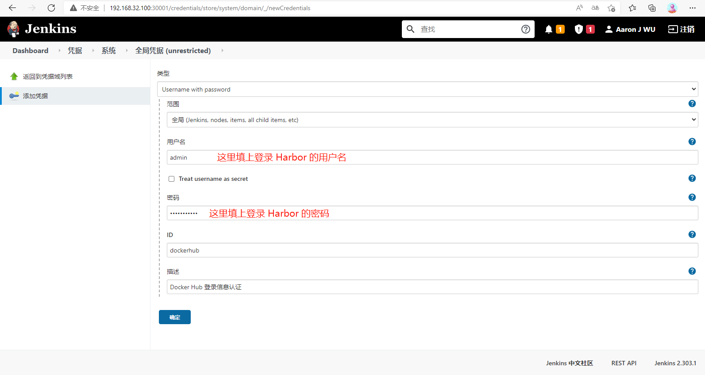
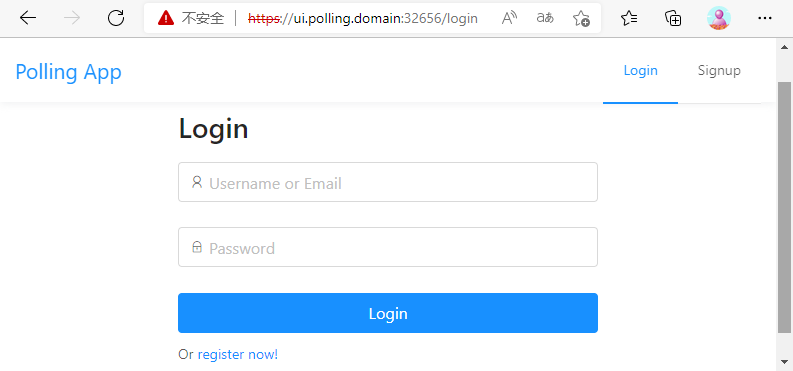
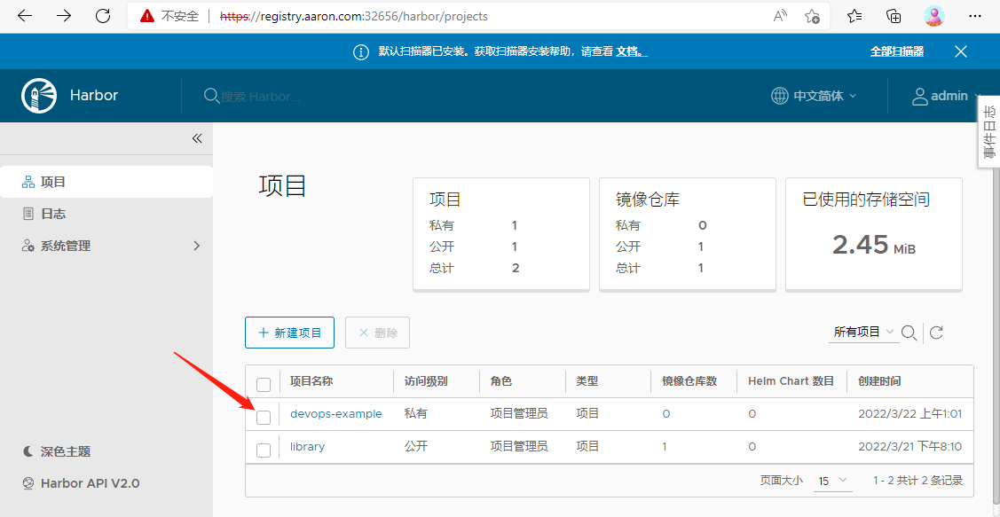
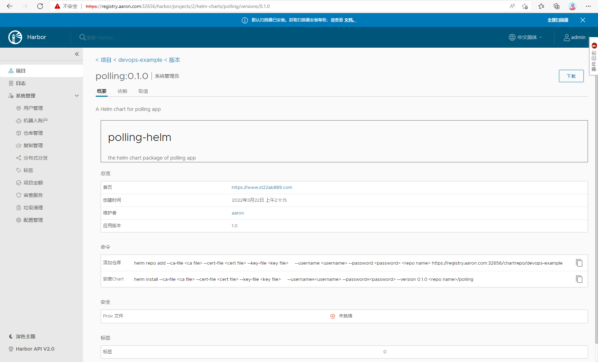
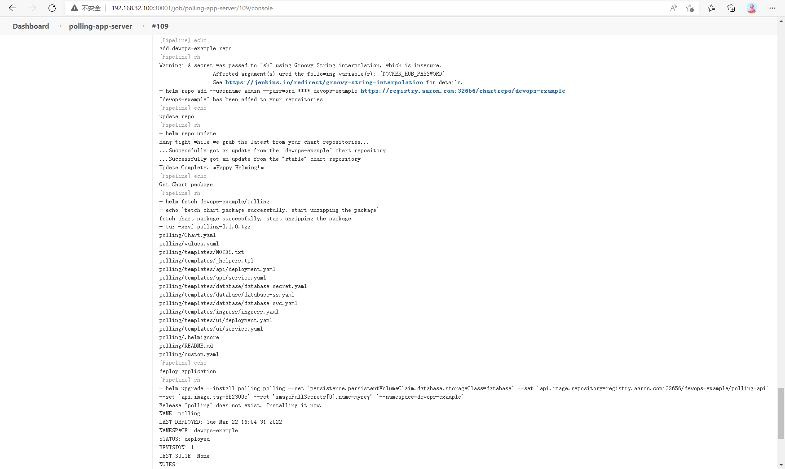
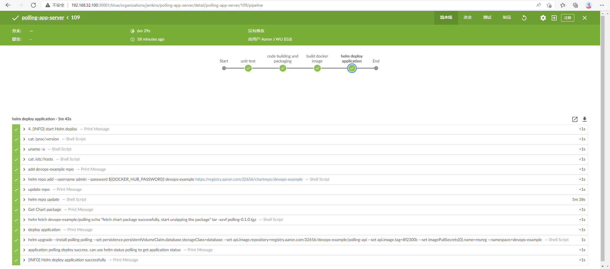

4 Pipeline


第一个阶段：

单元测试，可以在这个阶段运行一些单元测试或者静态代码分析的脚本，这里直接忽略。


第二个阶段：代码编译打包，可以看到是在一个 maven 的容器中执行，所以只需要在该容器中获取到代码，然后在代码目录下面执行 maven 打包命令即可，如下所示：

```javascript
  stage('代码编译打包') {
    try {
      container('maven') {
        echo "2. 代码编译打包阶段"
        sh "mvn clean package -Dmaven.test.skip=true"
      }
    } catch (exc) {
      println "构建失败 - ${currentBuild.fullDisplayName}"
      throw(exc)
    }
  }
```


第三个阶段：构建 Docker 镜像，要构建 Docker 镜像，就需要提供镜像的名称和 tag，要推送到镜像仓库（比如 Docker Hub、 Harbor、或其它仓库），就需要提供登录的用户名和密码，所以这里使用到了 withCredentials 方法，在里面可以提供一个 credentialsId 为 dockerhub 的认证信息，如下：

```javascript
stage('构建 Docker 镜像') {
  withCredentials([[$class: 'UsernamePasswordMultiBinding',
    credentialsId: 'dockerhub',
    usernameVariable: 'DOCKER_HUB_USER',
    passwordVariable: 'DOCKER_HUB_PASSWORD']]) {
      container('docker') {
        echo "3. 构建 Docker 镜像阶段"
        sh """
          docker login ${dockerRegistryUrl} -u ${DOCKER_HUB_USER} -p ${DOCKER_HUB_PASSWORD}
         docker build -t ${image}:${imageTag} .
         docker push ${image}:${imageTag}
         """
      }
  }
}
```

其中 ${image} 和 ${imageTag} 可以在上面定义成全局变量：

```javascript
def imageTag = sh(script: "git rev-parse --short HEAD", returnStdout: true).trim()
def dockerRegistryUrl = "registry.aaron.com"
def imageEndpoint = "course/polling-app-server"
def image = "${dockerRegistryUrl}/${imageEndpoint}"
```


docker 的用户名和密码信息则需要通过凭据来进行添加，进入 jenkins 首页 => 系统管理 => Manage Credentials => 全局 => 添加凭据，选择用户名和密码类型，其中 ID 一定要和上面的 credentialsId 的值保持一致：




第四个阶段：运行 kubectl 工具，其实在当前使用的流水线中用不到 kubectl 工具，这里要使用是因为暂时还没有去写应用的 Helm Chart 包，所以先去用原始的 YAML 文件来编写应用部署的资源清单文件，这也是写出 Chart 包前提，因为只有知道了应用如何部署才可能知道 Chart 包如何编写，所以先编写应用部署的资源清单。首先当然是 Deployment 控制器，如下所示：

```javascript
# k8s.yaml
apiVersion: apps/v1
kind: Deployment
metadata:
  name: polling-server
  namespace: devops-example
  labels:
    app: polling-server
spec:
  strategy:
    rollingUpdate:
      maxSurge: 1
      maxUnavailable: 1
    type: RollingUpdate
  selector:
    matchLabels:
      app: polling-server
  template:
    metadata:
      labels:
        app: polling-server
    spec:
      restartPolicy: Always
      imagePullSecrets:
        - name: myreg
      containers:
      - image: <IMAGE>:<IMAGE_TAG>
        name: polling-server
        imagePullPolicy: IfNotPresent
        ports:
        - containerPort: 8080
          name: api
        env:
        - name: DB_HOST
          value: mysql
        - name: DB_PORT
          value: "3306"
        - name: DB_NAME
          value: polling_app
        - name: DB_USER
          value: polling
        - name: DB_PASSWORD
          value: polling321

---
kind: Service
apiVersion: v1
metadata:
  name: polling-server
  namespace: devops-example
spec:
  selector:
    app: polling-server
  type:  ClusterIP
  ports:
  - name: api-port
    port: 8080
    targetPort: api

---
apiVersion: apps/v1
kind: Deployment
metadata:
  name: mysql
  namespace: devops-example
spec:
  selector:
    matchLabels:
      app: mysql
  template:
    metadata:
      labels:
        app: mysql
    spec:
      restartPolicy: Always
      containers:
      - name: mysql
        image: mysql:5.7
        imagePullPolicy: IfNotPresent
        ports:
        - containerPort: 3306
          name: dbport
        env:
        - name: MYSQL_ROOT_PASSWORD
          value: rootPassW0rd
        - name: MYSQL_DATABASE
          value: polling_app
        - name: MYSQL_USER
          value: polling
        - name: MYSQL_PASSWORD
          value: polling321
        volumeMounts:
        - name: db
          mountPath: /var/lib/mysql
      volumes:
      - name: db
        hostPath:
          path: /var/lib/mysql

---
kind: Service
apiVersion: v1
metadata:
  name: mysql
  namespace: devops-example
spec:
  selector:
    app: mysql
  type:  ClusterIP
  ports:
  - name: dbport
    port: 3306
    targetPort: dbport
```


可以看到上面 YAML 文件中是使用标签 <IMAGE>:<IMAGE_TAG> 代替镜像

名称和TAG，这是因为镜像地址是动态的，每次部署都依赖上一个阶段打包出来的镜像地址，所以这里用标签代替，然后将标签替换成真正的值即可，另外为了保证应用的稳定性，还要在应用中添加健康检查，所以需要在代码中添加一个用于健康检查的 Controller：

```javascript
// src/main/java/com/example/polls/controller/StatusController.java
package com.example.polls.controller;

import org.springframework.web.bind.annotation.*;

@RestController
@RequestMapping("/api/_status/healthz")
public class StatusController {

    @GetMapping
    public String healthCheck() {
        return "UP";
    }

}
```


最后就是环境变量，前面在"src/main/resources/application.properties"资源文件中更改了数据库的配置。因为要尽量通用，在部署应用的时候很有可能已经有一个外部的数据库服务了，所以这个时候通过环境变量传入进来即可。由于这里使用的是私有镜像仓库，那么就需要在集群中提前创建一个对应的 Secret 对象：

```javascript
[root@centos7 harbor]# kubectl create secret docker-registry myreg --docker-server=registry.aaron.com:32656 --docker-username=admin --docker-password=Harbor12345 --docker-email=kkk_en@163.com --namespace devops-example
secret/myreg created
[root@centos7 harbor]# 
```


接下来在代码根目录下面创建一个名为 manifests 的目录，用来存放上面的资源清单文件，正常来说只需要在镜像构建成功后，将上面的 k8s.yaml 文件中的镜像标签替换掉就可以了，所以这一步的动作如下：

```javascript
stage('运行 Kubectl') {
  container('kubectl') {
    echo "查看 K8S 集群 Pod 列表"
    sh "kubectl get pods"
    sh """
      sed -i "s/<IMAGE>/${image}" manifests/k8s.yaml
      sed -i "s/<IMAGE_TAG>/${imageTag}" manifests/k8s.yaml
      kubectl apply -f k8s.yaml
    """
  }
}
```


这里用到了 MySQL 镜像，可以先 pull 到本地：

```javascript
// 在 Node 节点 pull 镜像
[root@centos7 ~]# docker pull mysql:5.7
5.7: Pulling from library/mysql
//......
docker.io/library/mysql:5.7
[root@centos7 ~]# 
```


这里使用了一个名为 devops-example 的命名空间，可以先创建它：

```javascript
# namespace.yaml
---
apiVersion: v1
kind: Namespace
metadata:
  name: devops-example
```


```javascript
[root@centos7 77devops]# kubectl create -f namespace.yaml 
namespace/devops-example created

[root@centos7 77devops]# kubectl get namespace
NAME                   STATUS   AGE
devops-example         Active   10s
kube-ops               Active   177d
kube-system            Active   208d
//......
[root@centos7 77devops]#
```


第五阶段：运行 Helm 工具，就是直接使用 Helm 来部署应用，有了上面的基本资源对象后，要创建 Chart 模板就相对容易了。Chart 模板仓库地址：

- https://gitee.com/st22ab889/polling-helm.git

可以根据 values.yaml 文件来进行自定义安装，模板中定义了可以指定使用外部数据库服务或者内部独立的数据库服务，具体的可以去看模板中的定义。首先可以先使用这个模板在集群中来测试。首先在 Clone 上面的 Chart 模板：

```javascript
$ git clone https://gitee.com/st22ab889/polling-helm.git
```


然后使用内部的数据库服务，新建一个文件来覆盖 values.yaml 文件中的值：

```javascript
# custom.yaml
persistence:
  enabled: true
  persistentVolumeClaim:
    database:
      storageClass: "database"

database:
  type: internal
  internal:
    database: "polling"
    # 数据库用户
    username: "polling"
    # 数据库用户密码
    password: "polling321"
```


可以看到这里使用了一个名为 database 的 StorgeClass 对象，所以还得先创建这个资源对象以及命名空间：

```javascript
# StorageClass.yaml
apiVersion: storage.k8s.io/v1
kind: StorageClass
metadata:
  name: database
provisioner: fuseim.pri/ifs
```


```javascript
[root@centos7 77devops]# kubectl create -f StorageClass.yaml 
storageclass.storage.k8s.io/database created

[root@centos7 77devops]# kubectl get sc
NAME                  PROVISIONER      RECLAIMPOLICY   VOLUMEBINDINGMODE   ALLOWVOLUMEEXPANSION   AGE
database              fuseim.pri/ifs   Delete          Immediate           false                  10s
managed-nfs-storage   fuseim.pri/ifs   Delete          Immediate           false                  178d
[root@centos7 77devops]# 
```


然后就可以在 Chart 根目录下面安装应用，执行下面的命令：

```javascript
// 测试资源清单文件
// helm upgrade --install polling -f custom.yaml . --namespace devops-example --dry-run

// 测试并调试资源清单文件
// helm upgrade --install polling -f custom.yaml . --namespace devops-example --dry-run --debug

[root@centos7 polling-helm]# helm upgrade --install polling -f custom.yaml . --namespace devops-example
Release "polling" does not exist. Installing it now.
NAME: polling
LAST DEPLOYED: Sun Mar 20 06:20:12 2022
NAMESPACE: devops-example
STATUS: deployed
REVISION: 1
TEST SUITE: None
NOTES:
1. Get the application URL by running these commands:
  http://ui.polling.domain
  
[root@centos7 polling-helm]# helm list -n devops-example
NAME   	NAMESPACE     	REVISION	UPDATED                                	STATUS  	CHART        	APP VERSION
polling	devops-example	1       	2022-03-20 06:20:12.085840831 -0400 EDT	deployed、	polling-0.1.0	1.0         

[root@centos7 polling-helm]# kubectl get all -n devops-example
NAME                                      READY   STATUS    RESTARTS   AGE
pod/polling-polling-api-5446887d6-xzhkj   1/1     Running   0          49s
pod/polling-polling-database-0            1/1     Running   0          49s
pod/polling-polling-ui-f6fc5d7f5-ww85v    1/1     Running   0          49s

NAME                               TYPE        CLUSTER-IP       EXTERNAL-IP   PORT(S)    AGE
service/polling-polling-api        ClusterIP   10.107.11.9      <none>        8080/TCP   49s
service/polling-polling-database   ClusterIP   10.110.169.166   <none>        3306/TCP   49s
service/polling-polling-ui         ClusterIP   10.99.239.69     <none>        80/TCP     49s

NAME                                  READY   UP-TO-DATE   AVAILABLE   AGE
deployment.apps/polling-polling-api   1/1     1            1           49s
deployment.apps/polling-polling-ui    1/1     1            1           49s

NAME                                            DESIRED   CURRENT   READY   AGE
replicaset.apps/polling-polling-api-5446887d6   1         1         1       49s
replicaset.apps/polling-polling-ui-f6fc5d7f5    1         1         1       49s

NAME                                        READY   AGE
statefulset.apps/polling-polling-database   1/1     49s
[root@centos7 polling-helm]#   
```


注意这里安装也是使用的 helm upgrade 命令，这样有助于安装和更新的时候命令统一。安装完成后，查看下 Pod 的运行状态：

```javascript
[root@centos7 polling-helm]# kubectl get pod -n devops-example
NAME                                  READY   STATUS    RESTARTS   AGE
polling-polling-api-5446887d6-nbgcc   1/1     Running   0          48s
polling-polling-database-0            1/1     Running   0          48s
polling-polling-ui-f6fc5d7f5-bnslc    1/1     Running   0          48s

[root@centos7 polling-helm]# kubectl get svc
NAME         TYPE        CLUSTER-IP      EXTERNAL-IP   PORT(S)                       AGE
kubernetes   ClusterIP   10.96.0.1       <none>        443/TCP                       208d
traefik      NodePort    10.107.96.121   <none>        80:31549/TCP,8080:31927/TCP   117m
```


然后可以在本地 /etc/hosts 里面加上 http://ui.polling.domain 的映射，这样就可以通过这个域名来访问安装的应用，可以注册、登录、发表投票内容：

```javascript
// 在本地 /etc/hosts 文件加上如下映射；
192.168.32.100	ui.polling.domain

// 在浏览器中访问
主页：https://ui.polling.domain:32656/
登录页面：https://ui.polling.domain:32656/login

// 当浏览器出现下面页面,说明使用 helm 部署应用成功
// 删除当前手工部署的 helm 应用, 为下面流水线自动部署应用做准备
[root@centos7 77devops]# helm list -n devops-example
NAME   	NAMESPACE     	REVISION	UPDATED                                	STATUS  	CHART        	APP VERSION
polling	devops-example	1       	2022-03-22 14:05:46.163517854 +0000 UTC	deployed	polling-0.1.0	1.0        

[root@centos7 77devops]# helm delete polling -n devops-example
release "polling" uninstalled
```




5 把 Chart 包 push 到 Harbor 


准备 traefik 和 Harbor ：

```javascript
1. 部署 traefik, 资源文件路径为：39traefik 的安装使用/traefik-https-HttpRedirection
2. 部署 Harbor， 安装使用参见"72Harbor 的安装使用"
   特别注意: 在部署 Harbor 前,先查看 traefik service 的 NodePort
    [root@centos7 etc]# kubectl get svc | grep traefik
    traefik      NodePort    10.101.179.163   <none>        443:32656/TCP,80:30885/TCP   30h
    // 32656 是 traefik 监听的 WEBSECURE 请求端口, 30885 则是监听的 WEB 端口
    // 修改"72Harbor 的安装使用\harbor-helm-1.8.1\values-https.yaml"
    //    将 externalURL 后面的端口改为 32656
    // 在使用 helm 部署时使用 values-https.yaml 这个配置文件

3. 在本例中, traefik 和 Harbor 访问如下：
   traefik UI：https://traefik.aaron.com:32656/dashboard/  
       以下两个账号都可以登录到 traefik 主页
           用户名：test， 密码：test 
           用户名：test2，密码 test2
   Harbor UI：https://registry.aaron.com:32656
       用户名：admin
       密 码：Harbor12345
         
```


这样就完成了使用 Helm Chart 安装应用，但是现在使用的包还在 Git 仓库中，平常正常安装都是使用 Chart 仓库中的包，所以需要将该 Chart 包上传到一个仓库中去，比如 Harbor 就支持 Helm Chart 包。可以选择手动通过 Harbor 的 Dashboard 将 Chart 包进行上传，也可以通过使用 Helm Push 插件，这里使用 Helm Push插件：

```javascript
// push 插件支持 Harbor(Harbor里面其实就是集成了ChartMuseum)、ChartMuseum
// Helm Push插件地址：https://github.com/chartmuseum/helm-push

// 安装
[root@centos7 77devops]# helm plugin install https://github.com/chartmuseum/helm-push
Downloading and installing helm-push v0.10.2 ...
https://github.com/chartmuseum/helm-push/releases/download/v0.10.2/helm-push_0.10.2_linux_amd64.tar.gz
Installed plugin: cm-push

// 如果要卸载
//  [root@centos7 77devops]# helm plugin uninstall cm-push

// 使用"helm env"可以查看 helm 的环境变量,包括插件放置的位置
[root@centos7 77devops]# helm env
HELM_BIN="helm"
//......
HELM_PLUGINS="/root/.local/share/helm/plugins"
HELM_REGISTRY_CONFIG="/root/.config/helm/registry.json"
HELM_REPOSITORY_CACHE="/root/.cache/helm/repository"
HELM_REPOSITORY_CONFIG="/root/.config/helm/repositories.yaml"
//......
```


在 Harbor 上新建一个名为 devops-example 的私有项目：




首先将 Harbor 提供的仓库添加到 helm repo 中，由于是私有仓库，所以在添加的时候需要添加用户名和密码：

```javascript
[root@centos7 77devops]# helm repo add devops-example https://registry.aaron.com:32656/chartrepo/devops-example --username=admin --password=Harbor12345
Error: looks like "https://registry.aaron.com:32656/chartrepo/devops-example" is not a valid chart repository or cannot be reached: Get "https://registry.aaron.com:32656/chartrepo/devops-example/index.yaml": x509: certificate signed by unknown authority
[root@centos7 77devops]#
```

上面 repo 地址是 <Harbor URL>/chartrepo/<Harbor中项目名称>，Harbor 中每个项目是分开的 repo，如果不提供项目名称, 则默认使用 library 这个项目。如果本地搭建的 Harbor 采用的是自建 https 证书，这里就需要提供 ca 证书和私钥文件，否则会出现"x509: certificate signed by unknown authority"这样的证书校验失败错误，但是可以通过 cert-manager 为 Harbor 提供一个信任的 https 证书，这样就不需要指定 ca 证书相关参数。还可以使用下面两种方法:

```javascript
[root@centos7 77devops]# kubectl get secret -n kube-ops | grep harbor-ingress
harbor-ingress                 kubernetes.io/tls                     3      5h2m

// 获取 Harbor 的证书(公钥)，这里获取到的证书是 ca 证书
[root@centos7 77devops]# kubectl get secret harbor-ingress -n kube-ops -o  jsonpath="{.data.ca\.crt}" | base64 --decode
-----BEGIN CERTIFICATE-----
MIIDFDCCAfygAwIBAgIRAPce0w+SbZBv4t91CXBh2E8wDQYJKoZIhvcNAQELBQAw
//......
xJXMxYp8gPkxv8UgHAeOqzeqhrCZnlRT
-----END CERTIFICATE-----

// 第一种方法
// 把上面个的证书追加到 tls-ca-bundle.pem,这样 Harbor 的证书就受信任了
// 追加后保存使用"wq!",因为 tls-ca-bundle.pem 是个只读文件
[root@centos7 77devops]# vi /etc/pki/ca-trust/extracted/pem/tls-ca-bundle.pem
	//......
	# harbor ca.crt
	-----BEGIN CERTIFICATE-----
	MIIDFDCCAfygAwIBAgIRAPce0w+SbZBv4t91CXBh2E8wDQYJKoZIhvcNAQELBQAw
	//......
	xJXMxYp8gPkxv8UgHAeOqzeqhrCZnlRT
	-----END CERTIFICATE-----

// 第二种方法,参考: https://helm.sh/docs/helm/helm_repo_add/
// 指定 ca 证书参数
// 把上面的证书保存为一个文件,比如保存为 ca.crt 文件,放置目录为 /k8s-yaml/harbor/ca.crt
// helm repo add --username=admin --password=Harbor12345 --ca-file=/k8s-yaml/harbor/ca.crt devops-example https://registry.aaron.com:32656/chartrepo/devops-example

[root@centos7 77devops]# helm repo add devops-example https://registry.aaron.com:32656/chartrepo/devops-example --username=admin --password=Harbor12345
"devops-example" has been added to your repositories
[root@centos7 77devops]# 
```


然后将上面的 polling-helm 这个 Chart 包上传到 Harbor 仓库中去：

```javascript
// helm 自带的 push 命令不能用在这个地方, 这里要用 helm push 插件
// helm push 插件文档：https://github.com/chartmuseum/helm-push
// 使用 helm push 插件上传有两种方式：

// 第一种方式: 上传 chart 包(文件夹), 如果不指定版本,则读取 [chart包]/Chart.yaml 文件中的 version
helm cm-push polling-helm/ --version="0.1.0" devops-example
helm cm-push polling-helm  devops-example

// 第二种方式: 上传 .tgz 包(先打包再上传)
helm package polling-helm
ls | grep tgz
helm cm-push [name.tgz] devops-example

// 这里使用第一种方式
[root@centos7 77devops]# helm cm-push polling-helm  devops-example
Pushing polling-0.1.0.tgz to devops-example...
Done.
[root@centos7 77devops]#
```


然后到 Harbor 仓库，查看 devops-example 这个项目下面的 Helm Charts 就可以发现多了一个 polling 的应用：



在上图下方可以看到有添加仓库和安装 Chart 的相关命令。


6 CICD/Pipeline


准备工作：

```javascript
因为 helm 容器要运行如下命令, 要处理域名问题以及证书问题 
helm repo add --username ${args.username} --password ${args.password} devops-example https://registry.aaron.com:32656/chartrepo/devops-example

1.因为 registry.aaron.com 这个域名不是域名,所以需要更改 hosts 文件
  方法一: 挂载主机上的一个 hosts 文件
    比如主机上有个如下内容的 hosts 文件,路径为: /etc/host/hosts
	   127.0.0.1   localhost localhost.localdomain localhost4 localhost4.localdomain4
	   ::1         localhost localhost.localdomain localhost6 localhost6.localdomain6
	   192.168.32.101 notary.aaron.com registry.aaron.com
    在 Jenkinsfile 中将这个文件挂载进容器,如下：
      volumes: [
      //......
      hostPathVolume(mountPath: '/etc/hosts', hostPath: '/etc/host/hosts')
      ]
    这个方法缺点是每个节点都要准备这样一个 hosts 文件
  方法二: 动态修改容器的 hosts, 暂未找到方法实现
  
2. "helm repo add"这个命令会校验证书, 因为这里 Harbor 是本地搭建的,解决方式如下:
  // 获取 Harbor 的证书(公钥)，这里获取到的证书是 ca 证书
  [root@centos7 ~]]# kubectl get secret harbor-ingress -n kube-ops -o  jsonpath="{.data.ca\.crt}" | base64 --decode
  -----BEGIN CERTIFICATE-----
  MIIDFDCCAfygAwIBAgIRAPce0w+SbZBv4t91CXBh2E8wDQYJKoZIhvcNAQELBQAw
  //......
  xJXMxYp8gPkxv8UgHAeOqzeqhrCZnlRT
  -----END CERTIFICATE----- 
  方法一:
    // 把上面个的证书追加到 tls-ca-bundle.pem
    // 追加后保存使用"wq!",因为 tls-ca-bundle.pem 是个只读文件
    [root@centos7 ~]# vi /etc/pki/ca-trust/extracted/pem/tls-ca-bundle.pem
	 //......
	 # harbor ca.crt
	 -----BEGIN CERTIFICATE-----
	 MIIDFDCCAfygAwIBAgIRAPce0w+SbZBv4t91CXBh2E8wDQYJKoZIhvcNAQELBQAw
	 //......
	 xJXMxYp8gPkxv8UgHAeOqzeqhrCZnlRT
	 -----END CERTIFICATE-----
    
    然后把主机的 "/etc/pki" 挂载到容器的 "/etc/pki",如下:                  
      volumes: [
      //......
      hostPathVolume(mountPath: '/etc/pki', hostPath: '/etc/pki')
      ]
    这样 Harbor 的证书就受信任了.
    
  方法二: 
    将获取到的 Harbor 证书(ca 证书)保存为一个文件,假如路径为: /k8s-yaml/helm/ca.crt
    将这个文件挂载到容器中如下:
      volumes: [
      //......
      hostPathVolume(mountPath: '/k8s-yaml/helm/ca.crt', hostPath: '/k8s-yaml/helm/ca.crt')
      ]
    在"helm repo add"这个命令中使用"--ca-file"这个参数指定 CA 证书,如下:
      helm repo add --username=admin --password=Harbor12345 --ca-file=/k8s-yaml/harbor/ca.crt devops-example https://registry.aaron.com:32656/chartrepo/devops-example
  
  方法三: 
    创建容器时或容器创建后使用这个CA证书在容器中动态生成一个证书文件, 然后通过"--ca-file"这个参数指定      
  
  方法四: 
    通过 cert-manager 为 Harbor 提供一个信任的 https 证书，这样就不需要指定 ca 证书相关参数
 
  总结:
    方法一的缺点是每个节点都要去修改 tls-ca-bundle.pem 这个文件.
    方法二的缺点是每个节点都要去制作这样一个证书文件.
    方法三暂未找到方法实现,缺点是必须要首先获取到这个证书.
    方法四是推荐方式.
 这里采用方法一实现.
 
3.本次是对 polling 服务端进行自动构建(CI/CD), 编译好的服务端镜像使用 Harbor 作为镜像仓库.
  为了方便示例和区分,客户端的镜像提前准备,放置在 Docker Hub,如下:
  https://hub.docker.com/repository/docker/st22ab889/polling-ui
```


到这里 Helm 相关的工作已经准备好。接下来就是在 Jenkins Pipeline 中去使用 Helm，首先回顾下平时的一个 CI/CD 的流程：

- 开发代码 

- 提交代码

- 触发镜像构建 

- 修改镜像tag

- 推送到镜像仓库中去

- 然后更改 YAML 文件镜像版本

- 使用 kubectl 工具更新应用

现在可以直接在 Jenkins Pipeline 中使用 Helm，而不需要手动更改 YAML 文件，也不需要使用 kubectl 工具更新应用，只需要覆盖 helm 中的镜像版本，直接 upgrade 就可以达到应用更新的结果。可以看到 chart 包中 values.yaml 文件中关于 api 服务的定义：

```javascript
# values.yaml
//......
api:
  image:
    repository: st22ab889/polling-api
    tag: test
    pullPolicy: IfNotPresent
//......
```


只需要将上面关于 api 服务使用的镜像用这里 Jenkins 构建后的替换掉就可以了，可以将需要更改的值都放入到一个 YAML 文件中来进行修改，但是这里通过 --set 来覆盖对应的值，上面最后运行的Helm 阶段更改后如下：

```javascript
stage('运行 Helm') {
  container('helm') {
    echo "更新 polling 应用"
    sh """
      helm upgrade --install polling polling --set persistence.persistentVolumeClaim.database.storageClass=database --set database.type=internal --set database.internal.database=polling --set database.internal.username=polling --set database.internal.password=polling321 --set api.image.repository=${image} --set api.image.tag=${imageTag} --set imagePullSecrets[0].name=myreg --namespace course
    """
  }
}
```


这样整个 API 服务的完整 Jenkinsfile 文件(经过整理后)如下所示：

```javascript
# Jenkinsfile
def label = "slave-${UUID.randomUUID().toString()}"

def helmRepo(Map args) {

  sh "cat /proc/version"
  sh "uname -a"
  sh "cat /etc/hosts"

  println "add devops-example repo"
  sh "helm repo add --username ${args.username} --password ${args.password} devops-example https://registry.aaron.com:32656/chartrepo/devops-example"

  println "update repo"
  sh "helm repo update"

  println "Get Chart package"
  sh """
    helm fetch devops-example/polling
    echo "fetch chart package successfully, start unzipping the package"
    tar -xzvf polling-0.1.0.tgz
    """
}

def helmDeploy(Map args) {

    helmRepo(args)

    if (args.dry_run) {
        println "Debug application"
        sh "helm upgrade --dry-run --debug --install ${args.name} ${args.chartDir} --set persistence.persistentVolumeClaim.database.storageClass=database --set api.image.repository=${args.image} --set api.image.tag=${args.tag} --set imagePullSecrets[0].name=myreg --namespace=${args.namespace}"
    } else {
        println "deploy application"
        sh "helm upgrade --install ${args.name} ${args.chartDir} --set persistence.persistentVolumeClaim.database.storageClass=database --set api.image.repository=${args.image} --set api.image.tag=${args.tag} --set imagePullSecrets[0].name=myreg --namespace=${args.namespace}"
        echo "application ${args.name}  deploy success. can use helm status ${args.name} to get application status"
    }
}

podTemplate(label: label, serviceAccount: 'jenkins', containers: [
  containerTemplate(name: 'maven', image: 'maven:3.6-alpine', command: 'cat', ttyEnabled: true),
  containerTemplate(name: 'docker', image: 'docker', command: 'cat', ttyEnabled: true),
  containerTemplate(name: 'helm', image: 'st22ab889/helm-kubectl:3.7.1', command: 'cat', ttyEnabled: true)
], volumes: [
  hostPathVolume(mountPath: '/root/.m2', hostPath: '/var/run/m2'),
  hostPathVolume(mountPath: '/home/jenkins/.kube', hostPath: '/root/.kube'),
  hostPathVolume(mountPath: '/var/run/docker.sock', hostPath: '/var/run/docker.sock'),
  hostPathVolume(mountPath: '/etc/hosts', hostPath: '/etc/host/hosts'),
  hostPathVolume(mountPath: '/etc/pki', hostPath: '/etc/pki')
]) {
  node(label) {
    def myRepo = checkout scm
    def gitCommit = myRepo.GIT_COMMIT
    def gitBranch = myRepo.GIT_BRANCH
    def imageTag = sh(script: "git rev-parse --short HEAD", returnStdout: true).trim()
    def dockerRegistryUrl = "registry.aaron.com:32656"
    def imageEndpoint = "devops-example/polling-api"
    def image = "${dockerRegistryUrl}/${imageEndpoint}"

    stage('unit test') {
      echo "1. test stage"
    }
    stage('code building and packaging') {
      try {
        container('maven') {
          echo "2. Code building and packaging stage"
          sh "mvn clean package -Dmaven.test.skip=true"
        }
      } catch (exc) {
        println "build failure - ${currentBuild.fullDisplayName}"
        throw(exc)
      }
    }
    stage('build docker image') {
      withCredentials([[$class: 'UsernamePasswordMultiBinding',
        credentialsId: 'dockerhub',
        usernameVariable: 'DOCKER_HUB_USER',
        passwordVariable: 'DOCKER_HUB_PASSWORD']]) {
          container('docker') {
            echo "3. build Docker image stage"
            sh """
              docker login ${dockerRegistryUrl} -u ${DOCKER_HUB_USER} -p ${DOCKER_HUB_PASSWORD}
              docker build -t ${image}:${imageTag} .
              docker push ${image}:${imageTag}
              """
          }
      }
    }
    stage('helm deploy application') {
      withCredentials([[$class: 'UsernamePasswordMultiBinding',
        credentialsId: 'dockerhub',
        usernameVariable: 'DOCKER_HUB_USER',
        passwordVariable: 'DOCKER_HUB_PASSWORD']]) {
          container('helm') {
            // todo 可以做分支判断
            echo "4. [INFO] start Helm deploy"
            helmDeploy(
                dry_run     : false,
                name        : "polling",
                chartDir    : "polling",
                namespace   : "devops-example",
                tag         : "${imageTag}",
                image       : "${image}",
                username    : "${DOCKER_HUB_USER}",
                password    : "${DOCKER_HUB_PASSWORD}"
            )
            echo "[INFO] Helm deploy application successfully"
          }
      }
    }
  }
}
```

由于没有将 chart 包放入到 API 服务的代码仓库中，这是因为这里使用的 chart 包涉及到两个应用，一个 API 服务，一个是前端展示的服务，所以这里是通过脚本里面去主动获取到 chart 包来进行安装，如果 chart 包跟随代码仓库一起管理当然就要简单许多。


现在更新 Jenkinsfile 文件，然后提交到 gitlab 中，手动触发自动构建，再然后去观察 Jenkins 中的构建是否成功，重点观察 Helm 阶段：




当然还可以去做一些必要的判断工作，比如根据分支判断是否需要自动部署等等，同样也可以切换到 Blue Occean 界面查看构建结果。




现在可以尝试去修改下代码，然后提交代码到 gitlab 上，观察下 Jenkins 是否能够自动完成整个 CI/CD 的过程。


```javascript
本节用到的资源如下:
	Git 仓库使用 Gitee.
	polling服务端:https://gitee.com/st22ab889/polling-app-server.git
	Helm Chart：https://gitee.com/st22ab889/polling-helm.git
	Helm Chart 和 polling 服务端镜像使用本地搭建的 Harbor 仓库.
	polling 客户端镜像使用 docker hub: https://hub.docker.com/repository/docker/st22ab889/polling-ui
	maven镜像: 使用 maven 官方 docker 镜像.
	dind(docker in docker): 使用官方 docker 镜像.
	helm镜像: https://hub.docker.com/r/st22ab889/helm-kubectl
```


作业：

剩下的前端展示项目（https://gitee.com/st22ab889/polling-app-client.git）使用上面的 GitLab + Jenkins + Harbor + Helm 来完成一个 Jenkins Pipeline 流水线的编写，然后尝试修改前端页面内容，看是否能够生效。


7 总结

```javascript
Jenkinsfile的podTemplate相关文档(重要)：
https://www.jenkins.io/doc/pipeline/steps/kubernetes/#podtemplate-define-a-podtemplate-to-use-in-the-kubernetes-plugin
https://plugins.jenkins.io/kubernetes/#plugin-content-container-template
```


```javascript
Helm插件指南相关文档：

Helm插件指南：
https://zhuanlan.zhihu.com/p/36310109?from_voters_page=true

helm 安装：
https://blog.csdn.net/weixin_50254029/article/details/117963277

helm离线安装helm-push插件：
https://blog.csdn.net/qq_36885458/article/details/121692837

helm使用自定义values文件安装命令示例:
helm upgrade --install harbor ./harbor-helm-1.8.1/ -f ./harbor-helm-1.8.1/values-https.yaml --namespace kube-ops
```


```javascript
Docker 和 Kubernetes 相关：

Kubernetes v1.7新特性解析-自定义Hosts
https://zhuanlan.zhihu.com/p/27699912

Docker容器如何修改hosts
http://t.zoukankan.com/mrnx2004-p-11767354.html

docker批量删除容器、镜像
docker rm `docker ps -a -q`    // 删除所有容器
docker rmi `docker images -q`  // 删除所有镜像
 //按条件删除镜像,其中doss-api为关键字
docker rmi --force `docker images | grep doss-api | awk '{print $3}'` 

删除tag为<none>的镜像(镜像没有打标签)
docker images | grep none | awk '{print $3}' | xargs docker rmi
docker rmi `docker images -q | awk '/^<none>/ { print $3 }'`

docker删除名称none镜像的命令,加上 -f 就是强制删除
docker rmi -f $(docker images -f "dangling=true" -q)
```


```javascript
linux 相关：

linux里的vi怎么移动到最后一行
https://www.cnblogs.com/pinganzi/p/4976878.html

linux查看内核版本、系统版本、系统位数（32or64）
https://blog.51cto.com/nameyjj/557424
```


```javascript
harbor相关：

harbor证书x509: certificate signed by unknown authority
https://www.cnblogs.com/wangxu01/articles/11737000.html

使用私有镜像仓库命令:
docker login registry.aaron.com:32656
docker tag traefik/whoami:latest registry.aaron.com:32656/devops-example/whoami:latest
docker push registry.aaron.com:32656/devops-example/whoami:latest
docker pull registry.aaron.com:32656/devops-example/whoami:latest
```

