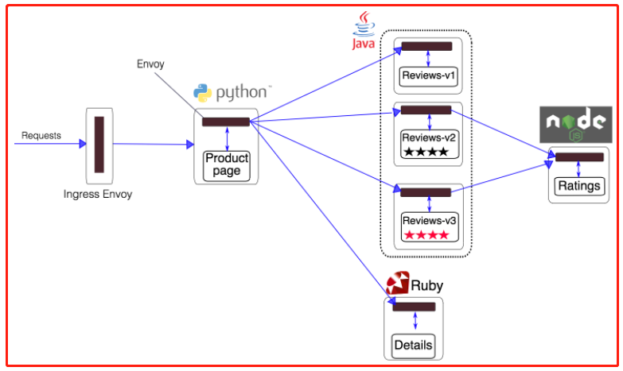
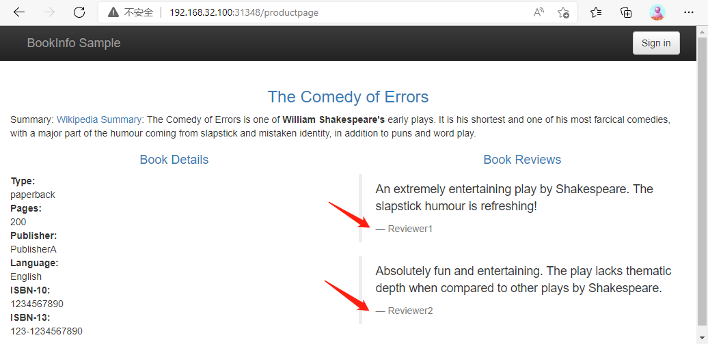
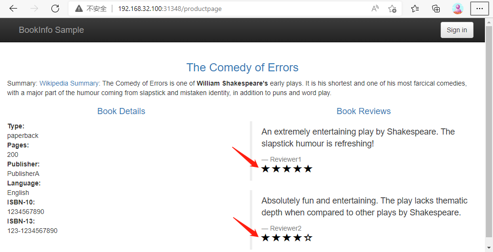
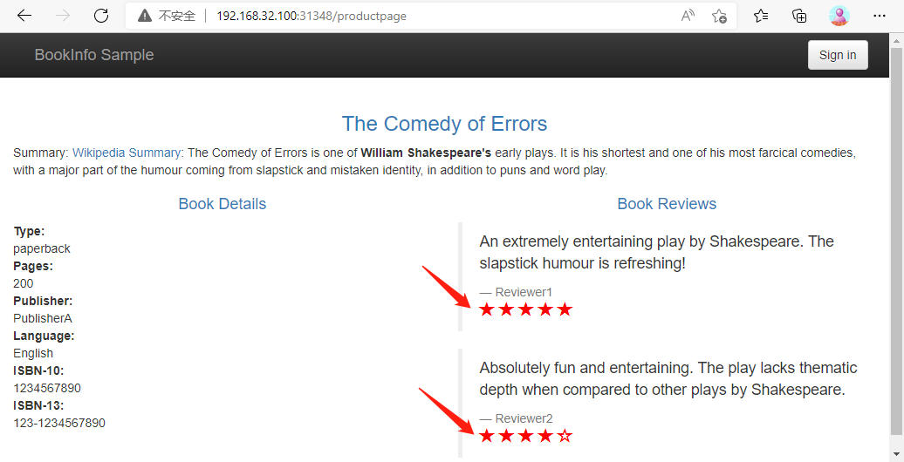

1. Istio: https://istio.io/


微服务存在服务发现、负载均衡、Trace跟踪、流量管理、安全认证等等问题，对于 Java 领域来说还有 Spring Cloud 这种完整的微服务框架，但是也仅仅局限于 Java 语言。当然随着微服务的不断发展，微服务的生态也不断完善，新一代的微服务开发悄然兴起，那就是 Service Mesh（服务网格）。

而 istio 是现在最热门的 Service Mesh 工具，istio 是由 Google、IBM、Lyft 等共同开源的 Service Mesh (服务网格) 框架，于2017年初开始进入大众视野。Kubernetes 解决了云原生应用的部署问题，istio 解决的是应用的服务（流量）治理问题。1.6版本已经将之前的架构改成了单体应用，性能也已经大幅度提升，所以完全有必要去了解 istio，因为这就是微服务领域的下一个标准。


2. 安装 istio

官方文档:

- https://istio.io/latest/docs/setup/getting-started/#download

- https://istio.io/latest/docs/setup/getting-started/#install


步骤1： 下载安装包

可以使用命令，也可以在 GitHub 手动下载安装包，这里使用手动方式：

```javascript
// 从以下地址下载安装包
https://github.com/istio/istio/releases/tag/1.13.2

[root@centos7 istio]# ls
istio-1.13.2-linux-amd64.tar.gz

[root@centos7 istio]# tar -xzf istio-1.13.2-linux-amd64.tar.gz 

[root@centos7 istio]# ls
istio-1.13.2  istio-1.13.2-linux-amd64.tar.gz

```


步骤2： 安装 istioctl

```javascript
// 把 istioctl 设置为全局命令  
[root@centos7 istio]# cp istio-1.13.2/bin/istioctl /usr/local/bin/
// 也可以使用下面的命令(注意:要 cd 到 istio-1.13.2 这个目录 )
// export PATH=$PWD/bin:$PATH

// 可以进入到 istio 解压的目录查看有哪些文件
[root@centos7 istio]# cd istio-1.13.2 && ls -la 
total 28
drwxr-x---.  6 root root   115 Mar  8 16:41 .
drwxr-xr-x.  3 root root    65 Mar 24 06:24 ..
drwxr-x---.  2 root root    22 Mar  8 16:41 bin
-rw-r--r--.  1 root root 11348 Mar  8 16:41 LICENSE
drwxr-xr-x.  5 root root    52 Mar  8 16:41 manifests
-rw-r-----.  1 root root   880 Mar  8 16:41 manifest.yaml
-rw-r--r--.  1 root root  5866 Mar  8 16:41 README.md
drwxr-xr-x. 23 root root  4096 Mar  8 16:41 samples
drwxr-xr-x.  3 root root    57 Mar  8 16:41 tools

```


步骤3： 安装 istio

```javascript
// 安装 istio,如果出现了错误可以重新执行一次
[root@centos7 istio-1.13.2]# istioctl install --set profile=demo -y
✔ Istio core installed                                                                                                                                            
✔ Istiod installed                                                                                                                                                
✔ Egress gateways installed                                                                                                                                       
✔ Ingress gateways installed                                                                                                                                      
✔ Installation complete                                                                                                                                           Making this installation the default for injection and validation.

Thank you for installing Istio 1.13.  Please take a few minutes to tell us about your install/upgrade experience!  https://forms.gle/pzWZpAvMVBecaQ9h9

// 也可以用下面的命令安装,"istioctl manifest ..."表示生成并区分 Istio 清单
// istioctl manifest apply --set profile=demo

// 安装完成后查看 istio-system 命名空间下面的 Pod 运行状态,如果都是 Running 状态证明 istio 安装成功
[root@centos7 istio-1.13.2]# kubectl -n istio-system get pod
NAME                                    READY   STATUS    RESTARTS   AGE
istio-egressgateway-66fdd867f4-7b8nk    1/1     Running   0          5m3s
istio-ingressgateway-77968dbd74-9jl5g   1/1     Running   0          5m3s
istiod-699b647f8b-5tv24                 1/1     Running   0          5m8s
[root@centos7 istio-1.13.2]# 

// 重要: 添加命名空间标签以指示 Istio 在稍后部署应用程序时自动注入 Envoy sidecar 代理 
[root@centos7 istio-1.13.2]# kubectl label namespace default istio-injection=enabled
namespace/default labeled
```


3. 示例安装

安装官方提供的一个非常经典的 Bookinfo 应用示例，这个示例部署了一个用于演示多种 Istio 特性的应用，该应用由四个单独的微服务构成。 这个应用模仿在线书店的一个分类，显示一本书的信息。页面上会显示一本书的描述，书籍的细节（ISBN、页数等），以及关于这本书的一些评论。Bookinfo 应用分为四个单独的微服务：

- productpage：这个微服务会调用 details 和 reviews 两个微服务，用来生成页面。

- details：这个微服务中包含了书籍的信息。

- reviews：这个微服务中包含了书籍相关的评论，它还会调用 ratings 微服务。

- ratings：这个微服务中包含了由书籍评价组成的评级信息。


reviews 微服务有 3 个版本：

- v1 版本不会调用 ratings 服务。

- v2 版本会调用 ratings 服务，并使用 1 到 5 个黑色星形图标来显示评分信息。

- v3 版本会调用 ratings 服务，并使用 1 到 5 个红色星形图标来显示评分信息。



上图展示了使用 istio 后，整个应用实际的结构。所有的微服务都和一个 Envoy sidecar 封装到一起，sidecar 拦截所有到达和离开服务的请求。


步骤一：提前准备示例中用到的镜像

```javascript
docker pull docker.io/istio/examples-bookinfo-productpage-v1:1.16.2
docker pull docker.io/istio/examples-bookinfo-details-v1:1.16.2
docker pull docker.io/istio/examples-bookinfo-ratings-v1:1.16.2
docker pull docker.io/istio/examples-bookinfo-reviews-v1:1.16.2
docker pull docker.io/istio/examples-bookinfo-reviews-v2:1.16.2
docker pull docker.io/istio/examples-bookinfo-reviews-v3:1.16.2
```


步骤二：安装示例

```javascript
// 进入解压的 istio 目录，执行如下命令：
[root@centos7 istio-1.13.2]# kubectl apply -f samples/bookinfo/platform/kube/bookinfo.yaml
service/details created
serviceaccount/bookinfo-details created
deployment.apps/details-v1 created
service/ratings created
serviceaccount/bookinfo-ratings created
deployment.apps/ratings-v1 created
service/reviews created
serviceaccount/bookinfo-reviews created
deployment.apps/reviews-v1 created
deployment.apps/reviews-v2 created
deployment.apps/reviews-v3 created
service/productpage created
serviceaccount/bookinfo-productpage created
deployment.apps/productpage-v1 created

// 如果没有给命名空间添加 istio-injection=enabled 标签,使用下面的命令也可以自动注入 Envoy sidecar 代理 
// kubectl apply -f <(istioctl kube-inject -f samples/bookinfo/platform/kube/bookinfo.yaml)
// istioctl kube-inject 命令说明如下:
// 部署的 bookinfo.yaml 资源清单文件就是普通的 k8s 的 Deployment 和 Service 的 yaml 文件,
// 而 istioctl kube-inject 会在这个文件的基础上向其中的 Deployment 追加一个镜像为 docker.io/istio/proxyv2:1.13.2 的 sidecar 容器。


// 过一会儿就可以看到如下 service 和 pod 启动:
[root@centos7 istio]# kubectl get pod
NAME                                      READY   STATUS    RESTARTS      AGE
details-v1-79f774bdb9-xvrpc               2/2     Running   2 (88m ago)   3h28m
productpage-v1-6b746f74dc-btfs6           2/2     Running   2 (88m ago)   3h28m
ratings-v1-b6994bb9-jcxzc                 2/2     Running   2 (88m ago)   3h28m
reviews-v1-545db77b95-rlktj               2/2     Running   2 (88m ago)   171m
reviews-v2-7bf8c9648f-r4qgf               2/2     Running   2 (88m ago)   3h28m
reviews-v3-84779c7bbc-f2nn5               2/2     Running   2 (88m ago)   3h28m

[root@centos7 istio]# kubectl get svc
NAME          TYPE        CLUSTER-IP       EXTERNAL-IP   PORT(S)    AGE
details       ClusterIP   10.108.4.200     <none>        9080/TCP   3h28m
kubernetes    ClusterIP   10.96.0.1        <none>        443/TCP    213d
productpage   ClusterIP   10.100.55.60     <none>        9080/TCP   3h28m
ratings       ClusterIP   10.107.191.59    <none>        9080/TCP   3h28m
reviews       ClusterIP   10.111.233.146   <none>        9080/TCP   3h28m

// 验证应用程序是否在集群内运行正常,如果正常会返回 HTML 页面代码 
[root@centos7 istio-1.13.2]#  kubectl exec "$(kubectl get pod -l app=ratings -o jsonpath='{.items[0].metadata.name}')" -c ratings -- curl -sS productpage:9080/productpage | grep -o "<title>.*</title>"
<title>Simple Bookstore App</title>                
```


步骤三：添加 istio gateway

现在应用的服务都部署成功并启动，如果需要在集群外部访问，就需要添加一个 istio gateway。gateway 相当于 k8s 的 ingress controller 和 ingress。它为 HTTP/TCP 流量配置负载均衡，通常在服务网格边缘作为应用的 ingress 流量管理。

```javascript
// 创建一个 gateway
[root@centos7 istio-1.13.2]# kubectl apply -f samples/bookinfo/networking/bookinfo-gateway.yaml
gateway.networking.istio.io/bookinfo-gateway created
virtualservice.networking.istio.io/bookinfo created

// 验证 gateway 是否启动成功:
 [root@centos7 istio-1.13.2]# kubectl get gateway
NAME               AGE
bookinfo-gateway   2m29 

// Ensure that there are no issues with the configuration
[root@centos7 istio-1.13.2]# istioctl analyze
✔ No validation issues found when analyzing namespace: default.    
```


步骤四：

这里要想访问这个应用，那就需要更改下 istio 提供的 istio-ingressgateway 这个 Service 对象，默认是 LoadBalancer 类型的服务，LoadBalancer 类型的服务实际上是用来对接云服务厂商，如果没有对接云服务厂商，可以将这里类型改成 NodePort，但是这样当访问服务的时候就需要加上 nodePort 端口。

```javascript
[root@centos7 istio-1.13.2]# kubectl get svc -n istio-system
NAME                   TYPE           CLUSTER-IP      EXTERNAL-IP   PORT(S)                                                                      AGE
istio-egressgateway    ClusterIP      10.111.78.176   <none>        80/TCP,443/TCP                                                               150m
istio-ingressgateway   LoadBalancer   10.104.91.142   <pending>     15021:31739/TCP,80:31348/TCP,443:32375/TCP,31400:31775/TCP,15443:31305/TCP   150m
istiod                 ClusterIP      10.106.182.32   <none>        15010/TCP,15012/TCP,443/TCP,15014/TCP 

[root@centos7 istio-1.13.2]# kubectl edit svc istio-ingressgateway -n istio-system
	......
	type: NodePort  # 修改成 NodePort 类型
	status:
	  loadBalancer: {}
	......
service/istio-ingressgateway edited

[root@centos7 istio-1.13.2]# kubectl get svc -n istio-system
NAME                   TYPE        CLUSTER-IP      EXTERNAL-IP   PORT(S)                                                                      AGE
istio-egressgateway    ClusterIP   10.111.78.176   <none>        80/TCP,443/TCP                                                               153m
istio-ingressgateway   NodePort    10.104.91.142   <none>        15021:31739/TCP,80:31348/TCP,443:32375/TCP,31400:31775/TCP,15443:31305/TCP   153m
istiod                 ClusterIP   10.106.182.32   <none>        15010/TCP,15012/TCP,443/TCP,15014/TCP                                        153m

```


这样就可以通过 http://<NodeIP>:<nodePort>/productpage 访问应用：

- http://192.168.32.100:31348/productpage


步骤五：验证









刷新页面可以看到 Book Reviews 发生了改变，因为每次请求会被路由到到了不同的 Reviews 服务版本去，至此，整个 istio 就安装并验证成功，后面将进一步分析 Bookinfo 应用来了解 istio 的基本使用方式。


总结：本节参考资料

如何使用docker 将镜像打包保存到本地和上传

https://blog.csdn.net/weixin_41831919/article/details/108089154


Istio 安装

https://www.qikqiak.com/k8strain/istio/install/

