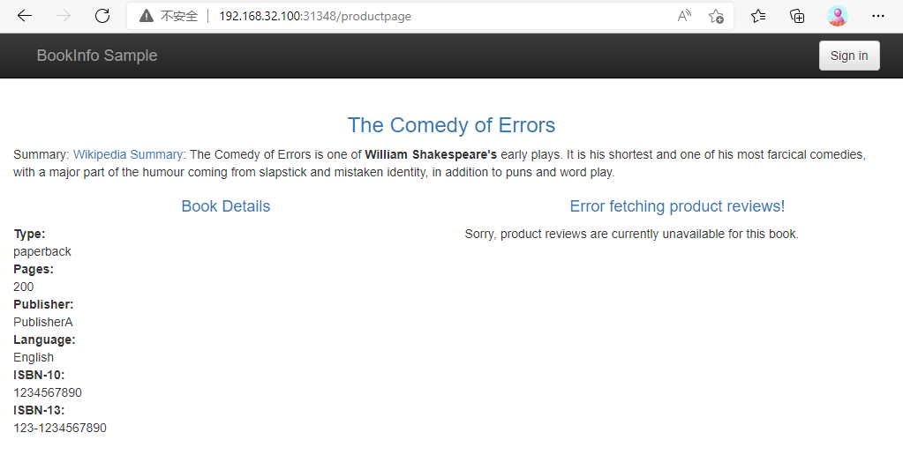
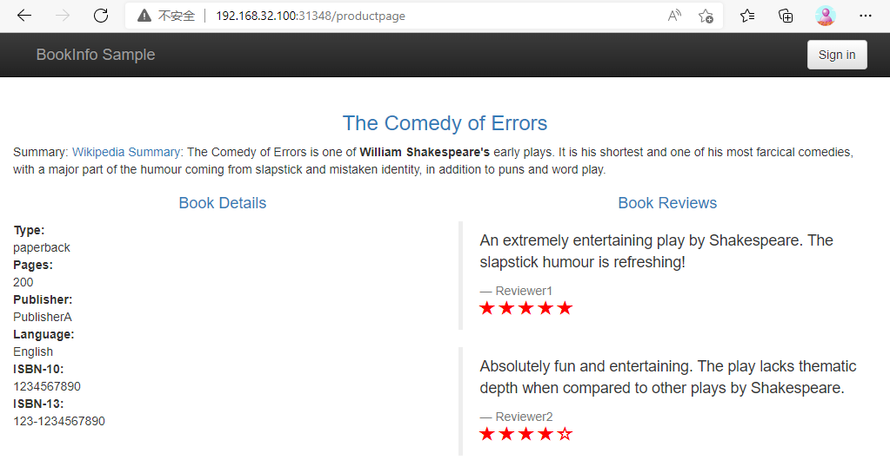
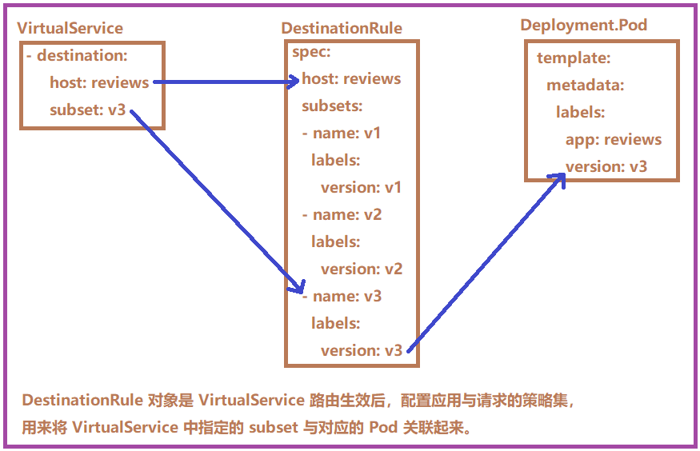
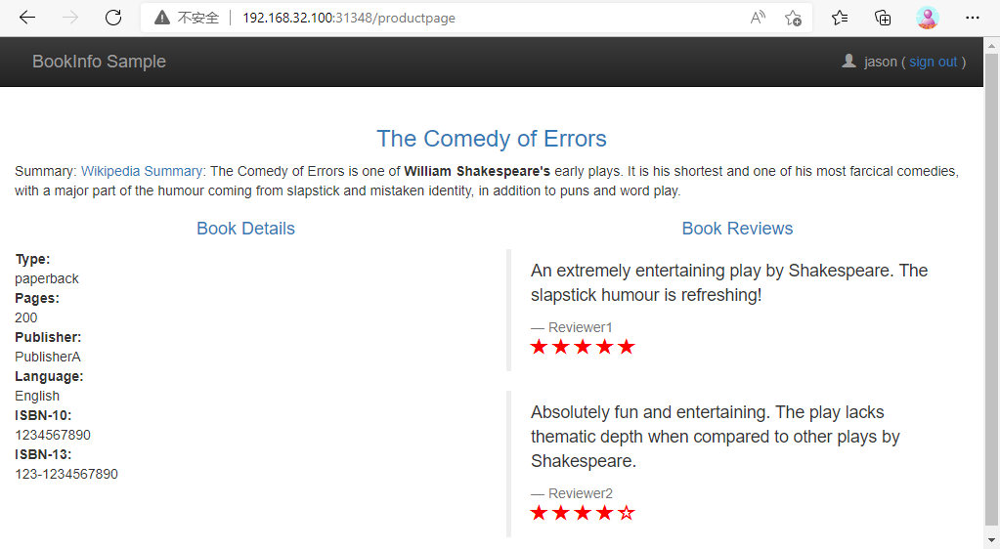
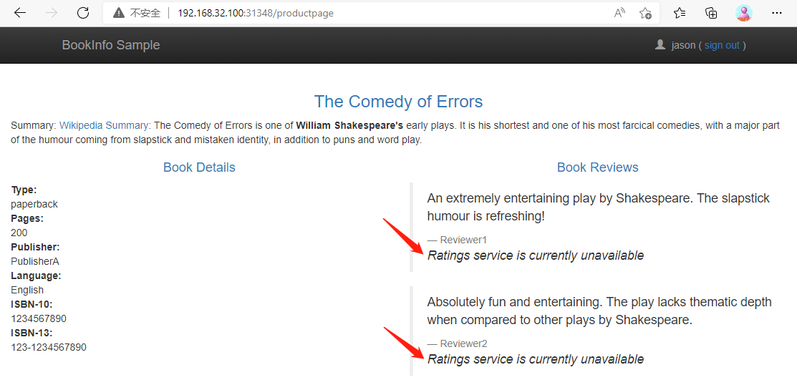
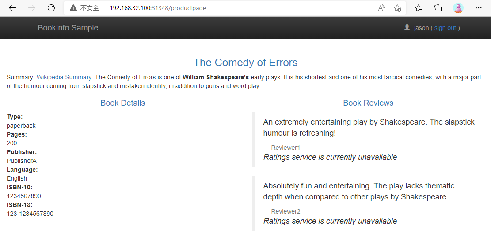
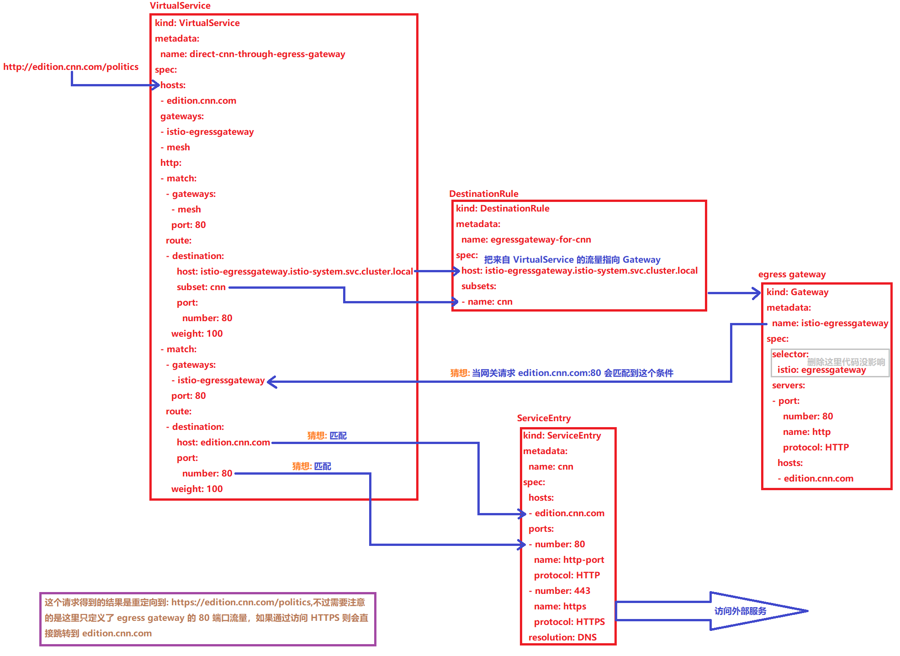
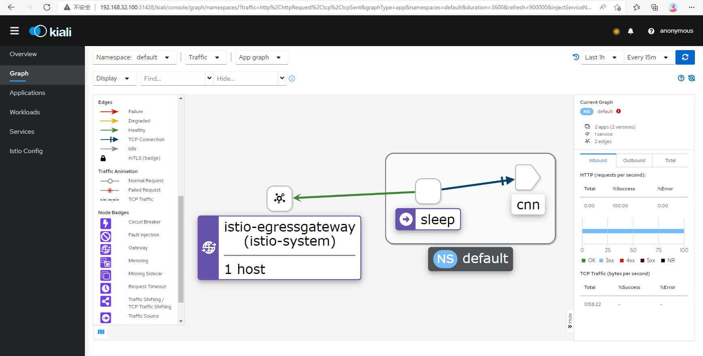
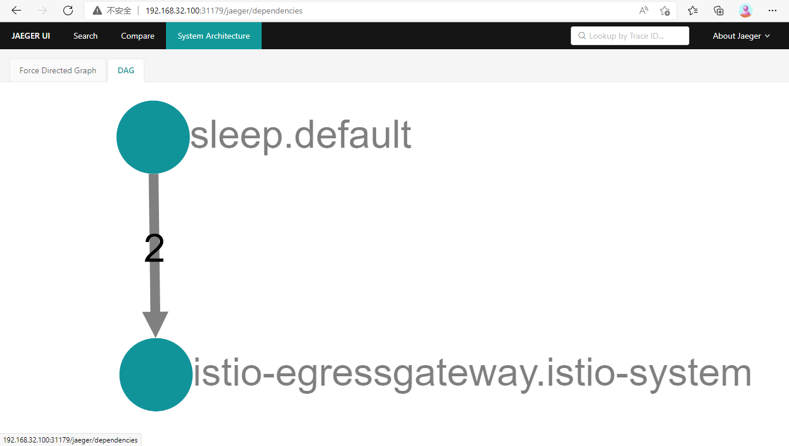

流量管理

上节成功搭建并部署了 Istio 及其 Bookinfo 示例应用，目前搭建 Bookinfo 应用只用到了下面两个资源文件：

- samples/bookinfo/platform/kube/bookinfo.yaml

- samples/bookinfo/networking/bookinfo-gateway.yaml

前者就是通常的 Kubernetes 定义的 Deployment 和 Service 的资源清单文件，因为给 default 命名空间添加了 istio-injection=enabled  标签，所以当部署应用到 default 命名空间， Istio 就会自动注入 Envoy sidecar 代理。（如果不使用标签，也可以在部署时使用 istioctl kube-inject 对这个文件定义的 Pod 去注入sidecar 代理）后者定义了这个应用的外部访问入口gateway，以及应用内部 productpage 服务的 VirtualService 规则，而其他内部服务的访问规则还没有被定义。


现在访问应用界面并刷新，会看到 Reviews 有时不会显示评分，有时候会显示不同样式的评分，这是因为后面有3个不同的 Reviews 服务版本，而没有配置该服务的路由规则 route rule 的情况下，该服务的几个实例会被随机访问到，有的版本服务会进一步调用 Ratings 服务，有的不会。


到这里已经接触到了 Istio 中两个非常重要的流量管理的资源对象：

- VirtualService 是用来在 Istio 中定义路由规则，控制流量路由到服务上的各种行为。

- Gateway 为 HTTP/TCP 流量配置负载均衡器的。


1.  不同服务版本访问规则

对 Reviews 服务添加一条路由规则，启用 virtual-service-reviews-v3.yaml 定义的 VirtualService 规则。启用后，这样所有访问 reviews 服务的流量就会被引导到 reviews 服务对应的 subset 为 v3 的 Pod 中。内容如下：

```javascript
# samples/bookinfo/networking/virtual-service-reviews-v3.yaml
apiVersion: networking.istio.io/v1alpha3
kind: VirtualService
metadata:
  name: reviews
spec:
  hosts:
    - reviews
  http:
  - route:
    - destination:
        host: reviews
        subset: v3
```


```javascript
[root@centos7 istio-1.13.2]# kubectl get virtualservice
NAME       GATEWAYS               HOSTS   AGE
bookinfo   ["bookinfo-gateway"]   ["*"]   38h

// 启用这条规则:
[root@centos7 istio-1.13.2]# kubectl apply -f samples/bookinfo/networking/virtual-service-reviews-v3.yaml
virtualservice.networking.istio.io/reviews created    

// 查看所有的路由规则：
[root@centos7 istio-1.13.2]# kubectl get virtualservice
NAME       GATEWAYS               HOSTS         AGE
bookinfo   ["bookinfo-gateway"]   ["*"]         38h
reviews                           ["reviews"]   15s
```


reviews 的 VirtualService 创建成功后，去刷新应用页面发现访问 Reviews 失败，这是因为还没有创建 DestinationRule 这个对象，DestinationRule 对象是 VirtualService 路由生效后，配置应用与请求的策略集，用来将 VirtualService 中指定的 subset 与对应的 Pod 关联起来。



在 samples/bookinfo/networking/destination-rule-all.yaml 文件中有定义所有该应用中要用到的所有 DestinationRule 资源对象，其中有一段就是对 Reviews 相关的 DestinationRule 的定义，如下:

```javascript
#  samples/bookinfo/networking/destination-rule-all.yaml

---
apiVersion: networking.istio.io/v1alpha3
kind: DestinationRule
metadata:
  name: reviews
spec:
  host: reviews
  subsets:
  - name: v1
    labels:
      version: v1
  - name: v2
    labels:
      version: v2
  - name: v3
    labels:
      version: v3
```


可以看到 DestinationRule 中定义了 subsets 集合，其中 labels 和之前 Service 的 labelselector 一样是去匹配 Pod 的 labels 标签的，比如这里 subsets 中就包含一个名为 v3 的 subset，而这个 subset 匹配的就是具有 version=v3 这个 label 标签的 Pod 集合，再回到之前的 bookinfo.yaml 文件，可以发现 reviews 的 Deployment 确实有声明不同的 labels ->version:

```javascript
# samples/bookinfo/platform/kube/bookinfo.yaml 
---
apiVersion: apps/v1
kind: Deployment
metadata:
  name: reviews-v3
  labels:
    app: reviews
    version: v3
spec:
  replicas: 1
  selector:
    matchLabels:
      app: reviews
      version: v3
  template:
    metadata:
      labels:
        app: reviews
        version: v3     # 声明version=v3的标签
    spec:
      serviceAccountName: bookinfo-reviews
      containers:
      - name: reviews
        image: docker.io/istio/examples-bookinfo-reviews-v3:1.16.2
        imagePullPolicy: IfNotPresent
        env:
        - name: LOG_DIR
          value: "/tmp/logs"
        ports:
        - containerPort: 9080
        volumeMounts:
        - name: tmp
          mountPath: /tmp
        - name: wlp-output
          mountPath: /opt/ibm/wlp/output
        securityContext:
          runAsUser: 1000
      volumes:
      - name: wlp-output
        emptyDir: {}
      - name: tmp
        emptyDir: {}
```


这样就通过 DestinationRule 将 VirtualService 与 Service 不同的版本关联起来。现在直接创建 DestinationRule 资源：

```javascript
[root@centos7 istio-1.13.2]# kubectl apply -f samples/bookinfo/networking/destination-rule-all.yaml
destinationrule.networking.istio.io/productpage created
destinationrule.networking.istio.io/reviews created
destinationrule.networking.istio.io/ratings created
destinationrule.networking.istio.io/details created
// 创建完成后，就可以查看目前网格中的 DestinationRules
[root@centos7 istio-1.13.2]# kubectl get destinationrule
NAME          HOST          AGE
details       details       16s
productpage   productpage   16s
ratings       ratings       16s
reviews       reviews       16s
[root@centos7 istio-1.13.2]#
```


此时再访问应用就成功了，多次刷新页面发现 Reviews 都展示的是 v3 版本带红色星的 Ratings，说明 VirtualService 的配置成功了。




下图说明了 VirtualService、DestinationRule 和 Pod 之间的关系：




2. 基于权重的服务访问规则

上面是基于不同服务版本的服务网格的控制，接下来是基于权重的服务访问规则的使用。首先移除刚刚创建的 VirtualService 对象，排除对环境的影响：

```javascript
[root@centos7 istio-1.13.2]# kubectl delete virtualservice reviews
virtualservice.networking.istio.io "reviews" del

[root@centos7 istio-1.13.2]# kubectl get virtualservice
NAME       GATEWAYS               HOSTS   AGE
bookinfo   ["bookinfo-gateway"]   ["*"]   40h
```


删除后再去访问 Bookinfo 应用又回到最初随机访问 Reviews 的情况。现在查看文件 virtual-service-reviews-80-20.yaml 的定义，这个规则定义了 Reviews 的流量 80% 会落入 v1 这个 subset（就是没有 Ratings 的这个服务），20% 会落入 v2 带黑色 Ratings 的这个服务：

```javascript
# samples/bookinfo/networking/virtual-service-reviews-80-20.yaml

apiVersion: networking.istio.io/v1alpha3
kind: VirtualService
metadata:
  name: reviews
spec:
  hosts:
    - reviews
  http:
  - route:
    - destination:
        host: reviews
        subset: v1
      weight: 80
    - destination:
        host: reviews
        subset: v2
      weight: 20
```


```javascript
// 创建这个资源对象
[root@centos7 istio-1.13.2]# kubectl apply -f samples/bookinfo/networking/virtual-service-reviews-80-20.yaml
virtualservice.networking.istio.io/reviews created

// 查看当前网格中的 VirtualService 对象,可以看到已经有 reviews,证明已经创建成功
[root@centos7 istio-1.13.2]# kubectl get virtualservice
NAME       GATEWAYS               HOSTS         AGE
bookinfo   ["bookinfo-gateway"]   ["*"]         40h
reviews                           ["reviews"]   11s
```


由于上面已经将应用中所有的 DestinationRules 都已经创建，所以现在直接访问应用就可以，多次刷新后，可以发现没有出现 Ratings 的次数与出现黑色星 Ratings 的比例大概在4:1左右，并且没有红色星的 Ratings 的情况出现，说明配置的基于权重的 VirtualService 访问规则配置已生效。


3. 基于请求内容的服务访问规则

除了基于服务版本和服务权重的方式控制服务访问之外，还可以基于请求内容来进行访问控制。同样，将上面创建的 VirtualService 对象删除：

```javascript
[root@centos7 istio-1.13.2]# kubectl delete virtualservice reviews
virtualservice.networking.istio.io "reviews" deleted
[root@centos7 istio-1.13.2]# kubectl get virtualservice
NAME       GATEWAYS               HOSTS   AGE
bookinfo   ["bookinfo-gateway"]   ["*"]   40h
```


查看文件 virtual-service-reviews-jason-v2-v3.yaml 的定义，这个 VirtualService 对象定义了对 reviews 服务访问的 match 规则。意思是如果当前请求的 header 中包含 jason 这个用户信息，则只会访问到 v2 的 reviews 这个服务版本，即都带黑星的样式，如果不包含该用户信息，则都直接将流量转发给 v3 这个 reviews 的服务。

```javascript
# samples/bookinfo/networking/virtual-service-reviews-jason-v2-v3.yaml
apiVersion: networking.istio.io/v1alpha3
kind: VirtualService
metadata:
  name: reviews
spec:
  hosts:
  - reviews
  http:
  - match:
    - headers:
        end-user:
          exact: jason
    route:
    - destination:
        host: reviews
        subset: v2
  - route:
    - destination:
        host: reviews
        subset: v3
```


先不启用这个 VirtualService，先访问下 Bookinfo 这个应用，右上角有登录按钮，在没有登录的情况下刷新页面，reviews 服务被随机访问，可以看到有带星不带星的样式。点击登录，在弹窗中 User Name 输入 jason，Password 为空，登录后再刷新页面，可以看到跟未登录前的访问规则一样，也是随机的。




```javascript
// 现在创建上面的 VirtualService 这个对象
[root@centos7 istio-1.13.2]#  kubectl apply -f samples/bookinfo/networking/virtual-service-reviews-jason-v2-v3.yaml
virtualservice.networking.istio.io/reviews created

[root@centos7 istio-1.13.2]# kubectl get virtualservice
NAME       GATEWAYS               HOSTS         AGE
bookinfo   ["bookinfo-gateway"]   ["*"]         41h
reviews                           ["reviews"]   8s
```

此时再刷新页面，发现一直都是黑星的 Reviews 版本(v2)被访问到。注销退出后再访问，此时又一直是红星的版本(v3)被访问到。说明在 headers 中如果有键为 end-user 并且值为 jason 的控制规则已生效。在 productpage 服务调用 reviews 服务时，登录的情况下会在 header 中带上用户信息，通过 exact 规则匹配到相关信息后，流量被引向了上面配置的 v2 版本中。


这里要说明一下 match 的匹配规则：

All conditions inside a single match block have AND semantics, while the list of match blocks have OR semantics. The rule is matched if any one of the match blocks succeed.

意思是一个 match 块里的条件是需要同时满足才算匹配成功的，如下面是 url 前缀和端口都必须都满足才算成功：

```javascript
- match:
    - uri:
        prefix: "/wpcatalog"
      port: 443
```


多个 match 块之间是只要有一个 match 匹配成功了，就会被路由到它指定的服务版本去，而忽略其他的。示例中在登录的条件下，满足第一个 match，所以服务一直会访问到 v2 版本。退出登录后，没有 match 规则满足匹配，所以就走最后一个 route 规则，即 v3 版本。


到这里已了解基于不同服务版本、权重以及请求内容来控制服务流量的配置。


4. 延迟访问故障注入

首先移除之前创建的 VirtualService:

```javascript
[root@centos7 istio-1.13.2]# kubectl delete virtualservice reviews
virtualservice.networking.istio.io "reviews" deleted
[root@centos7 istio-1.13.2]# kubectl get virtualservice
NAME       GATEWAYS               HOSTS   AGE
bookinfo   ["bookinfo-gateway"]   ["*"]   41h
```


然后查看文件 virtual-service-ratings-test-delay.yaml 内容：

```javascript
# samples/bookinfo/networking/virtual-service-ratings-test-delay.yaml
apiVersion: networking.istio.io/v1alpha3
kind: VirtualService
metadata:
  name: ratings
spec:
  hosts:
  - ratings
  http:
  - match:
    - headers:
        end-user:
          exact: jason
    fault:
      delay:
        percentage:
          value: 100.0
        fixedDelay: 7s
    route:
    - destination:
        host: ratings
        subset: v1
  - route:
    - destination:
        host: ratings
        subset: v1
```

这个 VirtualService 定义了一个在 jason 登录的情况下，访问 ratings 服务的 100% 的 7s 访问延迟。已经知道，Bookinfo 这个示例 productpage 服务调用 reviews，reviews 的不同版本会对 ratings 进行不同的调用，其中 reviews-v1 不调用 ratings，reviews-v2 和 reviews-v3 会调用 ratings，并做不同样式的渲染。并且在 productpage 访问 reviews 时，代码中有硬编码 6s 中的访问超时限制，而 reviews 访问 ratings 编码了 10s 的访问超时限制。


了解这一点后，现在来创建这个 VirtualService 资源对象：

```javascript
[root@centos7 istio-1.13.2]# kubectl apply -f samples/bookinfo/networking/virtual-service-ratings-test-delay.yaml
virtualservice.networking.istio.io/ratings created
[root@centos7 istio-1.13.2]# kubectl get virtualservice
NAME       GATEWAYS               HOSTS         AGE
bookinfo   ["bookinfo-gateway"]   ["*"]         41h
ratings                           ["ratings"]   7s
```


创建完成后，前往 Bookinfo 应用，登录 jason，刷新页面，发现请求加载很慢，大约 6s 后出现如下界面：



可以看到 Ratings 服务出现了 unavailable 的提示信息，这是因为此时 reviews 请求 ratings 的访问超过了 6s 还没有响应，使得 productpage 中的硬编码的超时设置生效了。


当然有的时候也能成功访问到 reviews-v1 版本，这是因为此时并没有进一步访问 ratings 服务，所以一切都是正常的，会显示不带星的界面：


通过这种超时故障注入，可以帮助方便地发现服务间相互访问中存在的潜在问题。


5. 中断访问故障注入

首先移除之前创建的 VirtualService:

```javascript
[root@centos7 istio-1.13.2]# kubectl delete virtualservice ratings
virtualservice.networking.istio.io "ratings" deleted
[root@centos7 istio-1.13.2]# kubectl get virtualservice
NAME       GATEWAYS               HOSTS   AGE
bookinfo   ["bookinfo-gateway"]   ["*"]   41h
```


然后查看文件 virtual-service-ratings-test-abort.yaml 的内容，从这个 yaml 文件可以看出这个 VirtualService 资源对象配置了在 jason 登录时，reviews 对 ratings 访问时 100% 的返回一个500错误响应。

```javascript
# samples/bookinfo/networking/virtual-service-ratings-test-abort.yaml
apiVersion: networking.istio.io/v1alpha3
kind: VirtualService
metadata:
  name: ratings
spec:
  hosts:
  - ratings
  http:
  - match:
    - headers:
        end-user:
          exact: jason
    fault:
      abort:
        percentage:
          value: 100.0
        httpStatus: 500
    route:
    - destination:
        host: ratings
        subset: v1
  - route:
    - destination:
        host: ratings
        subset: v1
```


```javascript
// 创建这个资源对象
[root@centos7 istio-1.13.2]# kubectl apply -f samples/bookinfo/networking/virtual-service-ratings-test-abort.yaml
virtualservice.networking.istio.io/ratings created

[root@centos7 istio-1.13.2]# kubectl get virtualservice
NAME       GATEWAYS               HOSTS         AGE
bookinfo   ["bookinfo-gateway"]   ["*"]         41h
ratings                           ["ratings"]   6s
```


回到 BookInfo 应用，登录 jason，刷新页面，有时候可以很快就看到 Rating 服务不可用的提示信息：



同样的，有的时候也能成功访问到 reviews-v1 版本，这是因为此时并没有进一步访问 ratings 服务，所以一切都是正常的，会显示不带星的界面：


6. 服务网格外的流量管理

官网文档:

https://istio.io/latest/docs/tasks/traffic-management/egress/egress-control/


为了控制服务网格外的服务(域名不在服务网格中)的流量访问，外部的服务必须首先使用一个 ServiceEntry 对象加入到 istio 的内部 service registry 中，服务网格才会知道如何导向这些外部服务的流量。


使用 istio 样例中的 sleep 应用验证改功能，查看 sleep.yaml 文件内容，这其实就是一个简单的应用，通过 Deployment 进行控制，通过 Service 暴露服务：

```javascript
# samples/sleep/sleep.yaml
apiVersion: v1
kind: ServiceAccount
metadata:
  name: sleep
---
apiVersion: v1
kind: Service
metadata:
  name: sleep
  labels:
    app: sleep
    service: sleep
spec:
  ports:
  - port: 80
    name: http
  selector:
    app: sleep
---
apiVersion: apps/v1
kind: Deployment
metadata:
  name: sleep
spec:
  replicas: 1
  selector:
    matchLabels:
      app: sleep
  template:
    metadata:
      labels:
        app: sleep
    spec:
      terminationGracePeriodSeconds: 0
      serviceAccountName: sleep
      containers:
      - name: sleep
        image: curlimages/curl
        command: ["/bin/sleep", "3650d"]
        imagePullPolicy: IfNotPresent
        volumeMounts:
        - mountPath: /etc/sleep/tls
          name: secret-volume
      volumes:
      - name: secret-volume
        secret:
          secretName: sleep-secret
          optional: true
---
```


```javascript
// 在 node 节点先下载镜像
[root@centos7 ~]# docker pull curlimages/curl

// 部署应用
[root@centos7 istio-1.13.2]# kubectl apply -f samples/sleep/sleep.yaml
serviceaccount/sleep created
service/sleep created
deployment.apps/sleep created
// 如果没有给命名空间打上 istio-injection=enabled 标签,也可以使用下面的命令部署
// kubectl apply -f <(istioctl kube-inject -f samples/sleep/sleep.yaml)

[root@centos7 istio-1.13.2]# kubectl get pod | grep sleep
sleep-557747455f-5tvvr                    2/2     Running   0             2m27s
[root@centos7 istio-1.13.2]# kubectl get service | grep sleep
sleep         ClusterIP   10.98.78.45      <none>        80/TCP     2m45s
```


Istio 有一个安装选项 global.outboundTrafficPolicy.mode，它配置 sidecar 对外部服务（那些没有在 Istio 的内部服务注册中定义的服务）的处理方式。如果这个选项设置为 ALLOW_ANY，Istio 代理允许调用未知的服务。如果这个选项设置为 REGISTRY_ONLY，那么 Istio 代理会阻止任何没有在网格中定义的 HTTP 服务或 service entry 的主机。ALLOW_ANY 是默认值，不控制对外部服务的访问。但是这种方式有一个缺点，即丢失了对外部服务流量的 Istio 监控和控制，比如，外部服务的调用没有记录到 Mixer 的日志中。


这里为了测试 ServiceEntry 功能，将其更改为 REGISTRY_ONLY 模式：

```javascript
// 查看 istio 的配置发现并没有 mode 这一项,所以默认为 ALLOW_ANY 模式
[root@centos7 istio-1.13.2]# kubectl get configmap istio -o yaml  -n istio-system | grep mode
[root@centos7 istio-1.13.2]# 

//官网解释: You should either see ALLOW_ANY or no output (default ALLOW_ANY).
[root@centos7 istio-1.13.2]# kubectl get istiooperator installed-state -n istio-system -o jsonpath='{.spec.meshConfig.outboundTrafficPolicy.mode}'
[root@centos7 istio-1.13.2]#

// 可以使用 istioctl install 重新设置这个参数
[root@centos7 istio-1.13.2]# istioctl install  --set meshConfig.outboundTrafficPolicy.mode=REGISTRY_ONLY  --set profile=demo -y
✔ Istio core installed                                                                                                                                                                                  
✔ Istiod installed                                                                                                                                                                                      
✔ Ingress gateways installed                                                                                                                                                                            
✔ Egress gateways installed                                                                                                                                                                             
✔ Installation complete   

// 也可以使用下面的命令手动加上这段配置
// kubectl edit configmap istio -n istio-system 

// 查看配置文件可以发现 outboundTrafficPolicy 的 mode 已经设置为 REGISTRY_ONLY
[root@centos7 istio-1.13.2]# kubectl get configmap istio -o yaml  -n istio-system
apiVersion: v1
data:
  mesh: |-
    accessLogFile: /dev/stdout
    defaultConfig:
      discoveryAddress: istiod.istio-system.svc:15012
      proxyMetadata: {}
      tracing:
        zipkin:
          address: zipkin.istio-system:9411
    enablePrometheusMerge: true
    outboundTrafficPolicy:
      mode: REGISTRY_ONLY
//......                                                                                                                                                                          Making this installation the default for injection and validation.
```


istio 的 ConfigMap 修改完成后就可以接管外部 URL 的流量。现在进入上面创建的 sleep 应用容器内部执行一些测试操作：

```javascript
[root@centos7 istio-1.13.2]# export SLEEP_POD=$(kubectl get pod -l app=sleep -o jsonpath={.items..metadata.name})
[root@centos7 istio-1.13.2]# kubectl exec -it $SLEEP_POD -c sleep -- curl -sL -o /dev/null -D - http://edition.cnn.com/politics
HTTP/1.1 502 Bad Gateway
date: Sat, 26 Mar 2022 10:26:02 GMT
server: envoy
content-length: 0

[root@centos7 istio-1.13.2]#
```

可以看到返回 502 信息，因为该域名不在当前的服务网格中，因为现在不允许访问服务网格外部的 URL，服务网格中对未知的服务请求会丢弃。这就需要创建一个 ServiceEntry 对象，将外部的访问服务引入到服务网格中来。


例如下面的规则定义了一个访问 edition.cnn.com 的服务的 ServiceEntry：

```javascript
# cnn-service-entry.yaml
apiVersion: networking.istio.io/v1alpha3
kind: ServiceEntry
metadata:
  name: cnn
spec:
  hosts:
  - edition.cnn.com
  ports:
  - number: 80
    name: http-port
    protocol: HTTP
  - number: 443
    name: https
    protocol: HTTPS
  resolution: DNS
```


```javascript
// 现在来部署上面的 ServiceEntry 资源：
[root@centos7 istio]# kubectl apply -f cnn-service-entry.yaml
serviceentry.networking.istio.io/cnn created

[root@centos7 istio]# kubectl get serviceentry
NAME   HOSTS                 LOCATION   RESOLUTION   AGE
cnn    ["edition.cnn.com"]              DNS          44s

// 现在再去 sleep 容器中执行上面的测试请求：
[root@centos7 istio]# kubectl exec -it $SLEEP_POD -c sleep -- curl -sL -o /dev/null -D - http://edition.cnn.com/politics
HTTP/1.1 301 Moved Permanently
server: envoy
location: https://edition.cnn.com/politics
......

HTTP/2 200 
content-type: text/html; charset=utf-8
......

// 可以发现正常返回内容, 并且http状态码为200, 证明请求成功。
```


说明:

kubectl exec -it $SLEEP_POD -c sleep -- curl -sL -o /dev/null -D - http://......

- -L 参数让 curl 跟随连接进行重定向。这里服务器直接返回的 301 重定向响应，要求客户端再使用 HTTPS 的方式对 https://edition.cnn.com/politics 地址进行访问，第二次访问才返回了200的成功码。


除此之外，还可以进一步配置 egress gateway，使这些对外部的流量访问经由 egress 去到外部。现在为 edition.cnn.com 端口 80 创建 egress Gateway。并为指向 egress gateway 的流量创建一个 destination rule:

```javascript
# cnn-egress-gateway.yaml

apiVersion: networking.istio.io/v1alpha3
kind: Gateway
metadata:
  name: istio-egressgateway
spec:
  selector:
    istio: egressgateway
  servers:
  - port:
      number: 80
      name: http
      protocol: HTTP
    hosts:
    - edition.cnn.com
---
apiVersion: networking.istio.io/v1alpha3
kind: DestinationRule
metadata:
  name: egressgateway-for-cnn
spec:
  host: istio-egressgateway.istio-system.svc.cluster.local
  subsets:
  - name: cnn
```


除了上面的 engress gateway 对象之外，还需要创建 VirtualService 资源对象，将流量从 sidecar 引导至 egress gateway，再从 egress gateway 引导至外部服务：

```javascript
# cnn-virtual.yaml
apiVersion: networking.istio.io/v1alpha3
kind: VirtualService
metadata:
  name: direct-cnn-through-egress-gateway
spec:
  hosts:
  - edition.cnn.com
  gateways:
  - istio-egressgateway
  - mesh  # mesh 表示网格中的所有 Sidecar，如果没有指定 gateways，则默认为 mesh
  http:
  - match:
    - gateways:
      - mesh
      port: 80
    route:
    - destination:  # 将服务路由到什么地方去
        host: istio-egressgateway.istio-system.svc.cluster.local
        subset: cnn  # subset 配置流量目的地的子集
        port:
          number: 80
      weight: 100
  - match:
    - gateways:
      - istio-egressgateway
      port: 80
    route:
    - destination:
        host: edition.cnn.com
        port:
          number: 80
      weight: 100
```


```javascript
// 然后创建上面3个资源对象
[root@centos7 istio]# kubectl apply -f cnn-egress-gateway.yaml
gateway.networking.istio.io/istio-egressgateway created
destinationrule.networking.istio.io/egressgateway-for-cnn created

[root@centos7 istio]# kubectl apply -f cnn-virtual.yaml
virtualservice.networking.istio.io/direct-cnn-through-egress-gateway created
[root@centos7 istio]#

// 创建完成后，再去 sleep 容器执行下上面的请求,可以看到正常输出结果,和上面一次访问结果一样
[root@centos7 istio]# kubectl exec -it $SLEEP_POD -c sleep -- curl -sL -o /dev/null -D - http://edition.cnn.com/politics
HTTP/1.1 301 Moved Permanently
server: envoy
location: https://edition.cnn.com/politics
......

HTTP/2 200 
content-type: text/html; charset=utf-8
......

// 这时去查看 egressgateway 的 Pod 中的容器日志：
[root@centos7 istio]# kubectl logs $(kubectl get pod -l istio=egressgateway -n istio-system -o jsonpath='{.items[0].metadata.name}') -n istio-system | tail
......
[2022-03-26T11:28:42.583Z] "GET /politics HTTP/2" 301 - via_upstream - "-" 0 0 515 514 "10.244.189.156" "curl/7.82.0-DEV" "8cc3af67-c88e-9007-933b-c8203d5ebe8e" "edition.cnn.com" "151.101.1.67:80" outbound|80||edition.cnn.com 10.244.189.146:50790 10.244.189.146:8080 10.244.189.156:39534 - -
...... 
```

从上面的日志中可以看到有一条的 GET /politics 的日志信息，说明访问经过了 egress gateway 出去了。不过需要注意的是这里只定义了 egress gateway 的 80 端口流量，如果通过访问 HTTPS 则会直接跳转到 edition.cnn.com，如下：

```javascript
[root@centos7 istio]# export SLEEP_POD=$(kubectl get pod -l app=sleep -o jsonpath={.items..metadata.name})
[root@centos7 istio]# kubectl exec -it $SLEEP_POD -c sleep -- curl -sL -o /dev/null -D - https://edition.cnn.com/politics
HTTP/2 200 
content-type: text/html; charset=utf-8
x-servedbyhost: ::ffff:127.0.0.1
access-control-allow-origin: *
......

[root@centos7 istio]# 
```









7. 用 Egress Gateway 处理 HTTPS 请求

接下来尝试去使用 Egress Gateway 发起 HTTPS 请求。其实只需要在相应的 ServiceEntry、Egress Gateway 和 VirtualService 中指定 TLS 协议的 443 端口 。首先先清理前面定义的资源对象：

```javascript
[root@centos7 ~]# kubectl delete gateway istio-egressgateway
gateway.networking.istio.io "istio-egressgateway" deleted

[root@centos7 ~]# kubectl delete serviceentry cnn
serviceentry.networking.istio.io "cnn" deleted

[root@centos7 ~]# kubectl delete virtualservice direct-cnn-through-egress-gateway
virtualservice.networking.istio.io "direct-cnn-through-egress-gateway" deleted

[root@centos7 ~]# kubectl delete destinationrule egressgateway-for-cnn
destinationrule.networking.istio.io "egressgateway-for-cnn" deleted
```


这个时候如果去访问 https 的地址是不被允许的：

```javascript
[root@centos7 istio]# export SLEEP_POD=$(kubectl get pod -l app=sleep -o jsonpath={.items..metadata.name})
[root@centos7 istio]# kubectl exec -it $SLEEP_POD -c sleep -- curl -sL -o /dev/null -D - https://edition.cnn.com/politics
command terminated with exit code 35command terminated with exit code 35
```


因为还没有定义 ServiceEntry 对象，所以接下来需要创建一个 HTTPS 版本的 ServiceEntry 对象：

```javascript
# cnn-https-service-entry.yaml
apiVersion: networking.istio.io/v1alpha3
kind: ServiceEntry
metadata:
  name: cnn
spec:
  hosts:
  - edition.cnn.com
  ports:
  - number: 443
    name: tls
    protocol: TLS
  resolution: DNS
```


```javascript
// 直接创建上面的资源对象：
[root@centos7 istio]# kubectl apply -f cnn-https-service-entry.yaml 
serviceentry.networking.istio.io/cnn created

[root@centos7 istio]# kubectl get serviceentry
NAME   HOSTS                 LOCATION   RESOLUTION   AGE
cnn    ["edition.cnn.com"]              DNS          13s

// 然后同样使用上面创建的 sleep 容器来测试访问 https 地址
// 可以看到直接访问 https 地址可以得到正确的结果
[root@centos7 istio]# kubectl exec -it $SLEEP_POD -c sleep -- curl -sL -o /dev/null -D - https://edition.cnn.com/politics
HTTP/2 200 
content-type: text/html; charset=utf-8
x-servedbyhost: ::ffff:127.0.0.1
......
content-length: 1227158
```


同样为 edition.cnn.com 创建一个 egress Gateway。除此之外还需要创建一个 destination rule 和一个 virtual service，用来引导流量通过 egress gateway，并通过 egress gateway 与外部服务通信。

```javascript
# cnn-https-service-rule.yaml
apiVersion: networking.istio.io/v1alpha3
kind: Gateway
metadata:
  name: istio-egressgateway
spec:
  selector:
    istio: egressgateway
  servers:
  - port:
      number: 443
      name: tls
      protocol: TLS
    hosts:
    - edition.cnn.com
    tls:  # PASSTHROUGH 表示 gateway 按原样通过入口流量，而不终止 TLS
      mode: PASSTHROUGH
---
apiVersion: networking.istio.io/v1alpha3
kind: DestinationRule
metadata:
  name: egressgateway-for-cnn
spec:
  host: istio-egressgateway.istio-system.svc.cluster.local
  subsets:
  - name: cnn
---
apiVersion: networking.istio.io/v1alpha3
kind: VirtualService
metadata:
  name: direct-cnn-through-egress-gateway
spec:
  hosts:
  - edition.cnn.com
  gateways:
  - mesh 
  - istio-egressgateway
  tls:
  - match:
    - gateways:
      - mesh
      port: 443
      sniHosts:
      - edition.cnn.com
    route:
    - destination:
        host: istio-egressgateway.istio-system.svc.cluster.local
        subset: cnn
        port:
          number: 443
  - match:
    - gateways:
      - istio-egressgateway
      port: 443
      sniHosts:
      - edition.cnn.com
    route:
    - destination:
        host: edition.cnn.com
        port:
          number: 443
      weight: 100
```


```javascript
// 直接创建上面的3个对象
[root@centos7 istio]# kubectl apply -f cnn-https-service-rule.yaml 
gateway.networking.istio.io/istio-egressgateway created
destinationrule.networking.istio.io/egressgateway-for-cnn created
virtualservice.networking.istio.io/direct-cnn-through-egress-gateway created

// 现在再使用上面创建的 sleep 容器来测试访问 https 地址
[root@centos7 istio]# kubectl exec -it $SLEEP_POD -c sleep -- curl -sL -o /dev/null -D - https://edition.cnn.com/politics
HTTP/2 200 
content-type: text/html; charset=utf-8
......
content-length: 1227158

// 正常和上面返回的内容一样,这个时候这时去查看 egressgateway 的 Pod 中的容器日志
[root@centos7 ~]# kubectl logs $(kubectl get pod -l istio=egressgateway -n istio-system -o jsonpath='{.items[0].metadata.name}') -n istio-system | tail
......
[2022-03-27T09:15:05.952Z] "- - -" 0 - - - "-" 910 1250374 50522 - "-" "-" "-" "-" "151.101.1.67:443" outbound|443||edition.cnn.com 10.244.189.163:34686 10.244.189.163:8443 10.244.189.175:42372 edition.cnn.com -

// 可以看到 https://edition.cnn.com 的请求日志
```


需要注意：Istio 中定义的 Egress Gateway 本身并没有为其所在的节点提供任何特殊处理。集群管理员或云提供商可以在专用节点上部署 Egress gateway，并引入额外的安全措施，从而使这些节点比网格中的其他节点更安全。


要注意的是：由于 Istio 无法强制让所有出站流量都经过 egress gateway，Istio 只是通过 sidecar 代理实现了这种流向。攻击者只要绕过 sidecar 代理，就可以不经 egress gateway 直接与网格外的服务进行通信，从而避开了 Istio 的控制和监控。出于安全考虑，集群管理员和云供应商必须确保网格所有的出站流量都要经过 egress gateway。这需要通过 Istio 之外的机制来满足这一要求。例如，集群管理员可以配置防火墙，拒绝 egress gateway 以外的所有流量。Kubernetes  网络策略也能禁止所有不是从 egress gateway 发起的出站流量。此外，集群管理员和云供应商还可以对网络进行限制，让运行应用的节点只能通过 gateway 来访问外部网络。要实现这一限制，可以只给 gateway Pod 分配公网 IP，并且可以配置 NAT 设备，丢弃来自 egress gateway pod 之外的所有流量。


8. TCP 流量转移

上面展示了多种流量管理的方式，该部分主要讲解在 Istio 中如何将 TCP 流量从一个版本迁移到另一个版本。在 Istio 中，可以通过配置规则来实现该功能，可以按指定的百分比将流量路由到不同的服务。和前面使用的 HTTP 服务非常类似。


这里先将所有的 TCP 请求路由到 tcp-echo:v1 这个服务，然后在通过配置 Istio 的路由权重把 20% 的流量分配到 tcp-echo:v2 这个版本的服务上。


首先，部署微服务 tcp-echo，使用示例 tcp-echo-services.yaml，这个文件部署了两个版本的 tcp-echo 服务，要注意的是 Service 对象中的 Label Selector 是 app=tcp-echo，这样该对象就会匹配到两个版本的对象。

```javascript
# samples/tcp-echo/tcp-echo-services.yaml
apiVersion: v1
kind: Service
metadata:
  name: tcp-echo
  labels:
    app: tcp-echo
    service: tcp-echo
spec:
  ports:
  - name: tcp
    port: 9000
  - name: tcp-other
    port: 9001
  # Port 9002 is omitted intentionally for testing the pass through filter chain.
  selector:
    app: tcp-echo
---
apiVersion: apps/v1
kind: Deployment
metadata:
  name: tcp-echo-v1
  labels:
    app: tcp-echo
    version: v1
spec:
  replicas: 1
  selector:
    matchLabels:
      app: tcp-echo
      version: v1
  template:
    metadata:
      labels:
        app: tcp-echo
        version: v1
    spec:
      containers:
      - name: tcp-echo
        image: docker.io/istio/tcp-echo-server:1.2
        imagePullPolicy: IfNotPresent
        args: [ "9000,9001,9002", "one" ]
        ports:
        - containerPort: 9000
        - containerPort: 9001
---
apiVersion: apps/v1
kind: Deployment
metadata:
  name: tcp-echo-v2
  labels:
    app: tcp-echo
    version: v2
spec:
  replicas: 1
  selector:
    matchLabels:
      app: tcp-echo
      version: v2
  template:
    metadata:
      labels:
        app: tcp-echo
        version: v2
    spec:
      containers:
      - name: tcp-echo
        image: docker.io/istio/tcp-echo-server:1.2
        imagePullPolicy: IfNotPresent
        args: [ "9000,9001,9002", "two" ]
        ports:
        - containerPort: 9000
        - containerPort: 9001
```


```javascript
// 首先在 node 节点下载镜像
[root@centos7 ~]# docker pull docker.io/istio/tcp-echo-server:1.2

// 使用如下命令安装
[root@centos7 istio-1.13.2]# kubectl apply -f samples/tcp-echo/tcp-echo-services.yaml
service/tcp-echo created
deployment.apps/tcp-echo-v1 created
deployment.apps/tcp-echo-v2 created

// istioctl kube-inject 命令用于在创建 Deployments 之前注入 Istio 的 Sidecar 容器,
// 同样也可以给当前的命名空间打上一个 istio-injection=enabled 的 Label 标签，这样该命名空间就开启了 Sidecar 容器自动注入功能。
// 所以也可以使用下面的命令部署：
//kubectl apply -f <(istioctl kube-inject -f samples/tcp-echo/tcp-echo-services.yaml) service/tcp-echo created

[root@centos7 istio-1.13.2]# kubectl get pod -l app=tcp-echo
NAME                           READY   STATUS    RESTARTS   AGE
tcp-echo-v1-7dd5c5dcfb-5t5jh   2/2     Running   0          2m34s
tcp-echo-v2-56cd9b5c4f-gpgbt   2/2     Running   0          2m34s

```


接下来, 将微服务 tcp-echo 的 TCP 流量全部路由到 v1 版本上，直接使用示例文件 tcp-echo-all-v1.yaml 中的这个对象，如下所示：

```javascript
# samples/tcp-echo/tcp-echo-all-v1.yaml
apiVersion: networking.istio.io/v1alpha3
kind: Gateway
metadata:
  name: tcp-echo-gateway
spec:
  selector:
    istio: ingressgateway
  servers:
  - port:
      number: 31400
      name: tcp
      protocol: TCP
    hosts:
    - "*"
---
apiVersion: networking.istio.io/v1alpha3
kind: DestinationRule
metadata:
  name: tcp-echo-destination
spec:
  host: tcp-echo
  subsets:
  - name: v1
    labels:
      version: v1
  - name: v2
    labels:
      version: v2
---
apiVersion: networking.istio.io/v1alpha3
kind: VirtualService
metadata:
  name: tcp-echo
spec:
  hosts:
  - "*"
  gateways:
  - tcp-echo-gateway
  tcp:
  - match:
    - port: 31400
    route:
    - destination:
        host: tcp-echo
        port:
          number: 9000
        subset: v1
```


这里创建了一个 Gateway 对象，用来路由 TCP 的请求，要注意这里匹配的是 istio=ingressgateway 这个 Service 对象的 31400 这个 TCP 端口。然后在 DestinationRule 对象中声明了 v1 和 v2 两个子集服务，在 VirtualService 对象中声明具体的路由规则，可以看到是直接全都路由到了 v1 这个子集中去。

```javascript
[root@centos7 istio-1.13.2]# kubectl get svc -n istio-system -l istio=ingressgateway -o yaml
......
    - name: tcp
      nodePort: 31775
      port: 31400
      protocol: TCP
      targetPort: 31400
......

// 创建上面的资源对象
[root@centos7 istio-1.13.2]# kubectl apply -f samples/tcp-echo/tcp-echo-all-v1.yaml
gateway.networking.istio.io/tcp-echo-gateway created
destinationrule.networking.istio.io/tcp-echo-destination created
virtualservice.networking.istio.io/tcp-echo created

```


创建完成后就可以通过 istio-ingressgateway 去访问上面的 TCP 服务，要在外部访问该服务，同样可以通过 istio-ingressgateway 的 NodePort 来访问，这里的 TCP 对应的 nodePort 端口是 31775，这里可以使用如下所示的命令来测试:

```javascript
// TCP 服务的 nodePort 端口
[root@centos7 istio-1.13.2]# export INGRESS_PORT=31775
// 任意一个节点的 IP
[root@centos7 istio-1.13.2]# export INGRESS_HOST=k8s.istio.com

// 使用下面的代码测试 
for i in {1..10}; do \
docker run --add-host=$INGRESS_HOST:192.168.32.100 -e INGRESS_HOST=$INGRESS_HOST -e INGRESS_PORT=$INGRESS_PORT -it --rm busybox sh -c "(date; sleep 1) | nc $INGRESS_HOST $INGRESS_PORT"; \
done

// 然后向微服务 tcp-echo 发送一些 TCP 请求
[root@centos7 istio-1.13.2]# for i in {1..10}; do \
> docker run --add-host=$INGRESS_HOST:192.168.32.100 -e INGRESS_HOST=$INGRESS_HOST -e INGRESS_PORT=$INGRESS_PORT -it --rm busybox sh -c "(date; sleep 1) | nc $INGRESS_HOST $INGRESS_PORT"; \
> done
one Sun Mar 27 12:25:52 UTC 2022
one Sun Mar 27 12:25:53 UTC 2022
one Sun Mar 27 12:25:55 UTC 2022
one Sun Mar 27 12:25:56 UTC 2022
one Sun Mar 27 12:25:58 UTC 2022
one Sun Mar 27 12:25:59 UTC 2022
one Sun Mar 27 12:26:00 UTC 2022
one Sun Mar 27 12:26:02 UTC 2022
one Sun Mar 27 12:26:03 UTC 2022
one Sun Mar 27 12:26:05 UTC 2022

```


从上面的日志可以看出，所有时间戳的前缀都是 one，这意味着所有流量都被路由到了 tcp-echo 服务的 v1 版本中。然后使用新的路由规则将 20% 的流量从 tcp-echo:v1 转移到 tcp-echo:v2，对应的示例文件为 tcp-echo-20-v2.yaml，这里的 VirtualService 对象也很简单，给 v1 子集服务加了 80% 的权重，另外有 20% 的权重被路由到了 v2 这个子集服务中去，内容如下所示：

```javascript
# samples/tcp-echo/tcp-echo-20-v2.yaml
apiVersion: networking.istio.io/v1alpha3
kind: VirtualService
metadata:
  name: tcp-echo
spec:
  hosts:
  - "*"
  gateways:
  - tcp-echo-gateway
  tcp:
  - match:
    - port: 31400
    route:
    - destination:
        host: tcp-echo
        port:
          number: 9000
        subset: v1
      weight: 80
    - destination:
        host: tcp-echo
        port:
          number: 9000
        subset: v2
      weight: 20
```


```javascript
// 创建资源对象更新路由规则
[root@centos7 istio-1.13.2]# kubectl apply -f samples/tcp-echo/tcp-echo-20-v2.yaml
virtualservice.networking.istio.io/tcp-echo configured

// 等待几秒让新的路由规则生效。然后用上面的测试命令向 tcp-echo 服务发送 TCP 请求
[root@centos7 istio-1.13.2]# for i in {1..10}; do docker run --add-host=$INGRESS_HOST:192.168.32.100 -e INGRESS_HOST=$INGRESS_HOST -e INGRESS_PORT=$INGRESS_PORT -it --rm busybox sh -c "(date; sleep 1) | nc $INGRESS_HOST $INGRESS_PORT"; done
two Sun Mar 27 12:30:57 UTC 2022
one Sun Mar 27 12:30:58 UTC 2022
two Sun Mar 27 12:31:00 UTC 2022
one Sun Mar 27 12:31:01 UTC 2022
one Sun Mar 27 12:31:03 UTC 2022
two Sun Mar 27 12:31:04 UTC 2022
one Sun Mar 27 12:31:06 UTC 2022
two Sun Mar 27 12:31:07 UTC 2022
one Sun Mar 27 12:31:08 UTC 2022
one Sun Mar 27 12:31:10 UTC 2022
[root@centos7 istio-1.13.2]# 
```

可以发现，有大约 20% 的流量时间戳前缀是 two ，这意味着有 80% 的 TCP 流量路由到了 tcp-echo 服务的 v1 版本，与此同时有 20% 流量路由到了 v2 版本。这样就实现了对 TCP 流量的转移，和前面使用的 HTTP 服务非常类似。


9. 熔断

熔断是创建弹性微服务应用程序的重要模式，熔断能够使应用程序具备应对来自故障、潜在峰值和其他未知网络因素影响的能力，熔断在微服务框架中也是必备的一个功能。同样在 Istio 中也是原生就支持熔断功能的，首先部署示例服务 samples/httpbin/httpbin.yaml，该应用也很简单：

```javascript
# samples/httpbin/httpbin.yaml
apiVersion: v1
kind: ServiceAccount
metadata:
  name: httpbin
---
apiVersion: v1
kind: Service
metadata:
  name: httpbin
  labels:
    app: httpbin
    service: httpbin
spec:
  ports:
  - name: http
    port: 8000
    targetPort: 80
  selector:
    app: httpbin
---
apiVersion: apps/v1
kind: Deployment
metadata:
  name: httpbin
spec:
  replicas: 1
  selector:
    matchLabels:
      app: httpbin
      version: v1
  template:
    metadata:
      labels:
        app: httpbin
        version: v1
    spec:
      serviceAccountName: httpbin
      containers:
      - image: docker.io/kennethreitz/httpbin
        imagePullPolicy: IfNotPresent
        name: httpbin
        ports:
        - containerPort: 80
```


```javascript
// 在 node 节点下载镜像
[root@centos7 istio-1.13.2]# docker pull docker.io/kennethreitz/httpbin

// 直接使用命令部署即可
[root@centos7 istio-1.13.2]# kubectl apply -f samples/httpbin/httpbin.yaml
serviceaccount/httpbin created
service/httpbin created
deployment.apps/httpbin created

// 如果没有给命名空间打上 istio-injection=enabled 标签,也可以使用下面的命令部署
// kubectl apply -f <(istioctl kube-inject -f samples/httpbin/httpbin.yaml)
```


应用部署完成后，接着创建一个目标规则，在调用 httpbin 服务时配置熔断设置。这里通过一个 DestinationRule 对象来创建一个如下所示的资源对象：

```javascript
[root@centos7 istio-1.13.2]# kubectl apply -f - <<EOF
apiVersion: networking.istio.io/v1alpha3
kind: DestinationRule
metadata:
  name: httpbin
spec:
  host: httpbin
  trafficPolicy:
    connectionPool:
      tcp:
        maxConnections: 1
      http:
        http1MaxPendingRequests: 1
        maxRequestsPerConnection: 1
    outlierDetection:
      consecutive5xxErrors: 1
      interval: 1s
      baseEjectionTime: 3m
      maxEjectionPercent: 100
EOF
destinationrule.networking.istio.io/httpbin created
```


目标规则创建完成后，接着创建一个客户端应用来发送流量请求到 httpbin 服务，这里使用一个名为 Fortio 的测试客户端应用，该应用可以控制连接数、并发数及发送 HTTP 请求的延迟，通过 Fortio 能够有效的触 DestinationRule 中设置的熔断策略。客户端应用资源清单文件 fortio-deploy.yaml，内容如下所示:

```javascript
# samples/httpbin/sample-client/fortio-deploy.yaml
apiVersion: v1
kind: Service
metadata:
  name: fortio
  labels:
    app: fortio
    service: fortio
spec:
  ports:
  - port: 8080
    name: http
  selector:
    app: fortio
---
apiVersion: apps/v1
kind: Deployment
metadata:
  name: fortio-deploy
spec:
  replicas: 1
  selector:
    matchLabels:
      app: fortio
  template:
    metadata:
      annotations:
        # This annotation causes Envoy to serve cluster.outbound statistics via 15000/stats
        # in addition to the stats normally served by Istio. The Circuit Breaking example task
        # gives an example of inspecting Envoy stats via proxy config.
        proxy.istio.io/config: |-
          proxyStatsMatcher:
            inclusionPrefixes:
            - "cluster.outbound"
            - "cluster_manager"
            - "listener_manager"
            - "server"
            - "cluster.xds-grpc"
      labels:
        app: fortio
    spec:
      containers:
      - name: fortio
        image: fortio/fortio:latest_release
        imagePullPolicy: Always
        ports:
        - containerPort: 8080
          name: http-fortio
        - containerPort: 8079
          name: grpc-ping
```


```javascript
// 在 node 节点下载镜像
[root@centos7 ~]# docker pull fortio/fortio:latest_release

// 直接部署客户端应用，记得注入 Istio Sidecar 代理，以便 Istio 对其网络交互进行管理
[root@centos7 istio-1.13.2]# kubectl apply -f samples/httpbin/sample-client/fortio-deploy.yaml
service/fortio created
deployment.apps/fortio-deploy created

// 如果没有给命名空间打上 istio-injection=enabled 标签,也可以使用下面的命令部署
// kubectl apply -f <(istioctl kube-inject -f samples/httpbin/sample-client/fortio-deploy.yaml)

[root@centos7 istio-1.13.2]# kubectl get pod -l app=fortio
NAME                             READY   STATUS    RESTARTS   AGE
fortio-deploy-687945c6dc-42fst   2/2     Running   0          55s

// 部署完成后进入到客户端应用中使用 Fortio 工具调用 httpbin 服务
// -curl 参数表明发送一次调用
[root@centos7 istio-1.13.2]# FORTIO_POD=$(kubectl get pod | grep fortio | awk '{ print $1 }')
[root@centos7 istio-1.13.2]# kubectl exec -it $FORTIO_POD  -c fortio -- /usr/bin/fortio load -curl  http://httpbin:8000/get
HTTP/1.1 200 OK
server: envoy
date: Sun, 27 Mar 2022 13:58:58 GMT
......

// 可以看到调用后端服务请求成功
```


接下来测试熔断。在 DestinationRule 配置中，定义了 maxConnections: 1 和  http1MaxPendingRequests: 1，表示如果并发的连接和请求数超过一个，那么在 istio-proxy 进行进一步的请求和连接时，后续的请求或连接将被阻止。比如这里发送并发数为 2 的连接（-c 2），请求 20 次（-n 20）来观察下现象：

```javascript
[root@centos7 istio-1.13.2]# kubectl exec "$FORTIO_POD" -c fortio -- /usr/bin/fortio load -c 2 -qps 0 -n 20 -loglevel Warning http://httpbin:8000/get
14:06:06 I logger.go:127> Log level is now 3 Warning (was 2 Info)
Fortio 1.17.1 running at 0 queries per second, 8->8 procs, for 20 calls: http://httpbin:8000/get
Starting at max qps with 2 thread(s) [gomax 8] for exactly 20 calls (10 per thread + 0)
14:06:06 W http_client.go:806> [1] Non ok http code 503 (HTTP/1.1 503)
Ended after 66.857398ms : 20 calls. qps=299.14
Aggregated Function Time : count 20 avg 0.0063373239 +/- 0.006305 min 0.003190401 max 0.028379551 sum 0.126746479
# range, mid point, percentile, count
>= 0.0031904 <= 0.004 , 0.0035952 , 30.00, 6
> 0.004 <= 0.005 , 0.0045 , 85.00, 11
> 0.005 <= 0.006 , 0.0055 , 90.00, 1
> 0.02 <= 0.025 , 0.0225 , 95.00, 1
> 0.025 <= 0.0283796 , 0.0266898 , 100.00, 1
# target 50% 0.00436364
# target 75% 0.00481818
# target 90% 0.006
# target 99% 0.0277036
# target 99.9% 0.028312
Sockets used: 3 (for perfect keepalive, would be 2)
Jitter: false
Code 200 : 19 (95.0 %)
Code 503 : 1 (5.0 %)
Response Header Sizes : count 20 avg 218.55 +/- 50.14 min 0 max 231 sum 4371
Response Body/Total Sizes : count 20 avg 794.9 +/- 127.1 min 241 max 825 sum 15898
All done 20 calls (plus 0 warmup) 6.337 ms avg, 299.1 qps
```


可以看到大部分请求还是都请求成功，并不是一半的请求失败，出现这种情况的原因是 istio-proxy 并不是100%准确的：

```javascript
Code 200 : 19 (95.0 %)
Code 503 : 1 (5.0 %)
```


然后将并发连接数提高到 3 个：

```javascript
[root@centos7 istio-1.13.2]# kubectl exec "$FORTIO_POD" -c fortio -- /usr/bin/fortio load -c 3 -qps 0 -n 30 -loglevel Warning http://httpbin:8000/get
14:11:51 I logger.go:127> Log level is now 3 Warning (was 2 Info)
Fortio 1.17.1 running at 0 queries per second, 8->8 procs, for 30 calls: http://httpbin:8000/get
Starting at max qps with 3 thread(s) [gomax 8] for exactly 30 calls (10 per thread + 0)
14:11:51 W http_client.go:806> [1] Non ok http code 503 (HTTP/1.1 503)
14:11:51 W http_client.go:806> [0] Non ok http code 503 (HTTP/1.1 503)
14:11:51 W http_client.go:806> [2] Non ok http code 503 (HTTP/1.1 503)
14:11:51 W http_client.go:806> [0] Non ok http code 503 (HTTP/1.1 503)
14:11:51 W http_client.go:806> [2] Non ok http code 503 (HTTP/1.1 503)
14:11:51 W http_client.go:806> [0] Non ok http code 503 (HTTP/1.1 503)
14:11:51 W http_client.go:806> [0] Non ok http code 503 (HTTP/1.1 503)
14:11:51 W http_client.go:806> [1] Non ok http code 503 (HTTP/1.1 503)
14:11:51 W http_client.go:806> [1] Non ok http code 503 (HTTP/1.1 503)
14:11:51 W http_client.go:806> [1] Non ok http code 503 (HTTP/1.1 503)
14:11:51 W http_client.go:806> [2] Non ok http code 503 (HTTP/1.1 503)
14:11:51 W http_client.go:806> [2] Non ok http code 503 (HTTP/1.1 503)
14:11:51 W http_client.go:806> [2] Non ok http code 503 (HTTP/1.1 503)
14:11:51 W http_client.go:806> [2] Non ok http code 503 (HTTP/1.1 503)
14:11:51 W http_client.go:806> [2] Non ok http code 503 (HTTP/1.1 503)
14:11:51 W http_client.go:806> [2] Non ok http code 503 (HTTP/1.1 503)
14:11:51 W http_client.go:806> [0] Non ok http code 503 (HTTP/1.1 503)
Ended after 55.20963ms : 30 calls. qps=543.38
Aggregated Function Time : count 30 avg 0.0044883234 +/- 0.00398 min 0.00056517 max 0.015231277 sum 0.134649701
# range, mid point, percentile, count
>= 0.00056517 <= 0.001 , 0.000782585 , 23.33, 7
> 0.001 <= 0.002 , 0.0015 , 40.00, 5
> 0.002 <= 0.003 , 0.0025 , 50.00, 3
> 0.003 <= 0.004 , 0.0035 , 53.33, 1
> 0.004 <= 0.005 , 0.0045 , 60.00, 2
> 0.005 <= 0.006 , 0.0055 , 70.00, 3
> 0.006 <= 0.007 , 0.0065 , 73.33, 1
> 0.007 <= 0.008 , 0.0075 , 86.67, 4
> 0.01 <= 0.011 , 0.0105 , 90.00, 1
> 0.011 <= 0.012 , 0.0115 , 93.33, 1
> 0.012 <= 0.014 , 0.013 , 96.67, 1
> 0.014 <= 0.0152313 , 0.0146156 , 100.00, 1
# target 50% 0.003
# target 75% 0.007125
# target 90% 0.011
# target 99% 0.0148619
# target 99.9% 0.0151943
Sockets used: 19 (for perfect keepalive, would be 3)
Jitter: false
Code 200 : 13 (43.3 %)
Code 503 : 17 (56.7 %)
Response Header Sizes : count 30 avg 99.733333 +/- 114 min 0 max 231 sum 2992
Response Body/Total Sizes : count 30 avg 493.7 +/- 289 min 241 max 825 sum 14811
All done 30 calls (plus 0 warmup) 4.488 ms avg, 543.4 qps

// 可以看到大部分的请求都被熔断器拦截：
	Code 200 : 13 (43.3 %)
	Code 503 : 17 (56.7 %)
```


可以通过 istio-proxy 状态来了解更多关于熔断的详情，使用如下命令进行查看:

```javascript
[root@centos7 istio-1.13.2]# kubectl exec $FORTIO_POD -c istio-proxy -- pilot-agent request GET stats | grep httpbin | grep pending
cluster.outbound|8000||httpbin.default.svc.cluster.local.circuit_breakers.default.remaining_pending: 1
cluster.outbound|8000||httpbin.default.svc.cluster.local.circuit_breakers.default.rq_pending_open: 0
cluster.outbound|8000||httpbin.default.svc.cluster.local.circuit_breakers.high.rq_pending_open: 0
cluster.outbound|8000||httpbin.default.svc.cluster.local.upstream_rq_pending_active: 0
cluster.outbound|8000||httpbin.default.svc.cluster.local.upstream_rq_pending_failure_eject: 0
cluster.outbound|8000||httpbin.default.svc.cluster.local.upstream_rq_pending_overflow: 18
cluster.outbound|8000||httpbin.default.svc.cluster.local.upstream_rq_pending_total: 33
```


其中 upstream_rq_pending_overflow 值为18，这表示目前为止已有18个调用被标记为熔断。


10. 流量镜像

流量镜像也称为影子流量，是一个以尽可能低的风险为生产带来变化的强大的功能，镜像会将实时流量的副本发送到镜像服务。前面了解 Traefik 的时候就测试过类似的功能。这里先把流量全部路由到 v1 版本的测试服务中，然后添加路由规则将一部分流量镜像到 v2 版本中去，来测试流量镜像功能。

首先部署 v1 版本的 httpbin 服务：

```javascript
[root@centos7 istio-1.13.2]# cat <<EOF | kubectl apply -f -
apiVersion: apps/v1
kind: Deployment
metadata:
  name: httpbin-v1
spec:
  replicas: 1
  selector:
    matchLabels:
      app: httpbin
      version: v1
  template:
    metadata:
      labels:
        app: httpbin
        version: v1
    spec:
      containers:
      - image: docker.io/kennethreitz/httpbin
        imagePullPolicy: IfNotPresent
        name: httpbin
        command: ["gunicorn", "--access-logfile", "-", "-b", "0.0.0.0:80", "httpbin:app"]
        ports:
        - containerPort: 80
EOF
deployment.apps/httpbin-v1 created

// 如果没有给命名空间打上 istio-injection=enabled 标签,也可以使用下面的命令部署
	$ cat <<EOF | istioctl kube-inject -f - | kubectl apply -f -
	apiVersion: apps/v1
	kind: Deployment
	......
	EOF
```


然后部署 v2 版本的 httpbin 服务：

```javascript
[root@centos7 istio-1.13.2]# cat <<EOF | kubectl apply -f -
apiVersion: apps/v1
kind: Deployment
metadata:
  name: httpbin-v2
spec:
  replicas: 1
  selector:
    matchLabels:
      app: httpbin
      version: v2
  template:
    metadata:
      labels:
        app: httpbin
        version: v2
    spec:
      containers:
      - image: docker.io/kennethreitz/httpbin
        imagePullPolicy: IfNotPresent
        name: httpbin
        command: ["gunicorn", "--access-logfile", "-", "-b", "0.0.0.0:80", "httpbin:app"]
        ports:
        - containerPort: 80
EOF
deployment.apps/httpbin-v2 created

// 如果没有给命名空间打上 istio-injection=enabled 标签,也可以使用下面的命令部署
	$ cat <<EOF | istioctl kube-inject -f - | kubectl apply -f -
	apiVersion: apps/v1
	kind: Deployment
	......
	EOF
```


然后创建一个 httpbin 的 Service 对象，关联上面的两个版本服务：

```javascript
[root@centos7 istio-1.13.2]# kubectl apply -f - <<EOF
apiVersion: v1
kind: Service
metadata:
  name: httpbin
  labels:
    app: httpbin
spec:
  ports:
  - name: http
    port: 8000
    targetPort: 80
  selector:
    app: httpbin
EOF
service/httpbin created
```


然后再部署一个 sleep 服务，这样就可以使用 curl 来提供负载了：

```javascript
// 在 node 节点先下载镜像
[root@centos7 ~]# docker pull curlimages/curl

[root@centos7 istio-1.13.2]# cat <<EOF | kubectl create -f -
apiVersion: apps/v1
kind: Deployment
metadata:
  name: sleep
spec:
  replicas: 1
  selector:
    matchLabels:
      app: sleep
  template:
    metadata:
      labels:
        app: sleep
    spec:
      containers:
      - name: sleep
        image: curlimages/curl
        command: ["/bin/sleep","3650d"]
        imagePullPolicy: IfNotPresent
EOF
deployment.apps/sleep created

// 如果没有给命名空间打上 istio-injection=enabled 标签,也可以使用下面的命令部署
	$ cat <<EOF | istioctl kube-inject -f - | kubectl create -f -
	apiVersion: apps/v1
	kind: Deployment
	......
	EOF
```


默认情况下，Kubernetes 在 httpbin 服务的两个版本之间进行负载均衡。这里首先创建一个默认路由规则，将所有流量路由到服务的 v1 版本中去：

```javascript
[root@centos7 istio-1.13.2]# kubectl apply -f - <<EOF
apiVersion: networking.istio.io/v1alpha3
kind: VirtualService
metadata:
  name: httpbin
spec:
  hosts:
  - httpbin
  http:
  - route:
    - destination:
        host: httpbin
        subset: v1
      weight: 100
---
apiVersion: networking.istio.io/v1alpha3
kind: DestinationRule
metadata:
  name: httpbin
spec:
  host: httpbin
  subsets:
  - name: v1
    labels:
      version: v1
  - name: v2
    labels:
      version: v2
EOF
virtualservice.networking.istio.io/httpbin created
destinationrule.networking.istio.io/httpbin created
```


上面对象创建完成后，所有流量都会转到 httpbin:v1 服务下面去，使用如下所示的命令来测试：

```javascript
[root@centos7 istio-1.13.2]# export SLEEP_POD=$(kubectl get pod -l app=sleep -o jsonpath={.items..metadata.name})
[root@centos7 istio-1.13.2]# kubectl exec -it $SLEEP_POD -c sleep -- sh -c 'curl  http://httpbin:8000/headers' | python -m json.tool
{
    "headers": {
        "Accept": "*/*",
        "Host": "httpbin:8000",
        "User-Agent": "curl/7.82.0-DEV",
        "X-B3-Parentspanid": "5eb58e23cf0d2688",
        "X-B3-Sampled": "1",
        "X-B3-Spanid": "21f2791acd0b98a2",
        "X-B3-Traceid": "35fa97769e3508bc5eb58e23cf0d2688",
        "X-Envoy-Attempt-Count": "1",
        "X-Forwarded-Client-Cert": "By=spiffe://cluster.local/ns/default/sa/default;Hash=6be149fd4c4d45390a7ddb32196ea0a295382bfb4df23f86e4a6afdb5c3a56bf;Subject=\"\";URI=spiffe://cluster.local/ns/default/sa/default"
    }
}

```


然后可以分别查看 httpbin 服务 v1 和 v2 两个 Pod 的日志，正常情况下只会看到 v1 会产生日志，v2 中没有：

```javascript
[root@centos7 istio-1.13.2]# export V1_POD=$(kubectl get pod -l app=httpbin,version=v1 -o jsonpath={.items..metadata.name})
[root@centos7 istio-1.13.2]# kubectl logs -f $V1_POD -c httpbin
[2022-03-27 14:23:59 +0000] [1] [INFO] Starting gunicorn 19.9.0
[2022-03-27 14:23:59 +0000] [1] [INFO] Listening at: http://0.0.0.0:80 (1)
[2022-03-27 14:23:59 +0000] [1] [INFO] Using worker: sync
[2022-03-27 14:23:59 +0000] [9] [INFO] Booting worker with pid: 9
127.0.0.6 - - [27/Mar/2022:14:50:17 +0000] "GET /headers HTTP/1.1" 200 529 "-" "curl/7.82.0-DEV"
127.0.0.6 - - [27/Mar/2022:14:50:52 +0000] "GET /headers HTTP/1.1" 200 529 "-" "curl/7.82.0-DEV"


[root@centos7 istio-1.13.2]# export V2_POD=$(kubectl get pod -l app=httpbin,version=v2 -o jsonpath={.items..metadata.name})
[root@centos7 istio-1.13.2]# kubectl logs -f $V2_POD -c httpbin
[2022-03-27 14:28:06 +0000] [1] [INFO] Starting gunicorn 19.9.0
[2022-03-27 14:28:06 +0000] [1] [INFO] Listening at: http://0.0.0.0:80 (1)
[2022-03-27 14:28:06 +0000] [1] [INFO] Using worker: sync
[2022-03-27 14:28:06 +0000] [9] [INFO] Booting worker with pid: 9
```


这是因为上面创建的路由规则是将所有的请求都路由到了 v1 这个版本的服务中去。接下来更改流量规则，将流量镜像到 v2 版本的服务中去：

```javascript
[root@centos7 istio-1.13.2]# kubectl apply -f - <<EOF
apiVersion: networking.istio.io/v1alpha3
kind: VirtualService
metadata:
  name: httpbin
spec:
  hosts:
    - httpbin
  http:
  - route:
    - destination:
        host: httpbin
        subset: v1
      weight: 100
    mirror:
      host: httpbin
      subset: v2
    mirrorPercentage:
      value: 100.0
EOF
virtualservice.networking.istio.io/httpbin created
```

这个路由规则会发送 100% 流量到 v1 这个子集服务，然后通过 mirror 属性配置了将流量也 100% 镜像到了 httpbin:v2 服务。当流量被镜像时，请求将发送到镜像服务中，并在 headers 中的 Host/Authority 属性值上追加 -shadow。


需要注意的是这些被镜像的流量是『 即发即弃』的，也就是说镜像请求的响应会被丢弃。现在用上面的命令来测试发送一次请求：

```javascript
[root@centos7 istio-1.13.2]# kubectl exec -it $SLEEP_POD -c sleep -- sh -c 'curl  http://httpbin:8000/headers' | python -m json.tool
{
    "headers": {
        "Accept": "*/*",
        "Host": "httpbin:8000",
        "User-Agent": "curl/7.82.0-DEV",
        "X-B3-Parentspanid": "2f21cde599f01b07",
        "X-B3-Sampled": "1",
        "X-B3-Spanid": "679622a80b23ae86",
        "X-B3-Traceid": "9909fe6f062feffb2f21cde599f01b07",
        "X-Envoy-Attempt-Count": "1",
        "X-Forwarded-Client-Cert": "By=spiffe://cluster.local/ns/default/sa/default;Hash=6be149fd4c4d45390a7ddb32196ea0a295382bfb4df23f86e4a6afdb5c3a56bf;Subject=\"\";URI=spiffe://cluster.local/ns/default/sa/default"
    }
}

```


现在就可以看到 v1 和 v2 中都有了访问日志，v2 中的访问日志就是由镜像流量产生的，这些请求的实际目标是 v1。

```javascript
[root@centos7 istio-1.13.2]# export V1_POD=$(kubectl get pod -l app=httpbin,version=v1 -o jsonpath={.items..metadata.name})
[root@centos7 istio-1.13.2]# kubectl logs -f $V1_POD -c httpbin
[2022-03-27 14:23:59 +0000] [1] [INFO] Starting gunicorn 19.9.0
[2022-03-27 14:23:59 +0000] [1] [INFO] Listening at: http://0.0.0.0:80 (1)
[2022-03-27 14:23:59 +0000] [1] [INFO] Using worker: sync
[2022-03-27 14:23:59 +0000] [9] [INFO] Booting worker with pid: 9
127.0.0.6 - - [27/Mar/2022:14:50:17 +0000] "GET /headers HTTP/1.1" 200 529 "-" "curl/7.82.0-DEV"
127.0.0.6 - - [27/Mar/2022:14:50:52 +0000] "GET /headers HTTP/1.1" 200 529 "-" "curl/7.82.0-DEV"
127.0.0.6 - - [27/Mar/2022:14:58:59 +0000] "GET /headers HTTP/1.1" 200 529 "-" "curl/7.82.0-DEV"


[root@centos7 istio-1.13.2]# export V2_POD=$(kubectl get pod -l app=httpbin,version=v2 -o jsonpath={.items..metadata.name})
[root@centos7 istio-1.13.2]# kubectl logs -f $V2_POD -c httpbin
[2022-03-27 14:28:06 +0000] [1] [INFO] Starting gunicorn 19.9.0
[2022-03-27 14:28:06 +0000] [1] [INFO] Listening at: http://0.0.0.0:80 (1)
[2022-03-27 14:28:06 +0000] [1] [INFO] Using worker: sync
[2022-03-27 14:28:06 +0000] [9] [INFO] Booting worker with pid: 9
127.0.0.6 - - [27/Mar/2022:14:58:59 +0000] "GET /headers HTTP/1.1" 200 569 "-" "curl/7.82.0-DEV"
```


到这里就实现了流量镜像功能。