可观测性

上节了解到 Istio 中的流量管理功能，本节了解如何配置 Istio 来自动收集网格中的服务遥测，通过监控指标、日志、分布式追踪等方式来实现应用的可观测性。


1. 使用 Kiali 观测微服务

由于微服务之间的调用关系错综复杂，排查问题就更加困难，为了使服务之间的关系更加清晰明了，了解应用的行为和状态，有必要使用一些可视化的方案来观测微服务应用，其中 Kiali 就是这样的一个工具。Kiali 是 Istio 的一个可观测工具，提供服务拓扑展示服务网格的结构，提供网格的健康状态视图，配置信息验证功能，此外还具有服务网格配置的功能。


安装 Kiali ：https://istio.io/latest/docs/setup/getting-started/

```javascript
// 首先在 node 节点下载好镜像
[root@centos7 ~]# docker pull quay.io/kiali/kiali
[root@centos7 ~]# docker pull prom/prometheus:v2.31.1

// 安装 kiali 前要先安装 prometheus, 因为 kiali 会从 prometheus 抓取数据
[root@centos7 istio-1.13.2]# kubectl apply -f samples/addons/prometheus.yaml 
serviceaccount/prometheus created
configmap/prometheus created
clusterrole.rbac.authorization.k8s.io/prometheus created
clusterrolebinding.rbac.authorization.k8s.io/prometheus created
service/prometheus created
deployment.apps/prometheus create

// 安装后，可以通过 istioctl 命令来访问
[root@centos7 istio-1.13.2]# kubectl apply -f samples/addons/kiali.yaml
serviceaccount/kiali created
configmap/kiali created
clusterrole.rbac.authorization.k8s.io/kiali-viewer created
clusterrole.rbac.authorization.k8s.io/kiali created
clusterrolebinding.rbac.authorization.k8s.io/kiali created
role.rbac.authorization.k8s.io/kiali-controlplane created
rolebinding.rbac.authorization.k8s.io/kiali-controlplane created
service/kiali created
deployment.apps/kiali created

# Access(访问) the Kiali dashboard.可以使用如下命令来打开 kiali 的 web UI：
[root@centos7 istio-1.13.2]# istioctl dashboard kiali
http://localhost:20001/kiali
Failed to open browser; open http://localhost:20001/kiali in your browser.

// 还有一种写法,如下:
// [root@centos7 istio-1.13.2]# istioctl dashboard kiali --address=0.0.0.0
// http://0.0.0.0:20001/kiali
// Failed to open browser; open http://0.0.0.0:20001/kiali in your browser.

[root@centos7 istio-1.13.2]# kubectl get svc -n istio-system -l app=kiali
NAME    TYPE       CLUSTER-IP      EXTERNAL-IP   PORT(S)                          AGE
kiali   ClusterIP  10.109.166.20   <none>        20001/TCP,9090/TCP               12m
        
# 通过修改 Kiali 的服务为 NodePort 类型来访问
[root@centos7 istio-1.13.2]# kubectl edit svc kiali -n istio-system
......
  ports:
  - name: http
    port: 20001
    protocol: TCP
    targetPort: 20001
  - name: http-metrics
    port: 9090
    protocol: TCP
    targetPort: 9090
  selector:
    app.kubernetes.io/instance: kiali
    app.kubernetes.io/name: kiali
  sessionAffinity: None
  type: NodePort
  ......      
service/kiali edited

[root@centos7 istio-1.13.2]# kubectl get svc -n istio-system -l app=kiali
NAME    TYPE       CLUSTER-IP      EXTERNAL-IP   PORT(S)                          AGE
kiali   NodePort   10.109.166.20   <none>        20001:31428/TCP,9090:32585/TCP   20m

# 在浏览器中输入如下地址访问 istio 的 dashboard
http://192.168.32.100:31428/kiali
```


老版本需要登录，新版本不需要:

```javascript
// 老版本默认的用户名和密码存储在名为 kiali 的 Secret 对象之中,
// 需要将其中的 username 与 passphrase 做 base64 解码获得用户名和密码
// kubectl get secret -n istio-system kiali -o yaml
```

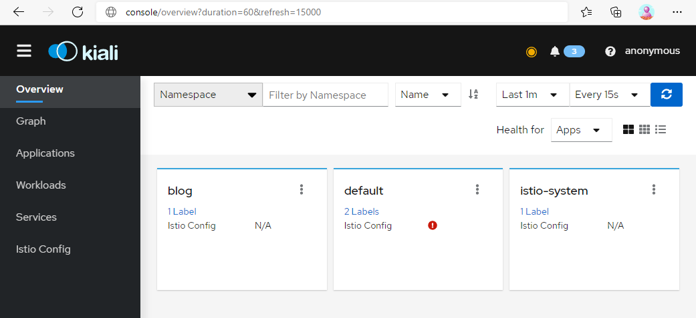


默认按照命名空间进行分类， BookInfo 应用部署在 default 命名空间之下，可以点击 default 命名空间之下的应用：

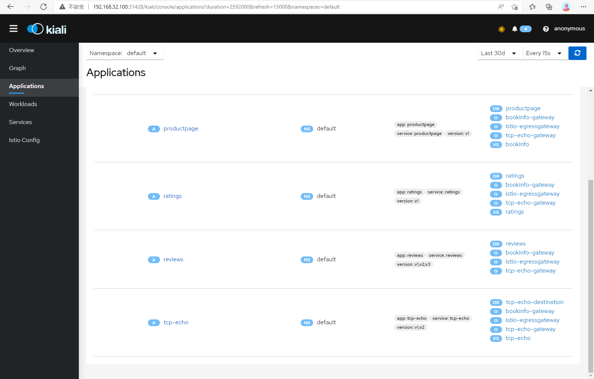


还切换到 Graph 页面下面查看微服务应用的整个调用链：

```javascript
 // 如果没有安装 prometheus,在 Graph 页面会显示不能连接到 prometheus
 // 如果安装了 prometheus 没有出现图标, 需要在浏览器中触发下调用链,
      http://192.168.32.100:31348/productpage
 // 然后刷新
 
 // 官方文档如下:
 To see trace data, you must send requests to your service.
 The number of requests depends on Istio’s sampling rate. 
 You set this rate when you install Istio. The default sampling rate is 1%. 
You need to send at least 100 requests before the first trace is visible.
To send a 100 requests to the productpage service, use the following command:
$ for i in $(seq 1 100); do curl -s -o /dev/null "http://$GATEWAY_URL/productpage"; done
```

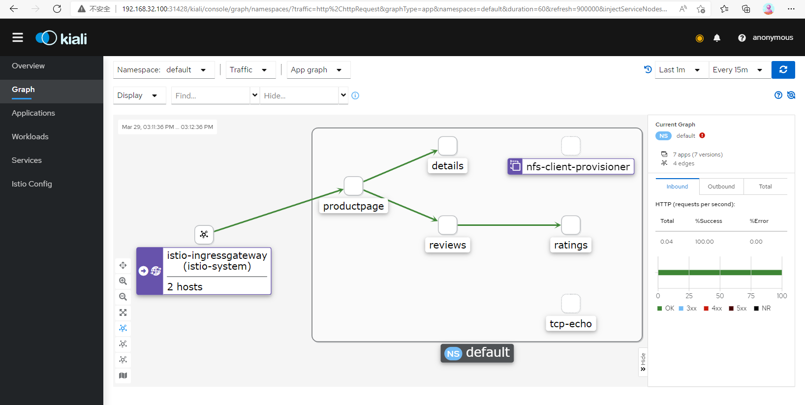


可以看到上图非常清晰的把 BookInfo 应用的调用链给展示出来了，这对于了解应用非常有帮助。在该页面还可以查看服务的详细信息、应用的指标、链路追踪等信息：

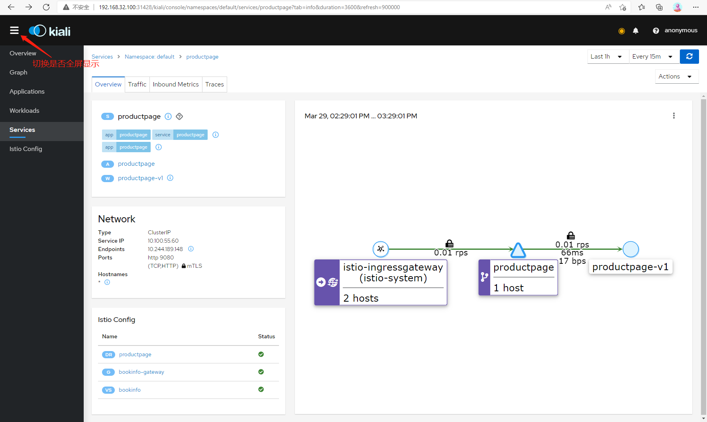


此外在 Istio Config 路径下面还可以查看整个网格中的配置校验情况：

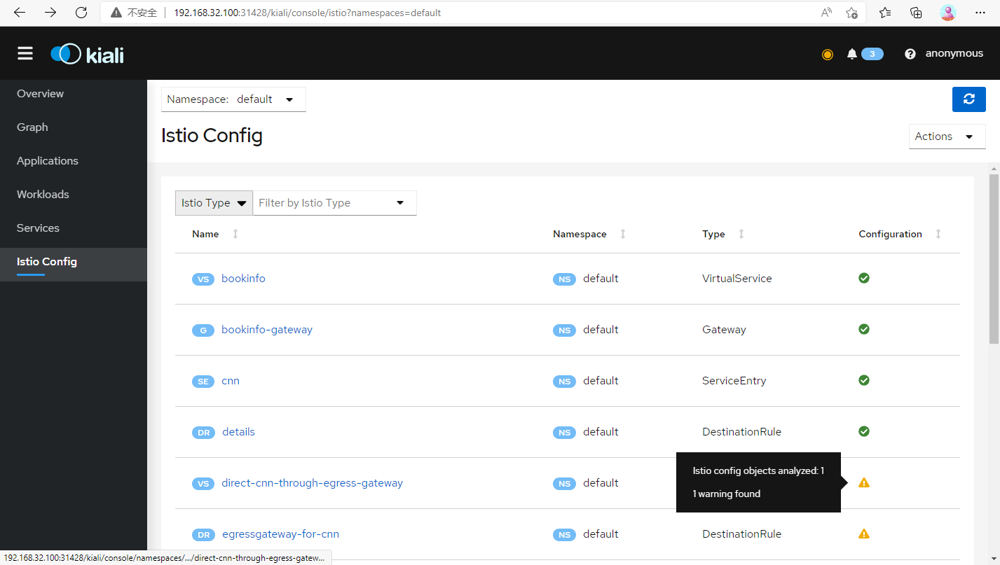


红色标记的表示验证未通过的配置，可以点击进去编辑错误的配置，此外还可以在页面上新建 Istio 的配置：

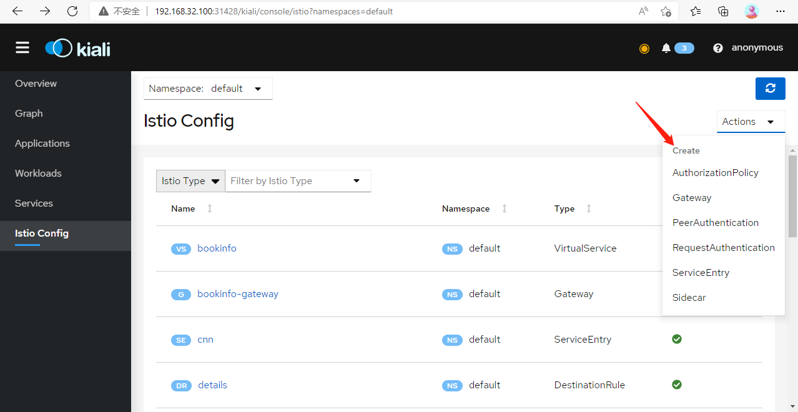

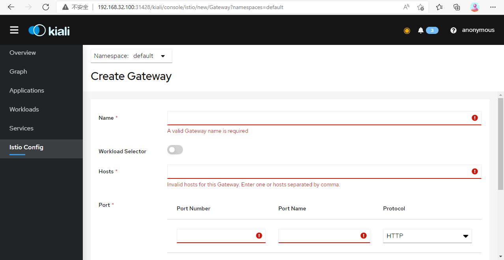


2.监控指标

上面已经部署了用于收集监控指标的 Prometheus 应用:

```javascript
[root@centos7 http]# kubectl get pods -n istio-system -l app=prometheus
NAME                          READY   STATUS    RESTARTS   AGE
prometheus-699b7cc575-nwdx6   2/2     Running   0          109m

[root@centos7 http]# kubectl get svc -n istio-system -l app=prometheus
NAME         TYPE        CLUSTER-IP    EXTERNAL-IP   PORT(S)    AGE
prometheus   ClusterIP   10.97.63.71   <none>        9090/TCP   109m

[root@centos7 http]#
```


为了测试方便可以将 Prometheus 的 Service 更改为 NodePort 类型：

```javascript
[root@centos7 http]# kubectl edit svc prometheus -n istio-system
......
spec:
  type: NodePort
......
service/prometheus edited

[root@centos7 http]# kubectl get svc -n istio-system -l app=prometheus
NAME         TYPE       CLUSTER-IP    EXTERNAL-IP   PORT(S)          AGE
prometheus   NodePort   10.97.63.71   <none>        9090:32072/TCP   111m
```


然后就可以通过 http://192.168.32.100:32072 访问 Prometheus 页面，默认情况下就已经抓取了很多任务：

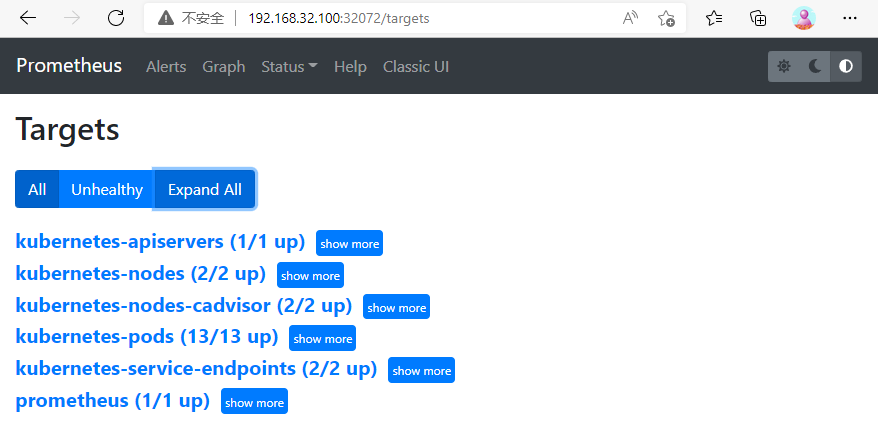


默认就已经收集了很多网格的指标，包括服务级别和代理级别（sidecar）的数据，自 Istio 1.5 起，Istio 标准指标由 Envoy 代理直接获取，之前是通过 Mixer 组件生成的。

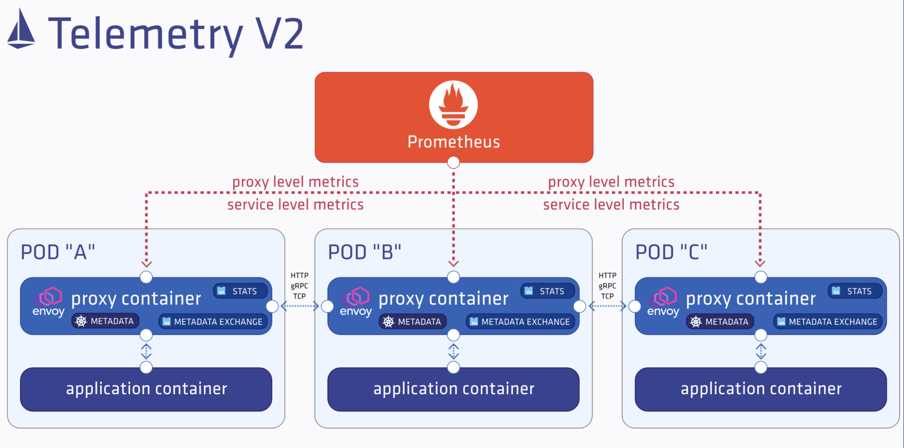

从上图可以看出现在的架构不需要 Mixer 这样的组件来完成了，在性能上得到了大幅度的提升，但是数据都需要通过 Envoy 代理来自己上传，扩展起来不是很方便，现在是通过 STATS 和 METADATA EXCHANGE 这两个插件来完成，但是扩展性没有以前的 Mixer 组件强大了，后续或许会使用 WebAssembly 这样的技术来解决这个问题。


对于 HTTP，HTTP/2 和 GRPC 流量，Istio 生成以下指标：

- 请求数（istio_requests_total）：这是一个用于累加每个由 Istio 代理所处理请求的 COUNTER 指标。

- 请求时长（istio_request_duration_seconds）：这是一个用于测量请求的持续时间的指标。

- 请求大小（istio_request_bytes）：这是一个用于测量 HTTP 请求 body 大小的指标。

- 响应大小（istio_response_bytes）：这是一个用于测量 HTTP 响应 body 大小的指标。


对于 TCP 流量，Istio 生成以下指标：

- TCP 发送字节数（istio_tcp_sent_bytes_total）：这是一个用于测量在 TCP 连接下响应期间发送的总字节数的 COUNTER 指标。

- TCP 接收字节数（istio_tcp_received_bytes_total）：这是一个用于测量在 TCP 连接下请求期间接收的总字节数的 COUNTER 指标。

- TCP 打开连接数（istio_tcp_connections_opened_total）：这是一个用于累加每个打开连接的 COUNTER 指标。

- TCP 关闭连接数 (istio_tcp_connections_closed_total) : 这是一个用于累加每个关闭连接的 COUNTER 指标。


3.使用 Grafana 可视化系统监控

上面了解到 Istio 网格中默认通过 Prometheus 收集了很多服务和代理相关的指标数据，此外 Istio 还提供 Grafana 工具，可以通过 Grafana 来可视化查看网格的监控状态。

```javascript
// 首先在 node 节点下载好镜像
[root@centos7 ~]# docker pull grafana/grafana:8.3.1

[root@centos7 istio-1.13.2]# kubectl apply -f samples/addons/grafana.yaml 
serviceaccount/grafana created
configmap/grafana created
service/grafana created
deployment.apps/grafana created
configmap/istio-grafana-dashboards created
configmap/istio-services-grafana-dashboards created

[root@centos7 ~]# kubectl -n istio-system get pod -l app=grafana
NAME                       READY   STATUS    RESTARTS   AGE
grafana-6c5dc6df7c-r7x9w   1/1     Running   0          5m40s

[root@centos7 ~]# kubectl -n istio-system get svc -l app.kubernetes.io/instance=grafana
NAME      TYPE        CLUSTER-IP     EXTERNAL-IP   PORT(S)    AGE
grafana   ClusterIP   10.99.249.47   <none>        3000/TCP   8m15s

// 同样这里将 grafana 的 Service 对象修改为 NodePort 类型的服务
[root@centos7 ~]# kubectl -n istio-system edit svc grafana
......
spec:
  type: NodePort
......
service/grafana edited

[root@centos7 ~]# kubectl -n istio-system get svc -l app.kubernetes.io/instance=grafana
NAME      TYPE       CLUSTER-IP     EXTERNAL-IP   PORT(S)          AGE
grafana   NodePort   10.99.249.47   <none>        3000:30328/TCP   11m
[root@centos7 ~]# 
```


然后可以通过 http://192.168.32.100:30328 访问 Grafana 应用：

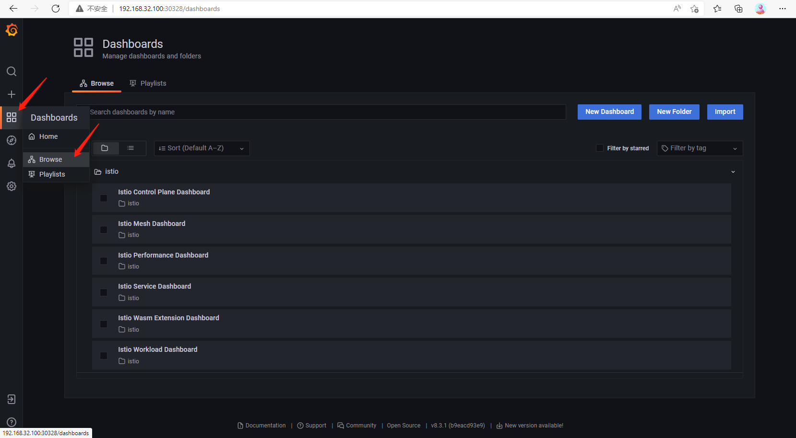


默认情况下 Grafana 中就已经导入了 Istio 的几个 Dashboard：

- Mesh Dashboard：主要是查看应用的数据，包括网格数据总览、服务视图、工作负载视图等 

- Performance Dashboard：主要是用于查看 Istio 本身的监控数据

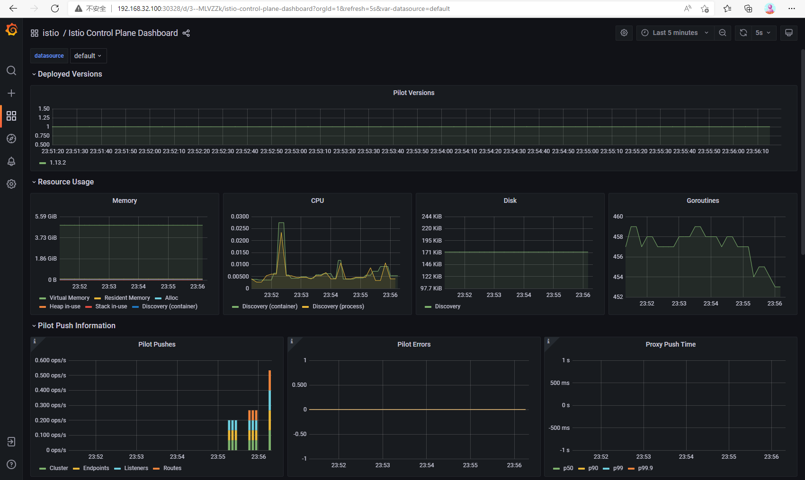


4.访问日志

官方文档： https://istio.io/latest/docs/tasks/observability/logs/access-log/

日志也是应用可观测性中一个非常重要的方式，也是传统调试应用非常重要的手段，在 Istio 中使用 Sidecar 容器对请求进行了拦截，无疑也增大了调试难度，但是同时 Istio 也可以监测到网格内的服务通信的流转情况，并生成详细的遥测日志数据，任何请求与事件的元信息都可以获取到，所以也非常有必要来查看 Istio 中的代理日志数据。Istio 最简单的日志类型是 Envoy 的访问日志，Envoy 代理打印访问日志信息到标准输出，然后就可以通过 kubectl logs 命令打印出来查看了。默认情况下 Istio 已经开启了 Envoy 访问日志，也可以通过 Istio 的 ConfigMap 配置来修改日志的格式：

```javascript
[root@centos7 istio-1.13.2]# kubectl -n istio-system edit cm istio
apiVersion: v1
data:
  mesh: |-
    accessLogEncoding: JSON
    # Istio will use the default access log format if accessLogFormat is not specified
    accessLogFormat: ""
    accessLogFile: /dev/stdout
    defaultConfig:
      discoveryAddress: istiod.istio-system.svc:15012
      proxyMetadata: {}
      tracing:
        zipkin:
          address: zipkin.istio-system:9411
    enablePrometheusMerge: true
    outboundTrafficPolicy:
      mode: REGISTRY_ONLY
......
configmap/istio edited
```


默认情况下日志就是输出到 stdout 上的 TEXT 文本格式，为了方便显示，这里将其设置为 JSON 格式，通过设置 accessLogFormat 属性来修改访问日志的格式，具体的访问日志格式可以查看 Envoy 官方文档了解配置规则。

```javascript
Envoy 官方文档: https://www.envoyproxy.io/docs/envoy/latest/configuration/observability/access_log/usage#format-rules
```

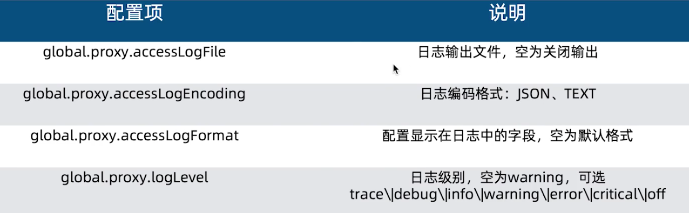


现在去访问 BookInfo 服务，同时来查看 productpage 的 sidecar 日志：

```javascript
[root@centos7 istio-1.13.2]# kubectl get pods -l app=productpage
NAME                              READY   STATUS    RESTARTS       AGE
productpage-v1-6b746f74dc-btfs6   2/2     Running   10 (82m ago)   5d3h

// 访问 BookInfo 服务
http://192.168.32.100:31348/productpage

[root@centos7 istio-1.13.2]# kubectl logs -f productpage-v1-6b746f74dc-btfs6 -c istio-proxy
......
{"duration":1,"response_flags":"-","connection_termination_details":null,"user_agent":"Mozilla/5.0 (Windows NT 10.0; Win64; x64) AppleWebKit/537.36 (KHTML, like Gecko) Chrome/99.0.4844.74 Safari/537.36 Edg/99.0.1150.55","upstream_host":"10.244.189.185:9080","response_code_details":"via_upstream","downstream_remote_address":"10.244.189.169:43056","authority":"details:9080","start_time":"2022-03-29T16:50:41.366Z","bytes_sent":178,"upstream_service_time":"1","x_forwarded_for":null,"upstream_transport_failure_reason":null,"route_name":"default","protocol":"HTTP/1.1","upstream_cluster":"outbound|9080||details.default.svc.cluster.local","response_code":200,"method":"GET","upstream_local_address":"10.244.189.169:38368","bytes_received":0,"path":"/details/0","request_id":"5edde801-aea1-961e-9781-55a075d87253","requested_server_name":null,"downstream_local_address":"10.108.4.200:9080"}
{"user_agent":"Mozilla/5.0 (Windows NT 10.0; Win64; x64) AppleWebKit/537.36 (KHTML, like Gecko) Chrome/99.0.4844.74 Safari/537.36 Edg/99.0.1150.55","downstream_local_address":"10.111.233.146:9080","path":"/reviews/0","bytes_received":0,"response_code_details":"via_upstream","method":"GET","upstream_transport_failure_reason":null,"protocol":"HTTP/1.1","duration":4,"request_id":"5edde801-aea1-961e-9781-55a075d87253","authority":"reviews:9080","response_code":200,"upstream_local_address":"10.244.189.169:33408","connection_termination_details":null,"bytes_sent":295,"x_forwarded_for":null,"response_flags":"-","downstream_remote_address":"10.244.189.169:44834","start_time":"2022-03-29T16:50:41.372Z","requested_server_name":null,"upstream_service_time":"4","route_name":"default","upstream_host":"10.244.189.145:9080","upstream_cluster":"outbound|9080||reviews.default.svc.cluster.local"}
{"response_flags":"-","upstream_host":"10.244.189.169:9080","connection_termination_details":null,"request_id":"5edde801-aea1-961e-9781-55a075d87253","protocol":"HTTP/1.1","route_name":"default","upstream_local_address":"127.0.0.6:50002","requested_server_name":"outbound_.9080_._.productpage.default.svc.cluster.local","downstream_remote_address":"10.244.139.0:0","start_time":"2022-03-29T16:50:41.361Z","method":"GET","response_code":200,"upstream_cluster":"inbound|9080||","user_agent":"Mozilla/5.0 (Windows NT 10.0; Win64; x64) AppleWebKit/537.36 (KHTML, like Gecko) Chrome/99.0.4844.74 Safari/537.36 Edg/99.0.1150.55","bytes_sent":4183,"x_forwarded_for":"10.244.139.0","authority":"192.168.32.100:31348","response_code_details":"via_upstream","upstream_service_time":"16","upstream_transport_failure_reason":null,"downstream_local_address":"10.244.189.169:9080","path":"/productpage","duration":16,"bytes_received":0}
```

这里查询的容器名 istio-proxy 其实就是 Envoy sidecar 代理，Envoy 将请求和响应日志都进行了打印并输出至 stdout ，所以可以通过 kubectl logs 查询。


正常会收到3条 JSON 格式日志，productpage 服务会调用 details 与 reviews 服务，所以可以看到一条访问 /reviews/0 与 /details/0 的 outbound 请求，和最终的 /productpage 的 inbound 请求记录。为了方便查看，这里将第一条日志进行格式化，如下所示：

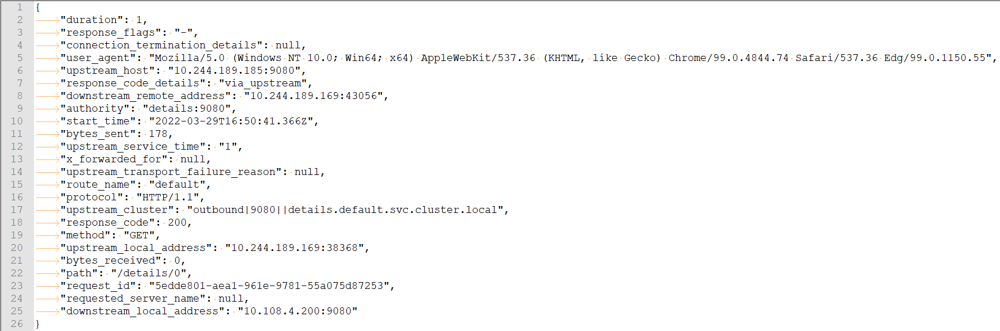

这里日志信息其实是一个标准的 Envoy 流量模型，所以如果要深入研究 Istio，对应 Envoy 的了解是必不可少的，其中最重要的几个字段就是 Envoy 流量五元组中的几个信息。


在 Envoy 中接受请求流量叫做 Downstream（下游），Envoy 发出请求流量叫做 Upstream（上游），在处理 Downstream 和 Upstream 过程中，分别会涉及2个流量端点，即请求的发起端和接收端：

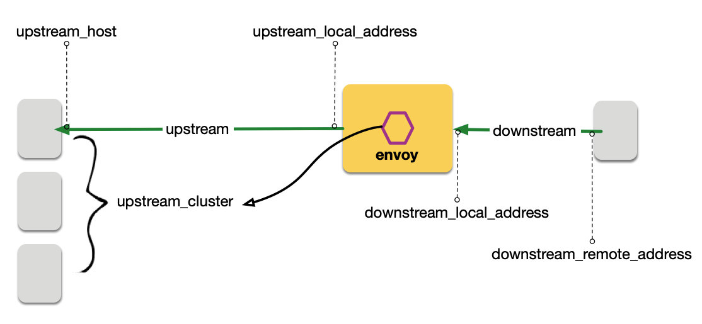

在这个过程中，Envoy 会根据用户规则，计算出符合条件的转发目的主机集合,这个集合叫做 UPSTREAM_CLUSTER, 并根据负载均衡规则，从这个集合中选择一个 host 作为流量转发的接收端点，这个 host 就是 UPSTREAM_HOST。这就是 Envoy 请求处理的流量五元组信息，这是 Envoy 日志里最重要的部分，通过这个五元组可以准确的观测流量「从哪里来」和「到哪里去」：

- downstream_remote_address

- downstream_local_address

- upstream_local_address

- upstream_host

- upstream_cluster


除了五元组信息之外，还有 request_id 属性，该属性主要用于链路追踪，可以将一条请求在不同的服务中的调用串联起来。


还有一个非常重要的属性 response_flags，可以通过该属性来查看当前请求的状态，用于调试请求的时候非常有用：

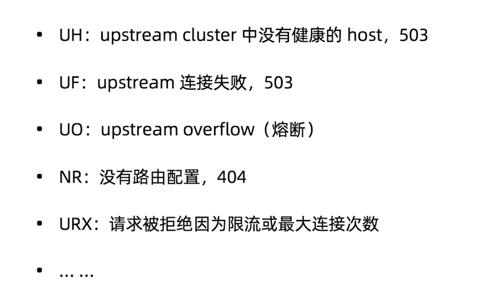

注意：当 Pod 被销毁后，旧日志将不复存在，也无法通过 kubectl logs 进行查看。所以如果要查看历史的的日志数据，可以使用 EFK 方案将日志进行收集。


5.分布式追踪

相比传统的单体应用，微服务的一个主要变化是将应用中的不同模块拆分为了独立的服务，在微服务架构下，原来进程内的方法调用成为了跨进程的远程方法调用。相对于单一进程内的方法调用而言，跨进程调用的调试和故障分析是非常困难的，难以使用传统的代码调试程序或者日志打印来对分布式的调用过程进行查看和分析。一个来自客户端的请求在其业务处理过程中很有可能需要经过多个微服务，如果想要对该请求的端到端调用过程进行完整的分析，则必须将该请求经过的所有进程的相关信息都收集起来并关联在一起，这就是分布式追踪，也是应用可观测性中非常重要的手段。


在 Istio 中通过分布式追踪可以让用户对跨多个分布式服务网格的一个请求进行追踪分析，进而可以通过可视化的方式更加深入地了解请求的延迟、序列化和并行度等。Istio 利用 Envoy 的分布式追踪功能提供了开箱即用的追踪集成，默认 Istio 提供了集成各种追踪后端服务的选项，并且可以通过配置代理来自动发送追踪 span 到追踪后端服务。

```javascript
Envoy 分布式追踪: https://www.envoyproxy.io/docs/envoy/v1.10.0/intro/arch_overview/tracing
```


在使用 Istio 的分布式追踪之前，需要先了解两个重要的概念: Span 与 Trace。

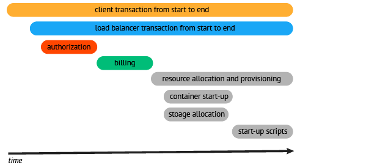

- Span：分布式追踪的基本组成单元，表示一个分布式系统中的单独的工作单元，每一个 Span 可以包含其它 Span 的引用。多个 Span 在一起构成了 Trace。

- Trace：微服务中记录的完整的请求执行过程，一个完整的 Trace 由一个或多个 Span 组成。


随着分布式追踪技术的发展，社区推出了 OpenTracing 这个规范，提供了标准的 API 规范、框架以及一些公共的库。目前比较知名的追踪工具基本上都通过 OpenTracing 进行实现，比如 Jaeger、Zipkin 等。

```javascript
OpenTracing: https://opentracing.io/
```


这里就介绍比较流行的 Jaeger。 Jaeger 是由 Uber 开源的分布式追踪系统，采用 Go 语言编写，主要借鉴了 Google Dapper 论文和 Zipkin 的设计，兼容 OpenTracing 以及 Zipkin 追踪格式，目前已成为 CNCF 基金会的开源项目。

```javascript
Jaeger官方文档：https://www.jaegertracing.io/
jaegerInstall：https://istio.io/latest/docs/ops/integrations/jaeger/#installation
Jaeger：https://istio.io/latest/docs/tasks/observability/distributed-tracing/jaeger/
```


安装 Jaeger 的两种方式：

方式1：快速安装，如下：

```javascript
$ kubectl apply -f https://raw.githubusercontent.com/istio/istio/release-1.13/samples/addons/jaeger.yaml
```


方式2：如果集群中已经有一个可以使用的 Jaeger 服务，可以使用下面的命令进行关联：

```javascript
$ istioctl install --set values.global.tracer.zipkin.address=<jaeger-collector-address>:9411
```


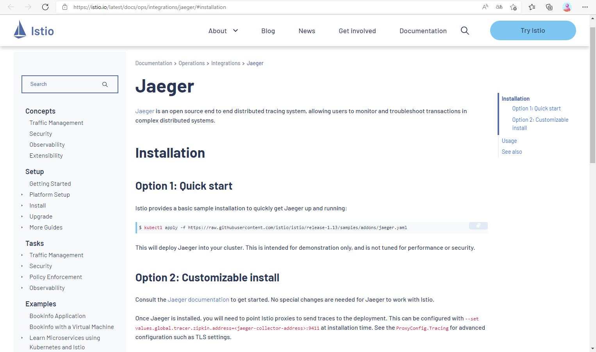

 


这里使用快速安装的方式：

```javascript
// 首先在 node 节点下载好镜像
[root@centos7 ~]# docker pull docker.io/jaegertracing/all-in-one:1.29

// 已提前下载 istio-1.13.2, 直接用本地文件进行安装
[root@centos7 istio-1.13.2]# kubectl apply -f samples/addons/jaeger.yaml
deployment.apps/jaeger created
service/tracing created
service/zipkin created
service/jaeger-collector created

[root@centos7 istio-1.13.2]# kubectl -n istio-system get pod -l app=jaeger
NAME                     READY   STATUS    RESTARTS   AGE
jaeger-9dd685668-htwdp   1/1     Running   0          83s

// 查看安装的 Jaeger 服务
[root@centos7 istio-1.13.2]# kubectl -n istio-system get svc -l app=jaeger
NAME               TYPE        CLUSTER-IP       EXTERNAL-IP   PORT(S)                        AGE
jaeger-collector   ClusterIP   10.100.184.178   <none>        14268/TCP,14250/TCP,9411/TCP   2m7s
tracing            ClusterIP   10.111.25.17     <none>        80/TCP,16685/TCP               2m8s

// 可以通过 tracing 这个 Service 来访问 Jaeger 的 Dashboard 页面，
// 同样为了方便测试将其修改为 NodePort 类型：
[root@centos7 istio-1.13.2]# kubectl -n istio-system edit svc tracing
......
spec:
  type: NodePort
......
service/tracing edited

// 修改完成后就可以在浏览器中通过 http://<NodeIP>:31179访问 Jaeger 的 Dashboard 页面
[root@centos7 istio-1.13.2]# kubectl -n istio-system get svc tracing
NAME      TYPE       CLUSTER-IP     EXTERNAL-IP   PORT(S)                        AGE
tracing   NodePort   10.111.25.17   <none>        80:31179/TCP,16685:32720/TCP   5m12s
```


在浏览器中访问：http://192.168.32.100:31179

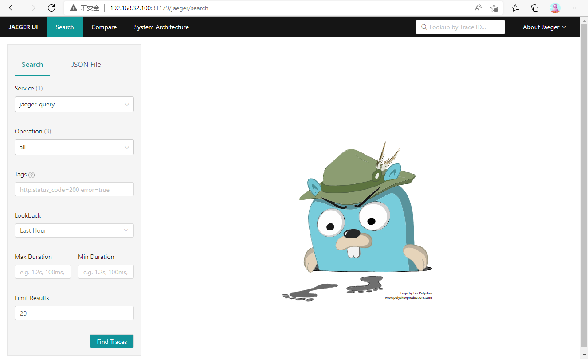


接下来重新访问 BookInfo 应用产生流量请求生成追踪数据。然后回到 Jaeger 页面，在左侧栏 Servcie 区域选择一个要追踪的服务，比如 details.default，点击 "Find Traces" 按钮查看追踪结果。

```javascript
浏览器中访问 BookInfo 应用：http://192.168.32.100:31348/productpage
```

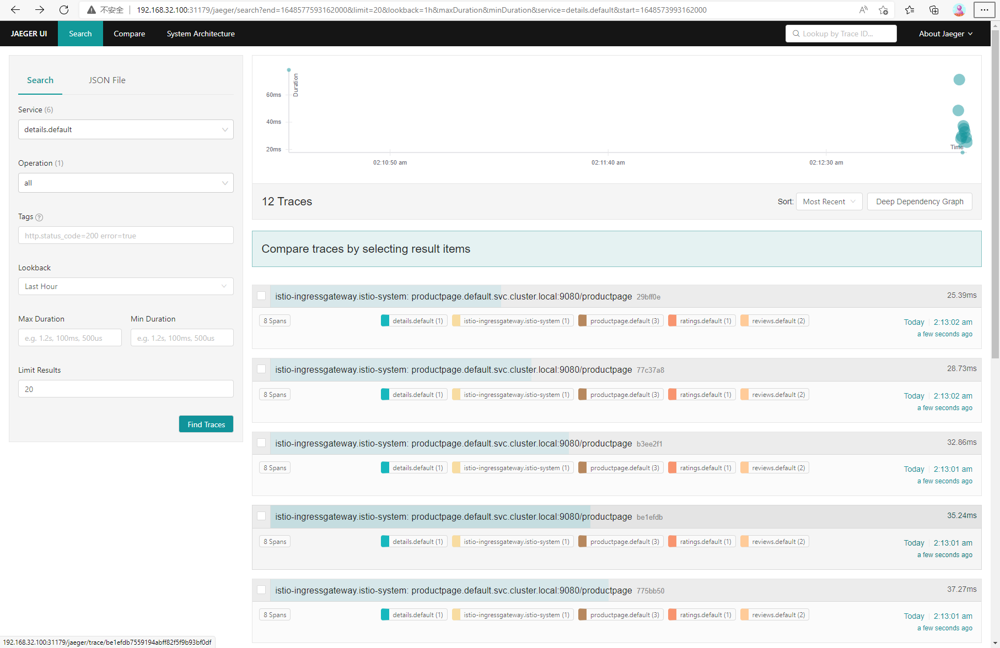


点击列表项目还可以查看追踪详细信息，记录了一次请求涉及到的 Services、深度、Span 总数、请求总时长等信息，也可以对下方的单项服务展开，观察每一个服务的请求耗时和详情。

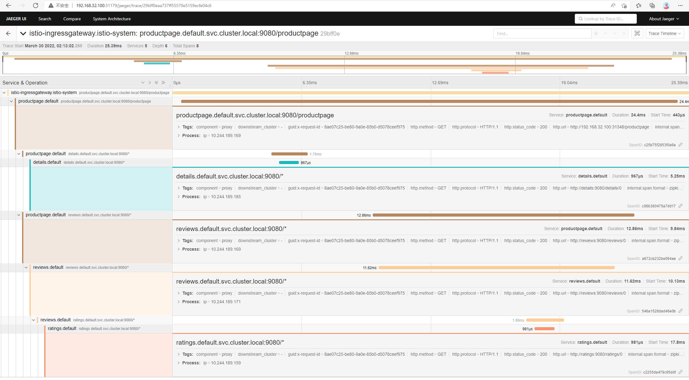


此外还可以切换 Trace 的显示方式为 Graph，在右上角点击 Trace Timeline 切换为 Trace Graph 模式，该模式下可以更加清晰查看到每一个调用详细信息：

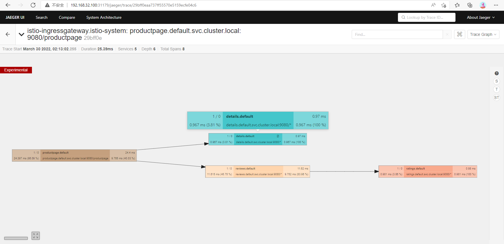


此外，Jaeger 还可以展示服务依赖，点击顶部的 System Architecture 菜单查看，该页面可以查看服务的完整依赖调用关系：

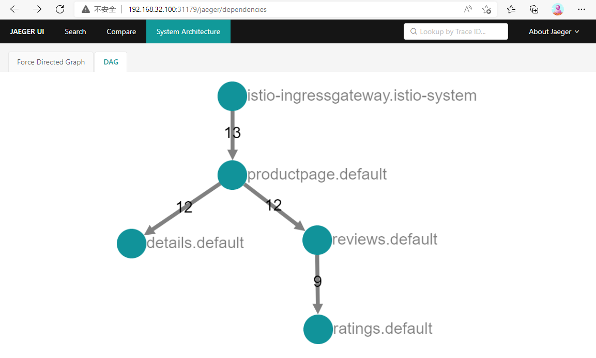


此外还可以对比两个 Trace，在顶部 Compare 菜单中，输入两个不同的 Trace ID 即可进行对比，这可以帮助发现不同 Trace 之间的差异：

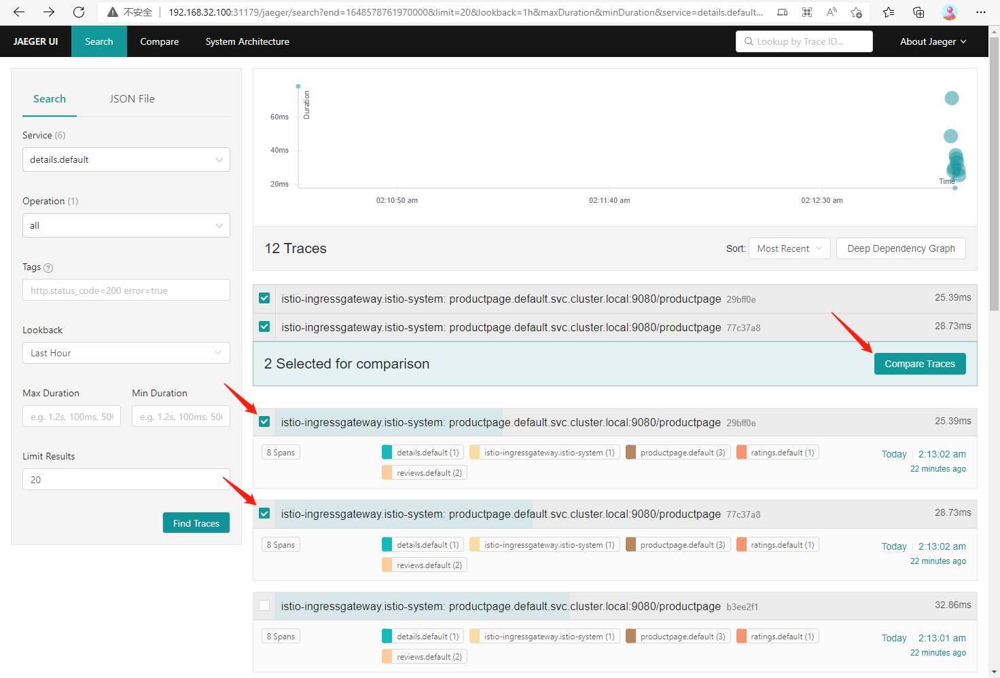

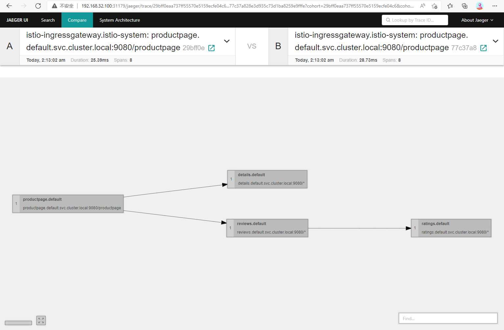


这就是 Jaeger 的基本使用，不过需要注意的是 Istio 默认提供的 Jaeger 采用内存的存储方式，Pod 被销毁后数据也就丢失了。在生产环境中需要单独配置持久化存储数据库，具体可查看 Jaeger 官方文档。

```javascript
Jaeger 官方文档：https://www.jaegertracing.io/docs/1.18/operator/#storage-options
```


到这里就完成了 Istio 中可观测性的实验：指标、日志、追踪，对于微服务应用可观测性对于监控和调试应用是非常重要的手段，非常有必要掌握这些方式。


删除本节所有测试对象:

```javascript
[root@centos7 istio-1.13.2]# kubectl delete deployment productpage-v1
[root@centos7 istio-1.13.2]# kubectl delete deployment details-v1
[root@centos7 istio-1.13.2]# kubectl delete deployment reviews-v1
[root@centos7 istio-1.13.2]# kubectl delete deployment reviews-v2
[root@centos7 istio-1.13.2]# kubectl delete deployment reviews-v3
[root@centos7 istio-1.13.2]# kubectl delete deployment ratings-v1
[root@centos7 istio-1.13.2]# kubectl delete deployment sleep

[root@centos7 istio-1.13.2]# kubectl delete svc productpage
[root@centos7 istio-1.13.2]# kubectl delete svc details
[root@centos7 istio-1.13.2]# kubectl delete svc reviews
[root@centos7 istio-1.13.2]# kubectl delete svc ratings
[root@centos7 istio-1.13.2]# kubectl delete svc sleep
```


修改容器的hosts文件：

https://www.cnblogs.com/xupccc/p/9838705.html


Docker容器如何修改hosts：

https://www.cnblogs.com/mrnx2004/p/11767354.html?ivk_sa=1024320u