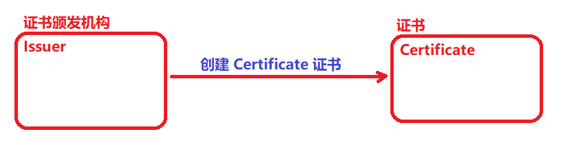
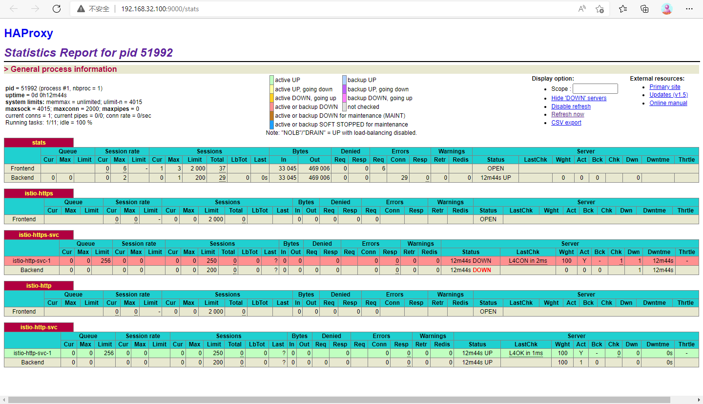
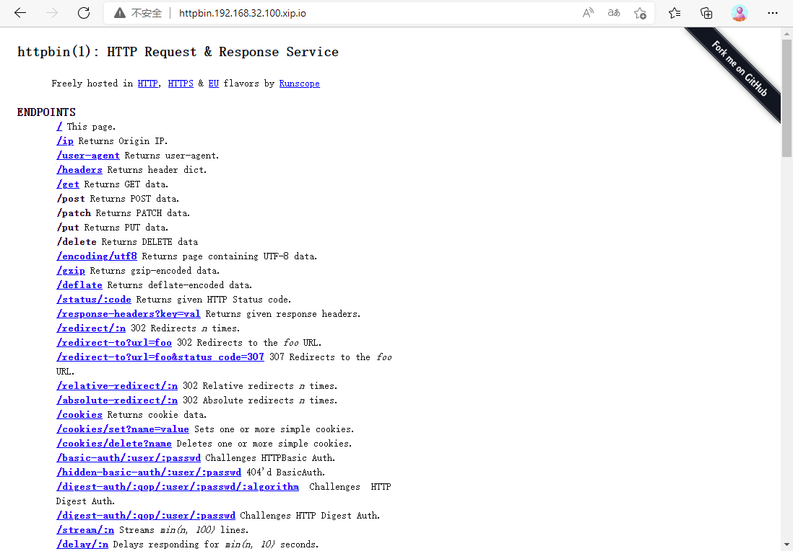
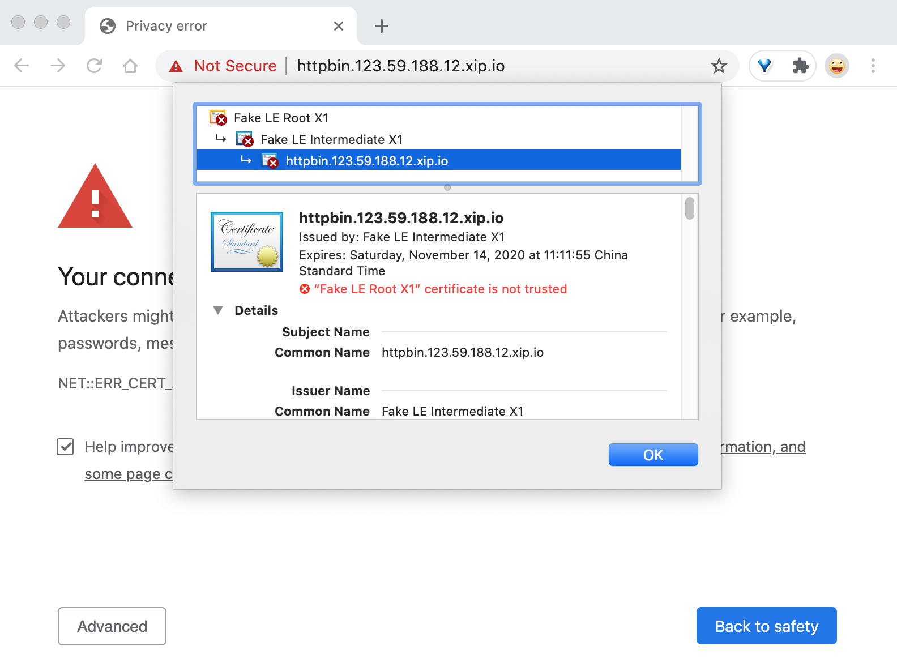
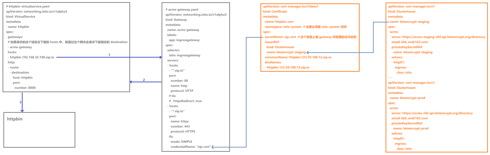
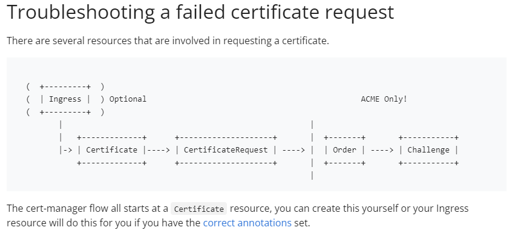

eeCertManager 自动 HTTPS

```javascript
cert-manager：https://cert-manager.io/
istio：https://istio.io/latest/docs/tasks/security/cert-management/custom-ca-k8s/
```

cert-manager 是一种自动执行证书管理的工具，它可以与 Istio Gateway 集成以管理 TLS 证书，当然也可以很方便地和前面我们配置的 ingress-nginx 或者 traefik 配合使用。对于和 Istio 的集成使用，无需特殊配置即可。


注意：在进行本节实验之前记得将前面章节的实验内容进行清空。


1. 安装：https://cert-manager.io/docs/installation/kubectl/

要在 Kubernetes 集群上安装 cert-manager 也非常简单，官方提供了一个单一的资源清单文件，包含了所有的资源对象，所以直接安装即可：

```javascript
// 在线安装
// kubectl apply -f https://github.com/cert-manager/cert-manager/releases/download/v1.7.2/cert-manager.yaml

// 这里把 yaml 文件下载到本地安装
// 首先在 node 节点准备好镜像
[root@centos7 ~]# docker pull quay.io/jetstack/cert-manager-cainjector:v1.7.2
[root@centos7 ~]# docker pull quay.io/jetstack/cert-manager-controller:v1.7.2
[root@centos7 ~]# docker pull quay.io/jetstack/cert-manager-webhook:v1.7.2

// 安装
// 会创建一个名为 cert-manager 的命名空间,安装大量的 CRD 以及 AdmissionWebhook 对象
[root@centos7 cert-manager]# kubectl apply -f cert-manager.yaml
customresourcedefinition.apiextensions.k8s.io/certificaterequests.cert-manager.io created
customresourcedefinition.apiextensions.k8s.io/certificates.cert-manager.io created
customresourcedefinition.apiextensions.k8s.io/challenges.acme.cert-manager.io created
......

// 通过如下命令来查看是否安装成功
[root@centos7 cert-manager]# kubectl get pods --namespace cert-manager
NAME                                       READY   STATUS    RESTARTS   AGE
cert-manager-86b4798576-llsdj              1/1     Running   0          9m24s
cert-manager-cainjector-85656d565c-6xpwh   1/1     Running   0          9m24s
cert-manager-webhook-8665f985d6-8vznt      1/1     Running   0          9m24s


//  正常情况下可以看到如下几个 Pod 处于 Running 状态：
//        cert-manager
//        cert-manager-cainjector
//        cert-manager-webhook 
```


可以通过下面的测试来验证是否可以签发基本的证书类型，创建一个 Issuer 资源对象来测试 webhook 工作是否正常(在开始签发证书之前，必须在群集中至少配置一个 Issuer 或 ClusterIssuer 资源)：

```javascript
# test-resources.yaml
apiVersion: v1
kind: Namespace
metadata:
  name: cert-manager-test
---
apiVersion: cert-manager.io/v1
kind: Issuer
metadata:
  name: test-selfsigned
  namespace: cert-manager-test
spec:
  selfSigned: {}  # 配置自签名的证书机构类型
---
apiVersion: cert-manager.io/v1
kind: Certificate
metadata:
  name: selfsigned-cert
  namespace: cert-manager-test
spec:
  dnsNames:
  - example.com
  secretName: selfsigned-cert-tls
  issuerRef:
    name: test-selfsigned
```

这里创建一个名为 cert-manager-test 的命名空间，创建了一个 Issuer 的证书颁发机构，然后使用这个 Issuer 来创建一个证书 Certificate 对象。

```javascript
// 直接创建上面的资源清单:
[root@centos7 cert-manager]# kubectl apply -f test-resources.yaml 
namespace/cert-manager-test created
issuer.cert-manager.io/test-selfsigned created
certificate.cert-manager.io/selfsigned-cert created

// 创建完成后可以检查新创建的证书状态
// 在 cert-manager 处理证书请求之前，可能需要稍微等几秒
[root@centos7 cert-manager]# kubectl describe certificate -n cert-manager-test
Name:         selfsigned-cert
Namespace:    cert-manager-test
Labels:       <none>
Annotations:  <none>
API Version:  cert-manager.io/v1
Kind:         Certificate
Metadata:
  Creation Timestamp:  2022-04-02T06:08:38Z
  Generation:          1
  Managed Fields:
    API Version:  cert-manager.io/v1
    Fields Type:  FieldsV1
    fieldsV1:
      f:metadata:
        f:annotations:
          .:
          f:kubectl.kubernetes.io/last-applied-configuration:
      f:spec:
        .:
        f:dnsNames:
        f:issuerRef:
          .:
          f:name:
        f:secretName:
    Manager:      kubectl-client-side-apply
    Operation:    Update
    Time:         2022-04-02T06:08:38Z
    API Version:  cert-manager.io/v1
    Fields Type:  FieldsV1
    fieldsV1:
      f:status:
        .:
        f:conditions:
        f:notAfter:
        f:notBefore:
        f:renewalTime:
        f:revision:
    Manager:         controller
    Operation:       Update
    Subresource:     status
    Time:            2022-04-02T06:08:39Z
  Resource Version:  1520032
  Self Link:         /apis/cert-manager.io/v1/namespaces/cert-manager-test/certificates/selfsigned-cert
  UID:               9d82a07a-770c-43f4-8e3f-4b36f6220d03
Spec:
  Dns Names:
    example.com
  Issuer Ref:
    Name:       test-selfsigned
  Secret Name:  selfsigned-cert-tls
Status:
  Conditions:
    Last Transition Time:  2022-04-02T06:08:39Z
    Message:               Certificate is up to date and has not expired
    Observed Generation:   1
    Reason:                Ready
    Status:                True
    Type:                  Ready
  Not After:               2022-07-01T06:08:39Z
  Not Before:              2022-04-02T06:08:39Z
  Renewal Time:            2022-06-01T06:08:39Z
  Revision:                1
Events:
  Type    Reason     Age    From          Message
  ----    ------     ----   ----          -------
  Normal  Issuing    2m24s  cert-manager  Issuing certificate as Secret does not exist
  Normal  Generated  2m23s  cert-manager  Stored new private key in temporary Secret resource "selfsigned-cert-4g9tr"
  Normal  Requested  2m23s  cert-manager  Created new CertificateRequest resource "selfsigned-cert-lpbwh"
  Normal  Issuing    2m23s  cert-manager  The certificate has been successfully issued       
```


从上面的 Events 事件中可以看到证书已经成功签发，到这里证明 cert-manager 已经安装成功。而且需要注意的是 cert-manager 的功能非常强大，不只是可以支持 ACME 类型的证书签发，还支持其他众多的类型，比如 SelfSigned(自签名)、CA、Vault、Venafi、External、ACME，只是一般主要是使用 ACME 来生成自动化的证书。




2. 环境配置

由于通过 ACME 做自动化证书的时候，需要暴露 80 和 443 端口，当然如果使用 DNS 校验方式也可以，但是有时候根本就没有域名的情况下想要实现自动化证书，可以使用 xip.io 这类的服务来实现。前面部署 istio-ingressgateway 的时候是通过 NodePort 类暴露的服务，所以需要在前面加一个 LB 来转发下请求。这里为了简单，直接使用 haproxy 来监听节点的 80 和 443 端口，将请求转发到后端的 NodePort 端口。

```javascript
HAProxy: https://www.haproxy.com/
  是一款提供高可用性、负载均衡以及基于TCP（第四层）和HTTP（第七层）应用的代理软件
  支持虚拟主机，它是免费、快速并且可靠的一种解决方案
```


```javascript
// 首先安装 haproxy，在 master 节点安装
[root@centos7 cert-manager]# yum install -y haproxy

// 查看 istio-ingressgateway 的 NodePort 端口
[root@centos7 cert-manager]# kubectl get svc istio-ingressgateway -n istio-system
NAME                   TYPE           CLUSTER-IP      EXTERNAL-IP   PORT(S)                                                                      AGE
istio-ingressgateway   LoadBalancer   10.104.91.142   <pending>     15021:31739/TCP,80:31348/TCP,443:32375/TCP,31400:31775/TCP,15443:31305/TCP   8d

// 备份 haproxy 的原配置文件
[root@centos7 cert-manager]# cp /etc/haproxy/haproxy.cfg /etc/haproxy/haproxy.cfg.backup
[root@centos7 cert-manager]# ls /etc/haproxy/
haproxy.cfg  haproxy.cfg.backup

// 然后配置 haproxy，配置文件 /etc/haproxy/haproxy.cfg
// 其中的 31348 与 32375 端口是 istio-ingressgateway 的 NodePort 端口
// 内容如下所示：
[root@centos7 cert-manager]# vi /etc/haproxy/haproxy.cfg
listen stats
  bind    *:9000
  mode    http
  stats   enable
  stats   hide-version
  stats   uri       /stats
  stats   refresh   30s
  stats   realm     Haproxy\ Statistics
  stats   auth      Admin:Password

frontend istio-https
    bind *:443
    mode tcp
    option tcplog
    tcp-request inspect-delay 5s
    tcp-request content accept if { req.ssl_hello_type 1 }
    default_backend istio-https-svc

backend istio-https-svc
    mode tcp
    option tcplog
    option tcp-check
    balance roundrobin
    default-server inter 10s downinter 5s rise 2 fall 2 slowstart 60s maxconn 250 maxqueue 256 weight 100
    server istio-http-svc-1 127.0.0.1:32375 check

frontend istio-http
    bind *:80
    mode tcp
    option tcplog
    default_backend istio-http-svc

backend istio-http-svc
    mode tcp
    option tcplog
    option tcp-check
    balance roundrobin
    default-server inter 10s downinter 5s rise 2 fall 2 slowstart 60s maxconn 250 maxqueue 256 weight 100
    server istio-http-svc-1 127.0.0.1:31348 check

// 配置完成后直接启动 haproxy 即可：
[root@centos7 cert-manager]# sudo systemctl start haproxy
[root@centos7 cert-manager]# sudo systemctl enable haproxy
[root@centos7 cert-manager]# sudo systemctl status haproxy

// 然后可以通过上面 9000 端口监控 haproxy 的运行状态
```


浏览器中访问 http://192.168.32.100:9000/stats，注意这里是 Master 节点 IP。 

- 用户名：Admin

- 密 码：Password




3.与 Istio 集成


首先创建 httpbin 应用：

```javascript
# httpbin.yaml
apiVersion: v1
kind: Service
metadata:
  name: httpbin
  labels:
    app: httpbin
spec:
  ports:
  - name: http
    port: 8000
  selector:
    app: httpbin
---
apiVersion: apps/v1
kind: Deployment
metadata:
  name: httpbin
spec:
  replicas: 1
  selector:
    matchLabels:
      app: httpbin
      version: v1
  template:
    metadata:
      labels:
        app: httpbin
        version: v1
    spec:
      containers:
      - image: docker.io/citizenstig/httpbin
        imagePullPolicy: IfNotPresent
        name: httpbin
        ports:
        - containerPort: 8000
```

```javascript
[root@centos7 cert-manager]# kubectl apply -f httpbin.yaml 
service/httpbin created
deployment.apps/httpbin created
```


这里通过 cert-manager 为前面的 httpbin 应用配置自动的 HTTPS，首先单独创建一个用于 cert-manager 的自定义的 Gateay，注意：在配置 Gateway 的时候 tls 的 credentialName 代表的是 cert-manager 自动生成的证书名称。如下所示：

```javascript
# acme-gateway.yaml
apiVersion: networking.istio.io/v1alpha3
kind: Gateway
metadata:
  name: acme-gateway
  labels:
    app: ingressgateway
spec:
  selector:
    istio: ingressgateway
  servers:
  - hosts:
    - "*.xip.io"
    port:
      number: 80
      name: http
      protocol: HTTP
    # tls:
    #   httpsRedirect: true
  - hosts:
    - "*.xip.io"
    port:
      name: https
      number: 443
      protocol: HTTPS
    tls:
      mode: SIMPLE
      credentialName: "xip-cert"
```

```javascript
[root@centos7 cert-manager]# kubectl apply -f acme-gateway.yaml 
gateway.networking.istio.io/acme-gateway created
```


接下来创建 VirtulService 对象，这里使用 https 方式的 ACME 证书校验方式，除了 http 方式之外还有 tls 与 dns 方式的校验，dns 方式的证书校验支持通配符的域名。所以需要为 /.well-known/ 这个 PATH 路径做一个正确的配置，方便进行 http 校验：

```javascript
# httpbin-virtualservice.yaml
apiVersion: networking.istio.io/v1alpha3
kind: VirtualService
metadata:
  name: httpbin
spec:
  gateways:
  - acme-gateway
  hosts:
  - httpbin.192.168.32.100.xip.io
  http:
  - route:
    - destination:
        host: httpbin
        port:
          number: 8000
```

```javascript
[root@centos7 cert-manager]# kubectl apply -f httpbin-virtualservice.yaml
virtualservice.networking.istio.io/httpbin created

// 在本机 host 文件中配置如下域名映射：
//   192.168.32.100   httpbin.192.168.32.100.xip.io

```


部署完成后可以通过访问  http://httpbin.192.168.32.100.xip.io/  来验证是否已经部署成功：




接下来创两个 ClusterIssuer，一个用于测试，一个用于正式使用：

```javascript
ACME | cert-manager：https://cert-manager.io/docs/configuration/acme/
```

```javascript
# clusterissuer.yaml
apiVersion: cert-manager.io/v1
kind: ClusterIssuer
metadata:
  name: letsencrypt-staging
spec:
  acme:
    server: https://acme-staging-v02.api.letsencrypt.org/directory
    email: kkk_en@163.com
    privateKeySecretRef:
      name: letsencrypt-staging
    solvers:
    - http01:
        ingress:
          class: istio  
---
apiVersion: cert-manager.io/v1
kind: ClusterIssuer
metadata:
  name: letsencrypt-prod
spec:
  acme:
    server: https://acme-v02.api.letsencrypt.org/directory
    email: kkk_en@163.com
    privateKeySecretRef:
      name: letsencrypt-prod
    solvers:
    - http01:
        ingress:
          class: istio  
```

```javascript
[root@centos7 cert-manager]# kubectl apply -f clusterissuer.yaml 
clusterissuer.cert-manager.io/letsencrypt-staging created
clusterissuer.cert-manager.io/letsencrypt-prod created

[root@centos7 cert-manager]# kubectl describe ClusterIssuer letsencrypt-staging
Name:         letsencrypt-staging
......
Status:
  Acme:
    Last Registered Email:  kkk_en@163.com
    Uri:                    https://acme-staging-v02.api.letsencrypt.org/acme/acct/49383748
  Conditions:
    Last Transition Time:  2022-04-02T08:11:41Z
    Message:               The ACME account was registered with the ACME server
    Observed Generation:   1
    Reason:                ACMEAccountRegistered
    Status:                True
    Type:                  Ready
Events:                    <none>

[root@centos7 cert-manager]# kubectl describe ClusterIssuer letsencrypt-prod
Name:         letsencrypt-prod
......
Status:
  Acme:
    Last Registered Email:  kkk_en@163.com
    Uri:                    https://acme-v02.api.letsencrypt.org/acme/acct/479246310
  Conditions:
    Last Transition Time:  2022-04-02T08:11:41Z
    Message:               The ACME account was registered with the ACME server
    Observed Generation:   1
    Reason:                ACMEAccountRegistered
    Status:                True
    Type:                  Ready
Events:                    <none>
```


然后创建一个 Certificate 对象来获取证书，由于 Istio 需要在它的命名空间下面有证书，所以需要在 istio-system 这个命名空间下面创建:

```javascript
Certificate | cert-manager：https://cert-manager.io/docs/concepts/certificate/
```

```javascript
# certificate.yaml
apiVersion: cert-manager.io/v1
kind: Certificate
metadata:
  name: httpbin-cert
  namespace: istio-system  # 这里必须是 istio-system 空间
spec:
  secretName: xip-cert     # 这个就是上面 gateway 所配置的证书名称
  issuerRef:
    kind: ClusterIssuer
    name: letsencrypt-staging
  commonName: httpbin.192.168.32.100.xip.io
  dnsNames:
  - httpbin.192.168.32.100.xip.io
  
```

```javascript
[root@centos7 cert-manager]# kubectl apply -f certificate.yaml 
certificate.cert-manager.io/httpbin-cert created
```


创建完成后这时候查看 istio-system 空间应该会有一个 cm-acme-http-solver- 这个开头的 Pod、Servie、Ingress 资源对象：

```javascript
[root@centos7 cert-manager]# kubectl get pods -n istio-system
NAME                                    READY   STATUS    RESTARTS       AGE
cm-acme-http-solver-4hbgr               1/1     Running   0              75s
......

[root@centos7 cert-manager]# kubectl get svc -n istio-system
NAME                        TYPE           CLUSTER-IP       EXTERNAL-IP   PORT(S)                                                                      AGE
cm-acme-http-solver-6zdqp   NodePort       10.99.137.13     <none>        8089:31631/TCP                                                               2m9s
......

[root@centos7 cert-manager]# kubectl get ingress -n istio-system
NAME                        CLASS    HOSTS                           ADDRESS   PORTS   AGE
cm-acme-http-solver-nwjtn   <none>   httpbin.192.168.32.100.xip.io             80      2m38s
```


下面的步骤没有操作成功，没有找到原因！

隔一小会儿去查看上面部署的 Certificate 对象的状态：

```javascript
[root@centos7 cert-manager]#  kubectl describe certificate httpbin-cert -n istio-system
......
Events:
  Type    Reason     Age    From          Message
  ----    ------     ----   ----          -------
  Normal  Issuing    13m    cert-manager  Issuing certificate as Secret does not exist
  Normal  Generated  13m    cert-manager  Stored new private key in temporary Secret resource "http-cert-6cml8"
  Normal  Requested  13m    cert-manager  Created new CertificateRequest resource "http-cert-9wcg2"
  Normal  Issuing    6m17s  cert-manager  The certificate has been successfully issued
  
//看到最后的信息 The certificate has been successfully issued 证明证书获取成功
```


但是这个时候如果通过 https 去访问的话还是会提示证书错误的，因为获取的是 staging 环境的证书：



这个时候重新更新 httpbin-cert 这个 Certificate 对象中引用的 issuer，更改为正式环境的 issuer，或者使用正式的签名机构新建一个证书对象，正常就可以获得线上环境的证书。



```javascript
Certmanager - K8S训练营 (qikqiak.com)：
https://www.qikqiak.com/k8strain/istio/cert-manager/
```


遇到的问题:

遇到问题1：Certificate 对象的状态为 False， 如下：

```javascript
[root@centos7 cert-manager]# kubectl get certificate -n istio-system
NAME           READY   SECRET     AGE
httpbin-cert   False   xip-cert   119m

[root@centos7 cert-manager]# kubectl describe certificate httpbin-cert -n istio-system
Name:         httpbin-cert
Namespace:    istio-system
......
Events:
  Type    Reason     Age   From          Message
  ----    ------     ----  ----          -------
  Normal  Issuing    13m   cert-manager  Issuing certificate as Secret does not exist
  Normal  Generated  13m   cert-manager  Stored new private key in temporary Secret resource "httpbin-cert-j45pk"
  Normal  Requested  13m   cert-manager  Created new CertificateRequest resource "httpbin-cert-hw8v7"
  
 // 等了很长时间证书都不能获取成功。
 
 [root@centos7 cert-manager]# kubectl get Secret -n istio-system | grep httpbin
httpbin-cert-hw8v7                                 Opaque                                1      3s
```


原因分析:

```javascript
[root@centos7 cert-manager]# kubectl get deployment  -n cert-manager
NAME                      READY   UP-TO-DATE   AVAILABLE   AGE
cert-manager              1/1     1            1           17h
cert-manager-cainjector   1/1     1            1           17h
cert-manager-webhook      1/1     1            1           17h

[root@centos7 cert-manager]# kubectl get pods -n cert-manager
NAME                                       READY   STATUS    RESTARTS        AGE
cert-manager-86b4798576-llsdj              1/1     Running   1 (4h57m ago)   17h
cert-manager-cainjector-85656d565c-6xpwh   1/1     Running   1 (4h57m ago)   17h
cert-manager-webhook-8665f985d6-8vznt      1/1     Running   1 (4h57m ago)   17h

[root@centos7 cert-manager]# kubectl logs cert-manager-86b4798576-llsdj -n cert-manager
......
I0402 10:57:00.647025       1 pod.go:59] cert-manager/challenges/http01/selfCheck/http01/ensurePod "msg"="found one existing HTTP01 solver pod" "dnsName"="httpbin.192.168.32.100.xip.io" "related_resource_kind"="Pod" "related_resource_name"="cm-acme-http-solver-5hz4c" "related_resource_namespace"="istio-system" "related_resource_version"="v1" "resource_kind"="Challenge" "resource_name"="httpbin-cert-85lrp-305099323-1239461212" "resource_namespace"="istio-system" "resource_version"="v1" "type"="HTTP-01" 
I0402 10:57:00.647106       1 service.go:43] cert-manager/challenges/http01/selfCheck/http01/ensureService "msg"="found one existing HTTP01 solver Service for challenge resource" "dnsName"="httpbin.192.168.32.100.xip.io" "related_resource_kind"="Service" "related_resource_name"="cm-acme-http-solver-2xvsj" "related_resource_namespace"="istio-system" "related_resource_version"="v1" "resource_kind"="Challenge" "resource_name"="httpbin-cert-85lrp-305099323-1239461212" "resource_namespace"="istio-system" "resource_version"="v1" "type"="HTTP-01" 
I0402 10:57:00.647146       1 ingress.go:98] cert-manager/challenges/http01/selfCheck/http01/ensureIngress "msg"="found one existing HTTP01 solver ingress" "dnsName"="httpbin.192.168.32.100.xip.io" "related_resource_kind"="Ingress" "related_resource_name"="cm-acme-http-solver-8wp44" "related_resource_namespace"="istio-system" "related_resource_version"="v1" "resource_kind"="Challenge" "resource_name"="httpbin-cert-85lrp-305099323-1239461212" "resource_namespace"="istio-system" "resource_version"="v1" "type"="HTTP-01" 
E0402 10:57:00.708560       1 sync.go:186] cert-manager/challenges "msg"="propagation check failed" "error"="failed to perform self check GET request 'http://httpbin.192.168.32.100.xip.io/.well-known/acme-challenge/sB000S8FJLXwxUEAbvZHpgSV_7BKo2NvZLJHxTg92ZM': Get \"http://httpbin.192.168.32.100.xip.io/.well-known/acme-challenge/sB000S8FJLXwxUEAbvZHpgSV_7BKo2NvZLJHxTg92ZM\": dial tcp: lookup httpbin.192.168.32.100.xip.io on 10.96.0.10:53: no such host" "dnsName"="httpbin.192.168.32.100.xip.io" "resource_kind"="Challenge" "resource_name"="httpbin-cert-85lrp-305099323-1239461212" "resource_namespace"="istio-system" "resource_version"="v1" "type"="HTTP-01" 

// 原因：不能解析域名"httpbin.192.168.32.100"
```


解决方法：在容器的 host 文件中域名映射

```javascript
// 给容器添加域名映射
[root@centos7 cert-manager]# kubectl edit deployment cert-manager -n cert-manager
......
    spec:
      hostAliases:
      - ip: 192.168.32.100
        hostnames:
        - httpbin.192.168.32.100.xip.io
      containers:
      - args:
......
deployment.apps/cert-manager edited

[root@centos7 cert-manager]# kubectl get pod  -n cert-manager
NAME                                       READY   STATUS    RESTARTS        AGE
cert-manager-79d88dc59b-srsk8              1/1     Running   0               82s
cert-manager-cainjector-85656d565c-6xpwh   1/1     Running   1 (5h39m ago)   18h
cert-manager-webhook-8665f985d6-8vznt      1/1     Running   1 (5h39m ago)   18h

```


遇到问题2：添加域名后报如下错误，暂时没有找到解决方法!

```javascript
[root@centos7 cert-manager]# kubectl describe certificate httpbin-cert -n istio-system
Name:         httpbin-cert
Namespace:    istio-system
......
Events:
  Type     Reason     Age   From          Message
  ----     ------     ----  ----          -------
  Normal   Issuing    18m   cert-manager  Issuing certificate as Secret does not exist
  Normal   Generated  18m   cert-manager  Stored new private key in temporary Secret resource "httpbin-cert-z4h7x"
  Normal   Requested  18m   cert-manager  Created new CertificateRequest resource "httpbin-cert-gm4r2"
  Warning  Failed     18m   cert-manager  The certificate request has failed to complete and will be retried: Failed to wait for order resource "httpbin-cert-gm4r2-305099323" to become ready: order is in "invalid" state:

[root@centos7 cert-manager]# kubectl get pods -n cert-manager
NAME                                       READY   STATUS    RESTARTS        AGE
cert-manager-79d88dc59b-srsk8              1/1     Running   1 (5h22m ago)   17h
cert-manager-cainjector-85656d565c-6xpwh   1/1     Running   1 (5h22m ago)   17h
cert-manager-webhook-8665f985d6-8vznt      1/1     Running   1 (5h22m ago)   17h

[root@centos7 cert-manager]# kubectl logs cert-manager-79d88dc59b-srsk8 -n cert-manager 
......
E0402 11:58:32.753002       1 controller.go:102] ingress 'istio-system/cm-acme-http-solver-82mgg' in work queue no longer exists
I0402 11:58:32.927273       1 conditions.go:190] Found status change for Certificate "httpbin-cert" condition "Issuing": "True" -> "False"; setting lastTransitionTime to 2022-04-02 11:58:32.927265205 +0000 UTC m=+1036.032807893
I0402 11:58:32.953496       1 trigger_controller.go:160] cert-manager/certificates-trigger "msg"="Not re-issuing certificate as an attempt has been made in the last hour" "key"="istio-system/httpbin-cert" "retry_delay"=3599046521646
I0402 11:58:32.981776       1 trigger_controller.go:160] cert-manager/certificates-trigger "msg"="Not re-issuing certificate as an attempt has been made in the last hour" "key"="istio-system/httpbin-cert" "retry_delay"=3599018253913
I0402 11:58:32.986608       1 controller.go:161] cert-manager/certificates-key-manager "msg"="re-queuing item due to optimistic locking on resource" "key"="istio-system/httpbin-cert" "error"="Operation cannot be fulfilled on certificates.cert-manager.io \"httpbin-cert\": the object has been modified; please apply your changes to the latest version and try again"
E0402 11:58:33.147229       1 sync.go:70] cert-manager/orders "msg"="failed to update status" "error"=null "resource_kind"="Order" "resource_name"="httpbin-cert-gm4r2-305099323" "resource_namespace"="istio-system" "resource_version"="v1" 
I0402 11:58:33.147289       1 controller.go:161] cert-manager/orders "msg"="re-queuing item due to optimistic locking on resource" "key"="istio-system/httpbin-cert-gm4r2-305099323" "error"="Operation cannot be fulfilled on orders.acme.cert-manager.io \"httpbin-cert-gm4r2-305099323\": the object has been modified; please apply your changes to the latest version and try again"
[root@centos7 cert-manager]# 

```


".well-known"文件夹说明：

证书上传到：

http://httpbin.192.168.32.100.xip.io/.well-known/acme-challenge/sB000S8FJLXwxUEAbvZHpgSV_7BKo2NvZLJHxTg92ZM\


参考资料:

```javascript
Challenge Types - Let's Encrypt (letsencrypt.org)
https://letsencrypt.org/docs/challenge-types/#http-01-challenge
```


站点中隐藏的 /.well-known/ 目录是 IETF 定义的知名站点的 URI 前缀，常被用来证明域名的所有权。使用 ACME 来管理 SSL 证书的 HTTPS 站点的管理员会将唯一的 token 放置在 /.well-known/acme-challenge/ 或 /.well-known/pki-validation/ 目录中来表明控制该域名的 CA。CA 会在特定目录中的 HTML 页面发送特定的代码, CA 也会扫描该代码来验证域名的有效性。


cert-manager 问题排查：

```javascript
排查顺序：Issuers  ->  Orders  ->   Challenges
Troubleshooting Issuing ACME Certificates
https://cert-manager.io/docs/faq/acme/#common-errors     
              
Troubleshooting：Troubleshooting | cert-manager           
```




失败的原因可能是不能在yaml文件中配置hosts映射？