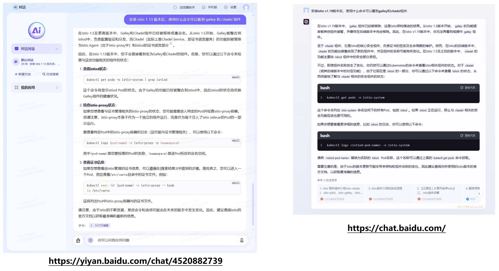

文言一心

在Istio v1.19版本中，galley组件已经被移除，这是Istio架构演进的结果。从Istio 1.5版本开始，galley的功能逐渐被其他组件接管，并最终在后续版本中完全移除。因此，在Istio v1.19版本中，你无法再看到或操作galley组件。


至于citadel组件，它是Istio的核心安全组件，负责证书的签发及生命周期的维护。然而，在Istio的后续版本中，citadel的功能也被整合到了新的组件中，并且组件的名称可能有所变化。在Istio 1.5及之后的版本中，citadel的功能主要由Istiod组件中的安全部分承担。


不过，即使组件名称发生了变化，你仍然可以通过Kubernetes的命令来查看Istio相关组件的状态。对于citadel（或其后续版本中的对应功能），由于它现在是Istiod的一部分，你可以通过以下命令来查看Istiod的状态，从而间接地了解与citadel相关的安全组件的状态：

```javascript
kubectl get pods -n istio-system
```

这个命令会列出istio-system命名空间下的所有Pod，包括Istiod。如果Istiod正在运行，那么与citadel相关的安全功能应该也是可用的。


如果你想要查看更详细的信息，比如Istiod的日志，你可以使用以下命令：

```javascript
kubectl logs <istiod-pod-name> -n istio-system
```

请将<istiod-pod-name>替换为实际的Istiod Pod名称，这个名称可以通过上面的kubectl get pods命令获取。


需要注意的是，由于Istio的版本更新可能会带来架构和组件名称的变化，因此建议查阅你所使用的Istio版本的官方文档，以获取最准确的信息。


AI对话

在Istio 1.5及更高版本中，Galley和Citadel组件已经被移除或重命名。从Istio 1.5开始，Galley被整合到istiod中，负责配置验证和分发，而Citadel（实际上是Citadel Service，即证书颁发服务）的功能则被替换为Istio Agent（位于istio-proxy中）和istiod的证书颁发部分。


因此，在Istio 1.13版本中，您不会直接看到名为Galley或Citadel的组件。但是，您可以通过以下命令来检查与这些功能相关的组件的状态：


1. 查看istiod状态：

```javascript
kubectl get pods -n istio-system | grep istiod
```

这个命令将显示istiod Pod的状态。由于Galley的功能已经被整合到istiod中，因此istiod的状态将反映Galley组件的健康状况。


2. 检查istio-proxy状态：

如果您想查看与证书管理相关的istio-proxy的状态，您可能需要进入特定的Pod并检查istio-proxy容器。但请注意，istio-proxy本身不作为一个独立的组件运行，而是作为每个注入了Istio sidecar的Pod的一部分运行。


要查看特定Pod中的istio-proxy容器的日志（这可能与证书管理相关），可以使用以下命令：

```javascript
kubectl logs <pod-name> -c istio-proxy -n <namespace>
```

其中<pod-name>是您要检查的Pod的名称，<namespace>是该Pod所在的命名空间。


3. 查看证书信息：

如果您想查看由Istio管理的证书信息，可以遵循在[搜索结果3]中提到的步骤。简而言之，您可以进入一个Pod，然后查看/etc/certs目录中的证书文件。例如：

```javascript
kubectl exec -it <pod-name> -c istio-proxy -- bash
ls /etc/certs
```

这将列出Pod中istio-proxy容器内的证书文件。


请注意，由于Istio的不断发展，某些命令和选项可能会在未来的版本中发生变化。因此，建议查阅Istio的官方文档以获取最准确和最新的信息。

