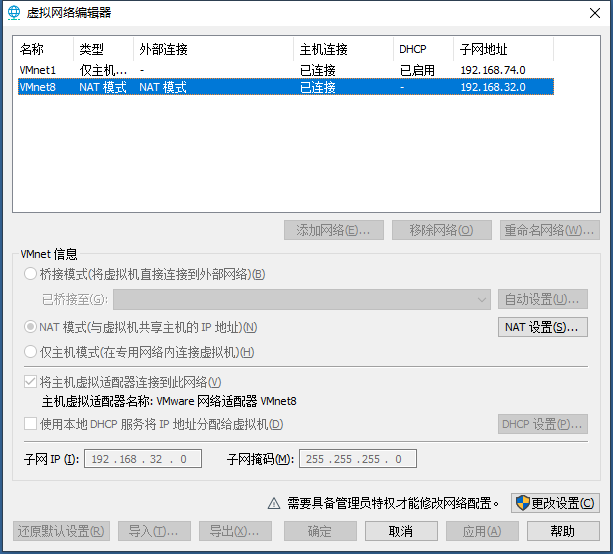
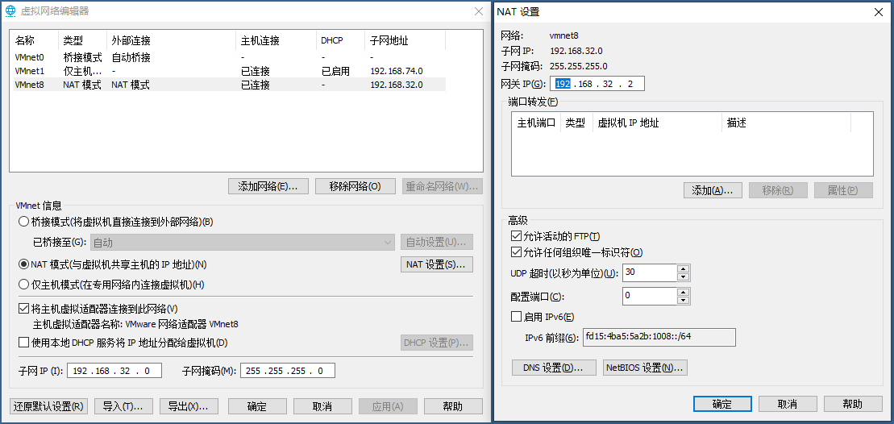

1. VMware 







[VMware Workstation Pro  网络备份](attachments/354593335B4845D6A931117FD9407121VMware Workstation Pro  网络备份)


2. 主机上配置网络

```javascript
// 添加如下配置
[root@localhost ~]# vi /etc/sysconfig/network-scripts/ifcfg-ens33
TYPE=Ethernet
PROXY_METHOD=none
BROWSER_ONLY=no
BOOTPROTO=static
DEFROUTE=yes
IPV4_FAILURE_FATAL=no
IPV6INIT=yes
IPV6_AUTOCONF=yes
IPV6_DEFROUTE=yes
IPV6_FAILURE_FATAL=no
IPV6_ADDR_GEN_MODE=stable-privacy
NAME=ens33
UUID=9202bdd4-f616-432a-8513-3416280f84c5
DEVICE=ens33
ONBOOT=yes
IPADDR=192.168.32.99
GATEWAY=192.168.32.2
NETMASK=255.255.255.0
DNS1=8.8.8.8
DNS2=114.114.114.114
DNS3=8.8.4.4

// 使配置生效
[root@localhost ~]# service network restart
Restarting network (via systemctl):                        [  OK  ]
```


